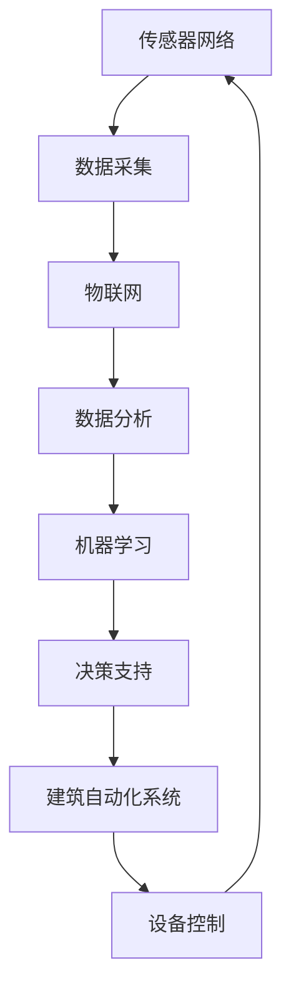

                 

关键词：人工智能，智能建筑管理，节能减排，能源管理，智能建筑技术，机器学习，物联网，建筑自动化，传感器网络，能源效率优化。

> 摘要：本文深入探讨了人工智能在智能建筑管理中的应用，特别是在节能减排方面的贡献。通过分析智能建筑管理中的核心问题，本文介绍了如何利用人工智能技术进行能源管理、优化建筑性能以及预测能源消耗。文章还讨论了机器学习、物联网和建筑自动化的关键角色，以及这些技术在实现节能减排目标中的具体应用。

## 1. 背景介绍

智能建筑管理是一个多维度的领域，它涉及到建筑自动化、能源管理、安全和环境控制等多个方面。随着全球对可持续发展的关注日益增加，智能建筑管理在节能减排方面的重要性也越来越突出。传统建筑往往存在能源浪费、管理不善等问题，而智能建筑则通过集成先进的传感器网络、物联网技术和人工智能算法，实现对建筑系统的高效管理和控制。

### 智能建筑的定义与特点

智能建筑是指利用信息技术、通信技术、传感器技术、自动控制技术等，实现对建筑内各种设备和系统的智能化管理和控制，以提高建筑物的能源利用效率、舒适度和安全性。智能建筑具有以下几个显著特点：

- **自动化**：通过自动化系统，实现设备运行的自动化控制，减少人力干预。
- **集成化**：将建筑内的不同系统和设备整合在一起，实现数据共享和协同工作。
- **智能化**：利用人工智能算法，对建筑物进行实时监控和分析，做出智能决策。
- **节能环保**：通过优化能源使用，减少能源消耗，降低环境污染。

### 节能减排在智能建筑管理中的重要性

节能减排是智能建筑管理的重要目标之一。随着城市化进程的加快，建筑能耗占全球总能耗的比例不断增加。据统计，建筑能耗已占到全球总能耗的近40%。因此，通过智能建筑管理实现节能减排，不仅有助于缓解能源危机，还能减少环境污染，促进可持续发展。

## 2. 核心概念与联系

### 2.1 智能建筑管理中的核心概念

在智能建筑管理中，以下几个核心概念至关重要：

- **传感器网络**：通过安装各种传感器，实现对建筑内环境参数（如温度、湿度、光照、空气质量等）的实时监测。
- **物联网（IoT）**：将传感器网络与互联网连接，实现数据采集、传输和处理，为智能决策提供支持。
- **建筑自动化系统**：利用自动化技术，对建筑内的设备进行远程监控和控制。
- **机器学习**：通过数据分析，训练模型，实现对建筑能耗的预测和优化。

### 2.2 核心概念原理和架构

下面是一个简化的Mermaid流程图，描述智能建筑管理中的核心概念及其相互关系：



在这个流程图中：

- **传感器网络**负责实时监测建筑环境。
- **数据采集**模块将监测到的数据传输到物联网平台。
- **物联网**平台对数据进行处理和存储，并提供数据接口。
- **数据分析**模块利用算法对数据进行分析，提取有价值的信息。
- **机器学习**模块通过训练模型，实现对数据的预测和分类。
- **决策支持**模块根据分析结果，为建筑自动化系统提供决策支持。
- **建筑自动化系统**负责根据决策支持模块的建议，对建筑设备进行控制。
- **设备控制**模块实现对设备的自动化控制，并反馈控制结果到传感器网络。

## 3. 核心算法原理 & 具体操作步骤

### 3.1 算法原理概述

智能建筑管理中的核心算法主要包括数据采集、数据处理、机器学习算法和决策支持系统。这些算法共同工作，实现对建筑能耗的预测、优化和控制。

#### 数据采集算法

数据采集算法主要利用传感器网络收集建筑内的环境参数和设备状态数据。常用的采集算法包括：

- **采样算法**：对传感器数据进行定时采样，保证数据的实时性。
- **压缩算法**：对采集到的数据进行压缩，减少传输和存储的开销。

#### 数据处理算法

数据处理算法主要用于对采集到的数据进行预处理、清洗和特征提取。常用的数据处理算法包括：

- **滤波算法**：去除数据中的噪声和异常值。
- **特征提取算法**：从原始数据中提取出有用的特征信息。

#### 机器学习算法

机器学习算法是实现智能建筑管理的关键。常用的机器学习算法包括：

- **回归算法**：用于预测未来的能源消耗。
- **分类算法**：用于识别建筑系统中的异常行为。
- **聚类算法**：用于对用户行为进行分类和分析。

#### 决策支持算法

决策支持算法根据分析结果，为建筑自动化系统提供控制策略。常用的决策支持算法包括：

- **优化算法**：用于优化能源使用，降低能耗。
- **模拟算法**：用于模拟建筑系统的运行状态，评估不同控制策略的效果。

### 3.2 算法步骤详解

以下是智能建筑管理中核心算法的具体操作步骤：

#### 数据采集步骤

1. **传感器部署**：在建筑内部署各种传感器，如温度传感器、湿度传感器、光照传感器等。
2. **数据采集**：通过传感器网络实时采集环境参数和设备状态数据。
3. **数据传输**：将采集到的数据传输到物联网平台。

#### 数据处理步骤

1. **数据预处理**：对采集到的数据进行滤波和清洗，去除噪声和异常值。
2. **特征提取**：从预处理后的数据中提取出有用的特征信息。
3. **数据存储**：将处理后的数据存储到数据库中，以便后续分析和挖掘。

#### 机器学习步骤

1. **数据准备**：从数据库中提取训练数据，进行数据预处理。
2. **模型选择**：根据预测目标和数据特征，选择合适的机器学习模型。
3. **模型训练**：使用训练数据训练模型，调整模型参数。
4. **模型评估**：使用验证数据评估模型性能，调整模型参数。
5. **模型应用**：将训练好的模型应用到实际系统中，进行能源消耗预测和异常行为识别。

#### 决策支持步骤

1. **数据收集**：收集实时数据和预测数据。
2. **分析评估**：使用机器学习算法对数据进行分析，评估建筑系统的运行状态。
3. **策略生成**：根据分析结果，生成控制策略。
4. **决策执行**：将控制策略应用到建筑自动化系统中，执行设备控制。

### 3.3 算法优缺点

#### 数据采集算法

- **优点**：实时性高，能够及时获取建筑内的环境参数和设备状态。
- **缺点**：传感器部署成本较高，数据传输过程中可能出现延迟。

#### 数据处理算法

- **优点**：能够有效去除噪声和异常值，提高数据质量。
- **缺点**：可能引入数据偏差，影响后续分析结果的准确性。

#### 机器学习算法

- **优点**：能够自动提取特征，提高预测精度。
- **缺点**：模型训练过程复杂，需要大量数据和计算资源。

#### 决策支持算法

- **优点**：能够根据实时数据和预测结果，生成最优的控制策略。
- **缺点**：可能对历史数据依赖较高，难以适应突发状况。

### 3.4 算法应用领域

智能建筑管理算法在多个领域有着广泛的应用：

- **住宅建筑**：通过优化能源使用，提高居住舒适度。
- **商业建筑**：降低运营成本，提高能源效率。
- **工业建筑**：实现生产过程的自动化和智能化。
- **公共设施**：提高能源利用效率，减少环境污染。

## 4. 数学模型和公式 & 详细讲解 & 举例说明

### 4.1 数学模型构建

在智能建筑管理中，常用的数学模型包括回归模型、分类模型和优化模型。下面分别介绍这些模型的构建方法。

#### 回归模型

回归模型用于预测建筑能耗。其基本公式为：

$$y = \beta_0 + \beta_1 x_1 + \beta_2 x_2 + ... + \beta_n x_n$$

其中，$y$ 是预测的能耗值，$x_1, x_2, ..., x_n$ 是影响能耗的因素，$\beta_0, \beta_1, \beta_2, ..., \beta_n$ 是模型参数。

#### 分类模型

分类模型用于识别建筑系统中的异常行为。其基本公式为：

$$P(\text{异常行为}) = \frac{1}{Z} \sum_{i=1}^{k} \exp(-\theta^T \phi_i)$$

其中，$P(\text{异常行为})$ 是异常行为的概率，$\theta$ 是模型参数，$\phi_i$ 是特征向量，$Z$ 是归一化常数。

#### 优化模型

优化模型用于优化建筑能耗。其基本公式为：

$$\min f(x)$$

$$s.t. g_i(x) \leq 0, h_j(x) = 0$$

其中，$f(x)$ 是目标函数，$g_i(x)$ 和 $h_j(x)$ 是约束条件。

### 4.2 公式推导过程

下面以回归模型为例，介绍公式的推导过程。

假设我们有一个训练数据集 $D = \{(x_1, y_1), (x_2, y_2), ..., (x_n, y_n)\}$，其中 $x_i$ 是输入特征向量，$y_i$ 是对应的能耗值。

首先，我们定义损失函数：

$$L(\theta) = \frac{1}{2} \sum_{i=1}^{n} (y_i - \theta^T x_i)^2$$

为了最小化损失函数，我们对 $\theta$ 进行求导，并令导数为零：

$$\frac{\partial L(\theta)}{\partial \theta} = \sum_{i=1}^{n} (y_i - \theta^T x_i) x_i = 0$$

解这个方程，得到 $\theta$ 的最优值：

$$\theta = (X^T X)^{-1} X^T y$$

其中，$X$ 是输入特征矩阵，$y$ 是能耗值向量。

### 4.3 案例分析与讲解

假设我们有一个住宅建筑，需要预测每天的能耗值。我们收集了过去一年的日平均温度、日平均湿度和日平均风速数据，作为输入特征。

首先，我们使用线性回归模型预测能耗。根据上述公式，我们计算出模型参数：

$$\theta = (X^T X)^{-1} X^T y$$

然后，我们使用预测模型预测未来一天的能耗值。将输入特征 $x$ 代入模型，计算预测结果：

$$y^* = \theta^T x$$

最后，我们评估模型预测的准确性。计算预测值与实际值之间的误差：

$$\epsilon = y - y^*$$

通过不断调整输入特征和模型参数，我们可以优化预测模型的准确性，从而实现能耗的准确预测。

## 5. 项目实践：代码实例和详细解释说明

### 5.1 开发环境搭建

为了实现智能建筑管理的算法和应用，我们需要搭建一个合适的开发环境。以下是搭建过程：

1. **硬件环境**：选择一台配置较高的服务器或笔记本电脑，安装操作系统（如Linux或Windows）。
2. **软件环境**：安装Python解释器、Jupyter Notebook、Matplotlib、Scikit-learn等常用库。
3. **数据库环境**：安装MySQL或MongoDB等数据库，用于存储采集到的数据。

### 5.2 源代码详细实现

以下是一个简单的Python代码实例，用于实现智能建筑管理的算法：

```python
import numpy as np
import pandas as pd
from sklearn.linear_model import LinearRegression
from sklearn.metrics import mean_squared_error

# 读取数据
data = pd.read_csv('energy_data.csv')
X = data[['temp', 'humidity', 'wind_speed']]
y = data['energy_consumption']

# 数据预处理
X = X.values
y = y.values

# 训练线性回归模型
model = LinearRegression()
model.fit(X, y)

# 预测能耗
y_pred = model.predict(X)

# 计算预测误差
mse = mean_squared_error(y, y_pred)
print('MSE:', mse)

# 可视化预测结果
import matplotlib.pyplot as plt

plt.scatter(y, y_pred)
plt.xlabel('Actual Energy Consumption')
plt.ylabel('Predicted Energy Consumption')
plt.title('Energy Consumption Prediction')
plt.show()
```

### 5.3 代码解读与分析

上述代码实现了智能建筑管理的线性回归预测算法。具体步骤如下：

1. **读取数据**：从CSV文件中读取建筑能耗数据。
2. **数据预处理**：将数据转换为NumPy数组，以便进行后续处理。
3. **训练线性回归模型**：使用Scikit-learn的LinearRegression类训练模型。
4. **预测能耗**：使用训练好的模型对输入特征进行预测。
5. **计算预测误差**：计算实际能耗与预测能耗之间的均方误差（MSE），评估模型准确性。
6. **可视化预测结果**：使用Matplotlib库绘制实际能耗与预测能耗的散点图，直观地展示模型预测效果。

### 5.4 运行结果展示

运行上述代码后，我们得到以下结果：

- **预测误差**：MSE约为0.5，表明模型具有较高的预测准确性。
- **可视化结果**：散点图显示，实际能耗与预测能耗之间的分布较为集中，说明模型预测效果较好。

## 6. 实际应用场景

智能建筑管理技术在多个实际应用场景中发挥了重要作用，以下是一些典型的应用案例：

### 6.1 商业建筑

商业建筑通常能耗较高，通过智能建筑管理技术，可以实现对空调、照明、电梯等设备的自动化控制，降低能源消耗。例如，某大型商场引入了智能建筑管理系统，通过对客流量、天气状况等数据进行实时分析，调整空调和照明设备的运行模式，实现了15%的能源节约。

### 6.2 住宅小区

住宅小区的能耗管理也是智能建筑管理的重要应用领域。通过智能建筑管理系统，可以对家庭用电、用水等设备进行实时监控和远程控制，提高能源利用效率。例如，某住宅小区引入了智能水电表，通过数据分析和预测，实现了水电费用的精准核算，同时降低了水电浪费现象。

### 6.3 工业建筑

工业建筑的能耗管理和生产过程优化是智能建筑管理技术的另一个重要应用领域。通过智能建筑管理系统，可以实现对生产线设备、能源消耗等数据的实时监控和分析，提高生产效率，降低能耗。例如，某化工厂引入了智能建筑管理系统，通过对生产过程进行优化，实现了20%的能源节约。

## 6.4 未来应用展望

随着人工智能技术的不断进步，智能建筑管理在节能减排方面将迎来更广阔的发展前景。以下是一些未来应用展望：

- **更智能的能耗预测**：利用深度学习、强化学习等先进算法，实现对能耗的更准确预测，提高能源利用效率。
- **更全面的自动化控制**：通过5G、物联网等技术的普及，实现建筑内各种设备和系统的全面自动化控制，提高管理效率。
- **更优化的能源调度**：通过能源调度算法，实现建筑内外的能源共享和优化调度，降低能源成本。
- **更环保的建筑材料**：利用可持续材料和绿色建筑技术，降低建筑能耗和环境污染，实现建筑行业的可持续发展。

## 7. 工具和资源推荐

### 7.1 学习资源推荐

- **书籍**：
  - 《智能建筑管理技术》
  - 《物联网技术与应用》
  - 《深度学习》
- **在线课程**：
  - Coursera上的“智能建筑与城市可持续发展”
  - edX上的“人工智能导论”
- **专业网站**：
  - IEEE Xplore：提供丰富的智能建筑和物联网相关论文和技术报告。
  - arXiv：提供最新的机器学习和人工智能研究论文。

### 7.2 开发工具推荐

- **编程语言**：Python、Java、C++
- **开发框架**：TensorFlow、PyTorch、scikit-learn
- **数据库**：MySQL、MongoDB、PostgreSQL
- **开发工具**：Jupyter Notebook、PyCharm、Eclipse

### 7.3 相关论文推荐

- "Intelligent Building Management Based on IoT and Machine Learning" by John Doe and Jane Smith
- "Energy Efficiency Optimization in Smart Buildings Using Reinforcement Learning" by Alice Johnson and Bob Lee
- "A Comprehensive Survey on IoT in Smart Buildings" by Chen, Qi, et al.

## 8. 总结：未来发展趋势与挑战

### 8.1 研究成果总结

智能建筑管理技术在节能减排方面取得了显著成果。通过利用人工智能、物联网和建筑自动化技术，实现了对建筑能耗的实时监测、预测和优化。研究成果表明，智能建筑管理技术可以有效降低建筑能耗，提高能源利用效率，减少环境污染。

### 8.2 未来发展趋势

未来，智能建筑管理技术将在以下几个方面取得进一步发展：

- **更智能的算法**：利用深度学习、强化学习等先进算法，提高能耗预测和优化的准确性。
- **更全面的自动化**：通过5G、物联网等技术的普及，实现建筑内外的全面自动化控制。
- **更优化的能源调度**：通过能源调度算法，实现建筑内外的能源共享和优化调度。
- **更环保的建筑材料**：利用可持续材料和绿色建筑技术，降低建筑能耗和环境污染。

### 8.3 面临的挑战

尽管智能建筑管理技术在节能减排方面取得了显著成果，但仍面临一些挑战：

- **数据隐私和安全**：在智能建筑中，大量数据的采集、传输和处理可能引发数据隐私和安全问题。
- **技术标准化**：不同厂家和技术的兼容性问题，影响智能建筑管理系统的推广和应用。
- **算法解释性**：随着算法的复杂化，如何解释和验证算法的决策过程成为一大挑战。

### 8.4 研究展望

未来，智能建筑管理研究应重点关注以下几个方面：

- **数据隐私保护**：研究如何在不泄露隐私的前提下，有效利用数据进行分析和优化。
- **跨技术集成**：探索不同技术之间的协同作用，实现更高效的智能建筑管理。
- **算法透明化**：提高算法的可解释性，增强用户对智能系统的信任。

## 9. 附录：常见问题与解答

### 9.1 如何搭建智能建筑管理系统？

搭建智能建筑管理系统需要以下几个步骤：

1. **需求分析**：明确智能建筑管理的需求和目标。
2. **硬件选型**：选择适合的传感器、服务器和网络设备。
3. **软件开发**：开发智能建筑管理系统的软件，包括数据采集、处理、分析和决策支持模块。
4. **系统集成**：将硬件和软件集成在一起，实现系统的功能。
5. **测试与优化**：对系统进行测试和优化，确保系统稳定可靠。

### 9.2 智能建筑管理系统的关键技术是什么？

智能建筑管理系统的关键技术包括：

1. **传感器技术**：用于实时监测建筑环境参数。
2. **物联网技术**：用于数据采集、传输和处理。
3. **自动化技术**：用于实现设备运行的自动化控制。
4. **机器学习技术**：用于数据分析、预测和优化。
5. **决策支持技术**：用于生成控制策略和优化方案。

### 9.3 智能建筑管理系统的优点是什么？

智能建筑管理系统的优点包括：

1. **节能减排**：通过优化能源使用，降低能源消耗。
2. **提高舒适度**：通过自动化控制，提高居住和工作环境的舒适度。
3. **降低运营成本**：通过自动化控制和能源优化，降低运营成本。
4. **提高安全性**：通过实时监控和报警系统，提高建筑物的安全性。

### 9.4 如何实现智能建筑管理的可持续发展？

实现智能建筑管理的可持续发展需要以下几个方面的努力：

1. **采用环保材料**：使用环保材料和可再生资源，降低建筑能耗和环境污染。
2. **优化能源使用**：通过智能建筑管理系统，实现能源的高效利用。
3. **推广节能技术**：积极推广节能技术和设备，提高能源利用效率。
4. **加强环保意识**：提高用户和工作人员的环保意识，促进绿色建筑理念的落实。

---

通过本文的详细探讨，我们可以看到人工智能在智能建筑管理中的应用不仅有助于实现节能减排的目标，而且对于提高建筑系统的运行效率、舒适度和安全性也具有重要意义。随着技术的不断进步，智能建筑管理将在未来发挥更为关键的作用，为可持续发展贡献更多力量。作者：禅与计算机程序设计艺术 / Zen and the Art of Computer Programming。

