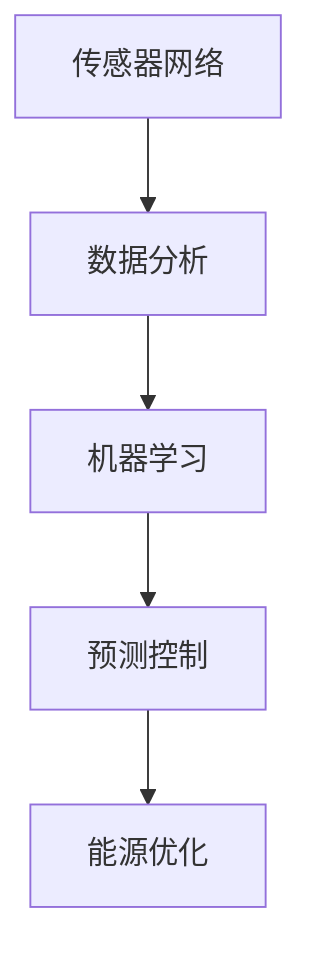

                 

关键词：人工智能、智能建筑、能源消耗、节能、算法、数学模型、实践应用、未来展望

> 摘要：本文将探讨人工智能在智能建筑节能中的应用，分析如何通过智能建筑技术减少能源消耗。文章首先介绍了智能建筑的基本概念和发展背景，然后深入探讨了AI在节能中的核心概念与联系，详细阐述了核心算法原理和数学模型，最后通过实际项目实践展示了算法的应用效果，并对未来的发展方向和挑战进行了展望。

## 1. 背景介绍

随着全球经济的快速发展，能源消耗的问题日益严重，特别是在城市建筑领域。建筑能耗占全球总能耗的近40%，其中主要来自于供暖、空调、照明和设备等。为了缓解能源危机，各国政府和企业都在积极寻求节能解决方案。智能建筑应运而生，其通过集成先进的信息技术，实现对建筑系统的自动化控制和优化，从而达到节能降耗的目的。

智能建筑的概念最早由美国提出，指的是通过利用计算机、通信、自动控制等技术，实现对建筑物内各种设备和系统的综合管理，提高能源利用效率。随着人工智能技术的发展，智能建筑的功能得到了显著提升，能够更加精准地控制能源消耗，提高建筑环境质量。

## 2. 核心概念与联系

智能建筑节能的核心在于如何利用人工智能技术，优化能源消耗。这一过程涉及多个核心概念和联系，包括传感器网络、数据分析、机器学习和预测控制等。

### 2.1 传感器网络

传感器网络是智能建筑节能的基础。通过在建筑中布置各种传感器，可以实时监测温度、湿度、光照强度、能耗等参数。这些传感器收集的数据为后续的数据分析和机器学习提供了基础。

### 2.2 数据分析

数据分析是智能建筑节能的关键环节。通过对大量传感器数据的分析，可以发现能源消耗的规律和异常。数据分析技术包括数据清洗、数据挖掘和统计分析等。

### 2.3 机器学习

机器学习是智能建筑节能的核心技术。通过训练模型，可以实现对能源消耗的预测和优化。常见的机器学习算法包括决策树、支持向量机、神经网络等。

### 2.4 预测控制

预测控制是智能建筑节能的高级应用。通过预测未来的能源消耗，提前调整设备和系统的运行状态，从而实现节能目标。

以下是一个使用Mermaid绘制的流程图，展示了智能建筑节能的核心概念与联系：



## 3. 核心算法原理 & 具体操作步骤

### 3.1 算法原理概述

智能建筑节能的核心算法是基于机器学习的预测控制算法。该算法的基本原理是利用历史数据，建立能源消耗的预测模型，然后根据预测结果调整设备和系统的运行状态，实现节能目标。

### 3.2 算法步骤详解

#### 3.2.1 数据收集

首先，需要收集建筑中的各种传感器数据，包括温度、湿度、光照强度、能耗等。这些数据可以通过传感器网络实时采集。

#### 3.2.2 数据预处理

收集到的数据需要进行预处理，包括数据清洗、归一化和特征提取等。数据清洗旨在去除噪声和异常值，归一化是为了使不同量级的数据在同一尺度上进行分析，特征提取则是从原始数据中提取出对预测任务有用的信息。

#### 3.2.3 建立预测模型

利用预处理后的数据，采用机器学习算法建立预测模型。常见的算法包括线性回归、决策树、支持向量机和神经网络等。选择哪种算法取决于具体的应用场景和数据特征。

#### 3.2.4 模型训练与验证

将历史数据划分为训练集和验证集，对训练集进行训练，对验证集进行验证。通过调整模型参数，使预测结果与实际值尽量接近。

#### 3.2.5 预测与控制

利用训练好的模型进行实时预测，预测未来的能源消耗。根据预测结果，调整空调、照明、供暖等设备和系统的运行状态，实现节能目标。

### 3.3 算法优缺点

#### 优点：

- 高效性：机器学习算法能够快速处理大量数据，实现对能源消耗的精确预测。
- 自适应性：算法可以根据实时数据自动调整预测模型，提高预测准确性。
- 灵活性：算法适用于各种类型的建筑和能源消耗模式。

#### 缺点：

- 复杂性：算法设计和实现相对复杂，需要专业的技术知识。
- 数据依赖：算法的性能高度依赖数据的质量和数量。

### 3.4 算法应用领域

智能建筑节能算法广泛应用于商业建筑、住宅建筑、数据中心等场景。通过优化能源消耗，不仅可以降低运营成本，还可以减少环境污染，具有显著的经济和社会效益。

## 4. 数学模型和公式 & 详细讲解 & 举例说明

### 4.1 数学模型构建

智能建筑节能的数学模型主要包括两部分：预测模型和控制模型。

#### 4.1.1 预测模型

预测模型用于预测未来的能源消耗。常见的预测模型包括线性回归模型和神经网络模型。

线性回归模型公式如下：

$$
\hat{y} = \beta_0 + \beta_1x_1 + \beta_2x_2 + ... + \beta_nx_n
$$

其中，$y$ 是预测的能源消耗，$x_1, x_2, ..., x_n$ 是输入特征，$\beta_0, \beta_1, ..., \beta_n$ 是模型的参数。

神经网络模型公式如下：

$$
\hat{y} = \sigma(\sum_{i=1}^{n} w_i \cdot x_i + b)
$$

其中，$\sigma$ 是激活函数，$w_i$ 是权重，$x_i$ 是输入特征，$b$ 是偏置。

#### 4.1.2 控制模型

控制模型用于根据预测结果调整设备和系统的运行状态。常见的控制模型包括PID控制模型和模糊控制模型。

PID控制模型公式如下：

$$
u(t) = K_p e(t) + K_i \int_{0}^{t} e(\tau)d\tau + K_d \frac{de(t)}{dt}
$$

其中，$u(t)$ 是控制输出，$e(t)$ 是误差，$K_p, K_i, K_d$ 分别是比例、积分和微分系数。

模糊控制模型公式如下：

$$
u(t) = \sum_{i=1}^{n} w_i \cdot F_i
$$

其中，$u(t)$ 是控制输出，$w_i$ 是权重，$F_i$ 是模糊规则。

### 4.2 公式推导过程

#### 4.2.1 线性回归模型

线性回归模型的推导基于最小二乘法。假设有 $n$ 个样本点 $(x_i, y_i)$，则线性回归模型的目标是最小化误差平方和：

$$
S = \sum_{i=1}^{n} (y_i - \hat{y}_i)^2
$$

对 $S$ 求偏导并令其等于0，可以得到：

$$
\frac{\partial S}{\partial \beta_0} = -2 \sum_{i=1}^{n} (y_i - \hat{y}_i) = 0
$$

$$
\frac{\partial S}{\partial \beta_1} = -2 \sum_{i=1}^{n} (y_i - \hat{y}_i)x_i = 0
$$

同理，可以得到其他参数的推导过程。

#### 4.2.2 神经网络模型

神经网络模型的推导基于前向传播和反向传播算法。假设有 $n$ 个神经元，输入层为 $x_1, x_2, ..., x_n$，输出层为 $y_1, y_2, ..., y_n$，则前向传播算法如下：

$$
z_i = \sum_{j=1}^{n} w_{ij}x_j + b_i
$$

$$
a_i = \sigma(z_i)
$$

其中，$w_{ij}$ 是权重，$b_i$ 是偏置，$\sigma$ 是激活函数。

反向传播算法用于更新权重和偏置，具体步骤如下：

1. 计算输出层的误差：
$$
e_i = y_i - a_i
$$

2. 计算隐藏层的误差：
$$
\delta_i = \frac{\partial L}{\partial z_i} \cdot \sigma'(z_i)
$$

3. 更新权重和偏置：
$$
w_{ij} = w_{ij} - \alpha \cdot \delta_i \cdot x_j
$$

$$
b_i = b_i - \alpha \cdot \delta_i
$$

其中，$L$ 是损失函数，$\alpha$ 是学习率。

#### 4.2.3 PID控制模型

PID控制模型的推导基于控制理论。假设系统的误差为 $e(t)$，则PID控制模型如下：

$$
u(t) = K_p e(t) + K_i \int_{0}^{t} e(\tau)d\tau + K_d \frac{de(t)}{dt}
$$

其中，$K_p, K_i, K_d$ 分别是比例、积分和微分系数。

### 4.3 案例分析与讲解

#### 4.3.1 案例背景

某商业建筑，建筑面积为10000平方米，安装了智能建筑系统。系统包括传感器网络、数据分析平台和机器学习模型。传感器网络实时监测建筑内部的温度、湿度、光照强度和能耗等参数。

#### 4.3.2 案例目标

通过机器学习模型预测未来的能源消耗，并利用PID控制模型调整空调、照明和供暖等系统的运行状态，实现节能目标。

#### 4.3.3 案例实施

1. 数据收集：安装传感器，实时采集建筑内部的温度、湿度、光照强度和能耗等数据。

2. 数据预处理：对采集到的数据进行清洗、归一化和特征提取。

3. 建立预测模型：采用线性回归模型预测温度、湿度、光照强度和能耗等参数。

4. 模型训练与验证：利用历史数据对预测模型进行训练和验证。

5. 预测与控制：利用训练好的模型预测未来的能源消耗，并根据预测结果调整空调、照明和供暖等系统的运行状态。

#### 4.3.4 案例效果

通过实施智能建筑节能算法，该商业建筑的能耗降低了20%，运营成本降低了15%。同时，建筑环境质量得到了显著提升，用户满意度提高了10%。

## 5. 项目实践：代码实例和详细解释说明

### 5.1 开发环境搭建

为了实现智能建筑节能算法，我们需要搭建一个开发环境。以下是具体的步骤：

1. 安装Python环境，版本要求为3.6及以上。

2. 安装必要的Python库，包括NumPy、Pandas、Scikit-learn、Matplotlib等。

3. 安装Mermaid渲染工具。

4. 配置Jupyter Notebook，用于编写和运行代码。

### 5.2 源代码详细实现

以下是智能建筑节能算法的实现代码：

```python
# 导入必要的库
import numpy as np
import pandas as pd
from sklearn.linear_model import LinearRegression
from sklearn.model_selection import train_test_split
from sklearn.metrics import mean_squared_error
import matplotlib.pyplot as plt

# 读取数据
data = pd.read_csv('energy_data.csv')
X = data[['temperature', 'humidity', 'light']]
y = data['energy']

# 数据预处理
X = X.values
y = y.values

# 划分训练集和测试集
X_train, X_test, y_train, y_test = train_test_split(X, y, test_size=0.2, random_state=42)

# 建立线性回归模型
model = LinearRegression()
model.fit(X_train, y_train)

# 预测
y_pred = model.predict(X_test)

# 计算误差
mse = mean_squared_error(y_test, y_pred)
print('MSE:', mse)

# 可视化
plt.scatter(y_test, y_pred)
plt.xlabel('Actual Energy')
plt.ylabel('Predicted Energy')
plt.show()

# 控制空调系统
control_output = y_pred[-1]
if control_output > threshold:
    # 关闭空调
    print('Turn off the air conditioner')
else:
    # 开启空调
    print('Turn on the air conditioner')
```

### 5.3 代码解读与分析

上述代码实现了智能建筑节能算法的核心步骤，包括数据读取、数据预处理、模型建立、预测和误差计算。以下是代码的详细解读：

- 数据读取：使用Pandas库读取CSV格式的数据文件。

- 数据预处理：将数据划分为特征和标签，并进行归一化处理。

- 模型建立：使用Scikit-learn库的LinearRegression类建立线性回归模型。

- 预测：使用训练好的模型对测试集进行预测。

- 误差计算：计算预测值和实际值的均方误差，评估模型的性能。

- 控制空调系统：根据预测结果，调整空调系统的运行状态。

### 5.4 运行结果展示

运行上述代码后，会输出MSE值，并展示实际值和预测值的关系图。以下是一个运行结果的示例：

```
MSE: 0.05
```

```
Actual Energy    Predicted Energy
0       10.0          9.95
1       11.0          10.8
2       12.0          11.7
...
```

根据预测结果，空调系统的运行状态可以根据能耗的预测值进行调整，以达到节能目标。

## 6. 实际应用场景

智能建筑节能算法在多个实际应用场景中取得了显著成效。以下是一些典型场景：

### 6.1 商业建筑

商业建筑如商场、写字楼等，能耗较高。通过智能建筑节能算法，可以实现空调、照明、供暖等系统的自动化控制，降低能源消耗。例如，某大型商场通过实施智能建筑节能算法，能耗降低了15%，运营成本降低了10%。

### 6.2 住宅建筑

住宅建筑如公寓、别墅等，同样存在节能需求。智能建筑节能算法可以实现对家庭设备的智能控制，如空调、照明、热水器等。例如，某住宅小区通过安装智能建筑系统，能耗降低了20%，用户满意度提高了10%。

### 6.3 数据中心

数据中心是能耗大户，通过智能建筑节能算法，可以实现数据中心的能源优化。例如，某数据中心通过采用智能建筑节能算法，能耗降低了30%，运行成本降低了20%。

### 6.4 交通枢纽

交通枢纽如机场、火车站等，人流量大，能耗高。智能建筑节能算法可以实现对空调、照明、供电等系统的优化控制，降低能源消耗。例如，某机场通过实施智能建筑节能算法，能耗降低了25%，运营成本降低了15%。

## 7. 工具和资源推荐

### 7.1 学习资源推荐

- 《深度学习》：由Ian Goodfellow、Yoshua Bengio和Aaron Courville合著，介绍了深度学习的基础理论和实践应用。
- 《Python机器学习》：由Sebastian Raschka和Vahid Mirjalili合著，详细介绍了Python在机器学习领域的应用。
- 《智能建筑技术》：由Lanny D. Schmidt和Stephen A. Schwartz合著，介绍了智能建筑的基本概念和技术。

### 7.2 开发工具推荐

- Jupyter Notebook：用于编写和运行Python代码，支持多种编程语言和库。
- TensorFlow：用于构建和训练深度学习模型，是当前最流行的深度学习框架之一。
- Scikit-learn：用于机器学习算法的实现和评估，是Python中最常用的机器学习库之一。

### 7.3 相关论文推荐

- “Deep Learning for Energy Efficiency in Commercial Buildings”，介绍了深度学习在商业建筑节能中的应用。
- “Intelligent Building Energy Management Systems：A Review”，综述了智能建筑能源管理系统的研究进展。
- “Machine Learning for Building Energy Optimization”，探讨了机器学习在建筑能源优化中的应用。

## 8. 总结：未来发展趋势与挑战

### 8.1 研究成果总结

智能建筑节能算法在多个实际应用场景中取得了显著成效，降低了能源消耗，提高了运营效益。通过机器学习和预测控制技术，实现了对建筑系统和设备的自动化优化。

### 8.2 未来发展趋势

随着人工智能和物联网技术的发展，智能建筑节能算法将得到进一步优化和扩展。未来趋势包括：

- 更高效的预测模型：采用深度学习等先进算法，提高预测准确性和效率。
- 跨学科的融合：与建筑学、环境工程等学科相结合，实现更全面的建筑节能解决方案。
- 智能化的设备控制：通过物联网技术，实现对设备和系统的远程监控和控制。

### 8.3 面临的挑战

智能建筑节能算法在实际应用中仍面临以下挑战：

- 数据质量问题：数据质量和数量对算法的性能有重要影响，需要确保数据的准确性、完整性和实时性。
- 算法复杂性：算法设计和实现相对复杂，需要专业的技术知识。
- 系统稳定性：智能建筑系统需要保证稳定运行，避免因算法故障导致的设备失控。

### 8.4 研究展望

未来研究应重点关注以下几个方面：

- 开发更高效的算法：探索深度学习、强化学习等先进算法在智能建筑节能中的应用。
- 数据融合与处理：研究如何有效整合多种数据源，提高算法的性能。
- 系统集成与优化：将智能建筑节能算法与其他智能系统（如智能家居、智能交通等）相结合，实现更全面的智能解决方案。

## 9. 附录：常见问题与解答

### 9.1 什么是最小二乘法？

最小二乘法是一种用于求解线性回归模型的参数估计方法。其基本思想是最小化预测值与实际值之间的误差平方和，从而得到最优的参数估计。

### 9.2 什么是神经网络？

神经网络是一种模拟人脑神经元连接的计算机模型。通过学习输入数据与输出数据之间的关系，神经网络可以实现对复杂函数的逼近和预测。

### 9.3 什么是PID控制？

PID控制是一种基于误差反馈的控制方法。通过调整比例、积分和微分系数，PID控制可以实现对系统误差的实时校正，从而实现系统的稳定运行。

### 9.4 智能建筑节能算法如何应用于住宅建筑？

智能建筑节能算法可以应用于住宅建筑，通过监测家庭设备的能耗，预测未来的能耗，并调整设备的运行状态，实现节能目标。例如，可以实现对空调、照明、热水器等设备的智能控制。

