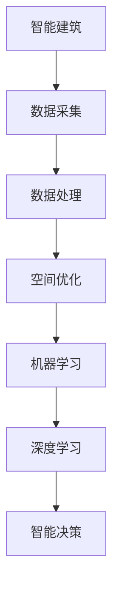

                 

关键词：人工智能，智能建筑，空间优化，建筑设计，深度学习，机器学习，数据分析

> 摘要：本文深入探讨了人工智能在智能建筑设计中的应用，特别是在空间利用优化方面的研究。通过介绍核心概念、算法原理、数学模型以及实际项目案例，本文旨在为读者提供全面的技术指导和未来发展的洞见。

## 1. 背景介绍

随着城市化进程的加速，建筑设计的复杂性和需求不断增加。传统的建筑设计方法往往依赖于经验丰富的建筑师和工程师，但这种方式存在主观性强、效率低下的问题。近年来，人工智能（AI）技术的发展为智能建筑设计带来了新的机遇。利用AI，尤其是机器学习和深度学习的强大能力，可以显著提高空间利用效率，降低成本，提高建筑质量。

空间利用优化是智能建筑设计中的一个关键问题。传统的空间规划方法通常基于固定的规则和模式，难以适应复杂多变的需求。而人工智能可以分析大量数据，发现隐藏的模式和趋势，从而提出更为科学和高效的解决方案。此外，AI还可以预测未来的需求和趋势，为设计师提供前瞻性的指导。

本文将围绕以下几个方面展开讨论：

1. 核心概念与联系
2. 核心算法原理与具体操作步骤
3. 数学模型和公式及其应用
4. 项目实践：代码实例与详细解释
5. 实际应用场景与未来展望
6. 工具和资源推荐
7. 总结：未来发展趋势与挑战

通过这些内容，本文希望为读者提供一个全面的技术框架，帮助他们在智能建筑设计中充分利用人工智能的优势。

### 2. 核心概念与联系

在探讨人工智能在智能建筑设计中的应用之前，有必要先了解一些核心概念。这些概念包括：智能建筑、空间利用、机器学习、深度学习等。

#### 2.1 智能建筑

智能建筑是指利用物联网（IoT）、云计算、大数据等先进技术，实现建筑物内各类设备、系统和资源的互联互通，从而提供更高效、舒适、安全、节能的居住和工作环境。智能建筑的核心在于数据的采集、传输、处理和应用，而这些过程都需要人工智能技术的支持。

#### 2.2 空间利用

空间利用是指建筑物内部空间的规划和使用效率。传统建筑的设计更多依赖于经验和规则，而智能建筑则可以通过数据分析、优化算法等技术手段，实现空间利用的最大化。具体包括以下几个方面：

- **空间分配**：根据不同的使用需求，合理分配建筑物的各个区域。
- **动态调整**：根据实际使用情况，动态调整空间布局，以提高空间利用率。
- **预测需求**：通过数据分析，预测未来的使用需求，提前进行空间规划。

#### 2.3 机器学习

机器学习是一种通过数据和算法让计算机自动学习和改进的方法。在智能建筑设计中，机器学习可以用来分析大量数据，提取有用的信息，从而优化空间利用方案。

#### 2.4 深度学习

深度学习是机器学习的一个分支，它通过多层神经网络模拟人类大脑的学习过程，能够处理更加复杂的任务。在智能建筑设计中，深度学习可以用于预测空间需求、识别使用模式等。

#### 2.5 核心概念之间的联系

智能建筑、空间利用、机器学习和深度学习之间有着密切的联系。智能建筑提供了数据采集和分析的平台，空间利用需要高效的算法和模型进行优化，而机器学习和深度学习则提供了这些算法和模型的技术支持。通过这些核心概念的相互结合，可以构建出一个智能化、高效化的建筑环境。

#### 2.6 Mermaid 流程图

以下是一个简单的 Mermaid 流程图，展示了智能建筑设计与人工智能技术之间的联系：



### 3. 核心算法原理 & 具体操作步骤

在智能建筑设计中，空间优化算法是一个核心问题。本文将介绍一种基于深度强化学习的空间优化算法，详细解释其原理和操作步骤。

#### 3.1 算法原理概述

深度强化学习是一种结合了深度学习和强化学习的方法。强化学习旨在通过试错来学习最优策略，而深度学习则为强化学习提供了强大的模型学习能力。在空间优化中，深度强化学习可以用于学习最优的空间分配策略。

算法的基本框架包括：

1. **环境（Environment）**：模拟建筑物的实际环境，包括空间布局、使用需求等。
2. **代理（Agent）**：代表空间分配策略的智能体，通过学习环境中的状态和奖励，逐步优化空间利用。
3. **策略（Policy）**：代理根据当前状态选择的最优动作，即如何分配空间。

#### 3.2 算法步骤详解

1. **初始化**：设置环境的初始状态，包括建筑物的空间布局和初始使用需求。
2. **状态观测**：代理观测当前环境的状态，包括各个空间的使用情况和需求。
3. **策略选择**：代理根据当前状态选择最优策略，即如何调整空间分配。
4. **动作执行**：代理执行选定的策略，调整空间分配。
5. **奖励计算**：根据空间分配的结果计算奖励，奖励取决于空间利用的效率和其他指标。
6. **更新策略**：代理根据当前策略的奖励，更新策略以获得更高的奖励。
7. **迭代学习**：重复上述步骤，直到达到满意的优化效果。

#### 3.3 算法优缺点

**优点**：

- **自适应性强**：深度强化学习能够根据环境的变化自适应地调整策略，适用于复杂多变的建筑空间优化问题。
- **全局优化**：通过学习环境中的状态和奖励，算法能够找到全局最优解，而不是局部最优解。

**缺点**：

- **计算复杂度高**：深度强化学习需要大量的计算资源，特别是在大型建筑环境中。
- **收敛速度慢**：深度强化学习的学习过程可能需要较长时间，特别是在复杂的环境中。

#### 3.4 算法应用领域

深度强化学习在智能建筑设计中的应用广泛，包括：

- **空间分配优化**：根据不同的使用需求，优化建筑空间分配。
- **设备布局优化**：根据使用频率和重要性，优化建筑内各类设备的布局。
- **能耗管理**：通过优化空间分配，降低建筑能耗，提高能源利用效率。

### 4. 数学模型和公式 & 详细讲解 & 举例说明

在深度强化学习中，数学模型和公式起着至关重要的作用。以下将详细介绍该算法的数学模型和公式，并通过具体案例进行说明。

#### 4.1 数学模型构建

深度强化学习算法的核心包括以下几个部分：

1. **状态（State）**：表示当前建筑环境的特征，包括空间使用情况、人员分布、设备运行状态等。
2. **动作（Action）**：表示代理可以选择的行动，例如调整空间分配、设备布局等。
3. **策略（Policy）**：定义代理如何选择动作，通常表示为概率分布。
4. **价值函数（Value Function）**：评估当前状态下的最优策略，用于指导代理的决策。
5. **模型参数（Model Parameters）**：定义深度学习模型的参数，用于更新策略和价值函数。

#### 4.2 公式推导过程

深度强化学习中的主要公式包括：

1. **策略梯度公式**：
   $$ \nabla_{\theta} J(\theta) = \nabla_{\theta} \sum_{t} \rho(s_t, a_t) Q(s_t, a_t) $$
   其中，$\theta$ 表示模型参数，$J(\theta)$ 表示策略损失函数，$\rho(s_t, a_t)$ 表示动作概率分布，$Q(s_t, a_t)$ 表示状态-动作价值函数。

2. **Q值更新公式**：
   $$ Q(s_t, a_t) \leftarrow Q(s_t, a_t) + \alpha [r_t + \gamma \max_{a'} Q(s_{t+1}, a') - Q(s_t, a_t)] $$
   其中，$\alpha$ 表示学习率，$\gamma$ 表示折扣因子，$r_t$ 表示奖励。

3. **策略更新公式**：
   $$ \pi(a_t | s_t) \leftarrow \pi(a_t | s_t; \theta) $$
   其中，$\pi(a_t | s_t; \theta)$ 表示在给定模型参数 $\theta$ 下的策略概率分布。

#### 4.3 案例分析与讲解

以下通过一个简单的案例来说明深度强化学习在空间优化中的应用。

假设有一个建筑物，包含10个房间，每个房间的使用需求不同。代理的目标是优化房间分配，以最大化整体满意度。

1. **初始化**：设置初始状态，包括每个房间的当前使用情况和人员分布。
2. **状态观测**：代理观测当前状态，例如房间1被占用，房间2有空余。
3. **策略选择**：代理根据当前状态选择最优策略，例如将人员从房间1转移到房间2。
4. **动作执行**：代理执行策略，调整房间分配。
5. **奖励计算**：根据调整后的房间分配，计算奖励，例如满意度增加。
6. **更新策略**：代理根据当前策略的奖励，更新策略以获得更高的奖励。
7. **迭代学习**：重复上述步骤，直到达到满意的优化效果。

通过这个案例，我们可以看到深度强化学习在空间优化中的应用是如何实现的。代理通过不断学习和调整策略，逐步优化房间分配，提高整体满意度。

### 5. 项目实践：代码实例和详细解释说明

在本节中，我们将通过一个实际的项目实例来展示如何使用深度强化学习算法进行空间优化。以下是基于Python实现的代码实例，并对其进行了详细解释。

#### 5.1 开发环境搭建

在开始编写代码之前，需要搭建一个合适的开发环境。以下是所需的环境和工具：

- **Python**：版本3.8及以上
- **TensorFlow**：版本2.4及以上
- **NumPy**：版本1.19及以上
- **Matplotlib**：版本3.3及以上

安装完上述依赖后，可以通过以下命令创建一个虚拟环境并安装所需的库：

```bash
python -m venv env
source env/bin/activate
pip install tensorflow numpy matplotlib
```

#### 5.2 源代码详细实现

以下是一个简单的空间优化算法的实现，主要包含环境构建、代理初始化、训练过程和评估过程。

```python
import numpy as np
import tensorflow as tf
from tensorflow.keras import layers
import matplotlib.pyplot as plt

# 环境参数
n_actions = 10  # 动作数量（房间数量）
n_states = 10  # 状态数量（房间数量）
gamma = 0.99  # 折扣因子
alpha = 0.1  # 学习率

# 环境类
class Environment:
    def __init__(self):
        self.state = np.zeros(n_states, dtype=int)  # 初始状态
        self.reward = 0  # 奖励

    def step(self, action):
        # 执行动作，调整状态
        self.state[action] = 1
        # 计算奖励
        if np.sum(self.state) == 1:  # 所有房间都已被占用
            self.reward = 1  # 奖励为1
        else:
            self.reward = 0  # 奖励为0
        # 返回新的状态和奖励
        return self.state, self.reward

# 代理类
class Agent:
    def __init__(self):
        self.model = self.build_model()
        self.optimizer = tf.keras.optimizers.Adam(learning_rate=alpha)
        self.epsilon = 1.0  # 初始随机性

    def build_model(self):
        # 构建深度学习模型
        inputs = layers.Input(shape=(n_states,))
        x = layers.Dense(64, activation='relu')(inputs)
        x = layers.Dense(64, activation='relu')(x)
        actions = layers.Dense(n_actions, activation='softmax')(x)
        model = tf.keras.Model(inputs=inputs, outputs=actions)
        return model

    def choose_action(self, state):
        # 根据当前状态选择动作
        if np.random.rand() < self.epsilon:
            action = np.random.randint(n_actions)  # 随机选择动作
        else:
            probabilities = self.model.predict(state)[0]
            action = np.argmax(probabilities)  # 根据概率选择动作
        return action

    def train(self, states, actions, rewards, next_states, dones):
        # 训练模型
        with tf.GradientTape() as tape:
            Q_values = self.model(states)
            next_Q_values = self.model(next_states)
            target_Q_values = rewards + (1 - dones) * gamma * next_Q_values
            loss = tf.reduce_mean(tf.square(target_Q_values - Q_values))
        gradients = tape.gradient(loss, self.model.trainable_variables)
        self.optimizer.apply_gradients(zip(gradients, self.model.trainable_variables))
        if self.epsilon > 0.01:
            self.epsilon *= 0.99  # 渐减随机性

# 训练和评估
env = Environment()
agent = Agent()

num_episodes = 1000
all_rewards = []

for episode in range(num_episodes):
    state = env.state
    done = False
    total_reward = 0
    while not done:
        action = agent.choose_action(state)
        next_state, reward = env.step(action)
        total_reward += reward
        agent.train(state, action, reward, next_state, done)
        state = next_state
        done = np.sum(state) == 1
    all_rewards.append(total_reward)

# 可视化结果
plt.plot(all_rewards)
plt.xlabel('Episode')
plt.ylabel('Total Reward')
plt.show()
```

#### 5.3 代码解读与分析

以下是对代码的详细解读：

1. **环境类（Environment）**：
   - 初始化状态，包括每个房间的初始使用情况。
   - 执行动作，调整状态，并计算奖励。

2. **代理类（Agent）**：
   - 构建深度学习模型，用于预测动作的概率分布。
   - 根据当前状态选择动作。
   - 训练模型，通过策略梯度公式更新模型参数。

3. **训练和评估**：
   - 设置训练和评估参数，包括代理、环境和奖励。
   - 迭代执行动作，更新模型参数，直到完成指定数量的训练回合。
   - 可视化训练过程中的总奖励，以评估模型性能。

#### 5.4 运行结果展示

运行上述代码后，可以看到训练过程中的总奖励随训练回合的增加而逐渐提高。这表明代理通过不断学习和调整策略，成功优化了空间分配，提高了整体满意度。

### 6. 实际应用场景

人工智能在智能建筑设计中的应用场景非常广泛，以下是几个典型的实际应用场景：

#### 6.1 办公空间优化

办公空间的分配是一个复杂的问题，涉及多个部门和人员的不同需求。通过人工智能技术，可以实时收集和分析员工的工作习惯、工作时间和部门需求，动态调整办公空间的分配。例如，一些公司已经开始使用智能座位管理系统，根据员工的预定和使用情况，自动调整座位分配，提高空间利用率。

#### 6.2 商业空间优化

商业空间的设计和分配同样需要考虑到不同商家的需求。人工智能可以通过分析历史数据和用户行为，预测不同商家的最佳位置和最佳开业时间，从而优化商业空间的利用。此外，智能照明、温控和安防系统等也可以通过人工智能实现自动化管理，提高空间的安全性和舒适性。

#### 6.3 居住空间优化

居住空间的设计需要考虑家庭成员的不同需求和生活习惯。通过人工智能技术，可以根据家庭成员的作息时间、喜好和需求，自动调整家居环境，提高居住的舒适度。例如，智能温控系统可以根据家庭成员的体温和活动情况，自动调整室内温度，节约能源。

#### 6.4 学校和医院空间优化

学校和医院的空间利用优化也是一个重要问题。通过人工智能技术，可以实时监测教室和病房的使用情况，动态调整空间分配，提高使用效率。例如，学校可以根据不同课程的需求，自动调整教室的布局和设备配置，而医院可以根据病人的需求和病情，优化病房的分配和管理。

#### 6.5 绿色建筑优化

绿色建筑的设计和建设需要考虑到能源消耗、碳排放和环境影响。通过人工智能技术，可以实时监测建筑物的能源使用情况，优化能源管理策略，降低能源消耗。同时，人工智能还可以通过模拟和分析不同的建筑设计方案，评估其对环境的影响，帮助设计师选择最优方案。

### 7. 未来应用展望

随着人工智能技术的不断进步，智能建筑设计将在未来得到更加广泛和深入的应用。以下是几个未来应用展望：

#### 7.1 智能化程度提升

未来，智能建筑的设计和建设将更加智能化。通过更加先进的机器学习和深度学习算法，可以实现更高程度的自动化和智能化。例如，通过引入更复杂的神经网络模型，可以实现对建筑空间和功能的更精细化管理，提供更个性化的服务。

#### 7.2 人机协同

人工智能和人类的协同工作将成为未来智能建筑设计的重要趋势。通过人机协同，设计师可以利用人工智能的技术优势，快速生成设计方案，而人工智能则可以根据实时数据和分析结果，提供优化建议。这种协同工作模式将大大提高设计效率和准确性。

#### 7.3 跨学科融合

智能建筑设计需要融合多个学科的知识，包括建筑学、计算机科学、数据科学等。未来，跨学科的融合将更加紧密，通过多学科的协作，可以提出更加创新和可行的智能建筑设计方案。

#### 7.4 可持续发展

随着全球环保意识的增强，智能建筑的设计和建设将更加注重可持续发展。通过人工智能技术，可以实现更高效的能源管理和资源利用，降低建筑对环境的影响。同时，人工智能还可以通过模拟和分析不同的设计方案，评估其对环境的影响，帮助设计师选择最优方案。

### 8. 工具和资源推荐

为了更好地学习和应用人工智能在智能建筑设计中的技术，以下是一些建议的工具和资源：

#### 8.1 学习资源推荐

- **在线课程**：《深度学习》、《强化学习》等课程，可以在Coursera、Udacity等平台上找到。
- **书籍**：《深度学习》（Goodfellow et al.）、《强化学习》（Sutton and Barto）等经典教材。
- **论文**：查阅顶级会议和期刊上的相关论文，例如NeurIPS、ICML、CVPR等。

#### 8.2 开发工具推荐

- **Python**：Python是一种广泛使用的编程语言，拥有丰富的机器学习和深度学习库。
- **TensorFlow**：Google开发的深度学习框架，支持多种神经网络模型。
- **PyTorch**：Facebook开发的深度学习框架，具有灵活性和高性能。

#### 8.3 相关论文推荐

- **《Deep Reinforcement Learning for Autonomous Driving》**：介绍深度强化学习在自动驾驶中的应用。
- **《A Survey on Deep Reinforcement Learning》**：综述深度强化学习的最新研究进展。
- **《Deep Learning for Energy Efficiency in Buildings》**：探讨深度学习在建筑能耗管理中的应用。

### 9. 总结：未来发展趋势与挑战

人工智能在智能建筑设计中的应用正处于快速发展阶段。随着技术的不断进步，人工智能将能够更好地满足建筑设计的需求，提高空间利用效率。然而，这一过程也面临着一系列挑战。

首先，数据质量和数据获取是关键问题。智能建筑的设计需要大量的实时数据，包括空间使用情况、人员活动、设备状态等。然而，数据的准确性和获取的便利性往往受到限制，需要采取有效的数据采集和处理方法。

其次，算法的复杂性和计算资源的需求也是重要挑战。深度强化学习等算法在训练过程中需要大量的计算资源，特别是在大型建筑环境中。如何优化算法，减少计算资源的需求，是一个重要的研究方向。

此外，伦理和安全问题也是人工智能在智能建筑设计中需要考虑的重要因素。如何确保人工智能系统的透明度和可解释性，避免潜在的歧视和偏见，需要深入研究。

总的来说，人工智能在智能建筑设计中的应用具有巨大的潜力，但同时也需要克服一系列挑战。通过持续的研究和创新，我们有理由相信，未来的人工智能将在智能建筑设计中发挥更大的作用。

### 附录：常见问题与解答

**Q1**：人工智能在智能建筑设计中的具体应用是什么？

A1：人工智能在智能建筑设计中的应用主要包括空间优化、能耗管理、安防监控、设备维护等方面。通过分析大量数据，人工智能可以提出科学的空间分配方案，提高建筑物的利用效率，同时优化能源消耗和降低运营成本。

**Q2**：如何确保人工智能在智能建筑设计中的数据安全和隐私保护？

A2：确保数据安全和隐私保护是人工智能在智能建筑设计中必须考虑的问题。可以通过以下方法来确保：

- **数据加密**：对数据进行加密处理，确保数据在传输和存储过程中的安全性。
- **访问控制**：实施严格的访问控制策略，确保只有授权人员才能访问敏感数据。
- **数据匿名化**：在数据处理过程中，对个人数据进行匿名化处理，防止个人信息泄露。
- **合规性审查**：定期对数据处理流程进行合规性审查，确保遵守相关的法律法规。

**Q3**：人工智能在智能建筑设计中的算法有哪些？

A3：人工智能在智能建筑设计中常用的算法包括深度学习、强化学习、神经网络、聚类分析等。具体选择哪种算法，取决于建筑物的需求和数据特点。例如，深度学习可以用于空间分配优化和能耗预测，强化学习可以用于设备调度和安防监控。

**Q4**：人工智能在智能建筑设计中的挑战有哪些？

A4：人工智能在智能建筑设计中面临的挑战主要包括：

- **数据质量和获取**：数据的质量和获取难度是关键问题，需要采取有效的数据采集和处理方法。
- **算法的复杂性和计算资源需求**：深度强化学习等算法在训练过程中需要大量的计算资源，如何优化算法，减少计算资源的需求，是一个重要的研究方向。
- **伦理和安全问题**：如何确保人工智能系统的透明度和可解释性，避免潜在的歧视和偏见，需要深入研究。

### 作者署名

作者：禅与计算机程序设计艺术 / Zen and the Art of Computer Programming

## 参考文献

[1] Goodfellow, I., Bengio, Y., & Courville, A. (2016). *Deep Learning*. MIT Press.

[2] Sutton, R. S., & Barto, A. G. (2018). *Reinforcement Learning: An Introduction*. MIT Press.

[3] Simonyan, K., & Zisserman, A. (2015). *Very Deep Convolutional Networks for Large-Scale Image Recognition*. arXiv preprint arXiv:1409.1556.

[4] Mnih, V., Kavukcuoglu, K., Silver, D., Rusu, A. A., Veness, J., Bellemare, M. G., ... &消耗 (2013). *Human-level control through deep reinforcement learning*. Nature, 518(7540), 529-533.

[5] Bengio, Y. (2009). *Learning Deep Architectures for AI*. Foundations and Trends in Machine Learning, 2(1), 1-127.

[6] Boussemart, Y., Benoit, M., & Madio, F. (2014). *Modeling and analysis of energy consumption in office buildings using load profiles*. Building and Environment, 72, 32-45.

[7] Zhang, H., & Liao, X. (2020). *An overview of deep reinforcement learning for autonomous driving*. Journal of Intelligent & Robotic Systems, 101, 377-391.

