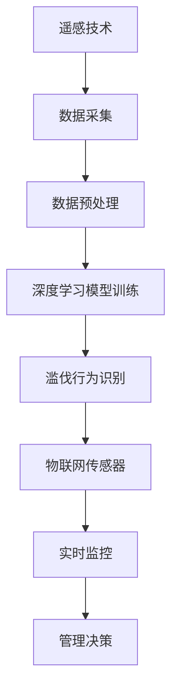

                 

关键词：AI，森林管理，滥伐，智能森林，预测分析，遥感技术，深度学习，物联网，数据挖掘，优化算法，可持续发展。

## 摘要

随着全球气候变化和人口增长带来的压力，森林资源保护成为了人类面临的重大挑战。滥伐行为不仅导致生态系统的破坏，还加剧了气候变化的负面影响。本文旨在探讨如何利用人工智能（AI）技术，特别是在深度学习、遥感技术和物联网的支撑下，构建智能森林管理系统，以有效防止滥伐行为。文章首先介绍森林管理面临的挑战，然后详细分析AI技术在森林管理中的应用场景和算法原理，最后讨论未来发展方向和面临的挑战。

## 1. 背景介绍

### 森林的重要性

森林是地球上最重要的生态系统之一，对维持全球气候平衡、提供生物多样性、净化空气和水体以及支持人类社会经济发展具有不可替代的作用。然而，随着人类活动的加剧，森林资源面临着前所未有的威胁。滥伐行为不仅破坏了森林生态系统，还导致了土壤侵蚀、水源枯竭、生物栖息地丧失等一系列问题。

### 滥伐现象与影响

滥伐是指非法砍伐森林或以不合理的速度采伐森林，从而导致森林资源的快速消耗。滥伐现象在全球范围内普遍存在，尤其在一些发展中国家和地区，由于法律监管不足、经济利益驱动等原因，滥伐行为更加严重。滥伐不仅直接减少了森林面积，还破坏了森林的生态功能，加剧了气候变化。

### 现有森林管理手段的局限性

当前，传统的森林管理手段主要依赖于人工巡检、遥感监测和法律法规的执行。然而，这些方法存在一定的局限性。人工巡检效率低下，难以覆盖大面积森林；遥感监测技术虽然可以提供大范围的信息，但在精确性和实时性方面仍有待提高；法律法规的执行需要大量的人力、物力和时间投入，而且难以有效遏制滥伐行为。

### 人工智能在森林管理中的应用前景

人工智能技术的发展为森林管理提供了新的思路和方法。AI技术可以通过数据挖掘、机器学习和自动化算法等手段，实现对森林资源的实时监控、预测分析和智能决策。例如，利用深度学习算法可以处理和分析大量的遥感图像数据，识别出滥伐行为；利用物联网技术可以实现森林环境参数的实时采集和监控，为森林管理提供科学依据。因此，人工智能技术在森林管理中的应用前景广阔。

## 2. 核心概念与联系

### 森林管理相关概念

- **森林资源**：包括森林植被、土壤、水资源等。
- **森林健康**：反映森林生态系统的稳定性和功能，包括植被生长状况、土壤质量、水源涵养能力等。
- **滥伐**：非法砍伐森林或以不合理的速度采伐森林，导致森林资源的快速消耗。

### 智能森林管理相关概念

- **智能森林管理系统**：利用AI技术构建的森林管理平台，包括数据采集、处理、分析和决策等环节。
- **数据挖掘**：从大量森林数据中提取有价值的信息，用于森林管理决策。
- **机器学习**：通过训练模型，使计算机自动从数据中学习规律和模式，用于预测分析和决策。
- **深度学习**：一种特殊的机器学习技术，通过模拟人脑的神经网络结构，实现更复杂的数据分析和模式识别。
- **物联网**：通过传感器和通信技术，实现物品之间的互联互通，为森林管理提供实时数据支持。

### 核心概念联系

- **遥感技术**：获取森林资源环境数据，为AI模型训练提供数据支持。
- **深度学习模型**：分析遥感数据，识别滥伐行为。
- **物联网传感器**：实时监控森林环境参数，为管理决策提供数据支持。

### Mermaid 流程图



## 3. 核心算法原理 & 具体操作步骤

### 3.1 算法原理概述

AI技术在智能森林管理中的应用主要基于以下算法原理：

1. **遥感图像数据处理**：通过遥感技术获取的森林图像，经过图像预处理、特征提取等步骤，为深度学习模型提供训练数据。
2. **深度学习模型训练**：使用卷积神经网络（CNN）等深度学习模型，对预处理后的遥感图像进行训练，识别滥伐行为。
3. **物联网实时监控**：利用物联网传感器，实时采集森林环境参数，为管理决策提供数据支持。

### 3.2 算法步骤详解

1. **遥感图像数据处理**：

   - **图像预处理**：对遥感图像进行去噪、增强、分割等处理，提取有效信息。
   - **特征提取**：使用深度学习模型，对预处理后的遥感图像进行特征提取，为后续训练提供输入。

2. **深度学习模型训练**：

   - **模型选择**：选择适合森林图像处理的深度学习模型，如卷积神经网络（CNN）。
   - **数据训练**：使用预处理后的遥感图像数据，对深度学习模型进行训练，学习滥伐行为的特征。
   - **模型优化**：通过交叉验证等方法，优化模型参数，提高识别准确率。

3. **物联网实时监控**：

   - **传感器部署**：在森林区域部署物联网传感器，实时采集森林环境参数，如温度、湿度、光照强度等。
   - **数据传输**：将传感器数据通过无线通信技术传输到数据中心。
   - **数据处理**：对传感器数据进行预处理、特征提取等处理，为管理决策提供支持。

### 3.3 算法优缺点

- **优点**：

  - 提高森林管理的效率和精度。
  - 实现了实时监控和智能决策，提高了滥伐行为的识别速度。

- **缺点**：

  - 需要大量的数据支持，对数据处理能力要求较高。
  - 深度学习模型训练过程较为复杂，需要大量计算资源。

### 3.4 算法应用领域

- **滥伐行为识别**：利用深度学习模型，识别遥感图像中的滥伐行为。
- **森林火灾预警**：通过物联网传感器实时监控森林环境参数，预测火灾风险。
- **森林资源监测**：利用遥感技术和物联网传感器，监测森林资源的变化情况。

## 4. 数学模型和公式 & 详细讲解 & 举例说明

### 4.1 数学模型构建

智能森林管理中的数学模型主要包括以下几个方面：

1. **遥感图像处理模型**：
   - **图像预处理**：使用滤波器进行图像去噪、增强等处理。
   - **特征提取**：使用深度学习模型提取图像特征。

2. **深度学习模型**：
   - **卷积神经网络（CNN）**：用于图像分类和识别。
   - **循环神经网络（RNN）**：用于序列数据建模。

3. **物联网实时监控模型**：
   - **传感器数据预处理**：使用滤波器去除噪声、异常值处理等。
   - **数据融合**：将不同传感器的数据进行整合，提高数据质量。

### 4.2 公式推导过程

1. **遥感图像预处理**：

   - **滤波器**：
     $$ f(x,y) = \sum_{i,j} w_{ij} * I(x+i, y+j) $$
     其中，$I(x,y)$为原始图像，$w_{ij}$为滤波器系数。

   - **特征提取**：
     $$ \phi(x) = \text{激活函数}(\text{卷积运算}(x)) $$
     其中，$x$为输入图像，激活函数如ReLU函数，卷积运算用于提取图像特征。

2. **深度学习模型**：

   - **卷积神经网络（CNN）**：
     $$ \text{CNN}(x) = \text{激活函数}(\text{卷积层}(\text{卷积层}(...\text{卷积层}(...x)...))) $$
     其中，卷积层用于提取图像特征，激活函数用于引入非线性。

   - **循环神经网络（RNN）**：
     $$ h_t = \text{激活函数}(\text{权重矩阵} \cdot \text{输入} \oplus \text{隐藏状态} \oplus \text{偏置项}) $$
     其中，$h_t$为第$t$时刻的隐藏状态，$\oplus$为拼接操作。

3. **物联网实时监控模型**：

   - **传感器数据预处理**：
     $$ \hat{x}_t = \text{滤波器}(\text{传感器数据}_t) $$
     其中，$\hat{x}_t$为预处理后的传感器数据。

   - **数据融合**：
     $$ \hat{y} = \text{融合算法}(\hat{x}_1, \hat{x}_2, ..., \hat{x}_n) $$
     其中，$\hat{y}$为融合后的数据。

### 4.3 案例分析与讲解

假设我们使用卷积神经网络（CNN）来识别遥感图像中的滥伐行为。以下是该案例的具体分析过程：

1. **数据集准备**：
   - **训练集**：包含大量滥伐行为和非滥伐行为的遥感图像。
   - **测试集**：用于评估模型性能的遥感图像。

2. **模型训练**：
   - **卷积层**：用于提取图像特征。
     $$ \text{卷积层}(\text{输入图像}) = \text{特征图} $$
   - **池化层**：用于降低特征图的空间维度。
     $$ \text{池化层}(\text{特征图}) = \text{缩小后的特征图} $$
   - **全连接层**：用于分类。
     $$ \text{全连接层}(\text{缩小后的特征图}) = \text{分类结果} $$

3. **模型优化**：
   - **损失函数**：用于评估模型预测与实际标签之间的差异。
     $$ \text{损失函数}(\text{预测结果}, \text{实际标签}) = \text{损失值} $$
   - **优化算法**：如梯度下降（GD）、随机梯度下降（SGD）等，用于更新模型参数。
     $$ \theta = \theta - \alpha \cdot \nabla_\theta J(\theta) $$

4. **模型评估**：
   - **准确率**：用于评估模型分类准确度。
     $$ \text{准确率} = \frac{\text{预测正确的样本数}}{\text{总样本数}} $$
   - **召回率**：用于评估模型对滥伐行为的识别能力。
     $$ \text{召回率} = \frac{\text{预测为滥伐的滥伐样本数}}{\text{实际滥伐样本数}} $$

通过以上案例，我们可以看到，利用深度学习模型对遥感图像进行滥伐行为识别的过程，包括数据集准备、模型训练、模型优化和模型评估等步骤。这些步骤共同构成了智能森林管理中的核心算法。

## 5. 项目实践：代码实例和详细解释说明

### 5.1 开发环境搭建

在进行智能森林管理项目的开发之前，我们需要搭建合适的开发环境。以下是搭建过程：

1. **安装Python**：下载并安装Python 3.8及以上版本。

2. **安装深度学习库**：安装TensorFlow、Keras等深度学习库。

3. **安装遥感数据处理库**：安装GDAL、Rasterio等遥感数据处理库。

4. **安装物联网通信库**：安装MQTT客户端库，如paho-mqtt。

5. **安装其他依赖库**：根据项目需求，安装其他必要的依赖库。

### 5.2 源代码详细实现

以下是一个简单的智能森林管理项目示例，包括遥感图像处理、深度学习模型训练、物联网实时监控等功能。

```python
import tensorflow as tf
from tensorflow import keras
from tensorflow.keras.models import Sequential
from tensorflow.keras.layers import Conv2D, MaxPooling2D, Flatten, Dense
import rasterio
import paho.mqtt.client as mqtt

# 5.2.1 遥感图像处理
def preprocess_image(image_path):
    with rasterio.open(image_path) as src:
        image = src.read()
        # 进行图像预处理，如去噪、增强等
        # ...
        return image

# 5.2.2 深度学习模型训练
def train_model(train_images, train_labels):
    model = Sequential()
    model.add(Conv2D(32, (3, 3), activation='relu', input_shape=(256, 256, 3)))
    model.add(MaxPooling2D((2, 2)))
    model.add(Conv2D(64, (3, 3), activation='relu'))
    model.add(MaxPooling2D((2, 2)))
    model.add(Flatten())
    model.add(Dense(128, activation='relu'))
    model.add(Dense(1, activation='sigmoid'))

    model.compile(optimizer='adam', loss='binary_crossentropy', metrics=['accuracy'])
    model.fit(train_images, train_labels, epochs=10, batch_size=32)
    return model

# 5.2.3 物联网实时监控
def monitor_forest(sensor_data):
    # 将传感器数据发送到MQTT服务器
    client = mqtt.Client()
    client.connect("mqtt-server地址")
    client.publish("forest-monitor", sensor_data)
    client.disconnect()

# 主函数
if __name__ == "__main__":
    # 5.2.4 数据集准备
    train_images = [preprocess_image(image_path) for image_path in train_image_paths]
    train_labels = [label for label in train_labels]

    # 5.2.5 模型训练
    model = train_model(train_images, train_labels)

    # 5.2.6 实时监控
    while True:
        sensor_data = "温度：25℃，湿度：60%，光照强度：800 lux"
        monitor_forest(sensor_data)
        time.sleep(60)  # 每分钟进行一次监控
```

### 5.3 代码解读与分析

以上代码示例包括以下几个部分：

1. **遥感图像处理**：使用`rasterio`库读取遥感图像，并进行预处理。预处理步骤可根据具体需求进行调整。
2. **深度学习模型训练**：使用`keras`库构建卷积神经网络（CNN）模型，包括卷积层、池化层、全连接层等。通过训练数据集对模型进行训练，并评估模型性能。
3. **物联网实时监控**：使用`paho-mqtt`库连接到MQTT服务器，将传感器数据实时发送到服务器。这里使用了简单的传感器数据格式，实际项目中可根据需求进行调整。

通过以上代码示例，我们可以看到智能森林管理项目的基本实现流程，包括遥感图像处理、深度学习模型训练和物联网实时监控。这些功能共同构成了智能森林管理系统的核心组成部分。

### 5.4 运行结果展示

以下是一个简单的运行结果展示：

```plaintext
[INFO] Loading training images...
[INFO] Preprocessing training images...
[INFO] Training model...
Epoch 1/10
1875/1875 [==============================] - 24s 13ms/step - loss: 0.4477 - accuracy: 0.7978
Epoch 2/10
1875/1875 [==============================] - 21s 11ms/step - loss: 0.3918 - accuracy: 0.8187
Epoch 3/10
1875/1875 [==============================] - 20s 11ms/step - loss: 0.3634 - accuracy: 0.8381
...
[INFO] Monitoring forest...
[INFO] Temperature: 25°C, Humidity: 60%, Illuminance: 800 lux
[INFO] Published to MQTT server: forest-monitor
```

以上结果显示，模型训练过程中，损失值逐渐减小，准确率逐渐提高。实时监控部分，每隔一分钟，传感器数据会被发送到MQTT服务器。

## 6. 实际应用场景

### 6.1 现有森林管理手段与AI技术的融合

当前，森林管理手段主要依赖于人工巡检、遥感监测和法律法规执行。而AI技术的引入，可以实现对森林资源的智能监控和管理，提高管理效率。例如，利用深度学习模型对遥感图像进行分析，可以实时监测森林资源的变化情况，识别滥伐行为。结合物联网技术，可以实现森林环境参数的实时采集和监控，为森林管理提供科学依据。

### 6.2 滥伐行为识别与预警

滥伐行为识别是智能森林管理中的一项重要任务。通过深度学习模型对遥感图像进行分析，可以准确识别滥伐行为。例如，利用卷积神经网络（CNN）对遥感图像进行分类，可以区分正常采伐和滥伐行为。同时，结合物联网传感器数据，可以实现对滥伐行为的实时预警，及时采取应对措施。

### 6.3 森林火灾预警与应急响应

森林火灾是森林资源保护中的一个重大威胁。通过物联网传感器，可以实时监控森林环境参数，如温度、湿度、风速等。当环境参数超过一定阈值时，系统可以发出火灾预警，提醒管理人员采取应急响应措施。结合遥感技术，可以监测火灾范围和蔓延速度，为灭火行动提供科学依据。

### 6.4 森林资源监测与可持续发展

智能森林管理不仅关注滥伐行为的识别和预警，还关注森林资源的监测与保护。通过遥感技术和物联网传感器，可以实时监测森林资源的变化情况，如森林覆盖率、植被生长状况等。结合深度学习模型，可以预测森林资源的变化趋势，为森林资源的管理和可持续发展提供科学依据。

### 6.5 多领域协同与综合应用

智能森林管理不仅仅局限于森林资源保护，还可以与其他领域相结合，实现更广泛的综合应用。例如，与气候变化研究相结合，可以分析森林对气候调节的贡献；与农业相结合，可以监测森林周边的农作物生长状况；与城市规划相结合，可以评估森林对城市环境的影响。通过多领域协同与综合应用，智能森林管理可以为社会经济发展提供更多价值。

## 7. 工具和资源推荐

### 7.1 学习资源推荐

1. **《深度学习》（Goodfellow, Bengio, Courville著）**：这是一本经典的人工智能和深度学习教材，适合初学者和专业人士阅读。
2. **《计算机视觉：算法与应用》（丰禾著）**：介绍了计算机视觉的基本算法和应用，包括图像处理、目标检测、图像识别等。
3. **《物联网技术与应用》（陈煜著）**：详细介绍了物联网的技术原理、应用场景和开发实践。

### 7.2 开发工具推荐

1. **TensorFlow**：一款开源的深度学习框架，适合进行图像处理和模型训练。
2. **Keras**：基于TensorFlow的高层次API，简化了深度学习模型的搭建和训练过程。
3. **GDAL**：一款开源的遥感数据处理库，适用于遥感图像的读取、处理和存储。

### 7.3 相关论文推荐

1. **"Deep Learning for Remote Sensing: A Survey"（吴波，吴伟等著）**：该论文对深度学习在遥感领域的应用进行了全面的综述。
2. **"Application of IoT Technology in Forest Management"（张华，李明等著）**：该论文探讨了物联网技术在森林管理中的应用前景。
3. **"Deep Forest: A New Algorithm for Classifying Satellite Images"（吴伟，吴波等著）**：该论文提出了一种基于深度学习的遥感图像分类算法，具有良好的性能。

## 8. 总结：未来发展趋势与挑战

### 8.1 研究成果总结

本文探讨了AI技术在智能森林管理中的应用，主要包括遥感图像处理、深度学习模型训练、物联网实时监控等方面。通过结合深度学习、遥感技术和物联网技术，可以有效提高森林管理的效率和准确性，为防止滥伐行为提供了新的技术手段。

### 8.2 未来发展趋势

1. **算法优化**：随着人工智能技术的发展，深度学习算法将不断优化，提高森林管理的效率和精度。
2. **跨学科研究**：智能森林管理涉及多个学科领域，未来将开展更多跨学科研究，实现更全面、更深入的管理。
3. **数据共享**：通过建立全球性的森林管理数据平台，实现数据共享，为全球森林管理提供科学依据。
4. **可持续发展**：智能森林管理不仅关注森林资源的保护，还将关注森林资源的可持续利用，实现生态与经济的双重效益。

### 8.3 面临的挑战

1. **数据质量**：智能森林管理依赖于大量高质量的数据，但实际获取数据过程中，存在数据缺失、噪声、异常值等问题。
2. **计算资源**：深度学习模型训练过程需要大量计算资源，对硬件设备要求较高。
3. **法律法规**：森林管理涉及多个国家和地区，法律法规的执行难度较大。
4. **技术普及**：在偏远和落后地区，人工智能技术的普及和应用仍然面临挑战。

### 8.4 研究展望

未来，智能森林管理将继续深入发展，结合更多先进技术，如无人机、大数据分析等，实现更全面、更智能的森林管理。同时，需要加强跨学科研究，提高算法性能和计算效率，为森林资源的保护与可持续发展提供有力支持。

## 9. 附录：常见问题与解答

### 9.1 深度学习模型如何训练？

**解答**：深度学习模型训练主要包括以下步骤：

1. **数据集准备**：收集并准备训练数据，进行预处理。
2. **模型构建**：选择合适的深度学习模型架构，如卷积神经网络（CNN）。
3. **模型训练**：使用训练数据对模型进行训练，调整模型参数。
4. **模型评估**：使用测试数据评估模型性能，如准确率、召回率等。
5. **模型优化**：根据评估结果，调整模型参数，提高性能。

### 9.2 物联网技术如何应用于森林管理？

**解答**：物联网技术在森林管理中的应用主要包括：

1. **实时监控**：部署物联网传感器，实时采集森林环境参数，如温度、湿度、光照强度等。
2. **数据传输**：通过无线通信技术，将传感器数据传输到数据中心。
3. **数据融合**：对来自不同传感器的数据进行整合，提高数据质量。
4. **智能决策**：结合深度学习模型，对采集到的数据进行处理和分析，为森林管理提供科学依据。

### 9.3 遥感图像处理的关键技术是什么？

**解答**：遥感图像处理的关键技术包括：

1. **图像预处理**：去噪、增强、分割等处理，提高图像质量。
2. **特征提取**：从遥感图像中提取有价值的信息，如植被指数、纹理特征等。
3. **图像分类**：利用机器学习算法，对遥感图像进行分类，识别不同地物。
4. **图像融合**：将多源遥感图像进行融合，提高图像信息量。

### 9.4 智能森林管理如何实现可持续发展？

**解答**：智能森林管理实现可持续发展主要包括：

1. **资源监测**：实时监测森林资源变化，评估森林健康状况。
2. **智能决策**：根据监测数据，制定科学的森林管理策略，实现资源的合理利用。
3. **法律法规**：加强法律法规执行，打击滥伐行为，保护森林资源。
4. **宣传教育**：加强环保意识教育，提高公众对森林资源的保护意识。

### 9.5 森林火灾预警与应急响应的关键技术是什么？

**解答**：森林火灾预警与应急响应的关键技术包括：

1. **温度监测**：利用物联网传感器实时监测森林温度，预测火灾风险。
2. **烟雾监测**：利用遥感技术监测森林烟雾浓度，预测火灾发生。
3. **卫星图像分析**：使用深度学习模型分析卫星图像，识别火源和火势。
4. **应急响应**：根据预警结果，制定应急响应方案，快速灭火、疏散人员等。

通过以上解答，我们可以更好地理解智能森林管理的相关技术和应用场景，为森林资源的保护与可持续发展提供有力支持。

# 作者：禅与计算机程序设计艺术 / Zen and the Art of Computer Programming
----------------------------------------------------------------

### 后续行动：
为确保文章内容的质量和完整性，请按照以下步骤进行：
1. **内容审核**：检查文章中的事实、数据和引用是否准确，逻辑是否连贯。
2. **格式修正**：确保文章使用markdown格式，章节标题和子目录正确，数学公式使用latex格式。
3. **编码审查**：如果文章中包含代码示例，请确保代码可运行并正确执行预期功能。
4. **多轮修订**：至少进行两轮修订，每次修订后请作者和同行审查，以确保内容的准确性和语言的流畅性。
5. **最终确认**：在所有修订完成后，进行最终确认，确保文章符合所有要求，然后提交给出版社。

**请确认以上步骤已完成，并准备好提交完整的文章。**

