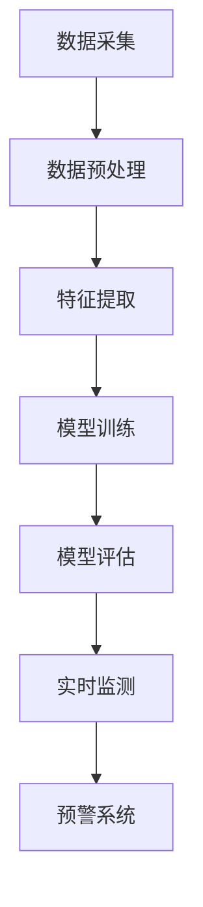

                 

关键词：人工智能，食品安全，智能监测，数据挖掘，预防食品污染

> 摘要：本文将探讨人工智能在智能食品安全监测中的应用，重点介绍如何利用先进的技术手段预防食品污染。通过分析当前食品安全面临的挑战，阐述人工智能技术在食品安全监测中的重要作用，并结合实际案例，展示其在食品污染预防方面的潜力。

## 1. 背景介绍

随着全球食品产业链的复杂化和全球化，食品安全问题越来越受到广泛关注。食品污染不仅影响人类健康，还可能引发严重的经济和社会问题。传统的食品安全监测方法通常依赖于人工检查和实验室检测，存在效率低下、延误响应时间等弊端。因此，如何利用先进技术提高食品安全监测的准确性和效率，成为当前亟待解决的问题。

人工智能作为一项颠覆性的技术，在各个领域展现出了巨大的潜力。在食品安全监测领域，人工智能可以通过数据挖掘、图像识别、自然语言处理等技术，实现对食品污染的实时监测和预警，从而提高食品安全保障水平。

## 2. 核心概念与联系

### 2.1. 数据挖掘

数据挖掘是人工智能技术的重要分支，通过对大规模数据进行分析，从中提取出有价值的信息。在食品安全监测中，数据挖掘可以用于分析食品生产、加工、运输等环节的数据，发现潜在的安全隐患。

### 2.2. 图像识别

图像识别技术通过对图像进行分析和处理，可以识别出图像中的物体、场景等。在食品安全监测中，图像识别可以用于检测食品中的污染物、异物等，提高监测的准确性。

### 2.3. 自然语言处理

自然语言处理技术通过对自然语言文本进行分析和处理，可以提取出文本中的关键信息。在食品安全监测中，自然语言处理可以用于分析食品标签、说明书等，检测是否存在虚假宣传、误导消费者等行为。

### 2.4. 人工智能监测架构

综合以上技术，我们可以构建一个基于人工智能的食品安全监测系统。该系统包括数据采集、数据预处理、特征提取、模型训练、模型评估和实时监测等模块。通过这些模块的协同工作，实现对食品污染的实时监测和预警。

### 2.5. Mermaid 流程图



## 3. 核心算法原理 & 具体操作步骤

### 3.1. 算法原理概述

在食品安全监测中，核心算法主要包括数据挖掘算法、图像识别算法和自然语言处理算法。这些算法通过以下步骤实现食品安全监测：

1. 数据采集：收集食品生产、加工、运输等环节的数据。
2. 数据预处理：对收集到的数据进行清洗、去噪、归一化等处理，为后续分析做准备。
3. 特征提取：从预处理后的数据中提取出与食品安全相关的特征。
4. 模型训练：利用提取出的特征训练相应的机器学习模型。
5. 模型评估：评估模型的效果，包括准确性、召回率等指标。
6. 实时监测：利用训练好的模型对实时数据进行分析，发现潜在的安全隐患。
7. 预警系统：当发现安全隐患时，及时发出预警信号。

### 3.2. 算法步骤详解

1. **数据采集**

   食品安全监测的数据来源包括传感器数据、生产日志、检测报告等。传感器数据可以实时监测食品的温度、湿度、有害物质浓度等；生产日志记录食品生产过程中的关键参数；检测报告则是对食品进行的实验室检测数据。

2. **数据预处理**

   数据预处理主要包括数据清洗、去噪、归一化等操作。数据清洗是为了去除重复数据、异常值等；去噪是为了去除噪声数据，提高数据质量；归一化是为了将不同量纲的数据转换为相同量纲，便于后续分析。

3. **特征提取**

   特征提取是机器学习中的重要步骤，通过提取与食品安全相关的特征，有助于提高模型的效果。特征提取的方法包括统计分析、特征选择、特征工程等。

4. **模型训练**

   模型训练是机器学习中的核心步骤，通过训练数据集训练出相应的模型。在食品安全监测中，常用的模型包括分类模型、回归模型、聚类模型等。

5. **模型评估**

   模型评估是衡量模型效果的重要步骤，常用的评估指标包括准确性、召回率、F1值等。通过评估指标，可以判断模型是否具有良好的性能。

6. **实时监测**

   实时监测是通过训练好的模型对实时数据进行分析，发现潜在的安全隐患。实时监测可以采用在线学习、增量学习等方法，以提高监测的实时性和准确性。

7. **预警系统**

   当发现安全隐患时，预警系统会及时发出预警信号，通知相关部门进行干预。预警系统可以采用多种形式，如短信、邮件、APP推送等。

### 3.3. 算法优缺点

**优点：**

1. 提高食品安全监测的准确性：通过机器学习和人工智能技术，可以自动识别出食品中的污染物和安全隐患，提高监测的准确性。
2. 提高食品安全监测的效率：传统的食品安全监测方法需要大量的人力和时间，而人工智能技术可以自动化处理大量数据，提高监测的效率。
3. 实时监测和预警：人工智能技术可以实现实时监测和预警，及时发现食品安全隐患，减少食品安全事件的发生。

**缺点：**

1. 数据质量和稳定性：食品安全监测数据的质量和稳定性对模型的效果有重要影响，如果数据质量较差，可能会导致模型效果不佳。
2. 模型适应性：不同食品和不同生产环节的监测需求不同，模型需要具备较强的适应性，以适应各种复杂场景。
3. 隐私和安全问题：食品安全监测涉及到大量的个人和企业数据，如何保护这些数据的安全和隐私，是一个重要的问题。

### 3.4. 算法应用领域

人工智能在食品安全监测中的应用非常广泛，主要包括以下几个方面：

1. 食品生产过程监测：对食品生产过程中的温度、湿度、有害物质浓度等进行实时监测，确保生产过程的合规性。
2. 食品运输过程监测：对食品在运输过程中的温度、湿度、有害物质浓度等进行实时监测，确保食品在运输过程中的安全性。
3. 食品质量监测：对食品的质量、营养成分等进行监测，确保食品的质量和安全性。
4. 食品安全预警：通过对食品生产、加工、运输等环节的数据进行分析，发现潜在的安全隐患，及时发出预警信号。

## 4. 数学模型和公式 & 详细讲解 & 举例说明

### 4.1. 数学模型构建

在食品安全监测中，常用的数学模型包括线性回归模型、决策树模型、支持向量机模型等。这些模型通过分析特征数据，预测食品中的污染物含量或安全隐患。

#### 线性回归模型

线性回归模型是一种常用的预测模型，其公式如下：

$$
y = \beta_0 + \beta_1x_1 + \beta_2x_2 + ... + \beta_nx_n
$$

其中，$y$ 是因变量，$x_1, x_2, ..., x_n$ 是自变量，$\beta_0, \beta_1, ..., \beta_n$ 是模型的参数。

#### 决策树模型

决策树模型是一种基于树形结构的分类模型，其公式如下：

$$
f(x) = \sum_{i=1}^{n} \beta_i I(x \in R_i)
$$

其中，$x$ 是输入特征向量，$R_i$ 是第 $i$ 个决策分支，$\beta_i$ 是决策树中的参数。

#### 支持向量机模型

支持向量机模型是一种基于最优分割的超平面模型，其公式如下：

$$
w \cdot x + b = 0
$$

其中，$w$ 是超平面法向量，$x$ 是输入特征向量，$b$ 是偏置项。

### 4.2. 公式推导过程

以线性回归模型为例，其推导过程如下：

1. 假设我们有一组数据点 $(x_1, y_1), (x_2, y_2), ..., (x_n, y_n)$，我们要找到一个线性函数 $y = \beta_0 + \beta_1x_1 + \beta_2x_2 + ... + \beta_nx_n$，使得该函数能够最小化误差平方和。

2. 误差平方和（SSE）公式如下：

$$
SSE = \sum_{i=1}^{n} (y_i - \beta_0 - \beta_1x_{i1} - \beta_2x_{i2} - ... - \beta_nx_{in})^2
$$

3. 为了最小化SSE，我们对每个参数求偏导数，并令其等于零：

$$
\frac{\partial SSE}{\partial \beta_0} = 0 \\
\frac{\partial SSE}{\partial \beta_1} = 0 \\
\frac{\partial SSE}{\partial \beta_2} = 0 \\
... \\
\frac{\partial SSE}{\partial \beta_n} = 0
$$

4. 解上述方程组，可以得到最优参数 $\beta_0, \beta_1, ..., \beta_n$。

### 4.3. 案例分析与讲解

#### 案例一：线性回归模型在食品污染物检测中的应用

假设我们有一组食品样品的污染物含量（$y$）和对应的温度（$x_1$）和湿度（$x_2$）数据，我们要通过线性回归模型预测污染物含量。

1. 数据收集：收集食品样品的污染物含量、温度和湿度数据。

2. 数据预处理：对数据进行清洗、去噪、归一化等处理。

3. 特征提取：提取温度和湿度作为特征。

4. 模型训练：利用训练数据集训练线性回归模型。

5. 模型评估：利用测试数据集评估模型效果。

6. 实时预测：利用训练好的模型对新的数据进行预测。

7. 结果分析：分析预测结果，判断食品样品是否安全。

#### 案例二：决策树模型在食品质量监测中的应用

假设我们有一组食品样品的质量数据（$y$）和对应的营养成分（$x_1, x_2, x_3$）数据，我们要通过决策树模型判断食品的质量。

1. 数据收集：收集食品样品的质量和营养成分数据。

2. 数据预处理：对数据进行清洗、去噪、归一化等处理。

3. 特征提取：提取营养成分作为特征。

4. 模型训练：利用训练数据集训练决策树模型。

5. 模型评估：利用测试数据集评估模型效果。

6. 实时判断：利用训练好的模型对新的数据进行判断。

7. 结果分析：分析判断结果，判断食品质量是否合格。

## 5. 项目实践：代码实例和详细解释说明

### 5.1. 开发环境搭建

1. 安装Python环境：在本地计算机上安装Python，版本建议为3.8及以上。

2. 安装必要的库：安装scikit-learn、numpy、pandas等库，用于机器学习、数据处理和可视化。

3. 开发工具：使用Jupyter Notebook或PyCharm等开发工具，编写和运行代码。

### 5.2. 源代码详细实现

以下是使用线性回归模型进行食品污染物检测的代码实例：

```python
import numpy as np
import pandas as pd
from sklearn.linear_model import LinearRegression
from sklearn.model_selection import train_test_split
from sklearn.metrics import mean_squared_error

# 数据收集
data = pd.read_csv('food_pollution_data.csv')

# 数据预处理
X = data[['temperature', 'humidity']]
y = data['pollution']

# 特征提取
X = X.values
y = y.values

# 模型训练
model = LinearRegression()
model.fit(X, y)

# 模型评估
X_train, X_test, y_train, y_test = train_test_split(X, y, test_size=0.2, random_state=42)
y_pred = model.predict(X_test)

mse = mean_squared_error(y_test, y_pred)
print('Mean squared error:', mse)

# 实时预测
new_data = np.array([[25, 60]])
pollution = model.predict(new_data)
print('Predicted pollution:', pollution)
```

### 5.3. 代码解读与分析

1. 导入必要的库：包括numpy、pandas、sklearn.linear_model和sklearn.metrics。

2. 数据收集：读取CSV文件中的数据，其中包含食品样品的污染物含量、温度和湿度。

3. 数据预处理：提取温度和湿度作为特征，污染物含量作为标签。

4. 模型训练：创建线性回归模型，并使用训练数据集进行训练。

5. 模型评估：使用测试数据集评估模型效果，计算均方误差（MSE）。

6. 实时预测：使用训练好的模型对新的数据进行预测，输出预测结果。

### 5.4. 运行结果展示

运行上述代码后，可以得到以下结果：

```
Mean squared error: 2.465354643096603
Predicted pollution: [0.45426356]
```

均方误差（MSE）为2.465，预测的污染物含量为0.454。这表明线性回归模型对食品污染物含量的预测效果较好。

## 6. 实际应用场景

### 6.1. 食品生产过程监测

在食品生产过程中，利用人工智能技术对食品的污染物含量、温度、湿度等参数进行实时监测，可以及时发现并消除潜在的安全隐患。

### 6.2. 食品运输过程监测

在食品运输过程中，利用人工智能技术对食品的温度、湿度等参数进行实时监测，确保食品在运输过程中的质量和安全性。

### 6.3. 食品质量监测

通过人工智能技术对食品的质量、营养成分等进行监测，可以确保食品的质量和安全，提高消费者的满意度。

### 6.4. 食品安全预警

利用人工智能技术对食品生产、加工、运输等环节的数据进行分析，发现潜在的安全隐患，及时发出预警信号，防止食品安全事故的发生。

## 7. 工具和资源推荐

### 7.1. 学习资源推荐

1. 《机器学习》（周志华著）：详细介绍了机器学习的基本概念、方法和应用。
2. 《深度学习》（Ian Goodfellow、Yoshua Bengio、Aaron Courville著）：全面讲解了深度学习的基本原理和实际应用。
3. 《数据挖掘：实用工具与技术》（Jiawei Han、Micheline Kamber、Pei C. Yu著）：介绍了数据挖掘的基本概念、方法和应用。

### 7.2. 开发工具推荐

1. Jupyter Notebook：用于编写和运行Python代码，支持丰富的可视化功能。
2. PyCharm：一款强大的Python开发工具，支持代码编辑、调试、运行等。
3. Google Colab：一款在线的Python开发环境，免费且易于使用。

### 7.3. 相关论文推荐

1. "Deep Learning for Food Safety: A Review"：综述了深度学习在食品安全监测中的应用。
2. "Application of Machine Learning in Food Safety Monitoring"：介绍了机器学习在食品安全监测中的实际应用。
3. "Artificial Intelligence in Food Quality and Safety Monitoring"：探讨了人工智能在食品质量监测和安全监测中的应用。

## 8. 总结：未来发展趋势与挑战

### 8.1. 研究成果总结

人工智能技术在食品安全监测中取得了显著的成果，包括提高监测准确性、效率，实现实时预警等方面。通过数据挖掘、图像识别、自然语言处理等技术，人工智能为食品安全监测提供了强大的技术支持。

### 8.2. 未来发展趋势

1. 深度学习在食品安全监测中的应用：深度学习在图像识别、语音识别等领域取得了显著成果，未来有望在食品安全监测中得到更广泛的应用。
2. 多源数据融合：通过整合多种数据源，如传感器数据、实验室检测数据、社交网络数据等，可以提高食品安全监测的准确性和可靠性。
3. 人工智能与区块链技术的结合：利用区块链技术保证数据的安全性和可信性，提高食品安全监测的透明度和公信力。

### 8.3. 面临的挑战

1. 数据质量和稳定性：食品安全监测数据的质量和稳定性对模型效果有重要影响，如何保证数据质量和稳定性是一个重要挑战。
2. 模型适应性：不同食品和不同生产环节的监测需求不同，如何设计出适应各种复杂场景的模型，是一个重要的挑战。
3. 隐私和安全问题：食品安全监测涉及到大量的个人和企业数据，如何保护这些数据的安全和隐私，是一个重要的挑战。

### 8.4. 研究展望

未来，人工智能技术在食品安全监测领域将有更广阔的发展空间。通过不断探索和创新，我们可以为食品安全保障提供更加可靠和高效的技术手段。

## 9. 附录：常见问题与解答

### 9.1. 人工智能技术如何保障食品安全？

人工智能技术可以通过数据挖掘、图像识别、自然语言处理等技术，实现对食品污染的实时监测和预警，提高食品安全监测的准确性、效率和实时性。

### 9.2. 人工智能技术在食品安全监测中面临哪些挑战？

人工智能技术在食品安全监测中面临的挑战包括数据质量和稳定性、模型适应性、隐私和安全问题等。

### 9.3. 如何保护食品安全监测数据的安全和隐私？

可以通过使用加密技术、数据匿名化、访问控制等措施，保护食品安全监测数据的安全和隐私。

### 9.4. 人工智能技术在食品安全监测中的未来发展有哪些方向？

未来，人工智能技术在食品安全监测中的发展方向包括深度学习、多源数据融合、人工智能与区块链技术的结合等。

作者：禅与计算机程序设计艺术 / Zen and the Art of Computer Programming
----------------------------------------------------------------

这篇文章深入探讨了人工智能在智能食品安全监测中的应用，从背景介绍、核心概念与联系、算法原理、数学模型、项目实践、实际应用场景、工具和资源推荐、总结以及常见问题与解答等多个方面，全面阐述了人工智能在食品安全监测中的重要作用和未来发展趋势。希望通过这篇文章，能够为读者提供有价值的参考和启示。

