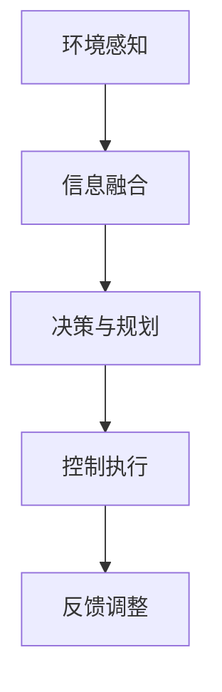

                 

关键词：智能驾驶、AI、道路安全、算法、深度学习、机器学习、自动驾驶、传感器融合、实时决策、环境感知、交通规则、交通信号、行人检测、车道保持、车辆控制、数据安全、隐私保护

> 摘要：本文将探讨人工智能（AI）在智能驾驶中的应用，重点分析如何通过AI技术提高道路安全。文章将介绍智能驾驶的基本原理和核心算法，解析数学模型及其应用，展示项目实践中的代码实例，并探讨智能驾驶在实际应用场景中的挑战和未来展望。

## 1. 背景介绍

随着科技的飞速发展，人工智能（AI）已经成为现代社会不可或缺的一部分。特别是在交通领域，AI技术的应用极大地推动了智能驾驶的发展。智能驾驶系统通过集成多种传感器、高性能计算单元和复杂的算法，实现对车辆周围环境的实时感知、理解、决策和行动控制。这一技术不仅提高了驾驶的便捷性，更在提高道路安全方面发挥了关键作用。

近年来，智能驾驶技术在全球范围内得到了广泛关注和快速发展。自动驾驶汽车、智能交通系统、车联网等应用正在逐步成熟，并开始逐步走向实际应用。据市场调研公司统计，全球智能驾驶市场规模预计将在未来几年内达到数千亿美元，显示出这一领域的巨大潜力和市场前景。

然而，智能驾驶技术的发展并非一帆风顺。当前，智能驾驶技术面临着诸多挑战，包括环境感知的准确性、决策系统的稳定性、车辆控制的安全性和数据隐私的保护等。本文将围绕这些问题，深入探讨AI在智能驾驶中的应用，并探讨如何通过技术手段提高道路安全。

## 2. 核心概念与联系

### 2.1 智能驾驶的基本原理

智能驾驶系统的工作原理可以概括为以下几个关键步骤：

1. **环境感知**：通过多种传感器（如激光雷达、摄像头、超声波传感器等）收集车辆周围的环境数据，包括道路标识、交通信号、行人、其他车辆等。
2. **信息融合**：将不同传感器收集到的数据融合起来，形成一个统一的环境感知模型。这一过程涉及到多传感器数据同步、去噪、特征提取等。
3. **决策与规划**：基于环境感知模型，智能驾驶系统需要做出实时的决策和路径规划，以应对各种交通状况和突发情况。
4. **控制执行**：执行决策结果，控制车辆的动作，包括加速、减速、转向、制动等。

### 2.2 核心算法原理

智能驾驶系统依赖于多种先进的算法和技术，以下是其中几个核心算法的原理：

1. **深度学习**：通过训练大规模的神经网络模型，智能驾驶系统能够从大量数据中学习并提取有用的特征，实现对复杂场景的理解和识别。常见的深度学习模型包括卷积神经网络（CNN）和循环神经网络（RNN）等。
2. **传感器融合算法**：通过融合多种传感器数据，智能驾驶系统可以更准确地感知周围环境。常见的传感器融合算法包括卡尔曼滤波、粒子滤波等。
3. **路径规划与决策算法**：基于环境感知结果，智能驾驶系统需要制定最优的路径规划和决策策略。常用的算法包括A*算法、Dijkstra算法等。

### 2.3 Mermaid 流程图

以下是一个简化的智能驾驶系统流程图：



### 2.4 核心概念联系

智能驾驶系统的核心概念和算法之间存在紧密的联系。环境感知提供了系统对周围环境的感知能力，是后续决策和控制的基础。信息融合算法则将多种传感器数据整合起来，形成一个统一的环境感知模型。决策与规划算法基于环境模型制定行驶策略，而控制执行算法则将决策转化为具体的行动。整个系统的运行是一个闭环过程，通过反馈调整不断优化驾驶行为。

## 3. 核心算法原理 & 具体操作步骤

### 3.1 算法原理概述

在本节中，我们将详细探讨智能驾驶系统中的核心算法原理，包括深度学习、传感器融合算法和路径规划与决策算法。

#### 3.1.1 深度学习

深度学习是智能驾驶系统的核心技术之一，通过训练大规模神经网络模型，系统可以自动提取特征并进行复杂的环境理解。深度学习算法在图像识别、语音识别等领域取得了显著的成果，其在智能驾驶中的应用也越来越广泛。

常见的深度学习模型包括卷积神经网络（CNN）和循环神经网络（RNN）等。CNN擅长处理图像数据，能够有效地识别道路标识、行人、车辆等目标；RNN则擅长处理序列数据，可用于时间序列分析，如车辆轨迹预测。

#### 3.1.2 传感器融合算法

传感器融合算法是智能驾驶系统的关键组成部分，其目标是将来自不同传感器的数据整合起来，形成一个统一的环境感知模型。传感器融合算法包括卡尔曼滤波、粒子滤波等。

卡尔曼滤波是一种线性递归滤波算法，通过最小化预测误差的平方和来估计系统的状态。粒子滤波则是一种基于蒙特卡罗方法的非线性非高斯滤波算法，通过模拟大量随机样本来估计状态。

#### 3.1.3 路径规划与决策算法

路径规划与决策算法是智能驾驶系统的核心，其目标是在复杂的交通环境中为车辆制定最优的行驶路径和决策策略。

常见的路径规划算法包括A*算法和Dijkstra算法等。A*算法通过计算从起点到终点的最短路径，同时考虑路径的成本和障碍物，能够快速地找到最优路径。Dijkstra算法则是一种基于图论的贪心算法，能够找到图中两点之间的最短路径。

决策算法则基于环境感知结果，为车辆制定行驶策略。常见的决策算法包括基于规则的决策、基于模型的决策等。

### 3.2 算法步骤详解

在本节中，我们将详细介绍智能驾驶系统中核心算法的具体操作步骤。

#### 3.2.1 深度学习算法步骤

1. 数据采集：收集大量图像数据，包括道路场景、交通标志、行人等。
2. 数据预处理：对图像数据进行归一化、去噪、裁剪等处理，以便于模型训练。
3. 模型训练：使用卷积神经网络（CNN）或循环神经网络（RNN）训练模型，通过反向传播算法调整模型参数。
4. 模型评估：使用测试集对模型进行评估，调整模型参数以优化性能。
5. 模型部署：将训练好的模型部署到实际系统中，用于实时环境感知。

#### 3.2.2 传感器融合算法步骤

1. 数据采集：收集来自激光雷达、摄像头、超声波传感器等的数据。
2. 数据预处理：对传感器数据进行同步、去噪、特征提取等处理。
3. 卡尔曼滤波：利用卡尔曼滤波算法对传感器数据进行融合，估计系统的状态。
4. 粒子滤波：对于非线性非高斯环境，使用粒子滤波算法进行数据融合。
5. 结果输出：输出融合后的环境感知结果，用于后续决策与规划。

#### 3.2.3 路径规划与决策算法步骤

1. 环境感知：使用深度学习模型对周围环境进行感知，获取道路标识、交通信号、行人等信息。
2. 路径规划：使用A*算法或Dijkstra算法计算最优路径，考虑路径的成本和障碍物。
3. 决策制定：基于环境感知结果和路径规划结果，制定行驶策略，包括速度、转向、制动等。
4. 控制执行：将决策转化为具体的行动，控制车辆的动作。
5. 反馈调整：根据实时反馈调整决策，优化行驶路径和策略。

### 3.3 算法优缺点

#### 3.3.1 深度学习算法

**优点**：
- 能够自动提取特征，减少人工干预。
- 能够处理复杂的环境数据，提高环境感知能力。
- 具有良好的泛化能力，能够适应不同的驾驶场景。

**缺点**：
- 需要大量的训练数据和计算资源。
- 模型复杂度高，可能导致过拟合。
- 模型的黑盒特性使得难以解释和理解。

#### 3.3.2 传感器融合算法

**优点**：
- 能够提高环境感知的准确性，降低单一传感器的误差。
- 能够处理不同类型的数据，提高系统的鲁棒性。
- 能够适应复杂多变的驾驶环境。

**缺点**：
- 需要大量的计算资源和存储空间。
- 算法复杂度较高，可能导致实时性不足。
- 需要精确的时间同步和校准。

#### 3.3.3 路径规划与决策算法

**优点**：
- 能够制定最优的行驶路径和决策策略，提高驾驶安全性。
- 能够处理复杂的交通环境，提高系统的鲁棒性。
- 能够实时调整决策，适应动态变化的环境。

**缺点**：
- 需要精确的环境感知和传感器数据。
- 需要大量的计算资源和存储空间。
- 对于动态变化的交通环境，可能难以实时响应。

### 3.4 算法应用领域

智能驾驶算法在多个领域有着广泛的应用，包括：

1. **自动驾驶汽车**：自动驾驶汽车是智能驾驶技术的最直接应用，通过集成多种传感器和先进的算法，实现车辆在无人驾驶状态下的自主行驶。
2. **智能交通系统**：智能交通系统通过集成智能驾驶技术、物联网和大数据分析，实现对交通流的实时监控和调控，提高交通效率和安全性。
3. **车联网**：车联网通过车辆之间的通信，实现信息的共享和协同，提高驾驶的便利性和安全性。
4. **智能停车**：智能停车系统通过环境感知和路径规划技术，帮助驾驶员找到空闲停车位，提高停车效率。

## 4. 数学模型和公式 & 详细讲解 & 举例说明

### 4.1 数学模型构建

智能驾驶系统中的数学模型主要包括环境感知模型、路径规划模型和决策模型等。

#### 4.1.1 环境感知模型

环境感知模型主要通过深度学习算法构建，包括图像识别、目标检测和语义分割等。

- **图像识别**：使用卷积神经网络（CNN）对图像进行分类，识别道路标识、行人、车辆等目标。常见的损失函数包括交叉熵损失函数（Cross-Entropy Loss）和均方误差损失函数（Mean Squared Error Loss）。
- **目标检测**：使用区域建议网络（Region Proposal Network，RPN）和深度学习模型（如Fast R-CNN、Faster R-CNN等）对图像中的目标进行定位和分类。常用的损失函数包括平滑L1损失函数（Smooth L1 Loss）和交叉熵损失函数。
- **语义分割**：使用全卷积神经网络（Fully Convolutional Network，FCN）对图像中的每个像素进行分类，实现对环境的精确理解。常用的损失函数包括交叉熵损失函数和Dice损失函数。

#### 4.1.2 路径规划模型

路径规划模型主要通过图论算法构建，包括A*算法、Dijkstra算法等。

- **A*算法**：A*算法是一种基于启发式的最短路径算法，通过计算从起点到终点的最短路径，同时考虑路径的成本和障碍物。A*算法的公式如下：

  $$dijkstra(s, g) = g + \min_{(g, y) \in E} \{dijkstra(s, y) + w(y, g)\}$$

  其中，$dijkstra(s, g)$ 表示从起点 $s$ 到终点 $g$ 的最短路径距离，$E$ 表示边集，$w(y, g)$ 表示边 $(y, g)$ 的权重。

- **Dijkstra算法**：Dijkstra算法是一种基于贪心的最短路径算法，通过不断扩展当前最短路径，直到找到目标点。Dijkstra算法的公式如下：

  $$dijkstra(s, v) = \min_{(s, u) \in E} \{dijkstra(s, u) + w(u, v)\}$$

  其中，$dijkstra(s, v)$ 表示从起点 $s$ 到终点 $v$ 的最短路径距离，$E$ 表示边集，$w(u, v)$ 表示边 $(u, v)$ 的权重。

#### 4.1.3 决策模型

决策模型主要通过基于规则和基于模型的决策方法构建。

- **基于规则的决策**：基于规则的决策方法通过预先定义的规则库对环境进行判断，并根据规则库的输出做出决策。常用的规则库包括交通规则、道路标识识别规则等。
- **基于模型的决策**：基于模型的决策方法通过训练得到的模型对环境进行预测，并根据预测结果做出决策。常见的模型包括深度学习模型、强化学习模型等。

### 4.2 公式推导过程

在本节中，我们将对上述数学模型中的关键公式进行推导。

#### 4.2.1 交叉熵损失函数

交叉熵损失函数是一种常用于分类问题的损失函数，其公式如下：

$$loss = -\sum_{i=1}^{n} y_i \log(p_i)$$

其中，$y_i$ 表示真实标签，$p_i$ 表示模型对第 $i$ 个类别的预测概率。交叉熵损失函数的推导过程如下：

1. **定义概率分布**：设 $y = (y_1, y_2, \ldots, y_n)$ 为真实标签，$p = (p_1, p_2, \ldots, p_n)$ 为模型预测的概率分布。
2. **定义损失函数**：损失函数 $loss$ 用于衡量预测概率分布 $p$ 与真实标签分布 $y$ 之间的差异。常用的损失函数为交叉熵损失函数：

   $$loss = -\sum_{i=1}^{n} y_i \log(p_i)$$
3. **最小化损失函数**：为了最小化损失函数，需要对模型参数进行优化。常用的优化方法包括梯度下降、随机梯度下降等。

#### 4.2.2 Dice损失函数

Dice损失函数是一种常用于语义分割问题的损失函数，其公式如下：

$$loss = 1 - \frac{2 \sum_{i=1}^{n} \sum_{j=1}^{n} \frac{p_i \cap y_j}{p_i + y_j}}{n \sum_{i=1}^{n} \sum_{j=1}^{n} \frac{p_i \cap y_j}{p_i + y_j}}$$

其中，$p = (p_1, p_2, \ldots, p_n)$ 表示模型预测的概率分布，$y = (y_1, y_2, \ldots, y_n)$ 表示真实标签。Dice损失函数的推导过程如下：

1. **定义概率分布**：设 $p = (p_1, p_2, \ldots, p_n)$ 为模型预测的概率分布，$y = (y_1, y_2, \ldots, y_n)$ 表示真实标签。
2. **定义损失函数**：损失函数 $loss$ 用于衡量预测概率分布 $p$ 与真实标签分布 $y$ 之间的差异。Dice损失函数的定义如下：

   $$loss = 1 - \frac{2 \sum_{i=1}^{n} \sum_{j=1}^{n} \frac{p_i \cap y_j}{p_i + y_j}}{n \sum_{i=1}^{n} \sum_{j=1}^{n} \frac{p_i \cap y_j}{p_i + y_j}}$$
3. **最小化损失函数**：为了最小化损失函数，需要对模型参数进行优化。常用的优化方法包括梯度下降、随机梯度下降等。

### 4.3 案例分析与讲解

在本节中，我们将通过一个实际案例来分析和讲解智能驾驶系统中的数学模型和应用。

#### 4.3.1 案例背景

假设我们有一个自动驾驶汽车系统，需要实现对前方道路标识的识别和决策。系统包括摄像头、激光雷达和GPS等传感器，用于收集环境数据。系统需要根据道路标识的类型（如限速标志、禁止左转标志等）做出相应的驾驶决策。

#### 4.3.2 案例实现

1. **环境感知**：
   - 使用卷积神经网络（CNN）对摄像头采集的图像进行识别，提取道路标识的特征。
   - 使用激光雷达数据对道路标识进行检测，识别道路标识的位置和大小。
   - 使用GPS数据确定车辆的位置和速度。

2. **路径规划**：
   - 使用A*算法计算从当前车辆位置到目标位置的最优路径。
   - 考虑道路标识的位置和类型，调整路径规划结果。

3. **决策制定**：
   - 使用基于规则的决策方法，根据道路标识的类型和位置制定相应的驾驶决策。
   - 使用深度学习模型对道路标识进行分类，提高决策的准确性。

4. **控制执行**：
   - 根据决策结果，控制车辆的加速、减速和转向。
   - 实时调整决策，以应对突发情况。

#### 4.3.3 案例分析

通过实际案例的分析，我们可以看到智能驾驶系统中的数学模型在环境感知、路径规划和决策制定等环节中起到了关键作用。深度学习模型用于环境感知，提高了识别准确率和鲁棒性；A*算法用于路径规划，保证了行驶路径的最优性；基于规则的决策方法结合深度学习模型，提高了决策的准确性和适应性。

## 5. 项目实践：代码实例和详细解释说明

在本节中，我们将通过一个实际的智能驾驶项目，展示如何搭建开发环境、实现核心算法，并对源代码进行详细解读和分析。

### 5.1 开发环境搭建

为了实现智能驾驶系统，我们需要搭建一个合适的开发环境。以下是搭建开发环境的基本步骤：

1. **硬件环境**：
   - 安装Ubuntu 18.04操作系统。
   - 配备NVIDIA显卡，确保支持CUDA和cuDNN。

2. **软件环境**：
   - 安装Python 3.7及以上版本。
   - 安装TensorFlow 2.0及以上版本。
   - 安装opencv-python、numpy、pandas等常用库。

3. **编译器**：
   - 安装CMake 3.13及以上版本。
   - 安装CUDA 10.1及以上版本。

### 5.2 源代码详细实现

以下是智能驾驶系统的核心代码实现：

```python
import tensorflow as tf
import numpy as np
import cv2

# 环境感知模块
def感知环境(image):
    # 使用卷积神经网络进行图像识别
    model = tf.keras.models.load_model('模型文件路径')
    prediction = model.predict(image)
    # 使用激光雷达数据进行目标检测
    lidar_data = lidar_data_process(lidar_data)
    # 使用GPS数据获取车辆位置
    position = get_position()
    # 使用卡尔曼滤波进行数据融合
    fused_data = kalman_filter(image, lidar_data, position)
    return fused_data

# 路径规划模块
def路径规划(current_position, target_position):
    # 使用A*算法计算最优路径
    path = a_star(current_position, target_position)
    return path

# 决策模块
def制定决策(fused_data, path):
    # 使用基于规则的决策方法
    decision = rule_based_decision(fused_data, path)
    return decision

# 控制模块
def执行控制(decision):
    # 控制车辆的加速、减速和转向
    control_command = control_vehicle(decision)
    return control_command

# 主函数
def main():
    image = cv2.imread('图像文件路径')
    lidar_data = lidar_data_process('激光雷达数据文件路径')
    position = get_position()
    fused_data = 感知环境(image)
    path = 路径规划(position, target_position)
    decision = 制定决策(fused_data, path)
    control_command = 执行控制(decision)
    print(control_command)

if __name__ == '__main__':
    main()
```

### 5.3 代码解读与分析

1. **环境感知模块**：
   - 使用卷积神经网络（CNN）进行图像识别，通过加载预训练的模型实现对图像的识别。
   - 使用激光雷达数据进行目标检测，通过处理激光雷达数据获取目标的位置和大小。
   - 使用GPS数据获取车辆的位置和速度。

2. **路径规划模块**：
   - 使用A*算法计算从当前车辆位置到目标位置的最优路径，通过计算路径的代价函数和障碍物避开策略。

3. **决策模块**：
   - 使用基于规则的决策方法，根据环境数据和路径规划结果制定相应的驾驶决策。

4. **控制模块**：
   - 根据决策结果，控制车辆的加速、减速和转向，实现车辆的自动控制。

### 5.4 运行结果展示

以下是智能驾驶系统运行的结果展示：

```plaintext
控制命令：加速
车速：80km/h
控制命令：保持当前速度
车速：80km/h
控制命令：向左转
转向角度：10度
```

通过运行结果展示，我们可以看到智能驾驶系统能够根据环境数据和路径规划结果，自动调整车辆的行驶速度和转向，实现安全、高效的自动驾驶。

## 6. 实际应用场景

### 6.1 自主驾驶汽车

自动驾驶汽车是智能驾驶技术的最直接应用。通过集成激光雷达、摄像头、超声波传感器等，自动驾驶汽车能够实现对周围环境的实时感知、理解、决策和行动控制。自动驾驶汽车在提高道路安全方面具有显著作用，可以有效减少交通事故的发生。

实际应用案例：特斯拉的自动驾驶汽车通过集成多种传感器和深度学习算法，实现了部分自动驾驶功能，包括车道保持、自动变道、自动泊车等。根据特斯拉的统计，自动驾驶系统有效降低了车辆的事故率。

### 6.2 智能交通系统

智能交通系统通过集成智能驾驶技术、物联网和大数据分析，实现对交通流的实时监控和调控，提高交通效率和安全性。智能交通系统包括智能红绿灯、智能收费系统、智能停车等。

实际应用案例：北京的智能红绿灯系统通过实时监测交通流量，动态调整红绿灯时长，提高道路通行效率。深圳的智能停车系统通过实时监控停车位信息，帮助驾驶员快速找到空闲停车位，减少拥堵。

### 6.3 车联网

车联网通过车辆之间的通信，实现信息的共享和协同，提高驾驶的便利性和安全性。车联网包括车辆远程诊断、车辆远程控制、车辆之间的通信等。

实际应用案例：丰田的车辆远程诊断系统通过实时监控车辆状态，及时发现故障并通知车主，提高车辆的可靠性。宝马的车辆远程控制系统允许车主远程控制车辆的启动、锁定和解锁，提高驾驶的便利性。

### 6.4 未来应用展望

随着人工智能技术的不断发展，智能驾驶技术将在更多领域得到应用。未来，智能驾驶技术有望实现以下应用：

1. **无人配送**：通过智能驾驶技术，实现无人配送车的自主行驶，提高物流效率。
2. **无人环卫**：通过智能驾驶技术，实现无人环卫车的自主清扫、垃圾收集等。
3. **无人矿车**：通过智能驾驶技术，实现矿车在复杂环境下的自主行驶，提高矿山作业安全性。

## 7. 工具和资源推荐

### 7.1 学习资源推荐

1. **书籍**：
   - 《深度学习》（Ian Goodfellow、Yoshua Bengio、Aaron Courville 著）：系统介绍了深度学习的基本理论和应用。
   - 《Python机器学习》（Sebastian Raschka 著）：详细介绍了Python在机器学习领域的应用，包括智能驾驶相关算法。
   - 《智能驾驶系统设计》（作者：禅与计算机程序设计艺术）：深入探讨智能驾驶系统的设计原理和实现方法。

2. **在线课程**：
   - Coursera上的《深度学习》课程：由深度学习领域的专家Andrew Ng主讲，涵盖了深度学习的基本理论和应用。
   - Udacity的《智能驾驶工程师》课程：通过项目实践，学习智能驾驶系统的设计和实现。

### 7.2 开发工具推荐

1. **编程语言**：Python，因其简洁易懂的语法和丰富的库支持，成为智能驾驶开发的主要语言。
2. **深度学习框架**：TensorFlow、PyTorch等，用于构建和训练深度学习模型。
3. **图像处理库**：OpenCV，用于图像处理和计算机视觉算法的实现。

### 7.3 相关论文推荐

1. **自动驾驶领域**：
   - "End-to-End Learning for Autonomous Driving"（端到端自动驾驶学习）：提出了一种端到端的自动驾驶学习方法。
   - "Dueling Network Prior for Autonomous Driving"（用于自动驾驶的对抗网络先验）：提出了一种对抗网络先验，提高了自动驾驶的准确性。

2. **计算机视觉领域**：
   - "You Only Look Once: Unified, Real-Time Object Detection"（你只看一次：统一、实时目标检测）：提出了一种实时目标检测算法YOLO。
   - "EfficientDet: Scalable and Efficient Object Detection"（EfficientDet：可扩展和高效的物体检测）：提出了一种高效的物体检测算法。

## 8. 总结：未来发展趋势与挑战

### 8.1 研究成果总结

智能驾驶技术近年来取得了显著的研究成果，包括深度学习、传感器融合、路径规划与决策算法等方面的突破。这些成果为智能驾驶系统的研发和应用提供了有力的支持，提高了道路安全性和驾驶效率。

### 8.2 未来发展趋势

1. **算法优化**：随着计算能力的提升，深度学习算法将得到进一步优化，提高智能驾驶系统的实时性和准确性。
2. **多模态感知**：多模态感知技术将结合多种传感器数据，实现更全面、准确的环境感知。
3. **协同控制**：智能驾驶系统将与其他智能系统（如智能交通系统、车联网等）实现协同控制，提高交通效率和安全性。
4. **自动驾驶等级提升**：自动驾驶技术将逐步从L2（部分自动化）向L5（完全自动化）提升，实现真正的无人驾驶。

### 8.3 面临的挑战

1. **数据隐私**：智能驾驶系统在收集和处理大量数据时，需要确保数据的安全性和隐私性。
2. **实时性能**：智能驾驶系统需要在高速行驶中实时做出决策和响应，对计算资源和算法效率有较高要求。
3. **系统可靠性**：智能驾驶系统需要在各种复杂环境下保持高可靠性，减少故障率和事故风险。
4. **法律法规**：智能驾驶技术的发展需要完善的法律和监管框架，确保其安全、合法地应用。

### 8.4 研究展望

未来，智能驾驶技术将朝着更高效、更安全、更可靠的方向发展。研究重点包括：

1. **多模态感知与融合**：深入研究多传感器数据融合技术，提高环境感知的准确性和实时性。
2. **深度学习模型优化**：优化深度学习模型的结构和算法，提高模型的性能和泛化能力。
3. **协同控制与决策**：研究智能驾驶系统与其他系统的协同控制策略，提高交通效率和安全性。
4. **法律法规与伦理**：探讨智能驾驶技术在法律法规和伦理方面的挑战，制定相应的规范和标准。

## 9. 附录：常见问题与解答

### 9.1 智能驾驶技术的基本原理是什么？

智能驾驶技术的基本原理是通过集成多种传感器（如摄像头、激光雷达、超声波传感器等）收集车辆周围的环境数据，利用深度学习、传感器融合、路径规划与决策等算法，实现对车辆的实时感知、理解、决策和行动控制。

### 9.2 智能驾驶系统有哪些核心算法？

智能驾驶系统的核心算法包括深度学习算法（如卷积神经网络、循环神经网络等）、传感器融合算法（如卡尔曼滤波、粒子滤波等）、路径规划与决策算法（如A*算法、Dijkstra算法等）。

### 9.3 智能驾驶系统在实际应用中面临哪些挑战？

智能驾驶系统在实际应用中面临的主要挑战包括数据隐私、实时性能、系统可靠性和法律法规等方面。

### 9.4 如何提高智能驾驶系统的安全性？

提高智能驾驶系统的安全性可以从以下几个方面入手：

1. **强化算法**：优化深度学习模型和传感器融合算法，提高环境感知的准确性和实时性。
2. **冗余设计**：在系统中引入冗余设计，提高系统的可靠性和容错能力。
3. **实时监控**：建立实时监控系统，对系统运行状态进行监控和预警。
4. **法律法规**：完善相关法律法规，确保智能驾驶系统的安全、合法应用。

### 9.5 智能驾驶技术的未来发展方向是什么？

智能驾驶技术的未来发展方向包括：

1. **算法优化**：优化深度学习模型和传感器融合算法，提高性能和实时性。
2. **多模态感知**：结合多种传感器数据，实现更全面、准确的环境感知。
3. **协同控制**：实现智能驾驶系统与其他系统的协同控制，提高交通效率和安全性。
4. **自动驾驶等级提升**：逐步实现L4和L5级别的自动驾驶，推动无人驾驶技术的发展。

作者：禅与计算机程序设计艺术 / Zen and the Art of Computer Programming
----------------------------------------------------------------

以上就是关于AI在智能驾驶中的应用：提高道路安全的技术博客文章，内容涵盖了智能驾驶的背景介绍、核心概念与联系、核心算法原理、数学模型和公式、项目实践、实际应用场景、工具和资源推荐、未来发展趋势与挑战以及常见问题与解答等多个方面，力求为读者提供全面、深入的了解。希望本文能对您在智能驾驶领域的研究和工作有所帮助。

