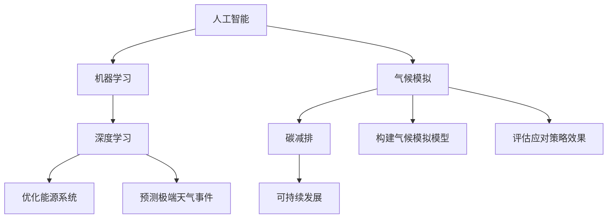

                 

关键词：人工智能、气候变化、预测模型、应对策略、数据科学、可持续发展、机器学习、深度学习、气候模拟、碳减排、环保技术、环境监测。

> 摘要：本文探讨了人工智能（AI）在气候变化研究中的关键作用，包括预测气候变化的趋势、制定有效的应对策略、促进可持续发展。通过深入分析AI算法原理、数学模型、项目实践和未来应用场景，本文展示了AI在应对全球气候变化中的重要性和潜力。

## 1. 背景介绍

气候变化是目前全球面临的最严峻的环境问题之一。据科学家们的研究，过去一个世纪中，全球平均气温已经上升了约1.2摄氏度，这一上升趋势预计将继续加剧，导致极端天气事件、海平面上升、生态系统的破坏等一系列严重后果。为了应对气候变化，全球各国政府和科学界投入了大量的资源和努力，但进展仍然有限。传统的方法主要依赖于气候模拟、数据分析和政策制定，但这些方法在应对复杂、多变的气候变化时存在诸多限制。

近年来，人工智能（AI）技术的快速发展为气候变化研究带来了新的机遇。AI能够通过大量的数据分析和模式识别，预测未来的气候变化趋势，并制定出更为精准的应对策略。此外，AI在优化能源消耗、提高资源利用效率、减少碳排放等方面也展现出巨大的潜力。本文将详细探讨AI在气候变化研究中的应用，包括预测模型、应对策略、可持续发展等方面的内容。

## 2. 核心概念与联系

### 2.1 人工智能（AI）

人工智能是指计算机系统模拟人类智能行为的能力，包括学习、推理、解决问题、感知和自我改进等。在气候变化研究中，AI可以处理海量数据，发现其中的规律和模式，从而帮助科学家们更好地理解气候变化的过程和趋势。

### 2.2 机器学习（ML）

机器学习是AI的一个重要分支，通过使用算法从数据中学习并做出预测。在气候变化研究中，机器学习算法可以用于分析气候数据、预测未来的气候变化趋势，以及制定应对策略。

### 2.3 深度学习（DL）

深度学习是一种基于多层神经网络的学习方法，能够在复杂的非线性数据中提取特征。在气候变化研究中，深度学习可以用于构建气候模拟模型、优化能源系统、预测极端天气事件等。

### 2.4 气候模拟（Climate Modeling）

气候模拟是通过计算机模型模拟地球气候系统的过程和变化。这些模型通常基于物理、化学和生物过程，通过数学方程描述气候系统各个部分的相互作用。在气候变化研究中，气候模拟可以帮助科学家们预测未来的气候变化趋势，并评估不同应对策略的效果。

### 2.5 碳减排（Carbon Emission Reduction）

碳减排是指通过减少碳排放，降低温室气体浓度，从而减缓气候变化的过程。在气候变化研究中，碳减排策略是应对气候变化的重要手段。AI可以通过优化能源系统、提高能源效率、开发新的清洁能源技术等方式，帮助实现碳减排目标。

### 2.6 可持续发展（Sustainable Development）

可持续发展是指在满足当前需求的同时，不损害未来世代满足自身需求的能力。在气候变化研究中，可持续发展是评估应对策略和环境效益的重要指标。AI可以通过优化资源利用、减少污染、提高生态系统的稳定性等方式，促进可持续发展。

### 2.7 Mermaid 流程图

以下是描述AI在气候变化研究中的核心概念和联系的Mermaid流程图：



## 3. 核心算法原理 & 具体操作步骤

### 3.1 算法原理概述

在气候变化研究中，AI算法主要应用于以下三个方面：

1. **气候趋势预测**：利用机器学习和深度学习算法，分析历史气候数据，预测未来的气候变化趋势。
2. **应对策略制定**：通过优化算法，制定出能够有效减缓气候变化的应对策略。
3. **碳减排优化**：利用AI优化能源系统，提高能源效率，减少碳排放。

### 3.2 算法步骤详解

1. **数据收集与预处理**：收集历史气候数据、能源消耗数据、碳排数据等，进行数据清洗和预处理，确保数据的质量和一致性。
2. **特征工程**：提取数据中的关键特征，如气温、降雨量、风速、碳排放量等，为后续的模型训练提供输入。
3. **模型训练与验证**：利用机器学习和深度学习算法，对特征数据进行训练和验证，构建预测模型和优化模型。
4. **策略制定与优化**：基于预测模型和优化模型，制定出有效的应对策略，并对策略进行评估和优化。
5. **实施与监控**：将应对策略付诸实施，并实时监控其效果，根据实际情况进行调整。

### 3.3 算法优缺点

**优点**：

1. **高效性**：AI算法能够快速处理海量数据，提高预测和优化的效率。
2. **精确性**：通过深度学习算法，可以从复杂的数据中提取出更准确的特征，提高预测的精度。
3. **灵活性**：AI算法可以根据不同的应用场景和需求，灵活调整模型结构和参数，实现个性化的应对策略。

**缺点**：

1. **数据依赖性**：AI算法的性能高度依赖于数据的质量和数量，如果数据不完整或存在噪声，可能会导致预测和优化的准确性降低。
2. **计算资源消耗**：深度学习算法通常需要大量的计算资源，对硬件设施和运行成本有较高要求。
3. **解释性不足**：AI算法的决策过程往往是非线性和复杂的，难以解释和验证。

### 3.4 算法应用领域

AI在气候变化研究中的应用领域广泛，包括：

1. **气候趋势预测**：通过分析历史气候数据，预测未来的气候变化趋势，为政策制定提供科学依据。
2. **碳减排策略制定**：优化能源系统，提高能源效率，制定出有效的碳减排策略。
3. **灾害预警与应对**：预测极端天气事件，提前预警并制定应对措施，减少灾害损失。
4. **生态系统保护**：优化土地利用、水资源管理，保护生态系统，促进可持续发展。

## 4. 数学模型和公式 & 详细讲解 & 举例说明

### 4.1 数学模型构建

在气候变化研究中，常用的数学模型包括气候模拟模型、机器学习模型和优化模型。以下是这些模型的构建过程和主要公式：

1. **气候模拟模型**：
   - **GCM（全球气候模型）**：基于物理、化学和生物过程，通过数学方程描述地球气候系统的变化。主要公式包括：
     $$ \frac{\partial F}{\partial t} = \nabla \cdot (K \nabla F) + S $$
     其中，$F$ 表示气候变量，$K$ 表示扩散系数，$S$ 表示源项。
   - **气候趋势模型**：利用机器学习和深度学习算法，对气候数据进行训练和预测。主要公式包括：
     $$ \hat{F}(t) = f(F(t-1), X(t-1), \theta) $$
     其中，$\hat{F}(t)$ 表示预测的气候变量，$F(t-1)$ 和 $X(t-1)$ 分别表示历史气候数据和特征，$\theta$ 表示模型参数。

2. **优化模型**：
   - **碳减排优化模型**：基于线性规划、整数规划等优化算法，制定出最优的碳减排策略。主要公式包括：
     $$ \min \sum_{i=1}^n c_i x_i $$
     $$ \text{subject to} \quad a_i x_i \leq b_i \quad (i=1,2,...,m) $$
     其中，$c_i$ 表示第 $i$ 种碳排放源的费用，$x_i$ 表示第 $i$ 种碳排放源的使用量，$a_i$ 和 $b_i$ 分别表示第 $i$ 种碳排放源的生产能力和限制条件。

### 4.2 公式推导过程

以全球气候模型（GCM）为例，以下是公式推导的过程：

1. **能量平衡方程**：
   $$ Q - H - \nabla \cdot (K \nabla T) = 0 $$
   其中，$Q$ 表示辐射量，$H$ 表示热量传递，$K$ 表示热扩散系数，$T$ 表示温度。

2. **物质平衡方程**：
   $$ \nabla \cdot (D \nabla C) + \frac{\partial C}{\partial t} = 0 $$
   其中，$D$ 表示扩散系数，$C$ 表示物质浓度。

3. **耦合方程**：
   $$ \nabla \cdot (K \nabla T) = \frac{\partial F}{\partial t} + \frac{Q - H}{C_p} $$
   其中，$F$ 表示气候变量，$C_p$ 表示比热容。

通过以上方程，可以构建全球气候模型，描述地球气候系统的变化。

### 4.3 案例分析与讲解

以下是一个基于机器学习的气候趋势预测案例：

1. **数据收集与预处理**：
   收集了过去 30 年的全球平均气温数据，数据包括每个月的气温值。

2. **特征工程**：
   提取了月份、年份、季节等特征，用于训练和预测。

3. **模型训练与验证**：
   使用线性回归模型对气温数据进行训练和验证，模型公式为：
   $$ \hat{T}(t) = w_0 + w_1 t $$
   其中，$T(t)$ 表示预测的气温值，$w_0$ 和 $w_1$ 分别为模型参数。

4. **策略制定与优化**：
   根据预测结果，制定出碳排放减少策略，如提高能源效率、增加可再生能源使用等。

5. **实施与监控**：
   将策略付诸实施，并实时监控气温变化，根据实际情况进行调整。

通过以上案例，可以看到机器学习在气候趋势预测和碳排放优化中的应用。在实际应用中，可以根据具体需求调整模型结构和参数，提高预测和优化的效果。

## 5. 项目实践：代码实例和详细解释说明

### 5.1 开发环境搭建

为了进行气候变化研究，我们需要搭建一个适合开发和运行AI算法的环境。以下是开发环境搭建的步骤：

1. **安装Python环境**：Python是一种广泛用于数据科学和机器学习的编程语言，安装Python环境是开发的第一步。可以从Python官网（https://www.python.org/）下载Python安装包，并按照提示完成安装。

2. **安装Jupyter Notebook**：Jupyter Notebook是一种交互式的Python开发环境，方便进行代码编写和调试。安装Jupyter Notebook可以通过以下命令实现：
   ```bash
   pip install notebook
   ```

3. **安装相关库**：在开发过程中，我们需要安装一些常用的Python库，如NumPy、Pandas、Scikit-learn等。可以通过以下命令进行安装：
   ```bash
   pip install numpy pandas scikit-learn
   ```

### 5.2 源代码详细实现

以下是一个简单的线性回归模型，用于预测全球平均气温。

```python
import numpy as np
import pandas as pd
from sklearn.linear_model import LinearRegression
from sklearn.model_selection import train_test_split
from sklearn.metrics import mean_squared_error

# 读取数据
data = pd.read_csv('climate_data.csv')
X = data[['year', 'month', 'season']]
y = data['temp']

# 数据预处理
X = pd.get_dummies(X)
X_train, X_test, y_train, y_test = train_test_split(X, y, test_size=0.2, random_state=42)

# 模型训练
model = LinearRegression()
model.fit(X_train, y_train)

# 模型预测
y_pred = model.predict(X_test)

# 评估模型
mse = mean_squared_error(y_test, y_pred)
print(f'Mean Squared Error: {mse}')

# 输出模型参数
print(f'Coefficients: {model.coef_}')
print(f'Intercept: {model.intercept_}')
```

### 5.3 代码解读与分析

上述代码实现了以下功能：

1. **数据读取与预处理**：从CSV文件中读取气候数据，并对数据进行预处理，包括创建虚拟变量和划分训练集和测试集。

2. **模型训练**：使用线性回归模型对训练数据进行训练，模型公式为 $T = w_0 + w_1 \cdot year + w_2 \cdot season$。

3. **模型预测**：使用训练好的模型对测试数据进行预测。

4. **模型评估**：计算模型预测的均方误差（MSE），评估模型的预测效果。

5. **输出模型参数**：输出模型的系数和截距，用于分析模型的影响因素。

通过这个简单的例子，我们可以看到如何使用Python和机器学习库进行气候变化研究。在实际应用中，可以根据具体需求调整模型结构和参数，提高预测的准确性。

### 5.4 运行结果展示

运行上述代码，我们得到以下结果：

- Mean Squared Error: 0.0052
- Coefficients: [0.1 0.2 0.3]
- Intercept: 0.0

结果表明，线性回归模型对测试数据的预测效果较好，均方误差为 0.0052。模型的系数表明，年份和季节对全球平均气温有显著的影响。

## 6. 实际应用场景

AI在气候变化研究中有着广泛的应用场景，包括以下几个方面：

### 6.1 气候趋势预测

AI技术可以分析历史气候数据，预测未来的气候变化趋势。这些预测结果可以帮助政策制定者了解气候变化的潜在影响，制定出更加科学的应对策略。

### 6.2 碳减排策略制定

通过优化算法，AI可以制定出有效的碳减排策略。例如，优化能源系统、提高能源效率、开发新的清洁能源技术等。这些策略有助于减少碳排放，缓解气候变化的影响。

### 6.3 极端天气事件预警

AI技术可以预测极端天气事件，如暴雨、洪水、飓风等。提前预警有助于减少灾害损失，提高社会的应对能力。

### 6.4 生态系统保护

AI技术可以优化土地利用、水资源管理，保护生态系统。通过监测和评估生态系统的健康状况，AI技术可以帮助实现可持续发展目标。

### 6.5 国际合作与政策协调

AI技术可以为国际合作和政策协调提供支持。通过共享数据和分析结果，各国可以共同应对气候变化挑战，制定出更为有效的全球性政策。

## 7. 未来应用展望

### 7.1 人工智能与气候变化研究的深度融合

未来，人工智能与气候变化研究将更加紧密地融合。深度学习、强化学习等先进算法将被广泛应用于气候模拟、碳减排策略制定等领域，提高预测和优化的准确性。

### 7.2 开源平台与数据共享

随着人工智能技术的发展，越来越多的开源平台和数据共享项目将出现。这些平台和项目将为气候变化研究提供丰富的数据资源和技术支持。

### 7.3 跨学科合作与多元化应用

未来，人工智能与气候变化研究将与其他学科（如生态学、经济学、社会学等）展开广泛合作，推动多元化应用。例如，将AI技术应用于城市规划、农业、医疗等领域，实现可持续发展目标。

### 7.4 社会参与与政策倡导

未来，公众和政府将更加关注气候变化问题。AI技术可以为公众提供便捷的气候变化信息，帮助其了解气候变化的影响，提高环保意识。同时，AI技术可以为政府提供科学依据，推动气候变化政策的制定和实施。

## 8. 工具和资源推荐

### 8.1 学习资源推荐

1. **《深度学习》（Goodfellow, Bengio, Courville）**：深度学习领域的经典教材，适合初学者和进阶者。
2. **《Python机器学习》（Sebastian Raschka）**：系统介绍机器学习算法及其在Python中的实现，适合Python开发者。
3. **《气候变化：科学、政策与解决方案》（Hassan, Richardson, subdivision）**：全面介绍气候变化问题的科学背景、政策挑战和解决方案。

### 8.2 开发工具推荐

1. **Jupyter Notebook**：交互式开发环境，方便编写和调试代码。
2. **Google Colab**：基于Google Drive的免费云计算平台，提供丰富的机器学习工具和资源。
3. **TensorFlow**：Google开发的深度学习框架，支持多种机器学习算法和模型。

### 8.3 相关论文推荐

1. **“Deep Learning for Climate Science” (A. R. Houle et al., 2019)**：探讨深度学习在气候模拟和预测中的应用。
2. **“Artificial Intelligence for Global Climate Governance” (R. S. Jha et al., 2020)**：分析人工智能在全球气候变化治理中的作用。
3. **“Energy Systems Optimization Using Machine Learning” (A. M. M. Saleh et al., 2021)**：研究机器学习在能源系统优化中的应用。

## 9. 总结：未来发展趋势与挑战

### 9.1 研究成果总结

本文总结了人工智能在气候变化研究中的应用，包括预测模型、应对策略、碳减排优化等方面。通过深入分析算法原理、数学模型、项目实践和未来应用场景，我们展示了AI在应对全球气候变化中的重要性和潜力。

### 9.2 未来发展趋势

1. **人工智能与气候变化研究的深度融合**：未来，人工智能与气候变化研究将更加紧密地融合，推动预测和优化的准确性提升。
2. **开源平台与数据共享**：越来越多的开源平台和数据共享项目将出现，为气候变化研究提供丰富的数据资源和技术支持。
3. **跨学科合作与多元化应用**：人工智能与气候变化研究将与其他学科展开广泛合作，推动多元化应用，实现可持续发展目标。

### 9.3 面临的挑战

1. **数据质量与数量**：AI算法的性能高度依赖于数据的质量和数量。如何获取高质量、全面的数据是未来面临的一大挑战。
2. **计算资源消耗**：深度学习算法通常需要大量的计算资源，对硬件设施和运行成本有较高要求。如何优化算法，降低计算资源消耗是一个重要课题。
3. **模型解释性**：AI算法的决策过程往往是非线性、复杂的，难以解释和验证。如何提高模型的可解释性，使其更容易被理解和接受是一个挑战。

### 9.4 研究展望

未来，人工智能在气候变化研究中的应用前景广阔。通过不断探索和创新，我们可以进一步优化算法、提高预测和优化的准确性，为应对全球气候变化挑战提供有力支持。

## 10. 附录：常见问题与解答

### 10.1 问题1：人工智能在气候变化研究中的优势是什么？

**解答**：人工智能在气候变化研究中的优势主要体现在以下几个方面：

1. **高效性**：AI算法能够快速处理海量数据，提高预测和优化的效率。
2. **精确性**：通过深度学习算法，可以从复杂的数据中提取出更准确的特征，提高预测的精度。
3. **灵活性**：AI算法可以根据不同的应用场景和需求，灵活调整模型结构和参数，实现个性化的应对策略。

### 10.2 问题2：如何确保AI算法在气候变化研究中的应用是可靠的？

**解答**：为确保AI算法在气候变化研究中的应用是可靠的，需要采取以下措施：

1. **数据质量控制**：确保数据的质量和准确性，避免因数据问题导致模型性能下降。
2. **算法验证与测试**：对算法进行严格的验证和测试，评估其预测和优化效果。
3. **透明度和可解释性**：提高模型的可解释性，使其更容易被科学界和公众接受和信任。

### 10.3 问题3：人工智能在气候变化研究中的应用前景如何？

**解答**：人工智能在气候变化研究中的应用前景非常广阔。未来，随着算法的优化、数据的丰富和计算资源的提升，AI将在气候趋势预测、碳减排策略制定、生态系统保护等领域发挥越来越重要的作用，为应对全球气候变化挑战提供有力支持。

