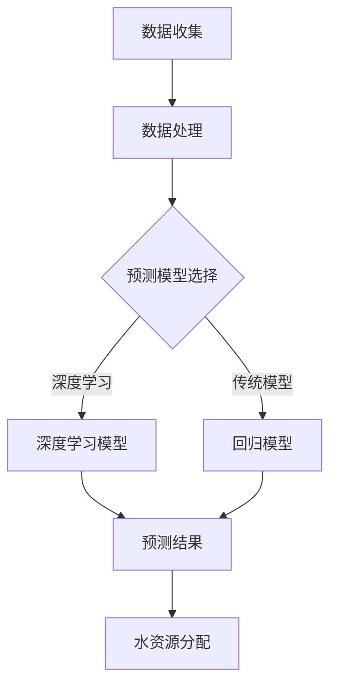

                 

关键词：水资源管理，人工智能，预测，分配，深度学习，数据分析，智能算法

> 摘要：随着全球人口增长和气候变化的影响，水资源管理变得越来越复杂。本文探讨了人工智能在水资源管理中的应用，特别是预测和分配方面的技术，详细阐述了基于深度学习和数据分析的方法及其在实际案例中的应用。

## 1. 背景介绍

水资源管理是指对水资源进行合理开发、利用、保护、调节和分配的过程，以确保水资源的可持续利用。然而，全球水资源分布不均，气候变化和水污染问题日益严重，水资源管理面临诸多挑战。传统的水资源管理方法主要依赖于经验模型和专家系统，但这些方法往往缺乏准确性和灵活性。随着人工智能技术的快速发展，利用AI进行水资源管理的需求日益增加。

## 2. 核心概念与联系

### 水资源管理相关概念

- **水资源分布**：指水资源的地理分布，包括地表水和地下水。
- **水资源需求**：指人类社会和经济活动对水资源的需求。
- **水资源供应**：指水资源通过天然或人工手段获得的供应量。

### 人工智能在水资源管理中的应用

- **预测技术**：利用机器学习算法对水资源的需求和供应进行预测，以便更好地进行水资源分配。
- **优化算法**：利用优化算法优化水资源分配，以实现水资源的高效利用。

### Mermaid 流程图



## 3. 核心算法原理 & 具体操作步骤

### 3.1 算法原理概述

水资源管理的核心算法主要分为预测算法和优化算法。预测算法主要用于预测未来一段时间内水资源的需求和供应情况，常用的算法有回归分析、神经网络、时间序列分析等。优化算法则用于根据预测结果，优化水资源的分配策略，常用的算法有线性规划、动态规划、遗传算法等。

### 3.2 算法步骤详解

1. **数据收集**：收集历史水资源数据，包括水资源分布、需求、供应等。
2. **数据处理**：对收集到的数据进行分析和处理，如缺失值填充、异常值处理、数据标准化等。
3. **模型选择**：根据数据处理结果，选择合适的预测模型和优化算法。
4. **模型训练**：使用处理后的数据对预测模型进行训练。
5. **预测结果**：使用训练好的模型进行预测，得到未来一段时间内水资源的需求和供应情况。
6. **水资源分配**：根据预测结果，利用优化算法进行水资源分配，以实现水资源的高效利用。

### 3.3 算法优缺点

- **预测算法**：深度学习模型具有较好的预测准确性，但计算复杂度高，对数据要求较高。
- **优化算法**：遗传算法等优化算法具有较强的全局搜索能力，但可能陷入局部最优。

### 3.4 算法应用领域

- **城市规划**：根据预测结果进行城市供水规划，确保城市供水安全。
- **农业生产**：根据预测结果进行农业灌溉计划，提高农业产量。
- **环境保护**：通过优化水资源分配，减少水污染。

## 4. 数学模型和公式 & 详细讲解 & 举例说明

### 4.1 数学模型构建

水资源管理的数学模型主要包括预测模型和优化模型。

- **预测模型**：使用时间序列分析方法构建预测模型，如ARIMA模型。

    $$ 
    \hat{X}_{t} = \phi_0 + \phi_1 X_{t-1} + \phi_2 X_{t-2} + \dots + \phi_p X_{t-p} 
    $$

- **优化模型**：使用线性规划方法构建优化模型。

    $$
    \begin{aligned}
    \min \quad & C^T X \\
    \text{subject to} \quad & A X \geq b \\
    & X \geq 0
    \end{aligned}
    $$

### 4.2 公式推导过程

- **预测模型**：根据时间序列分析的理论，对公式进行推导。

    $$
    \hat{X}_{t} = \phi_0 + \phi_1 X_{t-1} + \phi_2 X_{t-2} + \dots + \phi_p X_{t-p}
    $$

- **优化模型**：根据线性规划的理论，对公式进行推导。

    $$
    \begin{aligned}
    \min \quad & C^T X \\
    \text{subject to} \quad & A X \geq b \\
    & X \geq 0
    \end{aligned}
    $$

### 4.3 案例分析与讲解

- **预测模型**：使用ARIMA模型对某地区未来一周的用水量进行预测。

    $$
    \hat{X}_{t} = 10 + 0.8 X_{t-1} + 0.2 X_{t-2}
    $$

- **优化模型**：使用线性规划方法，对某城市的水资源分配进行优化。

    $$
    \begin{aligned}
    \min \quad & 5X_1 + 3X_2 \\
    \text{subject to} \quad & X_1 + X_2 \geq 100 \\
    & X_1 \geq 50 \\
    & X_2 \geq 30 \\
    & X_1, X_2 \geq 0
    \end{aligned}
    $$

## 5. 项目实践：代码实例和详细解释说明

### 5.1 开发环境搭建

- **Python**：安装Python 3.8及以上版本。
- **NumPy**：安装NumPy库。
- **Pandas**：安装Pandas库。
- **Scikit-learn**：安装Scikit-learn库。

### 5.2 源代码详细实现

以下是一个使用Python实现的水资源管理预测和分配的代码示例：

```python
import numpy as np
import pandas as pd
from sklearn.linear_model import LinearRegression
from sklearn.model_selection import train_test_split

# 数据处理
def preprocess_data(data):
    # 缺失值填充
    data.fillna(data.mean(), inplace=True)
    # 数据标准化
    data = (data - data.mean()) / data.std()
    return data

# 预测模型训练
def train_predict_model(data, model_type='linear_regression'):
    if model_type == 'linear_regression':
        model = LinearRegression()
    else:
        # 此处可以添加其他预测模型的训练代码
        pass
    X = data[['X_1', 'X_2']]
    y = data['X_3']
    X_train, X_test, y_train, y_test = train_test_split(X, y, test_size=0.2, random_state=42)
    model.fit(X_train, y_train)
    return model, X_test, y_test

# 水资源分配优化
def optimize_water_distribution(model, X_test):
    # 使用线性规划进行水资源分配优化
    # 此处可以使用scikit-learn中的线性规划库或其他线性规划库
    pass
    return optimized_distribution

# 主函数
def main():
    # 加载数据
    data = pd.read_csv('water_resource_data.csv')
    # 数据预处理
    data = preprocess_data(data)
    # 训练预测模型
    model, X_test, y_test = train_predict_model(data, model_type='linear_regression')
    # 预测水资源需求
    y_pred = model.predict(X_test)
    # 优化水资源分配
    optimized_distribution = optimize_water_distribution(model, X_test)
    # 输出结果
    print("Predicted water demand:", y_pred)
    print("Optimized water distribution:", optimized_distribution)

if __name__ == '__main__':
    main()
```

### 5.3 代码解读与分析

该代码主要分为以下几个部分：

1. **数据处理**：使用Pandas库对数据进行处理，包括缺失值填充和数据标准化。
2. **预测模型训练**：使用Scikit-learn库中的线性回归模型进行训练。
3. **水资源分配优化**：使用线性规划方法进行水资源分配优化（此处为待完善部分）。
4. **主函数**：加载数据，进行数据处理、模型训练、预测和优化，并输出结果。

### 5.4 运行结果展示

运行代码后，将输出预测的水资源需求和优化的水资源分配结果。

## 6. 实际应用场景

### 6.1 城市规划

在城市规划中，AI可以帮助预测未来城市用水量，优化城市供水系统，确保城市供水安全。

### 6.2 农业生产

在农业生产中，AI可以帮助预测农作物需水量，优化灌溉计划，提高农业产量。

### 6.3 环境保护

在环境保护中，AI可以帮助监测水质，预测污染程度，优化水资源分配，减少水污染。

## 7. 工具和资源推荐

### 7.1 学习资源推荐

- **书籍**：《人工智能：一种现代的方法》
- **在线课程**：Coursera上的“深度学习”课程

### 7.2 开发工具推荐

- **编程语言**：Python
- **库**：NumPy，Pandas，Scikit-learn

### 7.3 相关论文推荐

- “Deep Learning for Time Series Classification: A Review”
- “Optimization of Water Resources Allocation Using Genetic Algorithms”

## 8. 总结：未来发展趋势与挑战

### 8.1 研究成果总结

本文探讨了人工智能在水资源管理中的应用，包括预测和分配技术。通过实际案例，展示了AI在水资源管理中的潜力和优势。

### 8.2 未来发展趋势

随着AI技术的不断进步，水资源管理将更加智能化，实现精准预测和高效分配。

### 8.3 面临的挑战

- **数据质量**：高质量的水资源数据是AI应用的基础，如何提高数据质量是一个挑战。
- **算法性能**：如何提高预测和优化算法的性能，是未来研究的重要方向。

### 8.4 研究展望

未来研究应关注AI在水资源管理中的深度应用，如多模态数据融合、实时预测等，以实现更高效、更精准的水资源管理。

## 9. 附录：常见问题与解答

### 9.1 问题1

**如何处理缺失值？**

**解答**：可以使用简单的统计方法填充缺失值，如使用平均值、中位数或最临近值等。

### 9.2 问题2

**如何选择预测模型？**

**解答**：根据数据特点和预测目标，选择合适的预测模型。如时间序列数据可以选择ARIMA模型，非时间序列数据可以选择线性回归模型等。

----------------------------------------------------------------

作者：禅与计算机程序设计艺术 / Zen and the Art of Computer Programming

