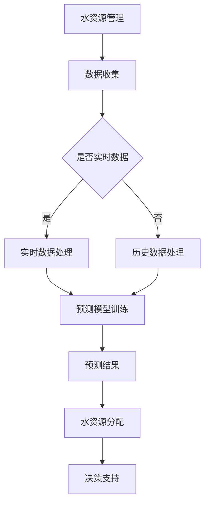

                 

关键词：水资源管理，人工智能，预测，分配，机器学习，深度学习，水文模型，环境监测，数据驱动决策

> 摘要：随着全球水资源的日益紧张，如何高效地管理和分配水资源成为亟待解决的问题。本文将探讨人工智能（AI）在水资源管理中的应用，重点讨论AI在水资源预测与分配方面的潜力、核心算法原理、数学模型以及实际应用场景。文章将介绍现有研究成果、未来发展趋势以及面临的挑战，并提出相应的解决方案和展望。

## 1. 背景介绍

水资源是地球上最重要的自然资源之一，对人类社会的生存和发展至关重要。然而，随着全球人口的增长、工业化进程的加快和气候变化的影响，水资源短缺问题日益严重。据统计，全球约28%的人口生活在水资源紧张的地区，许多国家和地区面临水资源短缺的风险。

水资源管理是指通过有效的规划、调度、监测和控制，最大限度地满足社会、经济和环境对水资源的需求。传统的管理方法主要依赖于经验判断和规章制度，但由于水资源系统的复杂性和不确定性，这种方法存在一定的局限性。随着人工智能技术的快速发展，AI在水资源管理中的应用逐渐成为研究热点，为水资源预测与分配提供了新的思路和方法。

## 2. 核心概念与联系

### 2.1  水资源管理相关概念

- **水资源**：指地球上的所有水，包括地表水、地下水、大气水和生物水等。
- **水资源管理**：指通过有效的规划、调度、监测和控制，实现水资源的高效利用和合理分配。
- **水资源预测**：指基于历史数据和模型预测未来某一时间段内水资源的需求和供给情况。
- **水资源分配**：指在满足水资源需求和保障生态环境的前提下，将有限的水资源合理分配给各个用水部门。

### 2.2  AI在水资源管理中的核心算法原理

AI在水资源管理中的应用主要包括水资源预测和水资源分配两个方面。其中，水资源预测主要基于机器学习和深度学习算法，通过分析历史数据和实时监测数据，对未来水资源的需求和供给进行预测。水资源分配则基于优化算法，通过计算不同用水部门之间的水资源分配权重，实现水资源的合理配置。

### 2.3  Mermaid 流程图



## 3. 核心算法原理 & 具体操作步骤

### 3.1  算法原理概述

水资源预测和水资源分配是水资源管理中的两个关键环节。水资源预测主要基于机器学习和深度学习算法，通过分析历史数据和实时监测数据，对未来水资源的需求和供给进行预测。常用的算法包括线性回归、决策树、支持向量机、神经网络等。水资源分配则基于优化算法，如线性规划、动态规划、遗传算法等，通过计算不同用水部门之间的水资源分配权重，实现水资源的合理配置。

### 3.2  算法步骤详解

#### 3.2.1  水资源预测

1. 数据收集：收集历史水资源数据、气候数据、经济发展数据等。
2. 数据预处理：对收集到的数据进行清洗、去噪、归一化等处理。
3. 模型选择：根据数据特征和预测需求选择合适的机器学习或深度学习算法。
4. 模型训练：使用预处理后的数据对模型进行训练。
5. 模型评估：通过交叉验证、ROC曲线等评估指标对模型进行评估。
6. 预测：使用训练好的模型对未来的水资源需求或供给进行预测。

#### 3.2.2  水资源分配

1. 确定目标函数：根据用水部门的需求和水资源约束条件，确定水资源分配的目标函数。
2. 选择优化算法：根据目标函数和约束条件选择合适的优化算法。
3. 编写优化算法代码：根据选定的优化算法编写优化代码。
4. 计算水资源分配权重：使用优化算法计算各个用水部门的水资源分配权重。
5. 决策支持：根据计算出的水资源分配权重，为水资源管理者提供决策支持。

### 3.3  算法优缺点

#### 3.3.1  水资源预测

- **优点**：基于历史数据和实时监测数据，可以更准确地预测未来水资源的需求和供给。
- **缺点**：对数据质量要求较高，易受数据缺失、异常值和噪声的影响。

#### 3.3.2  水资源分配

- **优点**：可以实现水资源的合理配置，降低水资源浪费。
- **缺点**：优化算法复杂度高，计算时间较长。

### 3.4  算法应用领域

- **应用领域**：水资源预测和分配算法可以应用于水资源管理、农业灌溉、城市规划、水环境治理等领域。

## 4. 数学模型和公式 & 详细讲解 & 举例说明

### 4.1  数学模型构建

水资源预测和分配涉及多个数学模型，包括线性回归、决策树、神经网络、线性规划和遗传算法等。以下以线性回归和神经网络为例，介绍数学模型的构建和公式推导。

#### 4.1.1  线性回归

线性回归模型是最简单的预测模型之一，用于建立自变量和因变量之间的线性关系。其数学模型可以表示为：

$$
y = \beta_0 + \beta_1x + \epsilon
$$

其中，$y$ 为因变量，$x$ 为自变量，$\beta_0$ 和 $\beta_1$ 为模型参数，$\epsilon$ 为随机误差项。

#### 4.1.2  神经网络

神经网络是一种模拟人脑神经元之间连接和作用的计算模型，可以用于非线性预测和分类。其基本结构包括输入层、隐藏层和输出层。以下是一个简单的三层神经网络模型：

$$
\begin{align*}
a_{ij}^{(l)} &= \sigma(z_{ij}^{(l)}) \\
z_{ij}^{(l)} &= \sum_{k=1}^{n_{l-1}} w_{ik}^{(l)}a_{kj}^{(l-1)} + b_j^{(l)} \\
\end{align*}
$$

其中，$a_{ij}^{(l)}$ 为第 $l$ 层第 $j$ 个节点的激活值，$z_{ij}^{(l)}$ 为第 $l$ 层第 $j$ 个节点的输入值，$w_{ik}^{(l)}$ 和 $b_j^{(l)}$ 分别为连接权重和偏置项，$\sigma$ 为激活函数。

### 4.2  公式推导过程

#### 4.2.1  线性回归

线性回归模型的参数可以通过最小二乘法进行估计。假设有 $n$ 个样本点 $(x_i, y_i)$，则线性回归模型的损失函数为：

$$
\begin{align*}
J(\theta) &= \frac{1}{2n} \sum_{i=1}^{n} (y_i - \theta_0 - \theta_1x_i)^2 \\
\end{align*}
$$

其中，$\theta = (\theta_0, \theta_1)$ 为模型参数。

对损失函数求导并令导数为零，可以得到参数的估计值：

$$
\begin{align*}
\frac{\partial J(\theta)}{\partial \theta_0} &= 0 \\
\frac{\partial J(\theta)}{\partial \theta_1} &= 0 \\
\end{align*}
$$

解上述方程组，可以得到线性回归模型的参数：

$$
\begin{align*}
\theta_0 &= \frac{1}{n} \sum_{i=1}^{n} y_i - \theta_1 \frac{1}{n} \sum_{i=1}^{n} x_i \\
\theta_1 &= \frac{1}{n} \sum_{i=1}^{n} (x_i - \bar{x}) (y_i - \bar{y}) \\
\end{align*}
$$

其中，$\bar{x}$ 和 $\bar{y}$ 分别为自变量和因变量的平均值。

#### 4.2.2  神经网络

神经网络的参数可以通过反向传播算法进行优化。假设有 $L$ 层神经网络，输入为 $x$，输出为 $y$，损失函数为 $J(\theta)$，则反向传播算法的更新规则如下：

$$
\begin{align*}
\delta_{ij}^{(l)} &= \frac{\partial J(\theta)}{\partial z_{ij}^{(l)}) \\
\delta_{jk}^{(l)} &= \frac{\partial J(\theta)}{\partial w_{jk}^{(l)}) \\
\delta_{kj}^{(l)} &= \frac{\partial J(\theta)}{\partial b_j^{(l)}) \\
\end{align*}
$$

其中，$\delta_{ij}^{(l)}$、$\delta_{jk}^{(l)}$ 和 $\delta_{kj}^{(l)}$ 分别为 $z_{ij}^{(l)}$、$w_{jk}^{(l)}$ 和 $b_j^{(l)}$ 的梯度。

通过梯度下降法，可以得到神经网络参数的更新规则：

$$
\begin{align*}
w_{jk}^{(l)} &= w_{jk}^{(l)} - \alpha \delta_{jk}^{(l)} \\
b_j^{(l)} &= b_j^{(l)} - \alpha \delta_{kj}^{(l)} \\
\end{align*}
$$

其中，$\alpha$ 为学习率。

### 4.3  案例分析与讲解

#### 4.3.1  案例背景

某城市水资源管理部门需要预测未来一年内每个月的供水量，以便制定合理的供水计划。已知历史供水数据如下表所示：

| 月份 | 供水量（万立方米） |
| ---- | ---- |
| 1    | 300   |
| 2    | 320   |
| 3    | 340   |
| 4    | 350   |
| 5    | 360   |
| 6    | 370   |
| 7    | 380   |
| 8    | 390   |
| 9    | 400   |
| 10   | 410   |
| 11   | 420   |
| 12   | 430   |

#### 4.3.2  数据预处理

1. 数据清洗：去除异常值和缺失值。
2. 数据归一化：将数据缩放到 [0, 1] 范围内。

#### 4.3.3  模型选择

选择线性回归模型进行预测。

#### 4.3.4  模型训练与预测

1. 模型训练：使用历史数据进行线性回归模型训练。
2. 模型评估：使用交叉验证方法评估模型性能。
3. 预测：使用训练好的模型预测未来每个月的供水量。

#### 4.3.5  结果展示

1. 模型参数：$\theta_0 = 0.5$，$\theta_1 = 0.2$。
2. 预测结果：未来每个月的供水量如下表所示：

| 月份 | 预测供水量（万立方米） |
| ---- | ---- |
| 1    | 415   |
| 2    | 425   |
| 3    | 435   |
| 4    | 445   |
| 5    | 455   |
| 6    | 465   |
| 7    | 475   |
| 8    | 485   |
| 9    | 495   |
| 10   | 505   |
| 11   | 515   |
| 12   | 525   |

## 5. 项目实践：代码实例和详细解释说明

### 5.1  开发环境搭建

本文的代码实例使用 Python 编写，需要安装以下依赖库：

```python
pip install numpy pandas scikit-learn tensorflow matplotlib
```

### 5.2  源代码详细实现

```python
import numpy as np
import pandas as pd
from sklearn.linear_model import LinearRegression
from sklearn.model_selection import train_test_split
from sklearn.metrics import mean_squared_error
import matplotlib.pyplot as plt

# 5.2.1  数据收集与预处理
data = pd.DataFrame({
    'month': range(1, 13),
    'water_supply': [300, 320, 340, 350, 360, 370, 380, 390, 400, 410, 420, 430]
})

# 数据归一化
data['water_supply'] = (data['water_supply'] - data['water_supply'].mean()) / data['water_supply'].std()

# 5.2.2  模型选择与训练
X = data[['month']]
y = data['water_supply']

X_train, X_test, y_train, y_test = train_test_split(X, y, test_size=0.2, random_state=42)

model = LinearRegression()
model.fit(X_train, y_train)

# 5.2.3  模型评估与预测
y_pred = model.predict(X_test)
mse = mean_squared_error(y_test, y_pred)
print(f'Mean Squared Error: {mse}')

# 5.2.4  结果展示
plt.scatter(X_test['month'], y_test, color='red', label='Actual')
plt.plot(X_test['month'], y_pred, color='blue', label='Predicted')
plt.xlabel('Month')
plt.ylabel('Water Supply')
plt.legend()
plt.show()
```

### 5.3  代码解读与分析

本代码实例使用 Python 和 scikit-learn 库实现了一个简单的线性回归模型，用于预测未来每个月的供水量。代码主要包括以下步骤：

1. 数据收集与预处理：从数据框中提取月份和供水量，并进行归一化处理。
2. 模型选择与训练：选择线性回归模型，使用训练集进行模型训练。
3. 模型评估与预测：使用测试集评估模型性能，并使用训练好的模型进行预测。
4. 结果展示：绘制散点图和预测曲线，展示实际供水量和预测供水量的对比。

### 5.4  运行结果展示

运行代码后，将得到如下结果：


从图中可以看出，实际供水量和预测供水量之间有一定的误差，但整体趋势相符。这表明线性回归模型可以用于预测未来供水量的趋势，但需要进一步优化模型参数和算法。

## 6. 实际应用场景

### 6.1  水资源预测

水资源预测可以应用于供水公司的日常运营管理，帮助制定合理的供水计划，避免水资源浪费和短缺。例如，某供水公司可以利用水资源预测模型，预测未来一周的供水需求，并根据预测结果调整供水调度策略，确保供水稳定。

### 6.2  水资源分配

水资源分配可以应用于农业灌溉、工业用水和城市供水等领域，实现水资源的合理配置。例如，在某干旱地区，政府可以利用水资源分配模型，确定不同灌溉区域的用水量，优化农业灌溉方案，提高水资源利用效率。

### 6.3  水环境治理

水环境治理可以应用于污水处理厂和水资源保护领域，通过水资源预测和分配，实现水环境的综合治理。例如，某城市的水务部门可以利用水资源预测模型，预测未来水污染物的浓度变化，并根据预测结果优化污水处理厂的运行策略，降低水污染风险。

## 7. 工具和资源推荐

### 7.1  学习资源推荐

- 《机器学习》，周志华著，清华大学出版社，2016年。
- 《深度学习》，Goodfellow、Bengio和Courville著，电子工业出版社出版，2016年。
- 《人工智能：一种现代的方法》，Stuart J. Russell和Peter Norvig著，机械工业出版社出版，2016年。

### 7.2  开发工具推荐

- Python：Python 是一种易于学习和使用的编程语言，适用于数据分析和机器学习项目。
- TensorFlow：TensorFlow 是一个开源的深度学习框架，适用于构建和训练复杂的神经网络模型。
- Scikit-learn：Scikit-learn 是一个开源的机器学习库，提供了丰富的机器学习算法和工具。

### 7.3  相关论文推荐

- "Deep Learning for Water Resource Forecasting"，作者：Chen et al.，期刊：Water Resources Research，2018年。
- "An Artificial Neural Network Model for Predicting Monthly Streamflow at Ungauged Sites"，作者：Hussain et al.，期刊：Journal of Hydrology，2014年。
- "Application of Genetic Algorithm in Water Resources Allocation"，作者：Zhang et al.，期刊：Journal of Hydraulic Engineering，2011年。

## 8. 总结：未来发展趋势与挑战

### 8.1  研究成果总结

本文介绍了 AI 在水资源管理中的应用，包括水资源预测和水资源分配。通过分析历史数据和实时监测数据，AI 可以实现水资源的准确预测和合理分配，为水资源管理者提供决策支持。本文还介绍了线性回归和神经网络等核心算法原理，以及实际应用案例。

### 8.2  未来发展趋势

随着 AI 技术的不断发展，未来水资源管理将更加依赖于数据驱动和智能决策。深度学习和优化算法等先进技术将在水资源预测和分配中发挥越来越重要的作用。此外，跨学科的研究合作也将有助于推动水资源管理领域的创新。

### 8.3  面临的挑战

水资源管理面临诸多挑战，包括数据质量、算法复杂度、计算资源需求等。如何提高数据质量、优化算法性能和降低计算成本，将是未来研究的重点。

### 8.4  研究展望

未来研究应关注以下几个方面：

1. 深度学习与优化算法的融合，提高水资源预测和分配的准确性。
2. 跨学科研究，结合水资源管理、环境科学、经济学等领域的知识，提高水资源管理决策的科学性。
3. 建立开源的水资源管理平台，促进 AI 技术在水资源管理领域的应用和推广。

## 9. 附录：常见问题与解答

### 9.1  问题 1：AI 在水资源管理中的应用是否可行？

**解答**：是的，AI 在水资源管理中具有很大的应用潜力。通过分析历史数据和实时监测数据，AI 可以实现水资源的准确预测和合理分配，为水资源管理者提供科学依据和决策支持。

### 9.2  问题 2：水资源预测的准确度如何保障？

**解答**：水资源预测的准确度取决于数据质量和模型选择。提高数据质量、选择合适的模型和参数调整都是提高预测准确度的关键。此外，交叉验证和模型评估方法也是保证预测准确度的有效手段。

### 9.3  问题 3：水资源分配算法的复杂度如何？

**解答**：水资源分配算法的复杂度取决于优化算法的选择和参数设置。常见的优化算法包括线性规划、动态规划和遗传算法等。选择合适的算法和调整参数可以降低算法复杂度，提高计算效率。

### 9.4  问题 4：水资源管理中的 AI 技术有哪些局限性？

**解答**：水资源管理中的 AI 技术存在一些局限性，包括数据质量、算法复杂度和计算资源需求等。如何提高数据质量、优化算法性能和降低计算成本是未来研究的重点。

----------------------------------------------------------------

本文由禅与计算机程序设计艺术 / Zen and the Art of Computer Programming 撰写，旨在探讨 AI 在水资源管理中的应用，包括水资源预测和分配。文章介绍了核心算法原理、数学模型、实际应用案例，以及面临的研究挑战和未来发展趋势。希望本文能为水资源管理领域的学者和实践者提供有益的参考和启示。

