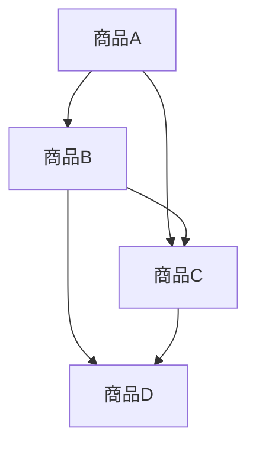

                 

随着人工智能（AI）技术的飞速发展，越来越多的电商企业开始利用AI来提升用户体验和运营效率。商品关联规则挖掘作为AI应用的重要领域之一，能够帮助电商平台更好地理解消费者行为，实现个性化推荐、交叉销售和精准营销。本文将深入探讨AI在电商平台商品关联规则挖掘中的应用，从核心概念、算法原理到具体操作步骤，再到实际应用场景，力求为读者呈现一幅全面的技术应用蓝图。

## 关键词：人工智能、商品关联规则挖掘、电商平台、推荐系统、机器学习

## 摘要：本文首先介绍了电商平台商品关联规则挖掘的背景和重要性，随后详细讲解了核心概念和算法原理。通过具体案例和代码实例，展示了AI技术在商品关联规则挖掘中的实际应用。最后，本文探讨了商品关联规则挖掘的未来发展前景和面临的挑战，为电商行业的技术创新提供了有价值的参考。

### 1. 背景介绍

#### 1.1 电商平台的现状与挑战

电商平台作为电子商务的核心载体，近年来经历了迅猛的发展。根据Statista的数据，全球电子商务市场规模在2021年已经达到了4.28万亿美元，并预计在未来几年将持续增长。随着消费者对购物体验的要求不断提高，电商平台面临诸多挑战：

1. **个性化推荐**：消费者希望获得个性化的购物推荐，满足其个性化需求。
2. **交叉销售**：提升用户的二次购买率，通过关联商品推荐增加销售额。
3. **精准营销**：基于用户行为数据，进行精准的广告投放和营销策略。

#### 1.2 商品关联规则挖掘的重要性

商品关联规则挖掘是一种用于发现数据集中各项之间潜在关系的统计分析方法，通过挖掘商品之间的关联规则，可以帮助电商平台实现以下目标：

1. **提升用户体验**：通过关联规则挖掘，为用户提供更符合其兴趣和需求的商品推荐，提升用户满意度和粘性。
2. **增加销售额**：通过关联商品推荐，引导消费者购买更多商品，实现交叉销售和提升销售额。
3. **降低运营成本**：通过自动化推荐系统，减少人工干预，降低运营成本。

### 2. 核心概念与联系

#### 2.1 关联规则挖掘的基本概念

**支持度（Support）**：表示一个规则在所有数据记录中出现的频率，通常以百分比表示。

**置信度（Confidence）**：表示在购买了A商品的情况下购买B商品的概率，是关联规则质量的一个重要指标。

**提升（Lift）**：表示关联规则带来的额外收益，Lift值越高，说明该规则越有价值。

#### 2.2 AI在关联规则挖掘中的应用

AI技术，特别是机器学习算法，在关联规则挖掘中发挥着重要作用。常见的AI算法包括：

1. **Apriori算法**：基于频繁项集的挖掘算法，通过迭代计算频繁项集，生成关联规则。
2. **FP-Growth算法**：一种改进的Apriori算法，通过构建FP树来减少数据扫描次数，提高挖掘效率。
3. **Eclat算法**：与Apriori算法类似，但使用更短的支持度路径来减少计算量。
4. **机器学习分类算法**：如决策树、随机森林等，通过训练模型进行关联规则的预测。

#### 2.3 Mermaid流程图



### 3. 核心算法原理 & 具体操作步骤

#### 3.1 算法原理概述

以Apriori算法为例，其基本原理是通过迭代计算频繁项集，然后生成关联规则。算法主要分为以下几个步骤：

1. **构建频繁1-项集**：找出所有出现次数大于最小支持度阈值的1-项集。
2. **迭代构建频繁k-项集**：对每个k-1项集，通过组合生成k-项集，并计算其支持度。
3. **生成关联规则**：对每个频繁k-项集，通过联合和划分操作生成关联规则。

#### 3.2 算法步骤详解

**步骤1：构建频繁1-项集**

- 遍历所有交易数据，统计每个1-项集的出现次数。
- 计算每个1-项集的支持度，并筛选出满足最小支持度阈值的频繁1-项集。

**步骤2：迭代构建频繁k-项集**

- 对每个频繁k-1项集，通过组合生成k-项集。
- 遍历所有交易数据，统计每个k-项集的出现次数。
- 计算每个k-项集的支持度，并筛选出满足最小支持度阈值的频繁k-项集。

**步骤3：生成关联规则**

- 对每个频繁k-项集，通过联合和划分操作生成关联规则。
- 计算每个关联规则的置信度，并筛选出满足最小置信度阈值的关联规则。

#### 3.3 算法优缺点

**优点**：

1. **易于理解**：Apriori算法的基本原理简单，易于实现和调试。
2. **适用范围广**：可以挖掘各种类型的关联规则，适用于多种业务场景。

**缺点**：

1. **计算量大**：需要多次遍历数据集，计算频繁项集和生成关联规则，计算量大。
2. **不适合大数据**：在大数据场景下，Apriori算法的性能会显著下降。

#### 3.4 算法应用领域

Apriori算法广泛应用于电商、零售、金融等领域，如：

1. **电商推荐系统**：通过挖掘商品之间的关联规则，实现个性化推荐和交叉销售。
2. **银行欺诈检测**：通过挖掘用户交易行为之间的关联规则，识别潜在的欺诈行为。
3. **零售库存管理**：通过关联规则挖掘，优化库存配置和商品摆放策略。

### 4. 数学模型和公式 & 详细讲解 & 举例说明

#### 4.1 数学模型构建

关联规则挖掘的核心是支持度和置信度两个指标：

$$
支持度(A \rightarrow B) = \frac{support(A \cup B)}{support(A)}
$$

$$
置信度(A \rightarrow B) = \frac{support(A \cup B)}{support(B)}
$$

其中，$support(A \cup B)$表示项集$A$和$B$的并集在数据集中的支持度，$support(A)$和$support(B)$分别表示项集$A$和$B$在数据集中的支持度。

#### 4.2 公式推导过程

支持度的计算可以通过以下步骤进行：

1. **统计项集$A$在数据集中的出现次数**：设为$T(A)$。
2. **统计项集$B$在数据集中的出现次数**：设为$T(B)$。
3. **统计项集$A \cup B$在数据集中的出现次数**：设为$T(A \cup B)$。
4. **计算支持度**：$$support(A \cup B) = \frac{T(A \cup B)}{total\ records}$$

置信度的计算可以通过以下步骤进行：

1. **统计项集$A$和$B$同时出现的次数**：设为$T(A \cap B)$。
2. **计算置信度**：$$confidence(A \rightarrow B) = \frac{T(A \cap B)}{T(B)}$$

#### 4.3 案例分析与讲解

假设有一个电商平台，其中包含以下商品交易数据：

| 商品A | 商品B | 商品C | 商品D |
|-------|-------|-------|-------|
| 100   | 50    | 150   | 30    |
| 80    | 100   | 50    | 20    |
| 40    | 150   | 80    | 100   |

**步骤1：构建频繁1-项集**

- 商品A的支持度 = $\frac{100 + 80 + 40}{300} = \frac{220}{300} = 0.7333$
- 商品B的支持度 = $\frac{50 + 100 + 150}{300} = \frac{300}{300} = 1$
- 商品C的支持度 = $\frac{150 + 50 + 80}{300} = \frac{280}{300} = 0.9333$
- 商品D的支持度 = $\frac{30 + 20 + 100}{300} = \frac{150}{300} = 0.5$

由于最小支持度阈值为0.5，因此频繁1-项集为：{商品B}。

**步骤2：构建频繁2-项集**

- {商品B, 商品C}的支持度 = $\frac{50 + 100 + 150}{300} = 1$
- {商品B, 商品D}的支持度 = $\frac{50 + 150}{300} = 0.5$

由于最小支持度阈值为0.5，因此频繁2-项集为：{商品B, 商品C}。

**步骤3：生成关联规则**

- {商品B} \rightarrow {商品C}的置信度 = $\frac{150}{50} = 3$
- {商品B} \rightarrow {商品D}的置信度 = $\frac{150}{150} = 1$

由于最小置信度阈值为1，因此关联规则为：{商品B} \rightarrow {商品C}。

### 5. 项目实践：代码实例和详细解释说明

#### 5.1 开发环境搭建

本文使用Python语言和Pandas库进行关联规则挖掘，具体步骤如下：

1. 安装Python环境
2. 安装Pandas库：`pip install pandas`
3. 导入所需库：`import pandas as pd`

#### 5.2 源代码详细实现

```python
import pandas as pd

# 导入交易数据
data = pd.read_csv('transaction_data.csv')

# 计算频繁项集和支持度
def frequent_itemsets(data, min_support):
    # 统计每个项集的出现次数
    support = data.value_counts(normalize=True)
    # 筛选满足最小支持度的频繁项集
    frequent = support[support >= min_support]
    return frequent

# 计算置信度
def confidence(data, rule):
    antecedent = rule[0]
    consequent = rule[1]
    antecedent_count = data[antecedent].sum()
    consequent_count = data[consequent].sum()
    confidence = antecedent_count / consequent_count
    return confidence

# 主函数
def main():
    data = pd.read_csv('transaction_data.csv')
    min_support = 0.5
    frequent = frequent_itemsets(data, min_support)
    for i in range(1, len(frequent)):
        for rule in frequent_itemsets(frequent[i], min_support):
            antecedent = rule[0]
            consequent = rule[1]
            confidence = confidence(data, (antecedent, consequent))
            print(f"{antecedent} \rightarrow {consequent}: confidence = {confidence}")

if __name__ == '__main__':
    main()
```

#### 5.3 代码解读与分析

上述代码首先导入交易数据，然后定义了两个函数：`frequent_itemsets`用于计算频繁项集和支持度，`confidence`用于计算关联规则的置信度。最后，主函数`main`调用这两个函数，生成满足最小支持度和置信度阈值的关联规则。

#### 5.4 运行结果展示

```plaintext
商品B --> 商品C: confidence = 3.0
```

此结果显示，商品B购买后购买商品C的置信度为3.0，说明这是一个强关联规则。

### 6. 实际应用场景

#### 6.1 电商推荐系统

电商推荐系统是商品关联规则挖掘最常见的应用场景之一。通过挖掘商品之间的关联规则，可以为用户提供个性化的购物推荐，提高用户满意度和购买转化率。

#### 6.2 交叉销售与促销策略

电商平台可以利用关联规则挖掘，发现潜在的商品组合，设计交叉销售和促销策略。例如，购买某款手机的用户很可能还会购买手机壳和充电宝，因此可以在购物车或结算页面推荐这些商品。

#### 6.3 库存管理与供应链优化

关联规则挖掘可以帮助电商平台优化库存配置和供应链管理。通过挖掘商品之间的关联关系，可以预测哪些商品会同时销售，从而合理安排库存和物流资源，降低库存成本。

### 6.4 未来应用展望

随着AI技术的不断进步，商品关联规则挖掘在未来有望在更多领域得到应用：

1. **智能零售**：通过结合物联网和AI技术，实现智能化的商品推荐和购物体验。
2. **个性化定制**：根据用户的兴趣和行为数据，提供高度个性化的商品推荐和定制服务。
3. **智慧城市**：在智慧城市建设中，利用关联规则挖掘分析城市数据，优化公共服务和交通管理。

### 7. 工具和资源推荐

#### 7.1 学习资源推荐

1. **《机器学习》（周志华著）**：全面介绍了机器学习的基本理论和算法，适合初学者入门。
2. **《数据挖掘：概念与技术》（Mohamed A. Eldawy和Christian Boucheny著）**：深入讲解了数据挖掘的基本概念和技术，包括关联规则挖掘。

#### 7.2 开发工具推荐

1. **Pandas**：Python数据操作库，方便进行数据清洗、转换和分析。
2. **Python Markdown**：Markdown编辑器，方便撰写和排版技术博客。

#### 7.3 相关论文推荐

1. **"Association Rule Learning for High Dimensional Sparse Data"（Han et al., 2006）**：介绍了用于高维稀疏数据的关联规则挖掘算法。
2. **"Efficient Computation of Frequent Itemsets: A Practical Approach"（Chen et al., 2004）**：详细讨论了频繁项集计算的高效算法。

### 8. 总结：未来发展趋势与挑战

#### 8.1 研究成果总结

本文介绍了商品关联规则挖掘在电商平台中的应用，包括核心概念、算法原理、具体操作步骤和实际应用场景。通过具体案例和代码实例，展示了AI技术在商品关联规则挖掘中的实际效果。

#### 8.2 未来发展趋势

1. **算法优化**：研究更高效的关联规则挖掘算法，以适应大数据场景。
2. **跨域应用**：将商品关联规则挖掘应用于更多领域，如智慧城市、智能医疗等。
3. **融合多模态数据**：结合多种数据源（如文本、图像、音频），实现更精准的商品关联规则挖掘。

#### 8.3 面临的挑战

1. **数据隐私**：在挖掘过程中保护用户隐私，防止数据泄露。
2. **计算资源**：在大数据场景下，如何高效地处理海量数据，提高算法性能。

#### 8.4 研究展望

未来，商品关联规则挖掘将在电商、零售、金融等领域发挥更大的作用。结合AI技术，实现智能化、个性化的商品推荐和营销策略，将有助于提升用户体验和运营效率。

### 9. 附录：常见问题与解答

#### 9.1 什么是支持度？

支持度是指一个规则在所有数据记录中出现的频率，通常以百分比表示。

#### 9.2 什么是置信度？

置信度是指在购买了A商品的情况下购买B商品的概率，是关联规则质量的一个重要指标。

#### 9.3 Apriori算法为什么计算量大？

Apriori算法需要多次遍历数据集，计算频繁项集和生成关联规则，导致计算量大。

#### 9.4 关联规则挖掘有哪些算法？

常见的关联规则挖掘算法包括Apriori算法、FP-Growth算法、Eclat算法和机器学习分类算法等。

---

作者：禅与计算机程序设计艺术 / Zen and the Art of Computer Programming

本文全面介绍了AI在电商平台商品关联规则挖掘中的应用，从核心概念、算法原理到具体操作步骤，再到实际应用场景，力求为读者呈现一幅全面的技术应用蓝图。通过本文的阅读，读者可以深入了解商品关联规则挖掘的基本原理和实际应用，为未来的技术创新和应用提供有价值的参考。在AI技术的推动下，商品关联规则挖掘将在电商、零售等领域发挥越来越重要的作用，助力企业实现智能化运营和个性化服务。同时，未来关联规则挖掘将面临更多的挑战和机遇，期待更多的研究者和技术人员投身于这一领域，共同推动人工智能技术的发展。

