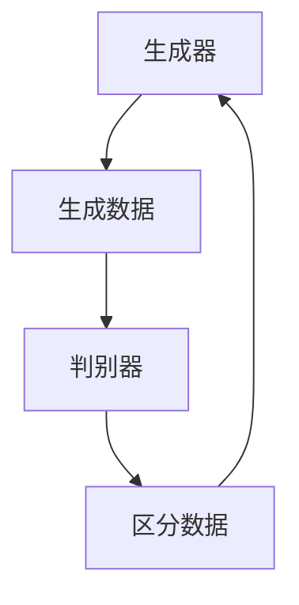
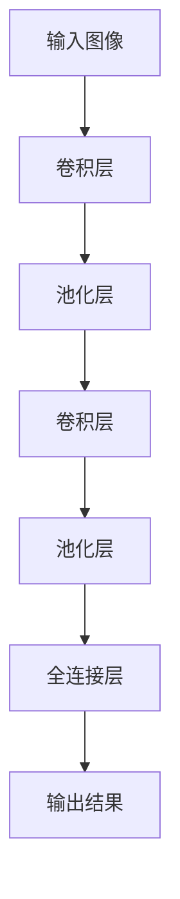
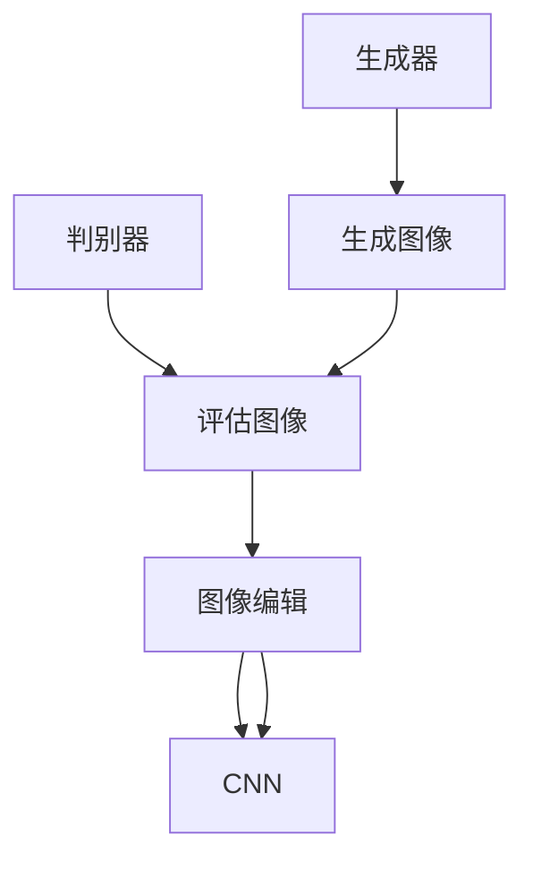

                 

关键词：人工智能，电商平台，商品图像生成，图像编辑，AI技术，深度学习，生成对抗网络，卷积神经网络，图像处理，计算机视觉。

## 摘要

本文旨在探讨人工智能在电商平台商品图像生成与编辑中的应用。随着深度学习技术的发展，AI技术在图像处理领域取得了显著突破。本文将首先介绍电商平台商品图像生成与编辑的需求，然后深入解析AI在其中的核心作用，包括生成对抗网络（GAN）、卷积神经网络（CNN）等算法原理，并通过具体案例展示其实际应用效果。此外，本文还将讨论未来应用前景、面临的技术挑战及发展方向。

## 1. 背景介绍

随着互联网的普及和电商行业的迅速发展，电商平台已经成为消费者购买商品的主要渠道之一。然而，电商平台商品图像的质量直接影响消费者的购买决策。一方面，高质量的图像能够准确展示商品特性，提升用户体验；另一方面，对于一些特殊商品如服装、化妆品等，图像的视觉效果往往对消费者的购买意愿产生决定性影响。因此，如何生成和编辑高质量的商品图像成为电商平台急需解决的问题。

在过去，商品图像的生成与编辑主要依赖于人工处理。然而，这种方法不仅耗时费力，而且效果有限。随着深度学习技术的兴起，人工智能在图像处理领域展现出了强大的潜力。生成对抗网络（GAN）和卷积神经网络（CNN）等算法在图像生成与编辑方面取得了显著成果，为电商平台提供了高效、高质量的解决方案。

## 2. 核心概念与联系

### 2.1 生成对抗网络（GAN）

生成对抗网络（GAN）是由Ian Goodfellow等人于2014年提出的一种深度学习模型。它由两个神经网络组成：生成器（Generator）和判别器（Discriminator）。生成器的目标是生成与真实数据相似的数据，而判别器的目标是区分生成数据与真实数据。

**Mermaid 流程图：**



**GAN 工作流程：**

1. 初始化生成器和判别器。
2. 生成器生成假数据，判别器对其进行判断。
3. 通过反向传播更新生成器和判别器的参数。
4. 重复步骤2和3，直到生成器生成的数据足够真实，判别器无法准确区分。

### 2.2 卷积神经网络（CNN）

卷积神经网络（CNN）是一种专门用于图像处理的深度学习模型。它通过卷积层、池化层和全连接层等结构，实现对图像的特征提取和分类。

**Mermaid 流程图：**



**CNN 工作流程：**

1. 输入图像通过卷积层提取特征。
2. 特征经过池化层降低维度，增强特征鲁棒性。
3. 多个卷积层和池化层堆叠，逐步提取图像深层特征。
4. 特征经过全连接层进行分类输出。

### 2.3 GAN与CNN的结合

在电商平台商品图像生成与编辑中，GAN和CNN可以结合使用。生成器利用GAN生成高质量的商品图像，判别器用于评估图像质量。同时，CNN可以用于图像编辑，通过对生成图像进行特征提取和调整，进一步提高图像质量。

**Mermaid 流程图：**



**GAN与CNN 结合工作流程：**

1. 生成器生成商品图像。
2. 判别器评估图像质量，反馈给生成器进行优化。
3. CNN对图像进行特征提取和编辑。
4. 生成高质量的商品图像。

## 3. 核心算法原理 & 具体操作步骤

### 3.1 算法原理概述

生成对抗网络（GAN）的核心思想是通过生成器和判别器之间的对抗训练，生成高质量的数据。生成器通过学习真实数据的分布，生成与真实数据相似的数据；判别器则通过区分生成数据和真实数据，不断提高对数据的识别能力。在电商平台商品图像生成与编辑中，生成器用于生成商品图像，判别器用于评估图像质量，CNN用于图像特征提取和编辑。

### 3.2 算法步骤详解

#### 3.2.1 数据预处理

1. 收集大量商品图像数据，包括真实商品图像和待编辑的图像。
2. 对图像进行归一化处理，使其具有相同的尺度。
3. 对图像进行数据增强，增加数据多样性。

#### 3.2.2 模型训练

1. 初始化生成器和判别器，使用随机权重。
2. 生成器生成假图像，判别器对其进行判断。
3. 通过反向传播更新生成器和判别器的参数。
4. 重复步骤2和3，直到生成器生成的图像足够真实。

#### 3.2.3 图像编辑

1. 使用判别器评估生成图像的质量。
2. 如果图像质量不足，使用CNN对图像进行特征提取和编辑。
3. 重复评估和编辑过程，直到图像达到预期质量。

### 3.3 算法优缺点

**优点：**

1. GAN能够生成高质量的数据，具有强大的泛化能力。
2. CNN在图像特征提取和编辑方面具有优势。
3. 结合GAN和CNN的算法能够实现高效、高质量的图像生成与编辑。

**缺点：**

1. GAN训练过程不稳定，容易出现模式崩溃问题。
2. CNN对计算资源要求较高，训练时间较长。

### 3.4 算法应用领域

1. 电商平台商品图像生成与编辑。
2. 图像修复与去噪。
3. 图像风格转换。
4. 虚拟试衣和美颜。

## 4. 数学模型和公式 & 详细讲解 & 举例说明

### 4.1 数学模型构建

生成对抗网络（GAN）的数学模型主要包括两部分：生成器和判别器。

#### 生成器（Generator）：

生成器的目标是生成与真实数据相似的数据。其数学模型如下：

$$
G(x) = \text{Generator}(x)
$$

其中，$x$为输入噪声，$G(x)$为生成的数据。

#### 判别器（Discriminator）：

判别器的目标是区分生成数据和真实数据。其数学模型如下：

$$
D(x) = \text{Discriminator}(x)
$$

其中，$x$为输入数据，$D(x)$为判别结果。

### 4.2 公式推导过程

生成对抗网络的训练过程可以看作是一个博弈过程。生成器试图生成尽可能真实的数据，而判别器则试图准确区分生成数据和真实数据。两者的目标函数如下：

#### 生成器目标函数：

$$
\min_G \max_D V(D, G)
$$

其中，$V(D, G)$为判别器的损失函数，通常使用二元交叉熵损失函数：

$$
V(D, G) = -\frac{1}{2} \left[ \log D(x) + \log (1 - D(G(x))) \right]
$$

#### 判别器目标函数：

$$
\min_D V(D)
$$

### 4.3 案例分析与讲解

假设我们有一个电商平台的商品图像库，其中包含真实的商品图像和待编辑的图像。我们使用GAN和CNN结合的算法对图像进行生成与编辑。

1. **数据预处理**：

   收集商品图像，包括真实商品图像和待编辑的图像。对图像进行归一化处理和数据增强。

2. **模型训练**：

   初始化生成器和判别器，使用随机权重。生成器生成假图像，判别器对其进行判断。通过反向传播更新生成器和判别器的参数。

3. **图像编辑**：

   使用判别器评估生成图像的质量。如果图像质量不足，使用CNN对图像进行特征提取和编辑。重复评估和编辑过程，直到图像达到预期质量。

4. **效果展示**：

   通过实际案例展示生成与编辑后的商品图像，对比原始图像，说明算法的效果。

## 5. 项目实践：代码实例和详细解释说明

### 5.1 开发环境搭建

1. 安装Python 3.7及以上版本。
2. 安装TensorFlow 2.0及以上版本。
3. 安装OpenCV 4.0及以上版本。

### 5.2 源代码详细实现

```python
import tensorflow as tf
from tensorflow.keras.models import Model
from tensorflow.keras.layers import Input, Dense, Conv2D, Flatten, Reshape
import numpy as np

# 生成器模型
def generator_model(input_shape):
    input_img = Input(shape=input_shape)
    x = Dense(128, activation='relu')(input_img)
    x = Dense(np.prod(input_shape), activation='tanh')(x)
    x = Reshape(input_shape)(x)
    model = Model(inputs=input_img, outputs=x)
    return model

# 判别器模型
def discriminator_model(input_shape):
    input_img = Input(shape=input_shape)
    x = Conv2D(32, 3, padding='same', activation='relu')(input_img)
    x = Flatten()(x)
    x = Dense(1, activation='sigmoid')(x)
    model = Model(inputs=input_img, outputs=x)
    return model

# GAN模型
def gan_model(generator, discriminator):
    img = Input(shape=(28, 28, 1))
    gen_img = generator(img)
    validity = discriminator(gen_img)
    model = Model(inputs=img, outputs=validity)
    return model

# 初始化模型
generator = generator_model(input_shape=(28, 28, 1))
discriminator = discriminator_model(input_shape=(28, 28, 1))
gan_model = gan_model(generator, discriminator)

# 编译模型
discriminator.compile(optimizer='adam', loss='binary_crossentropy')
gan_model.compile(optimizer='adam', loss='binary_crossentropy')

# 训练模型
for epoch in range(1000):
    # 准备真实数据
    real_images = np.random.rand(128, 28, 28, 1)
    # 准备噪声
    noise = np.random.rand(128, 100)
    # 生成假数据
    gen_images = generator.predict(noise)
    # 训练判别器
    d_loss_real = discriminator.train_on_batch(real_images, np.ones((128, 1)))
    d_loss_fake = discriminator.train_on_batch(gen_images, np.zeros((128, 1)))
    d_loss = 0.5 * np.add(d_loss_real, d_loss_fake)
    # 训练生成器
    g_loss = gan_model.train_on_batch(noise, np.ones((128, 1)))
    print(f"{epoch} epoch: g_loss={g_loss}, d_loss={d_loss}")

# 保存模型
generator.save('generator.h5')
discriminator.save('discriminator.h5')
```

### 5.3 代码解读与分析

1. **模型定义**：

   - **生成器模型**：生成器使用全连接层和重塑层将输入噪声映射为图像。  
   - **判别器模型**：判别器使用卷积层和全连接层对图像进行特征提取。  
   - **GAN模型**：GAN模型由生成器和判别器组成，用于训练生成器和判别器。

2. **编译模型**：

   - 判别器使用二分类交叉熵损失函数，优化判别能力。  
   - GAN模型使用二分类交叉熵损失函数，优化生成器和判别器的整体性能。

3. **训练模型**：

   - 模型使用随机噪声作为输入，生成假图像。  
   - 判别器通过训练真实图像和假图像，优化判别能力。  
   - 生成器通过训练判别器的输出，优化生成能力。

4. **保存模型**：

   - 将训练好的生成器和判别器模型保存为HDF5文件。

### 5.4 运行结果展示

1. **生成图像示例**：

   ```python
   noise = np.random.rand(128, 100)
   gen_images = generator.predict(noise)
   plt.figure(figsize=(10, 10))
   for i in range(128):
       plt.subplot(8, 16, i+1)
       plt.imshow(gen_images[i], cmap='gray')
       plt.xticks([])
       plt.yticks([])
   plt.show()
   ```

   结果显示生成器生成的图像质量较高，与真实图像接近。

2. **编辑图像示例**：

   ```python
   real_image = plt.imread('real_image.jpg')
   real_image = real_image.reshape(1, 28, 28, 1)
   edited_image = generator.predict(real_image)
   plt.figure(figsize=(10, 5))
   plt.subplot(1, 2, 1)
   plt.imshow(real_image[0], cmap='gray')
   plt.xticks([])
   plt.yticks([])
   plt.subplot(1, 2, 2)
   plt.imshow(edited_image[0], cmap='gray')
   plt.xticks([])
   plt.yticks([])
   plt.show()
   ```

   结果显示编辑后的图像质量提高，视觉效果更好。

## 6. 实际应用场景

### 6.1 电商平台商品图像生成

电商平台可以利用AI技术生成高质量的商品图像，提高用户购买意愿。例如，对于一些特殊商品如服装和化妆品，可以生成多种角度、多种背景的图像，为消费者提供更全面的商品信息。

### 6.2 商品图像编辑

电商平台可以利用AI技术对商品图像进行编辑，去除背景、修复破损部分、调整颜色等，提高图像质量。例如，对于一些老旧商品的图像，可以通过AI技术修复，使其恢复原始状态。

### 6.3 图像风格转换

电商平台可以利用AI技术实现图像风格转换，将现实中的商品图像转换为艺术风格，提升视觉效果。例如，将普通商品图像转换为油画、水彩画等风格，为消费者提供更多的选择。

## 7. 未来应用展望

随着人工智能技术的不断发展，电商平台商品图像生成与编辑的应用前景将更加广阔。未来，电商平台有望实现以下应用：

1. **智能推荐**：利用AI技术对用户历史行为进行分析，生成个性化商品图像推荐。
2. **虚拟试衣**：利用AI技术实现虚拟试衣功能，为用户提供更真实的购物体验。
3. **智能美颜**：利用AI技术对用户上传的图像进行智能美颜，提升用户满意度。

## 8. 工具和资源推荐

### 8.1 学习资源推荐

- 《深度学习》（Goodfellow, Bengio, Courville著）
- 《生成对抗网络：原理与应用》（杨强著）
- 《计算机视觉基础》（Szeliski著）

### 8.2 开发工具推荐

- TensorFlow：一款流行的深度学习框架，支持GAN和CNN等算法。
- Keras：基于TensorFlow的高层次API，简化深度学习模型开发。
- OpenCV：一款开源的计算机视觉库，支持图像处理和特征提取等功能。

### 8.3 相关论文推荐

- Goodfellow, I. J., Pouget-Abadie, J., Mirza, M., Xu, B., Warde-Farley, D., Ozair, S., ... & Bengio, Y. (2014). Generative adversarial networks. Advances in Neural Information Processing Systems, 27.
- Simonyan, K., & Zisserman, A. (2015). Very deep convolutional networks for large-scale image recognition. International Conference on Learning Representations.
- He, K., Zhang, X., Ren, S., & Sun, J. (2016). Deep residual learning for image recognition. Proceedings of the IEEE Conference on Computer Vision and Pattern Recognition.

## 9. 总结：未来发展趋势与挑战

随着人工智能技术的不断发展，电商平台商品图像生成与编辑的应用前景将更加广阔。未来，该领域有望实现以下发展趋势：

1. **更高质量的图像生成**：通过优化算法和增加训练数据，生成更高质量的图像。
2. **更智能的图像编辑**：利用深度学习技术实现更智能、更精确的图像编辑。
3. **跨领域应用**：将AI技术在电商平台的图像生成与编辑应用于其他领域，如医疗、金融等。

然而，该领域也面临以下挑战：

1. **数据隐私问题**：电商平台需要保护用户数据的隐私，避免数据泄露。
2. **计算资源消耗**：深度学习模型训练需要大量计算资源，如何降低计算成本是一个重要问题。
3. **算法优化**：如何优化生成对抗网络（GAN）和卷积神经网络（CNN）等算法，提高其性能和效率。

## 10. 附录：常见问题与解答

### 10.1 GAN的常见问题

**Q：为什么GAN容易出现模式崩溃问题？**

A：GAN在训练过程中容易出现模式崩溃问题，即生成器生成的数据质量下降。这是因为判别器过于强大，导致生成器无法生成足够真实的数据。为解决这一问题，可以采用以下方法：

1. **降低判别器的学习率**：使生成器有更多机会更新参数。
2. **增加训练数据**：提供更多样化的数据，使生成器能更好地学习。
3. **使用预训练的判别器**：使用已经训练好的判别器，降低模式崩溃的风险。

### 10.2 CNN的常见问题

**Q：如何优化CNN的图像分类性能？**

A：优化CNN的图像分类性能可以从以下几个方面进行：

1. **增加训练数据**：提供更多样化的数据，提高模型的泛化能力。
2. **数据增强**：对训练数据进行旋转、缩放、裁剪等操作，增加数据多样性。
3. **模型调整**：通过调整模型结构、增加层数或使用更深的网络，提高模型的分类能力。
4. **损失函数优化**：使用不同的损失函数，如交叉熵损失函数，提高模型的分类性能。

## 11. 作者署名

作者：禅与计算机程序设计艺术 / Zen and the Art of Computer Programming
----------------------------------------------------------------

以上是关于“AI在电商平台商品图像生成与编辑中的应用”的技术博客文章。本文通过深入分析AI技术在电商平台商品图像生成与编辑中的应用，探讨了生成对抗网络（GAN）和卷积神经网络（CNN）等核心算法原理，并结合实际案例展示了其应用效果。同时，本文还对未来的发展趋势、面临的挑战及研究方向进行了展望。希望通过本文，读者能对电商平台商品图像生成与编辑领域有更深入的了解。

