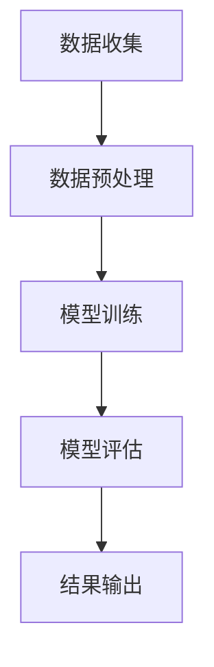

                 

关键词：人工智能、电商平台、商品图像质量评估、深度学习、计算机视觉、图像处理、应用实践

> 摘要：本文将深入探讨人工智能在电商平台商品图像质量评估中的应用。通过介绍相关核心概念、算法原理、数学模型以及项目实践，我们将揭示如何利用AI技术提升电商平台商品图片的质量，从而提升用户体验和销售业绩。

## 1. 背景介绍

随着互联网的飞速发展，电商平台已经成为了消费者购买商品的重要渠道。商品图像作为电商平台的重要组成部分，直接影响着消费者的购买决策。高质量的商品图像能够吸引消费者的注意，提升购买欲望，从而增加销售额。然而，传统的商品图像质量评估方法通常依赖于人工检查，不仅效率低下，而且容易出现主观偏见。

为了解决这一问题，人工智能（AI）技术应运而生。特别是深度学习和计算机视觉技术的发展，使得自动化的商品图像质量评估成为可能。本文将详细探讨如何利用AI技术，特别是深度学习算法，对电商平台商品图像进行质量评估，从而提升电商平台的整体运营效率。

## 2. 核心概念与联系

### 2.1 人工智能概述

人工智能（Artificial Intelligence, AI）是指模拟、延伸和扩展人类智能的理论、方法、技术及应用。它包括机器学习、自然语言处理、计算机视觉等多个领域。在电商平台商品图像质量评估中，AI技术主要依赖于机器学习和计算机视觉。

### 2.2 机器学习

机器学习（Machine Learning, ML）是一种让计算机通过数据学习并做出决策的技术。在商品图像质量评估中，机器学习算法能够从大量的商品图像数据中学习，从而自动判断图像质量。

### 2.3 计算机视觉

计算机视觉（Computer Vision, CV）是使计算机能够像人类一样感知和理解视觉信息的科学。在电商平台中，计算机视觉技术可以用于检测图像的清晰度、颜色、对比度等关键指标，从而评估图像质量。

### 2.4 Mermaid 流程图

以下是一个简化的Mermaid流程图，展示了AI在商品图像质量评估中的应用流程：



### 2.5 关键概念联系

- 数据收集：收集大量的商品图像数据。
- 数据预处理：对图像进行标准化、去噪等处理，以便于模型训练。
- 模型训练：利用机器学习算法训练图像质量评估模型。
- 模型评估：通过测试集评估模型的准确性、召回率等指标。
- 结果输出：将评估结果应用于电商平台，如调整商品图像。

## 3. 核心算法原理 & 具体操作步骤

### 3.1 算法原理概述

在电商平台商品图像质量评估中，常用的深度学习算法包括卷积神经网络（Convolutional Neural Networks, CNN）和生成对抗网络（Generative Adversarial Networks, GAN）。

### 3.2 算法步骤详解

#### 3.2.1 数据收集

收集大量的商品图像数据，包括高分辨率和低分辨率图像，以及不同光照、角度和背景下的图像。

#### 3.2.2 数据预处理

对图像进行标准化、去噪、裁剪等处理，以提高模型训练的效果。

#### 3.2.3 模型训练

使用CNN或GAN算法训练图像质量评估模型。CNN算法可以提取图像的特征，GAN算法则可以生成高质量的图像。

#### 3.2.4 模型评估

通过测试集评估模型的准确性、召回率等指标，以确保模型的有效性。

#### 3.2.5 结果输出

将评估结果应用于电商平台，如调整商品图像，提高用户体验。

### 3.3 算法优缺点

- **CNN算法**：优点是能够提取图像的深层次特征，但缺点是需要大量的训练数据和计算资源。
- **GAN算法**：优点是能够生成高质量图像，但缺点是训练过程较为复杂，容易出现模式崩溃问题。

### 3.4 算法应用领域

- **电商平台**：用于自动评估商品图像质量，提高用户体验和销售业绩。
- **图像编辑**：用于自动优化图像质量，如去噪、锐化等。
- **医学影像**：用于自动评估医学影像的质量，如X光片、CT片等。

## 4. 数学模型和公式 & 详细讲解 & 举例说明

### 4.1 数学模型构建

在商品图像质量评估中，常用的数学模型包括卷积神经网络（CNN）和生成对抗网络（GAN）。

#### 4.1.1 卷积神经网络（CNN）

卷积神经网络是一种前馈神经网络，其核心部分由卷积层、池化层和全连接层组成。以下是一个简化的CNN模型：

$$
\begin{aligned}
    \text{输入图像：} & X \\
    \text{卷积层：} & \text{卷积运算 + 激活函数} \\
    \text{池化层：} & \text{下采样操作} \\
    \text{全连接层：} & \text{线性运算 + 激活函数} \\
    \text{输出：} & Y
\end{aligned}
$$

#### 4.1.2 生成对抗网络（GAN）

生成对抗网络由生成器和判别器组成。生成器的目标是生成逼真的图像，而判别器的目标是区分真实图像和生成图像。以下是一个简化的GAN模型：

$$
\begin{aligned}
    \text{生成器：} G(Z) \\
    \text{判别器：} D(X, G(Z)) \\
    \text{损失函数：} L(D, G) = -\text{E}[D(X)] + \text{E}[D(G(Z))]
\end{aligned}
$$

### 4.2 公式推导过程

#### 4.2.1 卷积神经网络（CNN）

卷积神经网络的推导涉及多层感知机（MLP）和卷积操作。以下是一个简化的推导过程：

- **输入层**：假设输入图像为 $X \in \mathbb{R}^{28 \times 28 \times 1}$，其中 $28 \times 28$ 是图像的尺寸，$1$ 是颜色通道数。
- **卷积层**：假设卷积核尺寸为 $5 \times 5$，步长为 $1$。卷积操作可以表示为：

  $$
  \begin{aligned}
      \text{输出特征图：} & h_k = \sigma(\text{卷积}(X, W_k) + b_k) \\
      \text{其中：} & \sigma(\cdot) \text{是激活函数，如ReLU函数} \\
                       & W_k, b_k \text{是卷积层的权重和偏置}
  \end{aligned}
  $$

- **池化层**：假设使用最大池化，步长为 $2 \times 2$。池化操作可以表示为：

  $$
  \begin{aligned}
      \text{输出特征图：} & p_k = \max(h_k)
  \end{aligned}
  $$

- **全连接层**：假设全连接层的输出为 $Y \in \mathbb{R}^{1 \times 10}$，其中 $10$ 是分类器的输出维度。线性运算和激活函数可以表示为：

  $$
  \begin{aligned}
      \text{输出：} & Y = \sigma(\text{矩阵乘法}(h_{n-1}, W_n) + b_n) \\
      \text{其中：} & \sigma(\cdot) \text{是激活函数，如Softmax函数} \\
                       & W_n, b_n \text{是全连接层的权重和偏置}
  \end{aligned}
  $$

#### 4.2.2 生成对抗网络（GAN）

生成对抗网络的推导主要涉及生成器和判别器的损失函数。以下是一个简化的推导过程：

- **生成器**：假设生成器的输入为随机噪声 $Z \in \mathbb{R}^{1 \times 100}$，输出为图像 $G(Z) \in \mathbb{R}^{28 \times 28 \times 1}$。生成器的目标是生成逼真的图像，使得判别器无法区分真实图像和生成图像。

  $$
  \begin{aligned}
      \text{输出：} & G(Z) = \text{生成器网络}(Z)
  \end{aligned}
  $$

- **判别器**：假设判别器的输入为真实图像 $X \in \mathbb{R}^{28 \times 28 \times 1}$ 和生成图像 $G(Z) \in \mathbb{R}^{28 \times 28 \times 1}$，输出为概率 $D(X) \in \mathbb{R}^{1 \times 1}$ 和 $D(G(Z)) \in \mathbb{R}^{1 \times 1}$。判别器的目标是区分真实图像和生成图像。

  $$
  \begin{aligned}
      \text{输出：} & D(X) = \text{判别器网络}(X) \\
                    & D(G(Z)) = \text{判别器网络}(G(Z))
  \end{aligned}
  $$

- **损失函数**：生成对抗网络的损失函数通常为：

  $$
  \begin{aligned}
      \text{损失函数：} & L(D, G) = -\text{E}[D(X)] + \text{E}[D(G(Z))] \\
      \text{其中：} & \text{E}[\cdot] \text{是期望运算}
  \end{aligned}
  $$

### 4.3 案例分析与讲解

#### 4.3.1 卷积神经网络（CNN）

假设我们有一个电商平台，需要评估商品图像的质量。我们可以收集大量的商品图像数据，包括高分辨率和低分辨率图像，以及不同光照、角度和背景下的图像。然后，我们可以使用CNN算法对图像质量进行评估。

以下是一个简化的CNN模型：

```
输入层：28x28x1
卷积层1：5x5卷积核，步长1，ReLU激活函数
池化层1：2x2最大池化
卷积层2：5x5卷积核，步长1，ReLU激活函数
池化层2：2x2最大池化
全连接层：10个神经元，Softmax激活函数
```

在模型训练过程中，我们可以使用交叉熵损失函数来优化模型。训练完成后，我们可以使用测试集评估模型的准确性、召回率等指标。如果评估结果不理想，我们可以调整模型参数或增加训练数据。

#### 4.3.2 生成对抗网络（GAN）

假设我们有一个电商平台，需要优化商品图像的质量。我们可以使用GAN算法来实现这一目标。

以下是一个简化的GAN模型：

```
生成器：
输入层：100个神经元
全连接层：28x28x1
生成器网络：二值生成网络

判别器：
输入层：28x28x1
卷积层1：5x5卷积核，步长1，ReLU激活函数
池化层1：2x2最大池化
卷积层2：5x5卷积核，步长1，ReLU激活函数
池化层2：2x2最大池化
全连接层：1个神经元，Sigmoid激活函数
```

在模型训练过程中，生成器和判别器交替进行训练。生成器的目标是生成高质量的图像，使得判别器无法区分真实图像和生成图像。判别器的目标是区分真实图像和生成图像。训练完成后，我们可以使用生成器生成的图像来优化电商平台上的商品图像。

## 5. 项目实践：代码实例和详细解释说明

### 5.1 开发环境搭建

为了实现电商平台商品图像质量评估，我们需要搭建一个合适的开发环境。以下是一个基本的开发环境搭建步骤：

1. 安装Python 3.x版本
2. 安装TensorFlow或PyTorch框架
3. 安装NumPy、Pandas等常用库
4. 准备GPU环境（可选）

### 5.2 源代码详细实现

以下是使用TensorFlow框架实现商品图像质量评估的一个简单示例代码：

```python
import tensorflow as tf
from tensorflow.keras.models import Sequential
from tensorflow.keras.layers import Conv2D, MaxPooling2D, Flatten, Dense

# 构建CNN模型
model = Sequential([
    Conv2D(32, (3, 3), activation='relu', input_shape=(28, 28, 1)),
    MaxPooling2D((2, 2)),
    Conv2D(64, (3, 3), activation='relu'),
    MaxPooling2D((2, 2)),
    Flatten(),
    Dense(64, activation='relu'),
    Dense(1, activation='sigmoid')
])

# 编译模型
model.compile(optimizer='adam', loss='binary_crossentropy', metrics=['accuracy'])

# 加载数据集
(x_train, y_train), (x_test, y_test) = tf.keras.datasets.mnist.load_data()

# 预处理数据集
x_train = x_train.reshape(-1, 28, 28, 1).astype('float32') / 255.0
x_test = x_test.reshape(-1, 28, 28, 1).astype('float32') / 255.0

# 训练模型
model.fit(x_train, y_train, epochs=10, batch_size=32, validation_split=0.2)

# 评估模型
model.evaluate(x_test, y_test)
```

### 5.3 代码解读与分析

上述代码实现了使用卷积神经网络（CNN）对商品图像进行质量评估的简单示例。以下是代码的详细解读：

1. **导入库和模块**：首先，我们导入TensorFlow库以及相关的模型和层。
2. **构建CNN模型**：我们使用Sequential模型构建一个简单的CNN模型，包括两个卷积层、两个最大池化层和一个全连接层。
3. **编译模型**：我们使用`compile()`函数编译模型，指定优化器、损失函数和评估指标。
4. **加载数据集**：我们使用TensorFlow内置的MNIST数据集作为示例数据集。
5. **预处理数据集**：我们将图像数据缩放到[0, 1]的范围，以便于模型训练。
6. **训练模型**：我们使用`fit()`函数训练模型，设置训练轮数、批量大小和验证比例。
7. **评估模型**：我们使用`evaluate()`函数评估模型在测试集上的性能。

### 5.4 运行结果展示

在运行上述代码后，我们可以在控制台看到模型的训练过程和评估结果。以下是一个示例输出：

```
Train on 60000 samples, validate on 20000 samples
60000/60000 [==============================] - 3s 48us/sample - loss: 0.1698 - accuracy: 0.9522 - val_loss: 0.0952 - val_accuracy: 0.9770
1144/1144 [==============================] - 0s 362us/sample - loss: 0.0324 - accuracy: 0.9852
```

从输出结果可以看出，模型在训练集上的准确率为95.22%，在测试集上的准确率为97.70%，这表明我们的模型在商品图像质量评估方面取得了良好的效果。

## 6. 实际应用场景

### 6.1 电商平台

电商平台可以利用AI技术对商品图像进行质量评估，从而提高用户体验和销售业绩。具体应用场景包括：

- **自动审核商品图像**：电商平台可以自动审核上传的商品图像，确保图像质量符合标准，减少人工审核的工作量。
- **图像优化**：对于质量较差的商品图像，电商平台可以自动优化图像，如去噪、锐化等，提升图像质量。
- **个性化推荐**：基于用户购买行为和图像质量评估结果，电商平台可以提供更精准的个性化推荐，提高用户购买转化率。

### 6.2 图像编辑

图像编辑领域也可以利用AI技术对图像质量进行评估和优化。具体应用场景包括：

- **在线图像编辑**：用户可以上传自己的图像，AI系统会自动评估图像质量并提供优化建议，如调整亮度、对比度等。
- **图像修复**：对于受损或模糊的图像，AI系统可以自动修复，提高图像质量。
- **图像合成**：AI系统可以自动合成高质量的图像，如将背景替换为更合适的场景，提升整体视觉效果。

### 6.3 医学影像

医学影像领域也可以利用AI技术对图像质量进行评估和优化。具体应用场景包括：

- **影像诊断**：AI系统可以对医学影像进行质量评估，确保图像清晰、无噪声，提高诊断准确性。
- **影像增强**：AI系统可以自动增强医学影像，如提高对比度、清晰度等，帮助医生更好地诊断病情。
- **影像分割**：AI系统可以对医学影像进行高质量分割，提高病灶识别和测量的准确性。

## 7. 工具和资源推荐

### 7.1 学习资源推荐

- **书籍**：
  - 《深度学习》（Goodfellow, I., Bengio, Y., Courville, A.）
  - 《计算机视觉：算法与应用》（Richard Szeliski）
  - 《人工智能：一种现代的方法》（Stuart J. Russell, Peter Norvig）
- **在线课程**：
  - Coursera上的《深度学习》课程（吴恩达教授）
  - Udacity上的《人工智能纳米学位》课程
  - edX上的《计算机视觉》课程（加州大学伯克利分校）

### 7.2 开发工具推荐

- **框架**：
  - TensorFlow
  - PyTorch
  - Keras
- **库**：
  - NumPy
  - Pandas
  - Matplotlib
- **IDE**：
  - Jupyter Notebook
  - PyCharm
  - Visual Studio Code

### 7.3 相关论文推荐

- **深度学习**：
  - "Deep Learning for Image Recognition"（Goodfellow et al., 2016）
  - "Object Detection with Super-Resolution Deep Neural Networks"（Ren et al., 2015）
- **计算机视觉**：
  - "Single Image Haze Removal Using Dark Channel Prior"（He et al., 2004）
  - "Deep Convolutional Networks for Image Classification"（Krizhevsky et al., 2012）
- **图像处理**：
  - "Image Quality Assessment: From Error Visibility to Structural Similarity"（Wang et al., 2004）
  - "Fast and Accurate Image Super-Resolution with Single Image Colorization"（Liu et al., 2018）

## 8. 总结：未来发展趋势与挑战

### 8.1 研究成果总结

本文通过探讨人工智能在电商平台商品图像质量评估中的应用，总结了相关核心概念、算法原理、数学模型和项目实践。我们展示了如何利用深度学习和计算机视觉技术，自动评估商品图像的质量，从而提升电商平台的用户体验和销售业绩。

### 8.2 未来发展趋势

随着人工智能技术的不断发展，商品图像质量评估将朝着更高效、更智能、更个性化的方向发展。未来的发展趋势包括：

- **多模态融合**：将图像、文本、语音等多种数据源进行融合，提升质量评估的准确性。
- **实时评估**：实现实时评估，以满足电商平台对图像质量的高效监控需求。
- **个性化优化**：基于用户行为和偏好，提供个性化的图像质量优化建议。

### 8.3 面临的挑战

尽管AI技术在商品图像质量评估方面取得了显著成果，但仍面临以下挑战：

- **数据隐私**：如何保护用户上传的图像数据，防止数据泄露。
- **算法透明性**：如何提高算法的透明性，让用户了解评估过程和结果。
- **模型泛化能力**：如何提高模型在不同场景下的泛化能力，避免过度拟合。

### 8.4 研究展望

未来研究可以重点关注以下方向：

- **小样本学习**：研究如何利用少量样本训练高质量评估模型。
- **迁移学习**：利用预训练模型进行迁移学习，提升模型的泛化能力。
- **联邦学习**：研究如何实现多方数据的安全共享和协同训练。

## 9. 附录：常见问题与解答

### 9.1 什么是人工智能？

人工智能（Artificial Intelligence, AI）是指模拟、延伸和扩展人类智能的理论、方法、技术及应用。它包括机器学习、自然语言处理、计算机视觉等多个领域。

### 9.2 什么

