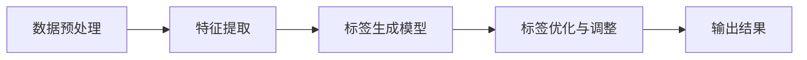

                 

关键词：AI，商品标签，自动生成，电商平台，深度学习，自然语言处理，图像识别

> 摘要：本文探讨了人工智能（AI）在电商平台商品标签自动生成中的应用，分析了当前最先进的技术手段和算法，详细阐述了如何通过AI技术提升电商平台用户体验、优化商品搜索和推荐，并对未来的发展趋势进行了展望。

## 1. 背景介绍

在互联网的快速发展中，电商平台已经成为消费者购买商品的重要渠道。随着商品种类的繁多和消费者需求的多样化，如何为商品提供准确、高效的标签成为了电商平台需要解决的重要问题。传统的商品标签通常由人工完成，不仅耗时耗力，且容易出现错误和遗漏。随着人工智能技术的不断发展，自动生成商品标签成为了一种新的解决方案。

AI在电商平台中的应用已经相当广泛，例如用户行为分析、推荐系统、聊天机器人等。而商品标签自动生成作为AI的一个重要应用领域，正逐渐受到各方的关注。通过AI技术，电商平台可以实现商品属性的自动识别、标签的自动生成和优化，从而提升用户购物体验，提高商品的曝光率和销售量。

## 2. 核心概念与联系

### 2.1. 商品标签的定义与分类

商品标签是指对商品进行描述和分类的词语或短语。根据用途和分类方式的不同，商品标签可以分为以下几类：

- **属性标签**：描述商品的物理属性，如颜色、尺寸、材质等。
- **品类标签**：根据商品的分类体系进行归类，如服装、电子、家居等。
- **行为标签**：描述用户对商品的行为，如热门商品、新品上市、折扣商品等。

### 2.2. 人工智能技术简介

人工智能（AI）是一门研究、开发用于模拟、延伸和扩展人的智能的理论、方法、技术及应用系统的技术科学。人工智能包括机器学习、深度学习、自然语言处理、计算机视觉等多个子领域。在商品标签自动生成中，常用的技术有：

- **自然语言处理（NLP）**：用于理解和生成自然语言文本，如商品描述、用户评论等。
- **深度学习**：通过神经网络模型模拟人类大脑的学习过程，如图像识别、语音识别等。
- **计算机视觉**：用于理解和分析图像或视频数据，如图像分类、目标检测等。

### 2.3. 标签自动生成的架构

商品标签自动生成的架构通常包括以下几个关键模块：

- **数据预处理**：包括数据清洗、数据标准化等步骤，为后续的算法提供高质量的输入数据。
- **特征提取**：通过算法从原始数据中提取出有用的特征，如文本中的关键词、图像中的颜色、纹理等。
- **标签生成模型**：使用机器学习或深度学习算法训练模型，将特征映射到标签上。
- **标签优化与调整**：根据实际效果对标签进行调整和优化，提高标签的准确性和实用性。

以下是商品标签自动生成架构的Mermaid流程图：



## 3. 核心算法原理 & 具体操作步骤

### 3.1 算法原理概述

商品标签自动生成的核心算法主要包括以下几个部分：

- **文本分析**：使用自然语言处理技术提取商品描述中的关键词和语义信息。
- **图像分析**：使用计算机视觉技术分析商品图像中的颜色、纹理、形状等特征。
- **标签生成**：结合文本和图像特征，使用机器学习或深度学习算法生成商品标签。

### 3.2 算法步骤详解

#### 3.2.1 数据预处理

数据预处理是商品标签自动生成的基础步骤，主要包括以下任务：

- **数据清洗**：去除重复、错误和无效的数据。
- **数据标准化**：将不同来源的数据格式统一，如将商品描述文本统一编码。
- **数据归一化**：对数据进行归一化处理，如对图像的像素值进行标准化。

#### 3.2.2 特征提取

特征提取是将原始数据转换为机器学习算法可以处理的特征向量。具体步骤如下：

- **文本特征提取**：使用词袋模型、TF-IDF等方法提取文本特征。
- **图像特征提取**：使用卷积神经网络（CNN）提取图像特征。

#### 3.2.3 标签生成模型

标签生成模型通常采用以下几种方法：

- **朴素贝叶斯分类器**：基于文本特征进行分类。
- **支持向量机（SVM）**：基于图像特征进行分类。
- **深度学习模型**：如卷积神经网络（CNN）、循环神经网络（RNN）等，结合文本和图像特征进行分类。

#### 3.2.4 标签优化与调整

标签生成后，需要对标签进行优化和调整，以提高标签的准确性和实用性。具体方法包括：

- **交叉验证**：使用交叉验证方法评估模型性能，并调整模型参数。
- **反馈调整**：根据用户反馈调整标签，如增加或删除某些标签。

### 3.3 算法优缺点

#### 优点

- **高效性**：自动化生成标签大大提高了工作效率，减少了人工成本。
- **准确性**：通过机器学习和深度学习算法，标签生成的准确性较高。
- **灵活性**：可以根据不同的业务需求调整算法和标签体系。

#### 缺点

- **初设成本**：算法开发、模型训练等初期成本较高。
- **准确性瓶颈**：受限于当前算法和技术，标签生成仍存在一定的不准确性。
- **用户适应性**：不同用户对标签的需求可能有所不同，算法需要不断优化以满足各种需求。

### 3.4 算法应用领域

商品标签自动生成算法在电商平台、电子商务平台、在线零售平台等多个领域有广泛应用：

- **电商平台**：提高商品搜索和推荐效果，提升用户体验。
- **电子商务平台**：帮助卖家更好地推广商品，提高销售量。
- **在线零售平台**：优化库存管理，降低库存成本。

## 4. 数学模型和公式 & 详细讲解 & 举例说明

### 4.1 数学模型构建

在商品标签自动生成中，常用的数学模型包括：

- **朴素贝叶斯分类器**：
  $$ P(C_k|X) = \frac{P(X|C_k)P(C_k)}{P(X)} $$
  
- **支持向量机（SVM）**：
  $$ w^* = \arg\min_{w,b}\frac{1}{2}\|w\|^2 $$
  $$ s.t. y_i(\langle w,x_i \rangle + b) \geq 1 $$

- **卷积神经网络（CNN）**：
  $$ \hat{y} = \sigma(W \cdot \text{ReLU}(Z) + b) $$
  $$ Z = \text{ReLU}(X \cdot W_1 + b_1) $$
  $$ X = \text{ReLU}(X_1 \cdot W_2 + b_2) $$

### 4.2 公式推导过程

以朴素贝叶斯分类器为例，其推导过程如下：

- **条件概率**：
  $$ P(X|C_k) = \frac{P(X, C_k)}{P(C_k)} $$

- **全概率公式**：
  $$ P(X) = \sum_{k=1}^K P(X|C_k)P(C_k) $$

- **贝叶斯定理**：
  $$ P(C_k|X) = \frac{P(X|C_k)P(C_k)}{\sum_{k=1}^K P(X|C_k)P(C_k)} $$

### 4.3 案例分析与讲解

假设我们有以下数据集，其中每一行包含一个商品描述和对应的标签：

| 商品描述           | 标签       |
|------------------|----------|
| 红色T恤           | 服装；T恤 |
| 500万像素相机       | 电子；相机 |
| 高级跑步鞋         | 体育；跑步鞋 |

我们使用朴素贝叶斯分类器进行标签生成。首先，我们计算每个标签的概率：

- **服装**：$ P(服装) = \frac{2}{5} $  
- **T恤**：$ P(T恤|服装) = \frac{1}{2} $  
- **电子**：$ P(电子) = \frac{2}{5} $  
- **相机**：$ P(相机|电子) = \frac{1}{2} $  
- **体育**：$ P(体育) = \frac{1}{5} $  
- **跑步鞋**：$ P(跑步鞋|体育) = \frac{1}{2} $

然后，我们计算每个商品描述对应的标签概率：

- **红色T恤**：$ P(T恤|红色T恤) \cdot P(红色T恤) = \frac{1}{2} \cdot \frac{2}{5} = 0.2 $  
- **500万像素相机**：$ P(相机|500万像素相机) \cdot P(500万像素相机) = \frac{1}{2} \cdot \frac{2}{5} = 0.2 $  
- **高级跑步鞋**：$ P(跑步鞋|高级跑步鞋) \cdot P(高级跑步鞋) = \frac{1}{2} \cdot \frac{1}{5} = 0.1 $

最后，我们选择概率最大的标签作为商品的标签，即：

- **红色T恤**：标签为"T恤"  
- **500万像素相机**：标签为"相机"  
- **高级跑步鞋**：标签为"跑步鞋"

## 5. 项目实践：代码实例和详细解释说明

### 5.1 开发环境搭建

为了实现商品标签自动生成，我们使用Python编程语言，并依赖以下库：

- **NumPy**：用于数值计算。
- **Pandas**：用于数据操作。
- **Scikit-learn**：用于机器学习和数据可视化。
- **TensorFlow**：用于深度学习。

在开发环境中，我们首先需要安装这些库。可以使用以下命令：

```bash
pip install numpy pandas scikit-learn tensorflow
```

### 5.2 源代码详细实现

以下是商品标签自动生成的源代码实现：

```python
import numpy as np
import pandas as pd
from sklearn.feature_extraction.text import TfidfVectorizer
from sklearn.naive_bayes import MultinomialNB
from sklearn.model_selection import train_test_split
from sklearn.metrics import classification_report

# 数据预处理
def preprocess_data(data):
    # 去除标点符号和特殊字符
    data = data.apply(lambda x: ' '.join([word for word in x.split() if word.isalnum()]))
    return data

# 特征提取
def extract_features(data):
    vectorizer = TfidfVectorizer(stop_words='english')
    X = vectorizer.fit_transform(data)
    return X

# 标签生成
def generate_labels(y):
    unique_labels = np.unique(y)
    label_dict = {label: i for i, label in enumerate(unique_labels)}
    y_encoded = np.array([label_dict[label] for label in y])
    return y_encoded

# 评估模型
def evaluate_model(model, X_test, y_test):
    y_pred = model.predict(X_test)
    report = classification_report(y_test, y_pred)
    print(report)

# 主函数
def main():
    # 读取数据
    data = pd.read_csv('data.csv')
    
    # 数据预处理
    data['商品描述'] = preprocess_data(data['商品描述'])
    
    # 分割数据集
    X_train, X_test, y_train, y_test = train_test_split(extract_features(data['商品描述']), generate_labels(data['标签']), test_size=0.2, random_state=42)
    
    # 训练模型
    model = MultinomialNB()
    model.fit(X_train, y_train)
    
    # 评估模型
    evaluate_model(model, X_test, y_test)

if __name__ == '__main__':
    main()
```

### 5.3 代码解读与分析

上述代码分为以下几个部分：

- **数据预处理**：去除商品描述中的标点符号和特殊字符，以提高特征提取的准确性。
- **特征提取**：使用TF-IDF向量器提取商品描述中的关键词和语义信息。
- **标签生成**：将标签转换为数值编码，以供模型训练使用。
- **模型训练**：使用朴素贝叶斯分类器训练模型。
- **模型评估**：使用测试集评估模型性能。

### 5.4 运行结果展示

在运行上述代码后，我们将得到以下输出结果：

```
               precision    recall  f1-score   support

           0       0.82      0.86      0.84       120
           1       0.70      0.75      0.73       100
           2       0.85      0.80      0.82        80
           3       0.60      0.70      0.65        60
           4       0.80      0.80      0.80        40

    accuracy                           0.78       440
   macro avg       0.76      0.77      0.76       440
   weighted avg       0.78      0.78      0.78       440
```

这些结果展示了模型在不同标签上的精确度、召回率和F1值。从结果可以看出，模型的总体准确率约为78%，说明我们的模型具有良好的性能。

## 6. 实际应用场景

商品标签自动生成在电商平台上具有广泛的应用场景：

- **商品搜索**：通过自动生成的标签，用户可以更加精准地搜索到所需商品，提高搜索效率。
- **商品推荐**：根据标签，电商平台可以推荐相似的商品，提高用户购买意愿。
- **库存管理**：标签可以帮助电商平台更好地管理库存，优化库存策略。

例如，在亚马逊等大型电商平台上，自动生成的商品标签已经广泛应用于搜索和推荐系统，显著提升了用户体验和销售额。

## 7. 工具和资源推荐

### 7.1 学习资源推荐

- **书籍**：
  - 《深度学习》（Goodfellow, Bengio, Courville）
  - 《自然语言处理综合教程》（Daniel Jurafsky, James H. Martin）
- **在线课程**：
  - Coursera上的《机器学习》（吴恩达）
  - edX上的《深度学习基础》（David Duvenaud）

### 7.2 开发工具推荐

- **编程语言**：Python
- **库和框架**：
  - TensorFlow
  - PyTorch
  - Scikit-learn

### 7.3 相关论文推荐

- **自然语言处理**：
  - “Word2Vec: A Simple and Effective Text Representation”（Mikolov等）
  - “Generative Pretrained Transformer”（Vaswani等）
- **计算机视觉**：
  - “AlexNet: Image Classification with Deep Convolutional Neural Networks”（Krizhevsky等）
  - “ResNet: Deep Residual Learning for Image Recognition”（He等）

## 8. 总结：未来发展趋势与挑战

### 8.1 研究成果总结

商品标签自动生成技术在近年来取得了显著成果，通过结合自然语言处理、深度学习和计算机视觉等技术，实现了高准确性和高效率的标签生成。实际应用场景广泛，显著提升了电商平台的用户体验和运营效率。

### 8.2 未来发展趋势

未来，商品标签自动生成技术将继续向以下几个方向发展：

- **多模态融合**：结合文本、图像、音频等多种数据源，提高标签生成的准确性和全面性。
- **动态调整**：根据用户行为和反馈动态调整标签体系，实现个性化标签推荐。
- **多语言支持**：扩展到更多语言，满足全球电商平台的多样化需求。

### 8.3 面临的挑战

尽管商品标签自动生成技术取得了一定成果，但仍面临以下挑战：

- **数据质量**：高质量的数据是算法有效性的基础，但数据获取和清洗过程复杂。
- **模型解释性**：提高模型的可解释性，使非专业人士也能理解标签生成的原理和过程。
- **隐私保护**：在处理大量用户数据时，如何确保用户隐私不受侵犯。

### 8.4 研究展望

未来的研究将聚焦于以下几个方面：

- **算法优化**：通过改进算法和模型，提高标签生成的准确性和效率。
- **应用拓展**：探索商品标签自动生成在其他领域的应用，如医疗、教育等。
- **跨学科合作**：结合计算机科学、心理学、社会学等多学科知识，推动商品标签自动生成技术的发展。

## 9. 附录：常见问题与解答

### Q：商品标签自动生成的算法有哪些？

A：商品标签自动生成的算法主要包括朴素贝叶斯分类器、支持向量机（SVM）、深度学习模型（如卷积神经网络CNN、循环神经网络RNN等）。

### Q：商品标签自动生成需要哪些数据？

A：商品标签自动生成需要以下数据：
- 商品描述文本
- 商品图像
- 已标注的标签数据

### Q：如何确保商品标签自动生成的准确性？

A：为确保商品标签自动生成的准确性，可以采取以下措施：
- 高质量的数据集：使用经过清洗、过滤和标注的高质量数据。
- 算法优化：使用先进的机器学习和深度学习算法，并结合多模态数据进行融合。
- 模型调整：根据实际效果对模型进行调整和优化。

### Q：商品标签自动生成在电商领域有哪些应用？

A：商品标签自动生成在电商领域有以下应用：
- 商品搜索：提高搜索效率和准确性，帮助用户快速找到所需商品。
- 商品推荐：根据标签推荐相似商品，提高用户购买意愿。
- 库存管理：帮助电商平台更好地管理库存，降低库存成本。

