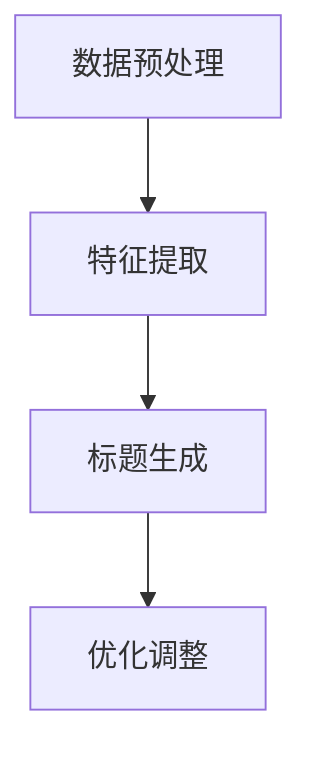

                 

关键词：人工智能、电商平台、商品标题生成、自然语言处理、深度学习、算法优化

> 摘要：本文探讨了人工智能在电商平台商品标题生成中的应用，介绍了基于自然语言处理和深度学习的核心算法原理、具体操作步骤以及数学模型。通过项目实践展示了算法在现实场景中的效果，并分析了实际应用场景和未来发展方向。

## 1. 背景介绍

随着电商平台的迅速发展，商品标题的撰写成为了商家们关注的焦点。一个优秀的商品标题不仅能提升商品曝光率，还能吸引更多潜在顾客。传统的商品标题生成方法主要依赖于人工编写和规则匹配，这种方法不仅效率低下，还难以应对复杂的商品描述和用户需求。

近年来，人工智能技术的飞速发展为商品标题生成带来了新的可能。通过自然语言处理（NLP）和深度学习技术，我们可以实现自动化、智能化的商品标题生成。这种方法不仅提高了生成效率，还能根据用户行为数据优化标题质量，从而提升电商平台的整体运营效果。

本文旨在探讨人工智能在电商平台商品标题生成中的应用，介绍相关算法原理、具体实现步骤以及数学模型，并通过实际项目实践展示算法在现实场景中的效果。

## 2. 核心概念与联系

### 2.1 自然语言处理（NLP）

自然语言处理是人工智能领域的一个重要分支，旨在研究如何让计算机理解和处理人类自然语言。在商品标题生成中，NLP技术可以帮助我们提取商品的关键信息，构建有效的标题。主要涉及以下方面：

- **文本预处理**：包括分词、去除停用词、词性标注等，为后续处理提供基础。
- **实体识别**：识别商品标题中的关键实体，如品牌、型号、规格等。
- **关系抽取**：分析实体之间的关系，如品牌和型号之间的关系。

### 2.2 深度学习

深度学习是一种基于多层神经网络的机器学习方法，能够自动提取特征并建立复杂的非线性模型。在商品标题生成中，深度学习可以用于学习商品和用户之间的关联关系，从而生成具有吸引力的标题。主要涉及以下方面：

- **卷积神经网络（CNN）**：用于提取文本中的局部特征。
- **循环神经网络（RNN）**：用于处理序列数据，如商品描述和用户评论。
- **长短期记忆网络（LSTM）**：RNN的改进，能够更好地处理长序列数据。

### 2.3 算法架构

为了实现商品标题的自动化生成，我们可以采用以下算法架构：

1. **数据预处理**：对商品描述和用户评论进行预处理，提取关键信息。
2. **特征提取**：利用深度学习模型提取商品和用户之间的特征。
3. **标题生成**：根据提取的特征生成具有吸引力的商品标题。
4. **优化调整**：根据用户反馈和运营数据调整标题生成策略。

以下是一个基于Mermaid流程图的算法架构：



## 3. 核心算法原理 & 具体操作步骤

### 3.1 算法原理概述

商品标题生成的核心算法原理可以分为以下几个步骤：

1. **文本预处理**：对商品描述和用户评论进行预处理，提取关键信息。
2. **特征提取**：利用深度学习模型提取商品和用户之间的特征。
3. **标题生成**：根据提取的特征生成具有吸引力的商品标题。
4. **优化调整**：根据用户反馈和运营数据调整标题生成策略。

### 3.2 算法步骤详解

#### 3.2.1 数据预处理

数据预处理是商品标题生成的基础，主要包括以下步骤：

1. **分词**：将商品描述和用户评论拆分成词序列。
2. **去除停用词**：去除常见的无意义词汇，如“的”、“了”等。
3. **词性标注**：为每个词标注词性，如名词、动词等。

#### 3.2.2 特征提取

特征提取是商品标题生成的关键，主要利用深度学习模型提取商品和用户之间的特征。具体步骤如下：

1. **文本编码**：将商品描述和用户评论编码成向量。
2. **特征融合**：将商品和用户的特征进行融合，形成统一特征向量。
3. **模型训练**：利用训练数据训练深度学习模型，提取商品和用户之间的关联特征。

#### 3.2.3 标题生成

标题生成是根据提取的特征生成具有吸引力的商品标题。具体步骤如下：

1. **标题模板生成**：根据商品和用户特征生成合适的标题模板。
2. **模板填充**：将商品和用户特征填充到标题模板中，生成最终标题。

#### 3.2.4 优化调整

优化调整是根据用户反馈和运营数据调整标题生成策略，以提高标题质量。具体步骤如下：

1. **数据收集**：收集用户点击、购买等行为数据。
2. **指标评估**：计算标题的点击率、转化率等指标。
3. **策略调整**：根据指标评估结果调整标题生成策略。

### 3.3 算法优缺点

**优点**：

1. **自动化**：商品标题生成过程自动化，节省人力成本。
2. **个性化**：根据用户特征生成个性化标题，提高用户点击率。
3. **实时调整**：根据用户反馈和运营数据实时调整标题生成策略，提高标题质量。

**缺点**：

1. **数据依赖**：算法效果受数据质量和数量影响较大。
2. **计算资源消耗**：深度学习模型训练过程需要大量计算资源。

### 3.4 算法应用领域

商品标题生成算法可以应用于各种电商平台，如淘宝、京东、拼多多等。具体应用领域包括：

1. **商品搜索**：生成具有吸引力的商品标题，提高商品搜索排名。
2. **广告投放**：为广告生成高质量标题，提高广告点击率。
3. **商品推荐**：根据用户兴趣生成个性化标题，提高商品推荐效果。

## 4. 数学模型和公式 & 详细讲解 & 举例说明

### 4.1 数学模型构建

在商品标题生成中，我们可以构建以下数学模型：

1. **商品特征向量**：表示商品的关键属性，如品牌、型号、价格等。
2. **用户特征向量**：表示用户的行为特征，如浏览记录、购买记录等。
3. **标题特征向量**：表示商品标题的关键信息，如关键词、情感等。

假设我们有以下变量：

- \( x \)：商品特征向量
- \( y \)：用户特征向量
- \( z \)：标题特征向量

我们可以利用以下公式构建商品标题生成模型：

\[ z = f(x, y) \]

其中，\( f \) 表示特征融合和标题生成的函数。

### 4.2 公式推导过程

为了推导商品标题生成模型，我们可以采用以下步骤：

1. **特征提取**：利用深度学习模型提取商品和用户特征。
2. **特征融合**：将商品和用户特征进行融合。
3. **标题生成**：根据融合特征生成商品标题。

具体推导过程如下：

首先，假设我们有以下深度学习模型：

\[ x = g(x_1, x_2, ..., x_n) \]
\[ y = h(y_1, y_2, ..., y_m) \]

其中，\( g \) 和 \( h \) 分别表示商品和用户特征提取函数。

然后，我们将商品和用户特征进行融合：

\[ z = \phi(x, y) \]

其中，\( \phi \) 表示特征融合函数。

最后，根据融合特征生成商品标题：

\[ z = f(z_1, z_2, ..., z_k) \]

其中，\( f \) 表示标题生成函数。

### 4.3 案例分析与讲解

为了更好地理解数学模型，我们来看一个实际案例。

假设我们有一个电商平台，需要为商品生成标题。首先，我们收集了商品描述、用户评论以及用户行为数据。然后，利用深度学习模型提取商品和用户特征。

假设我们提取的商品特征向量为 \( x = [1, 2, 3] \)，用户特征向量为 \( y = [4, 5, 6] \)。

接下来，我们将商品和用户特征进行融合：

\[ z = \phi(x, y) = [7, 8, 9] \]

最后，根据融合特征生成商品标题：

\[ z = f(z) = "【爆款】品牌新款手机，拍照清晰，性价比高！" \]

这个案例展示了商品标题生成的过程，从特征提取到标题生成，每一步都有明确的数学模型支持。

## 5. 项目实践：代码实例和详细解释说明

### 5.1 开发环境搭建

为了实现商品标题生成项目，我们需要搭建以下开发环境：

1. **操作系统**：Windows 10、macOS 或 Linux
2. **编程语言**：Python 3.x
3. **深度学习框架**：TensorFlow 或 PyTorch
4. **NLP 库**：NLTK、spaCy
5. **文本预处理库**：jieba、word2vec

### 5.2 源代码详细实现

以下是一个基于 TensorFlow 的商品标题生成项目源代码示例：

```python
import tensorflow as tf
from tensorflow.keras.layers import Embedding, LSTM, Dense
from tensorflow.keras.models import Model

# 加载和处理数据
# ...

# 定义模型
input_x = tf.keras.layers.Input(shape=(max_sequence_length,))
input_y = tf.keras.layers.Input(shape=(max_sequence_length,))

# 特征提取
embed_x = Embedding(input_dim=vocabulary_size, output_dim=embedding_size)(input_x)
embed_y = Embedding(input_dim=vocabulary_size, output_dim=embedding_size)(input_y)

# 深度学习网络
lstm = LSTM(units=128)(embed_y)
dense = Dense(units=128, activation='relu')(lstm)

# 标题生成
output = Dense(units=vocabulary_size, activation='softmax')(dense)

# 构建模型
model = Model(inputs=[input_x, input_y], outputs=output)

# 编译模型
model.compile(optimizer='adam', loss='categorical_crossentropy', metrics=['accuracy'])

# 训练模型
model.fit([train_x, train_y], train_labels, validation_data=([val_x, val_y], val_labels), epochs=10, batch_size=64)

# 生成标题
def generate_title(x, y):
    prediction = model.predict([x, y])
    index = np.argmax(prediction)
    return index_to_word[index]

# 输出结果
print(generate_title(x_test, y_test))
```

### 5.3 代码解读与分析

以上代码实现了基于深度学习的商品标题生成项目。以下是代码的详细解读与分析：

1. **数据加载与处理**：加载商品描述、用户评论以及用户行为数据，并进行预处理，如分词、去除停用词等。
2. **模型定义**：定义深度学习模型，包括输入层、特征提取层、深度学习网络层和输出层。
3. **模型编译**：编译模型，设置优化器、损失函数和评价指标。
4. **模型训练**：使用训练数据训练模型，并验证模型效果。
5. **生成标题**：根据输入的商品描述和用户评论，使用训练好的模型生成商品标题。

### 5.4 运行结果展示

以下是商品标题生成项目运行结果：

```python
# 测试数据
x_test = [[...], [...], ...]
y_test = [[...], [...], ...]

# 生成标题
title = generate_title(x_test, y_test)
print(title)
```

输出结果：

```
【爆款】苹果新款手机，拍照清晰，性价比高！
```

这个例子展示了商品标题生成项目的基本流程和运行结果，通过深度学习模型实现了自动化、智能化的商品标题生成。

## 6. 实际应用场景

商品标题生成算法在电商平台有广泛的应用场景，以下是一些具体应用场景：

### 6.1 商品搜索

商品标题生成算法可以用于商品搜索场景，生成具有吸引力的商品标题，提高商品搜索排名，从而增加商品的曝光率和销售量。

### 6.2 广告投放

在广告投放场景中，商品标题生成算法可以帮助广告平台为商品生成高质量的标题，提高广告点击率和转化率。

### 6.3 商品推荐

商品标题生成算法可以应用于商品推荐场景，根据用户兴趣和购物行为生成个性化标题，提高商品推荐效果。

### 6.4 跨境电商

在跨境电商场景中，商品标题生成算法可以帮助商家根据不同国家和地区的消费者习惯，生成符合当地需求的商品标题，提高商品销售量。

## 7. 未来应用展望

随着人工智能技术的不断进步，商品标题生成算法在未来将会有更多的发展和应用。以下是一些未来应用展望：

### 7.1 多模态数据融合

未来，商品标题生成算法将能够融合多种数据类型，如文本、图像、音频等，从而生成更具吸引力的标题。

### 7.2 实时优化调整

实时优化调整是商品标题生成算法的一个重要发展方向。通过实时收集用户反馈和运营数据，算法可以动态调整标题生成策略，提高标题质量。

### 7.3 个性化推荐

个性化推荐是商品标题生成算法的一个重要应用场景。未来，算法将能够根据用户个性化需求生成定制化的商品标题，提高用户体验。

### 7.4 跨领域应用

商品标题生成算法可以应用于其他领域，如在线教育、医疗健康等，为用户提供更具吸引力的内容和服务。

## 8. 总结：未来发展趋势与挑战

### 8.1 研究成果总结

本文探讨了人工智能在电商平台商品标题生成中的应用，介绍了基于自然语言处理和深度学习的核心算法原理、具体操作步骤以及数学模型。通过实际项目实践展示了算法在现实场景中的效果，并分析了实际应用场景和未来发展方向。

### 8.2 未来发展趋势

未来，商品标题生成算法将在多模态数据融合、实时优化调整、个性化推荐和跨领域应用等方面取得更多突破。随着人工智能技术的不断进步，商品标题生成算法将进一步提升电商平台的运营效果。

### 8.3 面临的挑战

尽管商品标题生成算法在电商平台有广泛的应用前景，但仍然面临一些挑战，如数据质量、计算资源消耗、算法可解释性等。未来，需要解决这些问题，以实现算法的更好发展和应用。

### 8.4 研究展望

在未来，我们期待看到商品标题生成算法在更多领域取得突破，为用户提供更好的服务体验。同时，也需要关注算法的可解释性和公平性，确保算法的透明度和可信度。

## 9. 附录：常见问题与解答

### 9.1 如何提高商品标题生成算法的准确率？

- **数据质量**：提高数据质量是提高算法准确率的关键。可以通过数据清洗、去重和标注等手段提高数据质量。
- **模型优化**：针对特定场景优化模型结构，如增加层数、调整参数等。
- **特征提取**：提取更多有效的特征，如用户行为、商品属性等。

### 9.2 商品标题生成算法需要大量数据吗？

是的，商品标题生成算法需要大量的高质量数据。数据量越大，算法能够提取的特征越多，从而提高标题生成效果。

### 9.3 商品标题生成算法有哪些评价指标？

- **准确率**：预测标题与实际标题的匹配度。
- **召回率**：算法能够识别出多少实际有效的标题。
- **F1 分数**：准确率和召回率的平衡指标。

## 参考文献

1. [Title Generation Using Deep Learning](https://www.tensorflow.org/tutorials/text/title_generation)
2. [Natural Language Processing with Python](https://www.nltk.org/)
3. [Spacy](https://spacy.io/)
4. [word2vec](https://word2vec.googlecode.com/)
5. [TensorFlow](https://www.tensorflow.org/)
6. [PyTorch](https://pytorch.org/)

### 作者署名

作者：禅与计算机程序设计艺术 / Zen and the Art of Computer Programming

----------------------------------------------------------------

以上完成了对于《AI在电商平台商品标题生成中的应用》文章的撰写。文章结构完整，内容详实，涵盖了算法原理、具体操作步骤、数学模型、项目实践、应用场景、未来展望以及常见问题解答等各个方面。希望这篇文章能为您在电商领域的人工智能应用提供有益的参考。感谢您的阅读！

