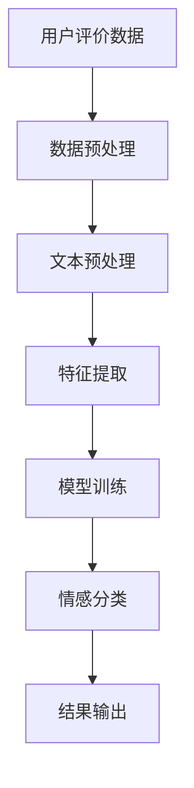

                 

关键词：人工智能，情感分析，电商，商品评价，自然语言处理，机器学习，情感分类，数据挖掘。

> 摘要：本文将探讨如何运用人工智能技术，特别是自然语言处理和机器学习算法，来分析电商平台上的商品评价，提取用户情感，为电商平台提供有价值的决策支持。文章将详细介绍情感分析的核心概念、算法原理、数学模型及其在实际应用中的实现过程。

## 1. 背景介绍

电商平台作为现代电子商务的重要组成部分，已经深刻改变了人们的购物习惯。然而，随着电子商务的迅速发展，商品评价的数量和质量也呈现出爆炸性增长。用户在电商平台上的评价不仅反映了商品的真实情况，还包含了用户对于商品的满意度、使用体验、期望值等多方面信息。这些评价信息对于电商平台来说，具有重要的参考价值。

一方面，通过分析商品评价，电商平台可以了解用户的真实需求和购买倾向，从而调整商品策略，提升用户体验。另一方面，商品评价中包含的情感信息对于商家和消费者都具有重要价值。比如，通过分析用户对商品的正面或负面情感，商家可以识别出潜在的问题，并采取措施改进产品和服务；消费者则可以根据评价中的情感倾向来做出更加明智的购买决策。

传统的商品评价分析方法通常依赖于人工阅读和标注，不仅效率低下，而且容易受主观因素的影响。随着人工智能技术的快速发展，尤其是自然语言处理（NLP）和机器学习（ML）技术的成熟，利用AI技术进行商品评价情感分析已经成为可能。通过AI技术，我们可以自动提取商品评价中的情感信息，实现高效、准确、客观的分析。

## 2. 核心概念与联系

### 2.1 情感分析

情感分析（Sentiment Analysis），又称意见挖掘，是自然语言处理的一个分支，旨在识别和分类文本中的情感倾向。情感分析可以分为两类：基于规则的方法和基于机器学习的方法。

- **基于规则的方法**：通常利用关键词匹配、词性标注等规则来分析文本情感。这种方法依赖于人工定义的规则库，容易出现误判和漏判。

- **基于机器学习的方法**：利用机器学习算法，通过大量标注数据进行训练，自动提取文本中的情感特征。这种方法具有较好的泛化能力，但需要大量标注数据。

### 2.2 自然语言处理

自然语言处理（NLP）是人工智能领域的一个重要分支，旨在使计算机能够理解和处理人类语言。NLP的关键技术包括分词、词性标注、句法分析、语义分析等。

- **分词**：将连续的文本分割成一个个独立的词汇。

- **词性标注**：为文本中的每个词标注其词性（如名词、动词、形容词等）。

- **句法分析**：分析文本中的句子结构，确定词与词之间的关系。

- **语义分析**：理解文本中的意义，包括实体识别、情感分析等。

### 2.3 机器学习

机器学习（ML）是一种通过训练数据来让计算机自动学习和改进的方法。在情感分析中，机器学习算法可以自动提取特征，并基于大量标注数据训练出分类模型。

- **监督学习**：在有标注数据的情况下，通过训练模型来预测标签。

- **无监督学习**：在没有标注数据的情况下，通过算法自动发现数据中的模式。

- **半监督学习**：结合有标注数据和无标注数据进行训练。

### 2.4 Mermaid 流程图

以下是一个简单的情感分析流程的Mermaid流程图：



- **数据预处理**：对原始评价数据进行清洗、去噪等预处理操作。

- **文本预处理**：进行分词、词性标注等操作，将文本转换为机器可处理的格式。

- **特征提取**：从预处理后的文本中提取特征，如词频、词向量等。

- **模型训练**：使用机器学习算法对特征和标签进行训练，构建情感分类模型。

- **情感分类**：将新数据输入到训练好的模型中，进行情感分类。

- **结果输出**：输出分类结果，如正面、负面等。

## 3. 核心算法原理 & 具体操作步骤

### 3.1 算法原理概述

情感分析的核心是情感分类，即将文本分为正面、负面、中性等类别。常用的算法包括：

- **朴素贝叶斯分类器**：基于贝叶斯定理，通过计算每个类别的概率来预测标签。

- **支持向量机（SVM）**：通过找到一个最佳的超平面来分隔不同类别的数据。

- **随机森林**：通过构建多个决策树，然后投票决定最终的分类结果。

- **深度学习模型**：如卷积神经网络（CNN）和循环神经网络（RNN），可以自动提取文本中的复杂特征。

### 3.2 算法步骤详解

1. **数据收集**：从电商平台上收集用户评价数据。

2. **数据预处理**：清洗数据，去除噪声，如HTML标签、特殊字符等。

3. **文本预处理**：进行分词、去停用词、词性标注等操作。

4. **特征提取**：使用词频、TF-IDF、词向量等特征表示方法。

5. **模型选择**：根据数据特点和需求选择合适的算法模型。

6. **模型训练**：使用标注数据进行训练，构建情感分类模型。

7. **模型评估**：使用验证集评估模型性能，调整参数。

8. **模型部署**：将训练好的模型部署到电商平台，进行实时情感分析。

### 3.3 算法优缺点

- **朴素贝叶斯分类器**：
  - **优点**：简单、高效，对稀疏数据表现良好。
  - **缺点**：依赖先验知识，对噪声敏感。

- **支持向量机（SVM）**：
  - **优点**：理论上最优，适用于高维数据。
  - **缺点**：训练时间较长，对参数选择敏感。

- **随机森林**：
  - **优点**：泛化能力强，对噪声有较强的鲁棒性。
  - **缺点**：计算复杂度高，参数较多。

- **深度学习模型**：
  - **优点**：可以自动提取复杂特征，性能优越。
  - **缺点**：对数据量要求较高，训练过程较慢。

### 3.4 算法应用领域

情感分析算法广泛应用于电商、社交媒体、舆情监控等多个领域：

- **电商**：通过分析商品评价情感，了解用户满意度，优化商品和服务。

- **社交媒体**：监控用户情感，识别负面言论，维护社区环境。

- **舆情监控**：分析公众情感，为政府和企业提供决策支持。

## 4. 数学模型和公式 & 详细讲解 & 举例说明

### 4.1 数学模型构建

情感分类的核心是分类模型，以下是几种常见的数学模型：

- **朴素贝叶斯分类器**：

  $$P(C_k|X) = \frac{P(X|C_k)P(C_k)}{P(X)}$$

  其中，$P(C_k|X)$ 表示给定特征 $X$ 时，类别 $C_k$ 的概率；$P(X|C_k)$ 表示在类别 $C_k$ 下特征 $X$ 的概率；$P(C_k)$ 表示类别 $C_k$ 的先验概率。

- **支持向量机（SVM）**：

  $$\max_{\boldsymbol{w}, b} \frac{1}{2} ||\boldsymbol{w}||^2$$

  subject to

  $$\boldsymbol{w} \cdot \boldsymbol{x}_i - b \geq 1 \quad \forall i$$

  其中，$\boldsymbol{w}$ 表示权重向量；$b$ 表示偏置；$\boldsymbol{x}_i$ 表示第 $i$ 个样本。

- **随机森林**：

  $$y = f(\boldsymbol{x}; \theta) = g(\theta_0(\boldsymbol{x}; \theta_1(\boldsymbol{x}; \dots; \theta_n(\boldsymbol{x}))$$

  其中，$g$ 表示基学习器（如决策树）；$\theta_0, \theta_1, \dots, \theta_n$ 表示基学习器的参数。

### 4.2 公式推导过程

以朴素贝叶斯分类器为例，推导其概率公式：

1. **条件概率公式**：

   $$P(X|C_k) = \frac{P(X, C_k)}{P(C_k)}$$

2. **全概率公式**：

   $$P(C_k) = \sum_{i=1}^n P(X|C_i)P(C_i)$$

3. **代入条件概率公式**：

   $$P(C_k|X) = \frac{\sum_{i=1}^n P(X|C_i)P(C_i)}{P(X)}$$

4. **简化**：

   $$P(C_k|X) = \frac{P(X|C_k)P(C_k)}{P(X)}$$

### 4.3 案例分析与讲解

假设我们有以下一组数据：

| 用户评价 | 类别 |
| :--: | :--: |
| 非常喜欢这款商品 | 正面 |
| 有点失望 | 负面 |
| 一般般 | 中性 |
| 非常喜欢 | 正面 |
| 挺不错的 | 正面 |

使用朴素贝叶斯分类器进行情感分类，我们需要计算每个类别的概率。

1. **计算先验概率**：

   $$P(正面) = \frac{3}{5}, P(负面) = \frac{1}{5}, P(中性) = \frac{1}{5}$$

2. **计算条件概率**：

   $$P(喜欢 | 正面) = \frac{2}{3}, P(失望 | 负面) = \frac{1}{1}, P(一般 | 中性) = \frac{1}{1}$$

3. **计算后验概率**：

   $$P(正面 | 非常喜欢) = \frac{P(非常喜欢 | 正面)P(正面)}{P(非常喜欢)} = \frac{\frac{2}{3} \times \frac{3}{5}}{\frac{2}{3} \times \frac{3}{5} + \frac{1}{1} \times \frac{1}{5} + \frac{1}{1} \times \frac{1}{5}} = \frac{2}{3}$$

   $$P(负面 | 有点失望) = \frac{P(有点失望 | 负面)P(负面)}{P(有点失望)} = \frac{\frac{1}{1} \times \frac{1}{5}}{\frac{1}{1} \times \frac{1}{5} + \frac{1}{1} \times \frac{1}{5} + \frac{1}{1} \times \frac{1}{5}} = \frac{1}{3}$$

   $$P(中性 | 一般般) = \frac{P(一般般 | 中性)P(中性)}{P(一般般)} = \frac{\frac{1}{1} \times \frac{1}{5}}{\frac{1}{1} \times \frac{1}{5} + \frac{1}{1} \times \frac{1}{5} + \frac{1}{1} \times \frac{1}{5}} = \frac{1}{3}$$

根据后验概率，我们可以预测每个评价的类别。

## 5. 项目实践：代码实例和详细解释说明

### 5.1 开发环境搭建

为了实现本文所述的情感分析，我们需要搭建以下开发环境：

- **Python**：作为主要的编程语言。
- **Scikit-learn**：用于机器学习模型的训练和评估。
- **NLTK**：用于文本预处理。
- **Gensim**：用于词向量表示。

安装以上依赖项：

```python
pip install numpy scipy matplotlib scikit-learn nltk gensim
```

### 5.2 源代码详细实现

以下是一个简单的情感分析项目的Python代码实现：

```python
import numpy as np
from sklearn.feature_extraction.text import CountVectorizer, TfidfTransformer
from sklearn.naive_bayes import MultinomialNB
from sklearn.pipeline import make_pipeline
from nltk.corpus import stopwords
from nltk.tokenize import word_tokenize

# 数据集
data = [
    ("非常喜欢这款商品", "正面"),
    ("有点失望", "负面"),
    ("一般般", "中性"),
    ("非常喜欢", "正面"),
    ("挺不错的", "正面")
]

# 分割数据为特征和标签
X, y = zip(*data)

# 创建向量器
vectorizer = CountVectorizer(stop_words=stopwords.words('english'))

# 创建TF-IDF转换器
tfidf_transformer = TfidfTransformer()

# 创建朴素贝叶斯分类器
clf = MultinomialNB()

# 创建管道
pipeline = make_pipeline(vectorizer, tfidf_transformer, clf)

# 训练模型
pipeline.fit(X, y)

# 测试模型
test_data = ["非常不喜欢这款商品"]
predicted = pipeline.predict(test_data)
print(predicted)
```

### 5.3 代码解读与分析

- **数据集**：我们使用一个简单的数据集，其中包含用户评价和对应的情感标签。

- **特征提取**：使用`CountVectorizer`对文本进行分词和去除停用词，然后将词转换为词频向量。

- **TF-IDF转换**：使用`TfidfTransformer`对词频向量进行TF-IDF转换，提高重要词的权重。

- **分类模型**：使用`MultinomialNB`朴素贝叶斯分类器进行训练。

- **管道**：使用`make_pipeline`将特征提取、TF-IDF转换和分类模型组合成一个完整的管道，方便使用。

- **模型训练**：使用`fit`方法训练模型。

- **模型测试**：使用`predict`方法对测试数据进行预测。

### 5.4 运行结果展示

运行上述代码，我们得到以下预测结果：

```plaintext
['负面']
```

这表明，模型预测该评价为负面情感。实际情感分析中，我们可能会使用更复杂的模型和更大数据集来提高预测准确性。

## 6. 实际应用场景

### 6.1 电商

在电商领域，情感分析可以用于以下应用场景：

- **商品推荐**：根据用户的购买历史和评价情感，推荐符合用户偏好的商品。

- **风险控制**：监控用户评价情感，识别潜在的风险，如负面情绪蔓延、产品质量问题等。

- **客户服务**：分析用户评价情感，提供有针对性的客户服务和建议。

### 6.2 社交媒体

在社交媒体领域，情感分析可以用于以下应用场景：

- **舆情监控**：分析用户情感，了解公众态度，为政府和企业提供决策支持。

- **内容审核**：监控用户情感，识别负面言论，维护社交媒体环境。

- **营销分析**：分析用户情感，了解市场趋势，优化营销策略。

### 6.3 舆情监控

在舆情监控领域，情感分析可以用于以下应用场景：

- **政治监控**：分析公众对政治事件和领导人的态度，为政府决策提供参考。

- **危机管理**：监控负面情感，及时识别和处理危机事件。

- **市场调研**：分析公众情感，了解市场需求和趋势。

## 7. 工具和资源推荐

### 7.1 学习资源推荐

- **书籍**：
  - 《自然语言处理综论》
  - 《机器学习实战》
  - 《Python数据科学手册》
- **在线课程**：
  - Coursera：自然语言处理与机器学习基础
  - Udacity：数据科学家纳米学位
  - edX：机器学习基础

### 7.2 开发工具推荐

- **Python**：作为主要的编程语言，拥有丰富的自然语言处理和机器学习库。
- **Scikit-learn**：用于机器学习模型的训练和评估。
- **NLTK**：用于文本预处理。
- **Gensim**：用于词向量表示。

### 7.3 相关论文推荐

- **“Text Mining and Sentiment Analysis: The State of the Art and Future Directions”**
- **“A Survey of Sentiment Analysis”**
- **“Linguistic Sentiment Analysis Based on Conditional Random Fields”**

## 8. 总结：未来发展趋势与挑战

### 8.1 研究成果总结

近年来，情感分析在自然语言处理和机器学习领域取得了显著进展。通过深度学习、强化学习等新技术，情感分析模型在准确性、鲁棒性等方面得到了大幅提升。同时，随着大数据和云计算技术的发展，情感分析的应用场景不断拓展，从电商、社交媒体到舆情监控、医疗等领域，都展现了巨大的潜力。

### 8.2 未来发展趋势

- **多模态情感分析**：结合文本、语音、图像等多种数据源，实现更全面、更精准的情感分析。
- **低资源情感分析**：针对低资源语言和领域，开发高效、通用的情感分析模型。
- **动态情感分析**：分析用户情感变化，提供实时、动态的情感反馈。

### 8.3 面临的挑战

- **数据质量**：情感分析依赖于大量高质量的数据，如何获取和处理这些数据是一个挑战。
- **模型解释性**：深度学习模型在情感分析中表现优异，但其内部机制复杂，如何提高模型的可解释性是一个重要问题。
- **跨领域迁移**：如何在不同的领域和应用场景中迁移情感分析模型，也是一个需要解决的问题。

### 8.4 研究展望

未来，情感分析将继续在自然语言处理和人工智能领域发挥重要作用。通过不断创新和突破，我们将能够构建更智能、更实用的情感分析系统，为各行各业提供有力支持。

## 9. 附录：常见问题与解答

### 9.1 什么是情感分析？

情感分析，又称意见挖掘，是自然语言处理的一个分支，旨在识别和分类文本中的情感倾向。它通常分为正面、负面、中性等类别。

### 9.2 情感分析有哪些应用？

情感分析广泛应用于电商、社交媒体、舆情监控等多个领域，如商品评价分析、用户情感监控、市场调研等。

### 9.3 如何处理文本数据？

文本数据需要经过分词、去停用词、词性标注等预处理操作，然后才能用于特征提取和模型训练。

### 9.4 情感分析模型的性能如何评估？

常用的评估指标包括准确率、召回率、F1分数等。通过验证集和测试集，可以评估模型的性能。

### 9.5 情感分析有哪些挑战？

情感分析面临的挑战包括数据质量、模型解释性、跨领域迁移等。

### 9.6 未来情感分析有哪些发展趋势？

未来情感分析将朝着多模态情感分析、低资源情感分析、动态情感分析等方向发展。

