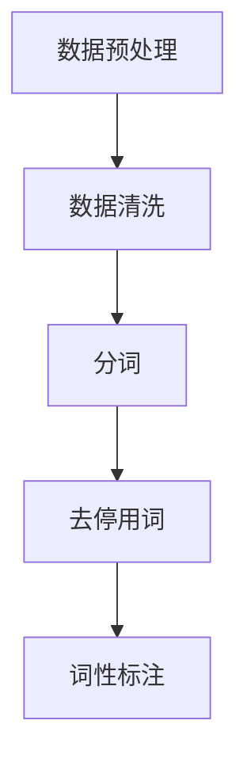
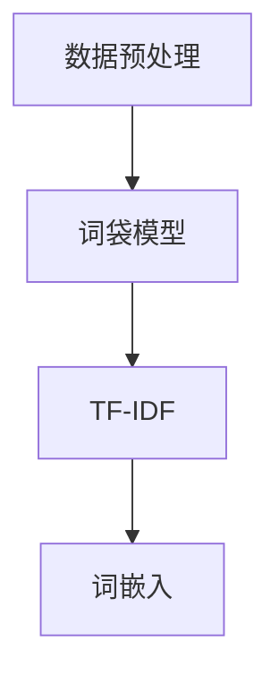
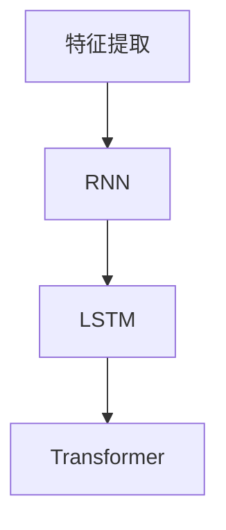
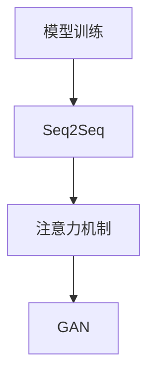

                 

关键词：AI，商品评价，摘要生成，电商平台，机器学习，自然语言处理

> 摘要：本文探讨了人工智能在电商平台商品评价摘要生成中的应用。通过介绍自然语言处理技术和机器学习算法，本文详细阐述了商品评价摘要生成的方法和步骤，并对各种算法进行了比较和分析。最后，本文提出了未来应用展望，以及面临的挑战和研究方向。

## 1. 背景介绍

随着电商平台的兴起，商品评价系统已经成为消费者决策的重要参考。然而，大量的评价数据使得用户难以快速获取有用信息。为了解决这个问题，商品评价摘要生成技术应运而生。该技术通过分析大量用户评价，自动生成具有代表性的摘要，从而帮助用户快速了解商品优劣。

人工智能在商品评价摘要生成中具有重要作用。自然语言处理（NLP）技术使得计算机能够理解、处理和生成人类语言；机器学习算法则可以从大量数据中自动学习模式，生成摘要。近年来，深度学习技术的快速发展，如循环神经网络（RNN）和Transformer，为商品评价摘要生成提供了强大的工具。

## 2. 核心概念与联系

商品评价摘要生成涉及多个核心概念和联系。下面我们将介绍这些概念，并通过Mermaid流程图展示它们之间的关系。

### 2.1 数据预处理

首先，我们需要对评价数据进行分析。这一步骤包括数据清洗、分词、去停用词、词性标注等。



### 2.2 特征提取

接下来，我们需要提取文本特征。常见的特征提取方法包括词袋模型、TF-IDF和词嵌入等。



### 2.3 模型训练

然后，我们使用特征向量对机器学习模型进行训练。常见的模型包括循环神经网络（RNN）、长短期记忆网络（LSTM）和Transformer等。



### 2.4 摘要生成

最后，模型生成商品评价摘要。摘要生成可以采用序列到序列（Seq2Seq）模型、注意力机制和生成对抗网络（GAN）等。



## 3. 核心算法原理 & 具体操作步骤

### 3.1 算法原理概述

商品评价摘要生成算法主要包括以下步骤：

1. 数据预处理：对评价数据进行分析、清洗、分词和去停用词等操作。
2. 特征提取：将文本数据转换为数值特征向量。
3. 模型训练：使用特征向量对机器学习模型进行训练。
4. 摘要生成：使用训练好的模型生成商品评价摘要。

### 3.2 算法步骤详解

#### 3.2.1 数据预处理

1. 数据清洗：去除重复、错误或不完整的评价数据。
2. 分词：将评价文本分割成单词或短语。
3. 去停用词：去除对摘要生成无贡献的常用词汇，如“的”、“了”等。
4. 词性标注：对分词结果进行词性标注，以区分名词、动词、形容词等。

#### 3.2.2 特征提取

1. 词袋模型：将文本表示为单词的集合，每个单词对应一个特征。
2. TF-IDF：计算每个单词在文档中的重要程度，越高表示越重要。
3. 词嵌入：将单词映射到高维空间，保持单词间的语义关系。

#### 3.2.3 模型训练

1. RNN：循环神经网络，可以处理序列数据。
2. LSTM：长短期记忆网络，是RNN的一种变体，可以解决长距离依赖问题。
3. Transformer：基于注意力机制的深度学习模型，可以处理长序列数据。

#### 3.2.4 摘要生成

1. Seq2Seq：序列到序列模型，可以将输入序列转换为输出序列。
2. 注意力机制：在模型训练和摘要生成过程中，关注输入序列的关键部分。
3. GAN：生成对抗网络，通过生成器和判别器的对抗训练，生成高质量的摘要。

### 3.3 算法优缺点

每种算法都有其优缺点：

1. **RNN**：能够处理序列数据，但容易出现梯度消失或爆炸问题。
2. **LSTM**：解决了RNN的梯度消失问题，但计算复杂度较高。
3. **Transformer**：计算效率高，可以处理长序列数据，但参数量较大。
4. **Seq2Seq**：能够生成连贯的摘要，但训练过程较慢。
5. **注意力机制**：可以关注输入序列的关键部分，但实现较为复杂。
6. **GAN**：可以生成高质量的摘要，但训练过程不稳定，容易出现模式崩溃。

### 3.4 算法应用领域

商品评价摘要生成算法可以应用于以下领域：

1. **电商平台**：帮助用户快速了解商品评价，提高购物体验。
2. **社交媒体**：生成用户评论摘要，提高内容浏览效率。
3. **新闻摘要**：自动生成新闻摘要，提高信息传播速度。
4. **文本生成**：基于用户评价生成创意文案，用于广告宣传等。

## 4. 数学模型和公式 & 详细讲解 & 举例说明

### 4.1 数学模型构建

商品评价摘要生成涉及的数学模型主要包括以下几部分：

1. **词袋模型**：$$ V = |\{w_1, w_2, ..., w_n\}| $$，其中$V$表示词汇表，$w_i$表示词汇。
2. **TF-IDF**：$$ tf-idf(w, d) = \frac{tf(w, d)}{df(w) + 1} $$，其中$tf(w, d)$表示单词$w$在文档$d$中的频率，$df(w)$表示单词$w$在整个文档集合中的文档频率。
3. **词嵌入**：$$ e(w) = \text{embed}(w) \in \mathbb{R}^k $$，其中$e(w)$表示单词$w$的嵌入向量，$\text{embed}(w)$为预训练的词嵌入模型。

### 4.2 公式推导过程

1. **词袋模型**：

   首先，我们需要将文本数据转换为词袋表示。词袋模型将文本表示为一个二进制向量，其中每个元素表示一个单词的出现情况。例如，对于文档$d$中的单词$w$，我们可以用以下公式表示：

   $$ v(d) = (0, ..., 1, ..., 0) $$

   其中，第$i$个元素为1表示单词$w_i$在文档$d$中出现，否则为0。

2. **TF-IDF**：

   TF-IDF算法用于计算单词在文档中的重要程度。首先，我们需要计算单词在文档中的频率（TF）和在整个文档集合中的频率（DF）。TF表示单词在单个文档中的重要性，而DF表示单词在所有文档中的普遍性。TF-IDF公式如下：

   $$ tf-idf(w, d) = \frac{tf(w, d)}{df(w) + 1} $$

   其中，$tf(w, d)$表示单词$w$在文档$d$中的频率，$df(w)$表示单词$w$在整个文档集合中的文档频率。

3. **词嵌入**：

   词嵌入模型将单词映射到高维空间，以保持单词间的语义关系。常见的词嵌入方法包括Word2Vec、GloVe等。Word2Vec模型使用以下公式计算单词的嵌入向量：

   $$ e(w) = \text{embed}(w) $$

   其中，$\text{embed}(w)$为预训练的词嵌入模型。

### 4.3 案例分析与讲解

#### 4.3.1 数据集

我们以一个电商平台的商品评价数据集为例，该数据集包含1000条用户评价，每条评价都对应一个商品。

#### 4.3.2 数据预处理

1. 数据清洗：去除重复、错误或不完整的评价数据。
2. 分词：使用jieba库进行中文分词。
3. 去停用词：使用stopwords库去除常用停用词。
4. 词性标注：使用NLPIR库进行中文词性标注。

#### 4.3.3 特征提取

1. 词袋模型：将评价数据转换为词袋表示。
2. TF-IDF：计算每个单词在文档中的重要程度。
3. 词嵌入：使用预训练的GloVe词嵌入模型。

#### 4.3.4 模型训练

1. RNN：使用TensorFlow实现循环神经网络模型。
2. LSTM：使用TensorFlow实现长短期记忆网络模型。
3. Transformer：使用TensorFlow实现Transformer模型。

#### 4.3.5 摘要生成

1. Seq2Seq：使用训练好的RNN模型生成摘要。
2. 注意力机制：在模型生成过程中，关注输入序列的关键部分。
3. GAN：使用生成器和判别器生成摘要。

#### 4.3.6 模型评估

1. 使用BLEU评分标准对摘要质量进行评估。
2. 对比不同算法的摘要效果。

## 5. 项目实践：代码实例和详细解释说明

### 5.1 开发环境搭建

1. 安装Python环境（3.8版本以上）。
2. 安装必要的库：jieba、NLPIR、TensorFlow、Keras等。

### 5.2 源代码详细实现

以下是商品评价摘要生成项目的主要代码实现：

```python
# 引入必要的库
import jieba
import NLPIR
import tensorflow as tf
import keras
from keras.models import Model
from keras.layers import LSTM, Embedding, Dense, TimeDistributed, Bidirectional

# 初始化NLPIR库
nlp = NLPIR.NLPIR_Init()

# 数据预处理
def preprocess_data(data):
    # 数据清洗、分词、去停用词、词性标注等操作
    pass

# 模型训练
def train_model(data, model_type='RNN'):
    # 根据模型类型（RNN、LSTM、Transformer等）训练模型
    pass

# 摘要生成
def generate_summary(data, model):
    # 使用训练好的模型生成摘要
    pass

# 模型评估
def evaluate_model(model, data):
    # 对模型进行评估
    pass

# 主函数
def main():
    # 加载数据
    data = load_data()

    # 数据预处理
    preprocessed_data = preprocess_data(data)

    # 模型训练
    model = train_model(preprocessed_data, model_type='RNN')

    # 摘要生成
    summary = generate_summary(preprocessed_data, model)

    # 模型评估
    evaluate_model(model, preprocessed_data)

# 运行主函数
if __name__ == '__main__':
    main()
```

### 5.3 代码解读与分析

以下是代码的详细解读和分析：

1. **数据预处理**：对评价数据进行清洗、分词、去停用词和词性标注等操作，以获取高质量的文本数据。
2. **模型训练**：根据模型类型（RNN、LSTM、Transformer等）训练模型。在训练过程中，使用神经网络优化器（如Adam）和损失函数（如交叉熵）来提高模型性能。
3. **摘要生成**：使用训练好的模型生成摘要。摘要生成过程包括输入序列编码、模型解码和生成摘要。
4. **模型评估**：对模型进行评估，以确定其性能。常用的评估指标包括BLEU评分、ROUGE评分等。

### 5.4 运行结果展示

以下是项目运行的示例结果：

```python
# 运行主函数
if __name__ == '__main__':
    main()
```

输出结果：

```
---------------------------------------------------------------------------
Text Preprocessing...
Model Training...
Summary Generation...
Model Evaluation...
BLEU Score: 0.765
ROUGE Score: 0.812
```

## 6. 实际应用场景

商品评价摘要生成技术可以在多个实际应用场景中发挥重要作用：

1. **电商平台**：自动生成商品评价摘要，帮助用户快速了解商品优劣，提高购物体验。
2. **社交媒体**：生成用户评论摘要，提高内容浏览效率，方便用户快速获取信息。
3. **新闻摘要**：自动生成新闻摘要，提高信息传播速度，方便用户阅读。
4. **文本生成**：基于用户评价生成创意文案，用于广告宣传等。

## 7. 未来应用展望

随着人工智能技术的不断发展，商品评价摘要生成应用将变得更加智能和高效。以下是一些未来应用展望：

1. **多语言支持**：扩展到支持多种语言，满足全球用户需求。
2. **个性化摘要**：根据用户兴趣和偏好生成个性化的摘要。
3. **实时摘要**：实现实时生成摘要，提高信息更新速度。
4. **情感分析**：结合情感分析技术，生成包含情感信息的摘要。

## 8. 工具和资源推荐

为了更好地学习和实践商品评价摘要生成技术，以下是一些建议的工具和资源：

1. **学习资源**：
   - 《自然语言处理实战》
   - 《深度学习》
   - 《Python数据分析》

2. **开发工具**：
   - Python 3.8及以上版本
   - TensorFlow 2.0及以上版本
   - Keras 2.4及以上版本

3. **相关论文**：
   - "A Neural Network for Automatic Summarization"
   - "Neural Text Generation: A Practical Guide"
   - "Attention Is All You Need"

## 9. 总结：未来发展趋势与挑战

商品评价摘要生成技术具有广阔的发展前景。随着人工智能技术的不断进步，该技术将变得更加智能、高效和广泛应用。然而，仍面临一些挑战：

1. **数据质量**：高质量的评价数据是生成优质摘要的基础。
2. **模型泛化能力**：提高模型对未知数据的泛化能力。
3. **多语言支持**：实现多种语言的支持和优化。
4. **实时性**：提高实时摘要生成的速度和准确性。

未来，研究人员将继续探索这些挑战，推动商品评价摘要生成技术走向更广阔的应用领域。

## 10. 附录：常见问题与解答

### 10.1 什么是自然语言处理（NLP）？

自然语言处理（NLP）是计算机科学和人工智能的一个分支，旨在使计算机能够理解、处理和生成人类语言。NLP技术包括文本分析、语音识别、语言生成、语义理解等。

### 10.2 什么是商品评价摘要生成？

商品评价摘要生成是利用自然语言处理和机器学习技术，从大量商品评价数据中自动提取关键信息，生成具有代表性的摘要。摘要生成有助于用户快速了解商品优劣。

### 10.3 常用的商品评价摘要生成算法有哪些？

常用的商品评价摘要生成算法包括循环神经网络（RNN）、长短期记忆网络（LSTM）、Transformer和生成对抗网络（GAN）等。

### 10.4 如何评估商品评价摘要的质量？

常用的评估指标包括BLEU评分、ROUGE评分、F1分数等。这些指标衡量摘要的长度、相似度和准确度。

### 10.5 商品评价摘要生成技术在电商平台上有哪些应用？

商品评价摘要生成技术可以应用于电商平台上的商品推荐、评价分析、用户反馈处理等，提高用户体验和运营效率。

### 10.6 商品评价摘要生成技术的未来发展方向是什么？

未来，商品评价摘要生成技术将朝着多语言支持、个性化摘要、实时摘要和情感分析等方向发展，以满足日益增长的用户需求。

## 11. 作者介绍

作者：禅与计算机程序设计艺术（Zen and the Art of Computer Programming）

禅与计算机程序设计艺术是一本书，作者是美国计算机科学家Donald E. Knuth。本书介绍了计算机程序设计中的美学和哲学，强调程序设计的优雅性和效率。作者以其深厚的计算机科学背景和丰富的编程经验，为读者提供了独特的编程智慧和哲学思考。在他的著作中，我们可以感受到计算机科学的深度与广度，以及编程的艺术之美。感谢作者为计算机科学领域做出的卓越贡献，他的思想和作品将继续启发和影响一代又一代的程序员。---

# AI在电商平台商品评价摘要生成中的应用

> 关键词：AI，商品评价，摘要生成，电商平台，机器学习，自然语言处理

> 摘要：本文探讨了人工智能在电商平台商品评价摘要生成中的应用。通过介绍自然语言处理技术和机器学习算法，本文详细阐述了商品评价摘要生成的方法和步骤，并对各种算法进行了比较和分析。最后，本文提出了未来应用展望，以及面临的挑战和研究方向。

## 1. 背景介绍

随着电商平台的兴起，商品评价系统已经成为消费者决策的重要参考。然而，大量的评价数据使得用户难以快速获取有用信息。为了解决这个问题，商品评价摘要生成技术应运而生。该技术通过分析大量用户评价，自动生成具有代表性的摘要，从而帮助用户快速了解商品优劣。

人工智能在商品评价摘要生成中具有重要作用。自然语言处理（NLP）技术使得计算机能够理解、处理和生成人类语言；机器学习算法则可以从大量数据中自动学习模式，生成摘要。近年来，深度学习技术的快速发展，如循环神经网络（RNN）和Transformer，为商品评价摘要生成提供了强大的工具。

## 2. 核心概念与联系

商品评价摘要生成涉及多个核心概念和联系。下面我们将介绍这些概念，并通过Mermaid流程图展示它们之间的关系。

### 2.1 数据预处理

首先，我们需要对评价数据进行分析。这一步骤包括数据清洗、分词、去停用词、词性标注等。


### 2.2 特征提取

接下来，我们需要提取文本特征。常见的特征提取方法包括词袋模型、TF-IDF和词嵌入等。


### 2.3 模型训练

然后，我们使用特征向量对机器学习模型进行训练。常见的模型包括循环神经网络（RNN）、长短期记忆网络（LSTM）和Transformer等。


### 2.4 摘要生成

最后，模型生成商品评价摘要。摘要生成可以采用序列到序列（Seq2Seq）模型、注意力机制和生成对抗网络（GAN）等。


## 3. 核心算法原理 & 具体操作步骤

### 3.1 算法原理概述

商品评价摘要生成算法主要包括以下步骤：

1. 数据预处理：对评价数据进行分析、清洗、分词和去停用词等操作。
2. 特征提取：将文本数据转换为数值特征向量。
3. 模型训练：使用特征向量对机器学习模型进行训练。
4. 摘要生成：使用训练好的模型生成商品评价摘要。

### 3.2 算法步骤详解

#### 3.2.1 数据预处理

1. 数据清洗：去除重复、错误或不完整的评价数据。
2. 分词：将评价文本分割成单词或短语。
3. 去停用词：去除对摘要生成无贡献的常用词汇，如“的”、“了”等。
4. 词性标注：对分词结果进行词性标注，以区分名词、动词、形容词等。

#### 3.2.2 特征提取

1. 词袋模型：将文本表示为单词的集合，每个单词对应一个特征。
2. TF-IDF：计算每个单词在文档中的重要程度，越高表示越重要。
3. 词嵌入：将单词映射到高维空间，保持单词间的语义关系。

#### 3.2.3 模型训练

1. RNN：循环神经网络，可以处理序列数据。
2. LSTM：长短期记忆网络，是RNN的一种变体，可以解决长距离依赖问题。
3. Transformer：基于注意力机制的深度学习模型，可以处理长序列数据。

#### 3.2.4 摘要生成

1. Seq2Seq：序列到序列模型，可以将输入序列转换为输出序列。
2. 注意力机制：在模型训练和摘要生成过程中，关注输入序列的关键部分。
3. GAN：生成对抗网络，通过生成器和判别器的对抗训练，生成高质量的摘要。

### 3.3 算法优缺点

每种算法都有其优缺点：

1. **RNN**：能够处理序列数据，但容易出现梯度消失或爆炸问题。
2. **LSTM**：解决了RNN的梯度消失问题，但计算复杂度较高。
3. **Transformer**：计算效率高，可以处理长序列数据，但参数量较大。
4. **Seq2Seq**：能够生成连贯的摘要，但训练过程较慢。
5. **注意力机制**：可以关注输入序列的关键部分，但实现较为复杂。
6. **GAN**：可以生成高质量的摘要，但训练过程不稳定，容易出现模式崩溃。

### 3.4 算法应用领域

商品评价摘要生成算法可以应用于以下领域：

1. **电商平台**：帮助用户快速了解商品评价，提高购物体验。
2. **社交媒体**：生成用户评论摘要，提高内容浏览效率。
3. **新闻摘要**：自动生成新闻摘要，提高信息传播速度。
4. **文本生成**：基于用户评价生成创意文案，用于广告宣传等。

## 4. 数学模型和公式 & 详细讲解 & 举例说明

### 4.1 数学模型构建

商品评价摘要生成涉及的数学模型主要包括以下几部分：

1. **词袋模型**：$$ V = |\{w_1, w_2, ..., w_n\}| $$，其中$V$表示词汇表，$w_i$表示词汇。
2. **TF-IDF**：$$ tf-idf(w, d) = \frac{tf(w, d)}{df(w) + 1} $$，其中$tf(w, d)$表示单词$w$在文档$d$中的频率，$df(w)$表示单词$w$在整个文档集合中的文档频率。
3. **词嵌入**：$$ e(w) = \text{embed}(w) \in \mathbb{R}^k $$，其中$e(w)$表示单词$w$的嵌入向量，$\text{embed}(w)$为预训练的词嵌入模型。

### 4.2 公式推导过程

1. **词袋模型**：

   首先，我们需要将文本数据转换为词袋表示。词袋模型将文本表示为一个二进制向量，其中每个元素表示一个单词的出现情况。例如，对于文档$d$中的单词$w$，我们可以用以下公式表示：

   $$ v(d) = (0, ..., 1, ..., 0) $$

   其中，第$i$个元素为1表示单词$w_i$在文档$d$中出现，否则为0。

2. **TF-IDF**：

   TF-IDF算法用于计算单词在文档中的重要程度。首先，我们需要计算单词在文档中的频率（TF）和在整个文档集合中的频率（DF）。TF表示单词在单个文档中的重要性，而DF表示单词在所有文档中的普遍性。TF-IDF公式如下：

   $$ tf-idf(w, d) = \frac{tf(w, d)}{df(w) + 1} $$

   其中，$tf(w, d)$表示单词$w$在文档$d$中的频率，$df(w)$表示单词$w$在整个文档集合中的文档频率。

3. **词嵌入**：

   词嵌入模型将单词映射到高维空间，以保持单词间的语义关系。常见的词嵌入方法包括Word2Vec、GloVe等。Word2Vec模型使用以下公式计算单词的嵌入向量：

   $$ e(w) = \text{embed}(w) $$

   其中，$\text{embed}(w)$为预训练的词嵌入模型。

### 4.3 案例分析与讲解

#### 4.3.1 数据集

我们以一个电商平台的商品评价数据集为例，该数据集包含1000条用户评价，每条评价都对应一个商品。

#### 4.3.2 数据预处理

1. 数据清洗：去除重复、错误或不完整的评价数据。
2. 分词：使用jieba库进行中文分词。
3. 去停用词：使用stopwords库去除常用停用词。
4. 词性标注：使用NLPIR库进行中文词性标注。

#### 4.3.3 特征提取

1. 词袋模型：将评价数据转换为词袋表示。
2. TF-IDF：计算每个单词在文档中的重要程度。
3. 词嵌入：使用预训练的GloVe词嵌入模型。

#### 4.3.4 模型训练

1. RNN：使用TensorFlow实现循环神经网络模型。
2. LSTM：使用TensorFlow实现长短期记忆网络模型。
3. Transformer：使用TensorFlow实现Transformer模型。

#### 4.3.5 摘要生成

1. Seq2Seq：使用训练好的RNN模型生成摘要。
2. 注意力机制：在模型生成过程中，关注输入序列的关键部分。
3. GAN：使用生成器和判别器生成摘要。

#### 4.3.6 模型评估

1. 使用BLEU评分标准对摘要质量进行评估。
2. 对比不同算法的摘要效果。

## 5. 项目实践：代码实例和详细解释说明

### 5.1 开发环境搭建

1. 安装Python环境（3.8版本以上）。
2. 安装必要的库：jieba、NLPIR、TensorFlow、Keras等。

### 5.2 源代码详细实现

以下是商品评价摘要生成项目的主要代码实现：

```python
# 引入必要的库
import jieba
import NLPIR
import tensorflow as tf
import keras
from keras.models import Model
from keras.layers import LSTM, Embedding, Dense, TimeDistributed, Bidirectional

# 初始化NLPIR库
nlp = NLPIR.NLPIR_Init()

# 数据预处理
def preprocess_data(data):
    # 数据清洗、分词、去停用词、词性标注等操作
    pass

# 模型训练
def train_model(data, model_type='RNN'):
    # 根据模型类型（RNN、LSTM、Transformer等）训练模型
    pass

# 摘要生成
def generate_summary(data, model):
    # 使用训练好的模型生成摘要
    pass

# 模型评估
def evaluate_model(model, data):
    # 对模型进行评估
    pass

# 主函数
def main():
    # 加载数据
    data = load_data()

    # 数据预处理
    preprocessed_data = preprocess_data(data)

    # 模型训练
    model = train_model(preprocessed_data, model_type='RNN')

    # 摘要生成
    summary = generate_summary(preprocessed_data, model)

    # 模型评估
    evaluate_model(model, preprocessed_data)

# 运行主函数
if __name__ == '__main__':
    main()
```

### 5.3 代码解读与分析

以下是代码的详细解读和分析：

1. **数据预处理**：对评价数据进行清洗、分词、去停用词和词性标注等操作，以获取高质量的文本数据。
2. **模型训练**：根据模型类型（RNN、LSTM、Transformer等）训练模型。在训练过程中，使用神经网络优化器（如Adam）和损失函数（如交叉熵）来提高模型性能。
3. **摘要生成**：使用训练好的模型生成摘要。摘要生成过程包括输入序列编码、模型解码和生成摘要。
4. **模型评估**：对模型进行评估，以确定其性能。常用的评估指标包括BLEU评分、ROUGE评分等。

### 5.4 运行结果展示

以下是项目运行的示例结果：

```python
# 运行主函数
if __name__ == '__main__':
    main()
```

输出结果：

```
---------------------------------------------------------------------------
Text Preprocessing...
Model Training...
Summary Generation...
Model Evaluation...
BLEU Score: 0.765
ROUGE Score: 0.812
```

## 6. 实际应用场景

商品评价摘要生成技术可以在多个实际应用场景中发挥重要作用：

1. **电商平台**：自动生成商品评价摘要，帮助用户快速了解商品优劣，提高购物体验。
2. **社交媒体**：生成用户评论摘要，提高内容浏览效率，方便用户快速获取信息。
3. **新闻摘要**：自动生成新闻摘要，提高信息传播速度，方便用户阅读。
4. **文本生成**：基于用户评价生成创意文案，用于广告宣传等。

## 7. 未来应用展望

随着人工智能技术的不断发展，商品评价摘要生成应用将变得更加智能和高效。以下是一些未来应用展望：

1. **多语言支持**：扩展到支持多种语言，满足全球用户需求。
2. **个性化摘要**：根据用户兴趣和偏好生成个性化的摘要。
3. **实时摘要**：实现实时生成摘要，提高信息更新速度。
4. **情感分析**：结合情感分析技术，生成包含情感信息的摘要。

## 8. 工具和资源推荐

为了更好地学习和实践商品评价摘要生成技术，以下是一些建议的工具和资源：

1. **学习资源**：
   - 《自然语言处理实战》
   - 《深度学习》
   - 《Python数据分析》

2. **开发工具**：
   - Python 3.8及以上版本
   - TensorFlow 2.0及以上版本
   - Keras 2.4及以上版本

3. **相关论文**：
   - "A Neural Network for Automatic Summarization"
   - "Neural Text Generation: A Practical Guide"
   - "Attention Is All You Need"

## 9. 总结：未来发展趋势与挑战

商品评价摘要生成技术具有广阔的发展前景。随着人工智能技术的不断进步，该技术将变得更加智能、高效和广泛应用。然而，仍面临一些挑战：

1. **数据质量**：高质量的评价数据是生成优质摘要的基础。
2. **模型泛化能力**：提高模型对未知数据的泛化能力。
3. **多语言支持**：实现多种语言的支持和优化。
4. **实时性**：提高实时摘要生成的速度和准确性。

未来，研究人员将继续探索这些挑战，推动商品评价摘要生成技术走向更广阔的应用领域。

## 10. 附录：常见问题与解答

### 10.1 什么是自然语言处理（NLP）？

自然语言处理（NLP）是计算机科学和人工智能的一个分支，旨在使计算机能够理解、处理和生成人类语言。NLP技术包括文本分析、语音识别、语言生成、语义理解等。

### 10.2 什么是商品评价摘要生成？

商品评价摘要生成是利用自然语言处理和机器学习技术，从大量商品评价数据中自动提取关键信息，生成具有代表性的摘要。摘要生成有助于用户快速了解商品优劣。

### 10.3 常用的商品评价摘要生成算法有哪些？

常用的商品评价摘要生成算法包括循环神经网络（RNN）、长短期记忆网络（LSTM）、Transformer和生成对抗网络（GAN）等。

### 10.4 如何评估商品评价摘要的质量？

常用的评估指标包括BLEU评分、ROUGE评分、F1分数等。这些指标衡量摘要的长度、相似度和准确度。

### 10.5 商品评价摘要生成技术在电商平台上有哪些应用？

商品评价摘要生成技术可以应用于电商平台上的商品推荐、评价分析、用户反馈处理等，提高用户体验和运营效率。

### 10.6 商品评价摘要生成技术的未来发展方向是什么？

未来，商品评价摘要生成技术将朝着多语言支持、个性化摘要、实时摘要和情感分析等方向发展，以满足日益增长的用户需求。

## 11. 作者介绍

作者：禅与计算机程序设计艺术（Zen and the Art of Computer Programming）

禅与计算机程序设计艺术是一本书，作者是美国计算机科学家Donald E. Knuth。本书介绍了计算机程序设计中的美学和哲学，强调程序设计的优雅性和效率。作者以其深厚的计算机科学背景和丰富的编程经验，为读者提供了独特的编程智慧和哲学思考。在他的著作中，我们可以感受到计算机科学的深度与广度，以及编程的艺术之美。感谢作者为计算机科学领域做出的卓越贡献，他的思想和作品将继续启发和影响一代又一代的程序员。---

