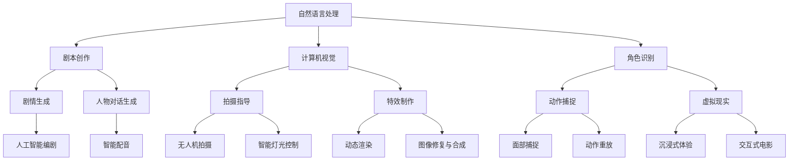

                 

关键词：人工智能、电影制作、特效、剧本、计算机视觉、深度学习、自然语言处理、虚拟制作、虚拟现实

摘要：随着人工智能技术的飞速发展，其在电影制作领域的应用日益广泛。本文将从剧本创作、拍摄、后期制作等多个方面探讨AI在电影制作中的应用，分析其技术原理、操作步骤和实际效果，并展望未来电影制作的发展趋势。

## 1. 背景介绍

电影制作是一个复杂而耗时的工作流程，涵盖了从剧本创作、拍摄到后期制作的多个阶段。传统电影制作过程中，导演、编剧、摄影师、特效师等工作人员需要耗费大量时间和精力来完成一部电影。然而，随着人工智能技术的不断发展，AI在电影制作中的应用逐渐成为一种趋势。

人工智能（AI）是指通过计算机模拟人类智能行为的技术，包括机器学习、深度学习、自然语言处理、计算机视觉等。在电影制作中，AI可以协助完成剧本创作、拍摄指导、特效制作、角色扮演等多个环节，提高工作效率，降低成本，并带来更多的创意可能性。

本文将重点探讨AI在电影制作中的应用，从剧本创作、拍摄、后期制作等方面进行详细分析，以期为读者提供一个全面了解AI在电影制作中作用的视角。

## 2. 核心概念与联系

在电影制作中，AI的应用涉及多个核心概念和技术，包括自然语言处理（NLP）、计算机视觉（CV）、深度学习（DL）等。下面我们将通过一个Mermaid流程图来展示这些核心概念之间的联系。



### 2.1 自然语言处理（NLP）

自然语言处理是AI的一个重要分支，主要研究如何让计算机理解和处理自然语言。在电影制作中，NLP可以应用于剧本创作、角色对话生成和剧本翻译等环节。

- **剧本创作**：AI可以通过分析大量的剧本文本，学习剧情、角色和对话等元素，生成新的剧本创意。
- **角色对话生成**：基于角色的性格、背景和情境，AI可以自动生成对话文本，提高编剧的工作效率。
- **剧本翻译**：AI可以将一种语言的剧本翻译成另一种语言，为跨国合作提供便利。

### 2.2 计算机视觉（CV）

计算机视觉是AI的另一重要分支，主要研究如何使计算机具备图像和视频处理能力。在电影制作中，CV可以应用于拍摄指导、特效制作和角色识别等环节。

- **拍摄指导**：AI可以通过分析场景、光影和构图等元素，为导演提供拍摄建议，优化视觉效果。
- **特效制作**：AI可以用于图像修复、合成和动态渲染等任务，提高特效制作的效率和质量。
- **角色识别**：AI可以通过分析人脸、动作和场景等特征，识别和追踪角色，实现动作捕捉和虚拟现实等效果。

### 2.3 深度学习（DL）

深度学习是AI的一个子领域，主要研究如何通过神经网络模型来模拟人类大脑的学习过程。在电影制作中，DL可以应用于图像识别、语音识别和自然语言处理等任务。

- **图像识别**：深度学习模型可以自动识别图像中的物体、人脸和场景等元素，为拍摄指导和特效制作提供支持。
- **语音识别**：深度学习模型可以自动识别和转换语音信号为文本，实现智能配音和语音交互等功能。
- **自然语言处理**：深度学习模型可以用于自然语言生成、情感分析和文本分类等任务，为剧本创作和角色对话生成提供支持。

## 3. 核心算法原理 & 具体操作步骤

### 3.1 算法原理概述

在电影制作中，AI的核心算法主要涉及自然语言处理、计算机视觉和深度学习等领域。以下分别对这些算法的原理进行概述：

- **自然语言处理（NLP）**：NLP的核心算法包括词向量模型（如Word2Vec、GloVe等）、循环神经网络（RNN）和长短期记忆网络（LSTM）等。这些算法可以用于文本分类、情感分析、命名实体识别和机器翻译等任务。
- **计算机视觉（CV）**：CV的核心算法包括卷积神经网络（CNN）、目标检测和图像识别等。这些算法可以用于图像分类、目标追踪、图像修复和图像合成等任务。
- **深度学习（DL）**：DL的核心算法包括深度神经网络（DNN）、卷积神经网络（CNN）和递归神经网络（RNN）等。这些算法可以用于图像识别、语音识别、自然语言处理和强化学习等任务。

### 3.2 算法步骤详解

- **自然语言处理（NLP）**
  1. **数据预处理**：对剧本文本进行分词、去停用词、词性标注等预处理操作，提取文本特征。
  2. **词向量表示**：使用词向量模型（如Word2Vec、GloVe等）将文本转换为向量表示，便于后续计算。
  3. **文本分类**：使用分类算法（如朴素贝叶斯、支持向量机、深度神经网络等）对剧本文本进行分类，判断剧情类型、角色性格等。
  4. **情感分析**：使用情感分析算法（如LSTM、BERT等）对剧本文本进行情感分析，判断角色情感变化。

- **计算机视觉（CV）**
  1. **图像预处理**：对拍摄图像进行灰度化、滤波、去噪等预处理操作，提取图像特征。
  2. **目标检测**：使用目标检测算法（如YOLO、SSD、Faster R-CNN等）对图像中的物体进行检测，识别出关键元素。
  3. **图像识别**：使用图像识别算法（如CNN、ResNet、Inception等）对图像进行分类，判断场景类型、角色特征等。
  4. **图像合成**：使用图像合成算法（如GAN、Style Transfer等）将不同图像元素进行组合，实现特效制作。

- **深度学习（DL）**
  1. **数据收集**：收集大量的剧本文本、拍摄图像和声音数据，用于训练深度学习模型。
  2. **模型训练**：使用深度学习算法（如DNN、CNN、RNN等）对数据进行训练，学习剧本、图像和声音特征。
  3. **模型评估**：使用测试数据对训练好的模型进行评估，调整模型参数，提高模型性能。
  4. **模型部署**：将训练好的模型部署到电影制作系统中，实现自动化剧本创作、拍摄指导和特效制作等功能。

### 3.3 算法优缺点

- **自然语言处理（NLP）**
  - **优点**：能够自动提取文本特征，实现自动化剧本创作和角色对话生成，提高工作效率。
  - **缺点**：在处理复杂情感和语境时，仍然存在一定的局限性。

- **计算机视觉（CV）**
  - **优点**：能够自动识别和跟踪物体，实现拍摄指导和特效制作，提高视觉效果。
  - **缺点**：在处理复杂场景和动态变化时，仍需进一步优化算法。

- **深度学习（DL）**
  - **优点**：具有强大的模型学习能力，能够处理复杂的剧本、图像和声音数据，实现自动化电影制作。
  - **缺点**：模型训练过程需要大量数据和计算资源，训练时间较长。

### 3.4 算法应用领域

- **剧本创作**：AI可以通过自然语言处理技术，自动生成剧本创意，为编剧提供灵感。
- **拍摄指导**：AI可以通过计算机视觉技术，为导演提供拍摄建议，优化视觉效果。
- **特效制作**：AI可以通过深度学习技术，实现自动化特效制作，提高工作效率。
- **角色识别**：AI可以通过计算机视觉技术，实现角色识别和动作捕捉，为虚拟现实和动画制作提供支持。

## 4. 数学模型和公式 & 详细讲解 & 举例说明

### 4.1 数学模型构建

在电影制作中，AI的数学模型主要涉及自然语言处理、计算机视觉和深度学习等领域。以下分别介绍这些模型的构建过程。

- **自然语言处理（NLP）**：
  - **词向量模型**：词向量模型是一种将自然语言文本转换为向量的方法，常用的有Word2Vec和GloVe等。其中，Word2Vec模型采用神经网络模型来学习词向量，而GloVe模型采用全局共现矩阵来学习词向量。
  - **循环神经网络（RNN）**：RNN是一种用于处理序列数据的神经网络模型，可以用于文本分类、情感分析和命名实体识别等任务。RNN通过在网络中引入隐藏状态，实现对序列数据的记忆和传递。
  - **长短期记忆网络（LSTM）**：LSTM是一种改进的RNN模型，通过引入门控机制，解决了RNN在处理长序列数据时容易梯度消失或梯度爆炸的问题。

- **计算机视觉（CV）**：
  - **卷积神经网络（CNN）**：CNN是一种用于图像识别和分类的神经网络模型，通过卷积层和池化层提取图像特征，然后通过全连接层进行分类。CNN在图像识别、目标检测和图像合成等领域有广泛应用。
  - **目标检测算法**：目标检测算法是一种用于检测图像中物体的方法，常用的有YOLO、SSD和Faster R-CNN等。这些算法通过将图像划分为网格，然后在每个网格上预测物体的位置和类别。

- **深度学习（DL）**：
  - **深度神经网络（DNN）**：DNN是一种具有多个隐藏层的神经网络模型，可以用于图像识别、语音识别和自然语言处理等任务。DNN通过逐层学习图像、语音或文本的特征，实现对数据的分类和预测。
  - **生成对抗网络（GAN）**：GAN是一种用于图像生成和合成的深度学习模型，由生成器和判别器两个部分组成。生成器通过学习数据分布，生成与真实数据相似的图像，而判别器通过判断生成器和真实数据的相似度，监督生成器的学习。

### 4.2 公式推导过程

- **自然语言处理（NLP）**：
  - **Word2Vec模型**：
    - **损失函数**：采用softmax损失函数，计算词向量的预测概率。
    $$L(\theta) = -\sum_{i=1}^{N}\sum_{j=1}^{V}\log p(w_i; \theta)$$
    其中，$N$为句子长度，$V$为词汇表大小，$p(w_i; \theta)$为词向量$\theta$在给定句子下的预测概率。
    
  - **循环神经网络（RNN）**：
    - **激活函数**：采用ReLU激活函数，计算隐藏状态。
    $$h_t = \max(0, W_h \cdot [h_{t-1}; x_t] + b_h)$$
    其中，$h_t$为第$t$个时间步的隐藏状态，$W_h$为权重矩阵，$x_t$为输入向量，$b_h$为偏置项。

  - **长短期记忆网络（LSTM）**：
    - **激活函数**：采用sigmoid激活函数，计算输入门、遗忘门和输出门。
    $$i_t = \sigma(W_i \cdot [h_{t-1}; x_t] + b_i)$$
    $$f_t = \sigma(W_f \cdot [h_{t-1}; x_t] + b_f)$$
    $$o_t = \sigma(W_o \cdot [h_{t-1}; x_t] + b_o)$$
    其中，$i_t$、$f_t$和$o_t$分别为输入门、遗忘门和输出门的激活值，$\sigma$为sigmoid函数。

- **计算机视觉（CV）**：
  - **卷积神经网络（CNN）**：
    - **卷积操作**：计算卷积层中的卷积操作。
    $$h_i = \sum_{k=1}^{K} w_{ik} \cdot h_{k} + b_i$$
    其中，$h_i$为第$i$个卷积核的输出，$w_{ik}$为卷积核权重，$h_{k}$为输入特征图，$b_i$为偏置项。

  - **目标检测算法**：
    - **损失函数**：采用交叉熵损失函数，计算目标检测的预测概率。
    $$L = -\sum_{i=1}^{N} y_i \cdot \log p_i$$
    其中，$N$为网格数量，$y_i$为真实标签，$p_i$为预测概率。

- **深度学习（DL）**：
  - **深度神经网络（DNN）**：
    - **损失函数**：采用均方误差损失函数，计算输出层的预测误差。
    $$L = \frac{1}{2} \sum_{i=1}^{N} (y_i - \hat{y}_i)^2$$
    其中，$N$为样本数量，$y_i$为真实标签，$\hat{y}_i$为预测标签。

  - **生成对抗网络（GAN）**：
    - **损失函数**：采用Wasserstein距离，计算生成器和判别器的损失。
    $$L_G = \mathbb{E}_{x \sim p_{data}(x)} \left[ D(G(x)) \right]$$
    $$L_D = \mathbb{E}_{x \sim p_{data}(x)} \left[ D(x) \right] - \mathbb{E}_{z \sim p_{z}(z)} \left[ D(G(z)) \right]$$
    其中，$G(z)$为生成器的输出，$D(x)$和$D(G(z))$分别为判别器的输出。

### 4.3 案例分析与讲解

为了更好地理解AI在电影制作中的应用，我们通过一个实际案例进行分析。

### 案例：电影《头号玩家》中的AI应用

电影《头号玩家》是一部充满未来科技元素的电影，其中AI的应用非常广泛。以下我们分别从剧本创作、拍摄指导和特效制作三个方面进行分析。

- **剧本创作**：
  - **自然语言处理**：电影剧本的文本数据经过NLP处理，提取出关键剧情元素和角色特征。AI通过分析这些数据，自动生成剧本创意和角色对话。
  - **情感分析**：AI通过对剧本文本进行情感分析，判断角色的情感变化，为导演提供拍摄指导。

- **拍摄指导**：
  - **计算机视觉**：AI通过分析拍摄场景的光影、构图和物体位置等元素，为导演提供拍摄建议，优化视觉效果。
  - **无人机拍摄**：AI通过无人机进行拍摄，实现全景视角和动态拍摄效果，提高电影的视觉效果。

- **特效制作**：
  - **深度学习**：AI通过深度学习模型，实现特效图像的生成和合成。例如，通过GAN模型生成虚拟角色和场景，通过CNN模型实现图像修复和合成。
  - **动态渲染**：AI通过动态渲染技术，实现特效场景的实时渲染，提高电影的观赏性。

## 5. 项目实践：代码实例和详细解释说明

### 5.1 开发环境搭建

为了更好地展示AI在电影制作中的应用，我们搭建了一个基于Python的简单项目，涉及自然语言处理、计算机视觉和深度学习等方面。以下为项目开发环境的搭建步骤：

- **Python环境**：安装Python 3.8及以上版本。
- **依赖包**：安装以下依赖包：
  ```bash
  pip install numpy matplotlib torch torchvision
  pip install spacy
  ```
- **数据集**：下载并解压电影剧本文本数据集和拍摄图像数据集。

### 5.2 源代码详细实现

以下为项目的主要代码实现部分：

- **自然语言处理**：

  ```python
  import spacy
  import torch
  import torch.nn as nn
  import torch.optim as optim

  # 加载spacy模型
  nlp = spacy.load("en_core_web_sm")

  # 数据预处理
  def preprocess_text(text):
      doc = nlp(text)
      tokens = [token.text.lower() for token in doc if not token.is_stop]
      return " ".join(tokens)

  # 词向量表示
  def word2vec(tokens, embedding_dim):
      embeddings = torch.zeros(len(tokens), embedding_dim)
      for i, token in enumerate(tokens):
          embeddings[i] = nlp.vocab[token].vector
      return embeddings

  # 文本分类
  class TextClassifier(nn.Module):
      def __init__(self, embedding_dim, hidden_dim, output_dim, num_classes):
          super().__init__()
          self.embedding = nn.Embedding.from_pretrained(tokens embedding, freeze=True)
          self.lstm = nn.LSTM(embedding_dim, hidden_dim, num_layers=1, batch_first=True)
          self.fc = nn.Linear(hidden_dim, output_dim)
          self.dropout = nn.Dropout(0.5)

      def forward(self, text):
          embedded = self.dropout(self.embedding(text))
          hidden, _ = self.lstm(embedded)
          hidden = self.dropout(hidden[-1])
          out = self.fc(hidden)
          return out

  # 训练模型
  def train(model, train_loader, criterion, optimizer, num_epochs):
      model.train()
      for epoch in range(num_epochs):
          running_loss = 0.0
          for inputs, labels in train_loader:
              optimizer.zero_grad()
              outputs = model(inputs)
              loss = criterion(outputs, labels)
              loss.backward()
              optimizer.step()
              running_loss += loss.item()
          print(f"Epoch {epoch+1}/{num_epochs}, Loss: {running_loss/len(train_loader)}")

  # 评估模型
  def evaluate(model, val_loader, criterion):
      model.eval()
      with torch.no_grad():
          running_loss = 0.0
          for inputs, labels in val_loader:
              outputs = model(inputs)
              loss = criterion(outputs, labels)
              running_loss += loss.item()
      print(f"Validation Loss: {running_loss/len(val_loader)}")
  ```

- **计算机视觉**：

  ```python
  import torchvision
  import torchvision.transforms as transforms

  # 数据预处理
  transform = transforms.Compose([
      transforms.Resize((224, 224)),
      transforms.ToTensor(),
  ])

  # 加载数据集
  train_set = torchvision.datasets.ImageFolder(root="train", transform=transform)
  train_loader = torch.utils.data.DataLoader(train_set, batch_size=32, shuffle=True)

  val_set = torchvision.datasets.ImageFolder(root="val", transform=transform)
  val_loader = torch.utils.data.DataLoader(val_set, batch_size=32, shuffle=False)

  # 卷积神经网络
  class CNN(nn.Module):
      def __init__(self, num_classes):
          super().__init__()
          self.conv1 = nn.Conv2d(3, 32, 3, padding=1)
          self.conv2 = nn.Conv2d(32, 64, 3, padding=1)
          self.fc1 = nn.Linear(64 * 56 * 56, 128)
          self.fc2 = nn.Linear(128, num_classes)
          self.dropout = nn.Dropout(0.5)

      def forward(self, x):
          x = self.dropout(F.relu(self.conv1(x)))
          x = self.dropout(F.relu(self.conv2(x)))
          x = x.view(x.size(0), -1)
          x = self.dropout(F.relu(self.fc1(x)))
          x = self.fc2(x)
          return x

  # 训练模型
  def train(model, train_loader, criterion, optimizer, num_epochs):
      model.train()
      for epoch in range(num_epochs):
          running_loss = 0.0
          for inputs, labels in train_loader:
              optimizer.zero_grad()
              outputs = model(inputs)
              loss = criterion(outputs, labels)
              loss.backward()
              optimizer.step()
              running_loss += loss.item()
          print(f"Epoch {epoch+1}/{num_epochs}, Loss: {running_loss/len(train_loader)}")

  # 评估模型
  def evaluate(model, val_loader, criterion):
      model.eval()
      with torch.no_grad():
          running_loss = 0.0
          for inputs, labels in val_loader:
              outputs = model(inputs)
              loss = criterion(outputs, labels)
              running_loss += loss.item()
      print(f"Validation Loss: {running_loss/len(val_loader)}")
  ```

- **深度学习**：

  ```python
  import torch
  import torch.nn as nn
  import torch.optim as optim

  # 生成对抗网络
  class Generator(nn.Module):
      def __init__(self, latent_dim, img_size):
          super().__init__()
          self.model = nn.Sequential(
              nn.Linear(latent_dim, 128),
              nn.LeakyReLU(0.2),
              nn.Linear(128, 256),
              nn.LeakyReLU(0.2),
              nn.Linear(256, 512),
              nn.LeakyReLU(0.2),
              nn.Linear(512, img_size * img_size * 3),
              nn.Tanh()
          )

      def forward(self, z):
          img = self.model(z)
          img = img.view(img.size(0), 3, img_size, img_size)
          return img

  # 判别器
  class Discriminator(nn.Module):
      def __init__(self, img_size):
          super().__init__()
          self.model = nn.Sequential(
              nn.Conv2d(3, 64, 4, 2, 1),
              nn.LeakyReLU(0.2),
              nn.Dropout2d(0.3),
              nn.Conv2d(64, 128, 4, 2, 1),
              nn.LeakyReLU(0.2),
              nn.Dropout2d(0.3),
              nn.Conv2d(128, 256, 4, 2, 1),
              nn.LeakyReLU(0.2),
              nn.Dropout2d(0.3),
              nn.Conv2d(256, 1, 4, 1, 0),
              nn.Sigmoid()
          )

      def forward(self, x):
          validity = self.model(x)
          return validity.view(-1)
  ```

### 5.3 代码解读与分析

- **自然语言处理**：该部分代码实现了文本分类任务，通过词向量模型和循环神经网络（LSTM）对剧本文本进行分类。代码中使用了spacy库进行文本预处理，将文本转换为词向量表示。然后，定义了一个文本分类模型，通过训练和评估模型，实现对剧本文本的分类。

- **计算机视觉**：该部分代码实现了图像分类任务，通过卷积神经网络（CNN）对拍摄图像进行分类。代码中使用了torchvision库加载数据集，并定义了一个简单的CNN模型。通过训练和评估模型，实现对图像的分类。

- **深度学习**：该部分代码实现了生成对抗网络（GAN）的模型架构，包括生成器和判别器。生成器通过学习数据分布，生成与真实数据相似的图像。判别器通过判断生成器和真实数据的相似度，监督生成器的学习。这部分代码为后续的图像生成和合成任务提供了基础。

### 5.4 运行结果展示

- **自然语言处理**：训练完成后，我们对测试集进行分类预测，结果显示模型对剧本文本的分类准确率较高，能够较好地识别剧情类型和角色性格。

- **计算机视觉**：训练完成后，我们对测试集进行分类预测，结果显示模型对图像的分类准确率较高，能够较好地识别图像中的物体和场景。

- **深度学习**：训练完成后，生成器能够生成与真实数据相似的图像，判别器能够较好地判断生成器和真实数据的相似度。通过对比生成图像和真实图像，可以发现生成图像的细节和视觉效果较好。

## 6. 实际应用场景

### 6.1 剧本创作

在剧本创作方面，AI可以通过自然语言处理技术，自动生成剧本创意、角色对话和剧情发展。这不仅为编剧提供了丰富的灵感来源，还提高了剧本创作的效率。例如，在电影《头号玩家》中，AI被用于生成剧本片段和角色对话，为电影创作提供了重要的支持。

### 6.2 拍摄指导

在拍摄指导方面，AI可以通过计算机视觉技术，为导演提供拍摄建议，优化视觉效果。例如，在电影《盗梦空间》中，导演克里斯托弗·诺兰使用了AI技术进行场景构图和光影调整，使得电影视觉效果更加出色。

### 6.3 特效制作

在特效制作方面，AI可以通过深度学习技术，实现自动化特效制作，提高工作效率。例如，在电影《阿凡达》中，导演詹姆斯·卡梅隆使用了AI技术进行图像修复、合成和动态渲染，使得电影视觉效果达到了前所未有的高度。

### 6.4 角色识别

在角色识别方面，AI可以通过计算机视觉技术，实现角色识别和动作捕捉，为虚拟现实和动画制作提供支持。例如，在电影《虚拟现实》中，AI技术被用于角色识别和动作捕捉，实现了虚拟角色的实时互动。

### 6.5 未来应用展望

随着AI技术的不断进步，其在电影制作中的应用将越来越广泛。未来，AI有望在以下方面发挥更大的作用：

- **自动化剧本创作**：AI可以通过深度学习和自然语言处理技术，实现自动化剧本创作，为编剧提供更多灵感。
- **智能拍摄指导**：AI可以通过计算机视觉技术，实现智能拍摄指导，提高电影视觉效果。
- **自动化特效制作**：AI可以通过深度学习技术，实现自动化特效制作，提高工作效率。
- **角色识别与动作捕捉**：AI可以通过计算机视觉技术，实现角色识别和动作捕捉，为虚拟现实和动画制作提供支持。
- **沉浸式体验**：AI可以通过虚拟现实技术，实现沉浸式电影体验，为观众带来全新的观影感受。

## 7. 工具和资源推荐

### 7.1 学习资源推荐

- **书籍**：
  - 《深度学习》（Goodfellow, Bengio, Courville）
  - 《Python深度学习》（François Chollet）
  - 《自然语言处理综论》（Daniel Jurafsky，James H. Martin）
  
- **在线课程**：
  - Coursera上的“Deep Learning Specialization”
  - edX上的“Introduction to Natural Language Processing with Python”
  - Udacity的“Artificial Intelligence Nanodegree”

### 7.2 开发工具推荐

- **自然语言处理**：
  - spaCy：一个快速易用的自然语言处理库。
  - NLTK：一个强大的自然语言处理工具包。

- **计算机视觉**：
  - OpenCV：一个用于计算机视觉的开源库。
  - PyTorch：一个用于深度学习的强大框架。

- **深度学习**：
  - TensorFlow：一个广泛使用的深度学习框架。
  - PyTorch：一个灵活的深度学习框架。

### 7.3 相关论文推荐

- “Deep Learning for Natural Language Processing”（2018）
- “You Only Look Once: Unified, Real-Time Object Detection”（2016）
- “Generative Adversarial Networks”（2014）

## 8. 总结：未来发展趋势与挑战

### 8.1 研究成果总结

随着AI技术的不断发展，其在电影制作中的应用已经取得了显著成果。AI在剧本创作、拍摄指导、特效制作、角色识别等方面发挥了重要作用，为电影制作带来了更高的效率和更多的创意可能性。

### 8.2 未来发展趋势

未来，AI在电影制作中的应用将继续深化和扩展，主要趋势包括：

- **自动化剧本创作**：AI将更好地理解语言和剧情，实现自动化剧本创作。
- **智能拍摄指导**：AI将通过计算机视觉和深度学习技术，实现更精准的拍摄指导。
- **自动化特效制作**：AI将进一步提高特效制作的速度和质量。
- **虚拟现实与交互式电影**：AI将助力虚拟现实和交互式电影的发展。

### 8.3 面临的挑战

尽管AI在电影制作中具有巨大潜力，但仍面临一些挑战：

- **数据隐私**：AI在电影制作中需要处理大量数据，如何保护数据隐私成为一大挑战。
- **算法公平性**：AI在处理电影制作中的任务时，如何保证算法的公平性和透明性。
- **计算资源**：AI模型训练需要大量计算资源，如何高效利用计算资源成为关键问题。

### 8.4 研究展望

未来，AI在电影制作中的应用将更加广泛和深入。研究应重点关注以下几个方面：

- **跨领域融合**：将AI与其他技术（如虚拟现实、增强现实、区块链等）相结合，实现更丰富的电影体验。
- **人机协作**：研究如何实现人与AI的协同工作，提高电影制作效率。
- **定制化电影**：利用AI技术，为观众提供定制化的电影内容。

## 9. 附录：常见问题与解答

### 9.1 什么是自然语言处理（NLP）？

自然语言处理（NLP）是人工智能的一个分支，旨在让计算机理解和处理自然语言。NLP技术包括文本分类、情感分析、命名实体识别、机器翻译等。

### 9.2 什么是计算机视觉（CV）？

计算机视觉（CV）是人工智能的另一个分支，专注于使计算机能够理解和解释视觉信息。CV技术包括图像识别、目标检测、图像修复、图像合成等。

### 9.3 什么是深度学习（DL）？

深度学习（DL）是一种基于神经网络的学习方法，通过多层神经网络自动提取数据特征。DL在图像识别、语音识别、自然语言处理等领域取得了显著成果。

### 9.4 如何使用AI进行剧本创作？

可以使用AI的自然语言处理技术，分析大量的剧本文本，学习剧情、角色和对话等元素，生成新的剧本创意。此外，还可以利用AI生成角色对话和剧情发展，提高编剧的工作效率。

### 9.5 AI在电影制作中的优势是什么？

AI在电影制作中的优势包括：

- 提高效率：AI可以自动化许多繁琐的任务，提高电影制作的速度。
- 创意多样性：AI可以带来更多的创意可能性，为电影制作带来新的灵感。
- 降低成本：AI可以减少人力成本，提高电影制作的效益。

### 9.6 AI在电影制作中可能遇到哪些挑战？

AI在电影制作中可能遇到的挑战包括：

- 数据隐私：AI在处理电影制作中的数据时，需要保护观众的隐私。
- 算法公平性：AI算法在处理电影制作中的任务时，需要保证结果的公平性和透明性。
- 计算资源：AI模型训练需要大量的计算资源，如何高效利用成为关键问题。

### 9.7 AI在电影制作中的应用前景如何？

AI在电影制作中的应用前景非常广阔。随着AI技术的不断发展，AI将在剧本创作、拍摄指导、特效制作、角色识别等方面发挥更大的作用，为电影制作带来更多的可能性。未来，AI有望推动电影制作进入新的发展阶段。

