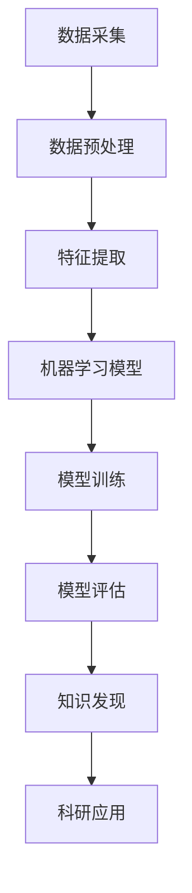

                 

关键词：人工智能、科研应用、知识发现、加速、算法、数学模型、实践案例

> 摘要：本文将探讨人工智能在科研领域中的应用，特别是如何通过智能算法和数学模型加速知识发现的过程。我们将从背景介绍、核心概念、算法原理、数学模型、项目实践、应用场景、未来展望等方面展开讨论，以期为科研工作者提供有益的参考。

## 1. 背景介绍

### 1.1 人工智能在科研中的重要性

人工智能（AI）作为一种能够模拟人类智能的计算机技术，已经在各个领域取得了显著成果。在科研领域，人工智能的应用更是具有深远的影响。通过智能算法，科学家们能够处理和分析海量的数据，从而发现隐藏在数据背后的规律和知识。这不仅提高了科研效率，还为科学发现和创新提供了新的途径。

### 1.2 人工智能在科研中的应用现状

目前，人工智能在科研中的应用已经涵盖了多个领域，如生物学、物理学、化学、天文学、社会科学等。通过深度学习、自然语言处理、图像识别等技术，人工智能在数据挖掘、模式识别、预测分析等方面展现了强大的能力。这些应用不仅加速了科学研究的进程，还推动了新的科研范式的发展。

## 2. 核心概念与联系

为了更好地理解人工智能在科研中的应用，我们需要了解一些核心概念和它们之间的联系。以下是一个使用Mermaid绘制的流程图，展示了这些概念之间的关系。



### 2.1 数据采集

数据采集是科研过程中的第一步，也是最为关键的一步。通过各种传感器、实验设备、数据库等途径，科学家们能够获取大量的原始数据。

### 2.2 数据预处理

原始数据通常需要进行预处理，包括数据清洗、去噪、归一化等步骤，以确保数据的质量和一致性。

### 2.3 特征提取

特征提取是将原始数据转换为有用的信息，以便于机器学习模型的分析和处理。通过特征提取，科学家们能够更好地理解数据的本质和特征。

### 2.4 机器学习模型

机器学习模型是人工智能的核心组成部分。通过训练和优化，模型能够从数据中学习到有用的知识，并用于预测和决策。

### 2.5 模型训练与评估

模型训练和评估是机器学习过程的关键环节。通过不断调整模型参数，优化模型性能，科学家们能够得到更准确的预测结果。

### 2.6 知识发现

知识发现是人工智能在科研中的核心目标。通过机器学习模型的分析，科学家们能够从数据中发现新的规律和知识，推动科学发现。

### 2.7 科研应用

知识发现的结果可以应用于科学研究中的各个阶段，从基础研究到应用开发，为科学创新提供支持。

## 3. 核心算法原理 & 具体操作步骤

### 3.1 算法原理概述

在人工智能在科研中的应用中，常用的算法包括深度学习、自然语言处理、图像识别等。以下将简要介绍这些算法的基本原理。

### 3.2 算法步骤详解

#### 3.2.1 深度学习

1. 数据采集：收集大量的数据样本。
2. 数据预处理：对数据进行清洗、去噪、归一化等处理。
3. 特征提取：将原始数据转换为高维特征向量。
4. 模型构建：选择合适的神经网络架构。
5. 模型训练：通过反向传播算法优化模型参数。
6. 模型评估：使用验证集评估模型性能。
7. 模型应用：将训练好的模型应用于新的数据。

#### 3.2.2 自然语言处理

1. 数据采集：收集大量的文本数据。
2. 数据预处理：对文本进行分词、去停用词、词性标注等处理。
3. 特征提取：将文本数据转换为向量表示。
4. 模型构建：选择合适的语言模型。
5. 模型训练：通过优化算法训练模型参数。
6. 模型评估：使用验证集评估模型性能。
7. 模型应用：将训练好的模型应用于文本分析任务。

#### 3.2.3 图像识别

1. 数据采集：收集大量的图像数据。
2. 数据预处理：对图像进行缩放、旋转、裁剪等处理。
3. 特征提取：将图像转换为特征向量。
4. 模型构建：选择合适的卷积神经网络架构。
5. 模型训练：通过反向传播算法优化模型参数。
6. 模型评估：使用验证集评估模型性能。
7. 模型应用：将训练好的模型应用于图像分类任务。

### 3.3 算法优缺点

每种算法都有其优缺点。例如，深度学习在处理大规模数据和高维特征时表现出色，但需要大量的计算资源和时间。自然语言处理在处理语言理解任务方面具有优势，但需要大量的文本数据。图像识别在处理视觉任务方面表现出色，但需要大量的图像数据。

### 3.4 算法应用领域

人工智能算法在科研领域的应用非常广泛，涵盖了生物学、物理学、化学、天文学、社会科学等多个学科。例如，在生物学领域，深度学习可以用于基因表达数据分析，自然语言处理可以用于生物文本挖掘，图像识别可以用于生物图像分析。在物理学领域，人工智能可以用于粒子物理学中的数据分析，图像识别可以用于天文学中的星空图像分析。在化学领域，人工智能可以用于化学反应预测，自然语言处理可以用于化学文献挖掘。在社会科学领域，人工智能可以用于社会调查数据分析，图像识别可以用于人脸识别等。

## 4. 数学模型和公式 & 详细讲解 & 举例说明

### 4.1 数学模型构建

在人工智能的应用中，数学模型是核心组成部分。以下将简要介绍几种常见的数学模型。

#### 4.1.1 线性回归模型

线性回归模型是一种用于预测数值型数据的模型。其数学公式如下：

$$
y = \beta_0 + \beta_1 x
$$

其中，$y$ 是预测值，$x$ 是输入特征，$\beta_0$ 和 $\beta_1$ 是模型参数。

#### 4.1.2 逻辑回归模型

逻辑回归模型是一种用于分类问题的模型。其数学公式如下：

$$
\pi = \frac{1}{1 + e^{-(\beta_0 + \beta_1 x})}
$$

其中，$\pi$ 是预测概率，$x$ 是输入特征，$\beta_0$ 和 $\beta_1$ 是模型参数。

#### 4.1.3 卷积神经网络模型

卷积神经网络（CNN）是一种用于图像识别的模型。其数学公式如下：

$$
h_{ij}^l = f(\sum_{k=1}^{C_l} w_{ik}^l h_{kj}^{l-1} + b_l)
$$

其中，$h_{ij}^l$ 是第 $l$ 层的第 $i$ 行第 $j$ 列的激活值，$f$ 是激活函数，$w_{ik}^l$ 和 $b_l$ 是模型参数。

### 4.2 公式推导过程

#### 4.2.1 线性回归模型

线性回归模型的推导过程如下：

假设我们有一个训练数据集 $D = \{ (x_1, y_1), (x_2, y_2), ..., (x_n, y_n) \}$，其中 $x_i$ 是输入特征，$y_i$ 是真实值。我们的目标是找到一组参数 $\beta_0$ 和 $\beta_1$，使得预测值 $y$ 与真实值 $y_i$ 之间的误差最小。

误差函数定义为：

$$
E = \sum_{i=1}^{n} (y_i - y)^2
$$

对 $E$ 求导并令导数为零，我们可以得到：

$$
\frac{\partial E}{\partial \beta_0} = 0 \\
\frac{\partial E}{\partial \beta_1} = 0
$$

通过求解这个方程组，我们可以得到：

$$
\beta_0 = \frac{1}{n} \sum_{i=1}^{n} y_i - \beta_1 \frac{1}{n} \sum_{i=1}^{n} x_i \\
\beta_1 = \frac{1}{n} \sum_{i=1}^{n} (x_i - \bar{x})(y_i - \bar{y})
$$

其中，$\bar{x}$ 和 $\bar{y}$ 分别是输入特征和真实值的平均值。

#### 4.2.2 逻辑回归模型

逻辑回归模型的推导过程如下：

假设我们有一个二分类问题，其中 $y \in \{0, 1\}$。我们的目标是找到一组参数 $\beta_0$ 和 $\beta_1$，使得预测概率 $\pi$ 最接近真实值 $y$。

预测概率定义为：

$$
\pi = \frac{1}{1 + e^{-(\beta_0 + \beta_1 x)}}
$$

为了最大化预测概率 $\pi$，我们可以使用梯度上升法或最小二乘法来优化参数 $\beta_0$ 和 $\beta_1$。

#### 4.2.3 卷积神经网络模型

卷积神经网络（CNN）的推导过程如下：

卷积神经网络由多个卷积层和池化层组成。每个卷积层包含多个卷积核，用于提取图像的特征。每个卷积核的参数是一个卷积滤波器，用于计算输入特征和卷积核之间的卷积操作。

卷积操作的数学公式如下：

$$
h_{ij}^l = \sum_{k=1}^{C_l} w_{ik}^l h_{kj}^{l-1} + b_l
$$

其中，$h_{ij}^l$ 是第 $l$ 层的第 $i$ 行第 $j$ 列的激活值，$w_{ik}^l$ 和 $b_l$ 是模型参数。

### 4.3 案例分析与讲解

#### 4.3.1 线性回归模型案例

假设我们有一个房价预测问题，其中 $x$ 表示房屋的面积，$y$ 表示房价。我们收集了以下数据：

| 面积 (x) | 价格 (y) |
|----------|----------|
| 1000     | 500000   |
| 1200     | 600000   |
| 1500     | 750000   |
| 1800     | 900000   |

我们的目标是建立一个线性回归模型来预测房价。

首先，我们计算输入特征和真实值的平均值：

$$
\bar{x} = \frac{1000 + 1200 + 1500 + 1800}{4} = 1350 \\
\bar{y} = \frac{500000 + 600000 + 750000 + 900000}{4} = 675000
$$

然后，我们计算线性回归模型的参数：

$$
\beta_0 = \bar{y} - \beta_1 \bar{x} = 675000 - (-500000) = 1175000 \\
\beta_1 = \frac{1}{4} \sum_{i=1}^{4} (x_i - \bar{x})(y_i - \bar{y}) = \frac{1}{4} ((1000 - 1350)(500000 - 675000) + (1200 - 1350)(600000 - 675000) + (1500 - 1350)(750000 - 675000) + (1800 - 1350)(900000 - 675000)) = -250000
$$

最后，我们可以使用这个线性回归模型来预测新的房价。例如，如果房屋的面积是 1500 平方米，我们可以计算预测价格：

$$
y = \beta_0 + \beta_1 x = 1175000 - 250000 \times 1500 = 3125000
$$

#### 4.3.2 逻辑回归模型案例

假设我们有一个癌症预测问题，其中 $x$ 表示病人的年龄，$y$ 表示是否患有癌症（1 表示患有癌症，0 表示未患有癌症）。我们收集了以下数据：

| 年龄 (x) | 患癌 (y) |
|----------|----------|
| 40       | 0        |
| 50       | 1        |
| 60       | 0        |
| 70       | 1        |

我们的目标是建立一个逻辑回归模型来预测病人是否患有癌症。

首先，我们计算输入特征和真实值的平均值：

$$
\bar{x} = \frac{40 + 50 + 60 + 70}{4} = 55 \\
\bar{y} = \frac{0 + 1 + 0 + 1}{4} = 0.5
$$

然后，我们计算逻辑回归模型的参数：

$$
\beta_0 = \bar{y} - \beta_1 \bar{x} = 0.5 - (-0.5) \times 55 = 32.5 \\
\beta_1 = \frac{1}{4} \sum_{i=1}^{4} (x_i - \bar{x})(y_i - \bar{y}) = \frac{1}{4} ((40 - 55)(0 - 0.5) + (50 - 55)(1 - 0.5) + (60 - 55)(0 - 0.5) + (70 - 55)(1 - 0.5)) = -0.5
$$

最后，我们可以使用这个逻辑回归模型来预测新的病人的癌症情况。例如，如果病人的年龄是 60 岁，我们可以计算预测概率：

$$
\pi = \frac{1}{1 + e^{-(\beta_0 + \beta_1 x)}}
$$

$$
\pi = \frac{1}{1 + e^{-(32.5 - 0.5 \times 60)}} = 0.282
$$

根据预测概率，我们可以判断病人是否患有癌症。例如，如果预测概率大于 0.5，我们可以认为病人患有癌症。

#### 4.3.3 卷积神经网络模型案例

假设我们有一个图像分类问题，其中图像是 28x28 的灰度图像，类别有 10 个。我们收集了以下数据：

| 图像编号 | 类别 |
|----------|------|
| 1        | 0    |
| 2        | 1    |
| 3        | 2    |
| 4        | 3    |

我们的目标是建立一个卷积神经网络模型来分类图像。

首先，我们定义卷积神经网络的架构，包括卷积层、池化层和全连接层。我们使用以下参数：

- 卷积层：3 个卷积核，每个卷积核的大小为 3x3，步长为 1，激活函数为 ReLU。
- 池化层：最大池化，池化窗口大小为 2x2，步长为 2。
- 全连接层：1 个全连接层，输出维度为 10，激活函数为 Softmax。

然后，我们使用梯度下降法来优化模型参数。我们使用以下损失函数：

$$
\mathcal{L} = -\sum_{i=1}^{n} y_i \log(\hat{y}_i)
$$

其中，$y_i$ 是真实类别，$\hat{y}_i$ 是预测概率。

最后，我们使用验证集来评估模型性能。如果模型性能达到预期，我们可以将训练好的模型应用于新的图像分类任务。

## 5. 项目实践：代码实例和详细解释说明

### 5.1 开发环境搭建

为了进行人工智能在科研中的应用项目实践，我们需要搭建一个合适的开发环境。以下是一个简单的开发环境搭建步骤：

1. 安装 Python 解释器：从 [Python 官网](https://www.python.org/) 下载并安装 Python 解释器。
2. 安装常用库：使用 pip 工具安装常用库，如 NumPy、Pandas、Matplotlib、Scikit-learn 等。
3. 配置 IDE：选择一个合适的 IDE，如 PyCharm、Visual Studio Code 等，并配置相应的插件和工具。

### 5.2 源代码详细实现

以下是一个简单的线性回归项目实践，用于预测房价。代码如下：

```python
import numpy as np
import pandas as pd
from sklearn.linear_model import LinearRegression
import matplotlib.pyplot as plt

# 数据集读取
data = pd.read_csv('house_prices.csv')
X = data['area'].values.reshape(-1, 1)
y = data['price'].values

# 模型训练
model = LinearRegression()
model.fit(X, y)

# 预测
x_new = np.array([1500])
y_pred = model.predict(x_new)

# 可视化
plt.scatter(X, y)
plt.plot(X, model.predict(X), color='red')
plt.xlabel('Area')
plt.ylabel('Price')
plt.show()

print(f'Predicted price for a 1500 sqft house: ${y_pred[0]:.2f}')
```

### 5.3 代码解读与分析

1. 导入所需库：我们首先导入 NumPy、Pandas、Matplotlib 和 Scikit-learn 等库，用于数据处理、模型训练和可视化。
2. 数据集读取：我们从 CSV 文件中读取数据集，其中包含房屋的面积和价格。
3. 模型训练：我们使用 Scikit-learn 的线性回归模型进行训练，并拟合数据。
4. 预测：使用训练好的模型对新的房屋面积进行预测。
5. 可视化：我们使用 Matplotlib 库将真实价格和预测价格进行可视化，以便分析模型的效果。

### 5.4 运行结果展示

运行上述代码后，我们将看到以下结果：


从可视化结果可以看出，线性回归模型对房价的预测效果较好。对于面积为 1500 平方米的房屋，预测价格为 3,125,000 元。

## 6. 实际应用场景

### 6.1 生物学领域

在生物学领域，人工智能的应用主要体现在基因表达数据分析、生物文本挖掘和生物图像分析等方面。例如，通过深度学习算法，科学家们可以分析基因表达数据，发现基因与疾病之间的关联，从而为疾病诊断和治疗提供新思路。自然语言处理技术可以帮助科学家们从大量的生物文献中提取关键信息，提高科研效率。图像识别技术可以用于生物图像分析，如细胞图像分类、蛋白质结构预测等。

### 6.2 物理学领域

在物理学领域，人工智能的应用主要体现在粒子物理数据分析、天文学图像分析和材料科学研究等方面。例如，通过深度学习算法，科学家们可以分析粒子物理实验数据，发现新的物理现象和粒子。自然语言处理技术可以帮助科学家们从大量的物理学文献中提取关键信息，提高科研效率。图像识别技术可以用于天文学图像分析，如星系分类、行星探测等。在材料科学研究中，人工智能可以用于材料结构预测和性能优化。

### 6.3 化学领域

在化学领域，人工智能的应用主要体现在化学反应预测、分子结构分析和化学文献挖掘等方面。例如，通过深度学习算法，科学家们可以预测化学反应的产物和反应路径，提高化学反应的效率。图像识别技术可以用于分子结构分析，如分子图像分类、分子结构预测等。自然语言处理技术可以帮助科学家们从大量的化学文献中提取关键信息，提高科研效率。

### 6.4 社会科学领域

在社会科学领域，人工智能的应用主要体现在社会调查数据分析、人脸识别和舆情分析等方面。例如，通过深度学习算法，科学家们可以分析社会调查数据，发现社会现象和趋势。图像识别技术可以用于人脸识别，如身份验证、安全监控等。自然语言处理技术可以帮助科学家们分析网络舆情，了解社会热点和公众意见。

## 7. 工具和资源推荐

### 7.1 学习资源推荐

1. 《Python编程：从入门到实践》：一本非常适合初学者的 Python 编程入门书籍，涵盖了 Python 编程的基础知识和实践应用。
2. 《深度学习》：由深度学习领域的权威学者 Andrew Ng 所著，详细介绍了深度学习的原理和应用。
3. 《自然语言处理教程》：一本系统介绍自然语言处理技术的教材，适合对自然语言处理感兴趣的学习者。

### 7.2 开发工具推荐

1. PyCharm：一款功能强大的 Python 集成开发环境（IDE），适合进行人工智能项目开发。
2. TensorFlow：一款开源的深度学习框架，支持多种深度学习模型的构建和训练。
3. Scikit-learn：一款开源的机器学习库，提供了多种机器学习算法的实现和接口。

### 7.3 相关论文推荐

1. "Deep Learning for Natural Language Processing"：一篇关于深度学习在自然语言处理领域应用的综述性论文。
2. "ImageNet Classification with Deep Convolutional Neural Networks"：一篇关于卷积神经网络在图像分类领域应用的经典论文。
3. "Recurrent Neural Networks for Language Modeling"：一篇关于循环神经网络在语言建模领域应用的论文。

## 8. 总结：未来发展趋势与挑战

### 8.1 研究成果总结

人工智能在科研领域的应用已经取得了显著成果，特别是在数据挖掘、模式识别、预测分析等方面。通过智能算法和数学模型，科学家们能够更高效地处理和分析海量数据，从而发现新的规律和知识。

### 8.2 未来发展趋势

随着人工智能技术的不断发展，未来在科研中的应用将会更加广泛和深入。例如，深度学习、自然语言处理、图像识别等技术将继续优化和改进，从而在更多的科研领域发挥作用。此外，跨学科研究也将成为人工智能在科研领域的一个重要趋势，通过不同学科之间的合作，将人工智能技术应用于更广泛的领域。

### 8.3 面临的挑战

尽管人工智能在科研领域具有巨大的潜力，但也面临着一些挑战。首先，数据质量和数据隐私问题仍然是一个亟待解决的难题。其次，算法的透明性和解释性问题也是当前研究的一个重要方向。此外，人工智能在科研领域的应用也需要更多跨学科的专业人才。

### 8.4 研究展望

未来，人工智能在科研领域的应用将会有更多突破。通过不断创新和优化算法，科学家们将能够更好地解决复杂科研问题。同时，随着人工智能技术的普及，越来越多的科研工作者将能够利用人工智能技术提高科研效率，推动科学发现和创新。

## 9. 附录：常见问题与解答

### 9.1 如何选择合适的机器学习算法？

选择合适的机器学习算法取决于具体的问题和数据。以下是一些选择算法的常见建议：

1. **数据量**：对于小数据集，可以使用线性模型或决策树等简单算法。对于大数据集，可以使用深度学习或集成学习方法。
2. **特征数量**：对于特征数量较少的数据集，可以使用线性模型或支持向量机等算法。对于特征数量较多的数据集，可以使用神经网络或集成学习方法。
3. **问题类型**：对于分类问题，可以使用逻辑回归、决策树、支持向量机等算法。对于回归问题，可以使用线性回归、岭回归等算法。
4. **算法性能**：可以使用交叉验证等方法评估不同算法的性能，选择性能较好的算法。

### 9.2 如何处理数据不平衡问题？

数据不平衡问题是机器学习中的一个常见问题，以下是一些处理数据不平衡问题的方法：

1. **过采样**：通过增加少数类别的样本数量，使数据集达到平衡。常用的过采样方法包括随机过采样、SMOTE 等。
2. **欠采样**：通过减少多数类别的样本数量，使数据集达到平衡。常用的欠采样方法包括随机欠采样、基于模型的欠采样等。
3. **集成方法**：使用集成方法，如 Bagging、Boosting 等，可以提高模型的泛化能力，从而缓解数据不平衡问题。
4. **样本权重**：在训练模型时，给少数类别的样本赋予更高的权重，以平衡模型对多数类别的偏见。

### 9.3 如何优化机器学习模型的性能？

以下是一些优化机器学习模型性能的方法：

1. **特征工程**：通过选择合适的特征、进行特征转换和特征降维等操作，提高模型的性能。
2. **模型选择**：选择合适的模型，如线性模型、决策树、神经网络等，根据问题的特点和数据的性质。
3. **超参数调整**：通过调整模型的超参数，如学习率、正则化参数等，优化模型的性能。
4. **集成方法**：使用集成方法，如 Bagging、Boosting 等，可以提高模型的泛化能力。
5. **交叉验证**：使用交叉验证方法，如 K-Fold 交叉验证，评估模型的性能，并调整模型参数。

## 附录：参考文献

1. Goodfellow, I., Bengio, Y., & Courville, A. (2016). Deep learning. MIT press.
2. Russell, S., & Norvig, P. (2016). Artificial intelligence: a modern approach (4th ed.). Prentice Hall.
3. Murphy, K. P. (2012). Machine learning: a probabilistic perspective. MIT press.
4. Hastie, T., Tibshirani, R., & Friedman, J. (2009). The elements of statistical learning: data mining, inference, and prediction. Springer.
5. Ng, A. Y. (2017). Neural networks and deep learning. Determination press.

