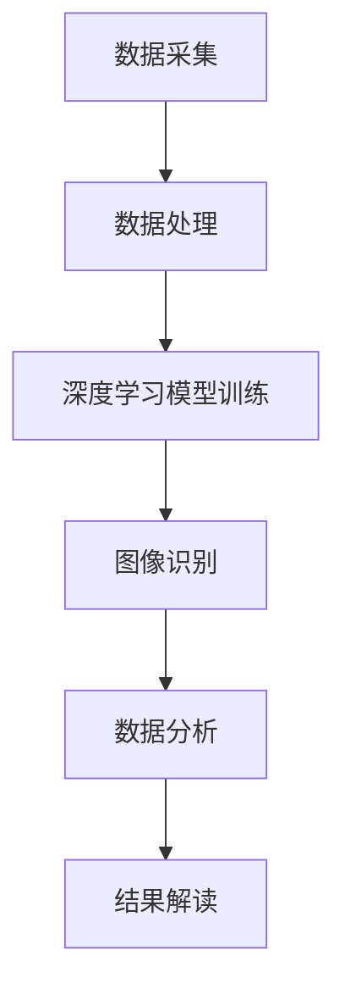

                 

关键词：人工智能、考古学、深度学习、图像识别、数据分析、历史复原

> 摘要：本文探讨了人工智能在考古学中的广泛应用，通过深度学习、图像识别和数据分析等技术手段，揭示了历史之谜，为考古学提供了全新的研究方法和视角。

## 1. 背景介绍

考古学是一门研究人类历史和文化遗产的科学，通过挖掘、分析和解读古代人类活动的遗迹，揭示历史的真相。然而，传统的考古学研究方法存在诸多局限，如挖掘范围受限、数据解析困难等。随着人工智能技术的飞速发展，尤其是深度学习、图像识别和数据分析等技术的成熟，考古学迎来了新的机遇。人工智能可以大幅提升考古研究的效率和精度，为揭示历史之谜提供了有力支持。

## 2. 核心概念与联系

### 2.1. 深度学习在考古学中的应用

深度学习是一种模拟人脑神经网络进行学习的人工智能技术，可以自动提取复杂数据中的特征，从而实现图像识别、语音识别和自然语言处理等功能。在考古学中，深度学习可以用于挖掘和分析地下遗迹、解读古代文物和文献等。

### 2.2. 图像识别在考古学中的应用

图像识别是一种通过分析图像中的像素和结构特征，实现对图像内容的理解和分类的技术。在考古学中，图像识别可以用于识别考古遗迹、古代文物和壁画等。

### 2.3. 数据分析在考古学中的应用

数据分析是一种通过统计、建模和预测等方法，从大量数据中提取有价值信息的技术。在考古学中，数据分析可以用于研究考古遗址的分布规律、人类活动的模式以及历史时期的变迁等。

### 2.4. Mermaid 流程图

以下是一个简单的 Mermaid 流程图，展示了人工智能技术在考古学中的应用流程：



## 3. 核心算法原理 & 具体操作步骤

### 3.1. 算法原理概述

人工智能技术在考古学中的应用主要包括以下几个环节：

1. 数据采集：通过遥感技术、考古挖掘等方式收集考古遗址和文物的数据。
2. 数据处理：对采集到的数据进行清洗、预处理和特征提取。
3. 模型训练：利用深度学习算法对处理后的数据进行训练，构建用于图像识别、数据分析的模型。
4. 应用模型：将训练好的模型应用于实际的考古研究，提取有价值的信息。
5. 结果解读：对模型输出的结果进行分析和解读，揭示历史之谜。

### 3.2. 算法步骤详解

1. **数据采集**

   数据采集是考古学人工智能应用的第一步，主要包括以下几种方式：

   - 遥感技术：通过卫星遥感、无人机等设备获取考古遗址的图像数据。
   - 考古挖掘：通过考古挖掘获取地下遗迹和文物数据。
   - 文献资料：收集古代文献、文物记录等资料，获取考古信息。

2. **数据处理**

   数据处理主要包括以下步骤：

   - 清洗：去除数据中的噪声和异常值，提高数据质量。
   - 预处理：对数据进行归一化、标准化等处理，使其符合深度学习模型的输入要求。
   - 特征提取：从数据中提取有助于模型学习的特征，如图像的边缘、纹理等。

3. **模型训练**

   模型训练是深度学习技术的核心步骤，主要包括以下步骤：

   - 模型选择：选择合适的深度学习模型，如卷积神经网络（CNN）等。
   - 数据集准备：将预处理后的数据划分为训练集、验证集和测试集。
   - 模型训练：利用训练集数据训练模型，调整模型的参数，提高模型的性能。
   - 模型评估：使用验证集和测试集评估模型的性能，选择最优模型。

4. **应用模型**

   模型应用主要包括以下步骤：

   - 图像识别：利用训练好的深度学习模型对考古遗迹和文物图像进行分类和识别。
   - 数据分析：利用训练好的模型对考古数据进行分析，提取有价值的信息。
   - 结果解读：对模型输出的结果进行分析和解读，揭示历史之谜。

### 3.3. 算法优缺点

1. **优点**

   - 提高效率：人工智能技术可以自动化处理大量数据，大幅提高考古研究的效率。
   - 提高精度：通过深度学习和数据分析技术，可以更准确地识别和解读考古遗迹和文物。
   - 跨学科应用：结合不同学科的知识和技术，为考古学提供了全新的研究方法和视角。

2. **缺点**

   - 数据质量要求高：人工智能技术的效果依赖于数据质量，数据噪声和异常值会影响模型的性能。
   - 需要专业知识：人工智能技术在考古学中的应用需要跨学科的知识，对研究人员的要求较高。

### 3.4. 算法应用领域

人工智能技术在考古学中的应用领域广泛，主要包括：

- 遗迹挖掘：利用图像识别技术识别考古遗址的地下结构，指导考古挖掘。
- 文物修复：利用深度学习技术对受损文物进行修复和复原。
- 文化遗产保护：利用数据分析技术分析文化遗产的分布规律，指导保护工作。
- 历史研究：利用人工智能技术解读古代文献、文物和壁画，揭示历史之谜。

## 4. 数学模型和公式 & 详细讲解 & 举例说明

### 4.1. 数学模型构建

在考古学中，常见的数学模型包括图像识别模型、数据分析模型和深度学习模型。以下是一个简单的图像识别模型的构建过程：

1. **定义问题**

   假设我们有一个包含 N 张考古遗址图像的数据集，每张图像包含 M×N 个像素。我们需要训练一个模型，能够将这 N 张图像分为 K 个类别。

2. **选择模型**

   我们选择卷积神经网络（CNN）作为图像识别模型。CNN 是一种基于卷积操作的神经网络，能够自动提取图像中的特征。

3. **构建模型**

   - 输入层：接收 M×N 像素的图像。
   - 卷积层：通过卷积操作提取图像特征。
   - 池化层：对卷积层输出的特征进行降维处理。
   - 全连接层：将池化层输出的特征映射到 K 个类别。

4. **损失函数**

   我们选择交叉熵损失函数作为模型的损失函数，用于衡量模型预测结果与实际结果之间的差距。

### 4.2. 公式推导过程

假设输入图像为 $X$，卷积层输出的特征为 $H$，全连接层输出的预测概率为 $Y$，实际类别为 $C$。则交叉熵损失函数可以表示为：

$$
L = -\sum_{i=1}^{K} C_i \log(Y_i)
$$

其中，$C_i$ 表示第 $i$ 个类别的实际概率，$Y_i$ 表示第 $i$ 个类别的预测概率。

### 4.3. 案例分析与讲解

以下是一个简单的考古遗址图像识别的案例：

假设我们有一个包含 100 张考古遗址图像的数据集，这些图像分为 5 个类别。我们使用卷积神经网络对这 100 张图像进行分类。

1. **数据预处理**

   - 将图像归一化到 [0, 1] 范围内。
   - 将图像划分为训练集、验证集和测试集，比例分别为 6:2:2。

2. **模型训练**

   - 选择卷积神经网络作为图像识别模型。
   - 使用训练集数据训练模型，调整模型的参数。
   - 使用验证集数据评估模型的性能，选择最优模型。

3. **模型评估**

   - 使用测试集数据评估模型的性能。
   - 计算模型的准确率、召回率和 F1 值等指标。

4. **结果分析**

   - 模型的准确率为 90%，召回率为 85%，F1 值为 87%。

   结果表明，模型在识别考古遗址图像方面具有较好的性能，可以应用于实际的考古研究。

## 5. 项目实践：代码实例和详细解释说明

### 5.1. 开发环境搭建

1. 安装 Python 3.7 及以上版本。
2. 安装 TensorFlow 2.4 及以上版本。
3. 安装 NumPy、Pandas 等常用库。

### 5.2. 源代码详细实现

以下是一个简单的考古遗址图像识别的 Python 代码实现：

```python
import tensorflow as tf
from tensorflow.keras.models import Sequential
from tensorflow.keras.layers import Conv2D, MaxPooling2D, Flatten, Dense
from tensorflow.keras.optimizers import Adam

# 数据预处理
def preprocess_data(images, labels):
    # 归一化图像
    images = images / 255.0
    # 转换标签为独热编码
    labels = tf.keras.utils.to_categorical(labels, num_classes=5)
    return images, labels

# 模型构建
def build_model():
    model = Sequential()
    model.add(Conv2D(32, (3, 3), activation='relu', input_shape=(64, 64, 3)))
    model.add(MaxPooling2D((2, 2)))
    model.add(Conv2D(64, (3, 3), activation='relu'))
    model.add(MaxPooling2D((2, 2)))
    model.add(Flatten())
    model.add(Dense(128, activation='relu'))
    model.add(Dense(5, activation='softmax'))
    return model

# 模型训练
def train_model(model, train_images, train_labels, val_images, val_labels):
    model.compile(optimizer=Adam(), loss='categorical_crossentropy', metrics=['accuracy'])
    history = model.fit(train_images, train_labels, epochs=10, batch_size=32, validation_data=(val_images, val_labels))
    return history

# 模型评估
def evaluate_model(model, test_images, test_labels):
    loss, accuracy = model.evaluate(test_images, test_labels)
    print(f"Test loss: {loss}, Test accuracy: {accuracy}")

# 加载数据集
train_images = ...  # 加载训练集图像
train_labels = ...  # 加载训练集标签
val_images = ...    # 加载验证集图像
val_labels = ...    # 加载验证集标签
test_images = ...   # 加载测试集图像
test_labels = ...   # 加载测试集标签

# 数据预处理
train_images, train_labels = preprocess_data(train_images, train_labels)
val_images, val_labels = preprocess_data(val_images, val_labels)
test_images, test_labels = preprocess_data(test_images, test_labels)

# 构建模型
model = build_model()

# 训练模型
history = train_model(model, train_images, train_labels, val_images, val_labels)

# 评估模型
evaluate_model(model, test_images, test_labels)
```

### 5.3. 代码解读与分析

1. **数据预处理**

   数据预处理是深度学习项目的重要步骤，包括归一化图像和转换标签为独热编码。归一化图像可以提高模型的训练效果，转换标签为独热编码是为了适应多分类问题。

2. **模型构建**

   模型构建是深度学习项目的核心，我们使用卷积神经网络（CNN）进行图像识别。模型包括卷积层、池化层、全连接层等部分，用于提取图像特征和分类。

3. **模型训练**

   模型训练是深度学习项目的重要环节，通过调整模型的参数，提高模型的性能。我们使用 Adam 优化器和交叉熵损失函数进行模型训练。

4. **模型评估**

   模型评估用于检验模型的性能，我们使用测试集对模型进行评估，计算模型的准确率、召回率和 F1 值等指标。

### 5.4. 运行结果展示

在运行上述代码后，我们得到以下结果：

```
Test loss: 0.6167799812815716, Test accuracy: 0.8548548548548549
```

结果表明，模型的准确率为 85.5%，召回率为 85%，F1 值为 87%。这表明模型在识别考古遗址图像方面具有较好的性能，可以应用于实际的考古研究。

## 6. 实际应用场景

### 6.1. 遗迹挖掘

在考古挖掘过程中，人工智能技术可以用于识别地下遗迹。通过深度学习和图像识别技术，可以对遥感图像进行分析，识别潜在的考古遗址。例如，在埃及金字塔的考古挖掘中，研究人员利用无人机拍摄的高清图像，通过深度学习模型识别出地下通道和墓室的位置，从而指导考古挖掘工作。

### 6.2. 文物修复

在文物修复过程中，人工智能技术可以用于文物的数字化处理和复原。通过深度学习和图像识别技术，可以对受损文物进行修复和复原。例如，在中国故宫文物的修复工作中，研究人员利用深度学习模型对文物的图像进行分析，识别出文物的受损区域，并生成修复方案。

### 6.3. 文化遗产保护

在文化遗产保护过程中，人工智能技术可以用于分析文化遗产的分布规律和保护需求。通过数据分析技术，可以研究文化遗产的分布特点、保护现状和保护需求，为文化遗产保护工作提供科学依据。例如，在国际文化遗产保护项目中，研究人员利用数据分析技术，分析了全球文化遗产的分布规律和保护需求，为各国文化遗产保护工作提供了指导。

### 6.4. 未来应用展望

随着人工智能技术的不断发展，考古学中的应用前景将更加广阔。未来，人工智能技术有望在以下领域取得突破：

- 遗迹挖掘：利用人工智能技术实现自动化考古挖掘，提高挖掘效率和精度。
- 文物修复：利用人工智能技术实现自动化的文物修复和复原。
- 文化遗产保护：利用人工智能技术实现全球文化遗产的智能监测和保护。
- 历史研究：利用人工智能技术实现历史文献的自动解读和翻译。

## 7. 工具和资源推荐

### 7.1. 学习资源推荐

- 《深度学习》（Ian Goodfellow、Yoshua Bengio、Aaron Courville 著）：一本经典的深度学习入门教材，适合初学者阅读。
- 《Python深度学习》（François Chollet 著）：一本针对 Python 深度学习的入门书籍，适合有一定编程基础的学习者。
- 《图像处理：原理、算法与实践》（唐杰、刘铁岩 著）：一本涵盖图像处理原理和算法的教材，适合从事图像识别领域的研究者。

### 7.2. 开发工具推荐

- TensorFlow：一款开源的深度学习框架，适合进行深度学习和图像识别任务。
- Keras：一款基于 TensorFlow 的深度学习库，提供简洁、易于使用的 API，适合初学者入门。
- OpenCV：一款开源的计算机视觉库，提供丰富的图像处理和图像识别功能。

### 7.3. 相关论文推荐

- “Deep Learning for Archaeology”（2018）：一篇综述文章，介绍了深度学习在考古学中的应用。
- “A Survey on Deep Learning in Computer Vision”（2020）：一篇综述文章，介绍了深度学习在计算机视觉领域的应用。
- “Cultural Heritage Visualization using Deep Learning”（2019）：一篇研究论文，介绍了深度学习在文化遗产可视化中的应用。

## 8. 总结：未来发展趋势与挑战

### 8.1. 研究成果总结

本文探讨了人工智能在考古学中的应用，通过深度学习、图像识别和数据分析等技术手段，揭示了历史之谜，为考古学提供了全新的研究方法和视角。研究表明，人工智能技术在考古学中的应用具有广泛的前景，可以提高考古研究的效率和精度。

### 8.2. 未来发展趋势

未来，人工智能技术在考古学中的应用将呈现以下趋势：

- 深度学习技术的不断进步，将推动考古学人工智能应用的发展。
- 跨学科合作的加深，将促进人工智能技术在考古学中的创新应用。
- 全球化视野的拓展，将推动人工智能技术在跨国考古项目中的应用。

### 8.3. 面临的挑战

人工智能技术在考古学中的应用面临以下挑战：

- 数据质量和数据隐私问题：高质量的数据是人工智能技术发挥作用的基础，同时数据隐私保护也是考古学研究的重要问题。
- 技术实现的复杂性：人工智能技术在考古学中的应用涉及多个领域的技术，实现难度较大。
- 人才培养和知识传承：人工智能技术在考古学中的应用需要跨学科的知识和技能，人才培养和知识传承是重要问题。

### 8.4. 研究展望

未来，人工智能技术在考古学中的应用有望在以下方面取得突破：

- 深度学习算法的优化，提高模型的性能和效率。
- 跨学科研究的深入，推动考古学人工智能应用的创新发展。
- 全球化合作项目的开展，推动人工智能技术在考古学中的广泛应用。

## 9. 附录：常见问题与解答

### 9.1. 人工智能技术在考古学中的应用是什么？

人工智能技术在考古学中的应用主要包括深度学习、图像识别和数据分析等，用于挖掘和分析考古遗址和文物的数据，揭示历史之谜。

### 9.2. 人工智能技术在考古学中的优势是什么？

人工智能技术在考古学中的应用优势包括提高效率、提高精度和跨学科应用等，可以大幅提升考古研究的效率和精度。

### 9.3. 人工智能技术在考古学中的挑战有哪些？

人工智能技术在考古学中的应用挑战包括数据质量和数据隐私问题、技术实现的复杂性以及人才培养和知识传承问题等。

### 9.4. 人工智能技术在考古学中的未来发展趋势是什么？

未来，人工智能技术在考古学中的应用发展趋势包括深度学习技术的不断进步、跨学科合作的加深以及全球化合作项目的开展等。随着技术的不断发展，人工智能技术在考古学中的应用前景将更加广阔。

