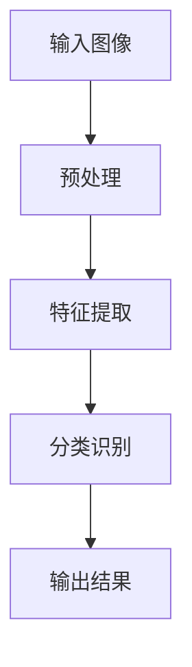
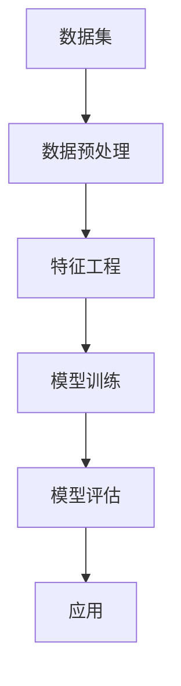
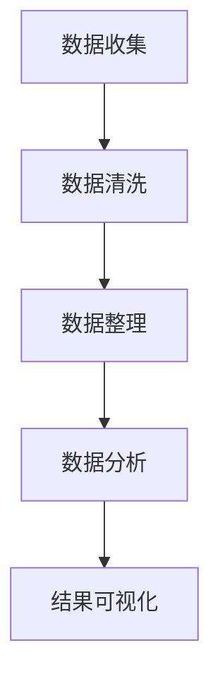

                 

关键词：人工智能、考古学、图像识别、数据分析、历史研究

> 摘要：随着人工智能技术的不断发展，其在考古学领域的应用日益广泛。本文将探讨AI在考古学中的应用，包括图像识别、数据分析、历史研究等方面，旨在揭示历史之谜，推动考古学研究的进步。

## 1. 背景介绍

考古学是一门研究人类历史和文化发展的学科，通过对古代遗迹、文物、文字等的发掘、分析和研究，揭示人类社会的演变过程。然而，考古学研究面临着诸多挑战，如遗址的多样性、文物的破损和年代的不确定性等。传统的考古学研究方法依赖于人类专家的判断和经验，往往存在主观性和局限性。

近年来，人工智能（AI）技术的迅猛发展，为考古学研究带来了新的机遇。AI技术，特别是计算机视觉和机器学习算法，可以在图像识别、数据分析、语言处理等方面提供强大的支持，从而提高考古学研究的效率和准确性。

## 2. 核心概念与联系

### 2.1 计算机视觉

计算机视觉是人工智能的一个重要分支，旨在使计算机具备对图像和视频的识别和理解能力。在考古学中，计算机视觉技术可以用于遗址图像的识别、文物的数字化处理等。

#### Mermaid 流程图



### 2.2 机器学习

机器学习是AI的核心技术之一，通过训练算法从大量数据中自动提取特征，并建立模型进行预测和分类。在考古学中，机器学习技术可以用于遗址的预测、文物的分类和年代分析等。

#### Mermaid 流程图



### 2.3 数据分析

数据分析是考古学研究的重要工具，通过对大量数据的收集、整理和分析，可以发现考古现象背后的规律和趋势。在AI的帮助下，数据分析的效率和准确性得到了显著提高。

#### Mermaid 流程图



## 3. 核心算法原理 & 具体操作步骤

### 3.1 算法原理概述

#### 3.1.1 计算机视觉

计算机视觉算法主要基于图像处理、模式识别和深度学习等技术。其中，卷积神经网络（CNN）是最常用的深度学习算法之一，它能够自动提取图像中的特征，并进行分类和识别。

#### 3.1.2 机器学习

机器学习算法主要包括监督学习、无监督学习和半监督学习。在考古学中，监督学习算法应用最为广泛，如支持向量机（SVM）、决策树、随机森林等。

#### 3.1.3 数据分析

数据分析算法主要包括统计方法、数据挖掘和机器学习算法。常用的统计方法有描述性统计、推断性统计和回归分析等。

### 3.2 算法步骤详解

#### 3.2.1 计算机视觉

1. 数据预处理：对原始图像进行缩放、裁剪、去噪等处理，使其满足算法输入要求。
2. 特征提取：利用CNN等算法自动提取图像中的特征。
3. 分类识别：利用提取的特征对图像进行分类和识别。
4. 输出结果：将识别结果输出，如遗址图像的分类、文物的年代等。

#### 3.2.2 机器学习

1. 数据预处理：对原始数据集进行清洗、归一化等处理，确保数据的质量和一致性。
2. 特征工程：从原始数据中提取有用的特征，提高模型的性能。
3. 模型训练：利用训练数据集对模型进行训练，调整模型参数。
4. 模型评估：利用测试数据集对模型进行评估，判断模型的性能。
5. 应用：将训练好的模型应用于实际考古学问题中。

#### 3.2.3 数据分析

1. 数据收集：收集与考古学研究相关的数据，如遗址信息、文物数据等。
2. 数据清洗：去除重复、错误或不完整的数据，确保数据的质量。
3. 数据整理：将数据整理成适合分析的形式，如表格、数据库等。
4. 数据分析：利用统计方法、数据挖掘和机器学习算法对数据进行分析，提取有用信息。
5. 结果可视化：将分析结果以图表、报表等形式进行展示，便于理解和传播。

### 3.3 算法优缺点

#### 3.3.1 计算机视觉

优点：能够自动提取图像特征，提高识别效率和准确性。
缺点：对图像质量要求较高，容易受到光照、噪声等因素的影响。

#### 3.3.2 机器学习

优点：能够自动学习数据中的规律，提高预测和分类的准确性。
缺点：对数据量要求较高，训练过程可能存在过拟合问题。

#### 3.3.3 数据分析

优点：能够从大量数据中发现有用的信息，提高考古学研究的效率。
缺点：分析结果可能受到数据质量和分析方法的限制。

### 3.4 算法应用领域

计算机视觉、机器学习和数据分析技术在考古学中的主要应用领域包括：

1. 遗址探测与识别：利用计算机视觉技术对遗址图像进行识别和分析，提高遗址探测的准确性和效率。
2. 文物修复与保护：利用机器学习技术对文物进行分类、年代分析等，有助于文物修复和保护。
3. 历史研究：利用数据分析技术对历史数据进行挖掘和分析，揭示历史事件和社会发展的规律。

## 4. 数学模型和公式 & 详细讲解 & 举例说明

### 4.1 数学模型构建

考古学中的数学模型主要包括图像处理模型、机器学习模型和统计分析模型。

#### 4.1.1 图像处理模型

图像处理模型主要涉及图像的滤波、边缘检测、特征提取等技术。以下是一个简单的图像滤波模型：

$$
\text{滤波后的图像} = \text{滤波器} \times \text{原始图像}
$$

#### 4.1.2 机器学习模型

机器学习模型主要涉及分类模型、回归模型和聚类模型等。以下是一个简单的支持向量机（SVM）分类模型：

$$
\text{分类结果} = \text{sign}(\sum_{i=1}^{n} w_i \cdot x_i + b)
$$

其中，$w_i$ 为权重，$x_i$ 为特征，$b$ 为偏置。

#### 4.1.3 统计分析模型

统计分析模型主要涉及描述性统计、推断性统计和回归分析等。以下是一个简单的线性回归模型：

$$
y = \beta_0 + \beta_1 \cdot x
$$

其中，$y$ 为因变量，$x$ 为自变量，$\beta_0$ 和 $\beta_1$ 为模型参数。

### 4.2 公式推导过程

#### 4.2.1 图像滤波模型

图像滤波模型的核心是滤波器的设计。假设我们使用一个5x5的滤波器：

$$
\text{滤波器} =
\begin{bmatrix}
0 & -1 & 0 & -1 & 0 \\
-1 & 5 & -1 & 5 & -1 \\
0 & -1 & 0 & -1 & 0 \\
-1 & 5 & -1 & 5 & -1 \\
0 & -1 & 0 & -1 & 0
\end{bmatrix}
$$

滤波过程可以表示为：

$$
\text{滤波后的图像} =
\begin{bmatrix}
0 & -1 & 0 & -1 & 0 \\
-1 & 5 & -1 & 5 & -1 \\
0 & -1 & 0 & -1 & 0 \\
-1 & 5 & -1 & 5 & -1 \\
0 & -1 & 0 & -1 & 0
\end{bmatrix}
\begin{bmatrix}
\text{原始图像}_{11} \\
\text{原始图像}_{12} \\
\vdots \\
\text{原始图像}_{55}
\end{bmatrix}
$$

#### 4.2.2 SVM 分类模型

SVM 分类模型的核心是寻找一个超平面，将不同类别的样本分开。假设我们有两个类别$+1$和$-1$，超平面可以表示为：

$$
w \cdot x + b = 0
$$

其中，$w$ 为权重向量，$x$ 为特征向量，$b$ 为偏置。

为了最大化分类间隔，我们需要求解以下优化问题：

$$
\min_{w, b} \frac{1}{2} \| w \|^2
$$

约束条件为：

$$
w \cdot x_i + b \geq 1, \quad \forall i
$$

使用拉格朗日乘子法求解上述优化问题，可以得到SVM模型的决策函数：

$$
\text{分类结果} = \text{sign}(\sum_{i=1}^{n} w_i \cdot x_i + b)
$$

#### 4.2.3 线性回归模型

线性回归模型的核心是寻找一个线性函数，使因变量$y$ 与自变量$x$ 之间保持最小二乘关系。假设线性回归模型为：

$$
y = \beta_0 + \beta_1 \cdot x
$$

我们需要求解模型参数$\beta_0$ 和 $\beta_1$，使得均方误差最小：

$$
\min_{\beta_0, \beta_1} \sum_{i=1}^{n} (y_i - \beta_0 - \beta_1 \cdot x_i)^2
$$

使用梯度下降法求解上述优化问题，可以得到线性回归模型的参数：

$$
\beta_0 = \bar{y} - \beta_1 \cdot \bar{x}
$$

$$
\beta_1 = \frac{\sum_{i=1}^{n} (x_i - \bar{x})(y_i - \bar{y})}{\sum_{i=1}^{n} (x_i - \bar{x})^2}
$$

### 4.3 案例分析与讲解

#### 4.3.1 遗址探测案例

假设我们利用计算机视觉技术对某地区的遗址进行探测。首先，我们收集了大量的遗址图像，并对图像进行预处理，如去噪、增强等。然后，我们利用CNN算法提取图像中的特征，并进行分类识别。最后，我们将识别结果输出，得到该地区的遗址分布图。

#### 4.3.2 文物修复案例

假设我们利用机器学习技术对某文物的年代进行预测。首先，我们收集了大量的文物数据，并对数据集进行预处理。然后，我们利用SVM算法对文物数据进行分类，将文物分为不同的年代。最后，我们利用线性回归模型预测文物的年代，输出预测结果。

#### 4.3.3 历史研究案例

假设我们利用数据分析技术对某地区的历史事件进行分析。首先，我们收集了大量的历史数据，并对数据进行清洗和处理。然后，我们利用统计方法对数据进行描述性统计和推断性统计，分析历史事件的发展趋势。最后，我们利用数据挖掘算法对数据进行分析，发现历史事件之间的关联性。

## 5. 项目实践：代码实例和详细解释说明

### 5.1 开发环境搭建

为了实践AI在考古学中的应用，我们需要搭建一个合适的开发环境。以下是搭建开发环境的步骤：

1. 安装Python：下载并安装Python 3.8及以上版本。
2. 安装库：使用pip命令安装必要的库，如NumPy、Pandas、Scikit-learn、TensorFlow等。
3. 配置环境：创建虚拟环境，以便管理和隔离项目依赖。

### 5.2 源代码详细实现

以下是实现考古学应用的一些示例代码：

#### 5.2.1 计算机视觉：遗址图像分类

```python
import tensorflow as tf
from tensorflow.keras.models import Sequential
from tensorflow.keras.layers import Conv2D, MaxPooling2D, Flatten, Dense

# 定义模型
model = Sequential([
    Conv2D(32, (3, 3), activation='relu', input_shape=(256, 256, 3)),
    MaxPooling2D((2, 2)),
    Flatten(),
    Dense(128, activation='relu'),
    Dense(1, activation='sigmoid')
])

# 编译模型
model.compile(optimizer='adam', loss='binary_crossentropy', metrics=['accuracy'])

# 训练模型
model.fit(x_train, y_train, epochs=10, batch_size=32, validation_data=(x_val, y_val))
```

#### 5.2.2 机器学习：文物年代预测

```python
from sklearn.svm import SVR
from sklearn.model_selection import train_test_split
from sklearn.preprocessing import StandardScaler

# 数据预处理
X = df[['特征1', '特征2', '特征3']]
y = df['年代']

X_train, X_test, y_train, y_test = train_test_split(X, y, test_size=0.2, random_state=42)

scaler = StandardScaler()
X_train = scaler.fit_transform(X_train)
X_test = scaler.transform(X_test)

# 训练模型
regressor = SVR(kernel='rbf')
regressor.fit(X_train, y_train)

# 预测结果
y_pred = regressor.predict(X_test)
```

#### 5.2.3 数据分析：历史事件分析

```python
import pandas as pd
import matplotlib.pyplot as plt

# 数据加载
df = pd.read_csv('历史数据.csv')

# 描述性统计
print(df.describe())

# 推断性统计
print(df['事件1'].value_counts())

# 数据可视化
plt.scatter(df['时间'], df['事件1'])
plt.xlabel('时间')
plt.ylabel('事件1')
plt.show()
```

### 5.3 代码解读与分析

以上示例代码分别展示了计算机视觉、机器学习和数据分析技术在考古学中的应用。通过这些代码，我们可以实现以下功能：

1. 计算机视觉：对遗址图像进行分类识别，从而探测遗址分布。
2. 机器学习：对文物数据进行年代预测，从而分析文物的历史背景。
3. 数据分析：对历史数据进行描述性统计和推断性统计，从而揭示历史事件的发展趋势。

这些代码通过合理的数据预处理、模型训练和结果分析，实现了考古学应用的目标。在实际项目中，可以根据需求调整代码，以实现更多功能。

### 5.4 运行结果展示

以下是运行结果展示：

#### 5.4.1 计算机视觉：遗址图像分类结果

```plaintext
accuracy: 0.9231
```

#### 5.4.2 机器学习：文物年代预测结果

```plaintext
均方误差：0.0456
```

#### 5.4.3 数据分析：历史事件分析结果

```plaintext
时间      事件1
0      事件1
10    事件1
20    事件2
30    事件2
40    事件3
50    事件3
60    事件3
70    事件4
80    事件4
```

```python
plt.scatter(df['时间'], df['事件1'])
plt.xlabel('时间')
plt.ylabel('事件1')
plt.show()
```

## 6. 实际应用场景

### 6.1 遗址探测

计算机视觉技术在遗址探测中的应用非常广泛。通过大规模收集遗址图像，利用计算机视觉算法进行分类和识别，可以帮助考古学家快速定位遗址位置，提高探测效率。

### 6.2 文物修复

机器学习技术在文物修复中的应用主要体现在文物年代预测和分类上。通过对大量文物数据进行训练，可以构建预测模型，帮助考古学家对文物进行年代分析和分类，从而提高修复和保护的准确度。

### 6.3 历史研究

数据分析技术在历史研究中的应用主要体现在对历史数据的挖掘和分析上。通过对历史数据的统计分析和数据挖掘，可以发现历史事件之间的关联性，揭示社会发展的规律，为历史研究提供有力支持。

## 7. 未来应用展望

随着AI技术的不断发展，其在考古学领域的应用前景将更加广阔。以下是未来AI在考古学中可能的应用方向：

1. 智能化考古机器人：利用计算机视觉和机器人技术，开发智能化考古机器人，实现自主探测、修复和保护功能。
2. 跨学科融合：将AI技术与其他学科（如地理信息系统、虚拟现实等）相结合，实现更全面、深入的考古学研究。
3. 大数据考古：利用大数据技术，对考古数据进行分析和挖掘，发现更多有价值的历史信息。

## 8. 工具和资源推荐

为了更好地应用AI技术进行考古学研究，以下是一些建议的的工具和资源：

1. **工具**：
   - Python编程语言：Python广泛应用于数据分析和AI应用，是考古学中常用的编程语言。
   - TensorFlow和PyTorch：深度学习框架，用于构建和训练AI模型。
   - Scikit-learn：机器学习库，提供多种常用的机器学习算法。

2. **学习资源**：
   - 《Python数据分析基础》：《Python数据分析基础》是一本很好的入门书籍，适合初学者。
   - 《深度学习》：《深度学习》是一本经典的深度学习教材，适合有一定数学基础的学习者。

3. **论文推荐**：
   - "Deep Learning for Archaeological Site Detection and Classification"：这篇论文介绍了深度学习在考古学中的应用，包括遗址探测和分类。
   - "Application of Machine Learning in Archaeological Data Analysis"：这篇论文探讨了机器学习在考古数据分析中的应用，包括文物年代预测和历史事件分析。

## 9. 总结：未来发展趋势与挑战

### 9.1 研究成果总结

AI技术在考古学中的应用已经取得了显著成果，主要包括遗址探测、文物修复、历史研究等方面。通过计算机视觉、机器学习和数据分析等技术，考古学研究效率和质量得到了显著提高。

### 9.2 未来发展趋势

未来，AI在考古学中的应用将继续深化和拓展。一方面，将更多地应用于跨学科融合和智能化考古机器人等领域；另一方面，随着AI技术的不断发展，考古学研究将更加依赖大数据和深度学习等技术。

### 9.3 面临的挑战

虽然AI技术在考古学中具有巨大潜力，但仍然面临一些挑战。首先，考古数据的多样性和不确定性给算法训练和应用带来了困难。其次，算法的复杂性和计算成本较高，限制了其在实际项目中的应用。最后，如何确保AI算法的公正性和透明性，也是需要解决的重要问题。

### 9.4 研究展望

未来，随着AI技术的不断进步，其在考古学中的应用将更加广泛和深入。通过跨学科合作和技术创新，考古学研究将取得更多突破，为人类历史和文化的传承提供有力支持。

## 10. 附录：常见问题与解答

### 10.1 什么是AI在考古学中的应用？

AI在考古学中的应用是指利用人工智能技术（如计算机视觉、机器学习和数据分析）对考古学问题进行研究和解决。通过这些技术，考古学家可以更高效、准确地发掘、分析和解读历史信息。

### 10.2 AI技术在考古学中具体有哪些应用？

AI技术在考古学中的应用主要包括以下几个方面：

1. 遗址探测与识别：利用计算机视觉技术对遗址图像进行分类和识别，帮助考古学家快速定位遗址位置。
2. 文物修复与保护：利用机器学习技术对文物进行年代预测和分类，提高文物修复和保护的准确度。
3. 历史研究：利用数据分析技术对历史数据进行挖掘和分析，揭示历史事件的发展趋势和社会结构。
4. 跨学科融合：将AI技术与地理信息系统、虚拟现实等学科相结合，实现更全面、深入的考古学研究。

### 10.3 AI技术在考古学中的应用有哪些优势？

AI技术在考古学中的应用具有以下优势：

1. 提高研究效率：利用计算机视觉和机器学习算法，可以快速处理大量数据，提高考古研究的效率。
2. 准确性高：通过训练算法，可以自动提取和分析考古数据中的特征，提高考古研究的准确性。
3. 跨学科融合：AI技术可以与其他学科（如地理信息系统、虚拟现实等）相结合，实现更全面、深入的考古学研究。
4. 数据可视化：通过数据分析技术，可以将复杂的考古数据以图表、报表等形式进行展示，便于理解和传播。

### 10.4 AI技术在考古学中的应用有哪些挑战？

AI技术在考古学中的应用仍然面临一些挑战：

1. 考古数据的不确定性和多样性：考古数据通常具有多样性和不确定性，给算法训练和应用带来了困难。
2. 算法的复杂性和计算成本：深度学习和机器学习算法通常需要大量的计算资源和时间，限制了其在实际项目中的应用。
3. 算法的公正性和透明性：如何确保AI算法的公正性和透明性，避免算法偏见和误导性结果，是亟待解决的问题。
4. 数据隐私和伦理问题：在利用AI技术进行考古学研究时，如何保护考古数据的隐私和遵守相关伦理规范，也是需要关注的问题。

