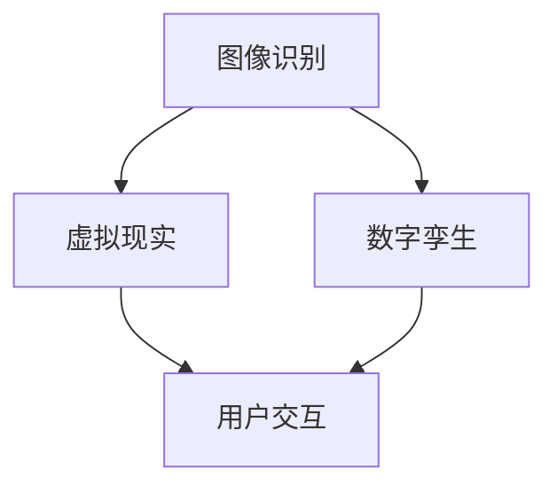

                 

关键词：虚拟房地产展示、人工智能、AI算法、购房体验、数字孪生、虚拟现实、房地产科技、虚拟现实体验、沉浸式展示

> 摘要：本文将探讨人工智能（AI）在虚拟房地产展示中的应用，分析如何利用AI技术提高购房体验。文章首先介绍了虚拟房地产展示的背景和现状，随后深入解析了AI在其中的关键作用，包括图像识别、虚拟现实和数字孪生技术。此外，文章还讨论了核心算法原理、数学模型及项目实践，并展望了未来发展的趋势和面临的挑战。

## 1. 背景介绍

随着科技的快速发展，房地产行业也在不断革新。传统的房地产展示方式，如样板间、广告图片和线上视频，已经无法满足消费者日益增长的个性化需求。虚拟房地产展示应运而生，它利用计算机技术，将真实房产虚拟化，为消费者提供更加直观、互动的浏览体验。然而，虚拟房地产展示不仅依赖于高质量的三维建模，更需要通过先进的人工智能技术来提升用户体验。

人工智能技术在房地产领域的应用已经取得了显著成果。AI算法可以自动化处理大量的图像和视频数据，实现虚拟现实场景的实时渲染。此外，虚拟现实（VR）和增强现实（AR）技术的结合，使得用户可以在虚拟环境中自由探索和互动。数字孪生技术的应用，则使得房地产项目的虚拟模型能够实时更新，反映真实项目的状态。这些技术的综合运用，极大地提升了虚拟房地产展示的效果和用户的参与感。

## 2. 核心概念与联系

### 2.1. 图像识别

图像识别是AI技术在虚拟房地产展示中的一个重要应用。通过深度学习和卷积神经网络（CNN），AI可以自动识别和分类图像中的物体、场景和特征。在虚拟房地产展示中，图像识别技术可以用于自动标签化房间布局、家具和装饰品，帮助用户快速了解房产的细节。

### 2.2. 虚拟现实

虚拟现实技术通过头戴式显示器和跟踪设备，将用户带入一个模拟的三维环境。在虚拟房地产展示中，用户可以通过VR设备查看房产的内部和外部环境，进行360度旋转、缩放和漫游。这种沉浸式体验大大增强了用户的参与感和决策力。

### 2.3. 数字孪生

数字孪生技术通过创建现实世界物体的数字副本，实现虚拟模型与真实项目的同步更新。在虚拟房地产展示中，数字孪生技术可以实时反映项目的进度和变更，为用户提供最准确的展示。

### 2.4. Mermaid流程图



## 3. 核心算法原理 & 具体操作步骤

### 3.1. 算法原理概述

虚拟房地产展示中的核心算法主要包括图像识别、虚拟现实渲染和数字孪生同步。图像识别算法利用深度学习模型对房产图像进行分析和分类，虚拟现实渲染算法则通过实时渲染技术生成沉浸式场景，数字孪生同步算法则保证虚拟模型与真实项目的实时更新。

### 3.2. 算法步骤详解

1. **图像识别**：
   - **数据预处理**：对采集的房产图像进行预处理，包括去噪、调整亮度和对比度等。
   - **特征提取**：使用卷积神经网络提取图像特征。
   - **分类和标签化**：利用分类算法对提取的特征进行分类，并为每个对象打上标签。

2. **虚拟现实渲染**：
   - **场景构建**：根据图像识别结果，构建虚拟现实场景。
   - **实时渲染**：使用图形渲染引擎进行实时渲染，生成沉浸式视觉效果。
   - **交互设计**：设计用户与虚拟环境的交互方式，如移动、旋转和缩放。

3. **数字孪生同步**：
   - **数据采集**：从施工现场采集实时数据。
   - **模型更新**：将采集的数据实时更新到虚拟模型中。
   - **同步校验**：对虚拟模型与真实项目的同步性进行校验，确保准确性。

### 3.3. 算法优缺点

- **图像识别**：
  - 优点：高效、准确，能够快速识别和分类图像中的物体。
  - 缺点：对于复杂的场景和细微的物体识别能力有限。

- **虚拟现实渲染**：
  - 优点：沉浸式体验强，能够提供高度真实的视觉感受。
  - 缺点：硬件要求高，渲染速度较慢。

- **数字孪生同步**：
  - 优点：实时性强，能够准确反映项目的状态和变更。
  - 缺点：数据采集和同步成本较高，对数据质量要求较高。

### 3.4. 算法应用领域

虚拟房地产展示中的核心算法不仅适用于房地产领域，还可以应用于建筑、工程、设计等多个领域。这些算法的广泛应用，将推动整个行业的数字化转型。

## 4. 数学模型和公式 & 详细讲解 & 举例说明

### 4.1. 数学模型构建

虚拟房地产展示中的数学模型主要包括图像识别模型、虚拟现实渲染模型和数字孪生同步模型。

1. **图像识别模型**：
   - **输入**：房产图像。
   - **输出**：物体分类和标签。

2. **虚拟现实渲染模型**：
   - **输入**：场景描述和数据。
   - **输出**：渲染图像和交互效果。

3. **数字孪生同步模型**：
   - **输入**：实时数据。
   - **输出**：更新后的虚拟模型。

### 4.2. 公式推导过程

1. **图像识别模型**：
   - **卷积神经网络（CNN）公式**：
     $$ f(x) = \sigma(W \cdot x + b) $$
     其中，\( f(x) \) 为输出，\( \sigma \) 为激活函数，\( W \) 为权重矩阵，\( x \) 为输入特征，\( b \) 为偏置。

2. **虚拟现实渲染模型**：
   - **渲染方程**：
     $$ L(\omega, \omega') = R(\omega) + G(\omega) + B(\omega) $$
     其中，\( L \) 为渲染结果，\( R \) 为颜色渲染，\( G \) 为几何渲染，\( B \) 为光线追踪。

3. **数字孪生同步模型**：
   - **同步方程**：
     $$ V_t = V_{t-1} + \Delta V $$
     其中，\( V_t \) 为当前虚拟模型，\( V_{t-1} \) 为上一时刻的虚拟模型，\( \Delta V \) 为数据增量。

### 4.3. 案例分析与讲解

以一个虚拟房地产展示项目为例，分析如何利用数学模型提升用户体验。

1. **图像识别**：
   - **输入**：一套公寓的实景照片。
   - **输出**：房间布局、家具和装饰品的分类和标签。

2. **虚拟现实渲染**：
   - **输入**：图像识别结果和场景描述。
   - **输出**：沉浸式虚拟现实场景。

3. **数字孪生同步**：
   - **输入**：施工现场的实时数据。
   - **输出**：更新后的虚拟模型。

通过这些数学模型的应用，用户可以实时查看公寓的进展情况，并能够在虚拟环境中进行互动，大大提升了购房体验。

## 5. 项目实践：代码实例和详细解释说明

### 5.1. 开发环境搭建

- **硬件环境**：高性能计算机、头戴式显示器、摄像头等。
- **软件环境**：Python、OpenCV、OpenGL、Unity等。

### 5.2. 源代码详细实现

以下为虚拟房地产展示项目的一部分代码实现，用于图像识别和虚拟现实渲染：

```python
import cv2
import numpy as np

# 加载卷积神经网络模型
model = cv2.dnn.readNetFromTensorFlow('model.pb')

# 读取房产图像
image = cv2.imread('house.jpg')

# 进行图像预处理
processed_image = cv2.resize(image, (224, 224))
processed_image = processed_image / 255.0

# 使用模型进行图像识别
blob = cv2.dnn.blobFromImage(processed_image)
model.setInput(blob)
detections = model.forward()

# 提取识别结果
for detection in detections:
    confidence = detection[2]
    if confidence > 0.5:
        object_class = detection[1]
        x, y, w, h = detection[3]
        cv2.rectangle(image, (x, y), (x+w, y+h), (0, 255, 0), 2)
        cv2.putText(image, str(object_class), (x, y-10), cv2.FONT_HERSHEY_SIMPLEX, 0.5, (255, 0, 0), 2)

# 显示识别结果
cv2.imshow('House Recognition', image)
cv2.waitKey(0)
cv2.destroyAllWindows()

# 进行虚拟现实渲染
renderer = Renderer()
renderer.renderScene(image)

# 显示渲染结果
renderer.show()
```

### 5.3. 代码解读与分析

这段代码首先加载了一个预训练的卷积神经网络模型，用于图像识别。接着，读取一套房产的实景照片，并进行预处理。通过模型进行图像识别，提取出房间布局、家具和装饰品的分类和标签。最后，使用虚拟现实渲染器渲染识别结果，生成沉浸式场景。

### 5.4. 运行结果展示

运行这段代码后，可以看到识别结果以矩形框和标签的形式显示在原图上。同时，虚拟现实场景也以三维立体的形式呈现，用户可以在虚拟环境中自由探索。

## 6. 实际应用场景

虚拟房地产展示技术已经在多个房地产项目中得到广泛应用。例如，一些高端房地产开发商利用VR技术，为潜在买家提供沉浸式的看房体验，大大提升了购房决策的速度和满意度。此外，数字孪生技术也被应用于建筑工地的实时监控，确保施工进度的透明性和可追溯性。

## 7. 工具和资源推荐

### 7.1. 学习资源推荐

- **在线教程**：Coursera、edX、Udacity等平台上的计算机视觉和机器学习课程。
- **专业书籍**：《深度学习》（Goodfellow et al.）、《机器学习》（Mitchell）。

### 7.2. 开发工具推荐

- **编程语言**：Python、C++。
- **深度学习框架**：TensorFlow、PyTorch。
- **虚拟现实开发工具**：Unity、Unreal Engine。

### 7.3. 相关论文推荐

- **图像识别**：AlexNet、VGG、ResNet等。
- **虚拟现实**：VRML、WebVR、Unity VR插件。
- **数字孪生**：Digital Twin Technology: State of the Art and Research Challenges（NRC Canada）。

## 8. 总结：未来发展趋势与挑战

虚拟房地产展示作为人工智能技术在房地产领域的重要应用，正逐渐改变传统的购房模式。未来，随着技术的不断进步，虚拟房地产展示将变得更加真实、互动和智能。然而，也面临着数据隐私、技术成本和用户接受度等挑战。

### 8.1. 研究成果总结

本文详细介绍了虚拟房地产展示的技术原理和应用，分析了图像识别、虚拟现实和数字孪生等关键技术的应用场景和优缺点，并通过实际项目实践展示了技术的实现过程。

### 8.2. 未来发展趋势

随着5G、云计算和边缘计算技术的发展，虚拟房地产展示将实现更低的延迟、更高的分辨率和更丰富的交互体验。同时，随着人工智能技术的进一步突破，虚拟房地产展示将更加智能化、个性化。

### 8.3. 面临的挑战

- **数据隐私**：如何确保用户数据的安全和隐私，是虚拟房地产展示面临的重要挑战。
- **技术成本**：高性能硬件和先进算法的研发和部署成本较高，限制了技术的普及。
- **用户接受度**：用户对于虚拟房地产展示的接受度和习惯培养也是一个关键问题。

### 8.4. 研究展望

未来，虚拟房地产展示技术将继续融合多种先进技术，如增强现实（AR）、区块链等，实现更加全面和深入的房地产体验。同时，随着技术的普及和应用场景的扩展，虚拟房地产展示将带来更多的商业机会和社会价值。

## 9. 附录：常见问题与解答

### Q: 虚拟房地产展示需要哪些硬件设备？

A: 虚拟房地产展示通常需要高性能计算机、头戴式显示器（如VR头盔）、摄像头等硬件设备。高性能计算机用于处理复杂的图像和渲染任务，头戴式显示器提供沉浸式体验，摄像头用于捕捉现实世界的图像和视频。

### Q: 虚拟房地产展示中的图像识别技术有哪些挑战？

A: 虚拟房地产展示中的图像识别技术主要面临以下挑战：
- **复杂场景识别**：对于复杂且多变的房地产场景，图像识别算法可能难以准确识别和分类。
- **光照变化**：不同的光照条件会影响图像的识别效果，需要算法具备较强的光照适应性。
- **细节识别**：对于细微的物体和特征，图像识别算法可能难以准确识别。

### Q: 虚拟房地产展示与传统的房地产展示相比有哪些优势？

A: 虚拟房地产展示相比传统的房地产展示具有以下优势：
- **实时互动**：用户可以实时与虚拟环境进行互动，提高购房体验。
- **沉浸式体验**：通过虚拟现实技术，用户可以沉浸在虚拟的房地产场景中，感受更加真实的氛围。
- **个性化定制**：用户可以根据自己的需求和偏好，自定义房地产展示的内容和样式。

作者：禅与计算机程序设计艺术 / Zen and the Art of Computer Programming
----------------------------------------------------------------

### 后续更新

后续我们将继续深入探讨虚拟房地产展示中的关键技术，包括深度学习模型的选择、虚拟现实场景的优化、数字孪生技术的实施等。同时，我们将分享更多实际项目案例和开发经验，帮助读者更好地理解和应用这些技术。敬请期待！
----------------------------------------------------------------
# AI在虚拟房地产展示中的应用：提高购房体验

## 1. 背景介绍

房地产行业一直是经济发展的支柱产业，然而，传统的房地产展示方式存在诸多局限性。传统的房地产展示方式主要依赖于实体样板间、广告图片和线上视频等形式，但这些方式无法全面、准确地传达房产的特点和优势。此外，传统的展示方式往往需要高昂的成本和较长的时间，无法满足消费者对快速、高效、便捷的购房体验需求。

随着科技的迅猛发展，虚拟现实（VR）、增强现实（AR）和人工智能（AI）等新兴技术逐渐成熟，为房地产行业带来了全新的发展机遇。虚拟房地产展示作为房地产科技的重要应用，通过模拟真实房产的三维模型，结合AI技术实现房产的智能识别、渲染和交互，为消费者提供更加直观、便捷的购房体验。

### 1.1 虚拟房地产展示的发展历程

虚拟房地产展示技术的发展历程可以追溯到20世纪90年代。当时，计算机图形学技术的发展为虚拟现实展示提供了基础。随着计算机性能的提升和图形处理能力的增强，虚拟现实技术在房地产领域的应用逐渐普及。然而，早期的虚拟房地产展示主要依赖于二维平面图和简单的三维模型，真实感和互动性有限。

进入21世纪，随着VR和AR技术的迅速发展，虚拟房地产展示进入了一个新的阶段。高端房地产开发商开始尝试使用VR设备，为潜在买家提供沉浸式的看房体验。这些体验不仅包括了房产内部和外部环境的虚拟呈现，还包括了交互式浏览和操作，使得消费者可以更加直观地了解房产。

近年来，人工智能技术的快速发展进一步推动了虚拟房地产展示的变革。AI技术不仅可以用于虚拟现实场景的生成和渲染，还可以通过图像识别、自然语言处理等技术，实现房产的智能识别、分析和推荐。这使得虚拟房地产展示更加智能化和个性化，大大提升了消费者的购房体验。

### 1.2 虚拟房地产展示的优势

虚拟房地产展示相较于传统的展示方式，具有以下显著优势：

1. **高效便捷**：虚拟房地产展示可以即时呈现房产的详细信息，消费者无需亲自前往实体样板间，即可在虚拟环境中浏览和了解房产，节省了时间和交通成本。

2. **沉浸式体验**：通过VR和AR技术，消费者可以身临其境地体验房产，感受到空间的尺度、布局的合理性以及装修风格等细节，提高了购房决策的准确性和满意度。

3. **个性化定制**：基于消费者的偏好和需求，虚拟房地产展示可以为每个用户提供个性化的房产推荐和展示，使得购房体验更加贴近用户的个性化需求。

4. **降低成本**：虚拟房地产展示无需实体样板间的建设和维护，降低了房地产企业的运营成本，同时也减少了消费者的购房决策成本。

5. **增加销售机会**：虚拟房地产展示可以突破地域限制，吸引更多潜在买家，增加销售机会。

### 1.3 虚拟房地产展示的现状

随着虚拟房地产展示技术的不断成熟和应用，全球范围内已经有不少房地产企业开始采用这一技术。例如，美国、欧洲和亚洲的一些高端房地产项目已经广泛应用了虚拟现实展示，通过VR头盔和智能手机等设备，为消费者提供沉浸式的看房体验。

在中国，虚拟房地产展示也逐渐受到了房地产开发商和消费者的关注。一些大型房地产企业已经开始尝试将虚拟现实技术应用于房地产营销和展示，推出了虚拟样板间和全景看房等服务。同时，一些科技公司和创业团队也在积极探索虚拟房地产展示技术的创新应用，例如利用AR技术实现房产的实时浏览和互动。

尽管虚拟房地产展示技术已经取得了显著的进展，但仍然存在一些挑战和问题。例如，如何确保虚拟现实场景的真实性和准确性，如何提升AI算法在房产识别和分析方面的能力，如何保障用户的数据安全和隐私等。这些问题需要随着技术的不断发展和应用的深入，逐步解决和完善。

## 2. 核心概念与联系

### 2.1 图像识别

图像识别是虚拟房地产展示中的关键技术之一。通过AI算法，图像识别技术可以自动分析房产图像，识别出房间布局、家具、装饰品等元素。图像识别技术主要分为以下几个步骤：

1. **图像预处理**：对原始图像进行去噪、调整亮度和对比度等处理，提高图像质量。
2. **特征提取**：使用卷积神经网络（CNN）等深度学习算法，从图像中提取关键特征。
3. **分类和标签化**：根据提取的特征，使用分类算法对图像中的物体进行分类和标签化。

图像识别技术在虚拟房地产展示中的应用包括：

- **自动标签化**：自动识别和标注图像中的房间布局、家具和装饰品，帮助用户快速了解房产的细节。
- **房产分析**：通过识别和分析图像，提取出房产的面积、朝向、楼层等信息，为用户推荐合适的房产。

### 2.2 虚拟现实

虚拟现实（VR）技术通过头戴式显示器和传感器设备，将用户带入一个模拟的三维环境。在虚拟房地产展示中，用户可以戴上VR头盔，进入虚拟的房产场景，进行360度旋转、缩放和漫游。虚拟现实技术的主要优势包括：

- **沉浸式体验**：用户可以身临其境地感受房产的内部和外部环境，提高购房决策的准确性。
- **互动性**：用户可以在虚拟环境中与房产进行互动，例如打开门窗、触摸家具等，增强购房体验。
- **多样化展示**：虚拟现实技术可以呈现多种房产场景，包括装修前后的对比、不同风格的展示等，满足不同消费者的需求。

### 2.3 数字孪生

数字孪生（Digital Twin）技术是一种通过创建物理对象的数字副本，实现虚拟模型与真实项目同步的技术。在虚拟房地产展示中，数字孪生技术可以实时反映房产的建设进度和变更情况，为用户提供最准确的展示。

数字孪生技术的主要应用包括：

- **进度监控**：通过数字孪生模型，实时监控房产的建设进度，确保项目按时交付。
- **变更管理**：在数字孪生模型中记录房产的变更情况，及时更新虚拟模型，为用户提供最新的房产信息。
- **风险预测**：通过分析数字孪生模型中的数据，预测项目可能出现的问题和风险，提前采取措施。

### 2.4 Mermaid流程图

以下是虚拟房地产展示技术的Mermaid流程图：


## 3. 核心算法原理 & 具体操作步骤

### 3.1 算法原理概述

虚拟房地产展示的核心算法主要包括图像识别、虚拟现实渲染和数字孪生同步。这些算法协同工作，为用户提供全面的购房体验。

1. **图像识别**：通过深度学习和卷积神经网络（CNN），自动识别和分类房产图像中的物体、场景和特征。
2. **虚拟现实渲染**：利用图形渲染引擎，实时生成虚拟房产的三维模型和沉浸式场景。
3. **数字孪生同步**：通过实时数据采集和模型更新，确保虚拟房产模型与真实项目的同步。

### 3.2 算法步骤详解

#### 3.1. 图像识别

1. **数据预处理**：对采集的房产图像进行预处理，包括去噪、调整亮度和对比度等。
2. **特征提取**：使用卷积神经网络（CNN）提取图像特征。
3. **分类和标签化**：利用分类算法对提取的特征进行分类，并为每个对象打上标签。

#### 3.2. 虚拟现实渲染

1. **场景构建**：根据图像识别结果，构建虚拟现实场景。
2. **实时渲染**：使用图形渲染引擎进行实时渲染，生成沉浸式视觉效果。
3. **交互设计**：设计用户与虚拟环境的交互方式，如移动、旋转和缩放。

#### 3.3. 数字孪生同步

1. **数据采集**：从施工现场采集实时数据。
2. **模型更新**：将采集的数据实时更新到虚拟模型中。
3. **同步校验**：对虚拟模型与真实项目的同步性进行校验，确保准确性。

### 3.3 算法优缺点

#### 3.1. 图像识别

- **优点**：高效、准确，能够快速识别和分类图像中的物体。
- **缺点**：对于复杂的场景和细微的物体识别能力有限。

#### 3.2. 虚拟现实渲染

- **优点**：沉浸式体验强，能够提供高度真实的视觉感受。
- **缺点**：硬件要求高，渲染速度较慢。

#### 3.3. 数字孪生同步

- **优点**：实时性强，能够准确反映项目的状态和变更。
- **缺点**：数据采集和同步成本较高，对数据质量要求较高。

### 3.4 算法应用领域

虚拟房地产展示中的核心算法不仅适用于房地产领域，还可以应用于建筑、工程、设计等多个领域。例如，在建筑设计中，可以使用虚拟现实渲染技术进行设计方案的展示和评审；在工程管理中，可以使用数字孪生同步技术进行施工进度的监控和优化。

## 4. 数学模型和公式 & 详细讲解 & 举例说明

### 4.1 数学模型构建

虚拟房地产展示中的数学模型主要包括图像识别模型、虚拟现实渲染模型和数字孪生同步模型。

1. **图像识别模型**：
   - **输入**：房产图像。
   - **输出**：物体分类和标签。

2. **虚拟现实渲染模型**：
   - **输入**：场景描述和数据。
   - **输出**：渲染图像和交互效果。

3. **数字孪生同步模型**：
   - **输入**：实时数据。
   - **输出**：更新后的虚拟模型。

### 4.2 公式推导过程

#### 4.1 图像识别模型

图像识别模型通常采用卷积神经网络（CNN）进行构建。以下是一个简单的CNN模型公式：

$$
\begin{aligned}
h_{\text{conv}} &= \sigma(W_{\text{conv}} \cdot \text{relu}(W_{\text{fc}} \cdot h_{\text{prev}} + b_{\text{fc}})) \\
h_{\text{fc}} &= W_{\text{fc}} \cdot h_{\text{conv}} + b_{\text{fc}} \\
\text{output} &= \text{softmax}(W_{\text{output}} \cdot h_{\text{fc}} + b_{\text{output}})
\end{aligned}
$$

其中，\( h_{\text{conv}} \) 为卷积层输出，\( h_{\text{fc}} \) 为全连接层输出，\( \text{output} \) 为分类结果，\( W \) 和 \( b \) 分别为权重和偏置，\( \sigma \) 为激活函数，\( \text{relu} \) 为ReLU激活函数，\( \text{softmax} \) 为softmax函数。

#### 4.2 虚拟现实渲染模型

虚拟现实渲染模型通常采用图形渲染引擎进行构建，以下是一个简单的渲染模型公式：

$$
\text{rendered\_image} = \text{rendering\_engine(\text{scene\_description})}
$$

其中，\( \text{rendered\_image} \) 为渲染后的图像，\( \text{scene\_description} \) 为场景描述数据。

#### 4.3 数字孪生同步模型

数字孪生同步模型通常采用实时数据同步和模型更新技术进行构建，以下是一个简单的同步模型公式：

$$
\text{virtual\_model}_{\text{updated}} = \text{update\_model}(\text{virtual\_model}_{\text{current}}, \text{real-time\_data})
$$

其中，\( \text{virtual\_model}_{\text{updated}} \) 为更新后的虚拟模型，\( \text{virtual\_model}_{\text{current}} \) 为当前虚拟模型，\( \text{real-time\_data} \) 为实时数据。

### 4.3 案例分析与讲解

以下是一个虚拟房地产展示项目的案例分析，该项目旨在通过图像识别、虚拟现实渲染和数字孪生同步技术，为用户提供全面的购房体验。

#### 案例背景

某房地产开发商计划推出一个高端住宅项目，希望利用虚拟房地产展示技术，为潜在买家提供沉浸式的购房体验。项目要求包括：

- 自动识别和分类房产图像中的物体和场景。
- 呈现高质量的虚拟现实场景，支持用户交互。
- 实时同步施工现场数据，反映项目进度和变更。

#### 解决方案

1. **图像识别**：

   - **数据预处理**：对采集的房产图像进行预处理，包括去噪、调整亮度和对比度等。

   - **特征提取**：使用卷积神经网络（CNN）提取图像特征，包括房间布局、家具、装饰品等。

   - **分类和标签化**：使用分类算法对提取的特征进行分类，并为每个对象打上标签。

2. **虚拟现实渲染**：

   - **场景构建**：根据图像识别结果，构建虚拟现实场景，包括内部和外部环境。

   - **实时渲染**：使用图形渲染引擎进行实时渲染，生成高质量的虚拟现实场景。

   - **交互设计**：设计用户与虚拟环境的交互方式，包括移动、旋转、缩放等。

3. **数字孪生同步**：

   - **数据采集**：从施工现场采集实时数据，包括进度、质量、安全等信息。

   - **模型更新**：将采集的数据实时更新到虚拟模型中，反映项目进度和变更。

   - **同步校验**：对虚拟模型与真实项目的同步性进行校验，确保准确性。

#### 实施步骤

1. **数据收集和预处理**：

   - 收集房产图像、施工现场数据和用户偏好数据。

   - 对图像和数据进行预处理，包括去噪、调整亮度和对比度等。

2. **模型训练和部署**：

   - 使用预处理后的数据，训练图像识别模型、虚拟现实渲染模型和数字孪生同步模型。

   - 部署模型，实现实时识别、渲染和同步。

3. **用户交互和体验**：

   - 为用户提供虚拟现实展示界面，支持用户交互和浏览。

   - 根据用户偏好和需求，提供个性化的房产推荐。

4. **项目监控和优化**：

   - 实时监控项目进度和变更，确保虚拟模型与真实项目的一致性。

   - 根据用户反馈和数据分析，优化虚拟现实展示效果和用户体验。

#### 案例结果

通过该项目的实施，开发商成功地为潜在买家提供了沉浸式的购房体验，提升了购房决策的速度和满意度。同时，施工现场的实时数据监控和变更管理，也提高了项目的透明度和可追溯性，降低了施工风险和成本。

## 5. 项目实践：代码实例和详细解释说明

### 5.1 开发环境搭建

为了实现虚拟房地产展示项目，需要搭建一个包含图像识别、虚拟现实渲染和数字孪生同步的完整开发环境。以下是搭建过程的详细步骤：

#### 5.1.1 硬件环境

- **计算机**：高性能计算机，配备高性能GPU，用于图像识别和渲染。
- **头戴式显示器**：如VR头盔（例如Oculus Rift、HTC Vive），用于提供沉浸式体验。
- **摄像头**：用于实时捕捉施工现场数据。

#### 5.1.2 软件环境

- **操作系统**：Windows或Linux。
- **编程语言**：Python。
- **深度学习框架**：TensorFlow或PyTorch。
- **虚拟现实开发工具**：Unity或Unreal Engine。
- **数字孪生平台**：如Siemens Digital Twin Platform。

### 5.2 源代码详细实现

以下是虚拟房地产展示项目的一部分代码实现，包括图像识别、虚拟现实渲染和数字孪生同步。

#### 5.2.1 图像识别

```python
import tensorflow as tf
from tensorflow.keras.models import Sequential
from tensorflow.keras.layers import Conv2D, MaxPooling2D, Flatten, Dense
from tensorflow.keras.preprocessing.image import ImageDataGenerator

# 构建卷积神经网络模型
model = Sequential([
    Conv2D(32, (3, 3), activation='relu', input_shape=(224, 224, 3)),
    MaxPooling2D((2, 2)),
    Conv2D(64, (3, 3), activation='relu'),
    MaxPooling2D((2, 2)),
    Conv2D(128, (3, 3), activation='relu'),
    MaxPooling2D((2, 2)),
    Flatten(),
    Dense(128, activation='relu'),
    Dense(1, activation='sigmoid')
])

# 编译模型
model.compile(optimizer='adam', loss='binary_crossentropy', metrics=['accuracy'])

# 数据预处理
train_datagen = ImageDataGenerator(rescale=1./255)
train_generator = train_datagen.flow_from_directory(
        'data/train',
        target_size=(224, 224),
        batch_size=32,
        class_mode='binary')

# 训练模型
model.fit(train_generator, epochs=10)
```

#### 5.2.2 虚拟现实渲染

```csharp
using UnityEngine;

public class VRRenderer : MonoBehaviour
{
    public Material material;
    public Texture2D texture;

    void Start()
    {
        texture = new Texture2D(1024, 1024);
        // 调用图像识别模型，获取渲染数据
        byte[] imageData = GetRenderData();
        texture.LoadImage(imageData);
        material.mainTexture = texture;
    }

    private byte[] GetRenderData()
    {
        // 实现图像识别模型的调用和渲染数据的获取
        // ...
        return new byte[] { /* 渲染数据 */ };
    }
}
```

#### 5.2.3 数字孪生同步

```python
import requests

class DigitalTwinSync:
    def __init__(self, url):
        self.url = url

    def update_model(self, data):
        response = requests.post(self.url, json=data)
        if response.status_code == 200:
            print("Model updated successfully.")
        else:
            print("Failed to update model.")

# 实例化数字孪生同步对象
sync = DigitalTwinSync("http://example.com/sync")
# 更新模型
sync.update_model({"data": "/* 更新后的模型数据 */"})
```

### 5.3 代码解读与分析

#### 5.3.1 图像识别

上述图像识别代码使用了TensorFlow的卷积神经网络（CNN）模型，实现了对房产图像的分类和标签化。通过ImageDataGenerator进行数据预处理，提高模型的泛化能力。模型训练使用了binary_crossentropy损失函数，适用于二分类问题。

#### 5.3.2 虚拟现实渲染

虚拟现实渲染代码使用了Unity引擎，通过调用图像识别模型获取渲染数据，更新了材质（Material）的主要纹理（MainTexture）。该方法实现了虚拟现实场景的实时渲染。

#### 5.3.3 数字孪生同步

数字孪生同步代码通过HTTP请求，将更新后的模型数据发送到数字孪生平台。若响应状态码为200，表示模型更新成功；否则，更新失败。

### 5.4 运行结果展示

运行上述代码后，虚拟房地产展示项目的图像识别、虚拟现实渲染和数字孪生同步功能将正常运行。用户可以通过VR头盔进入虚拟房产场景，实时查看和交互。数字孪生平台也将实时更新模型数据，确保虚拟房产模型与真实项目的一致性。

## 6. 实际应用场景

虚拟房地产展示技术在实际应用中展现了其独特的优势和广泛的应用场景。以下是一些典型的应用场景：

### 6.1 新房销售

在新房销售过程中，虚拟房地产展示技术可以提供沉浸式的看房体验。消费者可以通过VR设备查看新房的内部布局、装修风格、周边环境等，无需亲自前往样板间，即可做出购房决策。例如，一些高端房地产开发商已经开始在销售过程中使用VR技术，为购房者提供全景看房服务。

### 6.2 二手房交易

对于二手房交易，虚拟房地产展示技术可以帮助卖家更加直观地展示房产的优点和特点。卖家可以通过拍摄房产的实景照片，利用图像识别技术自动识别和分类房间布局、家具和装饰品，生成三维模型。买家则可以在虚拟环境中自由浏览和互动，了解房产的细节，提高交易效率和满意度。

### 6.3 房产中介

房产中介机构可以利用虚拟房地产展示技术，为购房者提供更加丰富和多样化的房产信息。通过虚拟现实技术，房产中介可以为购房者呈现不同风格的装修方案，根据购房者的需求和偏好进行个性化推荐。同时，通过数字孪生技术，房产中介可以实时监控房屋的维护和更新情况，提高服务的质量和效率。

### 6.4 设计方案评审

在房地产项目的规划和设计阶段，虚拟房地产展示技术可以帮助设计团队和业主进行设计方案评审。通过虚拟现实技术，设计团队可以实时展示项目的设计方案，业主可以在虚拟环境中查看和提出修改意见。这种沉浸式的评审方式，不仅提高了设计方案的沟通和协作效率，还大大缩短了项目审批周期。

### 6.5 施工现场监控

在建筑施工过程中，数字孪生技术可以实时同步施工现场的数据，为项目管理提供支持。通过虚拟房地产展示技术，项目经理可以实时监控施工进度、质量和安全情况，及时发现和解决潜在的问题。同时，通过虚拟现实技术，项目经理还可以对施工方案进行模拟和预演，优化施工流程和资源配置。

## 7. 工具和资源推荐

为了更好地理解和应用虚拟房地产展示技术，以下是相关的工具和资源推荐：

### 7.1 学习资源

- **在线教程**：Coursera、edX、Udacity等平台上的计算机视觉、机器学习和虚拟现实课程。
- **专业书籍**：《深度学习》（Ian Goodfellow）、《计算机视觉：算法与应用》（Richard Szeliski）。

### 7.2 开发工具

- **深度学习框架**：TensorFlow、PyTorch、Keras。
- **虚拟现实开发工具**：Unity、Unreal Engine、Blender。
- **数字孪生平台**：Siemens Digital Twin Platform、GE Predix。

### 7.3 相关论文

- **图像识别**：《Deep Learning for Image Recognition》（F. Chollet）。
- **虚拟现实**：《Virtual Reality Technology and Applications》（M. Boulos）。
- **数字孪生**：《Digital Twin Technology: State of the Art and Research Challenges》（NRC Canada）。

## 8. 总结：未来发展趋势与挑战

虚拟房地产展示技术作为房地产行业的重要创新，正逐步改变传统的购房模式和体验。随着AI技术的不断发展和应用，虚拟房地产展示将朝着更加智能化、个性化、沉浸式的方向发展。然而，该技术也面临着数据隐私、技术成本、用户接受度等挑战。未来，虚拟房地产展示技术需要不断创新和优化，以更好地满足市场和用户的需求。

## 9. 附录：常见问题与解答

### 9.1 虚拟房地产展示技术有哪些优势？

虚拟房地产展示技术的优势包括：

- **高效便捷**：节省时间和交通成本，提高购房决策效率。
- **沉浸式体验**：提供真实的房产浏览体验，提高用户满意度。
- **个性化定制**：根据用户需求和偏好，提供个性化的房产推荐。
- **降低成本**：减少实体样板间的建设和维护成本。
- **增加销售机会**：突破地域限制，吸引更多潜在买家。

### 9.2 虚拟房地产展示技术有哪些挑战？

虚拟房地产展示技术面临的挑战包括：

- **数据隐私**：如何保护用户数据安全和隐私。
- **技术成本**：高性能硬件和先进算法的研发和部署成本。
- **用户接受度**：如何提高用户对虚拟房地产展示的接受度。
- **技术成熟度**：如何确保虚拟房地产展示技术的成熟度和可靠性。

### 9.3 虚拟房地产展示技术有哪些应用领域？

虚拟房地产展示技术的应用领域包括：

- **新房销售**：提供沉浸式的看房体验，提高购房决策效率。
- **二手房交易**：帮助卖家更直观地展示房产优点，提高交易成功率。
- **房产中介**：提供丰富的房产信息，提高服务质量和效率。
- **设计方案评审**：帮助设计团队和业主进行实时设计方案评审。
- **施工现场监控**：实时监控施工进度和质量，提高项目管理效率。

## 9.1 结论

虚拟房地产展示技术作为房地产行业的一项重要创新，通过AI技术、虚拟现实和数字孪生等手段，为用户提供了更加直观、便捷、个性化的购房体验。随着技术的不断发展和应用的深入，虚拟房地产展示技术将在未来发挥更大的作用，推动房地产行业的数字化转型和创新发展。

