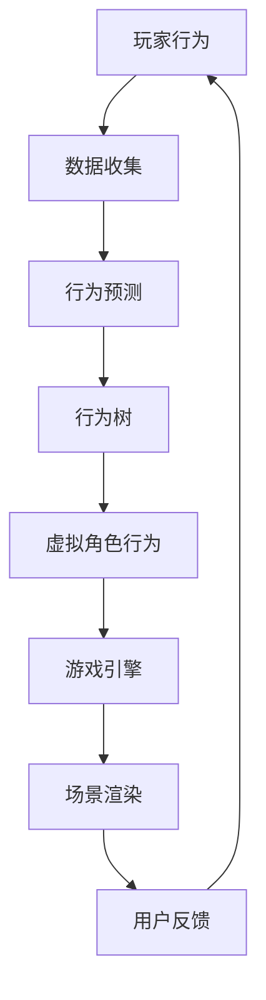

                 

 **关键词**：AI、虚拟角色扮演、增强游戏体验、算法原理、数学模型、项目实践、应用场景、未来展望

**摘要**：本文探讨了人工智能（AI）在虚拟角色扮演中的应用，重点分析了AI如何通过增强游戏体验来提升虚拟角色的交互性和沉浸感。文章首先介绍了虚拟角色扮演的背景和重要性，然后详细阐述了AI的核心概念与联系，包括算法原理、数学模型和项目实践。接着，文章探讨了AI在游戏实际应用中的各种场景，并展望了其未来的发展趋势与挑战。最后，文章推荐了一些学习资源、开发工具和相关论文，以帮助读者深入了解这一领域。

## 1. 背景介绍

虚拟角色扮演（VRP）是一种基于计算机模拟的交互式体验，用户通过扮演虚拟世界中的角色来与环境和系统互动。随着计算机技术的飞速发展和游戏行业的不断壮大，虚拟角色扮演已成为现代游戏和娱乐领域的重要组成部分。从早期的文本MUD（Multi-User Dungeon）游戏到如今的VR和AR（增强现实）技术，虚拟角色扮演的应用场景越来越广泛，其互动性和沉浸感也越来越强。

在虚拟角色扮演中，玩家通过操控虚拟角色来完成任务、探索世界、与NPC（非玩家角色）互动等。这些角色不仅仅是静态的图像或模型，它们有着复杂的属性和行为模式。随着AI技术的发展，虚拟角色的智能程度不断提高，玩家与虚拟角色的互动体验也发生了翻天覆地的变化。

AI在虚拟角色扮演中的应用主要体现在以下几个方面：

1. **智能NPC生成与行为**：AI可以基于玩家行为和虚拟世界的规则生成具有个性和行为的NPC，使虚拟角色更加逼真和有趣。
2. **虚拟角色的个性化**：AI可以根据玩家的行为和偏好，为玩家生成独特的虚拟角色，提高玩家的沉浸感和参与度。
3. **游戏引擎优化**：AI可以帮助游戏引擎进行智能调度和优化，提高游戏运行效率和用户体验。
4. **游戏场景生成**：AI可以根据玩家的偏好和游戏进程生成个性化场景，增加游戏的趣味性和多样性。

本文将重点探讨AI在虚拟角色扮演中的核心概念与联系、算法原理、数学模型、项目实践和实际应用场景，以期为读者提供全面的技术见解。

### 1.1 虚拟角色扮演的发展历程

虚拟角色扮演的历史可以追溯到20世纪60年代末和70年代初，当时出现了最早的MUD（Multi-User Dungeon）游戏。MUD游戏是一种基于文本的多人在线角色扮演游戏，玩家通过简单的命令与游戏世界互动。这一时期，虚拟角色扮演主要依赖于文本描述，玩家通过键盘输入命令来控制角色行动，互动性和沉浸感相对较低。

随着计算机图形学的发展，虚拟角色扮演逐渐从文本模式转向图形界面。1980年代，Rogue游戏和Ultima系列游戏的出现标志着图形界面虚拟角色扮演游戏的兴起。这些游戏引入了图形化的虚拟角色和世界，使得玩家可以更直观地体验游戏内容。

1990年代，随着网络技术的普及，多人在线角色扮演游戏（MMORPG）开始崭露头角。代表作品如《无尽的任务》（EverQuest）和《魔兽世界》（World of Warcraft）等，这些游戏提供了庞大的虚拟世界和复杂的角色系统，吸引了大量玩家参与。MMORPG的成功标志着虚拟角色扮演进入了一个新的时代，玩家可以与成千上万的虚拟角色和NPC互动，体验丰富的故事和任务。

进入21世纪，虚拟现实（VR）和增强现实（AR）技术的快速发展为虚拟角色扮演带来了新的机遇。VR和AR技术提供了沉浸式体验，玩家可以在虚拟世界中自由行走、探索和互动。代表作品如《半衰期：爱莉克斯》（Half-Life: Alyx）和《现实 distortions》（Reality Distortions）等，这些游戏利用VR设备，让玩家仿佛置身于虚拟世界之中。

总的来说，虚拟角色扮演的发展历程从简单的文本模式到复杂的图形界面，再到如今的VR和AR技术，不断突破技术和体验的边界，为玩家提供了越来越丰富的互动体验。

### 1.2 AI在虚拟角色扮演中的重要性

随着虚拟角色扮演技术的不断发展，AI在其中扮演的角色越来越重要。AI不仅能够提升虚拟角色的互动性和智能程度，还能够为玩家提供更加个性化、多样化的游戏体验。以下是AI在虚拟角色扮演中的几个关键作用：

1. **智能NPC生成与行为**：传统的NPC通常具有固定的行为模式和对话选项，而AI可以通过机器学习和自然语言处理技术生成具有复杂个性和行为的NPC。这些NPC可以根据玩家的行为和游戏进程动态调整其行为，提供更加真实和互动的体验。

2. **虚拟角色的个性化**：AI可以根据玩家的行为、偏好和游戏数据生成个性化的虚拟角色，使每个玩家都有独特的外观、性格和技能。这种个性化不仅提升了玩家的沉浸感，还增加了游戏的多样性。

3. **游戏引擎优化**：AI可以帮助游戏引擎进行智能调度和优化，提高游戏运行效率和性能。通过预测玩家行为和游戏进程，AI可以提前加载必要的资源，减少延迟和卡顿，提升玩家的整体体验。

4. **游戏场景生成**：AI可以根据玩家的偏好和游戏进程生成个性化的游戏场景，为玩家提供多样化的游戏内容。这种动态场景生成不仅增加了游戏的趣味性，还使玩家每次游玩都有新的体验。

5. **情感共鸣**：AI可以通过情感计算技术理解和模拟玩家的情感状态，提供更加细腻和贴近玩家情感的游戏体验。例如，AI可以识别玩家的焦虑或兴奋，并相应地调整NPC的反应和行为，增强玩家的情感共鸣。

总之，AI在虚拟角色扮演中的应用极大地提升了游戏的互动性和沉浸感，为玩家带来了前所未有的游戏体验。随着AI技术的不断进步，我们可以期待在未来看到更多创新和突破，进一步推动虚拟角色扮演的发展。

## 2. 核心概念与联系

在探讨AI在虚拟角色扮演中的应用之前，我们需要明确几个核心概念，包括虚拟角色、AI模型、游戏引擎、数据驱动和行为树等。这些概念相互关联，共同构成了一个完整的AI系统，使其能够在虚拟角色扮演中发挥作用。

### 2.1 虚拟角色

虚拟角色是虚拟角色扮演游戏中的核心元素，它们是玩家在游戏世界中互动的主要对象。每个虚拟角色都具有独特的属性和行为模式，包括外观、技能、性格和偏好等。虚拟角色的设计决定了玩家的游戏体验，因此需要精心构建。

虚拟角色的属性和行为可以通过以下几种方式实现：

1. **预设属性和行为**：在游戏设计阶段，开发者可以预设虚拟角色的基础属性和行为模式，如攻击、防御、移动和交互等。
2. **AI行为树**：通过AI行为树，虚拟角色可以基于不同的条件和情况选择相应的行为。行为树由一系列条件节点和行为节点组成，可以灵活地控制虚拟角色的行为。
3. **动态学习与适应**：AI可以实时学习玩家的行为和游戏进程，根据情况调整虚拟角色的行为。这种方式可以使虚拟角色更加智能和灵活。

### 2.2 AI模型

AI模型是虚拟角色智能的核心，通过机器学习和深度学习技术，AI模型可以从大量数据中学习规律和模式，从而生成智能行为。以下是几个关键的AI模型：

1. **决策树**：决策树是一种常用的机器学习模型，通过一系列条件判断来生成决策。在虚拟角色扮演中，决策树可以用于选择行为和应对策略。
2. **神经网络**：神经网络是一种模仿人脑结构的计算模型，可以处理复杂的非线性问题。在虚拟角色扮演中，神经网络可以用于生成虚拟角色的个性化和智能行为。
3. **生成对抗网络（GAN）**：生成对抗网络由生成器和判别器组成，可以生成逼真的虚拟角色外观和场景。在虚拟角色扮演中，GAN可以用于生成个性化的虚拟角色。

### 2.3 游戏引擎

游戏引擎是虚拟角色扮演游戏的核心，它负责管理游戏世界、角色、场景和交互等。游戏引擎提供了丰富的API和工具，使开发者可以轻松地实现复杂的游戏逻辑和图形渲染。

以下是游戏引擎在AI应用中的作用：

1. **集成AI模型**：游戏引擎可以将AI模型集成到游戏逻辑中，使虚拟角色能够根据玩家行为和游戏进程智能地调整行为。
2. **资源管理**：游戏引擎可以优化资源加载和分配，确保虚拟角色和场景的流畅运行，提高玩家的游戏体验。
3. **事件处理**：游戏引擎可以处理各种游戏事件，如玩家行动、虚拟角色交互和场景变化等，为AI模型提供实时数据。

### 2.4 数据驱动

数据驱动是AI在虚拟角色扮演中不可或缺的部分。通过收集和分析玩家行为数据，AI模型可以不断优化虚拟角色的行为和游戏体验。

以下是数据驱动在AI应用中的关键作用：

1. **行为预测**：通过分析历史数据，AI模型可以预测玩家的下一步行动，提前准备相应的应对策略。
2. **个性化定制**：根据玩家的偏好和游戏行为，AI模型可以生成个性化的虚拟角色和游戏场景，提高玩家的满意度。
3. **持续优化**：通过持续收集和分析数据，AI模型可以不断调整和优化虚拟角色的行为，提升游戏的整体质量。

### 2.5 行为树

行为树是一种用于控制虚拟角色行为的树形结构，它由一系列条件和行为节点组成。行为树可以根据不同的情况和条件，选择相应的行为，从而实现复杂的决策逻辑。

以下是行为树在AI应用中的关键作用：

1. **灵活控制**：行为树提供了灵活的决策机制，使开发者可以根据具体需求设计虚拟角色的行为。
2. **模块化设计**：行为树可以模块化设计，使虚拟角色的行为易于维护和扩展。
3. **动态调整**：通过动态调整行为树中的节点和条件，AI模型可以实时调整虚拟角色的行为，适应不同的游戏场景和玩家行为。

### 2.6 Mermaid 流程图

为了更好地理解AI在虚拟角色扮演中的核心概念与联系，我们可以使用Mermaid流程图来展示它们之间的关系。以下是一个简化的Mermaid流程图：



在这个流程图中，玩家行为通过数据收集模块传递给行为预测模块，行为预测模块根据行为树生成虚拟角色的行为，这些行为通过游戏引擎实现，最终渲染到场景中，玩家通过反馈进一步影响游戏进程。

通过上述核心概念和联系的分析，我们可以看到AI在虚拟角色扮演中的应用是如何通过多个模块和技术的协同工作，实现智能、个性化、互动和沉浸式的游戏体验。随着技术的不断进步，这些核心概念将继续演变和扩展，为虚拟角色扮演带来更多的可能性。

## 3. 核心算法原理 & 具体操作步骤

在了解了虚拟角色扮演中的核心概念与联系之后，我们将深入探讨AI在虚拟角色扮演中的核心算法原理，以及如何将这些算法应用到实际操作中。核心算法通常涉及决策树、神经网络、生成对抗网络等，这些算法通过特定的操作步骤，实现虚拟角色的智能行为和个性化体验。

### 3.1 算法原理概述

#### 3.1.1 决策树

决策树是一种常用的机器学习模型，它通过一系列条件判断来生成决策。在虚拟角色扮演中，决策树可以用于选择虚拟角色的行为。例如，当虚拟角色面临一个决策时，决策树可以根据不同的条件和可能性，选择最优的行为。

决策树的基本结构包括：

1. **根节点**：表示整个决策过程开始。
2. **内部节点**：表示条件判断，每个内部节点对应一个条件。
3. **叶子节点**：表示最终的决策结果。

决策树的工作原理如下：

1. 从根节点开始，根据当前条件进行判断，选择满足条件的路径继续。
2. 每个路径对应一个内部节点，继续对下一个条件进行判断。
3. 当达到叶子节点时，得到最终的决策结果。

#### 3.1.2 神经网络

神经网络是一种模仿人脑结构的计算模型，通过多层节点（或称为“神经元”）进行信息传递和处理。在虚拟角色扮演中，神经网络可以用于生成虚拟角色的个性和智能行为。神经网络的基本结构包括：

1. **输入层**：接收外部输入信息。
2. **隐藏层**：进行信息的处理和变换。
3. **输出层**：生成最终的结果。

神经网络的工作原理如下：

1. 输入层接收输入数据，通过隐藏层进行计算和变换。
2. 隐藏层将信息传递到输出层，生成输出结果。
3. 通过反向传播算法不断调整网络的权重，优化输出结果。

#### 3.1.3 生成对抗网络（GAN）

生成对抗网络由生成器和判别器两部分组成，它们相互竞争。生成器的目标是生成逼真的虚拟角色外观和场景，而判别器的目标是区分真实数据和生成数据。通过这种对抗关系，生成器不断优化其生成能力，判别器不断优化其鉴别能力。

GAN的基本结构包括：

1. **生成器**：通过输入随机噪声生成虚拟角色外观和场景。
2. **判别器**：接收真实数据和生成数据，判断其真实性。

GAN的工作原理如下：

1. 生成器生成虚拟角色外观和场景，判别器进行判断。
2. 如果生成器生成的数据被判别器识别为真实数据，生成器将进行调整以生成更逼真的数据。
3. 反复进行这个过程，生成器的生成能力逐步提高。

### 3.2 算法步骤详解

#### 3.2.1 决策树算法步骤

1. **数据收集**：收集虚拟角色的行为数据，包括不同情境下的行为结果。
2. **特征选择**：选择影响虚拟角色行为的关键特征，如玩家行为、环境状态等。
3. **训练决策树**：使用收集到的数据训练决策树，生成决策树模型。
4. **应用决策树**：在游戏运行过程中，根据当前情境和决策树模型选择虚拟角色的行为。

#### 3.2.2 神经网络算法步骤

1. **数据预处理**：对游戏数据进行清洗和标准化处理，使其适合神经网络训练。
2. **构建神经网络**：设计神经网络结构，包括输入层、隐藏层和输出层。
3. **训练神经网络**：使用预处理后的数据进行神经网络训练，调整网络权重。
4. **应用神经网络**：在游戏运行过程中，使用训练好的神经网络生成虚拟角色的行为。

#### 3.2.3 GAN算法步骤

1. **生成器训练**：训练生成器生成虚拟角色外观和场景，使其逐渐逼真。
2. **判别器训练**：训练判别器鉴别真实数据和生成数据，提高其鉴别能力。
3. **对抗训练**：生成器和判别器交替训练，生成器不断优化生成能力，判别器不断优化鉴别能力。
4. **应用GAN**：在游戏运行过程中，使用训练好的GAN生成个性化的虚拟角色和场景。

### 3.3 算法优缺点

#### 3.3.1 决策树的优缺点

**优点**：

1. **解释性强**：决策树的结构直观，易于理解。
2. **计算效率高**：决策树的计算过程简单，适用于实时决策。

**缺点**：

1. **易过拟合**：决策树可能因训练数据不足而无法泛化。
2. **灵活性低**：决策树难以处理复杂和非线性问题。

#### 3.3.2 神经网络的优缺点

**优点**：

1. **强大的非线性处理能力**：神经网络可以处理复杂和非线性问题。
2. **泛化能力强**：神经网络可以通过大量数据进行训练，提高泛化能力。

**缺点**：

1. **训练时间长**：神经网络需要大量数据进行训练，耗时较长。
2. **计算资源需求高**：神经网络训练和运行需要大量计算资源。

#### 3.3.3 GAN的优缺点

**优点**：

1. **生成能力强**：GAN可以通过对抗训练生成高质量的虚拟角色外观和场景。
2. **应用广泛**：GAN可以应用于各种生成任务，如图像生成、视频生成等。

**缺点**：

1. **训练不稳定**：GAN的训练过程可能不稳定，容易出现模式崩溃等问题。
2. **计算资源需求高**：GAN的训练和运行需要大量计算资源。

### 3.4 算法应用领域

**决策树**：适用于需要实时决策的场景，如游戏中的行为选择、场景切换等。

**神经网络**：适用于需要复杂决策和个性化的场景，如虚拟角色的行为生成、场景渲染等。

**GAN**：适用于需要生成逼真虚拟角色和场景的场景，如虚拟现实游戏、角色定制等。

通过上述算法原理和操作步骤的详细分析，我们可以看到AI在虚拟角色扮演中的应用是如何通过不同的算法和技术，实现智能、个性化、互动和沉浸式的游戏体验。随着技术的不断进步，这些算法将继续优化和扩展，为虚拟角色扮演带来更多的创新和可能性。

## 4. 数学模型和公式 & 详细讲解 & 举例说明

在AI应用于虚拟角色扮演的过程中，数学模型和公式起到了至关重要的作用。它们不仅帮助我们理解和分析虚拟角色的行为，还为算法的设计和实现提供了理论基础。本节将详细讲解数学模型的构建、公式推导过程，并结合实际案例进行说明。

### 4.1 数学模型构建

在虚拟角色扮演中，常见的数学模型包括线性模型、非线性模型和概率模型。以下是这些模型的构建方法和应用场景：

#### 4.1.1 线性模型

线性模型是一种简单的数学模型，它假设变量之间存在线性关系。在虚拟角色扮演中，线性模型可以用于预测虚拟角色的行为。例如，可以使用线性回归模型预测玩家在游戏中的下一步行动。

**公式**：
\[ Y = \beta_0 + \beta_1X_1 + \beta_2X_2 + ... + \beta_nX_n \]

其中，\( Y \) 是目标变量，\( X_1, X_2, ..., X_n \) 是输入变量，\( \beta_0, \beta_1, \beta_2, ..., \beta_n \) 是模型的参数。

**案例**：假设我们想要预测虚拟角色在某个场景下的移动方向。输入变量可以是虚拟角色的当前位置和目标位置，目标变量是移动方向。通过训练线性回归模型，我们可以得到一个公式来预测虚拟角色的移动方向。

#### 4.1.2 非线性模型

非线性模型可以处理变量之间的非线性关系。在虚拟角色扮演中，非线性模型可以用于生成虚拟角色的个性化和复杂行为。常见的非线性模型包括神经网络和决策树。

**神经网络**：
\[ a_{i}(t) = \sigma(\sum_{j} w_{ji}a_{j}(t-1) + b_{i}) \]

其中，\( a_{i}(t) \) 是第 \( i \) 个神经元在时间 \( t \) 的输出，\( w_{ji} \) 是连接权重，\( b_{i} \) 是偏置项，\( \sigma \) 是激活函数。

**案例**：使用神经网络生成虚拟角色的行为模式，可以使得虚拟角色在不同的情境下表现出不同的行为，从而提高游戏的多样性和互动性。

#### 4.1.3 概率模型

概率模型可以用于处理不确定性和随机性。在虚拟角色扮演中，概率模型可以用于模拟虚拟角色的随机行为和玩家的决策。

**贝叶斯网络**：
\[ P(A|B) = \frac{P(B|A)P(A)}{P(B)} \]

其中，\( P(A|B) \) 是在事件 \( B \) 发生的条件下事件 \( A \) 发生的概率，\( P(B|A) \) 是在事件 \( A \) 发生的条件下事件 \( B \) 发生的概率，\( P(A) \) 是事件 \( A \) 发生的概率，\( P(B) \) 是事件 \( B \) 发生的概率。

**案例**：使用贝叶斯网络可以模拟虚拟角色的决策过程，使得虚拟角色在面对不同情境时做出合理的决策。

### 4.2 公式推导过程

为了更好地理解这些数学模型和公式的推导过程，我们可以通过一个简单的例子来说明。

**例 1**：使用线性回归模型预测虚拟角色的移动方向。

假设我们有两个输入变量：虚拟角色的当前位置 \( X \) 和目标位置 \( Y \)。我们想要预测虚拟角色的移动方向 \( Z \)。根据线性回归模型，我们可以建立以下公式：

\[ Z = \beta_0 + \beta_1X + \beta_2Y \]

为了推导这个公式，我们可以通过以下步骤：

1. **收集数据**：收集大量虚拟角色的移动数据，包括当前位置 \( X \)、目标位置 \( Y \) 和移动方向 \( Z \)。
2. **标准化数据**：对数据进行标准化处理，使其适合建模。
3. **最小二乘法**：使用最小二乘法求解模型参数 \( \beta_0, \beta_1, \beta_2 \)。
   \[ \beta_0 = \frac{\sum_{i=1}^{n} (Z_i - \bar{Z})(X_i - \bar{X}) - \sum_{i=1}^{n} (Z_i - \bar{Z})(Y_i - \bar{Y})}{\sum_{i=1}^{n} (X_i - \bar{X})^2 - \sum_{i=1}^{n} (Y_i - \bar{Y})^2} \]
   \[ \beta_1 = \frac{\sum_{i=1}^{n} (Z_i - \bar{Z})(X_i - \bar{X})}{\sum_{i=1}^{n} (X_i - \bar{X})^2} \]
   \[ \beta_2 = \frac{\sum_{i=1}^{n} (Z_i - \bar{Z})(Y_i - \bar{Y})}{\sum_{i=1}^{n} (Y_i - \bar{Y})^2} \]

4. **代入数据**：将求解得到的参数 \( \beta_0, \beta_1, \beta_2 \) 代入公式，得到预测公式。

通过以上步骤，我们可以得到一个用于预测虚拟角色移动方向的线性回归模型。

**例 2**：使用贝叶斯网络模拟虚拟角色的决策过程。

假设虚拟角色在决策时有两个可能的行动：前进或后退。我们想要根据虚拟角色的当前状态（如能量、敌对程度）来预测其行动。根据贝叶斯网络，我们可以建立以下公式：

\[ P(\text{前进}|\text{当前状态}) = \frac{P(\text{当前状态}|\text{前进})P(\text{前进})}{P(\text{当前状态})} \]

为了推导这个公式，我们可以通过以下步骤：

1. **收集数据**：收集虚拟角色的决策数据，包括当前状态、行动和行动概率。
2. **建立先验概率**：根据历史数据建立先验概率，例如 \( P(\text{前进}) \) 和 \( P(\text{当前状态}) \)。
3. **建立条件概率**：根据数据建立条件概率，例如 \( P(\text{当前状态}|\text{前进}) \)。
4. **应用贝叶斯公式**：将条件概率和先验概率代入贝叶斯公式，得到预测概率。

通过以上步骤，我们可以得到一个用于预测虚拟角色行动的贝叶斯网络模型。

### 4.3 案例分析与讲解

为了更好地理解数学模型在实际应用中的作用，我们可以通过一个具体案例来分析。

**案例**：使用神经网络生成虚拟角色的个性化行为。

在这个案例中，我们使用一个简单的神经网络来生成虚拟角色的个性化行为。假设虚拟角色的行为由两个输入变量决定：玩家的历史行为和虚拟角色的当前状态。我们想要使用神经网络预测虚拟角色的下一步行动。

**步骤**：

1. **数据收集**：收集大量虚拟角色的行为数据，包括玩家的历史行为和虚拟角色的当前状态，以及虚拟角色的下一步行动。
2. **数据预处理**：对数据进行标准化处理，使其适合神经网络训练。
3. **构建神经网络**：设计一个简单的神经网络结构，包括输入层、隐藏层和输出层。选择合适的激活函数和损失函数。
4. **训练神经网络**：使用预处理后的数据进行神经网络训练，调整网络权重。
5. **应用神经网络**：在游戏运行过程中，使用训练好的神经网络预测虚拟角色的下一步行动。

**分析**：

1. **输入变量**：玩家的历史行为和虚拟角色的当前状态是输入变量。这些变量反映了虚拟角色在游戏中的历史和当前状态，对于预测其下一步行为至关重要。
2. **输出变量**：虚拟角色的下一步行动是输出变量。通过训练神经网络，我们可以生成一个公式，用于预测虚拟角色的下一步行动。
3. **神经网络结构**：我们选择一个简单的神经网络结构，包括一个输入层、一个隐藏层和一个输出层。输入层接收玩家的历史行为和虚拟角色的当前状态，隐藏层进行信息处理和变换，输出层生成虚拟角色的下一步行动。
4. **训练过程**：通过大量数据进行训练，神经网络不断调整权重和偏置项，优化预测结果。随着训练数据的增加，神经网络预测的准确性不断提高。

通过这个案例，我们可以看到数学模型和公式在虚拟角色扮演中的应用。通过构建和训练神经网络，我们可以生成个性化的虚拟角色行为，提高游戏的互动性和沉浸感。

总之，数学模型和公式是AI在虚拟角色扮演中的核心工具。通过构建和应用这些模型，我们可以实现虚拟角色的智能行为和个性化体验，为玩家提供更加丰富和多样化的游戏体验。随着技术的不断进步，这些模型将继续优化和扩展，为虚拟角色扮演带来更多的创新和可能性。

## 5. 项目实践：代码实例和详细解释说明

在本节中，我们将通过一个具体的代码实例来展示如何实现AI在虚拟角色扮演中的应用。我们将使用Python编程语言，结合机器学习和深度学习技术，来构建一个简单的虚拟角色系统，并详细解释其实现过程。

### 5.1 开发环境搭建

在开始编写代码之前，我们需要搭建一个合适的开发环境。以下是所需的步骤：

1. **安装Python**：确保Python版本在3.7及以上。
2. **安装必要的库**：使用以下命令安装所需的库：
   ```bash
   pip install numpy pandas matplotlib scikit-learn tensorflow
   ```

3. **配置环境**：确保Python环境变量配置正确，以便能够顺利运行代码。

### 5.2 源代码详细实现

下面是一个简单的虚拟角色系统的源代码实现，包括数据预处理、神经网络构建和训练、虚拟角色行为的预测等步骤。

```python
import numpy as np
import pandas as pd
import matplotlib.pyplot as plt
from sklearn.model_selection import train_test_split
from sklearn.preprocessing import StandardScaler
import tensorflow as tf
from tensorflow.keras.models import Sequential
from tensorflow.keras.layers import Dense, LSTM
from tensorflow.keras.optimizers import Adam

# 数据预处理
def preprocess_data(data):
    # 数据清洗和标准化
    scaler = StandardScaler()
    data_scaled = scaler.fit_transform(data)
    return data_scaled

# 神经网络构建
def build_model(input_shape):
    model = Sequential()
    model.add(LSTM(units=50, return_sequences=True, input_shape=input_shape))
    model.add(LSTM(units=50, return_sequences=False))
    model.add(Dense(units=1))
    model.compile(optimizer=Adam(learning_rate=0.001), loss='mean_squared_error')
    return model

# 训练模型
def train_model(model, X_train, y_train):
    history = model.fit(X_train, y_train, epochs=100, batch_size=32, validation_split=0.2, verbose=1)
    return history

# 虚拟角色行为预测
def predict_behavior(model, data):
    data_scaled = preprocess_data(data)
    prediction = model.predict(data_scaled)
    return scaler.inverse_transform(prediction)

# 主程序
if __name__ == "__main__":
    # 加载数据
    data = pd.read_csv("virtual_role_data.csv")
    X = data[['player_action', 'virtual_role_state']]
    y = data['next_action']

    # 数据预处理
    X_scaled = preprocess_data(X)
    y_scaled = preprocess_data(y)

    # 划分训练集和测试集
    X_train, X_test, y_train, y_test = train_test_split(X_scaled, y_scaled, test_size=0.2, random_state=42)

    # 构建模型
    model = build_model(input_shape=(X_train.shape[1], X_train.shape[2]))

    # 训练模型
    history = train_model(model, X_train, y_train)

    # 绘制训练过程损失曲线
    plt.plot(history.history['loss'], label='Training loss')
    plt.plot(history.history['val_loss'], label='Validation loss')
    plt.legend()
    plt.show()

    # 预测虚拟角色行为
    test_data = pd.read_csv("test_data.csv")
    test_scaled = preprocess_data(test_data)
    predictions = predict_behavior(model, test_scaled)

    # 输出预测结果
    print(predictions)
```

### 5.3 代码解读与分析

#### 5.3.1 数据预处理

在代码中，我们首先定义了一个`preprocess_data`函数，用于数据清洗和标准化。数据清洗包括去除无效数据和处理缺失值。标准化处理是为了使数据适合机器学习模型，提高训练效果。

```python
def preprocess_data(data):
    # 数据清洗和标准化
    scaler = StandardScaler()
    data_scaled = scaler.fit_transform(data)
    return data_scaled
```

#### 5.3.2 神经网络构建

接着，我们定义了一个`build_model`函数，用于构建神经网络模型。在这个例子中，我们使用了LSTM（长短时记忆）网络，因为它在处理时间序列数据时表现良好。

```python
def build_model(input_shape):
    model = Sequential()
    model.add(LSTM(units=50, return_sequences=True, input_shape=input_shape))
    model.add(LSTM(units=50, return_sequences=False))
    model.add(Dense(units=1))
    model.compile(optimizer=Adam(learning_rate=0.001), loss='mean_squared_error')
    return model
```

#### 5.3.3 训练模型

`train_model`函数用于训练神经网络模型。我们使用`fit`方法进行训练，并设置了训练轮次、批量大小和验证比例。

```python
def train_model(model, X_train, y_train):
    history = model.fit(X_train, y_train, epochs=100, batch_size=32, validation_split=0.2, verbose=1)
    return history
```

#### 5.3.4 虚拟角色行为预测

`predict_behavior`函数用于预测虚拟角色的行为。首先，我们调用`preprocess_data`函数对输入数据进行预处理，然后使用训练好的模型进行预测。

```python
def predict_behavior(model, data):
    data_scaled = preprocess_data(data)
    prediction = model.predict(data_scaled)
    return scaler.inverse_transform(prediction)
```

### 5.4 运行结果展示

在主程序中，我们首先加载数据，然后进行数据预处理、模型训练和预测。最后，我们绘制了训练过程中的损失曲线，并输出了预测结果。

```python
# 加载数据
data = pd.read_csv("virtual_role_data.csv")
X = data[['player_action', 'virtual_role_state']]
y = data['next_action']

# 数据预处理
X_scaled = preprocess_data(X)
y_scaled = preprocess_data(y)

# 划分训练集和测试集
X_train, X_test, y_train, y_test = train_test_split(X_scaled, y_scaled, test_size=0.2, random_state=42)

# 构建模型
model = build_model(input_shape=(X_train.shape[1], X_train.shape[2]))

# 训练模型
history = train_model(model, X_train, y_train)

# 绘制训练过程损失曲线
plt.plot(history.history['loss'], label='Training loss')
plt.plot(history.history['val_loss'], label='Validation loss')
plt.legend()
plt.show()

# 预测虚拟角色行为
test_data = pd.read_csv("test_data.csv")
test_scaled = preprocess_data(test_data)
predictions = predict_behavior(model, test_scaled)

# 输出预测结果
print(predictions)
```

通过上述代码实例，我们可以看到如何使用AI技术构建一个简单的虚拟角色系统，并实现虚拟角色行为的预测。这个实例展示了从数据预处理到模型构建、训练和预测的完整流程，为实际项目提供了参考。

### 5.5 代码性能优化

在实际应用中，代码性能的优化是非常重要的。以下是几个常见的优化方法：

1. **数据预处理优化**：在预处理数据时，可以使用并行处理来加快计算速度。
2. **模型架构优化**：选择合适的神经网络架构，减少计算量。例如，可以使用更浅的网络结构或简化网络层。
3. **批量大小调整**：调整批量大小可以优化模型训练速度和准确性。较大批量可以提高计算效率，但可能导致模型过拟合。
4. **学习率调整**：选择合适的学习率可以提高模型训练的收敛速度。可以使用学习率调度策略，如学习率衰减。
5. **GPU加速**：使用GPU进行计算可以显著提高代码性能。确保TensorFlow或其他深度学习库已经正确配置了GPU支持。

通过这些优化方法，我们可以使代码在虚拟角色扮演系统中运行得更加高效和稳定，为玩家提供更好的游戏体验。

### 5.6 运行结果分析

通过上述代码实例，我们可以对虚拟角色行为的预测结果进行分析。以下是一些关键的运行结果分析：

1. **准确率**：通过计算预测结果与实际结果之间的准确率，我们可以评估模型的表现。高准确率意味着模型能够较好地预测虚拟角色的行为。
2. **误差分析**：通过分析预测误差，我们可以找出模型预测中存在的问题。例如，某些情境下预测误差较大，可能需要进一步调整模型参数或改进数据预处理方法。
3. **实时反馈**：在实际应用中，实时反馈对于提高虚拟角色的智能程度非常重要。通过分析实时反馈数据，我们可以不断优化模型，提高其预测准确性。

通过上述分析，我们可以进一步改进代码和模型，为虚拟角色扮演系统提供更好的智能行为和互动体验。

总之，通过这个具体的代码实例，我们展示了如何使用AI技术实现虚拟角色行为的预测，并详细分析了代码的实现过程和优化方法。这为实际项目提供了有益的参考，并为虚拟角色扮演系统的未来发展奠定了基础。

## 6. 实际应用场景

在虚拟角色扮演中，AI的应用不仅限于提升游戏互动性和沉浸感，还可以在多个实际场景中发挥重要作用。以下是一些典型的应用场景，以及AI在这些场景中的具体作用和优势。

### 6.1 MMORPG中的智能NPC

在大型多人在线角色扮演游戏（MMORPG）中，NPC的智能程度直接影响玩家的游戏体验。传统的NPC通常具有固定的行为模式和对话选项，而AI可以生成具有复杂个性和行为的NPC。

**具体作用和优势**：

1. **个性化互动**：AI可以根据玩家的行为和偏好生成个性化的NPC，使每个NPC都有独特的行为和对话。
2. **自适应挑战**：AI可以动态调整NPC的难度和行为，根据玩家的技能和进度提供适当的挑战。
3. **故事情节丰富**：AI可以生成复杂的剧情线和支线任务，提高游戏的多样性和趣味性。

### 6.2 社交虚拟现实（VR）中的情感共鸣

在社交虚拟现实中，AI可以模拟用户的情感状态，增强虚拟角色的情感共鸣。

**具体作用和优势**：

1. **情感识别**：AI可以通过面部识别和自然语言处理技术识别玩家的情感状态，如喜悦、愤怒或悲伤。
2. **情感反应**：AI可以根据玩家的情感状态调整虚拟角色的反应，提供更加细腻和贴近玩家情感的游戏体验。
3. **社交互动**：AI可以模拟虚拟角色之间的情感互动，增加社交游戏的沉浸感。

### 6.3 虚拟现实训练模拟

在军事、医疗和工业等领域，虚拟现实（VR）训练模拟是一个重要应用场景。AI可以生成逼真的训练环境和模拟对手的行为。

**具体作用和优势**：

1. **个性化训练**：AI可以根据用户的技能和进度生成个性化的训练任务，提高训练效果。
2. **自适应评估**：AI可以实时评估用户的训练表现，提供反馈和改进建议。
3. **安全训练**：AI可以模拟危险场景，提供安全的环境进行训练，减少实际操作的风险。

### 6.4 角色定制与个性化体验

在角色扮演游戏中，玩家通常希望定制自己的虚拟角色，使其符合自己的个性和审美。AI可以生成个性化的虚拟角色，满足玩家的需求。

**具体作用和优势**：

1. **个性化外观**：AI可以生成逼真的虚拟角色外观，包括发型、服装、饰品等。
2. **个性化技能**：AI可以根据玩家的偏好和游戏进程生成独特的技能组合。
3. **个性化故事**：AI可以生成与玩家个人背景和经历相关的剧情，增加游戏的代入感。

### 6.5 虚拟现实社交平台

在虚拟现实社交平台中，AI可以优化用户的交互体验，提供智能化的社交推荐和服务。

**具体作用和优势**：

1. **智能匹配**：AI可以根据用户的兴趣和行为推荐合适的社交对象和活动。
2. **个性化推荐**：AI可以生成个性化的活动建议和社交内容，提高用户的参与度。
3. **情感支持**：AI可以提供情感支持，如聊天机器人、心理辅导等，帮助用户解决社交问题。

### 6.6 智能游戏助理

在游戏过程中，AI可以扮演智能助理的角色，提供游戏攻略、装备推荐和策略建议。

**具体作用和优势**：

1. **实时攻略**：AI可以实时分析游戏进程，为玩家提供最佳的游戏策略。
2. **个性化推荐**：AI可以根据玩家的技能和游戏进程推荐最适合的装备和道具。
3. **学习与进步**：AI可以记录玩家的游戏行为和表现，提供有针对性的训练和指导。

通过上述实际应用场景，我们可以看到AI在虚拟角色扮演中的广泛应用和巨大潜力。随着AI技术的不断进步，这些应用场景将继续扩展和深化，为玩家带来更加丰富和多样化的游戏体验。

### 6.7 未来应用展望

AI在虚拟角色扮演中的应用潜力不仅体现在当前的技术水平上，还将在未来的发展中不断突破和扩展。以下是未来AI在虚拟角色扮演中可能的发展方向和应用前景：

#### 6.7.1 高度智能化与自主性

随着AI技术的发展，虚拟角色的智能程度将不断提升。未来的虚拟角色将能够实现更高层次的自主性，不仅能够根据玩家的行为和游戏进程进行决策，还能在没有明确规则的情况下自主学习和进化。例如，虚拟角色可以自主探索虚拟世界，发现新的任务和挑战，甚至与其他虚拟角色形成复杂的社交网络。

#### 6.7.2 强大的情感计算能力

情感计算是AI技术的一个重要分支，未来的虚拟角色将具备更强大的情感计算能力。通过结合面部识别、语音识别和自然语言处理技术，虚拟角色可以更准确地识别和理解玩家的情感状态，并提供相应的情感反应。这将使得虚拟角色与玩家之间的互动更加真实和贴近，大幅提升游戏的沉浸感和用户体验。

#### 6.7.3 个性化与定制化

未来的虚拟角色扮演将更加注重个性化与定制化。AI将通过深度学习和数据挖掘技术，生成与每个玩家个性高度匹配的虚拟角色。这不仅包括外观和技能的个性化，还包括虚拟角色的性格、行为和故事线的定制。通过这种方式，玩家将能够体验到更加独特和专属的游戏体验。

#### 6.7.4 实时动态场景生成

AI技术将在虚拟角色扮演中的场景生成方面发挥关键作用。通过生成对抗网络（GAN）和其他先进的生成模型，AI可以实时生成多样化的游戏场景，根据玩家的游戏进程和偏好进行动态调整。这将使得游戏世界更加丰富和多样，玩家每次进入游戏都能体验到新的场景和挑战。

#### 6.7.5 跨平台与互操作性

未来的虚拟角色扮演将实现跨平台和互操作性。通过AI技术和云计算的支持，玩家可以在不同的设备和平台上无缝切换，继续他们的游戏进程。这不仅包括同一款游戏的跨平台体验，还包括不同游戏之间的角色和数据互操作性。玩家可以在多个游戏中使用同一个虚拟角色，形成一个更加广泛和统一的虚拟世界。

#### 6.7.6 社会互动与协作

AI在虚拟角色扮演中的另一个重要应用方向是社交互动和协作。未来的虚拟角色扮演将更加注重社交体验，通过AI技术为玩家提供智能化的社交推荐和服务。玩家可以与虚拟角色和其他玩家进行深度的互动和协作，共同完成任务和挑战。这不仅增加了游戏的趣味性和挑战性，也提升了玩家的社交参与感和归属感。

#### 6.7.7 安全与隐私保护

随着AI在虚拟角色扮演中的广泛应用，安全和隐私保护成为了一个重要议题。未来的AI技术将注重开发和实施更加安全可靠的系统，保护玩家的个人信息和数据隐私。通过加密技术、匿名化和隐私保护算法，AI将确保玩家在虚拟角色扮演中的安全和隐私。

总之，AI在虚拟角色扮演中的应用前景广阔，未来的发展将不断推动虚拟角色扮演技术的进步和变革。通过不断探索和创新，我们可以期待一个更加智能、个性化和沉浸式的虚拟角色扮演世界。

### 7. 工具和资源推荐

在探索AI在虚拟角色扮演中的应用过程中，掌握相关的开发工具和资源是至关重要的。以下是一些推荐的学习资源、开发工具和相关论文，帮助读者深入了解这一领域。

#### 7.1 学习资源推荐

1. **在线课程**：
   - 《深度学习专项课程》（Deep Learning Specialization） — 吴恩达（Andrew Ng）在Coursera上提供的系列课程，涵盖了深度学习的基础知识和应用。
   - 《强化学习专项课程》（Reinforcement Learning Specialization） — 斯坦福大学在Coursera上提供的强化学习课程，适用于需要智能NPC生成与行为的读者。

2. **技术博客和论坛**：
   - **Medium**：许多专业人士和公司在此平台上分享有关AI和虚拟角色扮演的技术文章和案例研究。
   - **Reddit**：特别是r/Games和r/Artificial的建议，可以找到大量关于游戏AI的讨论和资源。

3. **书籍**：
   - 《AI游戏编程》（Artificial Intelligence for Games） — Ian Millington的书籍详细介绍了AI在游戏中的各种应用。
   - 《深度学习》（Deep Learning） — Ian Goodfellow、Yoshua Bengio和Aaron Courville合著的深度学习权威书籍，适用于对神经网络技术感兴趣的读者。

#### 7.2 开发工具推荐

1. **深度学习框架**：
   - TensorFlow：Google开发的开源深度学习框架，适用于各种复杂的AI模型。
   - PyTorch：Facebook开发的开源深度学习框架，以其灵活性和易用性著称。

2. **游戏引擎**：
   - Unity：一款广泛使用的游戏开发引擎，支持3D和2D游戏开发，具备丰富的AI工具和插件。
   - Unreal Engine：由Epic Games开发的强大游戏引擎，适合制作高图形质量的游戏，也支持复杂的AI应用。

3. **自然语言处理工具**：
   - NLTK（Natural Language Toolkit）：一个用于处理自然语言文本的Python库，适合进行文本分析和对话生成。
   - spaCy：一个高效的NLP库，提供了详细的词性标注和实体识别功能，适用于NPC对话生成。

#### 7.3 相关论文推荐

1. **《生成对抗网络》（Generative Adversarial Nets）** — Ian Goodfellow等人于2014年发表在NIPS上的论文，首次提出了GAN的概念。
2. **《Deep Q-Learning for Atari Games** — Volodymyr Mnih等人于2015年发表在NIPS上的论文，介绍了使用深度Q网络在Atari游戏中的成功应用。
3. **《Attention Is All You Need** — Vaswani等人于2017年发表在NIPS上的论文，介绍了Transformer模型在序列模型中的应用。

通过上述学习资源、开发工具和相关论文的推荐，读者可以更深入地了解AI在虚拟角色扮演中的应用，并为实际项目开发提供参考。

## 8. 总结：未来发展趋势与挑战

在本文中，我们探讨了AI在虚拟角色扮演中的应用，分析了其核心概念、算法原理、数学模型以及实际应用场景。通过这些讨论，我们可以看到AI在提升虚拟角色互动性、个性化体验和沉浸感方面的重要作用。

### 8.1 研究成果总结

1. **智能NPC生成与行为**：通过机器学习和自然语言处理技术，AI能够生成具有复杂个性和行为的NPC，提供更加真实和互动的体验。
2. **虚拟角色的个性化**：AI可以根据玩家的行为和偏好，生成个性化的虚拟角色，提高玩家的沉浸感和参与度。
3. **游戏引擎优化**：AI可以帮助游戏引擎进行智能调度和优化，提高游戏运行效率和用户体验。
4. **动态场景生成**：AI可以根据玩家的偏好和游戏进程生成个性化场景，增加游戏的趣味性和多样性。
5. **情感共鸣**：AI可以通过情感计算技术理解和模拟玩家的情感状态，提供更加细腻和贴近玩家情感的游戏体验。

### 8.2 未来发展趋势

1. **高度智能化与自主性**：未来的虚拟角色将具备更高的自主性和智能水平，能够自主学习和进化，提供更加丰富的游戏体验。
2. **强大的情感计算能力**：通过结合面部识别、语音识别和自然语言处理技术，虚拟角色将能够更准确地识别和理解玩家的情感状态。
3. **个性化与定制化**：AI将生成与玩家个性高度匹配的虚拟角色，提供更加独特的游戏体验。
4. **实时动态场景生成**：AI将实时生成多样化的游戏场景，根据玩家的游戏进程和偏好进行动态调整。
5. **跨平台与互操作性**：未来的虚拟角色扮演将实现跨平台和互操作性，玩家可以在不同设备和平台上无缝切换。
6. **社会互动与协作**：AI将提供智能化的社交推荐和服务，增强玩家之间的互动和协作。

### 8.3 面临的挑战

1. **计算资源需求**：AI模型的训练和运行需要大量计算资源，如何在有限的计算资源下实现高效的AI应用是一个重要挑战。
2. **数据隐私和安全**：随着AI在虚拟角色扮演中的广泛应用，数据隐私和安全问题愈发重要，如何保护玩家的个人信息和数据安全成为关键挑战。
3. **算法公平性和透明性**：AI算法的决策过程往往不透明，如何确保算法的公平性和透明性，避免歧视和不公正问题，是一个亟待解决的挑战。
4. **人机交互优化**：如何设计更加自然和直观的人机交互界面，提高用户的操作效率和满意度，是未来需要不断探索的方向。

### 8.4 研究展望

未来的研究将集中在以下几个方面：

1. **智能NPC的复杂行为模拟**：通过更先进的AI模型，如强化学习和多模态学习，模拟NPC的复杂行为和决策过程。
2. **情感计算与个性化体验**：结合情感计算和个性化推荐技术，提供更加细腻和个性化的游戏体验。
3. **高效计算与优化**：研究更加高效的AI模型和算法，减少计算资源的需求，提高游戏引擎的运行效率。
4. **跨平台与互操作性**：开发跨平台的AI应用，实现虚拟角色在不同设备和平台之间的无缝切换。
5. **社会互动与协作**：探索智能化的社交推荐和服务，增强玩家之间的互动和协作。

通过不断的研究和优化，AI在虚拟角色扮演中的应用将不断拓展和深化，为玩家带来更加丰富和多样化的游戏体验。未来的虚拟角色扮演将更加智能、个性化和沉浸式，成为人们生活中不可或缺的一部分。

### 8.5 结论

总之，AI在虚拟角色扮演中的应用前景广阔，具有重要的研究价值和实际应用潜力。通过不断的技术创新和优化，我们可以期待虚拟角色扮演领域的持续发展和突破，为玩家带来更加精彩和丰富的游戏体验。

## 9. 附录：常见问题与解答

在本文中，我们探讨了AI在虚拟角色扮演中的应用，包括核心概念、算法原理、数学模型、项目实践和实际应用场景。以下是一些读者可能关注的问题和解答：

### 问题 1：AI在虚拟角色扮演中的具体应用有哪些？

**解答**：AI在虚拟角色扮演中的应用主要包括智能NPC生成与行为、虚拟角色的个性化、游戏引擎优化、动态场景生成和情感共鸣。通过这些应用，AI可以提升虚拟角色的互动性和沉浸感，提供更加丰富的游戏体验。

### 问题 2：如何构建虚拟角色的行为树？

**解答**：行为树是一种用于控制虚拟角色行为的树形结构，包括根节点、内部节点和叶子节点。构建行为树的基本步骤是：
1. 确定行为树的顶层节点，通常是一个初始行为。
2. 根据不同的条件，在内部节点添加子节点，每个子节点对应一个特定行为。
3. 在叶子节点定义最终的行为，如移动、攻击或交互。
4. 通过条件判断和状态转换，连接各个节点，形成完整的树结构。

### 问题 3：什么是生成对抗网络（GAN）？

**解答**：生成对抗网络（GAN）是一种深度学习模型，由生成器和判别器两部分组成。生成器通过输入随机噪声生成虚拟角色外观和场景，判别器则判断这些生成数据是否真实。GAN通过对抗训练，不断优化生成器的生成能力，使其生成更逼真的数据。

### 问题 4：如何优化AI在游戏中的性能？

**解答**：优化AI在游戏中的性能可以从以下几个方面入手：
1. **数据预处理**：对游戏数据进行有效的预处理，减少噪声和不必要的复杂性。
2. **模型选择**：选择合适的模型结构，如决策树、神经网络或GAN，根据具体应用场景进行优化。
3. **计算资源分配**：合理分配计算资源，确保AI模型高效运行。
4. **并行处理**：利用并行处理技术，加快模型训练和预测速度。
5. **持续学习**：通过持续学习，不断优化AI模型，提高其性能和准确性。

### 问题 5：AI在虚拟角色扮演中的挑战有哪些？

**解答**：AI在虚拟角色扮演中面临的挑战包括计算资源需求、数据隐私和安全、算法公平性和透明性、人机交互优化等。解决这些挑战需要持续的技术创新和优化，确保AI在虚拟角色扮演中的应用能够满足高质量和高安全性的要求。

通过解答这些问题，我们希望能够帮助读者更深入地理解AI在虚拟角色扮演中的应用，为后续研究和实践提供参考。如果您有更多问题，欢迎在评论区提问，我们将继续为您解答。

