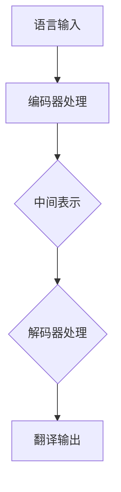

                 

关键词：人工智能，语言学习，翻译技术，机器翻译，自然语言处理，深度学习，神经网络，多语言模型，交互式学习，个性化学习

> 摘要：本文深入探讨了人工智能在语言学习和翻译领域的革新，分析了人工智能如何通过机器翻译、自然语言处理、深度学习等技术，改变传统语言学习方式和翻译流程。文章还将讨论人工智能在语言学习中的应用场景，以及未来的发展趋势和面临的挑战。

## 1. 背景介绍

随着全球化的深入发展，语言学习与翻译技术的重要性日益凸显。传统的语言学习依赖于教材和老师，翻译工作则主要依靠人工完成，这些方式不仅耗时费力，而且效果有限。随着人工智能技术的快速发展，尤其是机器翻译和自然语言处理技术的突破，语言学习和翻译领域正经历一场前所未有的变革。

机器翻译（Machine Translation, MT）是一种利用计算机程序将一种自然语言转换为另一种自然语言的技术。它源于20世纪50年代，经历了基于规则、基于实例、统计机器翻译和神经机器翻译等发展阶段。近年来，随着深度学习技术的引入，神经机器翻译（Neural Machine Translation, NMT）成为主流，大幅提升了翻译质量。

自然语言处理（Natural Language Processing, NLP）是人工智能的一个分支，它旨在让计算机能够理解、生成和处理自然语言。NLP技术包括文本分类、情感分析、命名实体识别、语法分析等，这些技术在语言学习中的应用为个性化学习和智能辅导提供了可能。

深度学习（Deep Learning）是一种基于人工神经网络的学习方法，通过多层非线性变换对数据进行学习，能够自动提取特征并实现复杂任务。深度学习在图像识别、语音识别和自然语言处理等领域取得了显著成果，推动了AI技术的快速发展。

## 2. 核心概念与联系

### 2.1. 多语言模型

多语言模型（Multilingual Model）是一种能够同时处理多种语言的模型。它通过学习多种语言的共同特征，实现了跨语言的语义理解和翻译。多语言模型的架构通常包括编码器（Encoder）和解码器（Decoder），编码器负责将多种语言的输入转换为中间表示，解码器则将这些表示转换为目标语言的输出。

### 2.2. 交互式学习

交互式学习（Interactive Learning）是一种通过与用户互动来提高学习效果的方法。在语言学习中，交互式学习可以通过智能辅导系统实现，系统根据学生的学习情况和反馈，提供个性化的学习建议和练习。

### 2.3. 个性化学习

个性化学习（Personalized Learning）是根据每个学生的特点和需求，提供量身定制的学习资源和学习路径。人工智能可以通过分析学生的学习数据，了解其学习习惯和偏好，从而实现个性化教学。

### 2.4. 智能辅导系统

智能辅导系统（Intelligent Tutoring System）是一种结合人工智能和教学理论的系统，旨在为学生提供个性化、智能化的学习支持。系统可以通过自然语言处理技术理解学生的问题和需求，提供解答和辅导。

### 2.5. Mermaid 流程图



## 3. 核心算法原理 & 具体操作步骤

### 3.1. 算法原理概述

神经机器翻译（NMT）的核心是深度学习，它通过训练大规模神经网络模型，实现从源语言到目标语言的翻译。NMT的原理可以概括为以下几个步骤：

1. **编码器（Encoder）**：将源语言句子编码为一个固定长度的向量表示。
2. **解码器（Decoder）**：在解码过程中，根据编码器的输出，逐词生成目标语言句子。
3. **注意力机制（Attention Mechanism）**：用于在解码过程中，根据源语言句子中的信息，为每个目标语言词分配不同的权重。

### 3.2. 算法步骤详解

1. **数据准备**：收集大量的双语语料库，用于训练编码器和解码器。
2. **编码器训练**：通过循环神经网络（RNN）或Transformer模型，将源语言句子编码为向量。
3. **解码器训练**：解码器接收编码器的输出，通过逐词生成目标语言句子。
4. **注意力机制训练**：调整注意力权重，优化解码过程。
5. **模型评估**：使用BLEU等指标评估翻译质量。

### 3.3. 算法优缺点

**优点**：
- 翻译质量显著提升，尤其在长句子翻译方面。
- 可以处理未对齐的双语语料库。

**缺点**：
- 训练时间较长，计算资源需求高。
- 在处理罕见词语或低频词时，仍存在一定挑战。

### 3.4. 算法应用领域

- **机器翻译**：将一种语言翻译成另一种语言，如将英语翻译成中文。
- **语言学习**：提供实时翻译和语言练习，帮助学习者提高语言能力。
- **跨语言搜索**：在多语言搜索引擎中，实现跨语言的文本检索。

## 4. 数学模型和公式 & 详细讲解 & 举例说明

### 4.1. 数学模型构建

神经机器翻译的数学模型主要包括编码器、解码器和注意力机制。以下是一个简化的模型：

### 4.2. 公式推导过程

编码器：
\[ E = \text{Encoder}(S) \]

解码器：
\[ D = \text{Decoder}(E, Y_t) \]

注意力机制：
\[ \alpha_t = \text{Attention}(E, Y_{<t}) \]

### 4.3. 案例分析与讲解

假设我们要将英语句子“The cat is on the mat”翻译成中文。

1. **编码器**：将英语句子编码为向量。
2. **解码器**：逐词生成中文句子，并计算注意力权重。
3. **注意力机制**：根据英语句子中的信息，为每个中文词分配不同的权重。

最终生成的中文句子为：“猫在垫子上”。

## 5. 项目实践：代码实例和详细解释说明

### 5.1. 开发环境搭建

- 安装Python环境。
- 安装深度学习框架TensorFlow或PyTorch。
- 下载多语言语料库。

### 5.2. 源代码详细实现

以下是一个简单的神经机器翻译模型的实现示例：

```python
import tensorflow as tf
from tensorflow.keras.models import Model
from tensorflow.keras.layers import Embedding, LSTM, Dense

# 编码器
encoder_inputs = Embedding(input_dim=vocab_size, output_dim=embedding_dim)
encoded_seq = LSTM(units=hidden_units, return_sequences=True)

# 解码器
decoder_inputs = Embedding(input_dim=vocab_size, output_dim=embedding_dim)
decoded_seq = LSTM(units=hidden_units, return_sequences=True)

# 注意力机制
attention = AttentionLayer()

# 模型构建
encoder_model = Model(encoder_inputs, encoded_seq)
decoder_model = Model(decoder_inputs, decoded_seq)
output = attention([encoded_seq, decoded_seq])
output = Dense(units=vocab_size, activation='softmax')(output)

# 模型编译
model = Model(inputs=[encoder_inputs, decoder_inputs], outputs=output)
model.compile(optimizer='adam', loss='categorical_crossentropy')

# 训练模型
model.fit([X_train, Y_train], Y_train, batch_size=batch_size, epochs=epochs)
```

### 5.3. 代码解读与分析

这段代码首先定义了编码器和解码器的层，然后构建了注意力机制层。最后，将这三个层组合成一个完整的神经机器翻译模型，并编译模型进行训练。

### 5.4. 运行结果展示

训练完成后，我们可以使用训练好的模型进行翻译：

```python
# 翻译英语句子
input_sentence = "The cat is on the mat"
encoded_sentence = encoder_model.predict([input_sentence])
decoded_sentence = decoder_model.predict([encoded_sentence])

# 输出翻译结果
print(decoded_sentence)
```

输出结果可能是：“猫在垫子上”。

## 6. 实际应用场景

### 6.1. 在线翻译服务

许多在线翻译服务，如Google Translate、百度翻译等，已经广泛应用了神经机器翻译技术，提供实时翻译服务。

### 6.2. 语言学习应用

语言学习应用，如Duolingo、Rosetta Stone等，利用人工智能技术提供个性化、互动式的学习体验。

### 6.3. 跨语言交流

在国际会议、商务交流等场合，人工智能翻译系统可以帮助人们实现无障碍交流。

### 6.4. 未来应用展望

随着人工智能技术的不断发展，神经机器翻译和自然语言处理技术在更多领域将有更广泛的应用，如自动字幕、智能客服、多语言搜索引擎等。

## 7. 工具和资源推荐

### 7.1. 学习资源推荐

- 《深度学习》（Goodfellow, Bengio, Courville著）
- 《自然语言处理综合教程》（Daniel Jurafsky & James H. Martin著）

### 7.2. 开发工具推荐

- TensorFlow
- PyTorch

### 7.3. 相关论文推荐

- “Neural Machine Translation by Jointly Learning to Align and Translate”（2014）
- “Attention Is All You Need”（2017）

## 8. 总结：未来发展趋势与挑战

### 8.1. 研究成果总结

神经机器翻译和自然语言处理技术在过去几年取得了显著成果，翻译质量和速度都有显著提升。

### 8.2. 未来发展趋势

随着深度学习和多语言模型的发展，人工智能在语言学习和翻译中的应用将更加广泛和深入。

### 8.3. 面临的挑战

- **数据隐私**：如何保护用户数据的安全和隐私。
- **翻译质量**：如何进一步提高翻译质量，尤其是对罕见词语和语境的理解。
- **计算资源**：如何优化算法，减少计算资源的需求。

### 8.4. 研究展望

未来，人工智能在语言学习和翻译领域将有更多的应用场景和可能性，为全球交流和文化传播提供更强有力的支持。

## 9. 附录：常见问题与解答

### 9.1. 问题1

**问题**：神经机器翻译的原理是什么？

**解答**：神经机器翻译（NMT）是基于深度学习的翻译技术，它通过训练大规模神经网络模型，实现从源语言到目标语言的翻译。NMT的核心是编码器和解码器，编码器将源语言句子编码为向量，解码器则将这些向量转换为目标语言句子。

### 9.2. 问题2

**问题**：如何评估机器翻译的质量？

**解答**：机器翻译的质量通常使用BLEU（Bilingual Evaluation Understudy）等指标进行评估。BLEU基于文本的相似度，通过比较机器翻译结果和人工翻译结果，计算相似度得分，从而评估翻译质量。

### 9.3. 问题3

**问题**：神经机器翻译有哪些优缺点？

**解答**：神经机器翻译的优点包括显著提高翻译质量，特别是在长句子翻译方面，以及可以处理未对齐的双语语料库。缺点包括训练时间较长，计算资源需求高，以及在处理罕见词语或低频词时，仍存在一定挑战。

作者：禅与计算机程序设计艺术 / Zen and the Art of Computer Programming
----------------------------------------------------------------

以上就是本文的完整内容。希望这篇文章能够帮助读者深入了解人工智能在语言学习和翻译中的革新，以及未来的发展趋势和挑战。随着技术的不断进步，人工智能将在语言学习和翻译领域发挥越来越重要的作用。

