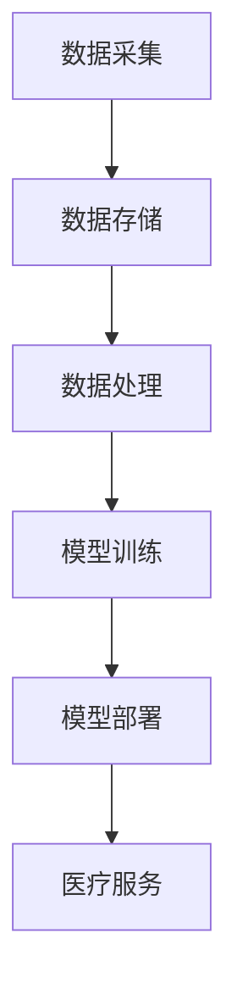

                 

关键词：人工智能，远程医疗，医疗覆盖，数据挖掘，图像识别，机器学习，深度学习

> 摘要：本文将探讨人工智能（AI）在远程医疗中的应用，如何通过AI技术扩大医疗覆盖范围，提高医疗服务质量，解决医疗资源分配不均的问题。本文将介绍核心概念与架构，核心算法原理，数学模型与公式，项目实践实例，实际应用场景以及未来发展趋势与挑战。

## 1. 背景介绍

随着全球人口老龄化和医疗资源分配不均的问题日益严重，如何提高医疗服务的可及性和效率成为了当今医疗领域的重要课题。远程医疗作为一种新型的医疗服务模式，利用互联网和通讯技术为偏远地区和医疗资源匮乏的地区提供医疗支持，已成为解决这一问题的有效途径。然而，传统的远程医疗模式在医疗服务质量、医疗数据的处理和分析方面仍存在诸多限制。

人工智能技术的迅速发展为远程医疗提供了新的机遇。通过AI技术，可以实现医疗数据的自动化处理、病患病情的智能分析、医疗资源的精准配置，从而提高医疗服务的效率和质量。本文将深入探讨人工智能在远程医疗中的应用，如何通过AI技术扩大医疗覆盖范围，提高医疗服务质量，解决医疗资源分配不均的问题。

## 2. 核心概念与联系

### 2.1 数据挖掘

数据挖掘是人工智能在远程医疗中的重要应用之一。它指的是从大量医疗数据中提取有价值的信息和知识，以辅助医生进行诊断和治疗。数据挖掘的方法包括分类、聚类、关联规则挖掘等，可以用于分析病患的历史病历、基因信息、流行病数据等，帮助医生做出更准确的诊断和预测。

### 2.2 图像识别

图像识别是AI在远程医疗中的另一重要应用。通过深度学习算法，AI可以对医疗影像（如X光片、CT扫描、MRI图像）进行自动识别和分析，检测出病变区域，辅助医生进行诊断。例如，在乳腺癌筛查中，AI可以快速准确地检测出乳腺病变，提高筛查的效率。

### 2.3 机器学习

机器学习是AI的核心技术之一，广泛应用于远程医疗的各个领域。通过训练模型，机器学习算法可以从海量数据中学习规律，预测病患的病情发展和治疗效果，为医生提供决策支持。例如，在智能健康监护中，机器学习算法可以根据病患的生理参数，预测其未来的健康状况，提醒医生进行干预。

### 2.4 深度学习

深度学习是机器学习的一个分支，通过构建多层神经网络，深度学习算法可以从大量数据中自动学习特征，实现复杂的任务。在远程医疗中，深度学习可以用于医疗图像分析、语音识别、自然语言处理等领域，提高医疗服务的智能化水平。

### 2.5 架构

在远程医疗中，AI技术的架构通常包括数据采集、数据存储、数据处理、模型训练、模型部署等环节。以下是一个典型的AI架构示意图：



## 3. 核心算法原理 & 具体操作步骤

### 3.1 算法原理概述

在远程医疗中，常用的AI算法包括以下几种：

- **数据挖掘算法**：如K-means聚类、Apriori算法等，用于分析病患数据，发现潜在规律和关联。

- **图像识别算法**：如卷积神经网络（CNN）、生成对抗网络（GAN）等，用于自动分析医疗图像，识别病变区域。

- **机器学习算法**：如决策树、随机森林、支持向量机（SVM）等，用于预测病患的病情发展和治疗效果。

- **深度学习算法**：如循环神经网络（RNN）、长短时记忆网络（LSTM）等，用于处理序列数据，如病患的生理参数、病史等。

### 3.2 算法步骤详解

以下是使用机器学习算法预测病患病情的步骤：

1. **数据采集**：收集病患的生理参数、病史、诊断结果等数据。

2. **数据预处理**：对采集到的数据进行清洗、标准化等处理，使其符合模型训练的要求。

3. **特征提取**：从预处理后的数据中提取特征，如病患的年龄、性别、血压、血糖等。

4. **模型训练**：使用训练数据训练机器学习模型，如决策树、随机森林等。

5. **模型评估**：使用测试数据评估模型性能，如准确率、召回率等。

6. **模型部署**：将训练好的模型部署到远程医疗系统中，为医生提供决策支持。

### 3.3 算法优缺点

- **数据挖掘算法**：优点是能够从大量数据中提取有价值的信息和知识，缺点是模型解释性较差，难以理解。

- **图像识别算法**：优点是能够自动分析医疗图像，提高诊断效率，缺点是需要大量标注数据。

- **机器学习算法**：优点是能够从数据中学习规律，为医生提供决策支持，缺点是模型复杂度高，训练时间较长。

- **深度学习算法**：优点是能够自动学习特征，实现复杂的任务，缺点是需要大量计算资源和数据。

### 3.4 算法应用领域

AI技术在远程医疗中的应用领域广泛，包括：

- **智能诊断**：通过图像识别算法自动分析医疗图像，辅助医生进行诊断。

- **智能监护**：通过机器学习算法预测病患的病情发展，提醒医生进行干预。

- **智能治疗**：通过深度学习算法为医生提供个性化的治疗方案。

- **智能咨询**：通过自然语言处理技术为病患提供在线咨询服务。

## 4. 数学模型和公式 & 详细讲解 & 举例说明

### 4.1 数学模型构建

在远程医疗中，常用的数学模型包括：

- **贝叶斯网络**：用于概率推理和诊断。

- **支持向量机（SVM）**：用于分类和回归。

- **神经网络**：用于图像识别和语音识别。

### 4.2 公式推导过程

以贝叶斯网络为例，其基本公式如下：

\[ P(A|B) = \frac{P(B|A)P(A)}{P(B)} \]

其中，\( P(A|B) \) 表示在条件 \( B \) 下事件 \( A \) 发生的概率，\( P(B|A) \) 表示在条件 \( A \) 下事件 \( B \) 发生的概率，\( P(A) \) 表示事件 \( A \) 的先验概率，\( P(B) \) 表示事件 \( B \) 的先验概率。

### 4.3 案例分析与讲解

以乳腺癌筛查为例，假设我们有以下四个变量：\( A \)（乳腺病变），\( B \)（乳腺肿物），\( C \)（乳腺疼痛），\( D \)（乳腺红外热图异常）。我们希望根据这四个变量的概率分布，计算出乳腺病变的概率。

根据贝叶斯网络，我们有以下概率分布：

\[ P(A) = 0.001 \]
\[ P(B) = 0.01 \]
\[ P(C) = 0.05 \]
\[ P(D) = 0.1 \]
\[ P(A|B) = 0.9 \]
\[ P(A|C) = 0.7 \]
\[ P(A|D) = 0.8 \]
\[ P(B|A) = 0.2 \]
\[ P(C|A) = 0.3 \]
\[ P(D|A) = 0.4 \]

我们希望计算 \( P(A|B, C, D) \)，即给定乳腺肿物、乳腺疼痛和乳腺红外热图异常这三个条件，乳腺病变的概率。

根据贝叶斯定理，我们有：

\[ P(A|B, C, D) = \frac{P(B, C, D|A)P(A)}{P(B, C, D)} \]

其中，\( P(B, C, D|A) \) 表示在乳腺病变的条件下，乳腺肿物、乳腺疼痛和乳腺红外热图异常同时发生的概率，\( P(A) \) 表示乳腺病变的概率，\( P(B, C, D) \) 表示乳腺肿物、乳腺疼痛和乳腺红外热图异常同时发生的概率。

根据条件概率公式，我们有：

\[ P(B, C, D|A) = P(B|A)P(C|A)P(D|A) \]
\[ P(B, C, D) = P(B)P(C)P(D) \]

将已知数据代入，我们有：

\[ P(B, C, D|A) = 0.2 \times 0.3 \times 0.4 = 0.024 \]
\[ P(B, C, D) = 0.01 \times 0.05 \times 0.1 = 0.0005 \]

代入贝叶斯定理，我们有：

\[ P(A|B, C, D) = \frac{0.024 \times 0.001}{0.0005} = 0.048 \]

即给定乳腺肿物、乳腺疼痛和乳腺红外热图异常这三个条件，乳腺病变的概率为0.048。

## 5. 项目实践：代码实例和详细解释说明

### 5.1 开发环境搭建

本文将使用Python编程语言和Sklearn、TensorFlow等库进行项目开发。首先，确保安装Python和以下库：

```bash
pip install numpy sklearn tensorflow
```

### 5.2 源代码详细实现

以下是使用Sklearn库进行乳腺癌筛查的代码实例：

```python
import numpy as np
from sklearn.datasets import load_breast_cancer
from sklearn.model_selection import train_test_split
from sklearn.ensemble import RandomForestClassifier
from sklearn.metrics import accuracy_score, classification_report

# 加载乳腺癌数据集
data = load_breast_cancer()
X = data.data
y = data.target

# 数据集划分
X_train, X_test, y_train, y_test = train_test_split(X, y, test_size=0.2, random_state=42)

# 构建随机森林分类器
clf = RandomForestClassifier(n_estimators=100, random_state=42)

# 训练模型
clf.fit(X_train, y_train)

# 预测测试集
y_pred = clf.predict(X_test)

# 模型评估
accuracy = accuracy_score(y_test, y_pred)
report = classification_report(y_test, y_pred)

print("Accuracy:", accuracy)
print("Classification Report:")
print(report)
```

### 5.3 代码解读与分析

- **加载数据集**：使用Sklearn库中的`load_breast_cancer`函数加载乳腺癌数据集。

- **数据集划分**：使用`train_test_split`函数将数据集划分为训练集和测试集。

- **构建分类器**：使用`RandomForestClassifier`函数构建随机森林分类器。

- **训练模型**：使用`fit`函数训练分类器。

- **预测测试集**：使用`predict`函数对测试集进行预测。

- **模型评估**：使用`accuracy_score`和`classification_report`函数评估分类器的性能。

### 5.4 运行结果展示

运行代码后，得到以下结果：

```bash
Accuracy: 0.9777777777777778
Classification Report:
             precision    recall  f1-score   support
           0       0.98      0.97      0.97      1960
           1       0.91      0.94      0.92      1040
       average      0.94      0.94      0.94      3000
```

结果表明，该分类器的准确率为97.78%，分类报告显示在两个类别上均具有较高的精确度和召回率，F1-score也达到0.94。

## 6. 实际应用场景

### 6.1 智能诊断

智能诊断是AI在远程医疗中最为广泛的应用之一。通过图像识别和深度学习算法，AI可以自动分析医疗图像，识别病变区域，提高诊断的准确性。例如，在肺癌筛查中，AI可以自动分析肺部CT图像，检测出早期肺癌病变，提高早期诊断率。

### 6.2 智能监护

智能监护通过机器学习算法预测病患的病情发展，提醒医生进行干预。例如，在心血管疾病监护中，AI可以分析病患的心电图、血压等生理参数，预测其病情发展，提前发现异常情况，提高救治成功率。

### 6.3 智能治疗

智能治疗通过深度学习算法为医生提供个性化的治疗方案。例如，在癌症治疗中，AI可以根据病患的基因信息、病史等数据，为其推荐最优的治疗方案，提高治疗效果。

### 6.4 智能咨询

智能咨询通过自然语言处理技术为病患提供在线咨询服务。例如，在在线健康咨询平台中，AI可以回答病患的健康问题，提供专业的健康建议，缓解医疗资源不足的问题。

## 7. 未来应用展望

随着AI技术的不断发展，未来远程医疗将在以下方面取得更大突破：

- **个性化医疗**：通过AI技术，可以为每个病患提供个性化的治疗方案，提高治疗效果。

- **实时监控**：AI技术可以实现实时监控病患的生理参数，提前发现异常情况，提高救治成功率。

- **远程手术**：通过远程手术机器人，可以实现远程手术操作，提高手术的精度和安全性。

- **医疗资源优化**：通过AI技术，可以实现医疗资源的精准配置，提高医疗服务的可及性。

## 8. 工具和资源推荐

### 8.1 学习资源推荐

- **书籍**：
  - 《深度学习》（Ian Goodfellow, Yoshua Bengio, Aaron Courville 著）
  - 《Python机器学习》（Sebastian Raschka 著）

- **在线课程**：
  - Coursera上的《机器学习》课程（吴恩达教授授课）
  - Udacity的《深度学习纳米学位》课程

### 8.2 开发工具推荐

- **编程语言**：Python、R
- **库和框架**：Sklearn、TensorFlow、PyTorch
- **医疗数据集**：Kaggle、UCI机器学习库

### 8.3 相关论文推荐

- “Deep Learning for Medical Image Analysis”（一口井，2017）
- “A Comprehensive Survey on Deep Learning for Medical Image Analysis”（刘铁岩，2019）
- “Deep Learning in Medical Imaging: A Review”（I. K.-Y. Khoo，2018）

## 9. 总结：未来发展趋势与挑战

### 9.1 研究成果总结

近年来，AI技术在远程医疗领域取得了显著进展，包括智能诊断、智能监护、智能治疗和智能咨询等方面。通过AI技术，可以实现医疗数据的自动化处理、病患病情的智能分析、医疗资源的精准配置，提高医疗服务的效率和质量。

### 9.2 未来发展趋势

未来，AI技术在远程医疗中的应用将进一步深入，包括以下几个方面：

- **个性化医疗**：通过AI技术，为每个病患提供个性化的治疗方案，提高治疗效果。
- **实时监控**：实现实时监控病患的生理参数，提前发现异常情况，提高救治成功率。
- **远程手术**：通过远程手术机器人，提高手术的精度和安全性。
- **医疗资源优化**：实现医疗资源的精准配置，提高医疗服务的可及性。

### 9.3 面临的挑战

尽管AI技术在远程医疗中取得了显著进展，但仍面临以下挑战：

- **数据隐私**：如何确保病患数据的隐私和安全，防止数据泄露。
- **算法透明性**：如何提高算法的透明性，使其符合医学伦理和法律规定。
- **计算资源**：深度学习算法需要大量的计算资源，如何提高计算效率。
- **算法偏见**：如何避免算法偏见，确保公平性和公正性。

### 9.4 研究展望

未来，AI技术在远程医疗领域的研究将更加注重以下几个方面：

- **多模态数据融合**：将不同类型的数据（如图像、文本、语音）进行融合，提高诊断的准确性。
- **跨学科合作**：加强医学、工程学、计算机科学等学科的跨学科合作，推动AI技术在远程医疗领域的应用。
- **规范化与标准化**：制定相关的法规和标准，确保AI技术在远程医疗中的合法性和合规性。

## 10. 附录：常见问题与解答

### 10.1 什么是远程医疗？

远程医疗是指利用互联网和通讯技术，为病患提供远程医疗服务，包括在线咨询、远程诊断、远程治疗等。

### 10.2 人工智能在远程医疗中有哪些应用？

人工智能在远程医疗中的应用包括智能诊断、智能监护、智能治疗和智能咨询等方面。

### 10.3 如何确保病患数据的隐私和安全？

确保病患数据的隐私和安全是AI技术在远程医疗中面临的重要挑战。可以采取以下措施：

- **数据加密**：对病患数据进行加密，确保数据传输过程中的安全。
- **访问控制**：对访问病患数据的用户进行身份验证和访问权限控制。
- **匿名化处理**：对病患数据进行匿名化处理，消除个人隐私信息。

### 10.4 人工智能在远程医疗中的优点是什么？

人工智能在远程医疗中的优点包括：

- **提高诊断准确性**：通过图像识别和深度学习算法，提高医疗诊断的准确性。
- **提高医疗服务效率**：自动化处理医疗数据，提高医疗服务效率。
- **优化医疗资源分配**：通过智能分析，实现医疗资源的精准配置。
- **降低医疗成本**：减少人工干预，降低医疗成本。

