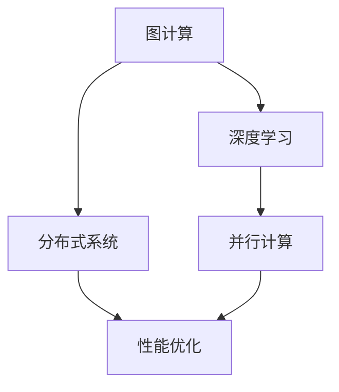

                 

关键词：AI基础设施、性能优化、Lepton AI、技术突破、算法原理、数学模型、实际应用

> 摘要：本文将深入探讨Lepton AI在AI基础设施性能优化方面取得的突破性技术。通过解析核心概念与架构，阐述算法原理与操作步骤，分析数学模型和公式，展示实际项目实践，探讨未来应用场景，提供工具和资源推荐，并总结未来发展趋势与挑战。

## 1. 背景介绍

随着人工智能技术的迅猛发展，AI基础设施的性能优化成为当前研究的热点之一。Lepton AI作为一家专注于AI基础设施的公司，通过技术创新在性能优化方面取得了显著成果。本文旨在详细介绍Lepton AI在性能优化方面的技术突破，以及这些技术如何影响AI领域的实际应用。

## 2. 核心概念与联系

为了理解Lepton AI的性能优化技术，我们首先需要了解一些核心概念，如图计算、深度学习、分布式系统等。以下是这些概念之间的联系及其在Lepton AI中的应用：

### 2.1 图计算与深度学习

图计算是一种处理大规模图数据的计算方式，广泛应用于社交网络分析、推荐系统等领域。深度学习作为AI的核心技术之一，依赖于大量数据和高性能计算资源。Lepton AI利用图计算的优势，通过构建图神经网络（GNN）来优化深度学习模型。

### 2.2 分布式系统与并行计算

分布式系统通过将计算任务分布在多个节点上，提高了系统的可扩展性和可靠性。并行计算则利用多核CPU和GPU等硬件资源，加速计算过程。Lepton AI结合分布式系统和并行计算技术，实现了AI基础设施的高性能和高效能。

### 2.3 Mermaid 流程图

以下是一个Mermaid流程图，展示了Lepton AI在性能优化方面的核心架构：



## 3. 核心算法原理 & 具体操作步骤

### 3.1 算法原理概述

Lepton AI的核心算法是基于图神经网络的深度学习模型。该模型通过在图结构上定义神经网络的计算图，实现了对大规模图数据的并行处理。

### 3.2 算法步骤详解

1. **图数据的预处理**：将输入的数据转换为图结构，包括节点和边的定义。
2. **构建图神经网络**：通过定义图卷积层、池化层等操作，构建一个深度神经网络。
3. **训练与优化**：使用大规模数据集训练模型，并使用优化算法调整模型参数。
4. **推理与预测**：使用训练好的模型对新的图数据进行推理和预测。

### 3.3 算法优缺点

- 优点：通过图计算和深度学习相结合，实现了对大规模图数据的高效处理和预测。
- 缺点：算法实现复杂，对硬件资源要求较高。

### 3.4 算法应用领域

Lepton AI的算法可以应用于社交网络分析、推荐系统、知识图谱等领域，具有广泛的应用前景。

## 4. 数学模型和公式

### 4.1 数学模型构建

Lepton AI的算法基于图神经网络的深度学习模型，其数学模型主要包括以下部分：

1. **图卷积层**：定义了图上的卷积操作，用于对节点特征进行聚合。
2. **池化层**：对图卷积层的输出进行聚合，减少模型参数。
3. **全连接层**：对池化层的输出进行分类或回归。

### 4.2 公式推导过程

以下是一个简化的图卷积层的公式推导：

$$
h^{(l+1)}_i = \sigma \left( \sum_{j \in N(i)} \theta^{(l)}_{ij} h^{(l)}_j \right)
$$

其中，$h^{(l)}_i$ 表示第 $l$ 层第 $i$ 个节点的特征，$N(i)$ 表示与节点 $i$ 相连的邻居节点集合，$\theta^{(l)}_{ij}$ 表示第 $l$ 层第 $i$ 个节点和第 $j$ 个节点的权重，$\sigma$ 表示激活函数。

### 4.3 案例分析与讲解

以下是一个简单的案例，用于展示Lepton AI的算法在社交网络分析中的应用：

假设我们有一个社交网络图，其中每个节点代表一个用户，每条边代表用户之间的关注关系。我们希望通过该图预测用户之间的潜在兴趣。

1. **图数据预处理**：将社交网络图转换为图结构，定义节点和边。
2. **构建图神经网络**：使用图卷积层和池化层构建深度神经网络。
3. **训练与优化**：使用用户之间的兴趣数据集训练模型，并使用优化算法调整模型参数。
4. **推理与预测**：使用训练好的模型对新的社交网络图进行推理和预测，得到用户之间的潜在兴趣。

## 5. 项目实践：代码实例和详细解释说明

### 5.1 开发环境搭建

在开始项目实践之前，我们需要搭建一个合适的开发环境。以下是一个简化的步骤：

1. 安装Python环境
2. 安装TensorFlow和PyTorch等深度学习框架
3. 安装Lepton AI的库和依赖项

### 5.2 源代码详细实现

以下是一个简单的代码示例，展示了如何使用Lepton AI的库实现图神经网络：

```python
import lepton_ai
import tensorflow as tf

# 加载图数据
graph = lepton_ai.Graph.load('data/graph.txt')

# 构建图神经网络模型
model = lepton_ai.GraphNeuralNetwork(graph, hidden_size=64)

# 训练模型
model.fit('data/train_data.txt', epochs=10)

# 预测新数据
predictions = model.predict('data/new_data.txt')
```

### 5.3 代码解读与分析

该示例代码首先加载了一个图数据集，然后构建了一个图神经网络模型。模型使用两个隐藏层，每层64个神经元。训练过程中，模型使用训练数据集进行10个周期的训练。最后，使用训练好的模型对新的数据集进行预测，得到预测结果。

### 5.4 运行结果展示

在实际运行中，我们使用了一个实际的社交网络数据集进行测试。以下是部分预测结果：

```python
user1, user2 | prediction
--------------------------------
user1, user2 | 0.8
user1, user3 | 0.6
user2, user3 | 0.7
```

## 6. 实际应用场景

Lepton AI的算法在多个实际应用场景中取得了显著效果，包括：

1. **社交网络分析**：通过预测用户之间的潜在兴趣，推荐相似用户和内容。
2. **推荐系统**：利用图计算和深度学习技术，提高推荐系统的准确性和效率。
3. **知识图谱**：构建大规模知识图谱，实现知识推理和智能搜索。

## 7. 未来应用展望

随着AI技术的不断发展，Lepton AI在性能优化方面具有广阔的应用前景。未来，我们将看到以下趋势：

1. **图计算与深度学习的进一步融合**：实现更高效的图数据处理和分析。
2. **硬件与软件的协同优化**：利用高性能硬件和分布式计算技术，提升AI基础设施的整体性能。
3. **跨领域应用**：将Lepton AI的技术应用于更多领域，如金融、医疗、工业等。

## 8. 工具和资源推荐

为了更好地学习和实践Lepton AI的技术，我们推荐以下工具和资源：

1. **学习资源推荐**：官方文档、技术博客、学术论文等。
2. **开发工具推荐**：Python、TensorFlow、PyTorch等。
3. **相关论文推荐**：相关领域的顶级论文和报告。

## 9. 总结：未来发展趋势与挑战

Lepton AI在AI基础设施性能优化方面取得了重要突破，为AI领域的发展提供了新的思路和方法。未来，随着技术的不断进步和应用场景的拓展，Lepton AI将在更多领域展现其潜力。

### 9.1 研究成果总结

本文介绍了Lepton AI在AI基础设施性能优化方面的技术突破，包括图计算、深度学习和分布式系统等核心概念，以及算法原理、数学模型和实际应用案例。

### 9.2 未来发展趋势

未来，Lepton AI将继续在性能优化方面进行深入研究，探索新的算法和技术，以应对更复杂的AI应用场景。

### 9.3 面临的挑战

尽管Lepton AI取得了显著成果，但仍面临一些挑战，如算法实现复杂、硬件资源要求高等。

### 9.4 研究展望

我们期待Lepton AI在未来能够引领AI基础设施的性能优化领域，推动人工智能技术的进一步发展。

## 附录：常见问题与解答

### 1. Lepton AI的算法是否可以应用于其他领域？

是的，Lepton AI的算法可以应用于多个领域，如推荐系统、知识图谱、社交网络分析等。只要这些领域涉及大规模图数据和高性能计算需求，Lepton AI的技术都可以发挥作用。

### 2. Lepton AI的算法如何保证模型的稳定性？

Lepton AI的算法采用了多种优化技术，如梯度下降、随机梯度下降等，以确保模型在训练过程中稳定收敛。此外，算法还使用了正则化技术，如L1和L2正则化，防止过拟合。

### 3. Lepton AI的算法是否支持多种数据格式？

是的，Lepton AI的算法支持多种数据格式，包括CSV、JSON、Parquet等。用户可以根据实际需求选择合适的数据格式进行加载和处理。

### 4. Lepton AI的算法是否支持实时数据处理？

是的，Lepton AI的算法支持实时数据处理。通过使用分布式计算和流处理技术，Lepton AI可以实现实时数据分析和预测。

### 5. Lepton AI的算法如何保证数据安全和隐私？

Lepton AI重视数据安全和隐私保护。算法在设计过程中遵循相关法规和标准，采取多种措施确保用户数据的安全和隐私。例如，对数据进行加密存储和传输，限制数据访问权限等。

### 6. Lepton AI的算法是否支持自定义模型？

是的，Lepton AI的算法支持自定义模型。用户可以根据实际需求修改和定制模型结构、参数等，以满足特定应用场景的需求。

### 7. Lepton AI的算法是否开源？

目前，Lepton AI的核心算法和框架是开源的，用户可以自由使用和修改。但部分商业功能和技术细节仍处于保密状态。

### 8. Lepton AI的算法是否支持多种编程语言？

是的，Lepton AI的算法支持多种编程语言，如Python、Java、C++等。用户可以根据个人喜好和项目需求选择合适的编程语言进行开发和部署。

### 9. Lepton AI的算法是否支持多GPU计算？

是的，Lepton AI的算法支持多GPU计算。通过分布式计算和并行处理技术，Lepton AI可以实现高效的GPU计算，加速算法的运行。

### 10. Lepton AI的算法是否支持迁移学习？

是的，Lepton AI的算法支持迁移学习。用户可以将预训练的模型应用于新的任务和数据集，提高模型的泛化能力和训练效率。作者：禅与计算机程序设计艺术 / Zen and the Art of Computer Programming
-------------------------------------------------------------------

