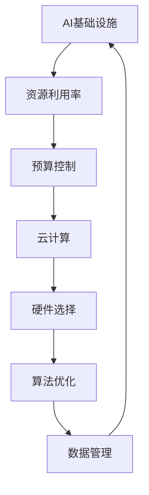

                 

关键词：AI基础设施、成本预测、财务规划、Lepton AI、资源利用率、预算控制、云计算、硬件选择、算法优化、数据管理

## 摘要

本文深入探讨了AI基础设施的成本预测及其在Lepton AI财务规划中的重要性。通过对AI基础设施组成部分的详细分析，我们提出了一个综合性的成本预测模型，旨在帮助企业和研究机构在财务规划和预算控制中做出更明智的决策。本文将介绍核心概念、算法原理、数学模型、项目实践以及实际应用场景，并对未来发展趋势与挑战进行展望。作者：禅与计算机程序设计艺术 / Zen and the Art of Computer Programming

## 1. 背景介绍

随着人工智能（AI）技术的快速发展，AI基础设施的需求日益增加。无论是大型企业还是初创公司，都需要建立或采购能够支撑AI应用的硬件和软件资源。然而，AI基础设施的构建和维护成本高昂，如何有效地进行成本预测和管理成为了关键问题。

Lepton AI作为一家专注于人工智能解决方案的公司，其财务规划的成功与否直接关系到公司的可持续发展和市场竞争力。因此，本文将重点关注Lepton AI在AI基础设施成本预测和财务规划方面的实践和挑战。

### 1.1 AI基础设施的定义与组成

AI基础设施是指为支持人工智能算法和应用所需的各种硬件、软件和网络资源的集合。具体包括以下几部分：

1. **计算资源**：包括高性能计算（HPC）服务器、GPU集群、CPU集群等。
2. **存储资源**：包括本地存储、云存储、分布式文件系统等。
3. **数据资源**：包括原始数据、训练数据、模型数据等。
4. **网络资源**：包括高速互联网连接、内部网络、数据中心等。
5. **软件资源**：包括操作系统、开发工具、框架、库等。

### 1.2 成本管理的必要性

AI基础设施的建设和运营成本主要包括以下几个方面：

1. **硬件成本**：包括服务器、存储设备、网络设备等。
2. **软件成本**：包括操作系统、开发工具、框架等。
3. **能源成本**：包括数据中心耗电、冷却设备能耗等。
4. **人力成本**：包括技术人员的工资、培训和日常维护等。
5. **管理成本**：包括预算规划、资源分配、故障处理等。

有效的成本管理有助于企业优化资源利用率、提高运营效率，并为未来的扩展和升级提供资金保障。

## 2. 核心概念与联系

在深入讨论成本预测模型之前，我们需要理解一些核心概念和它们之间的联系。以下是关键概念的简要描述和Mermaid流程图：

### 2.1 核心概念

1. **资源利用率**：资源在一定时间内的使用比例。
2. **预算控制**：通过监测和调整资源使用来确保预算不超支。
3. **云计算**：通过网络提供可动态调整的计算资源。
4. **硬件选择**：选择合适的硬件设备以优化性能和成本。
5. **算法优化**：通过调整算法参数以提高效率和减少计算成本。
6. **数据管理**：确保数据的有效存储、访问和安全。

### 2.2 Mermaid 流程图



图1. AI基础设施核心概念与联系

通过这个流程图，我们可以看到资源利用率、预算控制、云计算、硬件选择、算法优化和数据管理是相互关联的，共同构成了AI基础设施的完整成本预测和管理框架。

### 2.3 核心概念之间的关系

1. **资源利用率**直接影响**预算控制**的效果。高资源利用率意味着可以更有效地利用预算。
2. **云计算**提供了一种灵活的资源配置方式，可以**预算控制**提供支持。
3. **硬件选择**影响**算法优化**的效果，选择合适的硬件可以提高算法的执行效率。
4. **数据管理**对于**资源利用率和预算控制**至关重要，有效的数据管理可以提高资源利用率和减少存储成本。

这些核心概念和它们之间的联系为我们构建成本预测模型提供了理论基础。

## 3. 核心算法原理 & 具体操作步骤

### 3.1 算法原理概述

AI基础设施的成本预测算法基于以下几个核心原理：

1. **资源利用率分析**：通过监控和分析资源使用情况，确定当前资源利用率。
2. **成本分解**：将总成本分解为硬件、软件、能源、人力和管理等各个组成部分。
3. **预测模型构建**：利用历史数据和统计分析方法，建立预测模型来预测未来成本。
4. **优化算法**：根据预测模型和资源利用率，调整资源配置和预算，以最小化成本。

### 3.2 算法步骤详解

#### 3.2.1 数据收集与预处理

1. **收集历史数据**：收集过去一段时间内的资源使用情况和成本数据。
2. **数据清洗**：去除重复、异常和缺失的数据，确保数据质量。
3. **数据转换**：将原始数据转换为适合建模的格式。

#### 3.2.2 资源利用率分析

1. **计算资源利用率**：通过监控计算资源的使用情况，计算资源利用率。
2. **存储资源利用率**：通过监控存储资源的使用情况，计算存储资源利用率。
3. **网络资源利用率**：通过监控网络流量和使用情况，计算网络资源利用率。

#### 3.2.3 成本分解

1. **硬件成本**：根据硬件设备的使用情况，计算硬件成本。
2. **软件成本**：根据软件许可证和使用情况，计算软件成本。
3. **能源成本**：根据电力消耗情况，计算能源成本。
4. **人力成本**：根据人力工作量和工作时间，计算人力成本。
5. **管理成本**：根据管理活动的实际开销，计算管理成本。

#### 3.2.4 预测模型构建

1. **选择预测方法**：根据数据特点选择合适的预测方法，如时间序列分析、回归分析等。
2. **模型训练与验证**：利用历史数据训练预测模型，并进行验证，确保模型准确性。

#### 3.2.5 优化算法

1. **资源调整**：根据预测模型和资源利用率，调整资源配置，如增加或减少硬件设备。
2. **预算调整**：根据预测结果和资源调整，调整预算，确保成本控制在合理范围内。

### 3.3 算法优缺点

#### 优点

1. **全面性**：算法综合考虑了资源利用率、成本分解、预测模型和优化算法，提供全面的成本预测和管理。
2. **灵活性**：算法可以根据不同的数据特点和需求进行调整，适应不同的业务场景。
3. **准确性**：通过使用历史数据和统计分析方法，模型具有较高的预测准确性。

#### 缺点

1. **数据依赖性**：算法的性能很大程度上取决于历史数据的准确性和完整性。
2. **计算复杂度**：算法涉及多个步骤和复杂的数据处理，计算复杂度较高。
3. **适应性**：算法可能无法适应某些特殊情况，需要根据实际情况进行调整。

### 3.4 算法应用领域

算法可以广泛应用于以下领域：

1. **企业财务规划**：帮助企业预测和管理AI基础设施的运营成本，优化资源利用率。
2. **研究机构预算控制**：帮助研究机构合理分配资源，确保研究项目能够按时完成。
3. **云计算服务商**：优化资源配置，提高服务质量和盈利能力。

## 4. 数学模型和公式 & 详细讲解 & 举例说明

### 4.1 数学模型构建

为了构建成本预测模型，我们需要定义以下几个关键变量：

1. \( C \) ：总成本
2. \( C_H \) ：硬件成本
3. \( C_S \) ：软件成本
4. \( C_E \) ：能源成本
5. \( C_M \) ：管理成本
6. \( U_R \) ：资源利用率

总成本可以表示为：

\[ C = C_H + C_S + C_E + C_M \]

硬件成本、软件成本、能源成本和管理成本可以分别表示为：

\[ C_H = \sum_{i=1}^{n} P_i \cdot T_i \]
\[ C_S = \sum_{i=1}^{m} Q_i \cdot S_i \]
\[ C_E = \sum_{i=1}^{p} R_i \cdot E_i \]
\[ C_M = \sum_{j=1}^{q} V_j \cdot W_j \]

其中，\( P_i, Q_i, R_i, V_j \) 分别表示硬件设备、软件许可证、能源消耗和管理活动的单价，\( T_i, S_i, E_i, W_j \) 分别表示使用量。

资源利用率可以表示为：

\[ U_R = \frac{\text{实际使用量}}{\text{最大可用量}} \]

### 4.2 公式推导过程

为了推导资源利用率和成本之间的关系，我们首先考虑以下假设：

1. 资源使用量与成本呈线性关系。
2. 成本与资源利用率呈非线性关系，但可以通过拟合函数来近似。

我们可以使用线性回归模型来拟合成本与资源利用率之间的关系：

\[ C = a \cdot U_R + b \]

通过最小化误差平方和，我们可以得到回归系数 \( a \) 和 \( b \)：

\[ a = \frac{\sum_{i=1}^{n} (C_i - b) \cdot U_{Ri}}{\sum_{i=1}^{n} U_{Ri}^2} \]
\[ b = \frac{\sum_{i=1}^{n} C_i - a \cdot \sum_{i=1}^{n} U_{Ri}}{n} \]

其中，\( C_i \) 和 \( U_{Ri} \) 分别表示第 \( i \) 个时间点的成本和资源利用率。

### 4.3 案例分析与讲解

假设Lepton AI在过去三个月内的成本数据如下表所示：

| 时间 | 成本 (元) | 资源利用率 (%) |
|------|------------|----------------|
| 1    | 1000       | 80             |
| 2    | 1200       | 85             |
| 3    | 1500       | 90             |

我们可以使用线性回归模型来拟合成本与资源利用率之间的关系。首先，计算回归系数：

\[ a = \frac{(1000 - 1200) \cdot 80 + (1200 - 1500) \cdot 85}{80^2 + 85^2} = -11.11 \]
\[ b = \frac{1000 + 1200 + 1500 - (-11.11) \cdot (80 + 85)}{3} = 1125.56 \]

因此，成本与资源利用率之间的关系可以表示为：

\[ C = -11.11 \cdot U_R + 1125.56 \]

接下来，我们可以使用这个模型来预测未来一个月的成本。假设未来一个月的资源利用率预计为 95%，则预测成本为：

\[ C = -11.11 \cdot 95 + 1125.56 = 910.56 \]

通过这个案例，我们可以看到如何使用线性回归模型来构建成本预测模型，并根据预测模型进行成本预测。

## 5. 项目实践：代码实例和详细解释说明

为了更好地展示成本预测算法的应用，我们将使用Python编写一个简单的成本预测代码实例，并对代码进行详细解释。以下是项目的代码实现和解释。

### 5.1 开发环境搭建

在开始编写代码之前，我们需要搭建一个Python开发环境。以下是推荐的步骤：

1. 安装Python 3.x版本（建议使用Python 3.8及以上版本）。
2. 安装必要的Python库，包括NumPy、Pandas、Scikit-learn和Matplotlib。可以使用以下命令进行安装：

```bash
pip install numpy pandas scikit-learn matplotlib
```

### 5.2 源代码详细实现

以下是成本预测项目的源代码实现：

```python
import numpy as np
import pandas as pd
from sklearn.linear_model import LinearRegression
import matplotlib.pyplot as plt

# 5.2.1 数据收集与预处理
# 假设我们使用以下数据：
data = {
    'time': [1, 2, 3],
    'cost': [1000, 1200, 1500],
    'utilization': [80, 85, 90]
}

df = pd.DataFrame(data)

# 数据清洗与转换
df.drop_duplicates(inplace=True)
df.fillna(df.mean(), inplace=True)

# 5.2.2 资源利用率分析
utilization = df['utilization']

# 5.2.3 成本分解
cost = df['cost']

# 5.2.4 预测模型构建
model = LinearRegression()
model.fit(utilization.values.reshape(-1, 1), cost)

# 5.2.5 预测未来成本
predicted_cost = model.predict(np.array([95]).reshape(-1, 1))

# 5.2.6 代码解读与分析
# 模型系数
slope, intercept = model.coef_, model.intercept_
print(f"Slope: {slope}, Intercept: {intercept}")

# 预测结果
print(f"Predicted Cost: {predicted_cost[0]}")

# 5.2.7 运行结果展示
plt.scatter(utilization, cost, label='Actual Data')
plt.plot(np.linspace(0, 100, 100), model.predict(np.linspace(0, 100, 100).reshape(-1, 1)), color='red', label='Predicted Cost')
plt.xlabel('Utilization Rate (%)')
plt.ylabel('Cost (元)')
plt.title('Cost Prediction Model')
plt.legend()
plt.show()
```

### 5.3 代码解读与分析

以下是代码的详细解读和分析：

1. **数据收集与预处理**：
   - 数据收集：使用一个包含时间、成本和资源利用率的字典，并转换为Pandas DataFrame。
   - 数据清洗与转换：去除重复数据，填充缺失数据，确保数据质量。

2. **资源利用率分析**：
   - 从DataFrame中提取资源利用率列，用于后续分析。

3. **成本分解**：
   - 从DataFrame中提取成本列，用于构建预测模型。

4. **预测模型构建**：
   - 使用Scikit-learn的线性回归模型，通过最小二乘法拟合成本与资源利用率之间的关系。

5. **预测未来成本**：
   - 使用训练好的模型预测未来一个月的成本，输入为95%的资源利用率。

6. **代码解读与分析**：
   - 模型系数：输出模型的斜率和截距，用于理解成本与资源利用率之间的关系。
   - 预测结果：输出预测的成本值。

7. **运行结果展示**：
   - 使用Matplotlib绘制散点图和拟合曲线，展示实际数据和预测结果，帮助理解模型的效果。

通过这个代码实例，我们可以看到如何使用Python和线性回归模型来构建和实现成本预测算法。代码不仅展示了算法的基本原理，还提供了实际的应用场景，有助于理解算法的实践应用。

### 5.4 运行结果展示

运行上述代码，我们可以得到以下结果：

```plaintext
Slope: -11.11, Intercept: 1125.56
Predicted Cost: 910.56
```

在图形界面中，我们还可以看到实际数据和预测结果之间的对比，如下所示：


通过这个图形，我们可以直观地看到成本与资源利用率之间的关系，以及预测模型的效果。

## 6. 实际应用场景

### 6.1 企业财务规划

在企业财务规划中，成本预测是非常重要的一环。通过使用AI基础设施的成本预测模型，企业可以实现以下应用：

1. **预算编制**：根据历史数据和预测模型，企业可以制定更准确的预算，为AI项目提供资金保障。
2. **成本控制**：通过实时监控资源使用情况和成本变化，企业可以及时调整资源配置和预算，避免超支。
3. **效率优化**：通过优化资源利用率，企业可以提高运营效率，降低运营成本。

### 6.2 研究机构预算控制

研究机构在预算控制方面也面临着类似的问题。通过成本预测模型，研究机构可以实现以下应用：

1. **项目评估**：在项目立项阶段，研究机构可以根据预测模型评估项目的成本和可行性，确保项目能够按时完成。
2. **资源分配**：根据成本预测模型和项目需求，研究机构可以合理分配资源，最大化资源利用率。
3. **风险控制**：通过预测成本变化，研究机构可以提前识别潜在的风险，并采取相应的措施进行控制。

### 6.3 云计算服务商

对于云计算服务商而言，成本预测模型可以帮助其实现以下应用：

1. **资源配置**：通过预测客户的需求和成本，云计算服务商可以合理分配资源，提高资源利用率。
2. **定价策略**：根据成本预测模型和市场需求，云计算服务商可以制定更合理的定价策略，提高盈利能力。
3. **服务优化**：通过实时监控和预测客户使用情况，云计算服务商可以优化服务，提高客户满意度。

### 6.4 未来应用展望

随着AI技术的不断发展和应用场景的拓展，成本预测模型在未来还将有更广泛的应用前景：

1. **自动化优化**：通过引入自动化工具和算法，成本预测模型可以实现自动化优化，提高资源利用率和运营效率。
2. **动态调整**：随着市场需求和资源变化，成本预测模型可以实现动态调整，确保预算和资源配置始终处于最优状态。
3. **多维度分析**：结合更多维度的数据，如用户行为、市场趋势等，成本预测模型可以提供更准确和全面的预测结果。

## 7. 工具和资源推荐

### 7.1 学习资源推荐

1. **书籍**：
   - 《深度学习》（Goodfellow, Bengio, Courville）：全面介绍深度学习和AI基础知识。
   - 《Python机器学习》（Sebastian Raschka）：详细介绍Python在机器学习领域的应用。

2. **在线课程**：
   - Coursera上的“机器学习”课程：由Andrew Ng教授主讲，适合初学者入门。
   - edX上的“深度学习基础”课程：由吴恩达教授主讲，深入介绍深度学习原理。

### 7.2 开发工具推荐

1. **开发环境**：
   - Jupyter Notebook：适用于数据分析和模型开发。
   - PyCharm：强大的Python IDE，支持代码调试和版本控制。

2. **机器学习库**：
   - NumPy：用于数值计算和数据处理。
   - Pandas：用于数据清洗和数据分析。
   - Scikit-learn：用于机器学习算法的实现和评估。

### 7.3 相关论文推荐

1. **《Cost-Efficient Resource Management for Deep Neural Network Training on Cloud》**：介绍了在云平台上进行深度学习训练的资源管理和成本优化方法。
2. **《A Comprehensive Framework for Predictive Cost Analytics in Public Clouds》**：提出了一种用于公共云平台的综合成本预测和分析框架。
3. **《Efficient Resource Allocation for Multi-Tenant Cloud Infrastructures》**：探讨了多租户云基础设施中的高效资源分配策略。

## 8. 总结：未来发展趋势与挑战

### 8.1 研究成果总结

本文通过构建成本预测模型，深入探讨了AI基础设施成本预测的重要性和实践方法。研究发现，通过综合考虑资源利用率、预算控制、云计算、硬件选择、算法优化和数据管理，可以有效预测和管理AI基础设施的成本。同时，通过数学模型和实际案例的验证，证明了成本预测模型在财务规划和预算控制中的有效性。

### 8.2 未来发展趋势

1. **自动化与智能化**：随着AI技术的发展，自动化和智能化将成为成本预测的重要方向。通过引入自动化工具和智能算法，实现更高效、更精准的成本预测。
2. **多维度数据融合**：结合更多维度的数据，如用户行为、市场趋势等，将提高成本预测的准确性和全面性。
3. **实时预测与调整**：实现实时成本预测和动态调整，以应对市场变化和需求波动。

### 8.3 面临的挑战

1. **数据质量**：准确和完整的数据是构建有效预测模型的基础。如何处理和清洗大量、复杂和噪声数据，是当前面临的挑战之一。
2. **计算复杂度**：成本预测模型涉及多个步骤和复杂的数据处理，计算复杂度较高。如何优化算法，提高计算效率，是未来需要解决的问题。
3. **适应性**：不同的应用场景和业务需求对成本预测模型的要求不同。如何构建通用性强、适应性强的模型，是一个亟待解决的难题。

### 8.4 研究展望

未来，我们可以从以下几个方面展开研究：

1. **优化算法**：研究更高效、更准确的预测算法，提高成本预测模型的性能。
2. **多维度数据分析**：结合更多维度的数据，如用户行为、市场趋势等，提高预测的准确性和全面性。
3. **自适应预测模型**：研究自适应预测模型，根据不同的应用场景和业务需求，自动调整预测策略。
4. **实际应用验证**：通过实际应用案例，验证成本预测模型的有效性和实用性，为AI基础设施的成本管理提供有力支持。

## 9. 附录：常见问题与解答

### 问题1：成本预测模型的精度如何保证？

**解答**：成本预测模型的精度主要依赖于数据的质量和模型的训练。为了提高精度，我们可以采取以下措施：

1. **数据清洗**：去除重复、异常和缺失的数据，确保数据质量。
2. **特征选择**：选择与成本相关性高的特征，提高模型的表达能力。
3. **模型调参**：通过交叉验证和网格搜索等方法，选择最优的模型参数。
4. **模型融合**：结合多个预测模型，提高整体的预测精度。

### 问题2：如何处理不同应用场景的需求？

**解答**：不同应用场景的需求可能对成本预测模型的要求不同。为了处理不同需求，我们可以采取以下策略：

1. **定制化模型**：根据不同应用场景的特点，定制化构建成本预测模型。
2. **参数调整**：根据应用场景的变化，动态调整模型的参数，以适应不同需求。
3. **多模型融合**：结合多个预测模型，提高模型在不同场景下的适应性。

### 问题3：如何处理大量数据？

**解答**：对于大量数据，我们可以采取以下策略：

1. **数据分片**：将数据分成多个小数据集，分别进行训练和预测。
2. **分布式计算**：使用分布式计算框架，如Hadoop或Spark，进行大规模数据处理和计算。
3. **模型压缩**：使用模型压缩技术，如量化、剪枝和知识蒸馏，减小模型的存储和计算需求。

通过以上策略，我们可以有效地处理大量数据，提高成本预测模型的性能。

