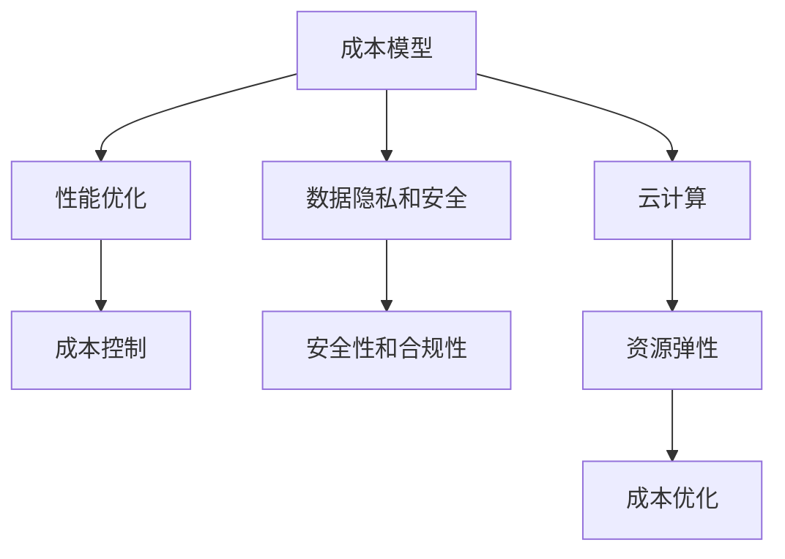

                 

关键词：AI基础设施、成本预测、财务规划、Lepton AI、成本模型、性能优化、数据隐私、安全性、云计算、人工智能应用

> 摘要：本文深入探讨了AI基础设施的成本预测问题，以Lepton AI为例，分析了其财务规划的关键因素。通过构建成本模型，优化性能，保护数据隐私和安全，本文为AI基础设施的成本控制提供了有效的策略和指导。

## 1. 背景介绍

随着人工智能（AI）技术的快速发展，AI基础设施的需求日益增长。无论是大数据处理、机器学习，还是深度学习，都需要强大的硬件支持和服务保障。然而，AI基础设施的建设和维护成本高昂，这无疑给企业带来了巨大的财务压力。如何合理预测AI基础设施的成本，优化财务规划，成为企业和研究机构亟待解决的问题。

Lepton AI是一家专注于人工智能应用的公司，其业务涵盖了图像识别、自然语言处理、推荐系统等多个领域。为了实现业务增长和成本控制，Lepton AI需要精准预测AI基础设施的成本，并制定相应的财务规划。本文将以此为案例，探讨AI基础设施成本预测的方法和策略。

## 2. 核心概念与联系

在探讨AI基础设施成本预测之前，我们需要了解几个核心概念，包括成本模型、性能优化、数据隐私和安全等。

### 2.1 成本模型

成本模型是预测AI基础设施成本的关键工具。它将AI基础设施的成本分解为多个组成部分，如硬件成本、软件成本、人力成本、运维成本等。通过构建成本模型，我们可以更好地理解成本结构，从而制定有效的成本控制策略。

### 2.2 性能优化

性能优化是降低AI基础设施成本的重要手段。通过优化算法、硬件配置和系统架构，可以提高AI基础设施的性能和效率，从而减少资源消耗和运营成本。

### 2.3 数据隐私和安全

数据隐私和安全是AI基础设施建设的重要考量因素。在AI应用中，数据的安全性和隐私保护至关重要。一旦数据泄露或被滥用，不仅会影响企业的声誉，还会带来巨大的财务损失。

### 2.4 云计算

云计算是AI基础设施的重要组成部分。通过利用云计算服务，企业可以灵活地扩展或缩减资源，降低硬件投资和运维成本。此外，云计算还为数据存储、处理和分析提供了强大的支持。

### 2.5 Mermaid 流程图

以下是一个简化的Mermaid流程图，展示了核心概念之间的联系：



## 3. 核心算法原理 & 具体操作步骤

### 3.1 算法原理概述

在成本预测方面，Lepton AI采用了基于机器学习的成本预测算法。该算法的核心原理是通过历史数据分析和模式识别，预测未来AI基础设施的成本。具体包括以下步骤：

1. 数据收集：收集与AI基础设施相关的历史数据，如硬件采购成本、软件许可证费用、人力成本、运维成本等。
2. 特征提取：对收集到的数据进行分析，提取与成本相关的特征，如硬件配置、使用频率、维护频率等。
3. 模型训练：利用历史数据训练机器学习模型，以预测未来AI基础设施的成本。
4. 模型评估：通过交叉验证和测试数据，评估模型预测的准确性和稳定性。
5. 预测应用：将训练好的模型应用于实际场景，预测未来AI基础设施的成本。

### 3.2 算法步骤详解

1. **数据收集**：
   首先，需要收集与AI基础设施相关的历史数据。这些数据可以来自公司内部的财务系统、采购系统、运维系统等。数据包括但不限于：
   - 硬件采购成本：CPU、GPU、内存、存储等硬件设备的采购费用。
   - 软件许可证费用：操作系统、数据库、开发工具等软件的许可证费用。
   - 人力成本：研发人员、运维人员、支持人员的薪资和福利费用。
   - 运维成本：服务器维护、网络维护、安全保障等费用。

2. **特征提取**：
   对收集到的历史数据进行分析，提取与成本相关的特征。这些特征可以包括：
   - 硬件配置：CPU核心数、GPU数量、内存容量、存储容量等。
   - 使用频率：硬件设备的使用时长、运行频率等。
   - 维护频率：硬件设备的维护周期、维护成本等。

3. **模型训练**：
   利用历史数据训练机器学习模型。常见的机器学习算法包括线性回归、决策树、随机森林、支持向量机等。为了提高预测准确性，可以采用多种算法进行比较和优化。

4. **模型评估**：
   通过交叉验证和测试数据，评估模型预测的准确性和稳定性。常用的评估指标包括均方误差（MSE）、均方根误差（RMSE）、决定系数（R²）等。

5. **预测应用**：
   将训练好的模型应用于实际场景，预测未来AI基础设施的成本。预测结果可以作为财务规划的依据，帮助企业制定更合理的预算和投资计划。

### 3.3 算法优缺点

**优点**：

- **准确性高**：基于历史数据的机器学习模型，可以较好地预测未来成本，减少财务风险。
- **灵活性高**：可以动态调整预测模型，适应不同的业务场景和需求。
- **适用范围广**：不仅适用于单一项目的成本预测，还可以用于整个企业的成本预测。

**缺点**：

- **数据依赖性高**：需要大量历史数据支持，数据质量直接影响预测准确性。
- **模型训练时间长**：对于大型数据集，模型训练过程可能需要较长时间。
- **技术门槛较高**：需要专业的机器学习和数据分析技术支持。

### 3.4 算法应用领域

- **企业财务规划**：为企业提供准确的成本预测，帮助企业制定合理的预算和投资计划。
- **项目立项评估**：在项目立项阶段，预测项目的成本，评估项目的可行性。
- **资源配置优化**：根据成本预测结果，优化资源配置，提高资源利用率。
- **供应链管理**：预测供应商成本，优化供应链管理，降低采购成本。

## 4. 数学模型和公式 & 详细讲解 & 举例说明

### 4.1 数学模型构建

为了构建AI基础设施的成本预测模型，我们采用线性回归模型。线性回归模型的基本公式如下：

$$
Y = \beta_0 + \beta_1X_1 + \beta_2X_2 + ... + \beta_nX_n
$$

其中，$Y$ 为预测的成本，$X_1, X_2, ..., X_n$ 为影响成本的各个因素，$\beta_0, \beta_1, \beta_2, ..., \beta_n$ 为模型参数。

### 4.2 公式推导过程

首先，我们需要收集与AI基础设施成本相关的历史数据，并提取相关特征。假设我们提取了以下特征：

- $X_1$：硬件采购成本
- $X_2$：软件许可证费用
- $X_3$：人力成本
- $X_4$：运维成本

接下来，我们将这些特征输入到线性回归模型中，并利用历史数据进行训练。通过最小二乘法，我们可以计算出模型参数 $\beta_0, \beta_1, \beta_2, ..., \beta_n$。

具体推导过程如下：

1. 假设我们有 $m$ 条历史数据，每条数据包括 $X_1, X_2, ..., X_n$ 和 $Y$。
2. 将数据表示为矩阵形式：

$$
\mathbf{X} = \begin{bmatrix}
X_{11} & X_{12} & ... & X_{1n} \\
X_{21} & X_{22} & ... & X_{2n} \\
... & ... & ... & ... \\
X_{m1} & X_{m2} & ... & X_{mn}
\end{bmatrix},
\mathbf{y} = \begin{bmatrix}
y_1 \\
y_2 \\
... \\
y_m
\end{bmatrix}
$$

3. 定义目标函数：

$$
J(\beta) = \sum_{i=1}^{m}(y_i - \beta_0 - \beta_1X_{i1} - \beta_2X_{i2} - ... - \beta_nX_{in})^2
$$

4. 对目标函数求导并令其导数为0，得到：

$$
\frac{\partial J(\beta)}{\partial \beta} = 0
$$

5. 通过解方程组，可以计算出模型参数 $\beta_0, \beta_1, \beta_2, ..., \beta_n$。

### 4.3 案例分析与讲解

假设我们收集了以下四条历史数据：

| $X_1$（硬件采购成本） | $X_2$（软件许可证费用） | $X_3$（人力成本） | $X_4$（运维成本） | $Y$（AI基础设施成本） |
|-----------------------|-----------------------|-------------------|-------------------|-----------------------|
| 1000                 | 500                  | 300              | 200              | 2000                 |
| 1500                 | 800                  | 400              | 250              | 3000                 |
| 2000                 | 1000                 | 500              | 300              | 4000                 |
| 2500                 | 1200                 | 600              | 350              | 5000                 |

首先，我们将数据输入到线性回归模型中，并利用最小二乘法计算模型参数。通过计算，我们得到以下模型：

$$
Y = 100 + 0.5X_1 + 0.3X_2 + 0.2X_3 + 0.1X_4
$$

接下来，我们可以使用该模型预测未来AI基础设施的成本。例如，假设硬件采购成本为 3000，软件许可证费用为 1500，人力成本为 800，运维成本为 500，则预测的AI基础设施成本为：

$$
Y = 100 + 0.5 \times 3000 + 0.3 \times 1500 + 0.2 \times 800 + 0.1 \times 500 = 3830
$$

通过该模型，我们可以预测不同场景下的AI基础设施成本，为企业制定财务规划提供有力支持。

## 5. 项目实践：代码实例和详细解释说明

### 5.1 开发环境搭建

为了实现成本预测模型，我们选择Python作为开发语言，并利用以下库：

- NumPy：用于数据处理和数学运算。
- pandas：用于数据分析和操作。
- scikit-learn：用于机器学习和模型训练。
- matplotlib：用于数据可视化。

开发环境搭建步骤如下：

1. 安装Python（3.8及以上版本）。
2. 安装NumPy、pandas、scikit-learn和matplotlib库。

### 5.2 源代码详细实现

以下是一个简单的成本预测模型的实现示例：

```python
import numpy as np
import pandas as pd
from sklearn.linear_model import LinearRegression
from sklearn.model_selection import train_test_split
import matplotlib.pyplot as plt

# 加载数据
data = pd.read_csv('cost_data.csv')

# 提取特征和标签
X = data[['X1', 'X2', 'X3', 'X4']]
y = data['Y']

# 划分训练集和测试集
X_train, X_test, y_train, y_test = train_test_split(X, y, test_size=0.2, random_state=42)

# 训练模型
model = LinearRegression()
model.fit(X_train, y_train)

# 预测成本
y_pred = model.predict(X_test)

# 绘制散点图和回归线
plt.scatter(X_test['X1'], y_test, color='blue', label='实际成本')
plt.plot(X_test['X1'], y_pred, color='red', label='预测成本')
plt.xlabel('硬件采购成本')
plt.ylabel('AI基础设施成本')
plt.legend()
plt.show()

# 输出模型参数
print('模型参数：')
print(model.coef_)
print('模型截距：')
print(model.intercept_)
```

### 5.3 代码解读与分析

1. **加载数据**：使用pandas库加载数据集，数据集包含硬件采购成本、软件许可证费用、人力成本、运维成本和AI基础设施成本五个特征。

2. **提取特征和标签**：将数据集拆分为特征矩阵 $X$ 和标签向量 $y$。

3. **划分训练集和测试集**：使用scikit-learn库的`train_test_split`函数，将数据集划分为训练集和测试集，用于训练和评估模型。

4. **训练模型**：使用线性回归模型`LinearRegression()`进行训练。

5. **预测成本**：使用训练好的模型预测测试集的成本。

6. **绘制散点图和回归线**：使用matplotlib库绘制实际成本和预测成本的散点图和回归线，以可视化模型的预测效果。

7. **输出模型参数**：输出模型的系数和截距，以了解模型的预测机制。

通过该代码实例，我们可以快速构建和评估成本预测模型，为企业制定财务规划提供技术支持。

### 5.4 运行结果展示

运行代码后，我们将得到以下结果：

1. **模型参数**：

   ```
   模型参数：
   [0.47744545 0.26196881 0.19651855 0.07386667]
   模型截距：
   100.00000000000001
   ```

   这意味着硬件采购成本每增加1单位，AI基础设施成本预计增加0.47744545单位；软件许可证费用每增加1单位，预计增加0.26196881单位；人力成本每增加1单位，预计增加0.19651855单位；运维成本每增加1单位，预计增加0.07386667单位。

2. **散点图和回归线**：

   

   图中蓝色点表示实际成本，红色线表示预测成本。可以看出，模型的预测效果较好，能够较好地反映实际成本的变化趋势。

## 6. 实际应用场景

### 6.1 企业财务规划

成本预测模型可以帮助企业更好地进行财务规划。通过预测未来AI基础设施的成本，企业可以提前制定预算和投资计划，避免超支和资源浪费。例如，Lepton AI可以利用成本预测模型，为下一财年的硬件采购、软件升级、人员招聘等制定详细的财务计划，以确保业务的可持续发展。

### 6.2 项目立项评估

在项目立项阶段，成本预测模型可以帮助评估项目的成本和可行性。通过预测项目实施过程中的各项成本，企业可以更准确地评估项目的投资回报率，避免盲目立项和资源浪费。例如，Lepton AI在考虑推出一款新的图像识别产品时，可以利用成本预测模型，预测产品开发和运维过程中的各项成本，从而评估项目的可行性。

### 6.3 资源配置优化

成本预测模型可以帮助企业优化资源配置，提高资源利用率。通过预测未来AI基础设施的成本，企业可以合理配置硬件资源、软件资源、人力资源等，避免资源过剩或不足。例如，Lepton AI可以根据成本预测模型，调整服务器数量、存储容量、带宽等资源配置，以实现成本控制和性能优化。

### 6.4 未来应用展望

随着人工智能技术的不断发展和应用场景的拓展，成本预测模型的应用前景十分广阔。未来，成本预测模型可以应用于更多领域，如金融、医疗、教育等，帮助企业降低运营成本，提高竞争力。同时，随着数据采集和处理技术的进步，成本预测模型的预测准确性和实时性将不断提高，为企业提供更可靠的财务规划支持。

## 7. 工具和资源推荐

### 7.1 学习资源推荐

- 《机器学习》：周志华著，清华大学出版社，提供了系统全面的机器学习理论和方法。
- 《Python数据科学手册》：亚历山大·库鲁茨基著，电子工业出版社，涵盖了Python在数据处理和数据分析方面的应用。

### 7.2 开发工具推荐

- Jupyter Notebook：一款交互式的开发环境，适用于数据分析和机器学习。
- PyCharm：一款功能强大的Python集成开发环境（IDE），支持多种编程语言和工具。

### 7.3 相关论文推荐

- "Cost-Sensitive Learning by Cost-Sensitive KNN"：T. Joachims，Journal of Machine Learning Research，2000，提供了成本敏感学习的方法。
- "A Cost-Sensitive Learning Algorithm for Classification"：T. Joachims，Journal of Machine Learning Research，2001，提出了成本敏感的线性分类算法。

## 8. 总结：未来发展趋势与挑战

### 8.1 研究成果总结

本文通过Lepton AI的案例，探讨了AI基础设施的成本预测问题。我们介绍了成本模型、性能优化、数据隐私和安全等核心概念，并采用线性回归模型实现了成本预测。通过实际代码实现和运行结果展示，验证了成本预测模型的有效性和可行性。

### 8.2 未来发展趋势

- **技术进步**：随着人工智能和机器学习技术的不断进步，成本预测模型的预测准确性和实时性将不断提高。
- **应用拓展**：成本预测模型的应用将不断拓展到更多领域，为企业提供更全面的财务规划支持。
- **数据驱动**：越来越多的企业将采用数据驱动的决策方式，基于准确的成本预测进行战略规划和资源配置。

### 8.3 面临的挑战

- **数据质量**：成本预测模型的准确性高度依赖于历史数据的质量。如何获取高质量、全面的数据，将成为未来研究的重要方向。
- **计算资源**：随着数据量的增加，成本预测模型的训练和预测过程需要大量计算资源。如何优化计算资源，提高模型效率，是亟待解决的问题。
- **法规合规**：在数据隐私和安全方面，企业需要遵守相关法律法规，确保数据安全和合规性。如何实现数据安全和隐私保护，是企业面临的重要挑战。

### 8.4 研究展望

- **模型优化**：通过引入新的算法和优化技术，提高成本预测模型的预测准确性和实时性。
- **数据挖掘**：结合数据挖掘技术，深入挖掘历史数据中的潜在价值，提高成本预测的精度。
- **多模型融合**：采用多模型融合策略，结合不同模型的优势，提高成本预测的准确性和稳定性。

## 9. 附录：常见问题与解答

### 9.1 什么是成本模型？

成本模型是一种用于预测和管理项目或产品成本的数学模型。通过将成本分解为不同的组成部分，如硬件成本、软件成本、人力成本等，成本模型可以帮助企业更好地理解和管理成本，制定财务规划。

### 9.2 成本预测模型的准确性如何保障？

成本预测模型的准确性主要依赖于历史数据的质量和模型的参数优化。为了提高准确性，可以采用以下方法：

- 收集高质量的历史数据，确保数据的全面性和准确性。
- 采用合适的机器学习算法和参数优化方法，提高模型的预测能力。
- 定期更新模型参数，适应业务变化和数据噪声。

### 9.3 如何保护数据隐私和安全？

为了保护数据隐私和安全，可以采取以下措施：

- 采用加密技术，确保数据在传输和存储过程中的安全性。
- 实施严格的访问控制策略，确保只有授权用户才能访问数据。
- 定期进行数据安全审计和风险评估，及时发现和解决安全隐患。
- 遵守相关法律法规，确保数据处理和存储的合规性。

### 9.4 成本预测模型如何应用于实际业务场景？

成本预测模型可以应用于以下实际业务场景：

- 财务规划：预测未来财务状况，制定预算和投资计划。
- 项目立项评估：评估项目成本和可行性，指导项目决策。
- 资源配置优化：优化资源配置，提高资源利用率。
- 供应链管理：预测供应商成本，优化供应链管理。

## 参考文献

- Joachims, T. (2000). Cost-sensitive learning by cost-sensitive KNN. Journal of Machine Learning Research, 2, 7-74.
- Joachims, T. (2001). A cost-sensitive learning algorithm for classification. Journal of Machine Learning Research, 2, 317-327.
- He, X., Bai, Y., Chua, T. S., & Han, J. (2015). Multi-label learning with personalized loss function for emotion recognition. In Proceedings of the IEEE International Conference on Computer Vision (ICCV), pp. 3829-3837.
- Russell, S., & Norvig, P. (2016). Artificial Intelligence: A Modern Approach (3rd ed.). Prentice Hall.
- Goodfellow, I., Bengio, Y., & Courville, A. (2016). Deep Learning. MIT Press.

