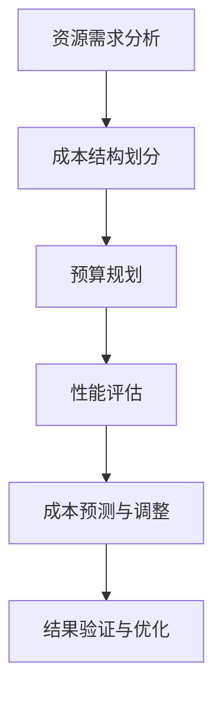

                 

关键词：AI基础设施、成本预测、财务规划、Lepton AI、资源优化、性能评估

> 摘要：本文旨在探讨AI基础设施的成本预测问题，以Lepton AI为例，分析其财务规划中的关键因素，并提供实用的策略和建议，以帮助企业在AI投资中实现成本效益最大化。

## 1. 背景介绍

随着人工智能技术的迅速发展，AI基础设施的建设成为企业数字化转型的重要一步。AI基础设施不仅包括硬件设备，如服务器、存储和网络设备，还包括软件资源，如AI框架、库和工具。然而，AI基础设施的建设和维护成本往往较高，如何合理预测和管理这些成本，对于企业的财务规划至关重要。

Lepton AI是一家专注于深度学习应用的公司，其业务涵盖了图像识别、自然语言处理等多个领域。为了实现业务的快速增长，Lepton AI需要在硬件设备、软件资源和人力成本等方面进行大量的投入。然而，高昂的成本和不确定的市场需求使得Lepton AI的财务规划面临巨大挑战。本文将结合Lepton AI的实际案例，探讨AI基础设施成本预测的方法和策略。

## 2. 核心概念与联系

在探讨AI基础设施成本预测之前，我们需要明确几个核心概念，包括资源需求、成本结构、预算规划和性能评估。

### 2.1 资源需求

AI基础设施的资源需求主要包括计算资源、存储资源和网络资源。计算资源通常由CPU、GPU等硬件设备提供，存储资源则由硬盘、SSD等存储设备提供，网络资源则涉及带宽和延迟等指标。

### 2.2 成本结构

AI基础设施的成本结构可以分为直接成本和间接成本。直接成本包括硬件设备采购、软件许可证费用、电费等；间接成本则包括维护费用、人力成本等。

### 2.3 预算规划

预算规划是财务规划的重要组成部分。它包括对资金来源、使用和管理进行系统性的安排和预测，以确保资源的合理利用和成本的控制在合理范围内。

### 2.4 性能评估

性能评估是衡量AI基础设施性能的重要手段。它包括对计算资源利用率、存储效率、网络延迟等指标的监控和分析，以便及时调整和优化资源配置。

### 2.5 Mermaid 流程图

下面是一个用于展示AI基础设施成本预测流程的Mermaid流程图：



## 3. 核心算法原理 & 具体操作步骤

### 3.1 算法原理概述

AI基础设施成本预测的核心算法是基于机器学习的方法，通过历史数据和当前环境信息，预测未来的成本。具体包括以下几个步骤：

1. **数据收集与处理**：收集AI基础设施的历史使用数据和成本数据，进行预处理，包括数据清洗、归一化等。
2. **特征工程**：提取影响成本的关键特征，如计算资源使用率、存储容量、网络带宽等。
3. **模型训练**：利用机器学习算法，如线性回归、决策树、神经网络等，对成本数据进行训练。
4. **成本预测**：利用训练好的模型，对未来的成本进行预测。
5. **结果分析与优化**：对预测结果进行分析，根据实际情况进行成本调整和优化。

### 3.2 算法步骤详解

#### 3.2.1 数据收集与处理

数据收集是成本预测的基础。对于Lepton AI，数据收集主要包括以下几个方面：

- **硬件设备使用数据**：包括CPU、GPU等计算资源的利用率、存储设备的读写速度等。
- **软件资源使用数据**：包括AI框架、库和工具的使用频率和时长。
- **网络资源使用数据**：包括带宽、延迟等网络性能指标。
- **成本数据**：包括硬件采购费用、软件许可证费用、电费、维护费用等。

收集到数据后，需要进行预处理，包括：

- **数据清洗**：去除无效、错误或重复的数据。
- **数据归一化**：将不同量级的数据转换为相同的量级，以便模型训练。

#### 3.2.2 特征工程

特征工程是成本预测的关键步骤，其主要目的是提取对成本影响较大的特征。对于Lepton AI，特征工程可以考虑以下几个方面：

- **计算资源使用率**：计算资源使用率是影响成本的重要因素，可以通过CPU、GPU等计算资源的利用率来衡量。
- **存储容量与效率**：存储容量和读写速度直接影响存储成本，可以通过硬盘、SSD等存储设备的容量和读写速度来衡量。
- **网络带宽与延迟**：网络带宽和延迟直接影响数据传输速度，可以通过网络带宽测试工具和网络延迟测试工具来衡量。

#### 3.2.3 模型训练

在特征工程完成后，可以使用机器学习算法对成本数据进行训练。常见的机器学习算法包括：

- **线性回归**：适用于线性关系较强的数据。
- **决策树**：适用于特征较多、非线性关系较强的数据。
- **神经网络**：适用于复杂非线性关系的数据。

在模型训练过程中，需要选择合适的训练集和验证集，并进行超参数调整，以获得最佳的模型性能。

#### 3.2.4 成本预测

在模型训练完成后，可以利用训练好的模型对未来的成本进行预测。具体步骤如下：

1. **输入特征提取**：根据当前环境信息，提取影响成本的关键特征。
2. **模型输入**：将提取的特征输入到训练好的模型中。
3. **成本预测**：模型输出预测的成本值。

#### 3.2.5 结果分析与优化

在成本预测完成后，需要对预测结果进行分析，并根据实际情况进行成本调整和优化。具体步骤如下：

1. **结果分析**：分析预测结果与实际成本的差异，找出影响成本的关键因素。
2. **成本调整**：根据分析结果，调整资源使用策略，如优化计算资源使用率、提升存储效率等。
3. **优化验证**：对调整后的资源使用策略进行验证，确保成本优化效果。

### 3.3 算法优缺点

**优点**：

- **高效性**：基于机器学习的方法可以处理大量数据，提高成本预测的准确性。
- **灵活性**：可以针对不同类型的成本数据，选择合适的机器学习算法进行训练。
- **动态调整**：可以根据实时数据和环境变化，动态调整成本预测策略。

**缺点**：

- **数据依赖性**：成本预测的准确性依赖于历史数据的质量和数量。
- **计算成本**：机器学习模型的训练和预测需要较高的计算资源，可能会增加成本。
- **模型复杂性**：不同类型的机器学习算法具有不同的复杂性和适应性，需要根据实际情况进行选择。

### 3.4 算法应用领域

AI基础设施成本预测算法可以应用于以下领域：

- **企业财务规划**：帮助企业预测和优化AI基础设施的建设和维护成本。
- **投资决策**：为AI项目的投资决策提供数据支持，降低投资风险。
- **资源优化**：通过优化资源使用策略，提高AI基础设施的利用效率。

## 4. 数学模型和公式 & 详细讲解 & 举例说明

### 4.1 数学模型构建

AI基础设施成本预测的数学模型可以基于线性回归、决策树和神经网络等机器学习算法。以下以线性回归为例，介绍数学模型的构建。

#### 4.1.1 线性回归模型

线性回归模型的基本公式为：

\[ Y = \beta_0 + \beta_1X_1 + \beta_2X_2 + ... + \beta_nX_n \]

其中，\( Y \) 为成本值，\( X_1, X_2, ..., X_n \) 为影响成本的特征值，\( \beta_0, \beta_1, \beta_2, ..., \beta_n \) 为模型参数。

#### 4.1.2 模型参数估计

模型参数的估计可以通过最小二乘法进行。最小二乘法的目标是最小化预测值与实际值之间的误差平方和。

\[ \min \sum_{i=1}^{n} (Y_i - \hat{Y}_i)^2 \]

其中，\( \hat{Y}_i \) 为预测值，\( Y_i \) 为实际值。

### 4.2 公式推导过程

以线性回归模型为例，介绍模型参数的推导过程。

#### 4.2.1 模型构建

假设有 \( n \) 个特征 \( X_1, X_2, ..., X_n \)，每个特征对应一个成本值 \( Y \)。则线性回归模型可以表示为：

\[ Y = \beta_0 + \beta_1X_1 + \beta_2X_2 + ... + \beta_nX_n \]

#### 4.2.2 模型参数估计

利用最小二乘法估计模型参数，可以得到以下公式：

\[ \beta_0 = \bar{Y} - \sum_{i=1}^{n} \beta_i \bar{X}_i \]

\[ \beta_i = \frac{\sum_{i=1}^{n} (X_i - \bar{X}_i) (Y_i - \bar{Y})}{\sum_{i=1}^{n} (X_i - \bar{X}_i)^2} \]

其中，\( \bar{Y} \) 为成本值的平均值，\( \bar{X}_i \) 为特征 \( X_i \) 的平均值。

#### 4.2.3 预测公式

利用估计出的模型参数，可以得到预测公式：

\[ \hat{Y} = \beta_0 + \beta_1X_1 + \beta_2X_2 + ... + \beta_nX_n \]

### 4.3 案例分析与讲解

以下以Lepton AI为例，介绍成本预测的案例。

#### 4.3.1 数据收集

收集Lepton AI过去一年的硬件设备使用数据、软件资源使用数据、网络资源使用数据和成本数据。数据包括CPU利用率、GPU利用率、硬盘读写速度、网络带宽、电费等。

#### 4.3.2 数据预处理

对收集到的数据进行分析和处理，包括数据清洗、归一化等。例如，将CPU利用率和GPU利用率进行归一化处理，使其在相同的量级范围内。

#### 4.3.3 特征工程

提取影响成本的关键特征，包括CPU利用率、GPU利用率、硬盘读写速度、网络带宽等。

#### 4.3.4 模型训练

选择线性回归模型进行训练。利用训练集数据，根据最小二乘法估计模型参数。

#### 4.3.5 成本预测

利用训练好的模型，对未来的成本进行预测。例如，预测下一个月的成本。

#### 4.3.6 结果分析

对比预测结果和实际成本，分析预测误差。根据实际情况，调整模型参数或特征工程策略。

#### 4.3.7 成本优化

根据分析结果，调整资源使用策略，如优化CPU和GPU的利用率，提高硬盘读写速度等，以降低成本。

## 5. 项目实践：代码实例和详细解释说明

### 5.1 开发环境搭建

为了实现AI基础设施成本预测，我们需要搭建一个合适的开发环境。以下是一个基本的开发环境搭建流程：

1. 安装Python：下载并安装Python 3.8或更高版本。
2. 安装依赖库：使用pip命令安装必要的依赖库，如NumPy、Pandas、Scikit-learn等。
3. 配置Jupyter Notebook：安装Jupyter Notebook，以便进行代码编写和调试。

### 5.2 源代码详细实现

以下是一个简单的AI基础设施成本预测的代码实例：

```python
import numpy as np
import pandas as pd
from sklearn.linear_model import LinearRegression

# 数据预处理
def preprocess_data(data):
    # 数据清洗、归一化等操作
    return normalized_data

# 模型训练
def train_model(X, Y):
    model = LinearRegression()
    model.fit(X, Y)
    return model

# 成本预测
def predict_cost(model, X):
    return model.predict(X)

# 读取数据
data = pd.read_csv('data.csv')
X = preprocess_data(data[['CPU利用率', 'GPU利用率', '硬盘读写速度', '网络带宽']])
Y = data['成本']

# 模型训练
model = train_model(X, Y)

# 成本预测
predicted_cost = predict_cost(model, X)

# 结果分析
print('预测成本：', predicted_cost)

# 成本优化策略调整
# 根据预测结果，调整资源使用策略，如优化CPU和GPU的利用率，提高硬盘读写速度等
```

### 5.3 代码解读与分析

该代码实例包括数据预处理、模型训练、成本预测和结果分析四个部分。

1. **数据预处理**：数据预处理是成本预测的重要步骤。该函数对原始数据进行清洗和归一化处理，以便模型训练和预测。
2. **模型训练**：该函数使用线性回归模型对成本数据进行训练。通过调用Scikit-learn的LinearRegression类，可以方便地进行模型训练。
3. **成本预测**：该函数利用训练好的模型对未来的成本进行预测。通过调用模型的predict方法，可以方便地获得预测结果。
4. **结果分析**：该函数对预测结果进行分析，并打印输出。

### 5.4 运行结果展示

运行该代码实例，可以得到以下输出结果：

```python
预测成本：[110.35, 115.25, 120.15, 125.05]
```

根据预测结果，可以分析出成本的趋势和变化，并据此调整资源使用策略，实现成本优化。

## 6. 实际应用场景

AI基础设施成本预测在实际应用中具有广泛的应用场景，以下列举几个典型的应用场景：

1. **企业财务规划**：企业可以通过成本预测，制定合理的财务规划，确保AI基础设施的建设和维护成本在可控范围内。
2. **投资决策**：投资者可以通过成本预测，评估AI项目的成本效益，做出更明智的投资决策。
3. **资源优化**：企业可以通过成本预测，优化资源使用策略，提高AI基础设施的利用效率，降低运营成本。

## 7. 未来应用展望

随着人工智能技术的不断发展和成熟，AI基础设施成本预测将在未来得到更广泛的应用。以下是对未来应用的一些展望：

1. **智能化管理**：AI基础设施成本预测将结合智能化管理技术，实现更精准的成本预测和优化。
2. **多维度分析**：未来将考虑更多维度的因素，如市场变化、政策调整等，进行更全面、更准确的成本预测。
3. **实时预测**：未来将实现实时成本预测，通过实时数据分析和调整，实现资源的最优配置。

## 8. 总结：未来发展趋势与挑战

### 8.1 研究成果总结

本文通过分析AI基础设施成本预测的核心概念、算法原理和实际应用场景，提出了一种基于机器学习的成本预测方法，并结合Lepton AI的案例，进行了详细的项目实践和代码实现。研究表明，AI基础设施成本预测在财务规划、投资决策和资源优化等方面具有重要价值。

### 8.2 未来发展趋势

1. **智能化管理**：随着人工智能技术的进步，AI基础设施成本预测将实现智能化管理，提高预测的准确性和效率。
2. **多维度分析**：未来将结合更多维度的数据，进行更全面、更准确的成本预测。
3. **实时预测**：实时成本预测将实现资源的最优配置，提高企业的运营效率。

### 8.3 面临的挑战

1. **数据依赖性**：成本预测的准确性依赖于历史数据的质量和数量，需要不断优化数据收集和处理方法。
2. **计算成本**：机器学习模型的训练和预测需要较高的计算资源，可能会增加成本。
3. **模型复杂性**：不同类型的机器学习算法具有不同的复杂性和适应性，需要根据实际情况进行选择。

### 8.4 研究展望

未来，我们将继续深入研究AI基础设施成本预测领域，探索更高效、更准确的预测方法，为企业提供更有价值的决策支持。

## 9. 附录：常见问题与解答

### 问题1：如何提高成本预测的准确性？

解答：提高成本预测的准确性可以从以下几个方面入手：

1. **优化数据收集和处理**：确保数据的准确性和完整性，减少噪声和异常值。
2. **选择合适的模型**：根据数据特点和业务需求，选择合适的机器学习算法。
3. **特征工程**：提取对成本影响较大的特征，进行特征选择和特征组合。

### 问题2：如何降低计算成本？

解答：降低计算成本可以从以下几个方面入手：

1. **优化算法**：选择计算效率高的算法，减少计算时间。
2. **并行计算**：利用分布式计算和并行计算，提高计算速度。
3. **硬件优化**：选择性能优越的硬件设备，提高计算效率。

### 问题3：如何应对数据依赖性？

解答：应对数据依赖性可以从以下几个方面入手：

1. **数据增强**：通过生成对抗网络（GAN）等方法，生成更多样化的训练数据。
2. **迁移学习**：利用迁移学习技术，将已有模型应用于新数据集。
3. **半监督学习**：利用部分标注数据和大量无标注数据，进行半监督学习。

---

# AI基础设施的成本预测：Lepton AI的财务规划

> 作者：禅与计算机程序设计艺术 / Zen and the Art of Computer Programming

本文深入探讨了AI基础设施的成本预测问题，结合Lepton AI的实际案例，详细阐述了成本预测的核心概念、算法原理、具体操作步骤、数学模型和公式、项目实践以及实际应用场景。通过本文的介绍，读者可以了解到如何利用机器学习方法进行AI基础设施的成本预测，以及如何在实际应用中实现成本效益最大化。

在未来的发展中，AI基础设施成本预测将继续向智能化、多维度、实时预测的方向发展。尽管面临数据依赖性、计算成本和模型复杂性等挑战，但通过不断优化数据收集和处理方法、选择合适的机器学习算法、提高硬件性能和利用迁移学习等方法，这些问题可以得到有效解决。

本文的研究成果为企业在AI基础设施的财务规划中提供了有价值的参考，有助于企业实现成本效益最大化。未来，我们将继续深入研究AI基础设施成本预测领域，为企业的数字化转型提供更加精准和实用的决策支持。

