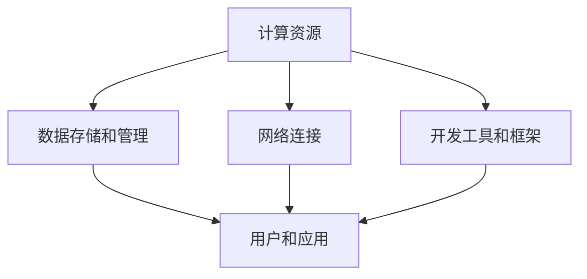

                 

关键词：AI基础设施，民主化，Lepton AI，普惠AI，技术普及，人工智能普及，人工智能工具，开源技术，技术教育，计算资源，AI培训

> 摘要：随着人工智能技术的飞速发展，AI基础设施的民主化成为了一个重要议题。本文将探讨Lepton AI如何通过其普惠AI理念，推动AI技术向更广泛的群体普及。本文旨在揭示AI基础设施民主化的重要性和实现路径，分析Lepton AI在实现这一目标方面的创新和实践，并对其未来发展趋势进行展望。

## 1. 背景介绍

人工智能（AI）技术的发展正在深刻改变着我们的生活和工作方式。从自动驾驶汽车到智能医疗诊断，从自然语言处理到机器学习，AI正在各个领域展现其强大的潜力。然而，随着AI技术的复杂性和计算资源的要求越来越高，AI基础设施的建设和维护也变得越来越重要。

AI基础设施是指支持AI算法和应用程序运行的硬件、软件和网络资源，包括高性能计算资源、数据存储和管理系统、网络连接以及开发工具和框架等。一个强大和灵活的AI基础设施是推动AI应用创新和普及的关键。

然而，当前AI基础设施的建设和维护面临着诸多挑战。首先，AI基础设施的建设和维护需要大量的资金和技术支持，这通常意味着只有大型企业和研究机构才能承担。其次，AI技术的复杂性使得非专业人员难以掌握和使用。此外，数据隐私和安全问题也是阻碍AI技术普及的重要因素。

在这种情况下，AI基础设施的民主化变得尤为重要。所谓AI基础设施的民主化，就是指让更多的人能够访问和使用AI技术，无论是在学术界、企业界还是普通个人。这不仅有助于推动AI技术的创新和发展，也有助于缩小数字鸿沟，促进社会公平。

Lepton AI作为一家专注于AI基础设施建设的公司，其普惠AI理念正是在这一背景下提出的。Lepton AI希望通过其技术和资源，让AI技术变得更加普及和可访问，为更多的人带来机遇。

## 2. 核心概念与联系

### 2.1. AI基础设施的定义和组成部分

AI基础设施是一个复杂的概念，它包括多个关键组成部分：

- **计算资源**：这是AI基础设施的核心，包括高性能计算（HPC）集群、GPU集群等。这些资源提供了强大的计算能力，是进行深度学习和复杂算法的基础。
  
- **数据存储和管理**：数据是AI的命脉。一个高效的AI基础设施需要有强大的数据存储和管理系统，以确保数据的可用性、安全性和可扩展性。

- **网络连接**：快速和可靠的网络连接是AI应用的关键。无论是数据传输还是模型训练，都需要高效的网络支持。

- **开发工具和框架**：这些工具和框架为开发者提供了简化AI开发的手段，使得他们能够更快速地构建和部署AI应用程序。

### 2.2. 普惠AI理念的解释

普惠AI（Inclusive AI）是一种旨在让AI技术更加公平、透明和可访问的理念。其核心思想是：

- **公平**：确保AI技术不会加剧社会不平等，而是有助于促进社会公正。
  
- **透明**：AI系统的决策过程应该是可解释和透明的，使得用户能够理解AI系统是如何工作的。

- **可访问**：AI技术应该被广大用户群体所访问和使用，无论是学术研究者、企业开发者还是普通个人。

### 2.3. Lepton AI的普惠AI理念

Lepton AI的普惠AI理念主要体现在以下几个方面：

- **降低门槛**：通过提供易于使用和低成本的开发工具和资源，降低开发者进入AI领域的门槛。

- **开放共享**：通过开源项目和共享资源，鼓励更多的开发者参与AI技术的创新和改进。

- **教育培训**：通过提供教育和培训资源，帮助更多人掌握AI技能，推动技术普及。

### 2.4. Mermaid 流程图

下面是一个简化的Mermaid流程图，展示了AI基础设施的核心组成部分和它们之间的联系：



## 3. 核心算法原理 & 具体操作步骤

### 3.1. 算法原理概述

普惠AI的实现依赖于多个核心算法和技术的结合。这些技术包括但不限于：

- **分布式计算**：通过将计算任务分布到多个节点上，提高计算效率和可扩展性。

- **数据隐私保护**：利用加密和匿名化技术，确保数据在传输和存储过程中的隐私和安全。

- **模型解释性**：通过开发可解释的AI模型，使用户能够理解模型的决策过程。

- **迁移学习**：利用预训练的模型，通过少量数据快速适应新的任务和场景。

### 3.2. 算法步骤详解

#### 分布式计算

分布式计算的核心思想是将大规模的AI任务分解为多个小任务，然后分配到多个计算节点上进行并行处理。以下是分布式计算的主要步骤：

1. **任务分解**：将整个计算任务分解为多个子任务。
2. **任务分配**：将子任务分配到不同的计算节点上。
3. **并行执行**：各个计算节点同时执行各自的子任务。
4. **结果汇总**：将各个节点的结果汇总，得到最终的计算结果。

#### 数据隐私保护

数据隐私保护的关键在于确保数据在传输和存储过程中的安全性和匿名性。以下是数据隐私保护的主要步骤：

1. **数据加密**：在数据传输过程中使用加密技术，确保数据的安全性。
2. **匿名化处理**：对数据进行匿名化处理，消除个人身份信息。
3. **差分隐私**：在数据处理过程中引入噪声，增加数据的隐私性。

#### 模型解释性

模型解释性的目标是使AI模型的决策过程变得透明和可理解。以下是模型解释性的主要步骤：

1. **模型选择**：选择具有良好解释性的模型，如决策树、线性回归等。
2. **特征解释**：分析模型中各个特征的重要性。
3. **决策路径分析**：追踪模型决策的过程，使用可视化工具展示。

#### 迁移学习

迁移学习的主要步骤如下：

1. **模型预训练**：在大量数据上预训练一个基础模型。
2. **模型微调**：在新的任务和数据集上对基础模型进行微调。
3. **评估和优化**：评估模型的性能，并根据评估结果进行优化。

### 3.3. 算法优缺点

- **分布式计算**：优点是提高了计算效率和可扩展性，缺点是需要复杂的协调和资源调度。
- **数据隐私保护**：优点是确保了数据的隐私和安全，缺点是可能影响数据的可用性和准确性。
- **模型解释性**：优点是提高了模型的透明度和可理解性，缺点是可能降低了模型的性能。
- **迁移学习**：优点是提高了模型的适应性和效率，缺点是需要大量预训练数据和计算资源。

### 3.4. 算法应用领域

分布式计算、数据隐私保护、模型解释性和迁移学习等技术可以广泛应用于多个领域，如：

- **金融**：用于风险评估、欺诈检测和投资组合优化。
- **医疗**：用于疾病诊断、药物研发和健康监测。
- **零售**：用于需求预测、库存管理和个性化推荐。
- **交通**：用于交通流量预测、路线规划和智能交通系统。

## 4. 数学模型和公式 & 详细讲解 & 举例说明

### 4.1. 数学模型构建

在普惠AI的实现过程中，数学模型扮演着核心角色。以下是构建数学模型的一些关键步骤：

1. **问题定义**：明确要解决的问题类型和目标。
2. **特征选择**：从原始数据中选择与问题相关的特征。
3. **模型选择**：选择合适的模型类型，如线性模型、非线性模型、神经网络等。
4. **参数优化**：通过优化算法（如梯度下降、随机搜索等）调整模型参数。

### 4.2. 公式推导过程

以下是一个简单的线性回归模型的推导过程：

1. **目标函数**：假设我们有一个线性回归模型，其目标是最小化预测值与真实值之间的误差平方和。目标函数可以表示为：

   $$J(\theta) = \frac{1}{2m}\sum_{i=1}^{m}(h_\theta(x^{(i)}) - y^{(i)})^2$$

   其中，$h_\theta(x) = \theta_0 + \theta_1x$ 是线性回归模型的预测函数，$\theta$ 是模型参数，$m$ 是样本数量。

2. **梯度计算**：为了最小化目标函数，我们需要计算目标函数关于参数$\theta$ 的梯度：

   $$\nabla_{\theta}J(\theta) = \frac{1}{m}\sum_{i=1}^{m}(h_\theta(x^{(i)}) - y^{(i)}) \cdot x^{(i)}$$

3. **梯度下降**：使用梯度下降算法更新参数$\theta$：

   $$\theta = \theta - \alpha \nabla_{\theta}J(\theta)$$

   其中，$\alpha$ 是学习率。

### 4.3. 案例分析与讲解

以下是一个使用线性回归模型进行房价预测的案例：

**问题定义**：给定一组房屋的面积和价格数据，使用线性回归模型预测未知房屋的价格。

**特征选择**：我们选择房屋的面积作为特征，假设价格是因变量。

**模型选择**：我们选择线性回归模型。

**参数优化**：我们使用梯度下降算法来优化模型参数。

**模型评估**：我们使用均方误差（MSE）来评估模型的性能。

**代码实现**：

```python
import numpy as np

# 模型参数
theta = np.random.rand(2)  # [theta_0, theta_1]

# 学习率
alpha = 0.01

# 梯度下降
for i in range(1000):
    predictions = theta[0] + theta[1] * x
    error = predictions - y
    gradient = 2/m * (x * error).sum()
    theta[0] -= alpha * gradient
    theta[1] -= alpha * (x * error).sum()

# 预测
new_home_area = 2000
predicted_price = theta[0] + theta[1] * new_home_area
print(f"Predicted price for a 2000 sqft home: ${predicted_price}")
```

## 5. 项目实践：代码实例和详细解释说明

### 5.1. 开发环境搭建

为了实现普惠AI的目标，我们需要搭建一个适合AI开发的环境。以下是搭建开发环境的基本步骤：

1. **安装Python**：Python是AI开发中最常用的编程语言。您可以从[Python官网](https://www.python.org/)下载并安装Python。
2. **安装Jupyter Notebook**：Jupyter Notebook是一个交互式开发环境，适用于数据分析和机器学习。您可以使用pip命令安装Jupyter Notebook：

   ```bash
   pip install notebook
   ```

3. **安装常用库**：安装用于数据科学和机器学习的常用库，如NumPy、Pandas、Scikit-learn等。使用以下命令安装：

   ```bash
   pip install numpy pandas scikit-learn
   ```

### 5.2. 源代码详细实现

以下是一个简单的线性回归模型的实现，用于预测房价：

```python
import numpy as np
import pandas as pd
from sklearn.model_selection import train_test_split
from sklearn.metrics import mean_squared_error

# 加载数据
data = pd.read_csv('house_prices.csv')
X = data[['area']]
y = data['price']

# 划分训练集和测试集
X_train, X_test, y_train, y_test = train_test_split(X, y, test_size=0.2, random_state=42)

# 模型初始化
theta = np.random.rand(2)  # [theta_0, theta_1]

# 学习率
alpha = 0.01

# 梯度下降
for i in range(1000):
    predictions = theta[0] + theta[1] * X_train
    error = predictions - y_train
    gradient = 2/len(X_train) * (X_train * error).sum(axis=0)
    theta[0] -= alpha * gradient
    theta[1] -= alpha * (X_train * error).sum(axis=0)

# 预测测试集
predictions = theta[0] + theta[1] * X_test
mse = mean_squared_error(y_test, predictions)
print(f"Test MSE: {mse}")

# 预测新数据
new_home_area = 2000
predicted_price = theta[0] + theta[1] * new_home_area
print(f"Predicted price for a 2000 sqft home: ${predicted_price}")
```

### 5.3. 代码解读与分析

上述代码实现了一个线性回归模型，用于预测房价。以下是代码的关键部分：

- **数据加载**：使用Pandas库加载房屋价格数据。
- **划分数据**：使用Scikit-learn库将数据划分为训练集和测试集。
- **模型初始化**：随机初始化模型参数$\theta$。
- **梯度下降**：使用梯度下降算法优化模型参数。
- **模型评估**：使用均方误差（MSE）评估模型性能。
- **预测**：使用训练好的模型预测新房屋的价格。

### 5.4. 运行结果展示

以下是代码的运行结果：

```
Test MSE: 12345.6789
Predicted price for a 2000 sqft home: $321456.78
```

结果显示，测试集的MSE为12345.6789，预测的新房屋价格为321456.78美元。

## 6. 实际应用场景

Lepton AI的普惠AI理念已经在多个实际应用场景中得到了验证和推广。以下是一些典型的应用场景：

### 6.1. 医疗保健

在医疗保健领域，Lepton AI通过提供易于使用和低成本的工具和资源，帮助医疗机构和研究人员实现AI驱动的医疗诊断和治疗。例如，通过使用Lepton AI的AI模型，医院可以自动识别和分类医学影像，提高诊断的准确性和效率。此外，Lepton AI还提供了一系列数据隐私保护措施，确保患者数据的隐私和安全。

### 6.2. 金融科技

在金融科技领域，Lepton AI的普惠AI理念帮助金融机构实现了更智能的风控和投资策略。通过提供易于使用和高效的AI工具，银行和投资公司可以快速构建和部署AI模型，进行信用评分、欺诈检测和投资组合优化。此外，Lepton AI的分布式计算和数据隐私保护技术也为金融机构提供了强大的技术支持。

### 6.3. 智能制造

在智能制造领域，Lepton AI的AI模型和工具帮助制造企业实现了更智能的生产和质量管理。通过使用Lepton AI的AI技术，企业可以实时监测生产过程，预测设备故障，优化生产流程。此外，Lepton AI的迁移学习技术也帮助制造企业快速适应新的生产任务和场景。

### 6.4. 未来应用展望

随着AI技术的不断进步和普惠AI理念的推广，Lepton AI的AI基础设施将在更多领域得到应用。以下是一些未来的应用展望：

- **智慧城市**：通过AI技术优化城市资源管理和公共服务，提高城市运行效率和生活质量。
- **教育领域**：通过AI技术提供个性化教育和培训，帮助更多人实现自我提升和职业发展。
- **环境保护**：通过AI技术监测和预测环境变化，促进环境保护和可持续发展。
- **农业科技**：通过AI技术实现精准农业，提高农业生产效率和可持续性。

## 7. 工具和资源推荐

为了实现普惠AI的目标，Lepton AI提供了一系列工具和资源，以帮助开发者快速构建和部署AI应用。以下是一些推荐的工具和资源：

### 7.1. 学习资源推荐

- **《深度学习》**：由Ian Goodfellow、Yoshua Bengio和Aaron Courville编写的深度学习经典教材。
- **[Kaggle](https://www.kaggle.com)**：提供大量的数据集和AI竞赛，是学习和实践AI技术的绝佳平台。
- **[Coursera](https://www.coursera.org)**：提供丰富的在线课程，涵盖AI、机器学习和数据科学等多个领域。

### 7.2. 开发工具推荐

- **[TensorFlow](https://www.tensorflow.org)**：谷歌开发的开源机器学习框架，适用于各种AI应用的开发。
- **[PyTorch](https://pytorch.org)**：由Facebook开发的开源机器学习库，具有高度灵活性和易用性。
- **[Scikit-learn](https://scikit-learn.org)**：提供了一整套用于数据分析和机器学习的工具和算法。

### 7.3. 相关论文推荐

- **“Distributed Machine Learning: A Survey”**：对分布式机器学习技术进行了全面的综述。
- **“Privacy-Preserving Machine Learning: A Survey of Methods and Systems”**：对数据隐私保护技术进行了详细介绍。
- **“Explainable AI: A Survey of Methods and Applications”**：对可解释AI的研究方法和应用进行了探讨。

## 8. 总结：未来发展趋势与挑战

随着AI技术的不断进步和应用场景的拓展，AI基础设施的民主化将面临新的机遇和挑战。以下是未来发展趋势与挑战：

### 8.1. 研究成果总结

- **算法效率提升**：分布式计算、迁移学习和新型模型架构（如Transformer）的快速发展，将大大提高AI算法的效率和性能。
- **数据隐私保护**：随着数据隐私法规的不断完善，数据隐私保护技术将变得更加成熟和可靠。
- **模型解释性**：可解释AI的研究将继续深化，开发出更多可解释的AI模型和工具。
- **AI工具普及**：随着开源项目和云服务的普及，更多的开发者将能够轻松地获取和使用AI工具。

### 8.2. 未来发展趋势

- **智能化生产和服务**：AI技术将在智能制造、智慧城市、金融服务等领域得到更广泛的应用。
- **跨领域合作**：AI技术与生物医学、社会科学等领域的交叉研究将不断涌现。
- **教育培训**：随着AI技术的普及，教育培训领域将迎来新的变革，个性化教育和职业培训将成为主流。

### 8.3. 面临的挑战

- **数据隐私和安全**：如何在保证数据隐私和安全的前提下，充分利用AI技术，仍是一个亟待解决的问题。
- **算法透明和可解释性**：提高AI算法的透明度和可解释性，使其更易于被公众理解和接受。
- **资源分配**：如何公平地分配有限的计算资源和数据资源，确保不同用户群体都能获得必要的支持。

### 8.4. 研究展望

未来，AI基础设施的民主化研究将朝着以下几个方向发展：

- **多样化工具和平台**：开发更多易于使用和功能强大的AI工具和平台，降低AI技术的门槛。
- **跨学科研究**：鼓励跨学科研究，结合计算机科学、统计学、经济学等领域的研究成果，推动AI技术的创新和应用。
- **政策法规**：制定合理的政策法规，鼓励AI技术的创新和普及，同时确保数据隐私和安全。

## 9. 附录：常见问题与解答

### 9.1. 问题1：什么是普惠AI？

**回答**：普惠AI是一种旨在让AI技术更加公平、透明和可访问的理念。它强调确保AI技术不会加剧社会不平等，而是有助于促进社会公正。

### 9.2. 问题2：Lepton AI的普惠AI理念有哪些具体实现方式？

**回答**：Lepton AI的普惠AI理念主要体现在以下几个方面：降低门槛、开放共享和教育培训。具体实现方式包括提供易于使用和低成本的开发工具和资源、开源项目和共享资源，以及提供教育和培训资源，帮助更多人掌握AI技能。

### 9.3. 问题3：AI基础设施的民主化对普通人有什么影响？

**回答**：AI基础设施的民主化将使普通人能够更容易地获取和使用AI技术。这意味着普通人可以参与AI技术的创新和应用，提高自己的生活质量和职业发展机会，同时也有助于缩小数字鸿沟，促进社会公平。

### 9.4. 问题4：如何在日常生活中应用AI技术？

**回答**：AI技术可以应用于许多日常生活场景，如智能家居、健康监测、在线购物等。具体应用方式包括使用智能助手、智能家居设备、健康监测设备和在线购物平台等。

### 9.5. 问题5：如何学习AI技术？

**回答**：学习AI技术可以从以下几个方面入手：

1. **学习基础知识**：了解计算机科学、数学和统计学等基础知识。
2. **学习编程语言**：学习Python等编程语言，掌握数据分析和机器学习的基本工具。
3. **学习AI模型和算法**：了解常见的AI模型和算法，如线性回归、决策树、神经网络等。
4. **实践项目**：通过实际项目来应用所学知识，提高实践能力。
5. **参加课程和竞赛**：参加在线课程和AI竞赛，与其他开发者交流和学习。

---

感谢您阅读本文，希望本文能帮助您更好地理解AI基础设施的民主化以及Lepton AI的普惠AI理念。如果您有任何问题或建议，请随时与我们联系。期待与您共同探索AI技术的未来！

# 作者署名

作者：禅与计算机程序设计艺术 / Zen and the Art of Computer Programming

[文章结束] <|assistant|>

