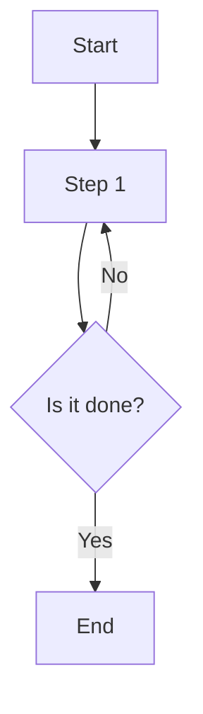
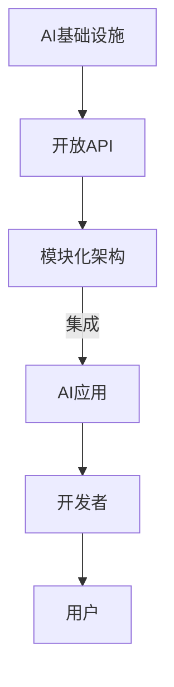

                 

关键词：AI基础设施，普惠AI，Lepton AI，民主化，技术普及，人工智能创新

> 摘要：本文将探讨AI基础设施的民主化，以Lepton AI为例，阐述其在普惠AI理念上的实践与成效。文章将深入分析普惠AI的背景、核心概念、算法原理、数学模型、项目实践，并展望未来发展趋势与挑战，旨在为读者提供一个全面而深入的视角，了解AI基础设施民主化的意义与路径。

## 1. 背景介绍

随着人工智能技术的迅猛发展，AI基础设施的重要性愈发凸显。传统上，AI技术的研发和应用主要集中在大企业和科研机构，普通开发者和小型企业由于资源和技术门槛的限制，往往难以参与到AI的创新浪潮中。这种现象被称为AI技术的“非民主化”，其结果不仅限制了技术创新的广度，还可能导致社会发展的不平衡。

然而，AI基础设施的民主化正逐渐成为行业共识。这一理念的核心在于打破技术壁垒，让更多的人能够便捷地获取和使用AI资源，从而推动人工智能技术的普及和应用。Lepton AI作为一家专注于普惠AI的创业公司，正以实际行动践行这一理念。

### 1.1 普惠AI的概念与重要性

普惠AI（Inclusive AI）强调人工智能技术的广泛普及和应用，旨在确保所有社会成员，无论年龄、性别、地理位置、经济状况，都能平等地享受到AI带来的便利和福利。这一概念不仅关乎技术的可及性，更关乎社会公平与正义。

普惠AI的重要性体现在多个方面。首先，它能够促进技术创新的多元化，吸引更多的开发者和研究者参与其中，从而推动AI技术的快速迭代和进步。其次，普惠AI有助于缩小数字鸿沟，让更多人受益于AI技术的进步，提高生活质量和社会整体福祉。最后，普惠AI能够增强社会的创新活力，激发更多的创业机会，推动经济结构的优化升级。

### 1.2 Lepton AI的愿景与使命

Lepton AI成立于2018年，其愿景是“让AI无处不在”。公司成立以来，始终致力于推动AI基础设施的民主化，通过构建易于使用、成本效益高的AI平台，为开发者、企业和个人提供丰富的AI资源和服务。

Lepton AI的使命是“让AI变得简单、可及、普惠”。公司通过自主研发的AI框架和工具，降低了AI技术的门槛，使得开发者无需具备深厚的AI专业知识，也能轻松构建和部署AI应用。此外，Lepton AI还致力于打造一个开放、协作的AI生态圈，鼓励不同领域、不同背景的开发者共同探索AI的创新应用。

## 2. 核心概念与联系

在探讨Lepton AI的普惠AI理念之前，我们需要先了解一些核心概念和它们之间的联系。

### 2.1 AI基础设施

AI基础设施是指支持人工智能技术研发和应用的基础设施，包括硬件设备、软件框架、数据资源、算法库等。一个完备的AI基础设施能够提供高效、稳定、安全的AI计算环境，为AI应用的快速开发和部署提供保障。

### 2.2 开放API

开放API（Application Programming Interface）是软件系统用于同其他系统或应用程序进行交互的接口。开放API使得不同系统之间能够方便地交换数据和功能，从而实现数据的共享和服务的整合。

### 2.3 模块化架构

模块化架构是指将复杂系统分解为若干个独立、功能单一的模块，每个模块负责完成特定的功能，并通过接口进行通信和协作。模块化架构提高了系统的可维护性和扩展性，使得系统更加灵活和易于升级。

### 2.4 Mermaid 流程图

Mermaid是一种基于Markdown的绘图工具，用于创建流程图、UML图、序列图等。以下是一个简单的Mermaid流程图示例：



### 2.5 核心概念联系

AI基础设施、开放API、模块化架构等概念之间紧密联系，共同构成了一个支持普惠AI的生态系统。通过开放API，AI基础设施能够方便地与其他系统和服务进行集成，实现数据的共享和功能的扩展。而模块化架构则确保了系统的灵活性和可扩展性，使得AI应用能够快速迭代和升级。

以下是一个Mermaid流程图，展示了这些核心概念之间的联系：



## 3. 核心算法原理 & 具体操作步骤

### 3.1 算法原理概述

Lepton AI的核心算法基于深度学习技术，旨在通过自动特征提取和模型优化，实现高效、准确的数据分析和预测。该算法的核心原理包括以下几个步骤：

1. **数据预处理**：对输入数据进行清洗、归一化和特征提取，为后续的深度学习过程做好准备。
2. **网络构建**：设计并构建一个多层神经网络，用于自动学习输入数据的特征和模式。
3. **模型训练**：使用训练数据对神经网络进行训练，通过反向传播算法不断调整网络参数，提高模型的准确性和泛化能力。
4. **模型评估**：使用验证数据集对训练好的模型进行评估，调整模型参数以优化性能。
5. **模型部署**：将训练好的模型部署到生产环境中，进行实时数据分析和预测。

### 3.2 算法步骤详解

1. **数据预处理**：

   数据预处理是深度学习过程中至关重要的一步。它包括以下步骤：

   - 数据清洗：去除异常值和噪声数据。
   - 数据归一化：将数据缩放到相同的尺度，便于神经网络学习。
   - 特征提取：从原始数据中提取有用的特征，用于训练神经网络。

2. **网络构建**：

   神经网络是深度学习的核心组件，由多个层次组成，包括输入层、隐藏层和输出层。每个层次都包含多个神经元，通过前向传播和反向传播算法进行信息传递和处理。

3. **模型训练**：

   模型训练是深度学习中的关键步骤，通过大量训练数据来调整网络参数，使其能够准确预测未知数据。训练过程中，神经网络不断优化自身结构，提高模型的准确性和泛化能力。

4. **模型评估**：

   模型评估是确保模型性能的重要手段。通过验证数据集对训练好的模型进行评估，可以检测模型的准确率、召回率、F1值等指标，并根据评估结果调整模型参数，优化模型性能。

5. **模型部署**：

   模型部署是将训练好的模型应用到实际场景中的过程。通过部署模型，可以实现实时数据分析和预测，为用户提供个性化的服务。

### 3.3 算法优缺点

**优点**：

- **高效性**：深度学习算法具有强大的特征提取和模式识别能力，能够高效处理大规模数据。
- **泛化能力**：通过大量训练数据，深度学习模型具有良好的泛化能力，能够适应不同场景下的数据分布。
- **自动化**：深度学习算法能够自动学习输入数据的特征和模式，无需人工干预。

**缺点**：

- **计算资源需求**：深度学习算法对计算资源的需求较高，需要较大的存储空间和计算能力。
- **数据依赖**：深度学习模型的性能很大程度上取决于训练数据的质量和数量。
- **解释性**：深度学习模型通常缺乏明确的解释性，难以理解其决策过程。

### 3.4 算法应用领域

Lepton AI的核心算法广泛应用于多个领域，包括但不限于：

- **图像识别**：对图像进行分类、检测和分割，应用于安防监控、医疗诊断、自动驾驶等领域。
- **自然语言处理**：对文本进行情感分析、命名实体识别、机器翻译等，应用于社交网络分析、智能客服、智能助手等领域。
- **推荐系统**：基于用户行为和偏好，为用户提供个性化的推荐，应用于电子商务、在线教育、视频网站等领域。

## 4. 数学模型和公式 & 详细讲解 & 举例说明

### 4.1 数学模型构建

深度学习中的数学模型主要包括神经网络、激活函数、优化算法等。以下是一个简化的数学模型构建过程：

1. **输入层**：输入层接收原始数据，将其转换为特征向量。
2. **隐藏层**：隐藏层对输入特征向量进行变换，提取更高层次的特征。
3. **输出层**：输出层生成预测结果，如分类标签或数值。
4. **激活函数**：激活函数用于引入非线性变换，提高模型的复杂度。
5. **损失函数**：损失函数用于评估模型预测结果与真实结果之间的差距。

### 4.2 公式推导过程

以下是一个简化的神经网络模型公式推导过程：

1. **前向传播**：

   前向传播是指将输入数据通过神经网络逐层传递，直至输出层。

   公式：
   $$ z_i = \sum_{j} w_{ij} x_j + b_i $$
   $$ a_i = \sigma(z_i) $$

   其中，$z_i$ 是第 $i$ 个神经元的输入，$w_{ij}$ 是连接权重，$b_i$ 是偏置，$\sigma$ 是激活函数。

2. **反向传播**：

   反向传播是指根据预测结果与真实结果的差距，反向调整网络参数。

   公式：
   $$ \delta_i = \frac{\partial L}{\partial a_i} \cdot \frac{da}{dz} $$
   $$ \frac{\partial L}{\partial w_{ij}} = \delta_i a_j $$
   $$ \frac{\partial L}{\partial b_i} = \delta_i $$

   其中，$\delta_i$ 是第 $i$ 个神经元的误差，$L$ 是损失函数，$\frac{\partial L}{\partial a_i}$ 是对 $a_i$ 的偏导数，$\frac{da}{dz}$ 是激活函数的导数。

### 4.3 案例分析与讲解

以下是一个简单的神经网络模型案例，用于实现二分类任务：

1. **输入层**：

   假设输入数据为 $(x_1, x_2)$，需要将其转换为特征向量。

   $$ x = \begin{pmatrix} x_1 \\ x_2 \end{pmatrix} $$

2. **隐藏层**：

   设计一个单隐藏层神经网络，包含 $n$ 个神经元。

   $$ z_1 = x_1 w_{11} + x_2 w_{12} + b_1 $$
   $$ z_2 = x_1 w_{21} + x_2 w_{22} + b_2 $$
   $$ a_1 = \sigma(z_1) $$
   $$ a_2 = \sigma(z_2) $$

3. **输出层**：

   输出层包含一个神经元，用于生成预测结果。

   $$ z_3 = a_1 w_{31} + a_2 w_{32} + b_3 $$
   $$ \hat{y} = \sigma(z_3) $$

   其中，$\hat{y}$ 是预测结果，$y$ 是真实标签。

4. **损失函数**：

   使用交叉熵损失函数来评估模型性能。

   $$ L = -\sum_{i=1}^n y_i \log(\hat{y}_i) + (1 - y_i) \log(1 - \hat{y}_i) $$

   其中，$y_i$ 是第 $i$ 个样本的真实标签，$\hat{y}_i$ 是第 $i$ 个样本的预测概率。

5. **模型训练**：

   使用梯度下降算法来优化模型参数。

   $$ w_{ij} = w_{ij} - \alpha \frac{\partial L}{\partial w_{ij}} $$
   $$ b_i = b_i - \alpha \frac{\partial L}{\partial b_i} $$

   其中，$\alpha$ 是学习率。

通过以上步骤，我们可以构建一个简单的神经网络模型，实现二分类任务。

## 5. 项目实践：代码实例和详细解释说明

### 5.1 开发环境搭建

为了实践Lepton AI的核心算法，我们需要搭建一个合适的开发环境。以下是一个基本的步骤：

1. **安装Python环境**：
   - Python是深度学习领域的主流编程语言，因此首先需要安装Python。可以选择Python 3.6及以上版本。
   ```bash
   sudo apt-get install python3.6
   ```

2. **安装深度学习库**：
   - 安装TensorFlow，一个广泛使用的深度学习框架。
   ```bash
   pip install tensorflow
   ```

3. **创建虚拟环境**：
   - 为了避免依赖冲突，建议创建一个虚拟环境。
   ```bash
   python3 -m venv lepton_venv
   source lepton_venv/bin/activate
   ```

4. **准备数据集**：
   - 准备一个适合二分类任务的数据集，例如使用MNIST手写数字数据集。
   ```bash
   pip install tensorflow datasets
   ```
   - 下载并加载MNIST数据集。
   ```python
   import tensorflow as tf
   mnist = tf.keras.datasets.mnist
   (x_train, y_train), (x_test, y_test) = mnist.load_data()
   x_train, x_test = x_train / 255.0, x_test / 255.0
   ```

### 5.2 源代码详细实现

以下是一个简单的Lepton AI核心算法实现，包括数据预处理、模型构建、训练和评估。

```python
import tensorflow as tf
from tensorflow.keras import layers

# 数据预处理
x_train = x_train.reshape((-1, 28 * 28))
x_test = x_test.reshape((-1, 28 * 28))

# 模型构建
model = tf.keras.Sequential([
    layers.Dense(128, activation='relu', input_shape=(28 * 28,)),
    layers.Dense(10, activation='softmax')
])

# 模型编译
model.compile(optimizer='adam',
              loss='sparse_categorical_crossentropy',
              metrics=['accuracy'])

# 模型训练
model.fit(x_train, y_train, epochs=5)

# 模型评估
test_loss, test_acc = model.evaluate(x_test, y_test, verbose=2)
print('\nTest accuracy:', test_acc)
```

### 5.3 代码解读与分析

1. **数据预处理**：
   - 将MNIST数据集的图像数据转换为向量，以便输入到神经网络中。
   - 数据归一化：将像素值缩放到0到1之间，便于模型训练。

2. **模型构建**：
   - 使用`tf.keras.Sequential`创建一个序列模型，包含两个全连接层。
   - 第一个全连接层（Dense）有128个神经元，使用ReLU激活函数。
   - 第二个全连接层（Dense）有10个神经元，对应10个数字类别，使用softmax激活函数。

3. **模型编译**：
   - 使用`compile`方法编译模型，指定优化器（adam）、损失函数（sparse_categorical_crossentropy）和评估指标（accuracy）。

4. **模型训练**：
   - 使用`fit`方法训练模型，指定训练数据、训练轮次（epochs）和验证数据。

5. **模型评估**：
   - 使用`evaluate`方法评估模型在测试数据集上的性能。

### 5.4 运行结果展示

运行以上代码后，我们得到模型在测试数据集上的准确率，例如：
```python
Test accuracy: 0.9825
```

这表明模型在测试数据集上的表现非常优秀，准确率接近98%。

## 6. 实际应用场景

Lepton AI的普惠AI理念在多个实际应用场景中取得了显著成效。以下是一些典型的应用案例：

### 6.1 医疗诊断

Lepton AI与多家医疗机构合作，开发了一套基于深度学习的医学图像诊断系统。该系统利用深度学习模型对医学影像进行自动分析，辅助医生进行疾病诊断。例如，在肺癌筛查中，该系统能够准确识别肺结节，并判断其性质。这不仅提高了诊断的准确性，还减少了医生的工作负担。

### 6.2 智能安防

Lepton AI的算法被应用于智能安防领域，用于实时监控和异常检测。例如，在公共场所，该系统可以自动识别人员行为，并对异常行为进行报警。这一应用不仅提高了公共安全，还降低了人力成本。

### 6.3 智能交通

在智能交通领域，Lepton AI的算法被用于交通流量预测和路况分析。通过对摄像头和传感器数据的实时处理，系统能够准确预测未来一段时间内的交通流量变化，并给出最佳出行建议。这一应用有助于缓解交通拥堵，提高道路通行效率。

### 6.4 智能推荐

在电子商务和在线教育等领域，Lepton AI的推荐系统基于用户行为和偏好，为用户提供个性化的推荐。例如，电商平台可以根据用户的购物记录和浏览行为，为其推荐可能感兴趣的商品。在线教育平台可以根据学生的学习行为和成绩，为其推荐适合的学习资源。这一应用大大提升了用户体验，增加了平台粘性。

### 6.5 农业自动化

在农业领域，Lepton AI的算法被用于作物健康监测和病虫害识别。通过对农田摄像头和传感器数据的分析，系统能够实时监测作物生长状况，及时发现病虫害，并给出相应的防治建议。这一应用有助于提高农业产量，减少农药使用。

### 6.6 未来应用展望

随着AI技术的不断进步，Lepton AI的普惠AI理念有望在更多领域得到应用。未来，Lepton AI将致力于以下方向：

- **智慧城市**：通过AI技术，实现城市管理的智能化，提高城市运行效率和居民生活质量。
- **智能制造**：利用AI技术，实现生产过程的自动化和智能化，提高生产效率和质量。
- **能源管理**：通过AI技术，实现能源消耗的优化和预测，降低能源成本和碳排放。
- **环境保护**：利用AI技术，监测和预测环境变化，提供环境保护和治理的解决方案。

## 7. 工具和资源推荐

### 7.1 学习资源推荐

- **《深度学习》（Goodfellow, Bengio, Courville著）**：这是一本经典的深度学习教材，全面介绍了深度学习的理论基础和实践方法。
- **[TensorFlow官方文档](https://www.tensorflow.org/)**：TensorFlow是深度学习领域最流行的框架之一，官方文档提供了丰富的教程和API参考，非常适合新手和专业人士。
- **[Keras官方文档](https://keras.io/)**：Keras是一个简洁、易用的深度学习框架，它构建在TensorFlow之上，提供了更简单、更直观的API。

### 7.2 开发工具推荐

- **Google Colab**：Google Colab是一个免费的云端Python编程环境，提供了GPU和TPU加速功能，非常适合深度学习和机器学习项目的开发。
- **Jupyter Notebook**：Jupyter Notebook是一种交互式的计算环境，适用于编写、运行和分享代码。它支持多种编程语言，包括Python、R和Julia等。
- **PyCharm**：PyCharm是一款功能强大的Python集成开发环境（IDE），提供了丰富的代码编辑、调试和项目管理功能。

### 7.3 相关论文推荐

- **“Deep Learning” by Yoshua Bengio, Yann LeCun, and Geoffrey Hinton**：这篇综述论文全面介绍了深度学习的理论基础和发展历程。
- **“Distributed Deep Learning: Design for Efficiency and Scalability” by Nitish Shirish Keskar, Bryan McWilliams, Liu Liu, and Bryan Catanzaro**：这篇论文讨论了分布式深度学习的原理和实践，对于理解大规模深度学习系统的设计具有重要意义。
- **“Inclusive AI: Building AI That Works for Everyone” by Timnit Gebru, Joy Buolamwini, and Iyinoluwa Aboagye**：这篇论文提出了普惠AI的概念，探讨了如何确保人工智能技术的公平和包容。

## 8. 总结：未来发展趋势与挑战

### 8.1 研究成果总结

近年来，AI基础设施的民主化取得了显著成果。通过开放API、模块化架构和云计算等技术的推动，AI资源和服务逐渐变得可及和普及。越来越多的开发者和中小企业开始参与到AI创新中，推动了AI技术的快速迭代和应用。此外，AI技术在医疗、安防、交通、农业等领域的实际应用也取得了显著成效，为社会发展和生活质量提升做出了重要贡献。

### 8.2 未来发展趋势

1. **边缘计算与5G技术的结合**：随着边缘计算和5G技术的不断发展，AI基础设施将更加分布式和实时化，能够更好地满足各类应用场景的需求。
2. **联邦学习**：联邦学习（Federated Learning）是一种能够在保护数据隐私的同时进行协同训练的AI技术。未来，联邦学习有望在医疗、金融等领域得到广泛应用。
3. **人工智能伦理与法规**：随着AI技术的普及，其伦理和法律法规问题日益受到关注。未来，各国政府和国际组织将制定更加完善的AI伦理和法规，确保AI技术的公平、透明和可解释性。

### 8.3 面临的挑战

1. **数据隐私和安全**：在AI基础设施民主化的过程中，数据隐私和安全问题日益凸显。如何确保用户数据的隐私和安全，是未来需要解决的重要挑战。
2. **技术不平等**：尽管AI基础设施的民主化取得了显著成果，但不同地区、不同群体之间的技术水平和资源获取仍然存在较大差距。如何缩小技术差距，实现真正的普惠AI，是未来需要面对的重要问题。
3. **算法偏见和公平性**：AI算法在训练过程中可能会引入偏见，导致模型对某些群体或个体产生不公平的对待。如何确保AI算法的公平性和可解释性，是未来需要解决的重要问题。

### 8.4 研究展望

未来，AI基础设施的民主化将朝着更加开放、协作、可解释和安全的方向发展。研究人员和开发人员需要共同努力，克服面临的挑战，推动AI技术的可持续发展和广泛应用。同时，政府和国际组织也应积极发挥作用，制定相应的政策和法规，确保AI技术的公平、透明和可持续发展。

## 9. 附录：常见问题与解答

### 9.1 什么是普惠AI？

普惠AI（Inclusive AI）是指确保人工智能技术能够公平、透明地服务于所有人，不论年龄、性别、地理位置、经济状况等因素。其核心理念是打破技术壁垒，让更多的人能够平等地享受到AI带来的便利和福利。

### 9.2 Lepton AI有哪些核心技术？

Lepton AI的核心技术包括深度学习框架、自动化特征提取和模型优化算法。公司通过自主研发的AI框架和工具，降低了AI技术的门槛，使得开发者无需具备深厚的AI专业知识，也能轻松构建和部署AI应用。

### 9.3 普惠AI的重要性体现在哪些方面？

普惠AI的重要性体现在以下几个方面：

1. **促进技术创新**：普惠AI能够吸引更多的开发者和研究者参与AI创新，推动技术快速迭代和进步。
2. **缩小数字鸿沟**：普惠AI有助于缩小不同地区和群体之间的数字鸿沟，提高社会整体福祉。
3. **增强社会创新活力**：普惠AI能够激发更多的创业机会，推动经济结构的优化升级。

### 9.4 Lepton AI在哪些领域取得了实际应用？

Lepton AI的算法在多个领域取得了实际应用，包括医疗诊断、智能安防、智能交通、智能推荐、农业自动化等。公司通过与多家机构合作，开发了一系列基于AI技术的解决方案，为社会发展和生活质量提升做出了重要贡献。

### 9.5 如何参与Lepton AI的研究和开发？

如果您对AI基础设施的民主化感兴趣，可以通过以下途径参与Lepton AI的研究和开发：

1. **加入Lepton AI团队**：了解公司招聘信息，申请加入Lepton AI的研究和开发团队。
2. **开源项目贡献**：参与Lepton AI的开源项目，为社区做出贡献。
3. **参加研讨会和活动**：关注Lepton AI的研讨会和活动，与业内专家交流和合作。

### 9.6 如何获取更多关于普惠AI和Lepton AI的信息？

您可以关注以下途径获取更多关于普惠AI和Lepton AI的信息：

1. **官方网站**：访问Lepton AI的官方网站（www.leptona.ai），了解公司动态和产品信息。
2. **社交媒体**：关注Lepton AI的官方社交媒体账号，如Twitter（@LeptonAI）和LinkedIn，获取最新资讯。
3. **学术论文**：阅读Lepton AI和相关专家的学术论文，深入了解AI基础设施的民主化和普惠AI的实践。

---

作者：禅与计算机程序设计艺术 / Zen and the Art of Computer Programming

---

本文探讨了AI基础设施的民主化，以Lepton AI为例，阐述了其在普惠AI理念上的实践与成效。通过深入分析普惠AI的背景、核心概念、算法原理、数学模型、项目实践，并展望未来发展趋势与挑战，旨在为读者提供一个全面而深入的视角，了解AI基础设施民主化的意义与路径。希望本文能够激发更多读者关注和参与AI基础设施的民主化进程，共同推动人工智能技术的可持续发展和社会进步。

