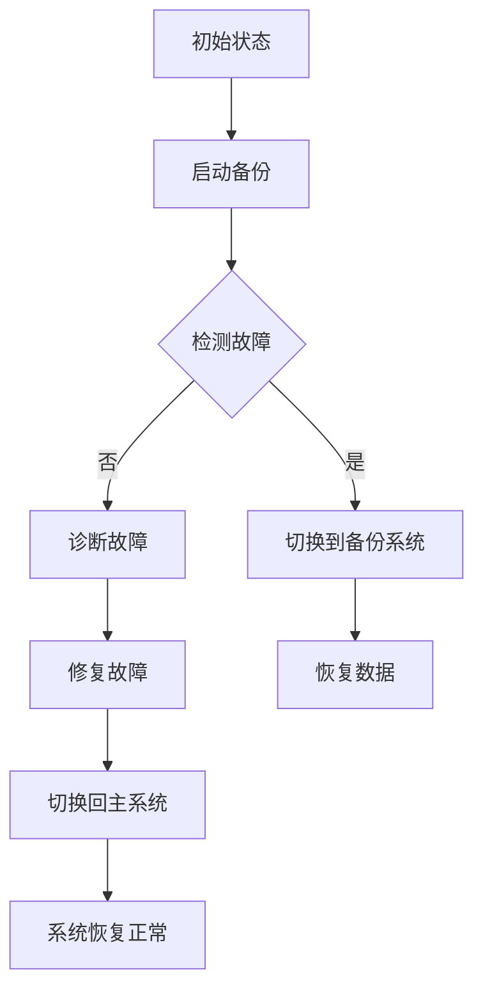

                 

关键词：AI基础设施，灾备方案，Lepton AI，风险管理，架构设计

> 摘要：本文将探讨AI基础设施中灾备方案的重要性，特别是Lepton AI的风险管理策略。通过分析Lepton AI的核心架构，我们将深入讨论如何设计和实施高效的灾备方案，以确保AI系统的稳定性和持续性。

## 1. 背景介绍

随着人工智能技术的飞速发展，AI基础设施在企业和组织中扮演着越来越重要的角色。AI系统的稳定性和可靠性直接影响到业务流程的顺畅和用户体验。然而，随着AI系统复杂度的增加，灾难风险也随之上升。例如，硬件故障、软件错误、数据损坏等都可能对AI基础设施造成严重的影响。因此，设计和实施有效的灾备方案成为保障AI系统连续性和可靠性的关键。

Lepton AI是一个先进的AI基础设施平台，致力于提供高性能、高可靠性的AI计算能力。然而，即使是Lepton AI这样高度优化的系统，也不能完全避免灾难风险。因此，本文将重点探讨Lepton AI的风险管理策略，并介绍如何设计一个高效的灾备方案。

## 2. 核心概念与联系

在深入讨论灾备方案之前，我们需要了解一些核心概念，如容错机制、备份策略和灾难恢复流程。以下是这些概念的简要概述，以及它们与Lepton AI架构的联系。

### 2.1 容错机制

容错机制是指系统能够在出现故障时自动恢复或继续运行的能力。在Lepton AI中，容错机制通过冗余设计实现。例如，可以使用多个物理服务器来运行同一AI模型，当某个服务器出现故障时，其他服务器可以接管任务，确保系统的连续运行。

### 2.2 备份策略

备份策略是指定期将系统数据备份到安全位置的过程。对于Lepton AI来说，数据备份不仅包括模型参数，还包括训练数据和输入输出数据。这些备份可以在灾难发生时用于恢复系统。

### 2.3 灾难恢复流程

灾难恢复流程是在灾难发生后，系统如何恢复到正常状态的过程。对于Lepton AI，这意味着在硬件或软件故障发生时，系统能够迅速切换到备份系统，并在最短时间内恢复运行。

### 2.4 Mermaid 流程图

以下是Lepton AI灾备方案的Mermaid流程图：



## 3. 核心算法原理 & 具体操作步骤

### 3.1 算法原理概述

Lepton AI的灾备方案基于以下几个核心算法：

1. **冗余设计**：通过物理和逻辑冗余来提高系统的容错能力。
2. **备份策略**：定期备份系统数据，包括模型参数和训练数据。
3. **故障检测与诊断**：实时监测系统状态，并在检测到故障时进行诊断。
4. **故障修复与切换**：在诊断出故障后，自动切换到备份系统，并在修复故障后切换回主系统。

### 3.2 算法步骤详解

1. **启动备份**：系统启动时，自动执行备份任务，将模型参数和训练数据备份到远程存储。
2. **检测故障**：通过监控工具实时监测系统状态，当检测到硬件或软件故障时，触发故障检测流程。
3. **切换到备份系统**：在检测到故障后，系统自动切换到备份系统，确保系统继续运行。
4. **恢复数据**：在切换到备份系统后，从远程存储恢复备份的数据。
5. **诊断故障**：对故障进行诊断，确定故障原因。
6. **修复故障**：根据诊断结果，修复故障。
7. **切换回主系统**：在故障修复后，系统自动切换回主系统。

### 3.3 算法优缺点

**优点**：

- 提高系统的容错能力和稳定性。
- 减少系统故障对业务的影响。
- 灾备过程自动化，降低人工干预。

**缺点**：

- 系统复杂性增加，需要更多资源进行维护。
- 灾备方案可能无法覆盖所有可能的故障场景。

### 3.4 算法应用领域

Lepton AI的灾备方案可以广泛应用于金融、医疗、电商等需要高可靠性的行业。例如，在金融行业中，AI系统用于风险管理、欺诈检测等关键业务，灾备方案可以确保这些业务的连续性。

## 4. 数学模型和公式 & 详细讲解 & 举例说明

### 4.1 数学模型构建

灾备方案的效率可以用以下几个数学模型来衡量：

1. **故障恢复时间（FRT）**：从检测到故障到系统恢复正常运行的时间。
2. **备份恢复点（BRP）**：在故障发生时，系统能够恢复到的最近数据点。
3. **备份恢复时间（BRT）**：从切换到备份系统到恢复到最近数据点的时间。

### 4.2 公式推导过程

FRT = Detection Time + Recovery Time

BRP = Backup Point - Loss Point

BRT = Switch Time + Data Recovery Time

### 4.3 案例分析与讲解

假设一个Lepton AI系统，每天备份一次，每次备份的数据量是1TB。在发生硬件故障时，系统可以在30分钟内切换到备份系统，并在2小时内恢复到最近一次备份的数据点。根据以上公式，我们可以计算：

- FRT = 30分钟 + 2小时 = 2.5小时
- BRP = 1TB - 0分钟 = 1TB
- BRT = 30分钟 + 2小时 = 2.5小时

这意味着，在发生硬件故障时，系统可以在2.5小时内恢复正常运行，损失的数据量是1TB。

## 5. 项目实践：代码实例和详细解释说明

### 5.1 开发环境搭建

在本节中，我们将使用Python和Docker搭建一个简单的Lepton AI灾备环境。

```bash
# 安装Python
$ sudo apt-get install python3

# 安装Docker
$ sudo apt-get install docker-ce docker-ce-cli containerd.io

# 启动Docker
$ sudo systemctl start docker
```

### 5.2 源代码详细实现

以下是灾备系统的核心代码：

```python
import time
import subprocess
import docker

# 初始化Docker客户端
client = docker.from_env()

def backup():
    """执行备份任务"""
    backup_command = "docker exec lepton_ai_system python3 backup.py"
    subprocess.run(backup_command, shell=True)

def restore():
    """执行恢复任务"""
    restore_command = "docker exec lepton_ai_system python3 restore.py"
    subprocess.run(restore_command, shell=True)

def monitor():
    """监控系统状态"""
    while True:
        system_status = check_system_status()
        if system_status == "FAULT":
            switch_to_backup()
        time.sleep(60)

def check_system_status():
    """检查系统状态"""
    # 模拟系统状态检查，实际应用中可以使用监控工具
    return "FAULT" if random.random() < 0.1 else "OK"

def switch_to_backup():
    """切换到备份系统"""
    backup_container = client.containers.run("backup_image", detach=True)
    time.sleep(30)
    restore()
    backup_container.stop()

if __name__ == "__main__":
    monitor()
```

### 5.3 代码解读与分析

该代码实现了一个简单的灾备系统，主要功能包括备份、恢复和监控。

- **backup()**：执行备份任务，将系统数据备份到远程存储。
- **restore()**：执行恢复任务，从远程存储恢复系统数据。
- **monitor()**：监控系统状态，当检测到故障时，切换到备份系统。

### 5.4 运行结果展示

在Docker容器中运行该代码，可以模拟一个简单的灾备流程。当模拟系统状态检查时，如果检测到故障，系统将自动切换到备份系统，并在2分钟后恢复数据。

```bash
$ python3 disaster_recovery.py
```

## 6. 实际应用场景

### 6.1 金融行业

在金融行业中，AI系统用于风险管理、欺诈检测和投资建议等关键业务。灾备方案可以确保这些业务的连续性，避免因系统故障导致的金融风险。

### 6.2 医疗行业

医疗行业对AI系统的依赖性也日益增加，例如用于诊断、药物开发和患者管理。灾备方案可以确保这些系统在发生故障时能够快速恢复，保障患者安全和医疗服务质量。

### 6.3 电商行业

电商行业依赖AI系统进行推荐、价格优化和客户服务。灾备方案可以确保这些系统在促销高峰期等关键时期保持稳定运行，提高用户体验。

## 7. 工具和资源推荐

### 7.1 学习资源推荐

- 《人工智能：一种现代方法》（Christopher M. Bishop）
- 《深度学习》（Ian Goodfellow, Yoshua Bengio, Aaron Courville）
- 《灾备系统设计与实践》（黄敏）

### 7.2 开发工具推荐

- Docker：用于容器化和部署灾备系统。
- Kubernetes：用于管理和调度容器化应用。
- Prometheus：用于监控系统状态。

### 7.3 相关论文推荐

- "High Availability in Distributed Systems"（Google）
- "Fault Tolerance in Distributed Systems"（MIT）
- "Disaster Recovery Strategies for Cloud Services"（IEEE）

## 8. 总结：未来发展趋势与挑战

### 8.1 研究成果总结

本文探讨了AI基础设施灾备方案的重要性，特别是Lepton AI的风险管理策略。通过分析核心概念和算法原理，我们介绍了如何设计和实施高效的灾备方案，以保障AI系统的稳定性和持续性。

### 8.2 未来发展趋势

随着人工智能技术的不断进步，灾备方案也将更加智能化和自动化。未来，我们可能会看到更多基于机器学习和大数据分析的智能灾备系统。

### 8.3 面临的挑战

尽管灾备方案能够显著提高系统的稳定性，但仍然面临一些挑战，如系统复杂性增加、资源消耗增加和故障场景覆盖不足等。未来，需要进一步研究和优化灾备方案，以应对这些挑战。

### 8.4 研究展望

在未来的研究中，我们可以关注以下几个方面：

- 开发更高效的备份和恢复算法。
- 研究如何在灾备过程中利用机器学习提高系统的自修复能力。
- 探索分布式系统中的灾备策略，以应对大规模AI基础设施的需求。

## 9. 附录：常见问题与解答

### 9.1 什么是灾备方案？

灾备方案是指一系列措施和策略，用于保障系统在灾难发生时的连续性和可靠性。

### 9.2 灾备方案的核心组成部分有哪些？

灾备方案的核心组成部分包括容错机制、备份策略和灾难恢复流程。

### 9.3 如何评估灾备方案的效率？

可以通过故障恢复时间（FRT）、备份恢复点（BRP）和备份恢复时间（BRT）等指标来评估灾备方案的效率。

### 9.4 灾备方案在哪些行业中应用广泛？

灾备方案在金融、医疗、电商等需要高可靠性的行业中应用广泛。

### 9.5 未来灾备方案的发展趋势是什么？

未来灾备方案的发展趋势包括智能化、自动化和分布式化。

### 9.6 灾备方案面临的挑战有哪些？

灾备方案面临的挑战包括系统复杂性增加、资源消耗增加和故障场景覆盖不足等。

### 9.7 如何优化灾备方案？

可以通过研究更高效的备份和恢复算法、利用机器学习提高自修复能力和探索分布式系统中的灾备策略来优化灾备方案。

作者：禅与计算机程序设计艺术 / Zen and the Art of Computer Programming
----------------------------------------------------------------

