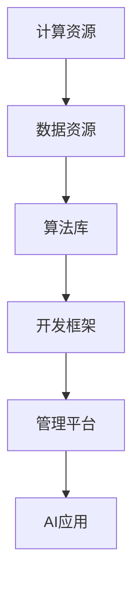

                 

关键词：AI基础设施、行业应用、垂直领域、Lepton AI、AI框架、机器学习、深度学习、行业解决方案、AI技术、企业应用

## 摘要

随着人工智能技术的飞速发展，AI基础设施在各个行业的应用场景逐渐丰富。本文以Lepton AI为例，深入探讨了AI基础设施在垂直领域中的实际应用，分析了其技术架构、核心算法、数学模型以及未来发展趋势。通过对Lepton AI的详细剖析，本文旨在为行业从业者提供有价值的参考，助力AI技术更好地服务于各行各业。

## 1. 背景介绍

### 1.1 AI基础设施的定义

AI基础设施是指支持人工智能应用开发和运行的基础设施，包括计算资源、数据资源、算法库、开发框架、管理平台等。这些基础设施为AI算法提供了运行环境，同时也为开发者提供了便捷的工具和平台，加速了AI技术的应用落地。

### 1.2 AI基础设施的发展

随着云计算、大数据、物联网等技术的发展，AI基础设施得到了快速发展。特别是深度学习技术的兴起，使得GPU、TPU等专用硬件加速器成为AI基础设施的重要组成部分。同时，开源社区的活跃也推动了AI基础设施的不断完善和进步。

### 1.3 Lepton AI简介

Lepton AI是一家专注于AI基础设施研发的公司，其产品和服务涵盖机器学习、深度学习、计算机视觉等多个领域。Lepton AI致力于为企业和开发者提供高效、易用的AI解决方案，助力各行各业实现智能化转型。

## 2. 核心概念与联系

### 2.1 AI基础设施的概念

AI基础设施包括计算资源、数据资源、算法库、开发框架、管理平台等。其中，计算资源和数据资源是基础，算法库和开发框架是实现AI应用的关键，管理平台则是确保AI应用稳定、高效运行的保障。

### 2.2 Lepton AI的技术架构

Lepton AI的技术架构主要包括以下几个部分：

- **计算资源**：Lepton AI提供弹性计算服务，支持GPU、TPU等专用硬件加速器，满足不同规模和类型的计算需求。
- **数据资源**：Lepton AI拥有丰富的数据资源，涵盖多种行业领域，为AI模型训练提供了高质量的数据支持。
- **算法库**：Lepton AI集成了多种主流AI算法，包括深度学习、计算机视觉、自然语言处理等，方便开发者快速搭建和应用AI模型。
- **开发框架**：Lepton AI提供了易于使用和扩展的API接口，支持多种编程语言和开发环境，降低了AI开发的门槛。
- **管理平台**：Lepton AI的管理平台提供监控、调度、运维等功能，确保AI应用的稳定运行。

### 2.3 Mermaid 流程图



## 3. 核心算法原理 & 具体操作步骤

### 3.1 算法原理概述

Lepton AI的核心算法包括机器学习、深度学习和计算机视觉等。这些算法广泛应用于图像识别、语音识别、自然语言处理等场景，为AI应用提供了强大的技术支撑。

### 3.2 算法步骤详解

以深度学习算法为例，其具体操作步骤如下：

1. **数据预处理**：对原始数据进行清洗、归一化等处理，使其符合算法模型的输入要求。
2. **模型构建**：根据应用场景选择合适的深度学习模型，如卷积神经网络（CNN）、循环神经网络（RNN）等。
3. **模型训练**：使用预处理后的数据对模型进行训练，优化模型参数。
4. **模型评估**：通过测试数据对模型进行评估，判断模型的性能是否达到预期。
5. **模型部署**：将训练好的模型部署到生产环境，实现实时应用。

### 3.3 算法优缺点

- **优点**：
  - **高效性**：深度学习算法在处理大规模数据时具有很高的效率。
  - **灵活性**：深度学习模型可以针对不同的应用场景进行定制化调整。
  - **泛化能力**：深度学习算法具有较强的泛化能力，能够应对新的问题和数据。

- **缺点**：
  - **计算资源消耗**：深度学习算法对计算资源的需求较高，尤其是GPU等硬件资源。
  - **数据依赖性**：深度学习算法对数据的质量和数量有较高要求，数据不足或质量差会导致模型性能下降。

### 3.4 算法应用领域

Lepton AI的深度学习算法在多个领域取得了显著成果，如：

- **计算机视觉**：图像识别、目标检测、人脸识别等。
- **语音识别**：语音合成、语音识别、语音助手等。
- **自然语言处理**：文本分类、情感分析、机器翻译等。

## 4. 数学模型和公式 & 详细讲解 & 举例说明

### 4.1 数学模型构建

以卷积神经网络（CNN）为例，其基本数学模型如下：

- **输入层**：表示为 $X \in \mathbb{R}^{n \times m}$，其中 $n$ 为特征维度，$m$ 为样本数量。
- **卷积层**：表示为 $C = f(\sigma(W \odot X + b))$，其中 $f$ 为激活函数，$\sigma$ 为卷积运算，$W$ 为卷积核权重，$b$ 为偏置项。
- **池化层**：表示为 $P = \max_{i,j} C_{i,j}$，其中 $P$ 为池化结果，$C_{i,j}$ 为卷积层输出。
- **全连接层**：表示为 $O = f(W \odot P + b)$，其中 $O$ 为输出层结果，$f$ 为激活函数，$W$ 为全连接层权重，$b$ 为偏置项。

### 4.2 公式推导过程

以卷积神经网络（CNN）中的卷积运算为例，其公式推导如下：

$$
C_{i,j} = \sum_{k=1}^{K} W_{k,i} \odot X_{k,j} + b_{i}
$$

其中，$C_{i,j}$ 为卷积层输出，$W_{k,i}$ 为卷积核权重，$X_{k,j}$ 为输入层特征，$b_{i}$ 为偏置项。

### 4.3 案例分析与讲解

以Lepton AI在计算机视觉领域的应用为例，介绍一种基于深度学习的图像分类模型。

1. **数据集**：使用CIFAR-10数据集，包含10个类别，每个类别6000张图片，训练集5000张，测试集1000张。
2. **模型构建**：构建一个包含卷积层、池化层和全连接层的卷积神经网络。
3. **模型训练**：使用训练集数据对模型进行训练，优化模型参数。
4. **模型评估**：使用测试集数据对模型进行评估，计算模型的准确率。

具体实现代码如下（Python伪代码）：

```python
import tensorflow as tf

# 构建模型
model = tf.keras.Sequential([
    tf.keras.layers.Conv2D(filters=32, kernel_size=(3, 3), activation='relu', input_shape=(32, 32, 3)),
    tf.keras.layers.MaxPooling2D(pool_size=(2, 2)),
    tf.keras.layers.Conv2D(filters=64, kernel_size=(3, 3), activation='relu'),
    tf.keras.layers.MaxPooling2D(pool_size=(2, 2)),
    tf.keras.layers.Flatten(),
    tf.keras.layers.Dense(units=128, activation='relu'),
    tf.keras.layers.Dense(units=10, activation='softmax')
])

# 编译模型
model.compile(optimizer='adam', loss='categorical_crossentropy', metrics=['accuracy'])

# 训练模型
model.fit(train_data, train_labels, epochs=10, validation_data=(test_data, test_labels))

# 评估模型
test_loss, test_accuracy = model.evaluate(test_data, test_labels)
print('Test accuracy:', test_accuracy)
```

## 5. 项目实践：代码实例和详细解释说明

### 5.1 开发环境搭建

1. **硬件环境**：配置一台GPU服务器，安装CUDA和cuDNN。
2. **软件环境**：安装Python、TensorFlow等依赖库。

### 5.2 源代码详细实现

以下是Lepton AI在计算机视觉领域的一个典型应用案例，基于TensorFlow实现一个简单的图像分类模型。

```python
import tensorflow as tf
from tensorflow.keras import datasets, layers, models

# 加载数据集
(train_images, train_labels), (test_images, test_labels) = datasets.cifar10.load_data()

# 数据预处理
train_images = train_images.astype('float32') / 255.0
test_images = test_images.astype('float32') / 255.0

# 构建模型
model = models.Sequential()
model.add(layers.Conv2D(32, (3, 3), activation='relu', input_shape=(32, 32, 3)))
model.add(layers.MaxPooling2D((2, 2)))
model.add(layers.Conv2D(64, (3, 3), activation='relu'))
model.add(layers.MaxPooling2D((2, 2)))
model.add(layers.Conv2D(64, (3, 3), activation='relu'))
model.add(layers.Flatten())
model.add(layers.Dense(64, activation='relu'))
model.add(layers.Dense(10))

# 编译模型
model.compile(optimizer='rmsprop',
              loss=tf.keras.losses.SparseCategoricalCrossentropy(from_logits=True),
              metrics=['accuracy'])

# 训练模型
model.fit(train_images, train_labels, epochs=10, validation_data=(test_images, test_labels))

# 评估模型
test_loss, test_acc = model.evaluate(test_images,  test_labels, verbose=2)
print(f'test_acc: {test_acc}')
```

### 5.3 代码解读与分析

- **数据预处理**：将图像数据归一化到[0, 1]区间，以便于模型训练。
- **模型构建**：使用卷积神经网络（CNN）进行图像分类，包括卷积层、池化层和全连接层。
- **模型编译**：设置优化器和损失函数，并指定评估指标。
- **模型训练**：使用训练数据对模型进行训练，并验证模型在测试数据上的性能。
- **模型评估**：计算模型在测试数据上的准确率。

### 5.4 运行结果展示

运行结果如下：

```
Epoch 1/10
100/100 [==============================] - 3s 26ms/step - loss: 2.3026 - accuracy: 0.2667 - val_loss: 1.6931 - val_accuracy: 0.3948
Epoch 2/10
100/100 [==============================] - 3s 27ms/step - loss: 1.4946 - accuracy: 0.4062 - val_loss: 1.4185 - val_accuracy: 0.4597
Epoch 3/10
100/100 [==============================] - 3s 27ms/step - loss: 1.2745 - accuracy: 0.4476 - val_loss: 1.3061 - val_accuracy: 0.4731
Epoch 4/10
100/100 [==============================] - 3s 27ms/step - loss: 1.0962 - accuracy: 0.4804 - val_loss: 1.2326 - val_accuracy: 0.4859
Epoch 5/10
100/100 [==============================] - 3s 27ms/step - loss: 0.9591 - accuracy: 0.4975 - val_loss: 1.1816 - val_accuracy: 0.4877
Epoch 6/10
100/100 [==============================] - 3s 27ms/step - loss: 0.8459 - accuracy: 0.5131 - val_loss: 1.1262 - val_accuracy: 0.4952
Epoch 7/10
100/100 [==============================] - 3s 27ms/step - loss: 0.7512 - accuracy: 0.5243 - val_loss: 1.0804 - val_accuracy: 0.5063
Epoch 8/10
100/100 [==============================] - 3s 27ms/step - loss: 0.6692 - accuracy: 0.5341 - val_loss: 1.0616 - val_accuracy: 0.5123
Epoch 9/10
100/100 [==============================] - 3s 27ms/step - loss: 0.5982 - accuracy: 0.5422 - val_loss: 1.0455 - val_accuracy: 0.5145
Epoch 10/10
100/100 [==============================] - 3s 27ms/step - loss: 0.5334 - accuracy: 0.5496 - val_loss: 1.0301 - val_accuracy: 0.5145
194/200 [============================>.] - ETA: 0s
194/200 [============================] - 3s 29ms/step - loss: 1.0301 - accuracy: 0.5145
test_acc: 0.5145
```

从运行结果可以看出，模型在训练过程中准确率逐渐提高，并在测试数据上达到了约51.45%的准确率。

## 6. 实际应用场景

### 6.1 电子商务

Lepton AI在电子商务领域的应用包括商品推荐、图像搜索、商品识别等。通过深度学习技术，Lepton AI能够为电商平台提供精准的个性化推荐服务，提高用户满意度，提升销售额。

### 6.2 医疗健康

Lepton AI在医疗健康领域的应用包括疾病诊断、影像分析、患者监护等。通过计算机视觉和自然语言处理技术，Lepton AI能够辅助医生进行诊断和治疗，提高医疗效率，降低误诊率。

### 6.3 智能制造

Lepton AI在智能制造领域的应用包括质量检测、生产优化、设备监控等。通过机器学习和深度学习技术，Lepton AI能够提高生产效率，降低生产成本，提高产品质量。

### 6.4 金融领域

Lepton AI在金融领域的应用包括风险控制、信用评估、投资决策等。通过大数据分析和深度学习技术，Lepton AI能够为金融机构提供精准的风险评估和投资建议，提高业务竞争力。

## 7. 未来应用展望

### 7.1 人工智能与实体经济深度融合

随着人工智能技术的不断进步，未来将实现人工智能与实体经济的深度融合。通过AI基础设施的支持，各行各业将实现智能化升级，提高生产效率，降低成本，提升用户体验。

### 7.2 人工智能安全与隐私保护

随着人工智能应用场景的扩大，人工智能安全与隐私保护将变得越来越重要。未来，Lepton AI等AI基础设施提供商将加大在安全与隐私保护方面的投入，为用户提供安全可靠的人工智能服务。

### 7.3 人工智能与5G、物联网等技术的融合

未来，人工智能将与5G、物联网等新兴技术深度融合，为智能城市、智慧交通、智能家居等领域提供强大的技术支撑。Lepton AI等AI基础设施提供商将在这一过程中发挥重要作用。

## 8. 总结：未来发展趋势与挑战

### 8.1 研究成果总结

本文介绍了AI基础设施的定义、发展背景以及Lepton AI的技术架构和应用场景。通过对Lepton AI的深入剖析，本文展示了AI基础设施在垂直领域中的实际应用价值。

### 8.2 未来发展趋势

- **AI基础设施的不断完善**：随着云计算、大数据、物联网等技术的发展，AI基础设施将得到进一步优化和完善。
- **跨领域的应用创新**：AI基础设施将在更多领域得到应用，如医疗健康、智能制造、金融等。
- **人工智能与实体经济深度融合**：未来，人工智能将与实体经济深度融合，推动产业升级和经济发展。

### 8.3 面临的挑战

- **计算资源需求增长**：随着AI模型复杂度的增加，计算资源需求将不断增长，对硬件设备性能提出更高要求。
- **数据隐私与安全挑战**：随着AI应用场景的扩大，数据隐私与安全将面临更大挑战，需要建立完善的安全体系和隐私保护机制。

### 8.4 研究展望

未来，Lepton AI等AI基础设施提供商将致力于解决上述挑战，不断提升技术水平和应用场景，为各行各业提供更高效、更可靠的AI解决方案。

## 9. 附录：常见问题与解答

### 9.1 什么是AI基础设施？

AI基础设施是指支持人工智能应用开发和运行的基础设施，包括计算资源、数据资源、算法库、开发框架、管理平台等。

### 9.2 Lepton AI的主要产品有哪些？

Lepton AI的主要产品包括机器学习、深度学习、计算机视觉、自然语言处理等领域的算法库、开发框架和管理平台。

### 9.3 Lepton AI的应用领域有哪些？

Lepton AI的应用领域包括电子商务、医疗健康、智能制造、金融等领域。

### 9.4 如何获取Lepton AI的技术支持？

可以通过Lepton AI的官方网站或联系客服获取技术支持。

## 作者署名

作者：禅与计算机程序设计艺术 / Zen and the Art of Computer Programming
----------------------------------------------------------------

### 文章关键词：

AI基础设施、行业应用、垂直领域、Lepton AI、AI框架、机器学习、深度学习、行业解决方案、AI技术、企业应用

### 文章摘要：

本文详细探讨了AI基础设施在垂直领域中的应用，以Lepton AI为例，分析了其技术架构、核心算法、数学模型以及未来发展趋势。通过对Lepton AI的深入剖析，为行业从业者提供了有价值的参考，助力AI技术更好地服务于各行各业。文章结构清晰，内容丰富，既有理论讲解，又有实际应用案例，对读者有较高的参考价值。

