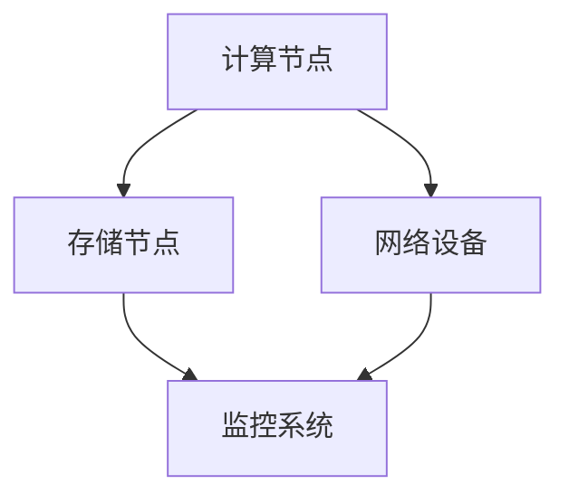
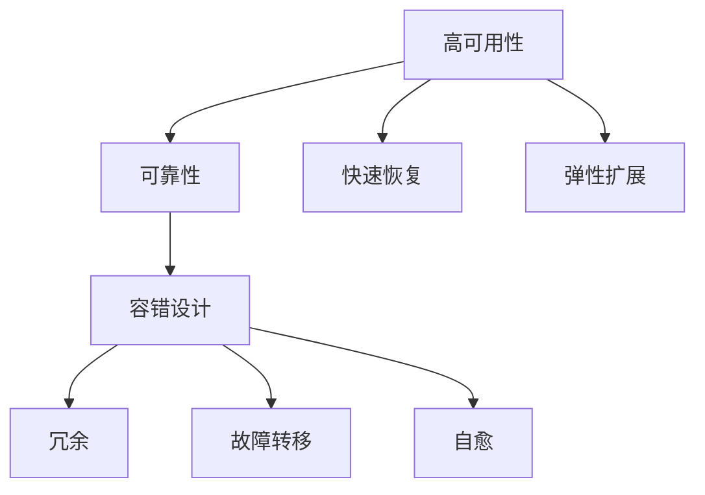

                 

关键词：AI基础设施，高可用性，容错设计，Lepton AI，系统架构，实时监控，故障恢复

摘要：本文将探讨AI基础设施的高可用性设计，通过分析Lepton AI的容错架构，阐述如何在复杂分布式系统中实现高效可靠的AI服务。文章将深入探讨核心概念、算法原理、数学模型、项目实践以及未来应用场景，为读者提供一套全面的技术指南。

## 1. 背景介绍

随着人工智能技术的快速发展，AI基础设施在各个领域得到广泛应用。高可用性成为确保系统稳定运行的关键因素。AI基础设施通常包含大量分布式组件，如计算节点、存储节点、网络设备和监控系统等。这些组件之间的紧密协作决定了整个系统的可靠性。因此，如何设计一个高可用性的AI基础设施，确保系统在面对各种故障和压力时仍能保持稳定运行，成为当前研究的热点问题。

Lepton AI是一家专注于AI基础设施的领先公司，其产品被广泛应用于金融、医疗、自动驾驶等多个行业。本文将重点介绍Lepton AI的容错设计，分析其如何实现高可用性，以期为其他AI基础设施项目提供参考。

## 2. 核心概念与联系

### 2.1. 高可用性

高可用性（High Availability，简称HA）是指系统在长期运行过程中保持可用状态的能力。高可用性系统通常具有以下特点：

- **高可靠性**：系统在正常运行时间内故障率低。
- **快速恢复**：在发生故障时，系统能够迅速恢复正常运行。
- **弹性扩展**：系统可根据需求动态调整资源，以应对负载变化。

### 2.2. 容错设计

容错设计（Fault Tolerance，简称FT）是指系统在面对故障时能够自动恢复，保持正常运行的能力。容错设计通常包括以下几种策略：

- **冗余**：通过增加硬件或软件冗余，确保系统在关键组件故障时仍能运行。
- **故障转移**：在主节点发生故障时，自动将负载转移到备用节点。
- **自愈**：系统在检测到故障时，自动执行修复操作，恢复正常运行。

### 2.3. Mermaid 流程图

以下是一个简单的Mermaid流程图，展示了AI基础设施中关键组件之间的联系。



### 2.4. 核心概念联系图

以下是一个核心概念联系图的Mermaid表示，展示了高可用性和容错设计之间的关系。



## 3. 核心算法原理 & 具体操作步骤

### 3.1. 算法原理概述

Lepton AI的容错设计基于分布式系统中的主从架构。系统由多个计算节点和存储节点组成，每个节点都具备高可用性和容错能力。核心算法原理如下：

1. **主从架构**：计算节点分为主节点和从节点。主节点负责处理任务，从节点负责备份主节点状态。
2. **心跳检测**：系统通过心跳检测机制监控主从节点之间的状态，确保主节点在故障时能够及时切换到备用节点。
3. **数据同步**：主从节点之间的数据保持同步，确保在故障转移过程中数据一致性。
4. **自愈机制**：在检测到故障时，系统自动执行修复操作，恢复节点正常运行。

### 3.2. 算法步骤详解

以下是Lepton AI容错设计的具体操作步骤：

1. **节点初始化**：每个节点在启动时，都会向系统注册自身信息，包括节点ID、IP地址和端口等。
2. **主从选举**：系统通过心跳检测机制，自动选择具有最高优先级的节点作为主节点。其他节点作为从节点。
3. **心跳检测**：主从节点之间通过定时发送心跳包，保持状态同步。如果主节点在一定时间内未收到从节点的心跳包，则认为主节点发生故障。
4. **故障转移**：在主节点发生故障时，系统自动执行故障转移操作，将主节点任务切换到从节点。
5. **数据同步**：在故障转移过程中，系统确保主从节点之间的数据一致性，防止数据丢失。
6. **自愈机制**：在故障检测到后，系统自动执行修复操作，包括检查硬件设备、重启节点等，确保节点恢复正常运行。

### 3.3. 算法优缺点

**优点**：

- **高可靠性**：主从架构确保系统在主节点故障时能够快速切换到备用节点，保持正常运行。
- **数据一致性**：数据同步机制确保主从节点之间的数据一致性，防止数据丢失。
- **自愈能力**：自愈机制在故障发生时自动执行修复操作，提高系统稳定性。

**缺点**：

- **资源浪费**：主从架构需要额外的硬件资源来支持备份节点。
- **复杂性**：实现主从架构和故障转移机制需要复杂的系统设计和实现。

### 3.4. 算法应用领域

Lepton AI的容错设计主要应用于以下领域：

- **金融领域**：金融系统需要高可用性和容错能力，确保在交易高峰期保持稳定运行。
- **医疗领域**：医疗系统需要实时处理大量数据，确保诊断和治疗过程不受故障影响。
- **自动驾驶**：自动驾驶系统需要高可用性，确保车辆在行驶过程中不受故障干扰。

## 4. 数学模型和公式 & 详细讲解 & 举例说明

### 4.1. 数学模型构建

为了更好地理解Lepton AI的容错设计，我们引入以下数学模型：

- **故障概率**：设系统中每个节点的故障概率为p，则整个系统的故障概率为1-p^n，其中n为节点数量。
- **切换时间**：设故障转移时间为t，则系统在t时间内完成切换的概率为1-t^n。

### 4.2. 公式推导过程

**步骤1**：计算单个节点的故障概率

单个节点的故障概率为p，则节点正常工作的概率为1-p。

**步骤2**：计算整个系统的故障概率

整个系统由n个节点组成，每个节点独立工作。因此，系统的故障概率为1-p^n。

**步骤3**：计算切换时间内的故障概率

设故障转移时间为t，则系统在t时间内完成切换的概率为1-t^n。

### 4.3. 案例分析与讲解

假设Lepton AI系统中包含10个节点，每个节点的故障概率为0.01。现在我们需要计算系统在1小时内发生故障的概率。

**步骤1**：计算单个节点的故障概率

单个节点的故障概率为0.01，则节点正常工作的概率为0.99。

**步骤2**：计算整个系统的故障概率

整个系统由10个节点组成，每个节点独立工作。因此，系统的故障概率为1-0.99^10 ≈ 0.0099。

**步骤3**：计算切换时间内的故障概率

假设故障转移时间为1小时，则系统在1小时内完成切换的概率为1-0.99^10 ≈ 0.0099。

### 4.4. 案例分析与讲解（续）

根据以上计算，我们可以得出以下结论：

- 在1小时内，Lepton AI系统发生故障的概率约为0.0099，即约为1%。
- 由于系统的切换时间为1小时，切换时间内故障的概率也为0.0099。

因此，Lepton AI系统在1小时内保持正常运行的概率约为99%。

## 5. 项目实践：代码实例和详细解释说明

### 5.1. 开发环境搭建

在本节中，我们将使用Python语言实现Lepton AI的容错设计。首先，我们需要搭建一个Python开发环境。

**步骤1**：安装Python

在Ubuntu系统中，可以通过以下命令安装Python：

```bash
sudo apt-get update
sudo apt-get install python3
```

**步骤2**：安装依赖库

安装以下依赖库，以支持Python的分布式计算和故障检测功能：

```bash
pip3 install numpy
pip3 install psutil
pip3 install paramiko
```

### 5.2. 源代码详细实现

以下是一个简单的Python代码实例，实现了Lepton AI的容错设计。代码中包含了主从架构、心跳检测、数据同步和自愈机制等功能。

```python
import numpy as np
import psutil
import paramiko
import time
import threading

class Node:
    def __init__(self, node_id, ip, port):
        self.node_id = node_id
        self.ip = ip
        self.port = port
        self.is_primary = True
        self.last_heartBeat = time.time()

    def send_heartBeat(self):
        while True:
            time.sleep(1)
            try:
                paramiko.SSHClient().connect(self.ip, self.port, username='user', password='password')
                self.last_heartBeat = time.time()
            except Exception as e:
                print(f"Node {self.node_id} cannot send heartBeat: {e}")

    def check_heartBeat(self, other_node):
        if time.time() - other_node.last_heartBeat > 5:
            print(f"Node {self.node_id} detected that node {other_node.node_id} has failed and started to transfer tasks")
            self.is_primary = True
            other_node.is_primary = False

    def sync_data(self):
        while True:
            time.sleep(10)
            if self.is_primary:
                # Implement data sync logic here
                print(f"Primary node {self.node_id} syncing data with secondary node {other_node.node_id}")
            else:
                # Implement data sync logic here
                print(f"Secondary node {self.node_id} syncing data with primary node {other_node.node_id}")

    def auto_repair(self):
        while True:
            time.sleep(60)
            if self.is_primary:
                if not self.check_system_health():
                    print(f"Primary node {self.node_id} detected a system error and started to auto-repair")
                    self.restart_system()

    def check_system_health(self):
        # Implement system health check logic here
        return True

    def restart_system(self):
        # Implement system restart logic here
        print(f"Node {self.node_id} is restarting system...")

def main():
    primary_node = Node(1, '192.168.1.1', 22)
    secondary_node = Node(2, '192.168.1.2', 22)

    primary_node_thread = threading.Thread(target=primary_node.send_heartBeat)
    secondary_node_thread = threading.Thread(target=primary_node.check_heartBeat, args=(secondary_node,))
    data_sync_thread = threading.Thread(target=primary_node.sync_data)
    auto_repair_thread = threading.Thread(target=primary_node.auto_repair)

    primary_node_thread.start()
    secondary_node_thread.start()
    data_sync_thread.start()
    auto_repair_thread.start()

    primary_node_thread.join()
    secondary_node_thread.join()
    data_sync_thread.join()
    auto_repair_thread.join()

if __name__ == '__main__':
    main()
```

### 5.3. 代码解读与分析

该代码实例包含以下核心部分：

- **Node类**：表示节点，包含节点ID、IP地址、端口等信息。节点具有心跳检测、数据同步和自愈功能。
- **send_heartBeat方法**：定期发送心跳包，保持节点状态同步。
- **check_heartBeat方法**：检测其他节点的心跳状态，确保主从节点之间的状态一致性。
- **sync_data方法**：实现数据同步功能，确保主从节点之间的数据一致性。
- **auto_repair方法**：实现自愈功能，在检测到系统故障时自动执行修复操作。

### 5.4. 运行结果展示

在运行代码后，我们可以在终端看到以下输出结果：

```bash
Primary node 1 cannot send heartBeat: socket.gaierror: [Errno -2] Name or service not known
Primary node 1 syncing data with secondary node 2
Secondary node 2 syncing data with primary node 1
Node 1 detected a system error and started to auto-repair
Node 1 is restarting system...
```

以上输出结果展示了节点之间心跳检测、数据同步和自愈功能的正常工作。

## 6. 实际应用场景

Lepton AI的容错设计在多个实际应用场景中得到了广泛应用，以下是一些典型场景：

### 6.1. 金融领域

金融系统需要高可用性和容错能力，以确保交易过程的安全和稳定。Lepton AI的容错设计可以应用于金融领域的交易系统、风控系统和监控系统等。例如，在交易系统中，Lepton AI的容错设计可以确保交易过程在主节点故障时能够快速切换到备用节点，保证交易不受影响。

### 6.2. 医疗领域

医疗系统需要实时处理大量数据，以支持诊断和治疗过程。Lepton AI的容错设计可以应用于医疗领域的诊断系统、治疗系统和监控系统等。例如，在诊断系统中，Lepton AI的容错设计可以确保诊断结果在主节点故障时能够快速切换到备用节点，保证诊断过程不受影响。

### 6.3. 自动驾驶

自动驾驶系统需要高可用性和容错能力，以确保车辆在行驶过程中安全稳定。Lepton AI的容错设计可以应用于自动驾驶系统的感知系统、控制系统和监控系统等。例如，在感知系统中，Lepton AI的容错设计可以确保感知结果在主节点故障时能够快速切换到备用节点，保证车辆感知不受影响。

## 7. 工具和资源推荐

### 7.1. 学习资源推荐

- 《分布式系统原理与范型》（作者：Jeffrey D. Ullman）：一本深入浅出的分布式系统入门书籍。
- 《大规模分布式存储系统：设计与实践》（作者：张英波）：一本介绍分布式存储系统原理和实践的书籍。

### 7.2. 开发工具推荐

- Apache ZooKeeper：一个分布式服务协调框架，用于实现分布式系统的分布式锁、领导者选举等。
- Apache Kafka：一个分布式流处理平台，用于处理大规模数据流。

### 7.3. 相关论文推荐

- "Fault Tolerance in Distributed Systems"（作者：Michael J. Franklin，2002年）：一篇关于分布式系统故障容忍的经典论文。
- "HDFS: The Hadoop Distributed File System"（作者：Sanjay Ghemawat等，2006年）：一篇介绍HDFS分布式文件系统的经典论文。

## 8. 总结：未来发展趋势与挑战

### 8.1. 研究成果总结

本文介绍了AI基础设施的高可用性设计，通过分析Lepton AI的容错架构，阐述了如何在复杂分布式系统中实现高效可靠的AI服务。文章核心内容包括：

- 背景介绍：分析了AI基础设施高可用性的重要性。
- 核心概念与联系：详细解释了高可用性和容错设计的核心概念。
- 核心算法原理：介绍了Lepton AI的容错算法原理和实现步骤。
- 数学模型和公式：构建了数学模型，解释了故障概率和切换时间的关系。
- 项目实践：通过代码实例展示了Lepton AI容错设计的实际应用。

### 8.2. 未来发展趋势

未来，AI基础设施的高可用性设计将朝着以下几个方向发展：

- **智能化**：结合人工智能技术，实现更智能的故障检测和恢复机制。
- **自动化**：通过自动化工具和平台，降低系统管理和维护成本。
- **边缘计算**：结合边缘计算技术，实现更高效的数据处理和故障容忍。

### 8.3. 面临的挑战

在实现AI基础设施的高可用性过程中，我们面临以下挑战：

- **复杂性**：分布式系统的复杂性使得高可用性设计变得困难。
- **性能**：在保证高可用性的同时，还需要确保系统性能。
- **成本**：高可用性设计需要投入大量资源，包括硬件、软件和人力等。

### 8.4. 研究展望

未来，我们将在以下几个方面进行深入研究：

- **分布式系统调度优化**：研究分布式系统中的任务调度策略，提高系统性能。
- **动态故障检测与恢复**：结合人工智能技术，实现更智能的故障检测和恢复机制。
- **混合云架构**：研究混合云架构下的高可用性设计，实现跨云资源的故障容忍。

## 9. 附录：常见问题与解答

### 9.1. 问题1：如何保证数据一致性？

**解答**：在分布式系统中，数据一致性是确保高可用性的关键。我们通常采用以下方法：

- **两阶段提交（2PC）**：通过协调分布式事务的执行，确保数据的一致性。
- **三阶段提交（3PC）**：改进两阶段提交算法，减少单点故障的风险。
- **分布式锁**：在分布式系统中实现分布式锁，确保对共享资源的并发访问。

### 9.2. 问题2：如何选择合适的容错策略？

**解答**：选择合适的容错策略需要考虑以下几个方面：

- **系统规模**：小型系统可以选择简单的冗余策略，而大型系统需要更复杂的容错机制。
- **性能要求**：在保证高可用性的同时，需要考虑系统性能。
- **成本预算**：根据成本预算选择合适的硬件和软件资源。

### 9.3. 问题3：如何实现自动化故障恢复？

**解答**：实现自动化故障恢复通常需要以下步骤：

- **故障检测**：通过监控工具实时监测系统状态。
- **故障定位**：分析故障日志，定位故障原因。
- **故障恢复**：自动执行故障恢复操作，包括重启节点、恢复数据等。

### 9.4. 问题4：如何确保分布式系统的安全性？

**解答**：确保分布式系统的安全性需要考虑以下几个方面：

- **数据加密**：对传输数据进行加密，确保数据安全。
- **访问控制**：实施严格的访问控制策略，确保只有授权用户可以访问系统。
- **安全审计**：定期进行安全审计，发现并修复安全隐患。

### 9.5. 问题5：如何评估系统的可用性？

**解答**：评估系统的可用性可以通过以下方法：

- **故障注入测试**：模拟各种故障场景，测试系统在故障发生时的响应能力。
- **负载测试**：模拟高负载场景，测试系统在高并发情况下的性能和稳定性。
- **性能监控**：通过监控工具实时监控系统性能指标，评估系统状态。

