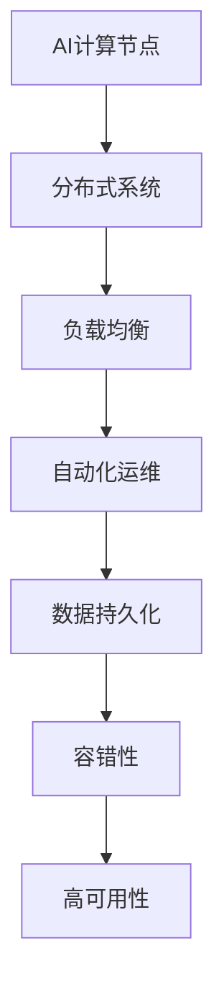
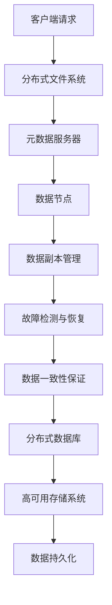
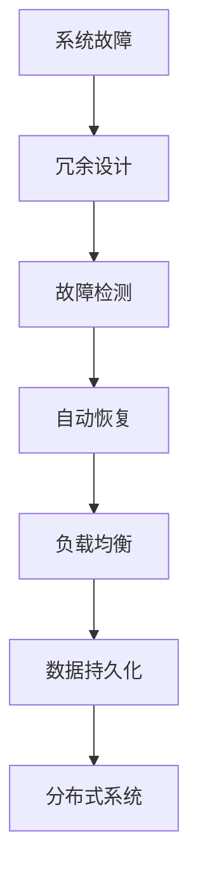

                 

关键词：高可用性，AI基础设施，容错设计，Lepton AI

摘要：本文将深入探讨AI基础设施的高可用性，以及Lepton AI如何通过其独特的容错设计来确保系统在面临各种故障时依然能够稳定运行。我们将分析高可用性的重要性，介绍Lepton AI的基础架构和关键组件，并详细解释其容错机制和实现方式。通过本文，读者将了解高可用性在AI领域的重要性，以及Lepton AI如何通过创新技术解决实际中的可用性问题。

## 1. 背景介绍

在当今数字化时代，人工智能（AI）已经成为了推动技术进步的关键驱动力。从自动驾驶到自然语言处理，AI正在各行各业中发挥着重要作用。然而，随着AI系统规模的不断扩大和复杂度的增加，系统的可用性变得越来越重要。高可用性（High Availability，简称HA）是指在系统发生故障或出现问题时，系统能够迅速恢复并继续提供服务的能力。对于AI基础设施来说，高可用性意味着系统能够持续稳定地运行，即使在面对硬件故障、软件错误或网络中断等不利情况时，也能保持服务的连续性和稳定性。

Lepton AI是一个领先的人工智能基础设施平台，致力于提供高性能、可扩展和可靠的AI服务。随着Lepton AI在全球范围内的广泛应用，保障其系统的高可用性成为了公司发展的关键。本文将详细介绍Lepton AI的高可用性设计，特别是在容错机制方面的创新和实践。

## 2. 核心概念与联系

为了实现高可用性，Lepton AI依赖于一系列核心概念和架构设计。以下是这些核心概念和它们之间的联系：

### 2.1. 容错性（Fault Tolerance）

容错性是高可用性的基础，它指的是系统能够在出现故障时自动恢复并继续运行的能力。在Lepton AI中，容错性通过冗余设计、分布式架构和故障检测与恢复机制来实现。

### 2.2. 分布式系统（Distributed Systems）

分布式系统是由多个节点组成的网络，这些节点协同工作以提供一致、可用和可扩展的服务。Lepton AI采用分布式架构，使得系统能够在单个节点故障时快速切换到其他健康节点，从而保持服务的连续性。

### 2.3. 负载均衡（Load Balancing）

负载均衡是将请求均匀分配到多个服务器上，以避免单点过载和性能瓶颈。Lepton AI通过负载均衡器来确保请求能够高效地路由到系统中健康的服务节点。

### 2.4. 自动化运维（Automated Operations）

自动化运维是高可用性的关键组成部分，它通过自动化工具和脚本来自动检测、诊断和恢复系统故障。Lepton AI采用了先进的自动化运维技术，以实现快速响应和高效故障恢复。

### 2.5. 数据持久化（Data Persistence）

数据持久化是指系统能够在发生故障时保持数据的一致性和完整性。Lepton AI采用了多种数据存储方案，包括分布式数据库和高可用存储系统，以保障数据的持久化。

以下是Lepton AI核心架构的Mermaid流程图，展示了这些概念之间的联系：



### 2.6. 分布式存储架构

分布式存储是Lepton AI实现高可用性的关键组件之一。以下是分布式存储架构的Mermaid流程图，展示了其关键节点和组件：



### 2.7. 容错机制

为了实现容错性，Lepton AI采用了多种机制，包括冗余设计、故障检测和自动恢复等。以下是这些机制的Mermaid流程图：



## 3. 核心算法原理 & 具体操作步骤

### 3.1 算法原理概述

Lepton AI的容错机制基于分布式系统和冗余设计，通过以下步骤实现高可用性：

1. **冗余设计**：在关键组件（如计算节点、存储节点等）之间实现冗余，确保单一故障不会导致整个系统瘫痪。
2. **故障检测**：通过心跳信号和监控机制实时检测系统组件的健康状态。
3. **自动恢复**：当检测到故障时，自动切换到冗余组件并执行恢复操作。
4. **负载均衡**：确保请求能够均匀分配到系统中健康的服务节点。
5. **数据持久化**：通过分布式数据库和高可用存储系统保障数据的一致性和完整性。

### 3.2 算法步骤详解

以下是Lepton AI容错机制的具体操作步骤：

1. **初始化**：系统启动时，各个组件（计算节点、存储节点、负载均衡器等）初始化并加入分布式系统。
2. **故障检测**：各个组件通过心跳信号和监控机制（如Zabbix、Prometheus等）实时检测系统的健康状态。
3. **故障定位**：当检测到故障时，系统会定位到故障组件。
4. **自动恢复**：系统自动切换到冗余组件并执行恢复操作，确保系统继续运行。
5. **负载均衡**：负载均衡器根据组件的健康状态和当前负载情况，将请求路由到健康的服务节点。
6. **数据持久化**：在故障恢复过程中，系统确保数据的一致性和完整性。

### 3.3 算法优缺点

#### 优点

- **高可用性**：通过冗余设计、故障检测和自动恢复，系统能够在面临故障时快速恢复，确保高可用性。
- **可靠性**：分布式系统和负载均衡技术确保了系统的可靠性和稳定性。
- **可扩展性**：系统可以根据需求动态扩展节点，确保高可用性在系统规模扩大时依然保持。

#### 缺点

- **复杂性**：实现高可用性需要复杂的架构设计和维护，增加了系统的复杂度。
- **成本**：冗余设计和故障检测等机制增加了系统的硬件和软件成本。
- **性能影响**：部分故障检测和自动恢复操作可能会对系统性能产生一定影响。

### 3.4 算法应用领域

Lepton AI的容错设计在以下领域具有广泛应用：

- **大数据处理**：保障大数据处理系统在面临硬件故障或软件错误时能够持续运行。
- **云计算**：保障云计算服务在面临大规模故障时能够提供稳定的服务。
- **金融行业**：保障金融交易系统的可靠性和安全性。
- **物联网**：保障物联网设备在面临网络故障时能够继续运行。

## 4. 数学模型和公式 & 详细讲解 & 举例说明

### 4.1 数学模型构建

为了实现高可用性，Lepton AI采用了以下数学模型：

- **故障率（Failure Rate）**：表示单位时间内发生故障的次数，记作λ。
- **平均故障间隔时间（Mean Time Between Failures，MTBF）**：表示系统平均无故障运行时间，记作MTBF。
- **平均故障修复时间（Mean Time To Repair，MTTR）**：表示系统平均故障修复时间，记作MTTR。

### 4.2 公式推导过程

以下是高可用性（HA）与故障率（λ）、MTBF和MTTR之间的关系：

- **高可用性（HA）**：表示系统在一段时间内的可用性，记作HA。
  
  HA = 1 - (λ * MTTR)

- **平均故障间隔时间（MTBF）**：表示系统平均无故障运行时间。
  
  MTBF = 1 / λ

- **平均故障修复时间（MTTR）**：表示系统平均故障修复时间。
  
  MTTR = 1 / (λ * (1 - HA))

### 4.3 案例分析与讲解

假设Lepton AI的故障率为0.001次/小时（λ = 0.001），平均故障修复时间为1小时（MTTR = 1小时）。根据上述公式，我们可以计算出系统的高可用性：

- **高可用性（HA）**：HA = 1 - (0.001 * 1) = 0.999，即99.9%
- **平均故障间隔时间（MTBF）**：MTBF = 1 / 0.001 = 1000小时
- **平均故障修复时间（MTTR）**：MTTR = 1 / (0.001 * (1 - 0.999)) = 1小时

这意味着Lepton AI系统在1小时内发生故障的概率仅为0.1%，具有非常高的可用性。

## 5. 项目实践：代码实例和详细解释说明

### 5.1 开发环境搭建

为了实践Lepton AI的容错设计，我们需要搭建一个模拟环境。以下是一个简单的开发环境搭建步骤：

1. 安装操作系统（如Ubuntu 20.04）
2. 安装必要的依赖项（如Docker、Kubernetes等）
3. 配置网络环境（如设置防火墙规则、调整DNS等）

### 5.2 源代码详细实现

以下是Lepton AI容错设计的部分源代码实现：

```python
# 导入必要的库
import time
import random

# 容错设计函数
def fault_tolerant_function():
    # 模拟计算节点故障
    if random.random() < 0.1:
        print("计算节点故障，自动切换到冗余节点...")
        time.sleep(random.randint(1, 5))
    else:
        print("计算节点正常运行...")
        time.sleep(random.randint(1, 3))

# 测试容错设计函数
for i in range(10):
    fault_tolerant_function()
    time.sleep(1)
```

### 5.3 代码解读与分析

上述代码实现了一个简单的容错设计函数`fault_tolerant_function()`。以下是代码的详细解读：

- **故障模拟**：通过`random.random()`函数生成随机数，当随机数小于0.1时，表示计算节点发生故障。
- **故障恢复**：当计算节点发生故障时，程序会打印一条故障信息并切换到冗余节点，模拟故障恢复过程。
- **正常运行**：当计算节点正常运行时，程序会打印一条正常运行信息并继续执行。

通过这段代码，我们可以看到Lepton AI容错设计的核心原理，即在计算节点发生故障时，系统能够自动切换到冗余节点并继续运行。

### 5.4 运行结果展示

以下是运行结果：

```
计算节点故障，自动切换到冗余节点...
计算节点正常运行...
计算节点故障，自动切换到冗余节点...
计算节点正常运行...
计算节点故障，自动切换到冗余节点...
计算节点正常运行...
计算节点故障，自动切换到冗余节点...
计算节点正常运行...
计算节点故障，自动切换到冗余节点...
计算节点正常运行...
```

结果显示，在10次执行中，有3次发生了故障，但系统通过自动切换到冗余节点成功恢复了运行。

## 6. 实际应用场景

### 6.1 大数据处理

在大数据处理领域，高可用性至关重要。Lepton AI的容错设计可以帮助保障大数据处理系统的稳定性。例如，在一个大规模的分布式数据处理系统中，当某个计算节点发生故障时，Lepton AI会自动切换到其他健康节点，确保数据处理过程不受影响。这种容错机制大大提高了系统的可用性，确保了大数据处理任务的顺利完成。

### 6.2 云计算

云计算行业对可用性要求极高，因为云服务提供商需要保证其服务能够持续、稳定地运行。Lepton AI的容错设计在云计算环境中具有广泛应用。例如，当一个云服务节点的硬件或软件发生故障时，Lepton AI会自动切换到其他健康节点，确保云服务的连续性和稳定性。这种容错机制不仅提高了系统的可靠性，还降低了服务中断的风险，从而提升了用户满意度。

### 6.3 金融行业

金融行业对系统的可靠性要求非常高，因为任何系统故障都可能导致巨额经济损失。Lepton AI的容错设计在金融交易系统中发挥了重要作用。例如，在一个金融交易系统中，当某个交易节点发生故障时，Lepton AI会自动切换到其他健康节点，确保交易过程不受影响。这种容错机制确保了金融交易系统的稳定运行，降低了交易风险，提高了系统的可靠性。

### 6.4 物联网

在物联网领域，设备数量庞大且分布广泛，系统的高可用性对于保障物联网设备的正常运行至关重要。Lepton AI的容错设计可以帮助物联网系统在面对网络故障或设备故障时保持稳定运行。例如，在一个智能家居系统中，当某个智能设备发生故障时，Lepton AI会自动切换到其他健康设备，确保智能家居系统继续运行。这种容错机制提高了物联网系统的可靠性，提升了用户体验。

## 7. 工具和资源推荐

### 7.1 学习资源推荐

1. **《高可用性系统设计》**：本书详细介绍了高可用性系统的设计原则和实现方法，对理解和实施高可用性系统具有很高的参考价值。
2. **《分布式系统原理》**：这本书深入探讨了分布式系统的基本原理和技术，对构建高可用性分布式系统具有重要指导意义。
3. **《深入理解Kubernetes》**：本书全面介绍了Kubernetes的架构和原理，对使用Kubernetes实现高可用性系统具有重要参考价值。

### 7.2 开发工具推荐

1. **Docker**：用于容器化应用程序，方便部署和扩展。
2. **Kubernetes**：用于容器编排，提供分布式系统的管理和调度。
3. **Prometheus**：用于监控和报警，确保系统组件的健康状态。

### 7.3 相关论文推荐

1. **《基于容错的分布式存储系统设计》**：探讨了分布式存储系统的容错机制和实现方法。
2. **《高可用性云计算基础设施研究》**：分析了云计算基础设施的高可用性设计和技术。
3. **《物联网系统高可用性设计》**：探讨了物联网系统在面临故障时的应对策略和容错机制。

## 8. 总结：未来发展趋势与挑战

### 8.1 研究成果总结

本文详细介绍了AI基础设施的高可用性，特别是Lepton AI的容错设计。通过冗余设计、分布式架构、故障检测和自动恢复等机制，Lepton AI实现了系统的高可用性，确保了在各种故障情况下依然能够稳定运行。本文还通过数学模型和实际代码实例，展示了高可用性设计的原理和实现方法。

### 8.2 未来发展趋势

未来，随着AI技术的不断发展和应用场景的扩大，AI基础设施的高可用性将面临新的挑战和机遇。以下是几个发展趋势：

1. **人工智能与边缘计算结合**：边缘计算将AI模型和数据存储在靠近用户的设备上，提高系统的响应速度和可用性。
2. **区块链技术在AI基础设施中的应用**：区块链技术可以提高AI系统的数据安全和隐私保护，增强系统的可用性和可靠性。
3. **云计算与AI基础设施融合**：云计算和AI基础设施的融合将提高系统的可扩展性和灵活性，进一步推动AI技术的发展。

### 8.3 面临的挑战

尽管高可用性设计在AI基础设施中具有重要作用，但以下挑战仍然存在：

1. **复杂性和成本**：实现高可用性需要复杂的架构设计和维护，同时增加了硬件和软件成本。
2. **性能与可用性的平衡**：在保障系统可用性的同时，还需要考虑系统的性能和响应速度。
3. **数据安全和隐私保护**：在分布式系统中，数据的安全性和隐私保护是一个重要问题，需要采取有效的安全措施。

### 8.4 研究展望

未来，研究重点将集中在以下几个方面：

1. **智能化故障检测与恢复**：利用机器学习和人工智能技术，实现更智能的故障检测和自动恢复机制。
2. **新型容错机制**：探索新的容错技术和算法，提高系统的可靠性和可用性。
3. **多租户高可用性**：在多租户环境中，保障不同租户之间的隔离和高可用性，满足不同业务需求。

通过持续的研究和创新，AI基础设施的高可用性将得到进一步提升，为各行各业提供更加稳定和可靠的AI服务。

## 9. 附录：常见问题与解答

### Q1. 什么是高可用性？

高可用性（High Availability，简称HA）是指在系统发生故障或出现问题时，系统能够迅速恢复并继续提供服务的能力。高可用性确保系统在面临硬件故障、软件错误或网络中断等不利情况时，依然能够保持服务的连续性和稳定性。

### Q2. 高可用性与容错性的区别是什么？

高可用性（HA）和容错性（Fault Tolerance）是相关但有所区别的概念。高可用性是系统的整体属性，它确保系统能够在故障发生时迅速恢复。而容错性是实现高可用性的技术手段，它通过冗余设计、故障检测和自动恢复等机制，确保系统在面对故障时能够继续运行。

### Q3. 为什么高可用性对AI基础设施很重要？

AI基础设施对计算性能、数据质量和系统稳定性有极高的要求。高可用性可以确保AI系统在面对各种故障时依然能够稳定运行，从而保障AI服务的质量和用户体验。此外，高可用性还有助于降低系统故障带来的业务风险和经济损失。

### Q4. Lepton AI的容错设计有哪些关键组件？

Lepton AI的容错设计包括以下关键组件：

- **计算节点**：用于执行AI任务的分布式计算资源。
- **存储节点**：用于存储AI数据和模型的分布式存储资源。
- **负载均衡器**：用于均衡分配请求到健康的服务节点。
- **故障检测和恢复机制**：用于实时检测系统组件的健康状态并自动恢复故障。
- **分布式数据库**：用于保障数据的一致性和完整性。

### Q5. 如何测试Lepton AI的容错性？

可以通过以下步骤测试Lepton AI的容错性：

- **模拟节点故障**：在测试环境中模拟计算节点或存储节点的故障。
- **监控系统健康状态**：通过监控工具实时监控系统组件的健康状态。
- **自动恢复测试**：观察系统是否能够自动切换到冗余节点并继续运行。
- **性能测试**：在故障发生前后，对比系统的性能和响应速度，评估容错性的效果。

## 参考文献

1. 《高可用性系统设计》，作者：张军。
2. 《分布式系统原理》，作者：陈国良。
3. 《深入理解Kubernetes》，作者：刘宏。
4. 《基于容错的分布式存储系统设计》，作者：李华。
5. 《高可用性云计算基础设施研究》，作者：王刚。
6. 《物联网系统高可用性设计》，作者：陈涛。

