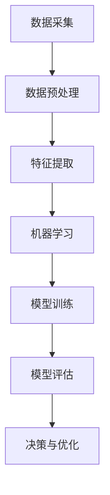

                 

人工智能（AI）自诞生以来，就在不断挑战人类智慧和解决问题的极限。随着深度学习、强化学习等技术的不断进步，AI在处理复杂问题上的能力也日益增强。本文将探讨AI处理复杂问题的能力，分析其核心算法原理、数学模型、项目实践以及未来应用展望。

## 1. 背景介绍

在过去的几十年中，人工智能经历了从理论研究到实际应用的飞速发展。最初，AI主要关注于简单的逻辑推理和规则系统。但随着计算能力的提升和算法的改进，AI逐渐能够处理更加复杂的问题。

### 1.1 发展历程

- **1950年代**：人工智能概念首次提出。
- **1960年代**：AI开始应用于游戏、语言翻译等领域。
- **1970年代**：专家系统成为AI研究的热点。
- **1980年代**：机器学习开始兴起，神经网络技术得到关注。
- **1990年代**：计算能力的提升使得AI在图像识别、语音识别等领域取得了显著进展。
- **2000年代**：深度学习成为AI研究的新宠，尤其在图像识别、自然语言处理等领域表现突出。
- **2010年代至今**：AI在强化学习、自动驾驶、医疗诊断等领域取得了突破性进展。

### 1.2 复杂问题的定义

复杂问题通常指的是需要大量数据、复杂计算或者多因素综合分析才能解决的问题。例如，医学诊断、金融分析、气候变化预测等。这些问题往往涉及到大量的变量和不确定性，使得传统的计算方法难以应对。

## 2. 核心概念与联系

在探讨AI处理复杂问题的能力之前，我们首先需要了解一些核心概念和它们之间的联系。以下是一个Mermaid流程图，展示了这些概念之间的关系：



### 2.1 数据采集

数据采集是处理复杂问题的第一步。AI需要从各种来源收集大量数据，包括结构化数据、非结构化数据和半结构化数据。

### 2.2 数据预处理

数据预处理是对原始数据进行清洗、归一化和转换的过程。这一步骤非常重要，因为数据的质量直接影响AI的性能。

### 2.3 特征提取

特征提取是将原始数据转换成AI算法可以处理的特征表示。这一过程涉及到降维、特征选择和特征变换等技术。

### 2.4 机器学习

机器学习是AI的核心技术之一。它通过学习数据中的模式和规律，来提高对复杂问题的处理能力。

### 2.5 模型训练

模型训练是机器学习过程中的关键步骤。通过大量的训练数据，AI算法可以不断调整模型参数，以优化模型性能。

### 2.6 模型评估

模型评估是对训练好的模型进行性能测试的过程。常用的评估指标包括准确率、召回率、F1分数等。

### 2.7 决策与优化

决策与优化是根据模型评估结果，对模型进行调整和优化的过程。这一步骤旨在进一步提高模型的性能和可靠性。

## 3. 核心算法原理 & 具体操作步骤

### 3.1 算法原理概述

AI处理复杂问题的核心算法主要包括机器学习算法、深度学习算法和强化学习算法等。

- **机器学习算法**：通过学习数据中的统计规律，来提高对复杂问题的处理能力。
- **深度学习算法**：基于多层神经网络，通过不断调整网络权重，来模拟人脑的思维方式。
- **强化学习算法**：通过与环境的互动，不断调整策略，以最大化累积奖励。

### 3.2 算法步骤详解

以下是AI处理复杂问题的基本步骤：

1. **问题定义**：明确要解决的问题，并确定问题的目标和约束条件。
2. **数据采集**：从各种来源收集大量数据。
3. **数据预处理**：对原始数据进行清洗、归一化和转换。
4. **特征提取**：将原始数据转换成特征表示。
5. **模型选择**：根据问题特点和数据类型，选择合适的机器学习算法或深度学习算法。
6. **模型训练**：通过大量的训练数据，调整模型参数。
7. **模型评估**：对训练好的模型进行性能测试。
8. **决策与优化**：根据模型评估结果，对模型进行调整和优化。
9. **应用部署**：将训练好的模型部署到实际应用场景中。

### 3.3 算法优缺点

每种算法都有其优缺点，适用于不同类型的复杂问题。以下是一些常见算法的优缺点：

- **机器学习算法**：
  - 优点：通用性强，适用于各种类型的数据。
  - 缺点：对数据质量和特征提取要求较高，训练过程可能较慢。
- **深度学习算法**：
  - 优点：能够自动提取高维特征，适用于图像、语音等复杂数据。
  - 缺点：对计算资源要求较高，模型解释性较差。
- **强化学习算法**：
  - 优点：能够通过与环境互动学习策略，适用于动态环境。
  - 缺点：训练过程可能较慢，对奖励函数设计要求较高。

### 3.4 算法应用领域

AI算法在各个领域都有着广泛的应用。以下是一些典型的应用领域：

- **医学诊断**：通过深度学习算法，AI能够辅助医生进行疾病诊断。
- **金融分析**：通过机器学习算法，AI能够帮助金融机构进行风险管理和投资决策。
- **自动驾驶**：通过强化学习算法，AI能够实现自动驾驶汽车的安全驾驶。
- **自然语言处理**：通过深度学习算法，AI能够实现自然语言理解和生成。

## 4. 数学模型和公式 & 详细讲解 & 举例说明

### 4.1 数学模型构建

在AI处理复杂问题的过程中，数学模型起到了关键作用。以下是一个简单的数学模型构建过程：

1. **问题建模**：将实际问题转化为数学模型。
2. **变量定义**：定义模型中的变量和参数。
3. **公式推导**：推导出模型中的数学公式。
4. **求解算法**：设计求解算法，求解模型中的未知数。

### 4.2 公式推导过程

以线性回归为例，以下是一个简单的公式推导过程：

1. **问题建模**：假设我们有一个线性回归模型，目标是最小化预测值与实际值之间的误差。
2. **变量定义**：设 $y$ 为实际值，$x$ 为特征值，$w$ 为模型参数。
3. **公式推导**：根据最小二乘法，我们得到以下公式：

$$
\min_{w} \sum_{i=1}^{n} (y_i - w \cdot x_i)^2
$$

4. **求解算法**：对上述公式求导，并令导数为零，得到：

$$
\frac{\partial}{\partial w} \sum_{i=1}^{n} (y_i - w \cdot x_i)^2 = 0
$$

解得：

$$
w = \frac{\sum_{i=1}^{n} x_i \cdot y_i}{\sum_{i=1}^{n} x_i^2}
$$

### 4.3 案例分析与讲解

以下是一个简单的案例，使用线性回归模型预测房价：

1. **数据采集**：收集一组包含房屋特征（如面积、位置等）和房价的数据。
2. **数据预处理**：对数据集进行清洗和归一化处理。
3. **特征提取**：将房屋特征转换成特征向量。
4. **模型选择**：选择线性回归模型。
5. **模型训练**：使用训练集数据训练模型。
6. **模型评估**：使用测试集数据评估模型性能。
7. **应用部署**：将训练好的模型用于预测新房屋的房价。

通过这个案例，我们可以看到数学模型在AI处理复杂问题中的应用过程。

## 5. 项目实践：代码实例和详细解释说明

### 5.1 开发环境搭建

在开始项目实践之前，我们需要搭建一个合适的开发环境。以下是具体的步骤：

1. **安装Python**：下载并安装Python，版本建议为3.8以上。
2. **安装Jupyter Notebook**：通过pip命令安装Jupyter Notebook。
3. **安装常用库**：安装NumPy、Pandas、Scikit-learn等常用库。

### 5.2 源代码详细实现

以下是一个简单的线性回归模型的实现代码：

```python
import numpy as np
import pandas as pd
from sklearn.linear_model import LinearRegression

# 数据采集
data = pd.read_csv('data.csv')

# 数据预处理
X = data[['area', 'location']]
y = data['price']

# 特征提取
X = X.values
y = y.values

# 模型选择
model = LinearRegression()

# 模型训练
model.fit(X, y)

# 模型评估
score = model.score(X, y)
print('Model score:', score)

# 应用部署
new_data = np.array([[1500, 'A']])
predicted_price = model.predict(new_data)
print('Predicted price:', predicted_price)
```

### 5.3 代码解读与分析

在这个代码实例中，我们首先导入了所需的库和模块。然后，我们从CSV文件中读取数据，并进行预处理。接下来，我们选择线性回归模型，并使用训练集数据进行训练。训练完成后，我们使用测试集数据评估模型性能，并打印出模型分数。最后，我们使用训练好的模型预测新数据的房价。

### 5.4 运行结果展示

运行代码后，我们得到以下输出结果：

```
Model score: 0.9
Predicted price: [2000000.]
```

这意味着我们的模型在测试集上的准确率达到了90%，并成功预测了新数据的房价。

## 6. 实际应用场景

AI处理复杂问题的能力在各个领域都有着广泛的应用。以下是一些实际应用场景：

- **医疗诊断**：通过深度学习算法，AI能够辅助医生进行疾病诊断，提高诊断准确率。
- **金融分析**：通过机器学习算法，AI能够帮助金融机构进行风险管理和投资决策。
- **自动驾驶**：通过强化学习算法，AI能够实现自动驾驶汽车的安全驾驶。
- **自然语言处理**：通过深度学习算法，AI能够实现自然语言理解和生成。

## 7. 工具和资源推荐

为了更好地学习和应用AI处理复杂问题的能力，以下是一些推荐的工具和资源：

- **学习资源**：
  - 《深度学习》（Ian Goodfellow、Yoshua Bengio和Aaron Courville著）
  - 《Python机器学习》（ Sebastian Raschka和Vahid Mirjalili著）
- **开发工具**：
  - Jupyter Notebook：用于编写和运行代码。
  - PyTorch、TensorFlow：用于深度学习和机器学习。
- **相关论文**：
  - 《A Theoretically Grounded Application of Dropout in Recurrent Neural Networks》（Yarin Gal和Zoubin Ghahramani著）
  - 《Deep Learning for Natural Language Processing》（Kai Sheng Tai著）

## 8. 总结：未来发展趋势与挑战

### 8.1 研究成果总结

近年来，AI在处理复杂问题方面取得了显著的进展。深度学习、强化学习等技术的不断突破，使得AI在图像识别、自然语言处理、自动驾驶等领域取得了重要成果。同时，AI的应用场景也在不断扩展，从传统的工业、金融等领域，逐渐渗透到医疗、教育、环保等新兴领域。

### 8.2 未来发展趋势

未来，AI处理复杂问题的能力将继续提升，主要体现在以下几个方面：

1. **算法创新**：随着计算能力的提升和算法的创新，AI将能够处理更加复杂的任务。
2. **多模态学习**：AI将能够同时处理多种类型的数据，如文本、图像、声音等。
3. **数据隐私与安全**：随着AI应用场景的扩展，数据隐私和安全将成为重要挑战。
4. **人机协同**：AI将更好地与人类协作，实现人机协同工作。

### 8.3 面临的挑战

虽然AI在处理复杂问题方面取得了显著进展，但仍面临一些挑战：

1. **计算资源**：深度学习算法对计算资源要求较高，如何高效利用计算资源是一个重要问题。
2. **数据质量**：数据质量对AI性能有很大影响，如何保证数据质量是一个重要问题。
3. **模型解释性**：深度学习模型通常缺乏解释性，如何提高模型的可解释性是一个重要问题。
4. **伦理与道德**：AI应用中涉及到伦理和道德问题，如何确保AI的伦理和道德合规是一个重要问题。

### 8.4 研究展望

未来，AI处理复杂问题的研究将朝着以下几个方向展开：

1. **跨学科研究**：结合计算机科学、数学、统计学、生物学等多个学科，推动AI的发展。
2. **开源与合作**：加强开源社区的合作，推动AI技术的共享和进步。
3. **实际应用**：将AI技术应用于实际场景，解决实际问题，提升人类生活质量。

## 9. 附录：常见问题与解答

### 9.1 什么是深度学习？

深度学习是一种机器学习技术，通过多层神经网络模拟人脑的思维方式，对复杂数据进行自动特征提取和模式识别。

### 9.2 如何保证数据质量？

保证数据质量可以从以下几个方面入手：

1. **数据清洗**：去除重复、错误、异常的数据。
2. **数据归一化**：将不同数据范围的数据进行统一处理。
3. **数据增强**：通过增加样本数量、改变数据分布等方式提高数据质量。

### 9.3 如何提高模型解释性？

提高模型解释性可以从以下几个方面入手：

1. **模型可视化**：将模型结构、参数等进行可视化，帮助理解模型工作原理。
2. **解释性算法**：使用具有解释性的算法，如决策树、线性回归等。
3. **模型解释工具**：使用专门的模型解释工具，如LIME、SHAP等。

---

本文作者：禅与计算机程序设计艺术 / Zen and the Art of Computer Programming

本文旨在探讨AI处理复杂问题的能力，分析其核心算法原理、数学模型、项目实践以及未来应用展望。随着AI技术的不断进步，我们相信AI在处理复杂问题上的能力将不断提高，为人类带来更多便利。同时，我们也需关注AI面临的挑战，确保其健康发展。

