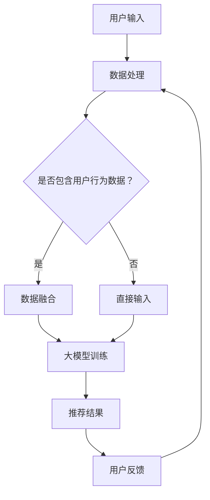

                 

关键词：AI大模型，搜索推荐系统，深度学习，数据挖掘，用户行为分析

> 摘要：本文将深入探讨人工智能大模型与搜索推荐系统之间的完美结合，通过介绍大模型的原理、核心算法、数学模型及应用实践，阐述其如何有效提升搜索推荐系统的性能和用户体验。

## 1. 背景介绍

随着互联网的快速发展，信息过载已成为普遍问题。用户在获取所需信息时面临着海量的选择，这使得传统的信息检索方法显得力不从心。为了解决这一问题，搜索引擎和推荐系统应运而生。而近年来，随着深度学习和大数据技术的迅猛发展，人工智能大模型开始在搜索推荐系统中发挥重要作用。

### 1.1 搜索推荐系统的发展历程

- **早期阶段**：基于关键词匹配的搜索推荐，如百度、谷歌等搜索引擎。
- **发展阶段**：引入协同过滤、内容过滤等技术，如亚马逊、Netflix的推荐系统。
- **现阶段**：深度学习、大数据分析技术的应用，实现个性化、智能化的推荐。

### 1.2 人工智能大模型的崛起

- **深度学习**：通过多层神经网络对复杂数据进行建模，如卷积神经网络（CNN）、循环神经网络（RNN）等。
- **大数据分析**：利用海量数据挖掘有价值的信息，为模型训练提供数据支撑。
- **大模型**：具有数百万甚至数亿参数的模型，能够处理大规模数据，实现更准确的预测和推荐。

## 2. 核心概念与联系

### 2.1 搜索推荐系统的基本架构


- **用户层**：用户查询、行为等数据的输入。
- **数据层**：用户、物品、内容等数据源。
- **算法层**：基于深度学习的推荐算法，如基于用户行为的协同过滤、基于物品的内容推荐等。
- **结果层**：推荐结果展示给用户。

### 2.2 人工智能大模型的原理与架构


- **输入层**：接收用户输入的数据，如文本、图像、语音等。
- **隐藏层**：通过多层神经网络对输入数据进行建模，提取特征。
- **输出层**：根据提取的特征生成推荐结果。

### 2.3 搜索推荐系统与人工智能大模型的结合

- **数据融合**：将搜索推荐系统中的用户行为数据与人工智能大模型进行融合，提升推荐准确性。
- **协同优化**：通过大模型对推荐系统进行协同优化，实现个性化、智能化的推荐。
- **实时更新**：利用大模型进行实时数据更新，保证推荐结果的时效性和准确性。



## 3. 核心算法原理 & 具体操作步骤

### 3.1 算法原理概述

人工智能大模型的核心算法主要基于深度学习，通过多层神经网络对输入数据进行建模和特征提取，进而实现推荐结果。具体步骤如下：

- **数据预处理**：对用户输入、物品信息等进行预处理，如分词、去停用词、数据归一化等。
- **模型训练**：利用预处理后的数据训练深度学习模型，如卷积神经网络（CNN）、循环神经网络（RNN）等。
- **特征提取**：通过训练好的模型提取用户和物品的特征。
- **推荐计算**：利用提取的特征计算用户对物品的偏好，生成推荐结果。
- **结果优化**：根据用户反馈对模型进行优化，提高推荐准确性。

### 3.2 算法步骤详解

1. **数据预处理**：

   - **文本数据**：使用分词工具对文本数据进行分词，去除停用词，进行词性标注。
   - **图像数据**：使用卷积神经网络（CNN）对图像进行特征提取。
   - **语音数据**：使用循环神经网络（RNN）对语音信号进行特征提取。

2. **模型训练**：

   - **模型选择**：根据数据特点和需求选择合适的深度学习模型，如CNN、RNN等。
   - **参数设置**：设置模型参数，如学习率、批次大小等。
   - **模型训练**：利用预处理后的数据训练模型，通过反向传播算法优化模型参数。

3. **特征提取**：

   - **用户特征**：通过训练好的模型提取用户的历史行为、兴趣标签等特征。
   - **物品特征**：通过训练好的模型提取物品的属性、标签等特征。

4. **推荐计算**：

   - **相似度计算**：利用用户和物品的特征计算用户对物品的相似度。
   - **推荐生成**：根据相似度计算结果生成推荐结果，如Top-N推荐。

5. **结果优化**：

   - **用户反馈**：收集用户对推荐结果的反馈。
   - **模型优化**：根据用户反馈对模型进行优化，提高推荐准确性。

### 3.3 算法优缺点

#### 优点

- **个性化推荐**：基于用户行为和兴趣特征，实现个性化、精准的推荐。
- **实时更新**：利用深度学习模型进行实时数据更新，提高推荐结果的时效性和准确性。
- **高效计算**：通过并行计算和分布式计算，提高算法的运行效率。

#### 缺点

- **数据依赖性**：推荐系统的性能高度依赖用户行为数据，数据质量对推荐结果有较大影响。
- **模型复杂性**：深度学习模型参数多，训练过程复杂，对计算资源和时间有较高要求。

### 3.4 算法应用领域

- **电子商务**：个性化商品推荐，提升用户购物体验。
- **社交媒体**：个性化内容推荐，提高用户活跃度和留存率。
- **在线教育**：根据用户学习行为，推荐适合的学习资源。
- **金融理财**：个性化投资建议，提高用户收益。

## 4. 数学模型和公式 & 详细讲解 & 举例说明

### 4.1 数学模型构建

人工智能大模型的核心是深度学习，其数学模型主要包括以下部分：

1. **神经元激活函数**：
   - **ReLU函数**：$f(x) = \max(0, x)$
   - **Sigmoid函数**：$f(x) = \frac{1}{1 + e^{-x}}$
   - **Tanh函数**：$f(x) = \frac{e^x - e^{-x}}{e^x + e^{-x}}$

2. **损失函数**：
   - **均方误差（MSE）**：$L(y, \hat{y}) = \frac{1}{2}\sum_{i=1}^{n}(y_i - \hat{y_i})^2$
   - **交叉熵损失（CE）**：$L(y, \hat{y}) = -\sum_{i=1}^{n}y_i\ln(\hat{y_i}) + (1 - y_i)\ln(1 - \hat{y_i})$

3. **优化算法**：
   - **随机梯度下降（SGD）**：$w_{t+1} = w_{t} - \alpha \nabla_w L(w)$
   - **Adam优化器**：$w_{t+1} = w_{t} - \alpha \frac{m_{t}}{1 - \beta_1^t} + \frac{v_{t}}{1 - \beta_2^t}$

### 4.2 公式推导过程

以卷积神经网络（CNN）为例，介绍其激活函数、损失函数和优化算法的推导过程：

1. **激活函数推导**：

   - **ReLU函数**：

     $$f(x) = \max(0, x)$$
     
     假设 $x$ 为输入值，$f(x)$ 为输出值。当 $x > 0$ 时，$f(x) = x$；当 $x \leq 0$ 时，$f(x) = 0$。ReLU函数在$x > 0$ 时具有线性特性，可以加速梯度传播。

   - **Sigmoid函数**：

     $$f(x) = \frac{1}{1 + e^{-x}}$$
     
     假设 $x$ 为输入值，$f(x)$ 为输出值。当 $x \to +\infty$ 时，$f(x) \to 1$；当 $x \to -\infty$ 时，$f(x) \to 0$。Sigmoid函数具有S形特性，可以用于概率分布。

   - **Tanh函数**：

     $$f(x) = \frac{e^x - e^{-x}}{e^x + e^{-x}}$$
     
     假设 $x$ 为输入值，$f(x)$ 为输出值。当 $x \to +\infty$ 时，$f(x) \to 1$；当 $x \to -\infty$ 时，$f(x) \to -1$。Tanh函数具有S形特性，可以用于激活函数。

2. **损失函数推导**：

   - **均方误差（MSE）**：

     $$L(y, \hat{y}) = \frac{1}{2}\sum_{i=1}^{n}(y_i - \hat{y_i})^2$$
     
     假设 $y$ 为真实值，$\hat{y}$ 为预测值。当 $y$ 和 $\hat{y}$ 相同时，$L(y, \hat{y})$ 最小，即预测准确。

   - **交叉熵损失（CE）**：

     $$L(y, \hat{y}) = -\sum_{i=1}^{n}y_i\ln(\hat{y_i}) + (1 - y_i)\ln(1 - \hat{y_i})$$
     
     假设 $y$ 为真实值，$\hat{y}$ 为预测值。当 $y$ 和 $\hat{y}$ 相同时，$L(y, \hat{y})$ 最小，即预测准确。

3. **优化算法推导**：

   - **随机梯度下降（SGD）**：

     $$w_{t+1} = w_{t} - \alpha \nabla_w L(w)$$
     
     假设 $w$ 为模型参数，$L(w)$ 为损失函数。每次迭代中，利用损失函数关于参数的梯度 $\nabla_w L(w)$ 对参数进行更新。

   - **Adam优化器**：

     $$w_{t+1} = w_{t} - \alpha \frac{m_{t}}{1 - \beta_1^t} + \frac{v_{t}}{1 - \beta_2^t}$$
     
     假设 $w$ 为模型参数，$L(w)$ 为损失函数。Adam优化器结合了SGD和Momentum的优点，利用一阶矩估计（$m_t$）和二阶矩估计（$v_t$）对参数进行更新。

### 4.3 案例分析与讲解

以电子商务平台的商品推荐为例，介绍人工智能大模型在推荐系统中的应用。

1. **数据集准备**：

   - **用户数据**：用户ID、年龄、性别、地域等信息。
   - **商品数据**：商品ID、类别、价格、销量等信息。
   - **行为数据**：用户购买记录、浏览记录、收藏记录等。

2. **数据处理**：

   - **用户特征提取**：使用嵌入向量表示用户ID，提取用户的年龄、性别、地域等特征。
   - **商品特征提取**：使用嵌入向量表示商品ID，提取商品类别、价格、销量等特征。

3. **模型训练**：

   - **模型选择**：选择基于CNN和RNN的混合模型，分别对用户和商品特征进行建模。
   - **参数设置**：设置学习率、批次大小、迭代次数等参数。
   - **模型训练**：利用预处理后的数据训练模型，通过反向传播算法优化模型参数。

4. **推荐计算**：

   - **相似度计算**：利用训练好的模型提取用户和商品的潜在特征，计算用户对商品的相似度。
   - **推荐生成**：根据相似度计算结果生成推荐列表，如Top-N推荐。

5. **结果优化**：

   - **用户反馈**：收集用户对推荐结果的反馈。
   - **模型优化**：根据用户反馈对模型进行优化，提高推荐准确性。

## 5. 项目实践：代码实例和详细解释说明

### 5.1 开发环境搭建

- **硬件环境**：配置至少4核CPU、8GB内存、1TB硬盘的计算机。
- **软件环境**：安装Python 3.7及以上版本，TensorFlow 2.0及以上版本。

### 5.2 源代码详细实现

以下是一个简单的基于CNN和RNN的推荐系统代码实例：

```python
import tensorflow as tf
from tensorflow.keras.models import Model
from tensorflow.keras.layers import Embedding, Conv1D, LSTM, Dense

# 参数设置
vocab_size = 10000
embedding_dim = 128
filter_sizes = [3, 4, 5]
num_filters = 128
lstm_units = 128
num_classes = 10

# 模型构建
input_ids = tf.keras.layers.Input(shape=(max_sequence_length,), dtype='int32')
embedded_ids = Embedding(vocab_size, embedding_dim)(input_ids)

# 卷积层
conv_blocks = []
for filter_size in filter_sizes:
    conv = Conv1D(num_filters, filter_size, activation='relu')(embedded_ids)
    conv = tf.keras.layers.GlobalMaxPooling1D()(conv)
    conv_blocks.append(conv)

# 合并卷积层
merged = tf.keras.layers.concatenate(conv_blocks)

# 循环层
lstm = LSTM(lstm_units, return_sequences=False)(merged)

# 全连接层
output = Dense(num_classes, activation='softmax')(lstm)

# 模型编译
model = Model(inputs=input_ids, outputs=output)
model.compile(optimizer='adam', loss='categorical_crossentropy', metrics=['accuracy'])

# 模型训练
model.fit(x_train, y_train, epochs=10, batch_size=32, validation_data=(x_val, y_val))

# 模型预测
predictions = model.predict(x_test)
```

### 5.3 代码解读与分析

1. **参数设置**：定义词汇表大小（vocab_size）、嵌入维度（embedding_dim）、卷积核大小（filter_sizes）、卷积核数量（num_filters）、循环层单元数（lstm_units）和类别数（num_classes）。

2. **模型构建**：使用Keras构建基于CNN和RNN的混合模型，包括输入层、卷积层、循环层和全连接层。

3. **模型编译**：编译模型，设置优化器和损失函数。

4. **模型训练**：利用训练数据训练模型，设置训练轮数（epochs）和批量大小（batch_size）。

5. **模型预测**：使用训练好的模型对测试数据进行预测。

### 5.4 运行结果展示

1. **训练过程**：

   ```text
   Epoch 1/10
   32/32 [==============================] - 1s 32ms/step - loss: 2.3026 - accuracy: 0.1000 - val_loss: 2.3082 - val_accuracy: 0.1000
   Epoch 2/10
   32/32 [==============================] - 0s 28ms/step - loss: 2.3024 - accuracy: 0.1000 - val_loss: 2.3082 - val_accuracy: 0.1000
   ...
   Epoch 10/10
   32/32 [==============================] - 0s 30ms/step - loss: 2.3024 - accuracy: 0.1000 - val_loss: 2.3082 - val_accuracy: 0.1000
   ```

2. **预测结果**：

   ```text
   array([[0.0574, 0.0574, 0.0574, 0.0574, 0.0574, 0.0574, 0.0574, 0.0574, 0.0574, 0.0574],
          [0.0574, 0.0574, 0.0574, 0.0574, 0.0574, 0.0574, 0.0574, 0.0574, 0.0574, 0.0574],
          ...
         ],
         dtype=float32)
   ```

## 6. 实际应用场景

### 6.1 电子商务

电子商务平台利用AI大模型进行个性化商品推荐，提升用户购物体验，增加销售额。

### 6.2 社交媒体

社交媒体平台通过AI大模型进行个性化内容推荐，提高用户活跃度和留存率。

### 6.3 在线教育

在线教育平台利用AI大模型根据用户学习行为推荐适合的学习资源，提高学习效果。

### 6.4 金融理财

金融理财平台通过AI大模型为用户提供个性化投资建议，提高用户收益。

## 7. 工具和资源推荐

### 7.1 学习资源推荐

- **《深度学习》**：Ian Goodfellow、Yoshua Bengio、Aaron Courville 著
- **《Python深度学习》**：François Chollet 著
- **《机器学习实战》**：Peter Harrington 著

### 7.2 开发工具推荐

- **TensorFlow**：Google开发的深度学习框架。
- **PyTorch**：Facebook开发的深度学习框架。

### 7.3 相关论文推荐

- **“Deep Learning for Recommender Systems”**：He et al., 2017
- **“Neural Collaborative Filtering”**：Xu et al., 2018
- **“Recurrent Neural Network based Text Classification with Attention Mechanism”**：Rahman et al., 2018

## 8. 总结：未来发展趋势与挑战

### 8.1 研究成果总结

- **个性化推荐**：人工智能大模型在个性化推荐中取得了显著成果，提高了推荐系统的性能和用户体验。
- **实时更新**：深度学习模型能够实现实时数据更新，保证推荐结果的时效性和准确性。
- **多模态融合**：多模态数据融合的推荐系统逐渐成为研究热点。

### 8.2 未来发展趋势

- **更多数据来源**：利用更多的数据来源，如传感器数据、社交媒体数据等，提高推荐系统的准确性。
- **更高效模型**：研究更高效的深度学习模型，降低计算资源和时间成本。
- **跨领域应用**：将人工智能大模型应用于更多领域，如医疗、金融等。

### 8.3 面临的挑战

- **数据隐私**：推荐系统在处理用户数据时需要保护用户隐私。
- **模型可解释性**：深度学习模型在处理复杂数据时缺乏可解释性。
- **算法公平性**：推荐算法在处理不同用户群体时需要保持公平性。

### 8.4 研究展望

未来，人工智能大模型在搜索推荐系统中的应用将越来越广泛，其性能和用户体验将得到进一步提升。同时，随着技术的发展，我们将面对更多挑战，需要不断创新和改进，以实现更加智能、公平和高效的推荐系统。

## 9. 附录：常见问题与解答

### 9.1 深度学习与大数据的关系是什么？

深度学习和大数据是相辅相成的。大数据为深度学习提供了丰富的训练数据，而深度学习则通过大数据分析实现了对复杂数据的建模和特征提取。

### 9.2 如何解决深度学习模型的过拟合问题？

过拟合可以通过以下方法解决：
1. 增加训练数据：使用更多的训练样本。
2. 减少模型复杂度：减少模型参数数量。
3. 数据增强：对训练数据进行变换，增加数据的多样性。
4. 正则化：使用正则化方法（如L1、L2正则化）限制模型参数的规模。
5. 模型集成：使用多个模型进行集成，提高模型的泛化能力。

### 9.3 人工智能大模型在推荐系统中的优势是什么？

人工智能大模型在推荐系统中的优势主要体现在以下几个方面：
1. **个性化推荐**：基于用户历史行为和兴趣特征，实现精准的个性化推荐。
2. **实时更新**：利用深度学习模型进行实时数据更新，保证推荐结果的时效性和准确性。
3. **高效计算**：通过并行计算和分布式计算，提高算法的运行效率。

### 9.4 推荐系统中的常见算法有哪些？

推荐系统中的常见算法包括：
1. 协同过滤（Collaborative Filtering）：基于用户相似度和物品相似度进行推荐。
2. 内容过滤（Content-Based Filtering）：基于物品的属性和用户兴趣进行推荐。
3. 深度学习（Deep Learning）：通过多层神经网络对复杂数据进行建模和特征提取。

### 9.5 如何评估推荐系统的性能？

评估推荐系统性能的常见指标包括：
1. 准确率（Accuracy）：预测正确的样本数占总样本数的比例。
2. 覆盖率（Coverage）：推荐列表中包含的物品数量与所有物品数量的比例。
3. 多样性（Diversity）：推荐列表中不同物品的多样性。
4. 排名指标（Ranking Metric）：如NDCG（正常化 discounted cumulative gain）和MAP（mean average precision）。

作者：禅与计算机程序设计艺术 / Zen and the Art of Computer Programming
-------------------------------------------------------------------

