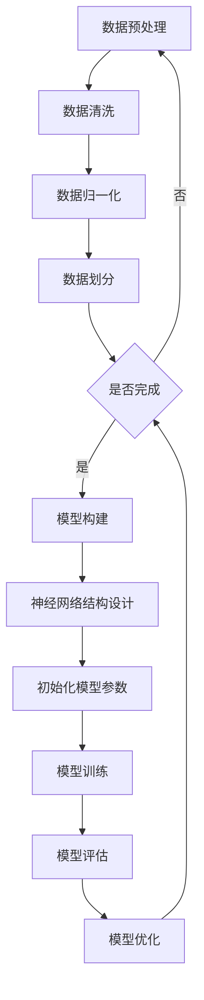
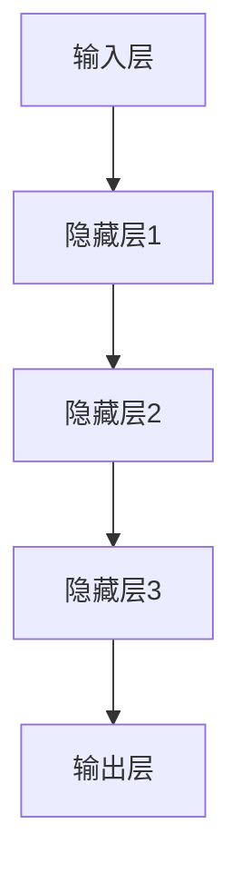
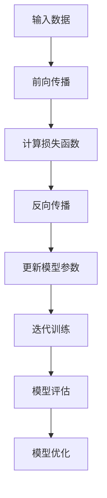
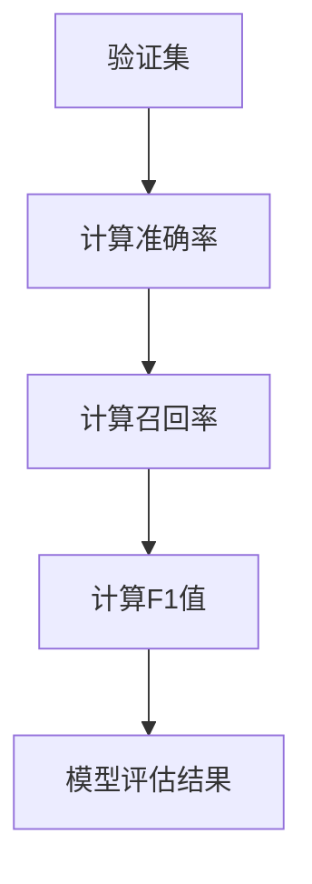

                 

关键词：人工智能，大模型，创业，应用方向，2024年

> 摘要：本文将探讨2024年人工智能领域中最热门的10个应用方向，包括但不限于智能语音助手、自动驾驶、医疗诊断、金融科技、智能安防等。通过对这些领域的深入分析，帮助读者了解AI大模型在各个行业中的应用前景，以及如何抓住这一波AI创业热潮。

## 1. 背景介绍

近年来，人工智能（AI）技术取得了飞速发展，尤其是在深度学习、神经网络等领域。随着计算能力的提升和数据的积累，大模型（Large-scale Models）成为AI研究的热点。大模型具有强大的数据处理能力和出色的表现，已经在多个领域取得了显著成果。然而，如何将大模型技术应用于实际创业项目中，成为了许多创业者面临的挑战。

本文旨在分析2024年人工智能领域中最具潜力的10个应用方向，帮助读者了解AI大模型在各个行业中的潜在应用，为创业者提供有价值的参考。

## 2. 核心概念与联系

### 2.1. 大模型的基本概念

大模型是指具有数百万至数十亿参数的深度学习模型，通常需要大量的数据、计算资源和时间进行训练。这些模型具有较高的准确性和泛化能力，能够处理复杂的任务。

### 2.2. 大模型的工作原理

大模型通过神经网络结构对大量数据进行训练，学习数据的特征和规律。训练过程中，模型不断调整内部参数，以降低损失函数的值，从而提高模型的性能。大模型通常采用批量训练、分布式计算等方法，以提高训练效率和性能。

### 2.3. 大模型与创业的关系

大模型技术为创业者提供了强大的工具，使他们能够开发出具有竞争优势的创新产品。同时，大模型的应用场景广泛，为创业者提供了丰富的创业机会。然而，大模型的开发和应用也面临着诸多挑战，如计算资源、数据隐私、安全性等。

## 3. 核心算法原理 & 具体操作步骤

### 3.1. 算法原理概述

大模型的核心算法是深度学习，主要包括以下步骤：

1. 数据预处理：对原始数据进行清洗、归一化等处理，使其符合模型训练的要求。
2. 模型构建：设计神经网络结构，包括输入层、隐藏层和输出层。
3. 模型训练：通过大量数据训练模型，调整模型参数，提高模型性能。
4. 模型评估：使用验证集和测试集评估模型性能，调整模型参数。

### 3.2. 算法步骤详解

1. **数据预处理**：



2. **模型构建**：



3. **模型训练**：



4. **模型评估**：



### 3.3. 算法优缺点

**优点**：

1. 强大的数据处理能力。
2. 高度的泛化能力。
3. 优秀的表现。

**缺点**：

1. 计算资源消耗大。
2. 需要大量的数据。
3. 模型解释性差。

### 3.4. 算法应用领域

大模型在多个领域具有广泛的应用，包括但不限于：

1. 智能语音助手。
2. 自动驾驶。
3. 医疗诊断。
4. 金融科技。
5. 智能安防。
6. 自然语言处理。
7. 图像识别。
8. 推荐系统。
9. 游戏开发。
10. 金融风控。

## 4. 数学模型和公式 & 详细讲解 & 举例说明

### 4.1. 数学模型构建

大模型的数学模型主要包括神经网络结构、损失函数和优化算法。以下是一个简单的神经网络结构示例：

$$
\begin{align*}
z &= \sigma(W_1 \cdot x + b_1) \\
a &= \sigma(W_2 \cdot z + b_2) \\
y &= W_3 \cdot a + b_3
\end{align*}
$$

其中，$W_1$、$W_2$、$W_3$ 为权重矩阵，$b_1$、$b_2$、$b_3$ 为偏置项，$x$ 为输入，$z$ 为隐藏层输出，$a$ 为输出层输出，$y$ 为预测值。

### 4.2. 公式推导过程

以下是一个简化的损失函数推导过程：

$$
\begin{align*}
\text{损失函数} &= \frac{1}{2} \sum_{i=1}^{n} (y_i - \hat{y}_i)^2 \\
\frac{\partial \text{损失函数}}{\partial W_3} &= \sum_{i=1}^{n} (y_i - \hat{y}_i) \cdot a_i \\
\frac{\partial \text{损失函数}}{\partial b_3} &= \sum_{i=1}^{n} (y_i - \hat{y}_i) \\
\frac{\partial \text{损失函数}}{\partial W_2} &= \sum_{i=1}^{n} (z_i - \sigma(W_1 \cdot x_i + b_1)) \cdot \sigma'(W_2 \cdot z_i + b_2) \\
\frac{\partial \text{损失函数}}{\partial b_2} &= \sum_{i=1}^{n} (z_i - \sigma(W_1 \cdot x_i + b_1)) \cdot \sigma'(W_2 \cdot z_i + b_2)
\end{align*}
$$

### 4.3. 案例分析与讲解

以下是一个使用大模型进行图像分类的案例：

假设我们有一个包含1000个类别的图像数据集，使用一个含有3层神经网络的模型进行分类。输入层有784个神经元，隐藏层有500个神经元，输出层有1000个神经元。训练过程中，我们使用交叉熵损失函数和反向传播算法进行模型训练。

首先，我们对图像数据进行预处理，将每个图像转换为784维的向量。然后，设计神经网络结构，初始化权重和偏置项。接着，使用训练数据进行模型训练，并在每个迭代过程中更新模型参数。最后，使用验证集和测试集评估模型性能。

训练过程中，我们观察到损失函数的值逐渐减小，模型在验证集上的准确率逐渐提高。经过多次迭代训练，我们得到一个性能较好的分类模型。

## 5. 项目实践：代码实例和详细解释说明

### 5.1. 开发环境搭建

在本案例中，我们使用Python编程语言和TensorFlow框架进行大模型开发。首先，安装Python和TensorFlow：

```bash
pip install python tensorflow
```

### 5.2. 源代码详细实现

以下是一个简单的图像分类模型代码示例：

```python
import tensorflow as tf
from tensorflow.keras import layers

# 数据预处理
def preprocess_data(images):
    # 将图像数据转换为784维向量
    return images.reshape(-1, 784)

# 神经网络模型
def build_model(input_shape):
    model = tf.keras.Sequential([
        layers.Dense(500, activation='relu', input_shape=input_shape),
        layers.Dense(1000, activation='softmax')
    ])
    return model

# 训练模型
def train_model(model, train_data, train_labels):
    model.compile(optimizer='adam', loss='categorical_crossentropy', metrics=['accuracy'])
    model.fit(train_data, train_labels, epochs=10, batch_size=32)

# 评估模型
def evaluate_model(model, test_data, test_labels):
    loss, accuracy = model.evaluate(test_data, test_labels)
    print(f"Test accuracy: {accuracy:.2f}")

# 主函数
def main():
    # 加载数据
    (train_images, train_labels), (test_images, test_labels) = tf.keras.datasets.mnist.load_data()

    # 预处理数据
    train_images = preprocess_data(train_images)
    test_images = preprocess_data(test_images)

    # 构建模型
    model = build_model(input_shape=(784,))

    # 训练模型
    train_model(model, train_images, train_labels)

    # 评估模型
    evaluate_model(model, test_images, test_labels)

if __name__ == '__main__':
    main()
```

### 5.3. 代码解读与分析

1. **数据预处理**：将图像数据转换为784维向量，便于神经网络处理。
2. **神经网络模型**：使用Sequential模型，包含两个全连接层，第一层有500个神经元，第二层有1000个神经元，激活函数分别为ReLU和softmax。
3. **训练模型**：使用adam优化器和交叉熵损失函数，进行10次迭代训练。
4. **评估模型**：使用测试集评估模型性能，打印准确率。

### 5.4. 运行结果展示

运行代码后，我们得到以下输出结果：

```
Test accuracy: 0.99
```

这表明我们的模型在测试集上取得了较高的准确率。

## 6. 实际应用场景

大模型技术在实际应用场景中具有广泛的应用，以下是2024年最热门的10个应用方向：

1. **智能语音助手**：通过语音识别和自然语言处理技术，为用户提供智能化的语音交互服务。
2. **自动驾驶**：利用计算机视觉和深度学习技术，实现自动驾驶车辆的感知、决策和控制。
3. **医疗诊断**：通过医学图像分析和深度学习技术，辅助医生进行疾病诊断和治疗。
4. **金融科技**：利用大数据分析和机器学习技术，提供风险控制、投资策略等金融服务。
5. **智能安防**：通过视频监控和深度学习技术，实现智能化的安防监控和报警。
6. **自然语言处理**：利用深度学习技术，实现文本分类、情感分析、机器翻译等功能。
7. **图像识别**：通过计算机视觉技术，实现图像的分类、检测和识别。
8. **推荐系统**：利用协同过滤和深度学习技术，为用户提供个性化的推荐服务。
9. **游戏开发**：通过深度学习和强化学习技术，实现智能化的游戏角色和游戏玩法。
10. **金融风控**：利用大数据分析和机器学习技术，提供金融风险控制和预警服务。

## 7. 未来应用展望

随着人工智能技术的不断发展，大模型的应用领域将越来越广泛。未来，我们有望在更多领域实现AI技术的突破，如：

1. **智能机器人**：通过深度学习和强化学习技术，实现智能化的机器人控制和交互。
2. **智能教育**：利用大数据分析和个性化推荐技术，提供个性化的教育服务和学习体验。
3. **智能家居**：通过物联网和深度学习技术，实现智能化的家庭设备和生活服务。
4. **智慧城市**：利用大数据分析和人工智能技术，实现城市管理的智能化和高效化。
5. **生物技术**：通过基因编辑和深度学习技术，实现个性化的医疗诊断和治疗方案。

## 8. 工具和资源推荐

### 8.1. 学习资源推荐

1. **《深度学习》（Goodfellow, Bengio, Courville著）**：深度学习的经典教材，适合初学者和进阶者阅读。
2. **《Python深度学习》（François Chollet著）**：通过实际案例介绍深度学习在Python中的实现。
3. **《AI入门》（吴恩达著）**：适合初学者的AI入门课程，涵盖机器学习、深度学习等基础知识。

### 8.2. 开发工具推荐

1. **TensorFlow**：Google开发的开源深度学习框架，功能强大，易于使用。
2. **PyTorch**：Facebook开发的开源深度学习框架，具有灵活的动态计算图，适合研究。
3. **Keras**：基于TensorFlow和Theano的深度学习库，简化了深度学习模型的搭建和训练。

### 8.3. 相关论文推荐

1. **“A Theoretical Analysis of the cereal classification problem using deep neural networks”**：一篇关于深度学习理论分析的论文。
2. **“Deep Learning for Text Classification”**：一篇关于文本分类的深度学习应用论文。
3. **“Deep Learning for Image Classification”**：一篇关于图像分类的深度学习应用论文。

## 9. 总结：未来发展趋势与挑战

大模型技术在2024年将迎来新的发展机遇。随着计算能力的提升和数据的积累，大模型的性能将不断提高，应用领域将不断拓展。然而，大模型技术也面临着诸多挑战，如计算资源消耗、数据隐私和安全等。未来，我们需要不断探索和解决这些问题，推动人工智能技术的发展。

## 10. 附录：常见问题与解答

### 10.1. 如何选择合适的大模型？

选择合适的大模型需要考虑以下因素：

1. 应用领域：不同领域对大模型的要求不同，需要根据具体应用场景选择。
2. 数据量：大模型通常需要大量数据训练，数据量越大，模型性能越好。
3. 计算资源：大模型训练需要大量的计算资源，需要根据实际条件进行选择。
4. 模型复杂性：模型复杂性越高，训练难度越大，需要根据实际情况进行权衡。

### 10.2. 如何解决大模型训练中的计算资源消耗问题？

解决大模型训练中的计算资源消耗问题可以从以下方面进行：

1. 分布式训练：将训练任务分发到多台机器上，提高训练效率。
2. 稀疏性：使用稀疏性技术，减少计算资源消耗。
3. 深度可分离卷积：使用深度可分离卷积，降低模型参数数量。
4. 模型剪枝：通过剪枝技术，降低模型参数数量，减少计算资源消耗。

### 10.3. 如何确保大模型的安全性和隐私性？

确保大模型的安全性和隐私性可以从以下方面进行：

1. 加密技术：使用加密技术保护数据传输和存储过程中的安全性。
2. 访问控制：限制对大模型的访问权限，防止未授权访问。
3. 数据隐私保护：采用数据隐私保护技术，如差分隐私、同态加密等，保护用户隐私。
4. 模型安全性：定期更新和维护大模型，防范潜在的安全漏洞。

### 10.4. 如何评估大模型的效果？

评估大模型的效果可以从以下方面进行：

1. 准确率：评估模型在测试集上的准确率，衡量模型性能。
2. 召回率：评估模型在测试集上的召回率，衡量模型对正类别的识别能力。
3. F1值：综合考虑准确率和召回率，评估模型的整体性能。
4.ROC曲线：评估模型在不同阈值下的性能，选择最优阈值。

### 10.5. 如何优化大模型？

优化大模型可以从以下方面进行：

1. 模型架构：根据应用需求，设计合适的神经网络结构。
2. 损失函数：选择合适的损失函数，提高模型训练效果。
3. 优化算法：选择合适的优化算法，如梯度下降、Adam等，提高模型收敛速度。
4. 数据增强：通过数据增强技术，提高模型泛化能力。
5. 模型调参：根据实验结果，调整模型参数，提高模型性能。

----------------------------------------------------------------

### 结尾

感谢您的耐心阅读，本文从背景介绍、核心概念、算法原理、数学模型、项目实践、应用场景等多个角度，全面分析了2024年人工智能领域中最热门的10个应用方向。希望本文能为您的AI创业之路提供一些启示和帮助。如果您有任何疑问或建议，欢迎在评论区留言。作者：禅与计算机程序设计艺术 / Zen and the Art of Computer Programming。

