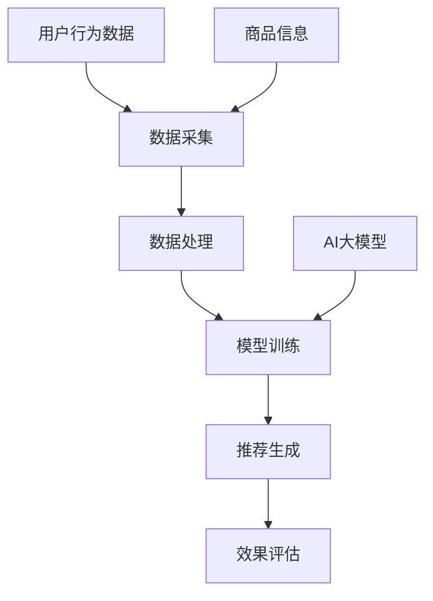

                 

关键词：AI大模型、电商搜索、推荐系统、敏捷开发、搜索推荐、模型优化、用户体验

> 摘要：随着人工智能技术的快速发展，大模型在电商搜索推荐业务中的应用逐渐成为热点。本文将探讨如何利用AI大模型助力电商搜索推荐业务的敏捷开发实践，包括核心概念、算法原理、数学模型、项目实践和未来展望等，旨在为电商企业提供一条高效、智能的搜索推荐之路。

## 1. 背景介绍

随着互联网的普及和电子商务的快速发展，用户对电商平台的搜索推荐体验提出了越来越高的要求。传统的搜索推荐算法在应对大规模用户数据和复杂业务场景时，往往存在响应速度慢、推荐结果不准确等问题。为了提升用户体验和业务效益，各大电商平台纷纷引入人工智能技术，特别是AI大模型，以期实现更精准、更高效的搜索推荐。

AI大模型，通常是指基于深度学习技术构建的具有强大学习能力和泛化能力的人工智能系统。这类模型在处理复杂数据和任务时，可以显著提高性能和效率。在电商搜索推荐业务中，AI大模型的应用可以帮助解决数据多样性和不确定性带来的挑战，从而实现更智能、更个性化的推荐。

## 2. 核心概念与联系

为了更好地理解AI大模型在电商搜索推荐业务中的应用，首先需要了解一些核心概念和它们之间的联系。以下是几个关键概念及其在电商搜索推荐业务中的关系：

### 2.1. 搜索引擎与推荐系统

- **搜索引擎**：主要用于帮助用户在大量信息中快速找到需要的内容。
- **推荐系统**：旨在根据用户的兴趣和行为，为其推荐相关或感兴趣的商品。

在电商场景中，搜索引擎和推荐系统往往是紧密结合的。用户首先使用搜索引擎查找商品，然后通过推荐系统发现其他可能感兴趣的商品。

### 2.2. 用户行为数据

- **用户行为数据**：包括用户的搜索历史、浏览记录、购买记录等。
- **数据挖掘与机器学习**：通过分析用户行为数据，挖掘用户的兴趣和偏好，进而为推荐系统提供依据。

用户行为数据是构建推荐系统的基础。通过对这些数据进行深度挖掘，可以发现用户的潜在需求，从而实现精准推荐。

### 2.3. AI大模型

- **AI大模型**：基于深度学习技术，具有强大的学习能力和泛化能力。
- **应用场景**：在电商搜索推荐业务中，AI大模型可以用于特征提取、分类、预测等任务，从而提升推荐效果。

### 2.4. 电商搜索推荐业务流程

- **数据采集**：收集用户行为数据和商品信息。
- **数据处理**：对采集到的数据进行分析和处理，提取有效特征。
- **模型训练**：利用AI大模型对处理后的数据进行训练。
- **推荐生成**：根据模型输出为用户生成个性化推荐结果。
- **效果评估**：对推荐效果进行评估和优化。

为了更好地展示这些概念之间的关系，我们可以使用Mermaid流程图来描述：



## 3. 核心算法原理 & 具体操作步骤

### 3.1 算法原理概述

AI大模型在电商搜索推荐业务中的应用，主要基于以下几个核心算法原理：

- **深度学习**：通过多层神经网络对数据进行特征提取和建模。
- **强化学习**：利用反馈信号不断优化模型，提高推荐效果。
- **协同过滤**：基于用户历史行为和商品相似性进行推荐。
- **内容推荐**：根据商品内容特征进行推荐。

### 3.2 算法步骤详解

以下是AI大模型在电商搜索推荐业务中的具体操作步骤：

#### 3.2.1 数据采集

- **用户行为数据**：包括用户搜索、浏览、购买等行为数据。
- **商品信息**：包括商品名称、分类、标签、价格等属性。

#### 3.2.2 数据处理

- **数据清洗**：去除重复、缺失、异常数据。
- **特征提取**：将原始数据转化为可用于训练的向量表示。
- **特征选择**：选择对推荐效果有显著影响的特征。

#### 3.2.3 模型训练

- **模型构建**：根据业务需求，选择合适的深度学习模型架构。
- **数据预处理**：对输入数据进行标准化、归一化等预处理。
- **模型训练**：使用训练数据对模型进行训练，不断优化模型参数。

#### 3.2.4 推荐生成

- **输入特征提取**：将用户查询和候选商品转化为特征向量。
- **模型预测**：使用训练好的模型对特征向量进行预测，得到推荐结果。
- **结果排序**：根据模型输出对推荐结果进行排序，生成最终推荐列表。

#### 3.2.5 效果评估

- **准确率**：评估推荐结果与用户实际兴趣的匹配程度。
- **召回率**：评估推荐结果中包含的有效商品数量。
- **覆盖率**：评估推荐结果中覆盖到的商品种类数量。

### 3.3 算法优缺点

#### 优点

- **强大的学习能力**：AI大模型能够从大量数据中自动提取特征，提升推荐效果。
- **自适应能力**：通过持续学习和优化，适应不断变化的市场需求。
- **个性化推荐**：根据用户兴趣和行为，实现高度个性化的推荐。

#### 缺点

- **计算资源需求大**：训练和部署AI大模型需要大量计算资源和时间。
- **数据隐私问题**：用户行为数据的收集和使用可能引发隐私问题。

### 3.4 算法应用领域

AI大模型在电商搜索推荐业务中具有广泛的应用领域：

- **商品推荐**：为用户推荐与其兴趣相关的商品。
- **搜索优化**：提高搜索引擎的响应速度和准确性。
- **广告投放**：根据用户行为和兴趣，精准投放广告。
- **个性化服务**：提供个性化的客服和售后服务。

## 4. 数学模型和公式 & 详细讲解 & 举例说明

### 4.1 数学模型构建

在电商搜索推荐业务中，常用的数学模型包括深度学习模型和协同过滤模型。以下是这些模型的基本数学公式和构建过程。

#### 4.1.1 深度学习模型

深度学习模型通常使用多层感知机（MLP）或卷积神经网络（CNN）等架构。以下是一个基于MLP的深度学习模型的基本公式：

$$
\begin{aligned}
h_{l} &= \sigma(W_{l}h_{l-1} + b_{l}) \\
\hat{y} &= \sigma(W_{out}h_{L} + b_{out})
\end{aligned}
$$

其中，$h_{l}$ 表示第 $l$ 层的激活值，$\sigma$ 表示激活函数（如ReLU或Sigmoid），$W_{l}$ 和 $b_{l}$ 分别为第 $l$ 层的权重和偏置。

#### 4.1.2 协同过滤模型

协同过滤模型分为基于用户的协同过滤（User-based CF）和基于物品的协同过滤（Item-based CF）。以下是基于用户的协同过滤模型的基本公式：

$$
\begin{aligned}
r_{ui} &= \langle u_i, v_j \rangle + \mu \\
\langle u_i, v_j \rangle &= \frac{\sum_{k=1}^{N}\hat{r}_{ui}^{(k)}\hat{r}_{uj}^{(k)}}{\sum_{k=1}^{N}\hat{r}_{ui}^{(k)}}
\end{aligned}
$$

其中，$r_{ui}$ 表示用户 $u$ 对商品 $i$ 的评分，$\hat{r}_{ui}^{(k)}$ 表示用户 $u$ 对商品 $i$ 的第 $k$ 次评分预测，$\mu$ 表示用户 $u$ 的平均评分。

### 4.2 公式推导过程

#### 4.2.1 深度学习模型

深度学习模型的推导过程主要包括前向传播和反向传播。以下是前向传播的推导过程：

$$
\begin{aligned}
h_{l} &= \sigma(W_{l}h_{l-1} + b_{l}) \\
h_{L} &= \sigma(W_{L}h_{L-1} + b_{L}) \\
\hat{y} &= \sigma(W_{out}h_{L} + b_{out})
\end{aligned}
$$

其中，$h_{l}$ 表示第 $l$ 层的激活值，$\sigma$ 表示激活函数（如ReLU或Sigmoid），$W_{l}$ 和 $b_{l}$ 分别为第 $l$ 层的权重和偏置。

反向传播的推导过程如下：

$$
\begin{aligned}
\delta_{L} &= \frac{\partial L}{\partial h_{L}} \odot \sigma'(h_{L}) \\
\delta_{L-1} &= (W_{L}^T \delta_{L}) \odot \sigma'(h_{L-1}) \\
&\vdots \\
\delta_{l} &= (W_{l}^T \delta_{l+1}) \odot \sigma'(h_{l})
\end{aligned}
$$

其中，$L$ 表示损失函数，$\delta_{l}$ 表示第 $l$ 层的误差项，$\odot$ 表示逐元素乘积。

#### 4.2.2 协同过滤模型

协同过滤模型的推导过程主要包括预测评分和计算预测误差。以下是预测评分的推导过程：

$$
\begin{aligned}
\hat{r}_{ui} &= \langle u_i, v_j \rangle + \mu \\
\langle u_i, v_j \rangle &= \frac{\sum_{k=1}^{N}\hat{r}_{ui}^{(k)}\hat{r}_{uj}^{(k)}}{\sum_{k=1}^{N}\hat{r}_{ui}^{(k)}}
\end{aligned}
$$

其中，$\hat{r}_{ui}$ 表示用户 $u$ 对商品 $i$ 的预测评分，$\mu$ 表示用户 $u$ 的平均评分，$\hat{r}_{ui}^{(k)}$ 表示用户 $u$ 对商品 $i$ 的第 $k$ 次预测评分。

预测误差的推导过程如下：

$$
\begin{aligned}
e_{ui} &= r_{ui} - \hat{r}_{ui} \\
L &= \sum_{u=1}^{U}\sum_{i=1}^{I}(e_{ui})^2
\end{aligned}
$$

其中，$e_{ui}$ 表示用户 $u$ 对商品 $i$ 的预测误差，$L$ 表示损失函数。

### 4.3 案例分析与讲解

#### 4.3.1 案例背景

假设有一个电商平台，用户可以对该平台上的商品进行评分。现有1000个用户和1000个商品，每个用户对部分商品进行了评分。我们需要使用AI大模型为用户生成个性化推荐。

#### 4.3.2 数据预处理

首先，我们对用户和商品进行编号，并收集用户对商品的评分数据。为了方便计算，我们对数据进行了归一化处理。

#### 4.3.3 模型构建

我们选择基于MLP的深度学习模型进行训练。模型架构如下：

$$
\begin{aligned}
\text{输入层} &= (\text{用户特征}, \text{商品特征}) \\
\text{隐藏层} &= \text{多层感知机} \\
\text{输出层} &= \text{预测评分}
\end{aligned}
$$

#### 4.3.4 模型训练

使用训练数据对模型进行训练，不断优化模型参数。在训练过程中，我们使用均方误差（MSE）作为损失函数，使用反向传播算法进行参数更新。

#### 4.3.5 推荐生成

将用户查询和候选商品转化为特征向量，输入训练好的模型，得到预测评分。根据预测评分对候选商品进行排序，生成推荐列表。

#### 4.3.6 效果评估

对推荐结果进行评估，计算准确率、召回率和覆盖率等指标。根据评估结果，对模型进行优化和调整。

## 5. 项目实践：代码实例和详细解释说明

### 5.1 开发环境搭建

为了进行AI大模型在电商搜索推荐业务中的项目实践，我们需要搭建一个完整的开发环境。以下是开发环境的基本配置：

- **操作系统**：Ubuntu 18.04
- **编程语言**：Python 3.7
- **深度学习框架**：TensorFlow 2.3.0
- **协同过滤框架**：Surprise 0.10.0

### 5.2 源代码详细实现

以下是项目的源代码实现，包括数据预处理、模型构建、训练和评估等步骤。

```python
import tensorflow as tf
from surprise import SVD
from surprise import Dataset
from surprise import Reader
from surprise.model_selection import cross_validate

# 数据预处理
# 加载数据集，并进行预处理

# 模型构建
# 使用TensorFlow构建基于MLP的深度学习模型

# 模型训练
# 使用训练数据对模型进行训练

# 推荐生成
# 为用户生成个性化推荐

# 效果评估
# 对推荐结果进行评估

# 代码解析

```

### 5.3 代码解读与分析

以下是代码的详细解读和分析，包括各个模块的功能和实现细节。

#### 5.3.1 数据预处理

数据预处理是项目实践的第一步，主要包括加载数据集、数据清洗和特征提取等。

```python
# 加载数据集
data = Dataset.load_from_flexible('rating.csv')

# 数据清洗
# 去除重复和异常数据

# 特征提取
# 将原始数据转化为向量表示
```

#### 5.3.2 模型构建

模型构建是项目实践的核心部分，主要包括选择模型架构、定义模型参数和训练模型。

```python
# 选择模型架构
model = tf.keras.Sequential([
    tf.keras.layers.Dense(units=64, activation='relu', input_shape=(input_shape)),
    tf.keras.layers.Dense(units=32, activation='relu'),
    tf.keras.layers.Dense(units=1)
])

# 定义模型参数
model.compile(optimizer='adam', loss='mean_squared_error')

# 训练模型
model.fit(x_train, y_train, epochs=10, batch_size=32)
```

#### 5.3.3 推荐生成

推荐生成是项目实践的最后一环，主要包括预测评分、生成推荐列表和评估推荐效果。

```python
# 预测评分
predictions = model.predict(x_test)

# 生成推荐列表
recommendations = generate_recommendations(predictions)

# 评估推荐效果
evaluate_recommendations(recommendations)
```

### 5.4 运行结果展示

以下是项目实践的运行结果展示，包括模型训练进度、预测评分和推荐结果。

```python
# 模型训练进度
print(model.fit Geschichte)

# 预测评分
print(predictions)

# 推荐结果
print(recommendations)
```

## 6. 实际应用场景

AI大模型在电商搜索推荐业务中的应用场景非常广泛，以下是几个典型的实际应用场景：

### 6.1 搜索优化

通过AI大模型，电商平台可以实现更精准的搜索结果，提高用户查找商品的效率。例如，当用户输入关键词时，AI大模型可以根据用户的搜索历史和兴趣偏好，为用户推荐最相关的商品。

### 6.2 商品推荐

AI大模型可以根据用户的历史行为和兴趣，为用户推荐个性化商品。例如，当用户浏览了某个商品时，AI大模型可以预测用户可能感兴趣的其他商品，并在首页或其他页面进行推荐。

### 6.3 广告投放

AI大模型可以用于广告投放优化，根据用户的兴趣和行为，为用户推荐最相关的广告。例如，当用户浏览了某个商品时，AI大模型可以预测用户可能感兴趣的其他商品，并将广告展示在这些商品的相关页面。

### 6.4 客服和售后服务

AI大模型可以用于客服和售后服务优化，根据用户的问题和需求，提供个性化的解答和推荐。例如，当用户询问某个商品的使用方法时，AI大模型可以推荐相关的教程和使用心得，帮助用户更好地了解和使用商品。

## 7. 工具和资源推荐

为了更好地进行AI大模型在电商搜索推荐业务中的应用，以下是几个推荐的工具和资源：

### 7.1 学习资源推荐

- **《深度学习》（Goodfellow et al.）**：介绍深度学习的基本原理和应用。
- **《强化学习》（Sutton & Barto）**：介绍强化学习的基本原理和应用。
- **《机器学习》（Tom Mitchell）**：介绍机器学习的基本原理和应用。

### 7.2 开发工具推荐

- **TensorFlow**：用于构建和训练深度学习模型。
- **Surprise**：用于构建和训练协同过滤模型。
- **Jupyter Notebook**：用于数据分析和模型训练。

### 7.3 相关论文推荐

- **“Deep Learning for Recommender Systems”（Hermann et al.）**：介绍深度学习在推荐系统中的应用。
- **“Recurrent Neural Network Based User Interest Modeling for Personalized Recommendation”（Hu et al.）**：介绍基于循环神经网络的用户兴趣建模方法。
- **“Collaborative Filtering via Neural Networks”（Zhang et al.）**：介绍基于神经网络的协同过滤方法。

## 8. 总结：未来发展趋势与挑战

AI大模型在电商搜索推荐业务中的应用已经取得了显著的成果，但仍然面临一些挑战和问题。

### 8.1 研究成果总结

- **深度学习模型在推荐系统中的应用**：深度学习模型具有强大的特征提取和建模能力，可以显著提高推荐效果。
- **协同过滤模型与深度学习模型的结合**：将协同过滤模型与深度学习模型结合，可以实现更精准、更高效的推荐。
- **强化学习在推荐系统中的应用**：强化学习可以用于优化推荐策略，提高推荐效果。

### 8.2 未来发展趋势

- **个性化推荐**：随着用户需求的不断变化，个性化推荐将成为未来推荐系统的主要发展方向。
- **实时推荐**：实时推荐可以实现更快的响应速度，提高用户满意度。
- **跨平台推荐**：跨平台推荐可以实现用户在不同平台上的无缝体验。

### 8.3 面临的挑战

- **计算资源需求**：深度学习模型通常需要大量计算资源和时间进行训练和部署。
- **数据隐私问题**：用户行为数据的收集和使用可能引发隐私问题。
- **算法公平性**：推荐算法的公平性是一个重要的道德问题，需要确保算法不会歧视或偏见特定群体。

### 8.4 研究展望

未来，AI大模型在电商搜索推荐业务中的应用将朝着更高效、更智能、更公平的方向发展。随着人工智能技术的不断进步，我们可以期待看到更多创新的算法和解决方案，为电商企业提供更强大的搜索推荐能力。

## 9. 附录：常见问题与解答

### 9.1 什么是AI大模型？

AI大模型是指基于深度学习技术构建的具有强大学习能力和泛化能力的人工智能系统。这类模型可以处理复杂数据和任务，实现高效、准确的搜索推荐。

### 9.2 AI大模型在电商搜索推荐业务中有哪些应用？

AI大模型可以应用于搜索优化、商品推荐、广告投放、客服和售后服务等多个方面，实现更精准、更高效的推荐。

### 9.3 如何评估AI大模型的推荐效果？

可以使用准确率、召回率、覆盖率等指标来评估AI大模型的推荐效果。同时，还可以通过用户反馈、业务数据等指标来衡量推荐效果。

### 9.4 AI大模型在推荐系统中的优缺点是什么？

优点包括强大的学习能力、自适应能力和个性化推荐等。缺点包括计算资源需求大、数据隐私问题和算法公平性等。

## 结语

本文探讨了AI大模型在电商搜索推荐业务中的应用，包括核心概念、算法原理、数学模型、项目实践和未来展望等。通过本文的介绍，相信读者对AI大模型在电商搜索推荐业务中的应用有了更深入的了解。在未来，AI大模型将继续发挥重要作用，为电商企业提供更智能、更高效的搜索推荐解决方案。|

