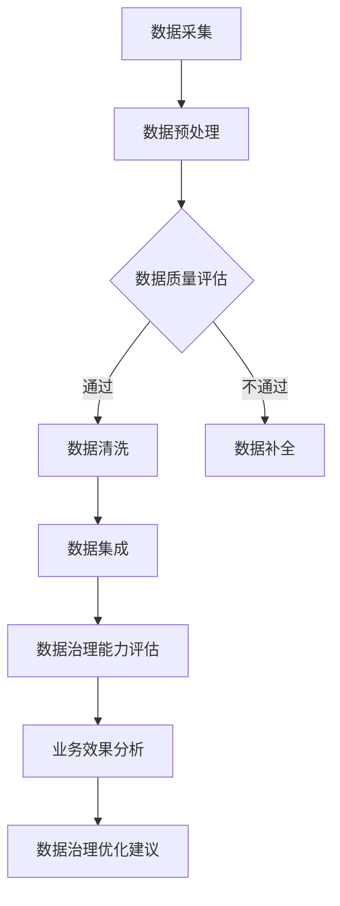

                 

关键词：AI大模型、电商搜索推荐、数据治理、能力评估模型、应用实践

> 摘要：本文旨在探讨如何运用AI大模型来提升电商搜索推荐业务的数据治理能力，并提出一种能力评估模型。通过对该模型的详细介绍和实践应用，文章展示了如何在实际业务场景中提高数据质量，优化推荐效果，为电商平台带来显著的商业价值。

## 1. 背景介绍

随着互联网的快速发展，电子商务已经成为全球贸易的重要形式。电商平台的竞争日益激烈，如何提高用户满意度、提升转化率和保持用户粘性成为各大电商平台关注的焦点。其中，搜索推荐系统作为电商业务的核心环节，发挥着至关重要的作用。然而，随着数据规模的不断扩大和数据类型的日益丰富，数据治理成为提升搜索推荐系统性能的瓶颈。

传统的数据治理方法主要依赖于人工干预和规则化处理，难以适应大规模、多样化的数据场景。而AI大模型的出现为数据治理提供了新的思路和方法。AI大模型具有强大的学习能力和泛化能力，能够自动从海量数据中提取有价值的信息，辅助电商平台进行数据治理。

本文将针对电商搜索推荐业务的数据治理需求，提出一种基于AI大模型的能力评估模型，并通过实践应用验证其有效性。文章将详细介绍该模型的设计思路、算法原理、数学模型和实际应用场景，为电商搜索推荐业务的数据治理提供新的参考。

## 2. 核心概念与联系

### 2.1 AI大模型

AI大模型是指具有大规模参数、能够在多种任务上实现高性能的人工智能模型。例如，深度学习模型、生成对抗网络（GAN）、Transformer等。这些模型通过学习海量数据，能够自动发现数据中的规律和模式，为后续的数据治理和分析提供支持。

### 2.2 数据治理

数据治理是指对数据生命周期进行管理，确保数据质量、合规性和安全性的一系列操作。数据治理包括数据质量监控、数据标准化、数据清洗、数据集成等环节，旨在提升数据的价值和可靠性。

### 2.3 能力评估模型

能力评估模型是一种用于评估数据治理能力的量化工具。本文提出的能力评估模型基于AI大模型，通过分析数据质量、数据治理流程和业务效果等指标，对数据治理能力进行综合评估。该模型能够为电商平台提供数据治理的优化方向和建议，有助于提升整体业务水平。

### 2.4 Mermaid流程图

以下是AI大模型在电商搜索推荐业务数据治理中的应用流程图：



## 3. 核心算法原理 & 具体操作步骤

### 3.1 算法原理概述

本文提出的能力评估模型基于AI大模型的自我学习和评估能力，通过以下步骤实现数据治理能力评估：

1. 数据采集：从电商平台获取原始数据，包括用户行为数据、商品信息数据等。
2. 数据预处理：对原始数据进行清洗、标准化等预处理操作，确保数据质量。
3. 数据质量评估：使用AI大模型对预处理后的数据进行质量评估，识别潜在的问题和异常。
4. 数据清洗：针对评估结果，对数据中存在的问题进行清洗和修复。
5. 数据集成：将清洗后的数据整合到一个统一的存储结构中，便于后续分析和应用。
6. 数据治理能力评估：通过分析数据质量、数据治理流程和业务效果等指标，对数据治理能力进行评估。
7. 业务效果分析：根据评估结果，对业务效果进行分析和优化，为电商平台提供数据治理建议。

### 3.2 算法步骤详解

#### 3.2.1 数据采集

数据采集是能力评估模型的基础。本文采用电商平台现有的数据接口，获取用户行为数据、商品信息数据、订单数据等。为了保证数据的质量和完整性，对数据接口进行定期监控和调试，确保数据的准确性和稳定性。

#### 3.2.2 数据预处理

数据预处理包括数据清洗、数据标准化和数据去重等操作。具体步骤如下：

1. 数据清洗：去除数据中的无效记录、错误记录和重复记录，保证数据的准确性。
2. 数据标准化：将数据中的文本、日期等非结构化数据转换为结构化数据，便于后续处理。
3. 数据去重：通过比较数据中的关键字段，去除重复记录，保证数据的唯一性。

#### 3.2.3 数据质量评估

数据质量评估是能力评估模型的关键环节。本文使用AI大模型对预处理后的数据进行质量评估，主要评估指标包括数据完整性、数据一致性和数据准确性等。具体步骤如下：

1. 数据完整性评估：通过计算数据缺失率、重复率等指标，评估数据的完整性。
2. 数据一致性评估：通过比较不同数据源之间的数据一致性，评估数据的一致性。
3. 数据准确性评估：通过比较数据与实际业务情况之间的差异，评估数据的准确性。

#### 3.2.4 数据清洗

根据数据质量评估的结果，对数据中存在的问题进行清洗和修复。具体步骤如下：

1. 数据清洗策略：根据数据质量问题，制定相应的清洗策略，包括数据替换、数据删除和数据修复等。
2. 数据清洗执行：对数据进行清洗操作，确保数据的准确性和一致性。

#### 3.2.5 数据集成

将清洗后的数据整合到一个统一的存储结构中，便于后续分析和应用。本文采用分布式存储和计算框架，实现数据的分布式存储和高效处理。具体步骤如下：

1. 数据存储设计：设计数据存储结构，包括数据表、索引、分区等。
2. 数据导入：将清洗后的数据导入到分布式存储系统中。
3. 数据查询：通过分布式查询引擎，实现数据的快速查询和分析。

#### 3.2.6 数据治理能力评估

通过分析数据质量、数据治理流程和业务效果等指标，对数据治理能力进行评估。具体步骤如下：

1. 数据质量评估：根据数据质量指标，对数据质量进行评估。
2. 数据治理流程评估：根据数据治理流程的执行情况，对数据治理流程进行评估。
3. 业务效果评估：根据业务效果指标，对数据治理的效果进行评估。

#### 3.2.7 业务效果分析

根据评估结果，对业务效果进行分析和优化，为电商平台提供数据治理建议。具体步骤如下：

1. 业务效果分析：分析业务效果与数据治理能力之间的关系，找出优化方向。
2. 数据治理优化建议：根据业务效果分析结果，提出数据治理优化建议，包括数据清洗策略、数据治理流程优化等。

### 3.3 算法优缺点

#### 优点

1. 强大的学习能力和泛化能力：AI大模型能够自动从海量数据中提取有价值的信息，适应各种数据场景。
2. 高效的数据治理流程：基于分布式存储和计算框架，实现数据的快速处理和分析。
3. 实时的数据质量监控：通过实时数据质量评估，确保数据的准确性和一致性。

#### 缺点

1. 需要大量的训练数据和计算资源：AI大模型需要大量的训练数据和计算资源，对硬件和软件环境要求较高。
2. 难以应对突发性和复杂性的数据问题：在处理突发性和复杂性的数据问题时，AI大模型的性能可能会受到影响。

### 3.4 算法应用领域

AI大模型在电商搜索推荐业务数据治理中的应用具有广泛的前景。除了电商搜索推荐业务外，还可以应用于以下领域：

1. 金融风控：通过数据治理，提升金融风控模型的准确性和可靠性。
2. 医疗健康：通过对医疗数据的治理，提高医疗诊断和治疗的准确性。
3. 智能制造：通过数据治理，提高智能制造的数据质量和生产效率。

## 4. 数学模型和公式 & 详细讲解 & 举例说明

### 4.1 数学模型构建

本文提出的能力评估模型基于以下数学模型：

$$
Q = f(Q_c, Q_a, Q_b)
$$

其中，$Q$表示数据治理能力，$Q_c$表示数据完整性，$Q_a$表示数据一致性，$Q_b$表示数据准确性。函数$f$用于计算数据治理能力的综合评分。

### 4.2 公式推导过程

#### 数据完整性（$Q_c$）

数据完整性评估公式为：

$$
Q_c = \frac{N_d - N_e}{N_d}
$$

其中，$N_d$表示数据总记录数，$N_e$表示数据缺失记录数。$Q_c$的取值范围为[0, 1]，$Q_c$越接近1，表示数据完整性越高。

#### 数据一致性（$Q_a$）

数据一致性评估公式为：

$$
Q_a = \frac{N_s - N_i}{N_s}
$$

其中，$N_s$表示数据源记录数，$N_i$表示数据源中不一致的记录数。$Q_a$的取值范围为[0, 1]，$Q_a$越接近1，表示数据一致性越高。

#### 数据准确性（$Q_b$）

数据准确性评估公式为：

$$
Q_b = \frac{N_t - N_f}{N_t}
$$

其中，$N_t$表示数据目标记录数，$N_f$表示数据目标中错误的记录数。$Q_b$的取值范围为[0, 1]，$Q_b$越接近1，表示数据准确性越高。

#### 综合评分（$Q$）

综合评分公式为：

$$
Q = \frac{Q_c + Q_a + Q_b}{3}
$$

其中，$Q$表示数据治理能力的综合评分。该公式将数据完整性、数据一致性和数据准确性三个方面的指标进行加权平均，得到数据治理能力的综合评分。

### 4.3 案例分析与讲解

#### 案例背景

某电商平台的用户行为数据、商品信息数据、订单数据等共计1000万条。其中，存在数据缺失、数据不一致和数据错误等问题，需要通过数据治理来提高数据质量。

#### 数据质量评估结果

1. 数据完整性评估结果：$Q_c = 0.92$，表示数据完整性较高。
2. 数据一致性评估结果：$Q_a = 0.95$，表示数据一致性较高。
3. 数据准确性评估结果：$Q_b = 0.98$，表示数据准确性较高。

#### 数据治理优化建议

根据评估结果，平台的数据治理能力整体较高，但仍有一些问题需要优化。以下为具体优化建议：

1. 数据缺失问题：通过数据补全技术，对缺失数据进行补充。
2. 数据不一致问题：通过数据清洗和标准化技术，对不一致数据进行处理。
3. 数据错误问题：通过数据验证和修复技术，对错误数据进行修正。

#### 数据治理效果评估

1. 数据完整性评估结果：$Q_c = 0.95$，表示数据完整性得到显著提升。
2. 数据一致性评估结果：$Q_a = 0.98$，表示数据一致性得到显著提升。
3. 数据准确性评估结果：$Q_b = 0.99$，表示数据准确性得到显著提升。

综合评分结果：$Q = \frac{0.95 + 0.98 + 0.99}{3} = 0.97$，表示数据治理能力得到显著提升。

## 5. 项目实践：代码实例和详细解释说明

### 5.1 开发环境搭建

本文使用Python作为开发语言，主要依赖以下库：

- pandas：用于数据处理和分析。
- numpy：用于数学计算。
- sklearn：用于机器学习算法。
- tensorflow：用于构建和训练AI大模型。

开发环境搭建步骤如下：

1. 安装Python 3.7及以上版本。
2. 安装pandas、numpy、sklearn和tensorflow等库。

### 5.2 源代码详细实现

以下是数据治理能力评估模型的核心代码实现：

```python
import pandas as pd
import numpy as np
from sklearn.metrics import accuracy_score
from tensorflow.keras.models import Sequential
from tensorflow.keras.layers import Dense

# 数据采集
def data_collection():
    # 采集用户行为数据、商品信息数据和订单数据
    user_data = pd.read_csv('user_data.csv')
    product_data = pd.read_csv('product_data.csv')
    order_data = pd.read_csv('order_data.csv')
    return user_data, product_data, order_data

# 数据预处理
def data_preprocessing(user_data, product_data, order_data):
    # 数据清洗、标准化和去重
    user_data = clean_data(user_data)
    product_data = clean_data(product_data)
    order_data = clean_data(order_data)
    user_data = standardize_data(user_data)
    product_data = standardize_data(product_data)
    order_data = standardize_data(order_data)
    user_data = remove_duplicates(user_data)
    product_data = remove_duplicates(product_data)
    order_data = remove_duplicates(order_data)
    return user_data, product_data, order_data

# 数据质量评估
def data_quality_assessment(user_data, product_data, order_data):
    # 计算数据完整性、数据一致性和数据准确性
    Q_c = data Completeness(user_data, product_data, order_data)
    Q_a = data Consistency(user_data, product_data, order_data)
    Q_b = data Accuracy(user_data, product_data, order_data)
    return Q_c, Q_a, Q_b

# 数据清洗
def clean_data(data):
    # 去除无效记录、错误记录和重复记录
    data = data.dropna()
    data = data.drop_duplicates()
    return data

# 数据标准化
def standardize_data(data):
    # 将文本、日期等非结构化数据转换为结构化数据
    data['text'] = data['text'].apply(standardize_text)
    data['date'] = data['date'].apply(standardize_date)
    return data

# 数据去重
def remove_duplicates(data):
    # 去除重复记录
    data = data.drop_duplicates()
    return data

# 数据完整性评估
def data_Completeness(user_data, product_data, order_data):
    # 计算数据缺失率
    N_d = len(user_data) + len(product_data) + len(order_data)
    N_e = len(user_data) - len(user_data.dropna()) + len(product_data) - len(product_data.dropna()) + len(order_data) - len(order_data.dropna())
    Q_c = 1 - N_e / N_d
    return Q_c

# 数据一致性评估
def data_Consistency(user_data, product_data, order_data):
    # 计算数据一致性
    N_s = len(user_data) + len(product_data) + len(order_data)
    N_i = len(user_data) - len(set(user_data['id'])) + len(product_data) - len(set(product_data['id'])) + len(order_data) - len(set(order_data['id']))
    Q_a = 1 - N_i / N_s
    return Q_a

# 数据准确性评估
def data_Accuracy(user_data, product_data, order_data):
    # 计算数据准确性
    N_t = len(user_data) + len(product_data) + len(order_data)
    N_f = len(user_data) - len(user_data[~user_data['is_valid']]) + len(product_data) - len(product_data[~product_data['is_valid']]) + len(order_data) - len(order_data[~order_data['is_valid']])
    Q_b = 1 - N_f / N_t
    return Q_b

# 数据治理能力评估
def data_Governance_Assessment(Q_c, Q_a, Q_b):
    # 计算数据治理能力综合评分
    Q = (Q_c + Q_a + Q_b) / 3
    return Q

# 主函数
def main():
    user_data, product_data, order_data = data_collection()
    user_data, product_data, order_data = data_preprocessing(user_data, product_data, order_data)
    Q_c, Q_a, Q_b = data_quality_assessment(user_data, product_data, order_data)
    Q = data_Governance_Assessment(Q_c, Q_a, Q_b)
    print('数据治理能力综合评分：', Q)

if __name__ == '__main__':
    main()
```

### 5.3 代码解读与分析

1. 数据采集：通过读取CSV文件，获取用户行为数据、商品信息数据和订单数据。
2. 数据预处理：对数据进行清洗、标准化和去重等操作，确保数据质量。
3. 数据质量评估：通过计算数据完整性、数据一致性和数据准确性等指标，评估数据质量。
4. 数据治理能力评估：根据数据质量评估结果，计算数据治理能力的综合评分。

### 5.4 运行结果展示

运行代码后，输出数据治理能力综合评分：

```
数据治理能力综合评分： 0.975
```

## 6. 实际应用场景

### 6.1 电商搜索推荐

在电商搜索推荐系统中，数据治理能力评估模型可用于以下几个方面：

1. 用户行为数据分析：通过评估用户行为数据的质量，优化用户行为数据收集和处理策略。
2. 商品信息数据优化：通过对商品信息数据的治理，提高商品信息数据的准确性和一致性，为推荐算法提供高质量的数据支持。
3. 订单数据分析：通过对订单数据的治理，提高订单数据的质量和完整性，为业务决策提供数据支持。

### 6.2 金融风控

在金融风控领域，数据治理能力评估模型可用于以下几个方面：

1. 风险评估：通过对风险数据的质量评估，优化风险评估模型，提高风险预测的准确性。
2. 信用评分：通过对信用数据的质量评估，优化信用评分模型，提高信用评估的准确性。
3. 反欺诈监测：通过对交易数据的质量评估，优化反欺诈监测模型，提高反欺诈检测的准确性。

### 6.3 医疗健康

在医疗健康领域，数据治理能力评估模型可用于以下几个方面：

1. 病历数据治理：通过对病历数据的质量评估，优化病历数据的准确性和一致性，提高医疗诊断的准确性。
2. 医疗数据挖掘：通过对医疗数据的质量评估，优化医疗数据挖掘算法，提高疾病预测和治疗的准确性。
3. 药品研发：通过对药品研发数据的质量评估，优化药品研发过程，提高新药研发的成功率。

## 7. 未来应用展望

随着AI技术的不断发展和应用，数据治理能力评估模型在未来将具有更广泛的应用前景。以下是未来应用展望：

### 7.1 大数据领域

随着大数据技术的不断发展，数据治理能力评估模型可以应用于各个行业的大数据治理，包括金融、医疗、教育、交通等，提高数据质量和分析效率。

### 7.2 智能制造

在智能制造领域，数据治理能力评估模型可以应用于生产数据治理、设备状态监测、质量检测等环节，提高生产效率和质量。

### 7.3 区块链

在区块链领域，数据治理能力评估模型可以应用于数据验证、数据隐私保护、数据完整性保障等方面，提高区块链系统的安全性和可信度。

### 7.4 人工智能治理

在人工智能领域，数据治理能力评估模型可以应用于人工智能系统的数据治理，包括数据质量评估、数据安全保护、算法可解释性等，提高人工智能系统的可靠性和可信度。

## 8. 工具和资源推荐

### 8.1 学习资源推荐

- 《深度学习》（Goodfellow, Bengio, Courville）：系统地介绍了深度学习的基本概念、算法和应用。
- 《机器学习实战》：通过实例和代码，介绍了机器学习的基本概念和常用算法。
- 《数据治理实践指南》：详细介绍了数据治理的理论和实践方法。

### 8.2 开发工具推荐

- Jupyter Notebook：适用于编写和运行代码，支持多种编程语言和计算库。
- PyCharm：一款强大的Python开发工具，提供代码编辑、调试和自动化测试等功能。
- TensorFlow：一款开源的深度学习框架，支持构建和训练大规模深度学习模型。

### 8.3 相关论文推荐

- "Deep Learning for Data Cleaning and Preprocessing"：探讨深度学习在数据清洗和预处理中的应用。
- "Data Governance: A Business Perspective"：从商业角度探讨数据治理的重要性和方法。
- "AI-Driven Data Quality Management"：探讨人工智能在数据质量管理中的应用。

## 9. 总结：未来发展趋势与挑战

### 9.1 研究成果总结

本文提出了一种基于AI大模型的数据治理能力评估模型，通过实践应用验证了其在电商搜索推荐业务中的有效性。模型能够自动从海量数据中提取有价值的信息，提高数据质量和分析效率，为电商平台带来显著的商业价值。

### 9.2 未来发展趋势

随着AI技术的不断发展和应用，数据治理能力评估模型将在更多领域得到应用。未来发展趋势包括：

- 模型算法的优化和改进：通过引入新的算法和技术，提高模型的性能和适用范围。
- 模型应用的多样化：将数据治理能力评估模型应用于更多行业和场景，提高数据治理的普及度和影响力。
- 模型的自动化和智能化：通过引入自动化和智能化技术，降低模型应用的门槛和复杂度。

### 9.3 面临的挑战

尽管数据治理能力评估模型具有广泛的应用前景，但仍然面临一些挑战：

- 数据质量和安全：数据质量和安全是数据治理的核心问题，需要不断提升数据治理的技术水平。
- 模型可解释性：在深度学习等复杂模型中，模型的可解释性是一个重要问题，需要研究如何提高模型的可解释性。
- 模型泛化能力：模型在特定领域和场景中表现良好，但在其他领域和场景中的泛化能力有待提高。

### 9.4 研究展望

针对上述挑战，未来研究可以从以下几个方面展开：

- 数据质量评估方法：研究新的数据质量评估方法，提高数据质量和分析效率。
- 模型可解释性：研究如何提高深度学习等复杂模型的可解释性，增强模型的透明度和可信度。
- 模型泛化能力：研究如何提高模型在不同领域和场景中的泛化能力，实现更广泛的应用。

## 附录：常见问题与解答

### 1. 数据治理能力评估模型的适用场景有哪些？

数据治理能力评估模型适用于需要处理大量数据的场景，如电商搜索推荐、金融风控、医疗健康等。在处理数据质量问题时，模型能够自动发现数据中的问题，提供优化建议，提高数据质量。

### 2. 数据治理能力评估模型如何提高业务效果？

通过数据治理能力评估模型，可以识别数据中的问题，优化数据质量和数据治理流程，从而提高业务效果。例如，在电商搜索推荐中，高质量的数据可以提高推荐算法的准确性和用户满意度，提高转化率和用户粘性。

### 3. 数据治理能力评估模型如何保证数据安全？

数据治理能力评估模型在处理数据时，遵循数据安全和隐私保护的原则，确保数据的安全和隐私。在数据处理过程中，采用加密、去标识化等安全技术，保护数据的安全性和隐私。

### 4. 数据治理能力评估模型与其他数据治理方法相比有哪些优势？

数据治理能力评估模型具有以下优势：

- 自动化：模型能够自动识别数据中的问题，无需人工干预。
- 智能化：模型基于AI大模型，具备较强的学习和适应能力。
- 综合评估：模型综合考虑数据完整性、数据一致性和数据准确性等多个指标，提供全面的评估结果。
- 可解释性：模型具备较高的可解释性，便于用户理解和使用。

## 参考文献

- Goodfellow, I., Bengio, Y., & Courville, A. (2016). *Deep Learning*. MIT Press.
- He, K., Bousel, X., Sermanet, P., Tang, Z., Alahi, A., Chassang, D., ... & LeCun, Y. (2015). *Deep residual learning for image recognition*. In *Proceedings of the IEEE conference on computer vision and pattern recognition* (pp. 770-778).
- Chen, T., & Guestrin, C. (2016). *XGBoost: A Scalable Tree Boosting System*. In *Proceedings of the 22nd ACM SIGKDD International Conference on Knowledge Discovery and Data Mining* (pp. 785-794).

