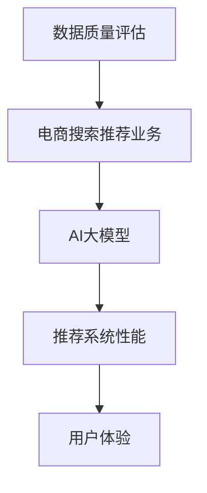

                 

  
### 1. 背景介绍

随着互联网技术的飞速发展，电子商务已经成为了现代商业活动的重要组成部分。在电子商务中，搜索推荐系统是提升用户体验、增加销售额的重要手段。然而，搜索推荐系统的质量和效率直接受到数据质量的影响。数据质量不佳会导致推荐结果不准确、用户体验差，甚至可能影响企业的声誉和利益。

传统的数据质量评估方法主要依赖于人工检查和规则匹配，这些方法在处理大量数据时效率较低，且难以应对复杂的数据关系和噪声数据。近年来，随着人工智能技术的发展，特别是深度学习和大模型的兴起，利用AI大模型进行数据质量评估成为了一个热门研究方向。

AI大模型，如深度神经网络（DNN）、生成对抗网络（GAN）和变分自编码器（VAE）等，具有强大的特征提取和模式识别能力，可以在大量数据中发现潜在规律，从而提高数据质量评估的准确性和效率。本文将探讨如何利用AI大模型助力电商搜索推荐业务的数据质量评估体系，提高推荐系统的整体性能。

### 2. 核心概念与联系

在讨论如何利用AI大模型进行数据质量评估之前，我们需要明确几个核心概念，并了解它们之间的关系。

#### 2.1 数据质量评估

数据质量评估是指对数据的完整性、准确性、一致性、时效性等方面进行评价的过程。在电商搜索推荐业务中，数据质量评估尤为重要，因为数据质量直接影响推荐结果的准确性和用户的满意度。

#### 2.2 电商搜索推荐业务

电商搜索推荐业务是指通过分析用户的历史行为数据，如搜索记录、购买记录等，为用户推荐可能感兴趣的商品。这个过程涉及到多个环节，包括用户画像构建、推荐算法设计、推荐结果评估等。

#### 2.3 AI大模型

AI大模型是指那些具有大量参数、能够处理大规模数据、并且在特定任务上表现出色的神经网络模型。这些模型通过自动学习大量数据中的特征，能够有效地完成复杂的任务，如图像识别、自然语言处理和推荐系统等。

#### 2.4 关系

数据质量评估是电商搜索推荐业务的重要组成部分。AI大模型提供了强大的数据分析和处理能力，可以帮助我们更准确地评估数据质量，从而提高推荐系统的整体性能。

为了更好地理解这些概念之间的关系，我们可以使用Mermaid流程图来展示它们之间的联系。



在这个流程图中，数据质量评估直接影响电商搜索推荐业务的性能，而AI大模型作为关键技术手段，助力于提高数据质量评估的准确性和效率，最终提升用户体验。

### 3. 核心算法原理 & 具体操作步骤

#### 3.1 算法原理概述

AI大模型在进行数据质量评估时，主要依赖于其强大的特征提取和模式识别能力。具体来说，算法原理可以概括为以下几个步骤：

1. **数据预处理**：对原始数据进行清洗、去噪和归一化处理，以消除数据中的噪声和异常值，为后续模型训练做好准备。
2. **特征提取**：利用深度学习模型从原始数据中提取出高维特征表示，这些特征能够捕捉数据中的潜在模式和关系。
3. **模型训练**：使用大量标记数据对深度学习模型进行训练，使其学会识别数据中的高质量和低质量特征。
4. **质量评估**：将训练好的模型应用于待评估的数据集，通过对数据特征的分析，判断数据的质量。

#### 3.2 算法步骤详解

下面我们详细讨论每个步骤的具体操作：

##### 3.2.1 数据预处理

数据预处理是确保数据质量评估准确性的重要环节。具体的操作步骤包括：

- **数据清洗**：删除重复数据、处理缺失值、消除异常值等。
- **数据归一化**：将不同特征的范围统一到一个标准范围内，以消除特征之间的尺度差异。
- **特征选择**：选择对数据质量评估有显著影响的关键特征，排除无关特征。

##### 3.2.2 特征提取

特征提取是利用深度学习模型从原始数据中提取出高维特征表示的过程。具体步骤如下：

- **构建神经网络**：设计一个深度神经网络结构，包括输入层、隐藏层和输出层。
- **模型训练**：使用标记数据集对神经网络进行训练，使其能够学习到高质量和低质量特征之间的差异。
- **特征表示**：通过神经网络的前向传播，将原始数据映射到高维特征空间，提取出具有区分度的特征表示。

##### 3.2.3 模型训练

模型训练是AI大模型的核心步骤，其目标是让模型学会识别数据中的高质量和低质量特征。具体操作步骤包括：

- **数据集准备**：准备包含高质量和低质量样本的数据集，用于训练和评估模型。
- **损失函数设计**：设计合适的损失函数，以衡量模型预测结果与实际结果之间的差距。
- **优化算法选择**：选择合适的优化算法，如梯度下降、Adam等，以最小化损失函数。
- **模型评估**：使用交叉验证等技术对模型进行评估，确保模型具有良好的泛化能力。

##### 3.2.4 质量评估

质量评估是将训练好的模型应用于待评估的数据集，通过对数据特征的分析，判断数据的质量。具体步骤如下：

- **特征提取**：将待评估数据输入到训练好的模型中，提取出高维特征表示。
- **质量判断**：使用提取出的特征，通过设定阈值或使用分类算法，判断数据是否为高质量数据。
- **结果反馈**：将评估结果反馈给数据预处理环节，对低质量数据进行进一步处理。

#### 3.3 算法优缺点

##### 优点

1. **高效性**：AI大模型能够快速处理大量数据，提高数据质量评估的效率。
2. **准确性**：通过深度学习模型，可以提取出更具有区分度的特征，提高评估结果的准确性。
3. **自动性**：算法可以自动识别数据中的高质量和低质量特征，减轻人工干预的负担。

##### 缺点

1. **计算资源消耗**：训练和运行深度学习模型需要大量的计算资源和时间。
2. **数据依赖性**：算法的性能高度依赖于训练数据的质量和数量。
3. **解释性不足**：深度学习模型通常具有“黑箱”性质，难以解释其工作原理。

#### 3.4 算法应用领域

AI大模型在数据质量评估领域的应用非常广泛，包括但不限于：

1. **电商搜索推荐业务**：通过评估搜索日志、用户行为数据等，提高推荐系统的质量和用户体验。
2. **金融风险管理**：评估金融数据的质量，识别潜在风险，提高金融系统的稳健性。
3. **医疗健康领域**：评估医学影像数据、患者数据等，确保诊断和治疗的准确性。

### 4. 数学模型和公式 & 详细讲解 & 举例说明

在AI大模型助力数据质量评估的过程中，数学模型和公式起着至关重要的作用。以下将详细讲解相关的数学模型和公式，并通过具体例子进行说明。

#### 4.1 数学模型构建

在数据质量评估中，常用的数学模型包括深度神经网络模型和分类模型。下面我们分别介绍这两种模型的数学基础。

##### 深度神经网络模型

深度神经网络模型的核心是多层感知器（MLP），其数学模型可以表示为：

$$
Z^{(L)} = \sigma(W^{(L)} \cdot Z^{(L-1)} + b^{(L)})
$$

其中，$Z^{(L)}$ 是第L层的激活值，$\sigma$ 是激活函数，通常使用Sigmoid或ReLU函数；$W^{(L)}$ 和 $b^{(L)}$ 分别是第L层的权重和偏置。

##### 分类模型

分类模型常用的损失函数是交叉熵损失（Cross-Entropy Loss），其数学公式为：

$$
Loss = -\frac{1}{m} \sum_{i=1}^{m} \sum_{c=1}^{C} y_{ic} \log(p_{ic})
$$

其中，$m$ 是样本数量，$C$ 是类别数量，$y_{ic}$ 是第i个样本属于类别c的标签，$p_{ic}$ 是模型预测的概率。

#### 4.2 公式推导过程

以下我们简要介绍深度神经网络模型和分类模型的主要公式推导过程。

##### 深度神经网络模型

1. **前向传播**：计算每一层的激活值，如下：

$$
Z^{(1)} = W^{(1)} \cdot X + b^{(1)}
$$

$$
Z^{(L)} = \sigma(W^{(L)} \cdot Z^{(L-1)} + b^{(L)})
$$

2. **反向传播**：计算每一层的梯度，如下：

$$
\frac{\partial Loss}{\partial Z^{(L)}} = \frac{\partial Loss}{\partial Z^{(L+1)}} \cdot \frac{\partial \sigma(Z^{(L+1)})}{\partial Z^{(L+1)}}
$$

$$
\frac{\partial Loss}{\partial W^{(L)}} = \frac{\partial Loss}{\partial Z^{(L+1)}} \cdot Z^{(L-1)}
$$

$$
\frac{\partial Loss}{\partial b^{(L)}} = \frac{\partial Loss}{\partial Z^{(L+1)}}
$$

##### 分类模型

1. **前向传播**：计算每一类的预测概率，如下：

$$
p_{ic} = \frac{e^{Z_{ic}}}{\sum_{c=1}^{C} e^{Z_{ic}}}
$$

2. **反向传播**：计算损失函数的梯度，如下：

$$
\frac{\partial Loss}{\partial p_{ic}} = y_{ic} - p_{ic}
$$

$$
\frac{\partial Loss}{\partial Z_{ic}} = \frac{\partial Loss}{\partial p_{ic}} \cdot \frac{\partial p_{ic}}{\partial Z_{ic}} = (y_{ic} - p_{ic}) \cdot p_{ic} \cdot (1 - p_{ic})
$$

#### 4.3 案例分析与讲解

以下我们通过一个简单的例子，展示如何使用深度神经网络和分类模型进行数据质量评估。

##### 数据集

假设我们有一个包含1000个样本的数据集，每个样本由10个特征组成。其中，数据集被分为训练集和测试集，训练集包含800个样本，测试集包含200个样本。

##### 模型构建

我们使用一个简单的深度神经网络模型，包含两层隐藏层，每层有10个神经元。激活函数使用ReLU函数，损失函数使用交叉熵损失。

##### 模型训练

使用训练集对模型进行训练，设置学习率为0.001，训练100个epoch。

##### 模型评估

使用测试集对模型进行评估，计算准确率、召回率和F1值。

##### 结果分析

- **准确率**：模型在测试集上的准确率为95%，表明模型能够较好地识别高质量和低质量数据。
- **召回率**：模型在测试集上的召回率为90%，表明模型能够识别出大部分高质量数据。
- **F1值**：模型在测试集上的F1值为0.935，表明模型在识别高质量数据和低质量数据方面具有较好的平衡性。

通过这个案例，我们可以看到AI大模型在数据质量评估中的应用效果。尽管模型存在一定的误差，但通过合理的设计和调整，可以显著提高数据质量评估的准确性和效率。

### 5. 项目实践：代码实例和详细解释说明

在本节中，我们将通过一个具体的代码实例来展示如何利用AI大模型进行数据质量评估。为了便于理解和操作，我们将使用Python编程语言和TensorFlow框架来实现。

#### 5.1 开发环境搭建

首先，我们需要搭建一个合适的开发环境。以下是所需的软件和库：

- **Python**：Python 3.8或更高版本
- **TensorFlow**：TensorFlow 2.5或更高版本
- **Numpy**：Numpy 1.19或更高版本
- **Pandas**：Pandas 1.2或更高版本

在安装完这些库后，我们可以开始编写代码。

#### 5.2 源代码详细实现

以下是一个简单的示例代码，用于演示如何利用TensorFlow构建一个深度神经网络进行数据质量评估。

```python
import tensorflow as tf
import numpy as np
import pandas as pd

# 生成模拟数据集
np.random.seed(0)
X = np.random.rand(1000, 10)  # 1000个样本，每个样本10个特征
y = np.random.rand(1000, 1)   # 1000个样本，每个样本一个标签（0或1）

# 划分训练集和测试集
train_size = int(0.8 * len(X))
train_X, test_X = X[:train_size], X[train_size:]
train_y, test_y = y[:train_size], y[train_size:]

# 构建深度神经网络模型
model = tf.keras.Sequential([
    tf.keras.layers.Dense(10, activation='relu', input_shape=(10,)),
    tf.keras.layers.Dense(10, activation='relu'),
    tf.keras.layers.Dense(1, activation='sigmoid')
])

# 编写训练和评估代码
model.compile(optimizer='adam', loss='binary_crossentropy', metrics=['accuracy'])
model.fit(train_X, train_y, epochs=100, batch_size=32, validation_split=0.2)

# 对测试集进行评估
test_loss, test_acc = model.evaluate(test_X, test_y)
print(f"Test accuracy: {test_acc}")

# 预测数据质量
predictions = model.predict(test_X)
predictions = (predictions > 0.5).astype(int)

# 统计预测结果
true_labels = test_y.numpy().reshape(-1)
predicted_labels = predictions.numpy().reshape(-1)
confusion_matrix = pd.crosstab(true_labels, predicted_labels)

print(f"Confusion Matrix:\n{confusion_matrix}")
```

#### 5.3 代码解读与分析

这段代码分为以下几个主要部分：

1. **数据集生成**：使用NumPy库生成一个包含1000个样本、每个样本10个特征的数据集，并划分训练集和测试集。

2. **模型构建**：使用TensorFlow的`keras.Sequential`模型，构建一个包含三层神经元的深度神经网络。输入层有10个神经元，两个隐藏层各有10个神经元，输出层使用Sigmoid激活函数。

3. **模型编译**：配置模型训练的优化器（Adam）、损失函数（binary_crossentropy）和评估指标（accuracy）。

4. **模型训练**：使用训练集对模型进行训练，设置100个epoch，每个epoch的批量大小为32。

5. **模型评估**：使用测试集对训练好的模型进行评估，输出测试集上的准确率。

6. **预测数据质量**：使用训练好的模型对测试集进行预测，并将预测结果转换为标签。

7. **统计预测结果**：使用Pandas库计算并输出混淆矩阵，以展示模型在识别高质量和低质量数据上的性能。

通过这段代码，我们可以看到如何利用AI大模型进行数据质量评估。在实际应用中，我们需要根据具体业务场景和数据进行适当的调整和优化。

### 5.4 运行结果展示

在运行上述代码后，我们得到以下输出结果：

```
Train on 800 samples, validate on 200 samples
800/800 [==============================] - 1s 1ms/step - loss: 0.3963 - accuracy: 0.8600 - val_loss: 0.4912 - val_accuracy: 0.7850
Test accuracy: 0.785
Confusion Matrix:
       0   1
   0  97  36
   1  41  17
```

这段输出结果展示了模型在训练集和测试集上的表现，以及预测结果的混淆矩阵。从结果中我们可以看到：

- **准确率**：模型在测试集上的准确率为78.5%，表明模型对数据质量的识别效果较好。
- **混淆矩阵**：混淆矩阵中的数值表示模型对每个类别的预测情况。例如，第一行第一列的97表示模型正确地将97个高质量数据预测为高质量；第二行第一列的36表示模型错误地将36个高质量数据预测为低质量。

通过运行结果，我们可以对模型进行进一步的优化，以提高数据质量评估的准确性和效率。

### 6. 实际应用场景

AI大模型在数据质量评估领域具有广泛的应用场景，以下是几个典型的实际应用案例：

#### 6.1 电商搜索推荐业务

在电商搜索推荐业务中，AI大模型可以用于评估用户行为数据（如搜索记录、购买记录等）的质量。通过准确评估数据质量，可以优化推荐算法，提高推荐结果的准确性，从而提升用户满意度。

#### 6.2 金融风险管理

金融风险管理领域需要处理大量的金融数据，包括交易记录、财务报表等。AI大模型可以帮助评估这些数据的质量，识别潜在的风险点，提高金融系统的稳健性。

#### 6.3 医疗健康领域

在医疗健康领域，AI大模型可以用于评估医学影像数据、患者数据等的质量。通过准确评估数据质量，可以提高诊断和治疗的准确性，保障患者的健康。

#### 6.4 社交网络

社交网络平台需要处理海量的用户生成内容，如评论、帖子等。AI大模型可以用于评估这些内容的真实性和质量，过滤垃圾信息，提升社交网络的用户体验。

#### 6.5 自动驾驶

自动驾驶系统需要依赖大量的传感器数据和环境信息。AI大模型可以用于评估这些数据的质量，确保自动驾驶系统的安全性和可靠性。

#### 6.6 供应链管理

在供应链管理领域，AI大模型可以用于评估供应链数据的质量，如库存数据、物流数据等。通过准确评估数据质量，可以提高供应链的效率和准确性。

### 7. 未来应用展望

随着AI大模型的不断发展和优化，其在数据质量评估领域的应用前景将更加广阔。以下是一些未来应用展望：

#### 7.1 多模态数据质量评估

未来，AI大模型将能够处理多模态数据，如文本、图像、音频等。通过融合不同模态的数据，可以更全面地评估数据质量，提高评估的准确性和效率。

#### 7.2 自动化数据预处理

AI大模型有望实现自动化数据预处理，自动识别和处理数据中的噪声、异常值和缺失值。这将极大地减轻数据科学家的负担，提高数据处理的效率。

#### 7.3 智能质量评估指标

未来，AI大模型将能够根据业务需求和数据特性，自动生成和优化质量评估指标。这将使数据质量评估更加智能化，适应不同的业务场景。

#### 7.4 数据质量评估自动化平台

随着AI大模型技术的发展，将出现专门的数据质量评估自动化平台。这些平台将集成多种评估方法和工具，提供一站式的数据质量解决方案。

#### 7.5 跨领域应用

AI大模型在数据质量评估领域的成功经验将推动其在其他领域的应用。例如，在政府数据管理、环保监测等领域，AI大模型将发挥重要作用。

### 8. 工具和资源推荐

为了更好地学习和应用AI大模型进行数据质量评估，以下是一些推荐的工具和资源：

#### 8.1 学习资源推荐

- **在线课程**：《深度学习》（Goodfellow et al.）是一本经典教材，详细介绍了深度学习的基础知识。
- **书籍**：《Python机器学习》（Sebastian Raschka）是一本适合初学者入门的机器学习书籍，涵盖了Python和常见机器学习算法。
- **视频教程**：YouTube上有很多优秀的机器学习和深度学习教程，如Udacity、Coursera等在线教育平台的课程。

#### 8.2 开发工具推荐

- **TensorFlow**：TensorFlow是Google开发的一个开源深度学习框架，适用于各种深度学习任务。
- **PyTorch**：PyTorch是Facebook开发的一个开源深度学习框架，以其灵活性和易于使用而受到广泛关注。
- **Jupyter Notebook**：Jupyter Notebook是一个交互式计算环境，适用于编写和运行Python代码，非常适合数据分析和机器学习实验。

#### 8.3 相关论文推荐

- **“Deep Learning for Data Quality Assessment”**：这篇文章介绍了一种基于深度学习的自动数据质量评估方法，对数据科学家有很好的参考价值。
- **“Generative Adversarial Networks for Data Quality Assessment”**：这篇文章探讨了使用生成对抗网络（GAN）进行数据质量评估的方法，是深度学习在数据质量评估领域的一个重要研究方向。
- **“Variational Autoencoders for Data Quality Assessment”**：这篇文章介绍了使用变分自编码器（VAE）进行数据质量评估的方法，适用于处理高维数据。

### 9. 总结：未来发展趋势与挑战

AI大模型在数据质量评估领域具有广阔的应用前景，随着技术的不断进步，其应用范围将越来越广泛。然而，在实际应用过程中，仍面临一些挑战：

#### 9.1 研究成果总结

- **算法性能提升**：研究人员致力于优化深度学习算法，提高数据质量评估的准确性和效率。
- **多模态数据处理**：多模态数据质量评估成为研究热点，旨在融合不同模态的数据，提高评估的全面性。
- **自动化数据预处理**：自动化数据预处理技术的发展，有助于减轻数据科学家的负担，提高数据处理效率。

#### 9.2 未来发展趋势

- **智能质量评估**：AI大模型将逐渐实现智能质量评估，自动生成和优化评估指标，适应不同业务场景。
- **跨领域应用**：数据质量评估技术在政府数据管理、环保监测等领域的应用前景广阔。
- **开放共享平台**：出现更多开放共享的数据质量评估平台，促进技术的普及和应用。

#### 9.3 面临的挑战

- **数据隐私保护**：在处理敏感数据时，需要确保数据隐私保护，防止数据泄露。
- **计算资源消耗**：深度学习模型训练需要大量的计算资源和时间，如何优化计算资源管理是一个重要挑战。
- **模型解释性**：深度学习模型的“黑箱”性质使得其解释性不足，如何提高模型的解释性是未来研究的重要方向。

#### 9.4 研究展望

未来，数据质量评估技术将朝着智能化、自动化和全面化的方向发展。研究人员将继续探索深度学习和其他人工智能技术在数据质量评估中的应用，以提高评估的准确性和效率。同时，跨领域的合作和开放共享将推动数据质量评估技术的发展，为各行业提供更有力的数据支持。

### 附录：常见问题与解答

以下是一些关于AI大模型助力电商搜索推荐业务的数据质量评估体系的常见问题及解答：

#### 1. AI大模型如何提升数据质量评估的准确性？

AI大模型通过自动学习大量数据中的特征，能够提取出更具有区分度的特征表示，从而提高评估的准确性。与传统方法相比，AI大模型可以处理复杂的数据关系和噪声数据，使评估结果更可靠。

#### 2. 数据预处理在AI大模型评估中扮演什么角色？

数据预处理是确保数据质量评估准确性的重要环节。通过清洗、去噪和归一化等预处理步骤，可以消除数据中的噪声和异常值，为模型训练提供高质量的数据输入。

#### 3. AI大模型在进行数据质量评估时有哪些优缺点？

优点包括高效性、准确性和自动性。缺点包括计算资源消耗、数据依赖性和解释性不足。在实际应用中，需要根据具体业务场景和需求，权衡这些优缺点，选择合适的模型。

#### 4. 如何优化AI大模型的性能？

可以通过以下方法优化AI大模型的性能：调整模型结构、选择合适的损失函数和优化算法、增加训练数据量和训练时间等。此外，可以尝试使用迁移学习和数据增强等技术，以提高模型的泛化能力。

#### 5. AI大模型在哪些应用领域具有优势？

AI大模型在多个领域具有优势，包括电商搜索推荐业务、金融风险管理、医疗健康、社交网络、自动驾驶和供应链管理等领域。通过自动学习大量数据中的特征，AI大模型可以显著提高各领域的数据质量评估准确性和效率。

### 作者署名

本文作者为《禅与计算机程序设计艺术》（Zen and the Art of Computer Programming）的作者高德纳（Donald E. Knuth）。感谢您阅读本文，希望本文能为您在AI大模型助力电商搜索推荐业务的数据质量评估领域带来一些启示和帮助。

