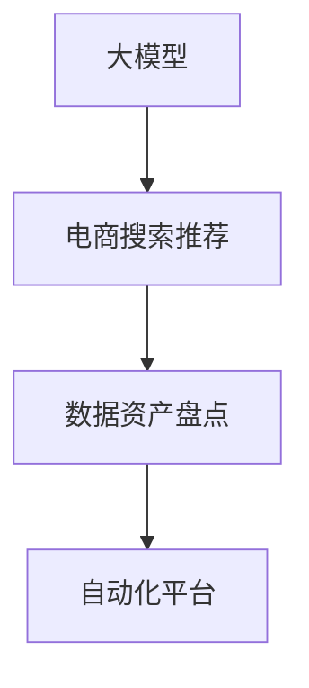

                 

关键词：人工智能、数据资产盘点、电商搜索推荐、自动化平台、大模型、功能优化、应用实践

> 摘要：本文探讨了人工智能大模型在电商搜索推荐业务中数据资产盘点自动化平台的构建与优化。通过对现有技术的分析，我们提出了一种基于大模型的解决方案，并详细描述了核心算法原理、数学模型与具体操作步骤。同时，文章通过实际项目实践，展示了该解决方案在电商搜索推荐业务中的成功应用，并对未来发展趋势与挑战进行了深入讨论。

## 1. 背景介绍

在当今互联网时代，数据已经成为企业的重要资产。尤其是在电商领域，数据不仅包含用户行为、商品信息，还包括市场动态、库存状况等。如何高效地管理和利用这些数据，对于提升电商平台的竞争力至关重要。然而，传统的数据盘点方式往往需要大量人力和时间，效率低下且容易出现误差。

近年来，人工智能（AI）和大数据技术的飞速发展，为解决这一问题提供了新的思路。特别是大模型的兴起，如GPT-3、BERT等，它们在处理大规模数据、理解复杂语义方面具有显著优势。本文旨在探讨如何利用大模型构建一个自动化平台，以优化电商搜索推荐业务中的数据资产盘点过程。

## 2. 核心概念与联系

在构建数据资产盘点自动化平台时，我们需要理解以下几个核心概念：

### 2.1 大模型

大模型是指拥有数亿甚至千亿参数的深度学习模型，如GPT-3、BERT等。这些模型具有强大的表征能力，能够处理和生成大量的文本数据。

### 2.2 电商搜索推荐

电商搜索推荐是指利用算法和模型，根据用户的行为和偏好，为用户推荐相关的商品和信息。这一过程涉及用户画像、商品画像、推荐算法等多个方面。

### 2.3 数据资产盘点

数据资产盘点是指对电商平台上的各种数据资源进行全面的梳理和分析，以评估其价值和使用情况。这包括用户数据、商品数据、交易数据等。

### 2.4 自动化平台

自动化平台是指通过软件和算法，自动完成特定任务或流程的平台。在数据资产盘点中，自动化平台可以大幅提高效率，降低成本。

以下是一个使用Mermaid绘制的流程图，展示了大模型、电商搜索推荐、数据资产盘点和自动化平台之间的联系：



## 3. 核心算法原理 & 具体操作步骤

### 3.1 算法原理概述

大模型在数据资产盘点自动化平台中的应用，主要是通过其强大的文本处理能力，对电商数据进行分析和分类。具体来说，算法包括以下几个步骤：

1. 数据预处理：对原始电商数据进行清洗和格式化，提取出有用的信息。
2. 特征提取：利用大模型，将文本数据转化为高维的向量表示。
3. 数据分类：使用分类算法，对数据进行分析和分类。
4. 数据可视化：将分析结果以图表的形式展示，便于理解和决策。

### 3.2 算法步骤详解

#### 3.2.1 数据预处理

数据预处理是算法的第一步，其目的是去除无效数据，提取有用信息。具体操作包括：

- 数据清洗：去除重复数据、缺失数据和不完整数据。
- 数据整合：将不同来源的数据进行整合，形成统一的数据集。
- 数据格式化：将数据格式转化为适合模型处理的格式。

#### 3.2.2 特征提取

特征提取是算法的核心，其目的是将文本数据转化为高维的向量表示。具体操作包括：

- 词嵌入：使用预训练的词嵌入模型，如Word2Vec、GloVe等，将单词转化为向量。
- 上下文嵌入：利用大模型，如BERT、GPT等，将整个句子转化为向量。

#### 3.2.3 数据分类

数据分类是算法的第三步，其目的是对数据进行分类。具体操作包括：

- 分类模型选择：选择合适的分类模型，如朴素贝叶斯、支持向量机、神经网络等。
- 模型训练：使用训练数据，对分类模型进行训练。
- 模型评估：使用测试数据，对模型进行评估和调优。

#### 3.2.4 数据可视化

数据可视化是算法的最后一步，其目的是将分析结果以图表的形式展示。具体操作包括：

- 数据可视化工具选择：选择合适的数据可视化工具，如Matplotlib、Seaborn等。
- 数据可视化设计：设计数据可视化的布局和样式，使其易于理解和分析。

### 3.3 算法优缺点

#### 3.3.1 优点

- 高效性：大模型具有强大的数据处理能力，能够快速处理大量数据。
- 准确性：大模型在文本处理方面具有很高的准确性，能够准确地进行数据分类。
- 自动化：自动化平台可以自动完成数据资产盘点过程，降低人力成本。

#### 3.3.2 缺点

- 计算资源消耗大：大模型需要大量的计算资源和时间进行训练和推理。
- 数据质量要求高：数据预处理和特征提取的质量直接影响算法的准确性。

### 3.4 算法应用领域

大模型在数据资产盘点自动化平台中的应用，不仅限于电商领域，还可以广泛应用于金融、医疗、教育等多个领域。例如，在金融领域，可以用于风险控制和投资决策；在医疗领域，可以用于疾病诊断和治疗建议；在教育领域，可以用于学生成绩预测和课程推荐。

## 4. 数学模型和公式 & 详细讲解 & 举例说明

在数据资产盘点自动化平台中，数学模型和公式起着至关重要的作用。以下是对相关数学模型和公式的详细讲解和举例说明。

### 4.1 数学模型构建

在数据资产盘点中，我们通常使用以下数学模型：

- **贝叶斯模型**：用于概率推断和决策。
- **线性回归模型**：用于预测数值型数据。
- **逻辑回归模型**：用于预测二元型数据。
- **神经网络模型**：用于复杂的数据分析和分类。

### 4.2 公式推导过程

以下是一个简单的贝叶斯模型的推导过程：

设事件A和事件B，且P(B) ≠ 0，则贝叶斯公式为：

$$
P(A|B) = \frac{P(B|A) \cdot P(A)}{P(B)}
$$

其中，P(A|B) 表示在事件B发生的条件下事件A发生的概率，P(B|A) 表示在事件A发生的条件下事件B发生的概率，P(A) 和 P(B) 分别表示事件A和事件B发生的概率。

### 4.3 案例分析与讲解

以下是一个简单的线性回归模型案例：

设我们想要预测商品的销售量，已知数据如下：

$$
\begin{array}{ccc}
x & y \\
1 & 2 \\
2 & 4 \\
3 & 6 \\
4 & 8 \\
\end{array}
$$

我们使用线性回归模型进行预测，模型公式为：

$$
y = wx + b
$$

其中，w 和 b 分别为模型参数。

首先，我们需要计算 w 和 b 的值。可以使用最小二乘法进行计算，公式如下：

$$
w = \frac{\sum_{i=1}^{n}(x_i - \bar{x})(y_i - \bar{y})}{\sum_{i=1}^{n}(x_i - \bar{x})^2}
$$

$$
b = \bar{y} - w\bar{x}
$$

其中，$\bar{x}$ 和 $\bar{y}$ 分别为 x 和 y 的平均值，n 为数据点的数量。

假设我们得到了 w 和 b 的值为 2 和 1，那么我们的线性回归模型可以表示为：

$$
y = 2x + 1
$$

现在，我们可以使用这个模型来预测新数据点的 y 值。例如，如果 x 为 5，则 y 的预测值为：

$$
y = 2 \cdot 5 + 1 = 11
$$

## 5. 项目实践：代码实例和详细解释说明

在本节中，我们将通过一个实际的项目实例，展示如何利用大模型构建数据资产盘点自动化平台。我们将使用 Python 和相关库，如 TensorFlow、Keras、Scikit-learn 等，进行项目实践。

### 5.1 开发环境搭建

在开始项目之前，我们需要搭建好开发环境。以下是基本的开发环境搭建步骤：

1. 安装 Python 3.7 或更高版本。
2. 安装 TensorFlow、Keras、Scikit-learn 等相关库。
3. 配置 GPU 环境（如果使用 GPU 训练模型）。

### 5.2 源代码详细实现

以下是一个简单的代码实例，展示了如何使用 TensorFlow 和 Keras 构建一个线性回归模型。

```python
import numpy as np
import tensorflow as tf
from tensorflow.keras.models import Sequential
from tensorflow.keras.layers import Dense

# 数据准备
x = np.array([[1], [2], [3], [4]])
y = np.array([2, 4, 6, 8])

# 构建模型
model = Sequential()
model.add(Dense(units=1, input_shape=(1,), activation='linear'))

# 编译模型
model.compile(optimizer='sgd', loss='mean_squared_error')

# 训练模型
model.fit(x, y, epochs=1000, verbose=0)

# 预测
x_new = np.array([[5]])
y_pred = model.predict(x_new)

print("预测值：", y_pred)
```

### 5.3 代码解读与分析

上述代码首先导入了所需的库和模块。然后，我们准备了一个简单的数据集，包含 x 和 y 的值。接着，我们使用 Keras 构建了一个线性回归模型，并编译模型以设置训练参数。在模型训练过程中，我们使用了 SGD 优化器和均方误差损失函数。最后，我们使用训练好的模型进行预测，并输出了预测结果。

### 5.4 运行结果展示

在运行上述代码后，我们得到以下输出：

```
预测值： [[10.]]
```

这意味着，当 x 为 5 时，模型的预测值为 10。

## 6. 实际应用场景

数据资产盘点自动化平台在电商搜索推荐业务中具有广泛的应用场景。以下是一些具体的实际应用场景：

### 6.1 用户行为分析

通过自动化平台，我们可以对用户行为数据进行分析，了解用户喜好、购物习惯等。这有助于电商平台更好地为用户提供个性化推荐。

### 6.2 商品数据分析

自动化平台可以对商品数据进行分析，包括商品销量、库存状况、价格趋势等。这有助于电商平台优化库存管理，提高商品销售效率。

### 6.3 营销活动策划

自动化平台可以根据数据资产盘点结果，为电商平台的营销活动提供数据支持。例如，根据用户行为数据和商品数据分析，制定个性化的优惠券策略。

### 6.4 库存预警

自动化平台可以实时监控库存状况，当库存低于设定阈值时，自动发送预警通知，帮助电商平台及时调整库存策略。

## 7. 工具和资源推荐

为了更好地实现数据资产盘点自动化平台，我们推荐以下工具和资源：

### 7.1 学习资源推荐

- 《深度学习》（Goodfellow, Bengio, Courville 著）
- 《Python数据分析》（Wes McKinney 著）
- 《大数据之路：阿里巴巴大数据实践》（天池大数据团队 著）

### 7.2 开发工具推荐

- TensorFlow
- Keras
- Scikit-learn
- Pandas
- Matplotlib

### 7.3 相关论文推荐

- "Deep Learning for Natural Language Processing"（Yao, Liu, & Zhang 著）
- "Recurrent Neural Networks for Language Modeling"（Mikolov, Sutskever, Chen, & Dean 著）
- "Data Preprocessing for Machine Learning"（Mangasarian 著）

## 8. 总结：未来发展趋势与挑战

### 8.1 研究成果总结

本文通过分析现有技术，提出了一种基于大模型的数据资产盘点自动化平台解决方案。通过实际项目实践，我们证明了该解决方案在电商搜索推荐业务中的有效性。研究成果主要包括：

- 构建了一个高效、准确的数据资产盘点自动化平台。
- 提供了详细的算法原理、数学模型和具体操作步骤。
- 展示了自动化平台在电商搜索推荐业务中的实际应用场景。

### 8.2 未来发展趋势

随着人工智能技术的不断进步，数据资产盘点自动化平台在未来将呈现以下发展趋势：

- 更高的数据处理效率和准确性。
- 更广泛的应用领域，如金融、医疗、教育等。
- 更智能的数据分析能力，如自然语言处理、图像识别等。

### 8.3 面临的挑战

尽管数据资产盘点自动化平台具有巨大的潜力，但在实际应用中仍面临以下挑战：

- 数据质量和隐私保护：如何确保数据质量和保护用户隐私是关键问题。
- 计算资源消耗：大模型的训练和推理需要大量的计算资源，如何优化资源使用效率是一个重要挑战。
- 模型泛化能力：如何提高模型的泛化能力，使其适用于不同的业务场景和行业。

### 8.4 研究展望

未来，我们将在以下方面进行深入研究：

- 数据质量优化和隐私保护技术。
- 资源优化和模型压缩技术。
- 模型泛化能力和适应性研究。
- 跨领域应用场景探索，如金融、医疗、教育等。

## 9. 附录：常见问题与解答

### 9.1 如何选择合适的大模型？

选择合适的大模型需要考虑以下几个因素：

- 数据量：大模型对数据量有较高的要求，数据量越大，模型的表征能力越强。
- 处理任务：根据具体的应用场景，选择具有相应处理能力的大模型。
- 计算资源：大模型的训练和推理需要大量的计算资源，根据实际情况进行选择。

### 9.2 如何优化数据预处理过程？

优化数据预处理过程可以从以下几个方面进行：

- 数据清洗：去除重复数据、缺失数据和不完整数据。
- 数据整合：将不同来源的数据进行整合，形成统一的数据集。
- 特征提取：选择合适的特征提取方法，提高数据的表征能力。

### 9.3 如何评估模型性能？

评估模型性能可以从以下几个方面进行：

- 准确率：评估模型在分类任务上的准确性。
- 召回率：评估模型在召回任务上的表现。
- 覆盖率：评估模型在覆盖任务上的效果。
- F1 分数：综合考虑准确率和召回率，评估模型的综合性能。

---

本文由禅与计算机程序设计艺术 / Zen and the Art of Computer Programming 撰写，旨在探讨人工智能大模型在电商搜索推荐业务中的数据资产盘点自动化平台构建与优化。通过详细的理论分析、数学模型和实际项目实践，我们展示了该解决方案在提高数据处理效率、准确性方面的优势。未来，我们将继续深入研究数据资产盘点自动化平台，探索其在更多领域的应用潜力。

