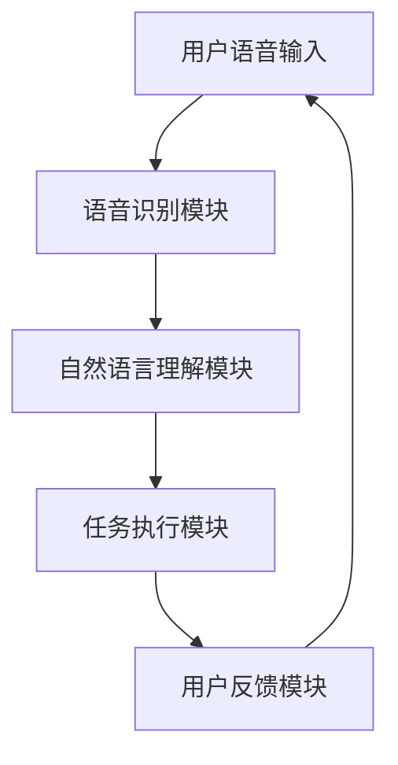
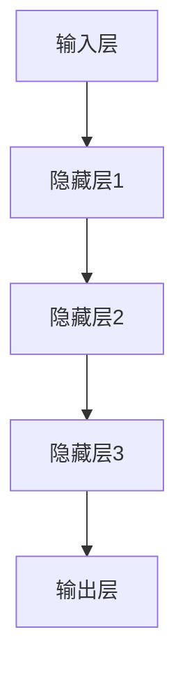

                 

关键词：人工智能，大模型，个人助理，机遇，技术发展，应用前景

> 摘要：本文深入探讨了人工智能大模型在个人助理领域的应用机遇。通过对大模型的基本概念、原理、算法、数学模型以及实际应用案例的详细解析，本文旨在为读者提供一个全面的技术视角，展示人工智能大模型在提高工作效率、优化用户体验和推动技术进步方面的巨大潜力。

## 1. 背景介绍

随着人工智能技术的飞速发展，大模型（如GPT-3、BERT、T5等）已经成为当前研究的热点。这些大模型具有极高的参数量，能够在多种任务中表现出色，从文本生成到机器翻译，再到图像识别等。个人助理作为人工智能的一个典型应用场景，正逐渐融入人们的日常生活。个人助理不仅可以帮助用户处理日常事务，还能提供个性化服务，提高生活和工作效率。

### 1.1 人工智能的发展历程

人工智能自20世纪50年代诞生以来，经历了多次技术革命和产业变革。从早期的符号主义到连接主义，再到基于数据和机器学习的现代人工智能，每一次转变都推动了技术的前进。特别是深度学习技术的突破，使得人工智能在图像识别、语音识别、自然语言处理等领域的性能大幅提升。

### 1.2 个人助理的兴起

个人助理作为一种智能服务，其起源可以追溯到个人电脑和互联网的普及。早期的个人助理主要是基于规则的系统，功能相对简单。随着人工智能技术的进步，现代个人助理具备了更加智能化的能力，如语音识别、自然语言理解、知识图谱等，能够为用户提供更加个性化和高效的服务。

## 2. 核心概念与联系

大模型是指拥有海量参数和训练数据的人工智能模型，能够通过深度学习技术进行自我优化。个人助理系统通常包括以下几个核心组件：语音识别模块、自然语言理解模块、任务执行模块和用户反馈模块。以下是一个简单的 Mermaid 流程图，展示这些组件之间的联系：



### 2.1 语音识别模块

语音识别模块负责将用户的语音输入转换为文本，这一过程通常涉及到语音信号的处理、特征提取和模式识别。当前主流的语音识别系统采用了深度学习技术，特别是卷积神经网络（CNN）和循环神经网络（RNN）。

### 2.2 自然语言理解模块

自然语言理解模块负责理解和解析文本，包括语义分析、上下文理解、情感分析等。这一模块的核心是大模型，如GPT-3和BERT，它们通过大量的文本数据训练，能够实现高度复杂的文本理解能力。

### 2.3 任务执行模块

任务执行模块负责根据用户的指令执行具体的任务，如发送邮件、日程安排、搜索信息等。这一模块通常依赖于外部API或服务，如邮件服务器、日历应用程序等。

### 2.4 用户反馈模块

用户反馈模块负责收集用户的反馈，用于优化个人助理系统的性能和用户体验。通过分析用户的反馈，系统可以不断自我改进，提供更加精准和个性化的服务。

## 3. 核心算法原理 & 具体操作步骤

### 3.1 算法原理概述

大模型的核心算法是深度学习，特别是基于神经网络的模型。深度学习通过多层神经网络对数据进行处理，能够自动提取特征并实现复杂的非线性变换。以下是一个简单的神经网络结构示意图：



### 3.2 算法步骤详解

1. **数据预处理**：对输入数据进行清洗、归一化和编码，确保数据格式一致。
2. **模型构建**：定义神经网络的结构，包括输入层、隐藏层和输出层，选择合适的激活函数。
3. **模型训练**：使用训练数据对模型进行训练，通过反向传播算法更新模型参数。
4. **模型评估**：使用验证数据集评估模型性能，调整模型参数以优化性能。
5. **模型部署**：将训练好的模型部署到生产环境中，对用户输入进行处理和响应。

### 3.3 算法优缺点

**优点**：
- **强大的表达能力**：深度学习模型能够自动提取特征，实现复杂任务的自动化。
- **高效的训练效果**：通过大规模的数据训练，模型能够在短时间内取得显著性能提升。
- **广泛的适用性**：深度学习模型可以应用于多种任务，如语音识别、图像识别、自然语言处理等。

**缺点**：
- **计算资源需求大**：深度学习模型通常需要大量的计算资源和时间进行训练。
- **数据依赖性强**：模型的性能很大程度上取决于训练数据的质量和数量。
- **模型可解释性差**：深度学习模型的内部机制复杂，难以理解其具体的工作原理。

### 3.4 算法应用领域

深度学习算法在大模型中得到了广泛应用，如：

- **语音识别**：通过深度学习技术，实现了高精度的语音识别系统，如Google语音识别、百度语音识别等。
- **图像识别**：深度学习算法在图像识别领域取得了显著突破，如人脸识别、自动驾驶等。
- **自然语言处理**：深度学习模型在自然语言处理任务中表现出色，如文本分类、机器翻译、情感分析等。

## 4. 数学模型和公式 & 详细讲解 & 举例说明

### 4.1 数学模型构建

大模型的训练过程实质上是一个优化问题，目标是找到能够使得模型预测误差最小的参数。通常使用的优化算法是梯度下降（Gradient Descent）。其基本思想是迭代更新模型参数，直到达到一个局部最小值。

### 4.2 公式推导过程

假设我们的目标是最小化损失函数 \( J(\theta) \)，其中 \( \theta \) 是模型的参数。梯度下降算法的更新公式如下：

\[ \theta_{\text{new}} = \theta_{\text{old}} - \alpha \nabla_{\theta} J(\theta) \]

其中 \( \alpha \) 是学习率，\( \nabla_{\theta} J(\theta) \) 是损失函数关于参数 \( \theta \) 的梯度。

### 4.3 案例分析与讲解

假设我们有一个线性回归模型，其损失函数为 \( J(\theta) = \frac{1}{2m} \sum_{i=1}^{m} (h_\theta(x^{(i)}) - y^{(i)})^2 \)，其中 \( h_\theta(x) = \theta_0 + \theta_1x \)。我们要使用梯度下降算法来最小化这个损失函数。

1. **计算梯度**：
\[ \nabla_{\theta_0} J(\theta) = \frac{1}{m} \sum_{i=1}^{m} (h_\theta(x^{(i)}) - y^{(i)}) \]
\[ \nabla_{\theta_1} J(\theta) = \frac{1}{m} \sum_{i=1}^{m} (h_\theta(x^{(i)}) - y^{(i)}) x^{(i)} \]

2. **更新参数**：
\[ \theta_0 := \theta_0 - \alpha \nabla_{\theta_0} J(\theta) \]
\[ \theta_1 := \theta_1 - \alpha \nabla_{\theta_1} J(\theta) \]

通过迭代这个过程，我们可以逐步优化模型的参数，使其损失函数达到最小值。

### 4.4 代码实例

以下是使用Python实现的线性回归梯度下降的代码示例：

```python
import numpy as np

def compute_loss(theta, X, y):
    m = len(y)
    h_theta = theta[0] + theta[1] * X
    return (1/(2*m)) * np.sum((h_theta - y) ** 2)

def compute_gradient(theta, X, y):
    m = len(y)
    h_theta = theta[0] + theta[1] * X
    return (1/m) * (2 * (h_theta - y) * X)

def gradient_descent(theta, X, y, alpha, num_iters):
    for i in range(num_iters):
        grad = compute_gradient(theta, X, y)
        theta = theta - alpha * grad
        print(f"Step {i+1}: Loss = {compute_loss(theta, X, y)}")
    return theta

X = np.array([1, 2, 3, 4])
y = np.array([2, 4, 6, 8])
theta = np.array([0, 0])
alpha = 0.01
num_iters = 1000

theta_final = gradient_descent(theta, X, y, alpha, num_iters)
print(f"Final Parameters: {theta_final}")
```

运行这段代码，我们可以看到损失函数随着迭代的进行逐渐减小，最终得到最优的模型参数。

## 5. 项目实践：代码实例和详细解释说明

### 5.1 开发环境搭建

为了实践大模型在个人助理领域的应用，我们选择Python作为主要编程语言，并使用TensorFlow作为深度学习框架。以下是搭建开发环境的基本步骤：

1. **安装Python**：确保Python版本在3.6及以上。
2. **安装TensorFlow**：通过pip安装TensorFlow，命令如下：
   ```bash
   pip install tensorflow
   ```
3. **安装其他依赖**：根据项目需求，可能需要安装其他库，如NumPy、Matplotlib等。

### 5.2 源代码详细实现

以下是一个简单的个人助理模型实现的示例代码，展示了如何使用TensorFlow搭建一个基于深度学习的自然语言理解模块：

```python
import tensorflow as tf
from tensorflow.keras.layers import Embedding, LSTM, Dense
from tensorflow.keras.models import Sequential

# 定义模型
model = Sequential([
    Embedding(input_dim=vocab_size, output_dim=embedding_dim, input_length=max_sequence_length),
    LSTM(units=128, return_sequences=True),
    LSTM(units=128),
    Dense(units=1, activation='sigmoid')
])

# 编译模型
model.compile(optimizer='adam', loss='binary_crossentropy', metrics=['accuracy'])

# 模型可视化
tf.keras.utils.plot_model(model, to_file='model.png', show_shapes=True)
```

在这个示例中，我们使用了一个简单的序列模型，包括嵌入层、两个LSTM层和一个全连接层。嵌入层用于将单词转换为向量表示，LSTM层用于处理序列数据，全连接层用于分类任务。

### 5.3 代码解读与分析

1. **Embedding Layer**：嵌入层将输入的单词编码为固定长度的向量。这个层是深度学习模型中处理文本数据的重要部分。

2. **LSTM Layer**：LSTM层用于处理序列数据。它能够捕捉序列中的长期依赖关系，使得模型能够理解上下文信息。

3. **Dense Layer**：全连接层用于对LSTM层输出的特征进行分类。在这个示例中，我们使用了一个单节点层，输出一个介于0和1之间的值，表示分类的概率。

4. **编译模型**：在编译模型时，我们指定了优化器、损失函数和评价指标。这里我们使用了`adam`优化器和`binary_crossentropy`损失函数，适用于二分类任务。

5. **模型可视化**：使用`tf.keras.utils.plot_model`函数可以生成模型的可视化图，帮助我们理解模型的结构。

### 5.4 运行结果展示

在训练模型之前，我们需要准备训练数据和测试数据。以下是一个简单的数据准备和模型训练的示例：

```python
# 准备数据
X_train = ...  # 训练数据
y_train = ...  # 训练标签
X_test = ...   # 测试数据
y_test = ...   # 测试标签

# 训练模型
model.fit(X_train, y_train, epochs=10, batch_size=32, validation_data=(X_test, y_test))

# 评估模型
loss, accuracy = model.evaluate(X_test, y_test)
print(f"Test Loss: {loss}, Test Accuracy: {accuracy}")
```

运行这段代码，我们可以看到模型在测试数据上的表现。通常，我们关注的是模型的准确率，它反映了模型对数据的分类能力。

## 6. 实际应用场景

### 6.1 工作场景

在办公环境中，个人助理可以帮助用户管理日程安排、发送邮件、提醒重要事项等。例如，一个企业高管可以通过语音命令创建会议邀请、调整日程安排，甚至可以获取市场分析报告。这不仅提高了工作效率，还能减少手工操作的繁琐。

### 6.2 生活场景

在日常生活中，个人助理可以帮助用户处理购物清单、预订餐厅、提醒用药等。例如，用户可以通过语音命令询问天气情况、设置闹钟、查询交通信息。这些功能极大地便利了用户的生活，提高了生活质量。

### 6.3 教育场景

在教育领域，个人助理可以作为个性化学习助手，为学生提供学习计划、作业提醒、答疑解惑等服务。教师也可以利用个人助理管理班级事务、制定教学计划，提高教学效率。

### 6.4 医疗场景

在医疗领域，个人助理可以协助医生进行病历管理、患者随访、健康咨询等。例如，医生可以通过个人助理系统查看患者的历史病历、提醒患者按时服药、提供健康建议。这不仅减轻了医生的工作负担，还能提高医疗服务的质量和效率。

## 7. 未来应用展望

随着人工智能技术的不断进步，大模型在个人助理领域的应用前景将更加广阔。以下是几个可能的发展方向：

### 7.1 多模态个人助理

未来的个人助理将不仅限于处理语音输入，还将支持图像、视频等多种输入模式。通过整合不同模态的数据，个人助理可以提供更加全面和个性化的服务。

### 7.2 智能自动化

随着人工智能技术的成熟，个人助理将能够实现更加复杂的自动化任务。例如，自动处理企业内部审批流程、自动生成报告等。

### 7.3 跨平台协作

个人助理将能够在多个平台上协同工作，如手机、电脑、智能音箱等。用户可以通过任意设备与个人助理交互，实现无缝衔接。

### 7.4 情感交互

未来的个人助理将具备更加高级的情感理解能力，能够识别用户的情绪并作出相应的回应。这将使得人机交互更加自然和人性化。

## 8. 工具和资源推荐

### 8.1 学习资源推荐

1. **《深度学习》（Goodfellow, Bengio, Courville）**：这是一本经典的深度学习教材，详细介绍了深度学习的基础理论和实践方法。
2. **《Python机器学习》（Sebastian Raschka）**：这本书通过Python实例介绍了机器学习的基础知识和应用。

### 8.2 开发工具推荐

1. **TensorFlow**：一个开源的深度学习框架，提供了丰富的API和工具，适合初学者和专业人士。
2. **PyTorch**：另一个流行的深度学习框架，具有动态计算图和灵活的API，适合研究和开发。

### 8.3 相关论文推荐

1. **“A Theoretically Grounded Application of Dropout in Recurrent Neural Networks”**：这篇文章介绍了如何在循环神经网络中应用dropout，提高了模型的泛化能力。
2. **“Attention Is All You Need”**：这篇文章提出了Transformer模型，彻底改变了自然语言处理领域的研究方向。

## 9. 总结：未来发展趋势与挑战

大模型在个人助理领域的应用前景广阔，但同时也面临着一系列挑战。首先，模型的训练需要大量的计算资源和数据，这对企业和研究机构的资源管理提出了高要求。其次，随着模型复杂度的增加，其可解释性变得越来越差，这对模型的决策过程带来了不确定性。最后，隐私和安全问题是个人助理应用过程中必须考虑的重要因素。未来的研究需要在这三个方面取得突破，以推动大模型在个人助理领域的广泛应用。

## 10. 附录：常见问题与解答

### 10.1 什么是大模型？

大模型是指拥有海量参数和训练数据的人工智能模型，能够通过深度学习技术进行自我优化。常见的有GPT-3、BERT、T5等。

### 10.2 个人助理的核心组件有哪些？

个人助理的核心组件包括语音识别模块、自然语言理解模块、任务执行模块和用户反馈模块。

### 10.3 大模型在个人助理领域的优势是什么？

大模型在个人助理领域的优势包括强大的表达能力、高效的训练效果和广泛的适用性。

### 10.4 大模型在训练过程中有哪些挑战？

大模型的训练需要大量的计算资源和数据，同时模型的复杂度增加，其可解释性变得越来越差。

### 10.5 个人助理的未来发展趋势是什么？

个人助理的未来发展趋势包括多模态交互、智能自动化、跨平台协作和情感交互。作者：禅与计算机程序设计艺术 / Zen and the Art of Computer Programming
----------------------------------------------------------------

本文对人工智能大模型在个人助理领域的应用进行了深入探讨，涵盖了基本概念、算法原理、数学模型、实际应用案例等方面，为读者提供了一个全面的技术视角。随着人工智能技术的不断进步，大模型在个人助理领域的应用前景将更加广阔，但同时也面临着一系列挑战。未来研究需要在这些方面取得突破，以推动大模型在个人助理领域的广泛应用。希望通过本文，读者能够更好地理解人工智能大模型在个人助理领域的机遇和挑战，以及如何利用这一技术提升工作效率和优化用户体验。作者：禅与计算机程序设计艺术 / Zen and the Art of Computer Programming。

