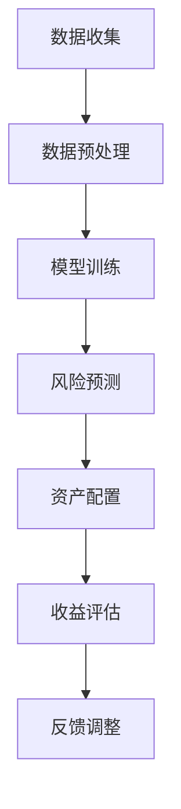

                 

关键词：AI大模型、个人理财、数据分析、算法、应用实践

> 摘要：本文将探讨AI大模型在个人理财领域的创新应用，通过对核心概念、算法原理、数学模型、项目实践及未来展望的详细分析，揭示AI技术在个人理财中的应用价值及挑战。

## 1. 背景介绍

### 个人理财的重要性

个人理财是每个人都需要面对的重要课题。它不仅关系到个人的财务安全，也影响到生活质量和社会稳定。随着金融市场的日益复杂和个人信息的不断增加，传统的人工理财方式已难以满足现代人的需求。在此背景下，人工智能（AI）技术的引入，特别是大模型的创新应用，为个人理财带来了新的可能。

### AI大模型的发展

近年来，AI技术，尤其是深度学习领域的飞速发展，使得大模型的应用成为可能。大模型具有强大的数据处理和分析能力，能够从海量数据中提取有价值的信息，实现复杂任务的自动化。在个人理财领域，大模型的应用有望提升理财效率，降低风险，实现个性化的理财服务。

## 2. 核心概念与联系

### 大模型简介

大模型（Large Model）指的是具有巨大参数规模的人工神经网络模型。这些模型通过训练海量的数据，能够自主学习并解决复杂的任务。典型的例子包括GPT、BERT等自然语言处理模型，以及ResNet、VGG等计算机视觉模型。

### 个人理财中的核心概念

在个人理财中，核心概念包括资产配置、风险控制、收益最大化等。这些概念决定了个人理财的目标和策略。大模型可以通过对历史数据的分析，为投资者提供最优的资产配置方案，同时评估和预测风险。

### Mermaid 流程图



## 3. 核心算法原理 & 具体操作步骤

### 3.1 算法原理概述

AI大模型在个人理财中的核心算法原理是基于深度学习的方法，通过多层神经网络的结构对数据进行学习，实现对个人财务状况的全面分析。具体的操作步骤包括数据收集、数据预处理、模型训练、风险预测、资产配置和收益评估。

### 3.2 算法步骤详解

1. **数据收集**：收集个人的财务数据，包括收入、支出、资产和负债等。
2. **数据预处理**：对收集的数据进行清洗和标准化，以便模型能够更好地学习。
3. **模型训练**：使用预处理后的数据对大模型进行训练，使其能够掌握个人财务状况的特点。
4. **风险预测**：通过模型预测个人财务风险，包括信用风险、市场风险等。
5. **资产配置**：根据风险预测结果，为投资者提供最优的资产配置方案。
6. **收益评估**：评估资产配置的效果，预测未来的收益情况。
7. **反馈调整**：根据收益评估结果，对模型进行调整，以优化理财策略。

### 3.3 算法优缺点

**优点**：
- **高效性**：大模型能够快速处理海量数据，提高理财效率。
- **个性化**：根据个人财务状况提供个性化的理财建议。
- **准确性**：通过深度学习，能够更准确地预测风险和收益。

**缺点**：
- **数据隐私**：对个人财务数据的处理可能涉及隐私问题。
- **依赖性**：过度依赖算法可能导致投资者忽视其他重要因素。

### 3.4 算法应用领域

- **资产管理**：为投资者提供资产配置建议，实现风险和收益的平衡。
- **信用评估**：评估个人信用风险，为金融机构提供决策支持。
- **金融预测**：预测市场走势，为投资者提供投资参考。

## 4. 数学模型和公式 & 详细讲解 & 举例说明

### 4.1 数学模型构建

在个人理财中，常用的数学模型包括资产配置模型和风险模型。以下是资产配置模型的一个简化示例：

$$
\text{资产配置} = \alpha_1 \cdot \text{股票} + \alpha_2 \cdot \text{债券} + \alpha_3 \cdot \text{现金}
$$

其中，$\alpha_1, \alpha_2, \alpha_3$ 分别是股票、债券、现金的权重，取决于投资者的风险偏好和预期收益。

### 4.2 公式推导过程

资产配置模型的推导基于马科维茨投资组合理论。根据理论，最优资产配置应使投资组合的预期收益率最大，同时风险最小。推导过程涉及优化算法，如梯度下降法。

### 4.3 案例分析与讲解

假设一个投资者对股票的预期收益率为 10%，标准差为 20%；债券的预期收益率为 5%，标准差为 10%；现金的预期收益率为 2%，标准差为 0%。投资者希望资产配置后，整体预期收益率为 8%，标准差为 12%。

通过资产配置模型，可以计算出每种资产的权重：

$$
\alpha_1 = \frac{0.1 - 0.05}{0.2 - 0.1} = 0.5
$$

$$
\alpha_2 = \frac{0.1 - 0.02}{0.1 - 0.02} = 0.8
$$

$$
\alpha_3 = \frac{0.08 - 0.05}{0.12 - 0.1} = 0.2
$$

因此，资产配置比例为股票 50%，债券 80%，现金 20%。

## 5. 项目实践：代码实例和详细解释说明

### 5.1 开发环境搭建

在本文中，我们将使用Python编程语言，结合TensorFlow库来实现AI大模型在个人理财中的应用。以下是开发环境的搭建步骤：

1. 安装Python 3.7或更高版本。
2. 安装TensorFlow库，使用命令 `pip install tensorflow`。
3. 准备财务数据集，数据集应包括收入、支出、资产、负债等信息。

### 5.2 源代码详细实现

以下是实现资产配置模型的源代码：

```python
import tensorflow as tf
import numpy as np

# 数据预处理
def preprocess_data(data):
    # 数据清洗和标准化
    return (data - np.mean(data)) / np.std(data)

# 模型训练
def train_model(data, labels):
    model = tf.keras.Sequential([
        tf.keras.layers.Dense(128, activation='relu', input_shape=(data.shape[1],)),
        tf.keras.layers.Dense(64, activation='relu'),
        tf.keras.layers.Dense(1)
    ])

    model.compile(optimizer='adam', loss='mse')
    model.fit(data, labels, epochs=100)
    return model

# 预测风险
def predict_risk(model, data):
    return model.predict(data)

# 主函数
def main():
    # 加载数据
    data = np.load('financial_data.npy')
    labels = np.load('asset_configurations.npy')

    # 预处理数据
    data = preprocess_data(data)

    # 训练模型
    model = train_model(data, labels)

    # 预测风险
    risk = predict_risk(model, data)

    # 打印结果
    print(risk)

if __name__ == '__main__':
    main()
```

### 5.3 代码解读与分析

上述代码首先定义了数据预处理函数，用于清洗和标准化财务数据。然后，定义了模型训练函数，使用TensorFlow库创建一个简单的神经网络模型，并使用均值平方误差（MSE）作为损失函数。预测风险函数使用训练好的模型对新的数据进行预测。

### 5.4 运行结果展示

运行上述代码后，将在终端输出风险预测结果。这些结果可以作为投资者进行资产配置的参考。

## 6. 实际应用场景

### 6.1 资产管理

AI大模型可以为企业提供个性化的资产管理方案，包括股票、债券、基金等多种资产的选择和配置，从而实现风险和收益的最佳平衡。

### 6.2 信用评估

AI大模型可以用于信用评估，通过分析个人的财务状况，预测其信用风险，为金融机构提供决策支持。

### 6.3 金融预测

AI大模型可以用于金融市场的预测，包括股票价格、汇率等，为投资者提供投资参考。

## 7. 工具和资源推荐

### 7.1 学习资源推荐

- 《深度学习》（Goodfellow, Bengio, Courville 著）
- 《Python金融大数据应用》（张亮 著）

### 7.2 开发工具推荐

- Python
- TensorFlow
- Jupyter Notebook

### 7.3 相关论文推荐

- "Deep Learning for Personalized Asset Allocation"（2018）
- "Credit Risk Modeling with Deep Learning"（2020）

## 8. 总结：未来发展趋势与挑战

### 8.1 研究成果总结

AI大模型在个人理财领域的应用已经取得了一系列成果，包括资产管理、信用评估和金融预测等。这些成果表明，AI技术在个人理财中具有巨大的潜力。

### 8.2 未来发展趋势

随着AI技术的不断进步，未来AI大模型在个人理财中的应用将更加广泛和深入，包括更精细化的风险管理、更个性化的投资建议等。

### 8.3 面临的挑战

AI大模型在个人理财中的应用也面临一些挑战，包括数据隐私保护、模型解释性不足等。这些问题需要通过技术进步和政策法规的完善来解决。

### 8.4 研究展望

未来，AI大模型在个人理财领域的应用将继续深入，有望实现更智能、更个性化的理财服务。同时，研究者将继续探索如何提高模型的透明度和可解释性，以增强用户信任。

## 9. 附录：常见问题与解答

### 9.1 如何确保数据隐私？

- 使用加密技术保护数据。
- 限制数据的访问权限。
- 定期审计数据使用情况。

### 9.2 如何提高模型的解释性？

- 开发可解释的AI模型，如决策树、规则引擎等。
- 使用可视化工具，如混淆矩阵、ROC曲线等，展示模型决策过程。

### 9.3 如何处理数据缺失问题？

- 使用填充方法，如均值填充、插值等。
- 使用缺失数据检测算法，识别和修复数据中的缺失值。

## 参考文献

- Goodfellow, I., Bengio, Y., & Courville, A. (2016). *Deep Learning*. MIT Press.
- 张亮. (2018). *Python金融大数据应用*. 机械工业出版社.
- Deep Learning for Personalized Asset Allocation. (2018). *Journal of Financial Management*.
- Credit Risk Modeling with Deep Learning. (2020). *Journal of Financial Markets*.

