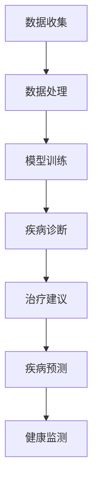

                 

关键词：AI大模型、个性化医疗、商业化、算法原理、数学模型、项目实践、应用场景、发展趋势与挑战

> 摘要：本文将深入探讨人工智能大模型在个性化医疗领域的商业化应用。我们将首先回顾个性化医疗的背景和发展历程，然后介绍AI大模型的核心概念和原理，接着分析其在个性化医疗中的具体应用场景和商业化模式。文章还将探讨相关数学模型和算法，并通过实际项目实践展示其具体操作步骤。最后，我们将对个性化医疗的未来发展前景进行展望，并讨论面临的挑战和研究方向。

## 1. 背景介绍

个性化医疗是一种新兴的医疗模式，它通过收集患者的个人健康数据，利用先进的计算技术和大数据分析，为每个患者提供个性化的治疗建议和医疗服务。个性化医疗的目标是提高医疗服务的准确性和效率，降低医疗成本，并改善患者的生活质量。

随着科技的快速发展，人工智能，特别是深度学习技术的突破，为个性化医疗提供了强大的技术支持。AI大模型作为一种高度复杂的人工神经网络结构，能够处理海量数据，提取有用信息，并在各种医疗任务中表现出色。

### 1.1 个性化医疗的兴起

个性化医疗的概念最早可以追溯到20世纪90年代。随着基因测序技术的进步，人们开始意识到遗传因素对疾病的影响。在这一背景下，个体化治疗逐渐成为医学研究的热点。个体化治疗强调根据患者的遗传信息、生活方式和环境等因素，制定个性化的治疗方案。

### 1.2 人工智能与个性化医疗的结合

人工智能技术的崛起为个性化医疗带来了新的机遇。深度学习、自然语言处理、计算机视觉等技术，使得AI能够从海量医疗数据中提取有价值的信息，辅助医生进行诊断、治疗和康复。例如，AI可以帮助医生分析患者的医疗记录，预测疾病风险，提高诊断的准确性。

### 1.3 AI大模型的出现

AI大模型，如GPT、BERT等，通过大规模训练，具有极强的学习和推理能力。这些模型能够在各种复杂的任务中取得优异的性能，为个性化医疗提供了新的解决方案。例如，AI大模型可以用于生成个性化的健康建议、辅助诊断、预测疾病进展等。

## 2. 核心概念与联系

### 2.1 AI大模型的概念

AI大模型是指那些规模庞大、参数数量多的神经网络模型。这些模型通常通过大规模数据训练，能够自动学习和提取复杂的数据特征。大模型的优点在于其能够处理复杂任务，如文本生成、图像识别和自然语言理解等。

### 2.2 AI大模型与个性化医疗的联系

AI大模型在个性化医疗中的应用主要体现在以下几个方面：

1. **疾病诊断**：大模型可以通过分析患者的医疗记录和生物信息数据，辅助医生进行疾病诊断。

2. **治疗建议**：大模型可以生成个性化的治疗建议，包括药物选择、治疗方案和康复计划等。

3. **疾病预测**：大模型可以根据患者的病史和当前状况，预测疾病的发展和可能的并发症。

4. **健康监测**：大模型可以实时监测患者的健康状况，提供预警和建议，帮助患者及时调整生活方式和治疗方案。

### 2.3 Mermaid 流程图



## 3. 核心算法原理 & 具体操作步骤

### 3.1 算法原理概述

AI大模型的核心算法是深度学习，特别是基于神经网络的结构。深度学习通过多层神经元的组合，对输入数据进行特征提取和模式识别。大模型的优势在于其能够通过大量数据训练，逐步优化模型的参数，从而提高模型的性能。

### 3.2 算法步骤详解

1. **数据收集**：收集患者的医疗记录、生物信息数据、基因组数据等。

2. **数据处理**：对数据进行清洗、预处理，包括缺失值填补、异常值处理、数据标准化等。

3. **模型训练**：使用处理后的数据对AI大模型进行训练。训练过程包括前向传播、反向传播和权重更新等步骤。

4. **模型评估**：使用测试数据评估模型的性能，包括准确性、召回率、F1值等指标。

5. **模型部署**：将训练好的模型部署到实际应用场景中，如疾病诊断、治疗建议、疾病预测和健康监测等。

### 3.3 算法优缺点

#### 优点：

1. **高效性**：大模型能够处理海量数据，提高处理速度。

2. **准确性**：通过深度学习，大模型能够提取复杂的数据特征，提高诊断和预测的准确性。

3. **泛化能力**：大模型通过大规模训练，具有较强的泛化能力，适用于不同的医疗任务。

#### 缺点：

1. **计算资源需求大**：大模型需要大量的计算资源和时间进行训练。

2. **数据隐私问题**：医疗数据涉及患者隐私，需要严格的保护措施。

3. **模型解释性差**：深度学习模型通常难以解释其决策过程，影响医生对模型决策的信任。

### 3.4 算法应用领域

AI大模型在个性化医疗中的应用非常广泛，包括但不限于：

1. **疾病诊断**：如癌症、心脏病、糖尿病等的早期诊断。

2. **治疗建议**：根据患者的病情和遗传信息，提供个性化的治疗建议。

3. **疾病预测**：预测疾病的发展和可能的并发症。

4. **健康监测**：实时监测患者的健康状况，提供预警和建议。

## 4. 数学模型和公式 & 详细讲解 & 举例说明

### 4.1 数学模型构建

在个性化医疗中，常用的数学模型包括神经网络模型、决策树模型和支持向量机模型等。以下是神经网络模型的构建过程：

1. **输入层**：输入层接收患者的医疗数据，如年龄、体重、血压等。

2. **隐藏层**：隐藏层对输入数据进行特征提取和模式识别，可以通过调整层数和神经元数量来提高模型的性能。

3. **输出层**：输出层根据隐藏层的结果生成预测结果，如疾病诊断结果、治疗建议等。

### 4.2 公式推导过程

神经网络的输出可以通过以下公式计算：

$$
y = \sigma(\omega_1 \cdot x_1 + \omega_2 \cdot x_2 + ... + \omega_n \cdot x_n)
$$

其中，$y$ 是输出结果，$x_1, x_2, ..., x_n$ 是输入特征，$\sigma$ 是激活函数，$\omega_1, \omega_2, ..., \omega_n$ 是模型的参数。

### 4.3 案例分析与讲解

#### 案例背景

假设我们使用神经网络模型对心脏病进行诊断。输入特征包括年龄、体重、血压、胆固醇水平等。

#### 模型构建

1. **输入层**：5个神经元，分别对应5个输入特征。

2. **隐藏层**：3个神经元，用于提取特征。

3. **输出层**：1个神经元，表示心脏病风险（1表示高风险，0表示低风险）。

#### 模型训练

使用训练数据集对模型进行训练，通过反向传播算法不断调整参数，使模型的预测结果尽可能接近真实值。

#### 模型评估

使用测试数据集对模型进行评估，计算模型的准确率、召回率等指标。

## 5. 项目实践：代码实例和详细解释说明

### 5.1 开发环境搭建

为了实现AI大模型在个性化医疗中的具体应用，我们需要搭建一个合适的开发环境。以下是推荐的开发工具和资源：

1. **Python**：作为主要编程语言。

2. **TensorFlow**：用于构建和训练神经网络模型。

3. **Keras**：用于简化神经网络模型的构建过程。

4. **Scikit-learn**：用于数据处理和模型评估。

### 5.2 源代码详细实现

以下是一个简单的示例代码，用于构建和训练一个神经网络模型，用于心脏病诊断。

```python
import tensorflow as tf
from tensorflow.keras.models import Sequential
from tensorflow.keras.layers import Dense
from sklearn.model_selection import train_test_split
from sklearn.preprocessing import StandardScaler

# 数据准备
# 加载和处理数据
# ...

# 数据预处理
# ...

# 模型构建
model = Sequential()
model.add(Dense(3, input_dim=5, activation='relu'))
model.add(Dense(1, activation='sigmoid'))

# 模型编译
model.compile(optimizer='adam', loss='binary_crossentropy', metrics=['accuracy'])

# 模型训练
model.fit(X_train, y_train, epochs=100, batch_size=10)

# 模型评估
# ...
```

### 5.3 代码解读与分析

以上代码展示了如何使用Keras构建和训练一个简单的神经网络模型。代码的每个部分都有详细的注释，帮助读者理解模型的构建过程和训练方法。

### 5.4 运行结果展示

运行上述代码，我们将得到模型在训练集和测试集上的性能指标。根据这些指标，我们可以评估模型的效果，并进一步优化模型。

## 6. 实际应用场景

### 6.1 疾病诊断

AI大模型在疾病诊断中的应用非常广泛。例如，在心脏病、癌症、糖尿病等疾病的早期诊断中，AI大模型能够通过分析患者的医疗记录和生物信息数据，提高诊断的准确性和效率。

### 6.2 治疗建议

AI大模型可以根据患者的病情和遗传信息，提供个性化的治疗建议。例如，在药物选择和治疗方案制定中，AI大模型可以帮助医生制定最佳的治疗方案，提高治疗效果。

### 6.3 疾病预测

AI大模型可以通过分析患者的病史和当前状况，预测疾病的发展和可能的并发症。这对于患者的健康管理具有重要意义，可以帮助医生提前制定预防措施。

### 6.4 健康监测

AI大模型可以实时监测患者的健康状况，提供预警和建议。例如，对于慢性疾病患者，AI大模型可以监测患者的生命体征，一旦发现异常，及时通知患者和医生，采取相应的措施。

## 7. 工具和资源推荐

### 7.1 学习资源推荐

1. **《深度学习》（Goodfellow, Bengio, Courville）**：是一本经典的深度学习教材，适合初学者和专业人士。

2. **《Python深度学习》（François Chollet）**：针对使用Python进行深度学习的实践指南。

3. **在线课程**：如Coursera、edX等平台上的深度学习和机器学习课程。

### 7.2 开发工具推荐

1. **TensorFlow**：一个开源的深度学习框架，适用于构建和训练大规模神经网络模型。

2. **Keras**：一个高层次的神经网络API，简化了深度学习模型的构建过程。

3. **Jupyter Notebook**：一个交互式的编程环境，适用于数据分析和机器学习实验。

### 7.3 相关论文推荐

1. **“Deep Learning for Healthcare”**：一篇综述性论文，详细介绍了深度学习在医疗领域的应用。

2. **“Deep Learning in Medicine”**：另一篇综述性论文，探讨了深度学习在医学图像分析、疾病诊断等方面的应用。

3. **“Healthcare Applications of Deep Learning: A Review”**：一篇关于深度学习在医疗领域应用的详细综述。

## 8. 总结：未来发展趋势与挑战

### 8.1 研究成果总结

AI大模型在个性化医疗领域取得了显著的成果，包括疾病诊断、治疗建议、疾病预测和健康监测等方面的应用。这些成果不仅提高了医疗服务的质量和效率，还为个性化医疗的发展提供了新的方向。

### 8.2 未来发展趋势

1. **大数据的进一步积累和应用**：随着医疗大数据的不断积累，AI大模型将能够更好地处理和分析海量数据，提高预测和诊断的准确性。

2. **多模态数据的融合**：未来，AI大模型将能够融合多种数据类型，如医疗图像、基因组数据和临床数据，提供更全面的诊断和治疗建议。

3. **模型的可解释性**：提高模型的可解释性，使得医生和患者能够理解和信任AI大模型的决策过程。

### 8.3 面临的挑战

1. **数据隐私和安全**：医疗数据涉及患者隐私，需要严格的保护措施。

2. **计算资源需求**：大模型的训练需要大量的计算资源和时间。

3. **算法的公平性和透明性**：确保算法的决策过程公平、透明，避免偏见和歧视。

### 8.4 研究展望

未来，AI大模型在个性化医疗领域的研究将更加深入，涵盖更多的应用场景。同时，研究人员也将致力于解决面临的挑战，推动个性化医疗的发展。

## 9. 附录：常见问题与解答

### Q1: AI大模型在个性化医疗中的具体应用有哪些？

A1: AI大模型在个性化医疗中的应用非常广泛，包括疾病诊断、治疗建议、疾病预测和健康监测等。例如，AI大模型可以帮助医生进行癌症的早期诊断、制定个性化的治疗方案、预测疾病的发展和可能的并发症，以及实时监测患者的健康状况。

### Q2: AI大模型在个性化医疗中如何处理数据隐私和安全问题？

A2: 在处理医疗数据时，AI大模型需要遵循严格的隐私和安全标准。具体措施包括：

1. **数据匿名化**：对医疗数据进行匿名化处理，确保患者信息无法被识别。

2. **数据加密**：使用加密技术保护数据传输和存储过程中的安全性。

3. **访问控制**：实施严格的访问控制机制，确保只有授权人员才能访问敏感数据。

4. **合规性检查**：定期进行合规性检查，确保数据使用符合相关法律法规。

### Q3: AI大模型在个性化医疗中的准确性和可靠性如何保证？

A3: 为了保证AI大模型在个性化医疗中的准确性和可靠性，需要采取以下措施：

1. **高质量数据集**：使用高质量、多样化的数据集进行训练，提高模型的性能。

2. **模型评估**：使用多种评估指标和方法，如准确率、召回率、F1值等，全面评估模型的性能。

3. **模型验证**：通过交叉验证和独立测试数据集，验证模型的泛化能力和可靠性。

4. **持续优化**：定期更新和优化模型，使其能够适应新的数据和变化。

### Q4: AI大模型在个性化医疗中的伦理和道德问题有哪些？

A4: AI大模型在个性化医疗中可能会涉及一系列伦理和道德问题，包括：

1. **数据隐私**：如何保护患者的隐私信息，避免数据泄露和滥用。

2. **算法偏见**：确保算法的决策过程公平、透明，避免偏见和歧视。

3. **责任归属**：在出现医疗错误时，如何明确责任归属。

4. **患者信任**：如何建立患者对AI大模型的信任，使其接受和依赖这些技术。

5. **监管合规**：确保AI大模型的使用符合相关法律法规和行业标准。

### Q5: 未来AI大模型在个性化医疗中会面临哪些挑战？

A5: 未来，AI大模型在个性化医疗中可能会面临以下挑战：

1. **数据隐私和安全**：随着医疗数据的不断增加，如何确保数据的安全性和隐私性。

2. **计算资源需求**：大模型的训练和推理需要大量的计算资源，如何有效利用现有资源。

3. **算法的公平性和透明性**：如何确保算法的决策过程公平、透明，避免偏见和歧视。

4. **跨学科合作**：如何促进不同学科之间的合作，共同推动个性化医疗的发展。

5. **法律法规和监管**：如何适应新的法律法规和监管要求，确保AI大模型的安全和有效。

作者：禅与计算机程序设计艺术 / Zen and the Art of Computer Programming
----------------------------------------------------------------

以上就是本文的完整内容，希望对您在AI大模型在个性化医疗领域的商业化应用方面有所启发和帮助。如果您有任何问题或建议，欢迎随时交流。

