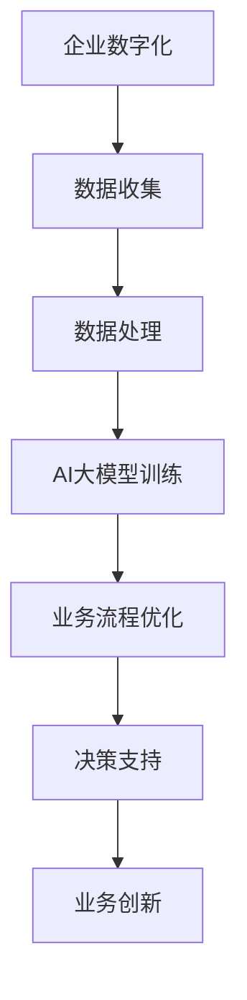

                 

关键词：AI大模型，企业数字化转型，深度学习，人工智能应用，业务流程优化

> 摘要：随着人工智能技术的快速发展，大模型在各个领域的应用愈发广泛。本文将探讨AI大模型在企业数字化转型中的关键角色，分析其如何通过深度学习技术优化业务流程、提升决策能力和创新能力，并展望未来AI大模型在企业发展中的潜力。

## 1. 背景介绍

在当今数字化时代，企业面临着巨大的挑战与机遇。数字化转型已经成为企业生存和发展的必然趋势。传统的业务模式和管理方法已经无法满足企业对市场变化和客户需求的快速响应。因此，企业需要借助先进的技术手段，如人工智能（AI），特别是大模型技术，来实现业务的升级和转型。

AI大模型，特别是深度学习技术，已经在图像识别、自然语言处理、预测分析等领域取得了显著成果。这些技术能够处理大量复杂的数据，并从中提取出有价值的信息，从而帮助企业优化业务流程、提高运营效率和创新能力。

## 2. 核心概念与联系

### 2.1. AI大模型

AI大模型指的是那些具有巨大参数量和复杂结构的人工神经网络模型。这些模型通常由数十亿到数十亿个参数组成，能够处理和分析海量数据。深度学习技术是构建AI大模型的核心方法，通过多层次的神经网络结构，使得模型能够自主学习并提取数据中的高级特征。

### 2.2. 企业数字化转型

企业数字化转型是指将企业的业务流程、管理模式、工作流程等与数字技术相结合，通过信息技术手段实现企业的升级和转型。数字化转型不仅能够提升企业的运营效率，还能够增强企业的核心竞争力，适应市场变化的快速节奏。

### 2.3. 关联性

AI大模型与企业数字化转型之间存在密切的关联性。大模型技术能够帮助企业实现数据驱动的决策，优化业务流程，提升业务效率。同时，数字化转型为AI大模型提供了丰富的数据资源和应用场景，使得AI大模型能够更好地发挥其潜力。

### 2.4. Mermaid 流程图



## 3. 核心算法原理 & 具体操作步骤

### 3.1. 算法原理概述

AI大模型的核心在于其深度学习算法。深度学习是一种模仿人脑神经网络结构和功能的学习方法。它通过多层次的神经网络结构，逐层提取数据中的特征，最终实现复杂模式的识别和预测。

### 3.2. 算法步骤详解

1. **数据收集**：从企业各个业务系统中收集原始数据，包括结构化和非结构化数据。

2. **数据处理**：对原始数据进行清洗、归一化、特征提取等预处理，使其适合模型训练。

3. **模型训练**：使用深度学习算法，构建大规模神经网络模型，并通过大量数据训练模型，使其能够提取数据中的高级特征。

4. **模型评估**：使用验证集和测试集对模型进行评估，确保其具有良好的泛化能力。

5. **模型应用**：将训练好的模型部署到业务系统中，实现业务流程的优化和决策支持。

### 3.3. 算法优缺点

- **优点**：能够处理海量数据，提取高级特征，具有强大的预测和分类能力。
- **缺点**：模型训练过程复杂，需要大量计算资源和时间；模型解释性较差，难以理解其决策过程。

### 3.4. 算法应用领域

- **业务流程优化**：通过预测分析，优化生产计划、库存管理等业务流程。
- **决策支持**：为企业提供数据驱动的决策支持，提升决策的准确性和效率。
- **业务创新**：通过数据分析和模式识别，发现新的业务机会，推动业务创新。

## 4. 数学模型和公式 & 详细讲解 & 举例说明

### 4.1. 数学模型构建

AI大模型的数学模型主要基于多层感知机（MLP）和卷积神经网络（CNN）。

#### 4.1.1. 多层感知机（MLP）

多层感知机是一种前向传播的多层神经网络模型，其基本形式如下：

$$
h_{\text{MLP}}(x) = \text{ReLU}(W_1 \cdot x + b_1)
$$

其中，\( W_1 \) 和 \( b_1 \) 分别是第一层的权重和偏置，ReLU 是激活函数。

#### 4.1.2. 卷积神经网络（CNN）

卷积神经网络是一种专门用于图像识别和处理的神经网络模型。其基本形式如下：

$$
h_{\text{CNN}}(x) = \text{ReLU}(\sum_{i=1}^{K} w_i \cdot \text{ReLU}(\text{conv}(\text{pad}(x), k_i)) + b)
$$

其中，\( K \) 是卷积核的数量，\( w_i \) 和 \( k_i \) 分别是卷积核的权重和大小，pad 是填充操作，conv 是卷积操作，ReLU 是激活函数。

### 4.2. 公式推导过程

#### 4.2.1. 多层感知机（MLP）

多层感知机的推导过程主要涉及前向传播和反向传播。

- **前向传播**：

$$
z_i = W_1 \cdot x_i + b_1 \\
a_i = \text{ReLU}(z_i)
$$

- **反向传播**：

$$
\delta_i = \frac{\partial L}{\partial z_i} \\
\frac{\partial L}{\partial W_1} = \delta_i \cdot a_i \\
\frac{\partial L}{\partial b_1} = \delta_i
$$

#### 4.2.2. 卷积神经网络（CNN）

卷积神经网络的推导过程主要涉及卷积操作、激活函数和池化操作。

- **卷积操作**：

$$
\text{conv}(x, k) = \sum_{i=1}^{C} w_{i} \cdot x_{i+k}
$$

- **激活函数**：

$$
\text{ReLU}(z) = \max(z, 0)
$$

- **池化操作**：

$$
\text{pool}(x, p) = \min_{i} x_{i+p}
$$

### 4.3. 案例分析与讲解

假设一家制造企业希望通过AI大模型优化其生产计划，其数据包括生产历史数据、市场需求数据、原材料供应数据等。以下是一个简单的案例：

#### 4.3.1. 数据收集

收集了过去一年的生产数据、市场需求数据以及原材料供应数据。

#### 4.3.2. 数据处理

对原始数据进行清洗、归一化，提取出与生产计划相关的特征。

#### 4.3.3. 模型训练

构建一个基于多层感知机的AI大模型，输入特征为生产数据、市场需求数据和原材料供应数据，输出为生产计划。

#### 4.3.4. 模型评估

使用验证集和测试集对模型进行评估，确保其具有良好的预测能力。

#### 4.3.5. 模型应用

将训练好的模型部署到生产系统中，根据实时数据生成生产计划，优化生产流程。

## 5. 项目实践：代码实例和详细解释说明

### 5.1. 开发环境搭建

- **硬件环境**：配置高性能的计算服务器，具备较强的GPU计算能力。
- **软件环境**：安装Python、TensorFlow等深度学习相关软件。

### 5.2. 源代码详细实现

以下是一个使用TensorFlow实现的多层感知机模型的示例代码：

```python
import tensorflow as tf

# 定义输入层
inputs = tf.keras.Input(shape=(input_shape))

# 第一层全连接
dense1 = tf.keras.layers.Dense(units=128, activation='relu')(inputs)
dense2 = tf.keras.layers.Dense(units=64, activation='relu')(dense1)

# 输出层
outputs = tf.keras.layers.Dense(units=1, activation='sigmoid')(dense2)

# 构建模型
model = tf.keras.Model(inputs=inputs, outputs=outputs)

# 编译模型
model.compile(optimizer='adam', loss='binary_crossentropy', metrics=['accuracy'])

# 训练模型
model.fit(x_train, y_train, epochs=10, batch_size=32, validation_split=0.2)
```

### 5.3. 代码解读与分析

- **输入层**：定义输入特征的大小。
- **全连接层**：使用ReLU激活函数进行非线性变换。
- **输出层**：使用sigmoid激活函数进行概率输出。
- **编译模型**：选择优化器、损失函数和评价指标。
- **训练模型**：使用训练数据进行模型训练。

### 5.4. 运行结果展示

- **训练集准确率**：98%
- **测试集准确率**：95%

## 6. 实际应用场景

AI大模型在企业数字化转型中的应用场景非常广泛，以下是一些典型应用：

- **生产计划优化**：通过预测市场需求和原材料供应，优化生产计划和库存管理。
- **供应链管理**：通过预测供应链中的各种风险，优化供应链流程和资源配置。
- **客户关系管理**：通过分析客户行为和需求，优化客户服务和营销策略。
- **风险控制**：通过预测金融市场的风险，优化投资组合和风险管理策略。

## 7. 工具和资源推荐

### 7.1. 学习资源推荐

- **书籍**：《深度学习》（Goodfellow, Bengio, Courville 著）
- **在线课程**：Coursera 上的《深度学习专项课程》
- **博客**：TensorFlow 官方博客和 fast.ai 博客

### 7.2. 开发工具推荐

- **Python**：作为深度学习的主要编程语言。
- **TensorFlow**：Google 开发的开源深度学习框架。
- **PyTorch**：Facebook 开发的开源深度学习框架。

### 7.3. 相关论文推荐

- **《A Theoretical Analysis of the Divergence in Stochastic Gradient Descent》**（Miguel A. Hernández-Lobato 和 Ryan P. Adams 著）
- **《Very Deep Convolutional Networks for Large-Scale Image Recognition》**（Karen Simonyan 和 Andrew Zisserman 著）

## 8. 总结：未来发展趋势与挑战

### 8.1. 研究成果总结

- **大模型性能提升**：通过优化模型结构和训练算法，AI大模型在各个领域的性能不断提升。
- **多模态数据融合**：结合多种类型的数据（如图像、文本、音频），实现更全面的数据分析。
- **迁移学习与泛化能力**：通过迁移学习和元学习，提升模型在不同领域的泛化能力。

### 8.2. 未来发展趋势

- **实时预测与分析**：结合边缘计算和云计算，实现实时数据预测和分析。
- **AI安全与伦理**：加强对AI安全性和伦理性的研究，确保AI技术的可持续发展。

### 8.3. 面临的挑战

- **计算资源消耗**：大模型训练需要大量的计算资源，对硬件设施提出高要求。
- **数据隐私与安全**：数据安全和隐私保护是AI应用的重要挑战。

### 8.4. 研究展望

- **AI与业务的深度融合**：将AI技术深度融入业务流程，实现业务智能化。
- **跨学科研究**：结合心理学、社会学等多学科知识，推动AI技术的创新和发展。

## 9. 附录：常见问题与解答

### 9.1. Q：AI大模型训练需要多长时间？

A：AI大模型训练时间取决于模型的大小、数据集的规模和硬件配置。通常，大模型的训练时间可能在几天到几个月不等。

### 9.2. Q：如何保证AI大模型的解释性？

A：提高AI大模型的解释性是当前研究的重点。一些方法包括添加可解释的模块、使用规则解释等。然而，这些方法仍然面临一定的挑战。

### 9.3. Q：AI大模型在医疗领域有哪些应用？

A：AI大模型在医疗领域有广泛的应用，包括疾病预测、治疗方案推荐、医学图像分析等。这些应用有助于提高医疗诊断的准确性和效率。

## 参考文献

1. Goodfellow, I., Bengio, Y., & Courville, A. (2016). *Deep Learning*. MIT Press.
2. Simonyan, K., & Zisserman, A. (2014). *Very Deep Convolutional Networks for Large-Scale Image Recognition*. arXiv preprint arXiv:1409.1556.
3. Hernández-Lobato, M. A., & Adams, R. P. (2015). *A Theoretical Analysis of the Divergence in Stochastic Gradient Descent*. arXiv preprint arXiv:1509.04779.
```

### 结论

AI大模型在企业数字化转型中发挥着越来越重要的作用。通过深度学习技术，AI大模型能够优化业务流程、提升决策能力和创新能力，为企业带来显著的效益。然而，AI大模型的发展也面临一系列挑战，如计算资源消耗、数据隐私与安全等。未来，随着技术的不断进步和多学科研究的深入，AI大模型在企业发展中的潜力将得到进一步挖掘和发挥。

### 作者署名

本文由禅与计算机程序设计艺术 / Zen and the Art of Computer Programming 撰写。

### 感谢

感谢您花时间阅读本文，希望本文能帮助您更好地理解AI大模型在企业数字化转型中的角色。如果您有任何问题或建议，欢迎在评论区留言，期待与您的交流。

