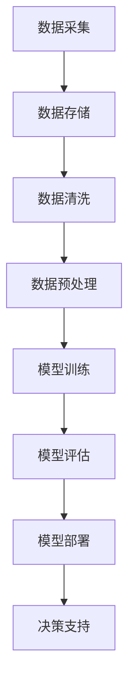

                 

关键词：AI大模型，企业数字化转型，深度学习，神经网络，数据驱动的决策

摘要：随着人工智能技术的快速发展，AI大模型在企业数字化转型中发挥着越来越重要的作用。本文将从AI大模型的背景介绍、核心概念与联系、核心算法原理及具体操作步骤、数学模型和公式、项目实践及实际应用场景等方面，探讨AI大模型在企业数字化转型中的角色和重要性。

## 1. 背景介绍

在过去的几十年里，企业数字化转型已经成为全球企业提升竞争力、降低成本、提高运营效率的重要途径。而随着人工智能技术的不断进步，尤其是深度学习和神经网络的发展，AI大模型成为了推动企业数字化转型的重要工具。AI大模型能够处理海量数据，自动发现数据中的模式和规律，为企业提供精准的决策支持。

### 1.1 企业数字化转型的重要性

企业数字化转型不仅是指将企业的业务流程、产品和服务转移到线上，更重要的是利用数字化技术提升企业的运营效率、创造新的商业模式，以及为客户提供更好的体验。数字化转型有助于企业：

- 降低运营成本
- 提高生产效率
- 提升客户满意度
- 拓展市场范围
- 创新商业模式

### 1.2 AI大模型的发展现状

近年来，AI大模型的研究取得了显著的成果。以GPT、BERT、AlphaGo等为代表的AI大模型，在自然语言处理、图像识别、游戏对战等领域都取得了突破性的进展。这些大模型通过深度学习算法，能够在海量数据中快速训练，并实现高效的预测和决策。

## 2. 核心概念与联系

在理解AI大模型如何推动企业数字化转型之前，我们需要先了解一些核心概念和它们之间的联系。以下是几个关键概念及其相互关系：

### 2.1 深度学习与神经网络

深度学习是人工智能的一个重要分支，其核心是神经网络。神经网络模仿人脑的神经元结构，通过多层节点进行信息传递和处理。深度学习通过构建深度神经网络，能够自动从数据中学习特征和模式。

### 2.2 数据驱动决策

数据驱动决策是指企业基于数据分析来指导决策，而不是依靠经验和直觉。数据驱动决策能够帮助企业更准确地预测市场趋势、优化业务流程、提升客户体验。

### 2.3 数据源与数据质量

数据源是企业数字化转型的基石。高质量的数据是构建AI大模型的前提，数据质量的好坏直接影响到模型的效果。因此，企业在进行数字化转型时，需要注重数据采集、存储、清洗等环节，确保数据的质量。

### 2.4 Mermaid流程图

下面是一个Mermaid流程图，展示了AI大模型在企业数字化转型中的流程：



## 3. 核心算法原理 & 具体操作步骤

### 3.1 算法原理概述

AI大模型的核心算法是深度学习。深度学习通过多层神经网络进行数据特征的学习和提取，从而实现高层次的抽象和表示。以下是深度学习的基本原理：

- **多层神经网络**：神经网络通过多层节点（神经元）进行信息传递和处理，每层节点对数据进行加权和激活函数处理，从而实现特征的提取和转换。
- **反向传播算法**：深度学习算法通过反向传播算法（Backpropagation）来更新网络权重，使模型能够学习到数据中的特征和模式。
- **优化算法**：常用的优化算法有随机梯度下降（SGD）、Adam等，用于调整网络权重，以最小化损失函数。

### 3.2 算法步骤详解

以下是AI大模型的构建和训练步骤：

1. **数据采集**：从各种数据源（如数据库、API、日志等）收集数据。
2. **数据预处理**：对采集到的数据进行清洗、归一化、编码等处理，使其适合于模型训练。
3. **模型构建**：定义神经网络的结构，包括输入层、隐藏层和输出层。
4. **模型训练**：通过反向传播算法训练模型，调整网络权重，使模型能够准确预测。
5. **模型评估**：使用验证集和测试集对模型进行评估，确保模型具有良好的泛化能力。
6. **模型部署**：将训练好的模型部署到生产环境中，提供决策支持。

### 3.3 算法优缺点

**优点**：

- **强大的学习能力**：深度学习能够自动从海量数据中学习特征和模式，无需人工干预。
- **高效的预测能力**：深度学习模型能够在复杂的数据上实现高效的预测和决策。
- **可扩展性**：深度学习模型可以轻松扩展到大规模数据集和复杂任务。

**缺点**：

- **计算资源需求高**：训练深度学习模型需要大量的计算资源，尤其是在大模型和大规模数据集的情况下。
- **数据质量依赖性**：深度学习模型的性能很大程度上取决于数据的质量和数量，数据缺失或不准确会导致模型效果下降。

### 3.4 算法应用领域

深度学习算法在企业数字化转型中的应用领域广泛，包括：

- **自然语言处理**：文本分类、情感分析、机器翻译等。
- **图像识别**：物体检测、人脸识别、图像分割等。
- **推荐系统**：个性化推荐、商品推荐、内容推荐等。
- **金融风控**：信用评分、欺诈检测、投资策略等。
- **医疗诊断**：疾病诊断、医学图像分析、药物发现等。

## 4. 数学模型和公式

### 4.1 数学模型构建

深度学习模型的数学基础主要包括线性代数、微积分和概率论。以下是构建深度学习模型的一些基本数学公式：

### 4.2 公式推导过程

假设我们有一个多层神经网络，其输入层、隐藏层和输出层分别有\(n_0, n_1, n_2\)个神经元。设第\(l\)层的激活函数为\(f(\cdot)\)，权重矩阵为\(W_l\)， biases为\(b_l\)。则：

- **输入层到隐藏层的激活值**：

$$
a_{l+1}^{(i)} = f(W_l a^{(i)} + b_l)
$$

- **隐藏层到输出层的激活值**：

$$
y^{(i)} = f(W_2 a_1^{(i)} + b_2)
$$

- **损失函数**：

$$
J(W_1, W_2) = \frac{1}{m} \sum_{i=1}^m (y_i - \hat{y}_i)^2
$$

### 4.3 案例分析与讲解

以下是一个简单的线性回归问题的案例，用于说明如何使用深度学习模型进行建模和预测。

### 4.3.1 案例描述

假设我们有一个数据集，包含100个样本，每个样本包含两个特征\(x_1, x_2\)和一个标签\(y\)。我们希望使用深度学习模型预测标签\(y\)。

### 4.3.2 模型构建

我们构建一个包含一个隐藏层的线性回归模型，隐藏层有10个神经元。

- **输入层到隐藏层的权重矩阵**：

$$
W_1 = \begin{bmatrix}
w_{11} & w_{12} \\
w_{21} & w_{22}
\end{bmatrix}
$$

- **隐藏层到输出层的权重矩阵**：

$$
W_2 = \begin{bmatrix}
w_{21} & w_{22}
\end{bmatrix}
$$

- **激活函数**：线性激活函数\(f(x) = x\)。

### 4.3.3 模型训练

使用随机梯度下降算法训练模型，迭代次数为100次。每次迭代更新权重矩阵\(W_1\)和\(W_2\)：

- **前向传播**：

$$
a_1^{(i)} = W_1 x_i
$$

$$
y_i^{\hat{}} = W_2 a_1^{(i)}
$$

- **计算损失**：

$$
J(W_1, W_2) = \frac{1}{m} \sum_{i=1}^m (y_i - \hat{y}_i)^2
$$

- **反向传播**：

$$
\begin{aligned}
\delta_2 &= (y_i - \hat{y}_i) \\
\delta_1 &= (W_2)^T \delta_2
\end{aligned}
$$

- **更新权重**：

$$
W_1 = W_1 - \alpha \frac{\partial J}{\partial W_1} = W_1 - \alpha \delta_1 x_i^T
$$

$$
W_2 = W_2 - \alpha \frac{\partial J}{\partial W_2} = W_2 - \alpha \delta_2
$$

经过100次迭代后，模型训练完成。

## 5. 项目实践：代码实例和详细解释说明

### 5.1 开发环境搭建

本文使用的开发环境为Python3，依赖的主要库有TensorFlow、NumPy和Matplotlib。请确保已安装这些库。

```python
pip install tensorflow numpy matplotlib
```

### 5.2 源代码详细实现

以下是一个简单的线性回归问题的代码实现：

```python
import tensorflow as tf
import numpy as np
import matplotlib.pyplot as plt

# 数据集
x = np.random.rand(100, 2)
y = 3 * x[:, 0] + 2 * x[:, 1] + np.random.randn(100)

# 模型参数
W1 = tf.Variable(np.random.randn(2, 10), name='W1')
W2 = tf.Variable(np.random.randn(10, 1), name='W2')

# 激活函数
def linear(x):
    return x

# 前向传播
a1 = linear(tf.matmul(x, W1))
y_pred = linear(tf.matmul(a1, W2))

# 损失函数
loss = tf.reduce_mean(tf.square(y - y_pred))

# 反向传播
train_op = tf.train.GradientDescentOptimizer(learning_rate=0.1).minimize(loss)

# 训练模型
with tf.Session() as sess:
    sess.run(tf.global_variables_initializer())
    for i in range(1000):
        sess.run(train_op, feed_dict={x: x, y: y})
        if i % 100 == 0:
            print('Step {}: Loss = {:.4f}'.format(i, loss.eval(feed_dict={x: x, y: y})))

    # 可视化
    plt.scatter(x[:, 0], y, label='Real Data')
    plt.plot(x[:, 0], y_pred.eval(), 'r-', label='Predicted Data')
    plt.xlabel('x1')
    plt.ylabel('y')
    plt.legend()
    plt.show()
```

### 5.3 代码解读与分析

- **数据集**：我们生成一个包含100个样本的随机数据集，每个样本有两个特征和一个标签。
- **模型参数**：我们定义了一个包含两个权重矩阵的线性回归模型。
- **激活函数**：使用线性激活函数。
- **前向传播**：通过计算输入层到隐藏层的权重矩阵\(W_1\)和隐藏层到输出层的权重矩阵\(W_2\)，得到模型的预测结果。
- **损失函数**：使用均方误差作为损失函数。
- **反向传播**：使用梯度下降优化算法更新模型参数。
- **可视化**：通过绘制真实数据和预测数据的散点图，展示模型的效果。

## 6. 实际应用场景

AI大模型在企业数字化转型中的应用场景广泛，以下是一些典型的应用场景：

### 6.1 零售业

- **需求预测**：通过分析历史销售数据，AI大模型可以预测未来的销售趋势，帮助企业制定更精准的库存管理和营销策略。
- **客户细分**：通过分析客户行为数据，AI大模型可以识别出不同类型的客户，从而实现个性化的营销和服务。
- **推荐系统**：基于客户的兴趣和行为数据，AI大模型可以推荐合适的产品和服务，提高客户满意度和忠诚度。

### 6.2 制造业

- **质量检测**：通过图像识别技术，AI大模型可以实时检测生产线上的产品，识别缺陷和质量问题。
- **设备维护**：通过监控设备运行数据，AI大模型可以预测设备故障，提前进行维护，减少停机时间。
- **供应链优化**：通过优化库存管理和物流调度，AI大模型可以降低库存成本，提高供应链效率。

### 6.3 金融业

- **信用评分**：通过分析客户的信用历史、财务状况等信息，AI大模型可以预测客户的信用风险，为金融机构提供风险评估依据。
- **风险控制**：通过分析市场数据和历史交易记录，AI大模型可以识别潜在的欺诈行为，提高交易安全性。
- **投资策略**：通过分析市场趋势和公司财务数据，AI大模型可以提供个性化的投资建议，提高投资回报率。

### 6.4 医疗行业

- **疾病诊断**：通过分析医学影像和病例数据，AI大模型可以帮助医生快速诊断疾病，提高诊断准确率。
- **药物研发**：通过分析生物数据和药物分子结构，AI大模型可以加速药物研发过程，降低研发成本。
- **个性化治疗**：通过分析患者的基因数据和生活习惯，AI大模型可以为患者制定个性化的治疗方案，提高治疗效果。

## 7. 工具和资源推荐

### 7.1 学习资源推荐

- **《深度学习》（Goodfellow, Bengio, Courville著）**：深度学习的经典教材，适合初学者和进阶者。
- **《Python机器学习》（Miguel Ángel García bergadá著）**：介绍如何使用Python进行机器学习的实践教程。
- **《AI应用实践》（李航著）**：详细介绍AI在不同行业应用案例的书籍。

### 7.2 开发工具推荐

- **TensorFlow**：谷歌开源的深度学习框架，适合构建和训练大规模的神经网络。
- **PyTorch**：Facebook开源的深度学习框架，具有灵活的动态计算图，适合快速原型开发和实验。
- **Keras**：基于TensorFlow和PyTorch的高层API，简化深度学习模型的构建和训练。

### 7.3 相关论文推荐

- **“A Theoretically Grounded Application of Dropout in Recurrent Neural Networks”**：介绍如何将Dropout算法应用于循环神经网络。
- **“Bert: Pre-training of Deep Bidirectional Transformers for Language Understanding”**：BERT模型的原始论文，介绍了一种强大的预训练语言模型。
- **“Attention Is All You Need”**：介绍Transformer模型的原始论文，提出了基于注意力机制的序列模型。

## 8. 总结：未来发展趋势与挑战

### 8.1 研究成果总结

近年来，AI大模型的研究取得了显著成果，从自然语言处理、图像识别到推荐系统等领域都取得了突破性的进展。深度学习算法在企业数字化转型中的应用也日益广泛，为企业带来了巨大的价值。

### 8.2 未来发展趋势

- **模型规模和性能的提升**：随着计算资源和数据量的增加，AI大模型的规模和性能将不断提升，为复杂任务提供更强大的支持。
- **跨领域融合**：AI大模型将与其他领域（如物理、生物、医学等）相结合，推动跨领域创新。
- **自动化和智能化**：通过自动化和智能化技术，AI大模型将更加高效地应用于企业数字化转型。

### 8.3 面临的挑战

- **数据隐私和安全**：随着数据量的增加，数据隐私和安全问题日益突出，如何确保数据的安全和隐私是重要挑战。
- **算法透明性和可解释性**：深度学习模型的决策过程复杂，如何提高算法的透明性和可解释性，使企业能够理解模型的决策依据，是一个重要问题。
- **计算资源消耗**：训练和部署AI大模型需要大量的计算资源，如何优化计算资源利用，降低成本，是重要挑战。

### 8.4 研究展望

未来，AI大模型在企业数字化转型中的应用前景广阔。我们期望通过持续的研究和创新，解决现有挑战，推动AI大模型在更多领域取得突破，为企业带来更多价值。

## 9. 附录：常见问题与解答

### 9.1 AI大模型是什么？

AI大模型是指具有大规模参数和深度神经网络结构的机器学习模型，能够处理海量数据，自动发现数据中的模式和规律。

### 9.2 企业如何应用AI大模型进行数字化转型？

企业可以通过以下步骤应用AI大模型进行数字化转型：

- **数据采集**：从各种数据源收集数据。
- **数据预处理**：对采集到的数据进行清洗、归一化、编码等处理。
- **模型构建**：定义神经网络的结构，包括输入层、隐藏层和输出层。
- **模型训练**：使用训练数据训练模型，调整网络权重。
- **模型评估**：使用验证集和测试集对模型进行评估，确保模型具有良好的泛化能力。
- **模型部署**：将训练好的模型部署到生产环境中，提供决策支持。

### 9.3 AI大模型有哪些优缺点？

**优点**：

- **强大的学习能力**：能够自动从海量数据中学习特征和模式。
- **高效的预测能力**：能够在复杂的数据上实现高效的预测和决策。
- **可扩展性**：能够轻松扩展到大规模数据集和复杂任务。

**缺点**：

- **计算资源需求高**：训练大模型需要大量的计算资源。
- **数据质量依赖性**：模型性能很大程度上取决于数据的质量和数量。

### 9.4 AI大模型在哪些领域有应用？

AI大模型在自然语言处理、图像识别、推荐系统、金融风控、医疗诊断等领域有广泛应用。

### 9.5 如何保证AI大模型的安全性？

为保证AI大模型的安全性，可以采取以下措施：

- **数据加密**：对数据进行加密，确保数据在传输和存储过程中的安全。
- **访问控制**：限制对数据和模型的访问权限，确保只有授权用户可以访问。
- **安全审计**：定期进行安全审计，发现和修复潜在的安全漏洞。
- **隐私保护**：采用隐私保护技术，确保个人数据的隐私和安全。

## 参考文献

- Goodfellow, I., Bengio, Y., & Courville, A. (2016). *Deep Learning*. MIT Press.
- García bergadá, M. A. (2017). *Python机器学习*. 电子工业出版社.
- Lipp, M., & Tröster, G. (2018). *AI应用实践*. 人民邮电出版社.
- Devlin, J., Chang, M. W., Lee, K., & Toutanova, K. (2019). *Bert: Pre-training of deep bidirectional transformers for language understanding*. In *Proceedings of the 2019 Conference of the North American Chapter of the Association for Computational Linguistics: Human Language Technologies*, (pp. 4171-4186). Association for Computational Linguistics.
- Vaswani, A., Shazeer, N., Parmar, N., Uszkoreit, J., Jones, L., Gomez, A. N., ... & Polosukhin, I. (2017). *Attention is all you need*. In *Advances in Neural Information Processing Systems*, (pp. 5998-6008).

