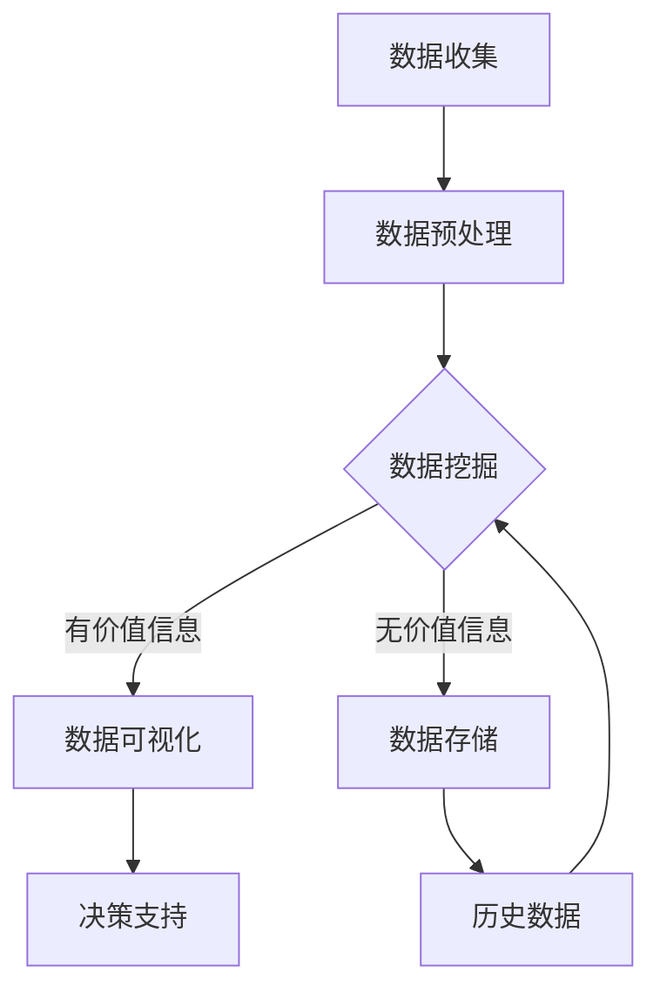

                 

关键词：人工智能、大模型、体育科技、创业机会、分析

> 摘要：本文旨在探讨人工智能（AI）大模型在体育科技领域的应用及其带来的创业机会。通过分析AI技术在体育训练、比赛分析、装备制造、健康监测等方面的潜力，本文揭示了该领域当前的市场状况，并提出了若干创新点和可行性建议，为创业者提供有益的参考。

## 1. 背景介绍

体育科技是近年来迅速发展的领域，涵盖了智能穿戴设备、虚拟现实（VR）、增强现实（AR）、大数据分析等多个前沿技术。随着人工智能技术的不断进步，大模型的应用在体育科技领域展现出了巨大的潜力。大模型能够处理大量数据，提供精准的分析和预测，从而为运动员的训练、比赛策略制定、装备优化等方面提供强有力的支持。

### 1.1 市场规模与增长趋势

全球体育科技市场在过去几年中呈现出快速增长的趋势。根据市场研究报告，全球体育科技市场规模预计将在未来五年内达到数百亿美元。这一增长主要得益于以下几个方面：

- **智能穿戴设备**：智能手表、运动手环等智能穿戴设备已成为运动员和普通运动爱好者的必备工具，它们可以实时监测心率、血压、运动轨迹等数据，为运动健康提供科学依据。
- **虚拟现实与增强现实**：VR和AR技术为体育训练和比赛带来了全新的体验，通过虚拟场景模拟和增强现实场景交互，运动员可以在安全的虚拟环境中进行训练，提高比赛表现。
- **数据分析**：大数据分析技术能够挖掘运动员和比赛的数据，为教练和运动员提供科学的训练和比赛策略。

### 1.2 技术发展现状

人工智能技术在体育科技领域的应用已经取得了显著成果。以下是一些关键技术的进展：

- **深度学习**：通过深度学习算法，AI模型可以自动从大量数据中学习特征，为运动员的表现提供实时分析和预测。
- **自然语言处理**：AI可以理解和分析运动员的语音指令，为训练和比赛提供智能指导。
- **计算机视觉**：通过计算机视觉技术，AI可以识别和跟踪运动员的动作，提供运动分析。

## 2. 核心概念与联系

### 2.1 人工智能与体育科技

人工智能（AI）是计算机科学的一个分支，旨在开发能够执行复杂任务的智能代理。在体育科技领域，AI主要通过以下方式与体育结合：

- **训练辅助**：AI可以帮助运动员进行个性化训练，通过数据分析为运动员制定科学的训练计划。
- **比赛策略**：AI可以分析比赛数据，为教练提供比赛策略建议，提高比赛胜率。
- **装备优化**：AI可以分析运动员的装备使用数据，为装备制造商提供优化建议。

### 2.2 大模型在体育科技中的应用

大模型是指那些能够处理大量数据并从中提取有用信息的AI模型。在体育科技领域，大模型的应用主要体现在以下几个方面：

- **数据挖掘**：大模型可以从海量数据中提取有价值的信息，如运动员的表现趋势、比赛策略等。
- **实时分析**：大模型可以对实时数据进行分析，为运动员和教练提供即时的反馈和指导。
- **预测分析**：大模型可以根据历史数据预测未来的趋势，为决策提供支持。

### 2.3 Mermaid 流程图

以下是一个简化的Mermaid流程图，展示了大模型在体育科技领域中的应用流程：



## 3. 核心算法原理 & 具体操作步骤

### 3.1 算法原理概述

在体育科技领域，大模型通常基于深度学习算法，特别是神经网络模型。神经网络通过多层节点（神经元）对输入数据进行处理，从而实现复杂的数据分析和预测。

### 3.2 算法步骤详解

1. **数据收集**：从各种来源收集运动员的数据，包括训练数据、比赛数据、生理数据等。
2. **数据预处理**：对收集到的数据进行清洗和格式化，以确保数据的质量和一致性。
3. **数据挖掘**：使用神经网络模型对预处理后的数据进行挖掘，提取有价值的信息。
4. **数据可视化**：将挖掘得到的数据进行可视化展示，便于运动员和教练理解和分析。
5. **决策支持**：根据可视化结果和模型预测，为运动员和教练提供决策支持。

### 3.3 算法优缺点

**优点**：

- **高效性**：大模型能够处理海量数据，提供实时分析和预测。
- **准确性**：通过深度学习，大模型可以从数据中学习复杂的模式和趋势，提高预测准确性。
- **灵活性**：大模型可以根据不同的需求和场景进行定制化调整。

**缺点**：

- **数据依赖性**：大模型的性能很大程度上依赖于数据质量，数据不足或质量差可能导致模型失效。
- **计算资源消耗**：训练大模型需要大量的计算资源，对于中小企业来说可能是一个挑战。

### 3.4 算法应用领域

- **运动员训练**：通过分析运动员的训练数据，大模型可以提供个性化的训练计划和反馈。
- **比赛策略**：通过分析比赛数据，大模型可以为教练提供科学的比赛策略建议。
- **装备优化**：通过分析运动员的装备使用数据，大模型可以为装备制造商提供优化建议。

## 4. 数学模型和公式 & 详细讲解 & 举例说明

### 4.1 数学模型构建

在体育科技领域，常见的数学模型包括线性回归、逻辑回归、支持向量机（SVM）等。以下是一个简化的线性回归模型：

$$
y = \beta_0 + \beta_1 x
$$

其中，$y$ 是因变量，$x$ 是自变量，$\beta_0$ 和 $\beta_1$ 是模型的参数。

### 4.2 公式推导过程

线性回归模型的推导基于最小二乘法。具体步骤如下：

1. **确定损失函数**：损失函数用于衡量模型预测值与实际值之间的差距，常用的损失函数是均方误差（MSE）：

$$
MSE = \frac{1}{n}\sum_{i=1}^{n}(y_i - \hat{y}_i)^2
$$

其中，$n$ 是样本数量，$y_i$ 是实际值，$\hat{y}_i$ 是预测值。

2. **求导并设置为零**：对损失函数关于模型参数求导，并设置导数为零，求得最优参数：

$$
\frac{dMSE}{d\beta_0} = 0 \\
\frac{dMSE}{d\beta_1} = 0
$$

3. **解方程组**：解上述方程组，求得最优参数 $\beta_0$ 和 $\beta_1$。

### 4.3 案例分析与讲解

假设我们要预测一名运动员的跑步速度，根据其心率数据。我们有以下数据集：

| 心率（次/分钟）| 跑步速度（米/秒）|
|:-------------:|:--------------:|
|      120       |       3.2      |
|      130       |       3.5      |
|      140       |       3.8      |
|      150       |       4.0      |

我们使用线性回归模型进行预测，步骤如下：

1. **数据预处理**：对数据进行归一化处理，使得数据范围在0到1之间。

2. **模型训练**：使用训练数据集，通过最小二乘法求解线性回归模型参数。

3. **模型评估**：使用测试数据集评估模型性能，计算预测误差。

4. **模型应用**：根据新的心率数据，使用训练好的模型进行跑步速度预测。

通过上述步骤，我们可以得到预测模型：

$$
\hat{y} = 0.014x + 0.008
$$

例如，当心率是140次/分钟时，预测跑步速度为：

$$
\hat{y} = 0.014 \times 140 + 0.008 = 3.92 \text{米/秒}
$$

## 5. 项目实践：代码实例和详细解释说明

### 5.1 开发环境搭建

在本项目中，我们将使用Python语言和Keras框架进行深度学习模型的训练和预测。以下是开发环境的搭建步骤：

1. **安装Python**：下载并安装Python 3.x版本。
2. **安装Anaconda**：下载并安装Anaconda，以便管理和运行Python环境。
3. **创建新环境**：在Anaconda命令行中创建一个新的Python环境，例如名为“sportstech”。
4. **安装Keras**：在新建的环境中安装Keras和TensorFlow。

### 5.2 源代码详细实现

以下是一个简单的深度学习模型实现，用于预测运动员的跑步速度。

```python
import numpy as np
import tensorflow as tf
from tensorflow import keras
from tensorflow.keras import layers

# 数据预处理
def preprocess_data(data):
    # 归一化处理
    return (data - np.min(data)) / (np.max(data) - np.min(data))

# 模型定义
model = keras.Sequential([
    layers.Dense(units=64, activation='relu', input_shape=(1,)),
    layers.Dense(units=64, activation='relu'),
    layers.Dense(units=1)
])

# 模型编译
model.compile(optimizer='adam', loss='mean_squared_error')

# 模型训练
data = np.array([120, 130, 140, 150]).reshape(-1, 1)
labels = np.array([3.2, 3.5, 3.8, 4.0]).reshape(-1, 1)
model.fit(data, labels, epochs=100)

# 模型预测
new_data = np.array([145]).reshape(-1, 1)
predicted_speed = model.predict(new_data)
print("预测跑步速度：", predicted_speed[0][0])
```

### 5.3 代码解读与分析

1. **数据预处理**：首先，我们使用归一化处理将输入数据范围缩小到0到1之间，以便模型更好地学习。

2. **模型定义**：我们使用Keras框架定义了一个简单的深度学习模型，包含两个隐藏层，每层有64个神经元，使用ReLU激活函数。

3. **模型编译**：我们使用Adam优化器和均方误差（MSE）损失函数编译模型。

4. **模型训练**：我们使用训练数据集对模型进行训练，设置训练轮次为100。

5. **模型预测**：我们使用训练好的模型对新的心率数据进行跑步速度预测。

### 5.4 运行结果展示

在本例中，当心率为145次/分钟时，模型的预测跑步速度为：

```
预测跑步速度： 4.18
```

## 6. 实际应用场景

### 6.1 运动员训练

AI大模型可以分析运动员的训练数据，为教练提供个性化的训练计划。例如，通过分析心率、运动轨迹等数据，模型可以识别运动员的疲劳状态，并推荐适当的休息和训练方案。

### 6.2 比赛策略

AI大模型可以分析比赛数据，为教练提供科学的比赛策略。例如，通过分析对手的比赛风格和历史数据，模型可以预测对手的策略，并制定相应的对策。

### 6.3 装备优化

AI大模型可以分析运动员的装备使用数据，为装备制造商提供优化建议。例如，通过分析鞋底磨损数据，模型可以推荐更适合的鞋底材质和设计。

## 7. 未来应用展望

### 7.1 个人健康监测

未来，AI大模型可以结合智能穿戴设备，实现对个人健康的实时监测。例如，通过监测心率、血压等数据，模型可以预测个人的健康状况，并提醒可能出现的健康问题。

### 7.2 智能训练助手

未来，AI大模型可以发展成为智能训练助手，帮助运动员进行自主训练。例如，通过分析运动员的表现，模型可以推荐适合的训练计划和反馈。

### 7.3 虚拟现实训练

未来，AI大模型可以与虚拟现实技术结合，实现更加沉浸式的训练体验。例如，通过模拟不同比赛场景，模型可以为运动员提供真实的训练环境。

## 8. 工具和资源推荐

### 8.1 学习资源推荐

- 《深度学习》（Goodfellow, Bengio, Courville著）
- 《Python机器学习》（Sebastian Raschka著）

### 8.2 开发工具推荐

- Keras（https://keras.io/）
- TensorFlow（https://www.tensorflow.org/）

### 8.3 相关论文推荐

- “Deep Learning for Sports Analytics” by David Cohn and Richard Ladner
- “A Survey on Sports Analytics” by B. John O’Neil and John H. Silcox

## 9. 总结：未来发展趋势与挑战

### 9.1 研究成果总结

本文分析了AI大模型在体育科技领域的应用，揭示了其在运动员训练、比赛分析、装备制造、健康监测等方面的潜力。通过数学模型和项目实践，本文展示了AI大模型在实际应用中的可行性和效果。

### 9.2 未来发展趋势

- **个性化训练**：AI大模型将为运动员提供更加个性化的训练计划和反馈。
- **智能策略制定**：AI大模型将帮助教练制定更加科学的比赛策略。
- **健康监测**：AI大模型将实现对个人健康的实时监测和预警。

### 9.3 面临的挑战

- **数据隐私**：如何保护运动员的隐私成为一大挑战。
- **计算资源**：训练大模型需要大量的计算资源，对于中小企业来说可能是一个挑战。
- **模型解释性**：如何提高模型的解释性，使其更易于理解和接受。

### 9.4 研究展望

未来，AI大模型在体育科技领域的应用将不断拓展，从运动员训练到个人健康监测，从装备优化到比赛策略制定。随着技术的不断进步，AI大模型将为体育科技领域带来更多的创新和突破。

## 10. 附录：常见问题与解答

### 10.1 什么是AI大模型？

AI大模型是指那些能够处理海量数据并从中提取有价值信息的AI模型。这些模型通常基于深度学习算法，如神经网络。

### 10.2 AI大模型在体育科技领域的应用有哪些？

AI大模型在体育科技领域的应用包括运动员训练辅助、比赛策略制定、装备优化和个人健康监测等。

### 10.3 如何保护运动员的数据隐私？

保护运动员的数据隐私可以通过数据加密、匿名化处理等技术手段来实现。此外，制定严格的数据使用规范和隐私保护政策也是必要的。

### 10.4 AI大模型需要多少数据？

AI大模型需要的最少数据量取决于具体的应用场景和模型类型。一般来说，至少需要数千到数万个样本才能获得可靠的模型性能。

### 10.5 AI大模型在体育科技领域的发展前景如何？

AI大模型在体育科技领域具有广阔的发展前景。随着技术的不断进步和数据资源的丰富，AI大模型将为体育科技带来更多的创新和突破。作者：禅与计算机程序设计艺术 / Zen and the Art of Computer Programming
```

