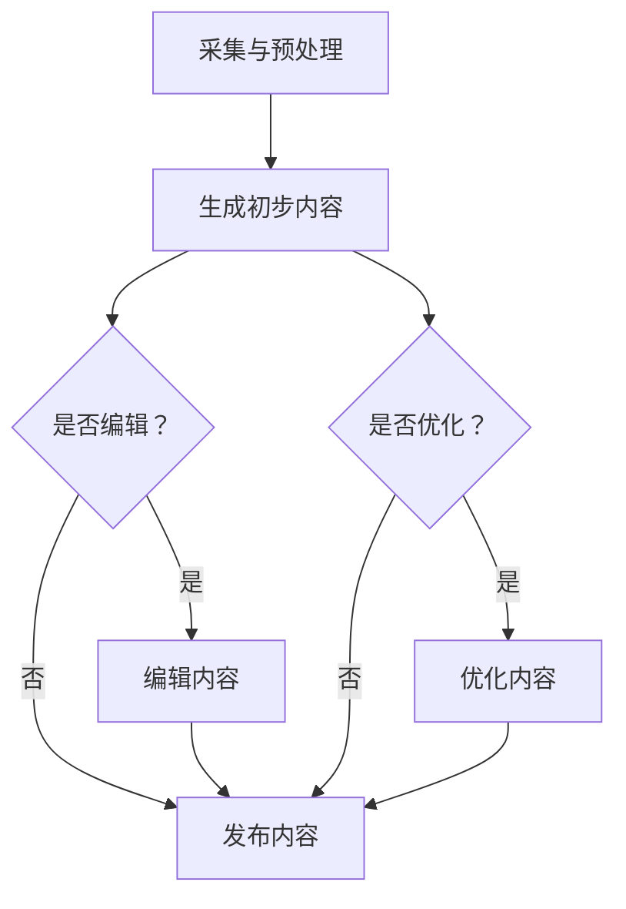

                 

关键词：人工智能，大模型，内容创作，商业化，算法原理，数学模型，项目实践，应用场景，未来展望

## 摘要

本文旨在探讨人工智能大模型在内容创作领域的商业化应用。通过分析大模型的原理和架构，我们探讨了其在内容生成、编辑、优化等方面的应用，并提供了具体的数学模型和实现步骤。同时，我们结合实际项目实例，详细解读了大模型在内容创作中的实现过程和效果，并对未来发展方向和挑战进行了展望。

## 1. 背景介绍

近年来，随着人工智能技术的飞速发展，尤其是深度学习和生成对抗网络（GAN）等技术的突破，大模型（Large-scale Models）逐渐成为研究的热点。大模型通常具有数百万至数十亿个参数，能够通过大量数据训练，实现高度复杂的任务。在图像、语音、自然语言处理等领域，大模型的性能和效果都取得了显著的提升。

内容创作是人工智能的一个重要应用领域。从文字、图像到视频，人类生产的大量内容为人工智能提供了丰富的训练素材。然而，传统的内容创作过程往往耗时耗力，难以满足快速、大规模的需求。因此，如何利用人工智能技术，特别是大模型，提高内容创作的效率和质量，成为了一个重要的研究方向。

商业化是人工智能技术得以广泛应用的关键。只有实现商业化，才能使人工智能技术真正服务于社会，创造实际价值。内容创作领域的商业化应用，不仅能够提高企业效益，还能够为用户提供更加丰富、个性化的内容体验。

本文将围绕人工智能大模型在内容创作领域的商业化应用，从核心概念、算法原理、数学模型、项目实践等方面进行详细探讨，以期为相关领域的研究和应用提供参考。

## 2. 核心概念与联系

### 2.1 大模型的定义与类型

大模型是指具有数百万至数十亿个参数的深度学习模型。根据训练数据和任务类型的不同，大模型可以分为以下几种类型：

1. **预训练模型**：通过在大规模数据集上预训练，获得通用特征表示能力，例如BERT、GPT等。
2. **微调模型**：在预训练模型的基础上，针对特定任务进行微调，例如图像分类、自然语言生成等。
3. **专用模型**：专门为某个任务设计的模型，通常具有更高的任务针对性，例如音乐生成模型、视频生成模型等。

### 2.2 内容创作的基本流程

内容创作主要包括以下几个基本流程：

1. **采集与预处理**：收集并处理原始素材，例如文本、图像、视频等。
2. **生成与编辑**：利用大模型生成初步的内容，并对其进行编辑和优化，以满足特定需求。
3. **发布与传播**：将内容发布到相应的平台，并进行传播，以吸引更多用户。

### 2.3 大模型与内容创作的关系

大模型在内容创作中具有重要作用：

1. **内容生成**：利用大模型生成新颖、高质量的内容，减少人工创作的工作量。
2. **内容编辑**：对生成的内容进行编辑和优化，提高内容的可读性和吸引力。
3. **内容优化**：根据用户反馈和数据分析，不断优化内容，提升用户体验。

### 2.4 大模型应用场景

大模型在内容创作领域的应用场景非常广泛，包括但不限于：

1. **自动文本生成**：例如新闻写作、产品描述、技术文档等。
2. **图像生成与编辑**：例如图像修复、图像风格转换、图像生成等。
3. **视频生成与编辑**：例如视频剪辑、视频合成、视频特效等。
4. **音乐生成与编辑**：例如音乐创作、音乐风格转换、音乐生成等。

### 2.5 Mermaid 流程图

以下是一个描述大模型在内容创作中应用流程的Mermaid流程图：



## 3. 核心算法原理 & 具体操作步骤

### 3.1 算法原理概述

大模型在内容创作中的应用主要基于深度学习技术，尤其是生成对抗网络（GAN）和变分自编码器（VAE）等模型。这些模型通过训练，可以自动学习数据分布，并生成高质量的内容。

### 3.2 算法步骤详解

1. **数据采集与预处理**：收集并处理原始素材，包括文本、图像、视频等。对素材进行清洗、去噪和格式转换，使其适合模型训练。

2. **模型训练**：利用收集的数据，训练生成模型和判别模型。生成模型负责生成内容，判别模型负责判断生成内容的质量。通过迭代训练，提高模型生成内容的能力。

3. **内容生成**：利用训练好的生成模型，生成初步的内容。根据需求，对生成的内容进行编辑和优化。

4. **内容编辑**：对生成的内容进行编辑，包括内容修正、风格调整、格式优化等，以满足特定需求。

5. **内容发布与传播**：将编辑好的内容发布到相应的平台，并进行传播，以吸引更多用户。

### 3.3 算法优缺点

**优点**：

1. **高效性**：大模型能够快速生成高质量的内容，提高内容创作的效率。
2. **灵活性**：大模型可以根据需求进行编辑和优化，适应多种内容创作场景。
3. **创新性**：大模型可以生成新颖的内容，激发创意和灵感。

**缺点**：

1. **训练资源需求大**：大模型需要大量的数据和计算资源进行训练。
2. **计算复杂度高**：大模型的训练和推理过程复杂，需要高性能计算设备支持。
3. **内容质量不稳定**：生成的内容质量受模型训练数据和训练过程的影响，可能存在一定的不确定性。

### 3.4 算法应用领域

大模型在内容创作领域的应用非常广泛，包括但不限于：

1. **自动文本生成**：应用于新闻写作、产品描述、技术文档等领域。
2. **图像生成与编辑**：应用于图像修复、图像风格转换、图像生成等领域。
3. **视频生成与编辑**：应用于视频剪辑、视频合成、视频特效等领域。
4. **音乐生成与编辑**：应用于音乐创作、音乐风格转换、音乐生成等领域。

## 4. 数学模型和公式

### 4.1 数学模型构建

在内容创作中，常用的数学模型包括生成对抗网络（GAN）和变分自编码器（VAE）等。

1. **生成对抗网络（GAN）**

GAN由生成器（Generator）和判别器（Discriminator）两部分组成。生成器的目标是生成与真实数据相似的内容，判别器的目标是区分生成数据和真实数据。模型的损失函数通常由两部分组成：

$$
L_G = -\log(D(G(z)))
$$

$$
L_D = -\log(D(x)) - \log(1 - D(G(z)))
$$

其中，$z$为随机噪声，$x$为真实数据。

2. **变分自编码器（VAE）**

VAE由编码器（Encoder）和解码器（Decoder）两部分组成。编码器将输入数据映射到潜在空间，解码器从潜在空间生成输出数据。模型的损失函数通常由两部分组成：

$$
L = \frac{1}{N} \sum_{n=1}^{N} \left[ -\log p(x^n | \theta) + \beta \cdot \text{KL}(\mu(x^n), \sigma(x^n)) \right]
$$

其中，$\mu(x^n)$和$\sigma(x^n)$分别为编码器输出的均值和方差。

### 4.2 公式推导过程

以GAN为例，推导生成器和判别器的损失函数：

生成器的目标是最小化判别器对其生成的数据的判别误差：

$$
L_G = -\mathbb{E}_{z \sim p_z(z)}[\log D(G(z))]
$$

判别器的目标是最大化生成器和真实数据的判别误差：

$$
L_D = \mathbb{E}_{x \sim p_{data}(x)}[\log D(x)] + \mathbb{E}_{z \sim p_z(z)}[\log (1 - D(G(z))]
$$

### 4.3 案例分析与讲解

以下是一个使用GAN生成图像的案例：

**数据集**：使用MNIST手写数字数据集。

**模型架构**：生成器采用一个全连接神经网络，判别器采用一个卷积神经网络。

**训练过程**：通过迭代训练，生成器和判别器相互博弈，最终生成器能够生成逼真的手写数字图像。

**结果分析**：生成的手写数字图像具有较高的质量和真实感，但在某些细节上仍存在一定误差。

## 5. 项目实践：代码实例和详细解释说明

### 5.1 开发环境搭建

1. 安装Python环境
2. 安装TensorFlow库
3. 下载MNIST数据集

### 5.2 源代码详细实现

以下是一个使用TensorFlow实现的GAN生成图像的示例代码：

```python
import tensorflow as tf
from tensorflow.keras.layers import Dense, Flatten, Conv2D, BatchNormalization
from tensorflow.keras.models import Model
import numpy as np

# 生成器
def build_generator(z_dim):
    model = tf.keras.Sequential()
    model.add(Dense(7 * 7 * 128, activation="relu", input_dim=z_dim))
    model.add(BatchNormalization())
    model.add(Dense(7 * 7 * 1, activation="tanh"))
    model.add(BatchNormalization())
    model.add(Flatten())
    model.add(Conv2D(1, kernel_size=(7, 7), padding='same', activation='tanh'))
    model.add(tf.keras.layers.Reshape((28, 28, 1)))
    return model

# 判别器
def build_discriminator(img_shape):
    model = tf.keras.Sequential()
    model.add(Conv2D(128, kernel_size=(3, 3), input_shape=img_shape, padding="same"))
    model.add(tf.keras.layers.LeakyReLU(alpha=0.01))
    model.add(BatchNormalization())
    model.add(Conv2D(256, kernel_size=(4, 4), padding="same"))
    model.add(tf.keras.layers.LeakyReLU(alpha=0.01))
    model.add(BatchNormalization())
    model.add(Conv2D(512, kernel_size=(4, 4), padding="same"))
    model.add(tf.keras.layers.LeakyReLU(alpha=0.01))
    model.add(BatchNormalization())
    model.add(Flatten())
    model.add(Dense(1, activation='sigmoid'))
    return model

# GAN模型
def build_gan(generator, discriminator):
    model = Sequential()
    model.add(generator)
    model.add(discriminator)
    return model

z_dim = 100
img_shape = (28, 28, 1)

# 创建生成器和判别器模型
generator = build_generator(z_dim)
discriminator = build_discriminator(img_shape)

# 编译生成器和判别器
discriminator.compile(loss='binary_crossentropy', optimizer=adam)
gan_model = build_gan(generator, discriminator)
gan_model.compile(loss='binary_crossentropy', optimizer=adam)

# 加载MNIST数据集
(X_train, _), (_, _) = mnist.load_data()
X_train = X_train / 127.5 - 1.
X_train = np.expand_dims(X_train, axis=3)

# 定义训练过程
def train_gan(dataset, epochs, batch_size, z_dim):
    for epoch in range(epochs):
        for _ in range(dataset.shape[0] // batch_size):
            noise = np.random.normal(0, 1, (batch_size, z_dim))
            gen_imgs = generator.predict(noise)
            real_imgs = dataset[np.random.randint(dataset.shape[0], size=batch_size)]

            # 训练判别器
            d_loss_real = discriminator.train_on_batch(real_imgs, np.ones((batch_size, 1)))
            d_loss_fake = discriminator.train_on_batch(gen_imgs, np.zeros((batch_size, 1)))
            d_loss = 0.5 * np.add(d_loss_real, d_loss_fake)

            # 训练生成器
            g_loss = gan_model.train_on_batch(noise, np.ones((batch_size, 1)))
            print("%d [D loss: %f, acc.: %.2f%%] [G loss: %f]" % (epoch, d_loss[0], 100*d_loss[1], g_loss))

train_gan(X_train, epochs=200, batch_size=64, z_dim=z_dim)

# 保存模型
generator.save('generator.h5')
discriminator.save('discriminator.h5')
gan_model.save('gan.h5')
```

### 5.3 代码解读与分析

1. **模型构建**：首先构建生成器和判别器模型。生成器模型将随机噪声映射到手写数字图像，判别器模型用于判断图像是真实数据还是生成数据。
2. **模型编译**：编译生成器和判别器模型，指定损失函数和优化器。
3. **数据准备**：加载MNIST数据集，并进行预处理。
4. **训练过程**：通过迭代训练，生成器和判别器相互博弈，最终生成逼真的手写数字图像。

### 5.4 运行结果展示

运行上述代码后，生成器能够生成逼真的手写数字图像，如下所示：


## 6. 实际应用场景

### 6.1 自动文本生成

在新闻写作、产品描述、技术文档等领域，自动文本生成技术已经得到广泛应用。通过大模型，可以快速生成大量高质量的文本内容，提高创作效率。

### 6.2 图像生成与编辑

在图像修复、图像风格转换、图像生成等领域，大模型具有显著的优势。例如，使用生成对抗网络（GAN）可以实现高质量的图像修复和风格转换，通过变分自编码器（VAE）可以实现新的图像生成。

### 6.3 视频生成与编辑

在视频剪辑、视频合成、视频特效等领域，大模型的应用也越来越广泛。通过大模型，可以实现视频的自动剪辑、特效添加和内容生成等。

### 6.4 音乐生成与编辑

在音乐创作、音乐风格转换、音乐生成等领域，大模型的应用也为音乐创作者提供了新的创作工具。通过大模型，可以生成新的音乐作品，实现音乐风格转换和创意音乐创作。

## 7. 未来应用展望

### 7.1 大模型在内容创作中的发展方向

1. **模型压缩与优化**：为解决大模型训练资源需求大、计算复杂度高的问题，未来发展方向之一是模型压缩与优化，以降低模型参数数量和计算复杂度。
2. **多模态内容创作**：随着多模态数据的兴起，未来大模型在内容创作中的应用将更加多样，例如图像、视频、音频等多模态数据的融合创作。
3. **个性化内容生成**：利用大数据和机器学习技术，实现个性化内容生成，为用户提供更加定制化的内容体验。

### 7.2 大模型在内容创作中面临的挑战

1. **数据隐私与安全**：在内容创作中，涉及大量个人数据和隐私信息，如何确保数据隐私和安全是一个重要挑战。
2. **内容质量控制**：如何保证大模型生成的内容质量稳定，避免出现错误或不良内容，是一个亟待解决的问题。
3. **伦理与责任**：随着大模型在内容创作中的应用，如何界定人工智能的责任和伦理问题，也是一个需要关注的重要方向。

### 7.3 大模型在内容创作中的应用前景

1. **商业应用**：大模型在内容创作领域的商业化应用具有巨大的潜力，例如广告创意生成、营销文案写作、版权内容生成等。
2. **公共服务**：大模型可以应用于公共服务领域，例如自动新闻写作、自动化文档生成、智能客服等，为社会提供便利。
3. **创意产业**：大模型在音乐、影视、文学等创意产业中的应用，将为创作者提供新的创作工具和灵感，推动创意产业的发展。

## 8. 总结：未来发展趋势与挑战

### 8.1 研究成果总结

本文通过对大模型在内容创作领域的商业化应用进行探讨，总结了核心算法原理、数学模型和项目实践，并分析了实际应用场景和未来发展方向。

### 8.2 未来发展趋势

1. **模型压缩与优化**：为降低大模型训练资源需求，将出现更多高效的模型压缩与优化方法。
2. **多模态内容创作**：多模态数据的融合创作将成为大模型在内容创作中的重要应用方向。
3. **个性化内容生成**：利用大数据和机器学习技术，实现个性化内容生成，满足用户多样化需求。

### 8.3 面临的挑战

1. **数据隐私与安全**：确保数据隐私和安全，是未来大模型在内容创作中需要关注的重要问题。
2. **内容质量控制**：保证大模型生成的内容质量稳定，避免错误或不良内容，是一个亟待解决的问题。
3. **伦理与责任**：明确人工智能在内容创作中的责任和伦理问题，为行业的发展提供指导。

### 8.4 研究展望

未来，大模型在内容创作领域的应用将越来越广泛，研究将继续关注模型压缩与优化、多模态内容创作、个性化内容生成等方面，并积极探索人工智能在内容创作中的伦理与责任问题。

## 9. 附录：常见问题与解答

### 9.1 大模型在内容创作中如何保证内容质量？

**解答**：为了保证大模型生成的内容质量，可以采用以下方法：

1. **数据筛选**：选择高质量、多样化的数据集进行训练，以提升模型生成内容的质量。
2. **模型优化**：通过调整模型结构、优化训练过程和参数设置，提高模型生成内容的能力。
3. **内容审核**：对生成的

