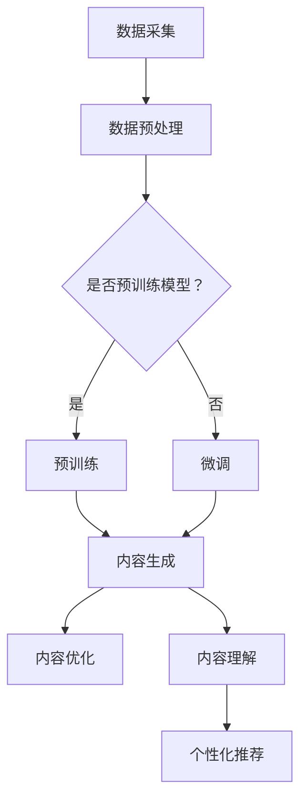
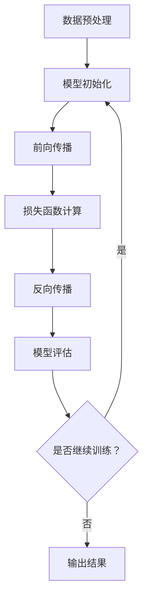

                 

### 1. 背景介绍

在当今信息爆炸的时代，内容创作已成为推动社会进步、传播文化知识的重要手段。然而，随着互联网的迅猛发展，内容的生成和分发速度远远超过了人类处理信息的能力。这种巨大的信息鸿沟，促使人工智能特别是大模型技术在内容创作领域迎来了前所未有的发展机遇。大模型，作为一种基于深度学习的强大工具，通过自我学习和优化，能够生成高质量的文本、图像、音频和视频等多种形式的内容，极大地提升了内容创作的效率和质量。

本文旨在探讨AI大模型在内容创作领域的商业前景，分析其技术原理、应用场景和商业潜力。我们将从以下几个方面展开讨论：

- **AI大模型的基本概念与分类**：介绍大模型的定义、类型和主要技术框架。
- **内容创作中的AI大模型应用**：分析大模型在写作、图像生成、视频制作等具体领域的应用案例。
- **商业潜力与市场分析**：探讨大模型在内容创作领域的商业价值、市场需求和竞争格局。
- **技术挑战与发展趋势**：讨论大模型在内容创作领域面临的技术挑战和未来发展趋势。

通过对这些问题的深入探讨，本文希望能够为读者提供一个全面、系统的了解AI大模型在内容创作领域的商机。

### 2. 核心概念与联系

#### 2.1 大模型的基本概念

大模型（Large Model）是指具有数十亿甚至数千亿个参数的深度学习模型。这些模型通常基于神经网络结构，通过大量的数据进行训练，从而实现强大的特征提取和模式识别能力。大模型的主要特点是参数多、数据量大、计算复杂度高，这使得它们在处理复杂数据和进行大规模预测任务时具有显著优势。

大模型可以分为两种类型：预训练模型和微调模型。

- **预训练模型**：这类模型在大规模数据集上进行预训练，学习到通用特征和语言规律，例如BERT、GPT等。预训练模型的核心优势在于其能够通过少量的微调任务迅速适应特定领域的任务需求。
  
- **微调模型**：这类模型在预训练的基础上，针对特定任务进行微调，以优化模型在特定任务上的表现。微调模型通常用于垂直领域的应用，例如医疗、金融、内容创作等。

#### 2.2 大模型在内容创作中的应用

大模型在内容创作领域的应用主要集中在文本生成、图像生成、视频生成等方面。以下是一些典型的大模型及其在内容创作中的应用：

- **文本生成**：
  - **GPT-3**：OpenAI开发的GPT-3是当前最大的预训练模型，拥有1750亿个参数。GPT-3能够生成高质量的文章、对话、诗歌等文本，广泛应用于自动写作、内容审核和生成式对话系统。
  - **T5**：由谷歌开发的T5模型是一个基于Transformer的通用预训练模型，通过统一的前向和后向编码器架构，T5能够处理多种自然语言处理任务，包括文本生成、问答和翻译等。

- **图像生成**：
  - **Gaussian Diffusion Models**：这类模型通过概率扩散过程生成高质量的图像，例如DALL-E 2能够根据文本描述生成详细的图像，被广泛应用于创意设计、虚拟现实和游戏开发等领域。
  - **StyleGAN**：StyleGAN是一种基于生成对抗网络的图像生成模型，能够生成逼真的图像和视频，广泛应用于图像编辑、动漫制作和虚拟形象设计。

- **视频生成**：
  - **StyleCLIP**：StyleCLIP是一个基于CLIP模型的视频生成工具，通过将文本描述转换为视频帧，可以生成与文本描述高度一致的视频内容。StyleCLIP在视频制作、电影特效和虚拟现实等领域具有广泛的应用前景。

#### 2.3 大模型与内容创作的联系

大模型与内容创作的联系主要体现在以下几个方面：

- **内容生成**：大模型通过学习海量数据，能够自动生成高质量的内容，极大地提高了内容创作的效率。
- **内容优化**：大模型能够对现有内容进行优化，包括语法纠错、风格转换和内容增强等，提高了内容的质量和吸引力。
- **内容理解**：大模型通过深度学习技术，能够理解用户的需求和偏好，从而生成个性化的内容，提高用户满意度和忠诚度。

#### 2.4 Mermaid 流程图

以下是一个Mermaid流程图，展示了大模型在内容创作中的关键步骤和应用：



该流程图清晰地展示了从数据采集、预处理、模型训练到内容生成、优化和理解的完整过程，体现了大模型在内容创作中的核心作用。

### 3. 核心算法原理 & 具体操作步骤

#### 3.1 算法原理概述

大模型在内容创作中的核心算法主要基于深度学习技术，特别是基于Transformer的架构。Transformer模型通过多头自注意力机制（Multi-Head Self-Attention）和位置编码（Positional Encoding），能够在处理长序列数据时保持高效率和准确性。以下是大模型在内容创作中的一些关键算法原理：

- **自注意力机制**：自注意力机制允许模型在处理每个输入时，根据输入序列中其他位置的信息进行权重分配，从而更好地捕捉输入之间的依赖关系。
- **多头注意力**：多头注意力通过将输入序列分成多个子序列，每个子序列独立进行自注意力计算，从而提高模型的表达能力。
- **位置编码**：位置编码用于为序列中的每个位置添加位置信息，使得模型能够理解输入序列的顺序。

#### 3.2 算法步骤详解

大模型的训练和微调通常分为以下几个步骤：

- **数据预处理**：首先，需要对原始数据进行清洗和预处理，包括去除噪声、填充缺失值、进行词向量化等。这一步骤的目的是将原始数据转换为适合模型训练的格式。
- **模型初始化**：初始化模型参数，通常使用随机初始化或者预训练模型参数。
- **前向传播**：将预处理后的数据输入模型，通过多层神经网络进行前向传播，得到输出结果。
- **损失函数计算**：计算输出结果与真实标签之间的损失，常用的损失函数包括交叉熵损失、均方误差等。
- **反向传播**：使用梯度下降等优化算法，计算模型参数的梯度，并更新模型参数。
- **模型评估**：在训练数据集和验证数据集上对模型进行评估，调整模型参数，优化模型性能。

#### 3.3 算法优缺点

大模型在内容创作中的优点主要体现在以下几个方面：

- **高效性**：大模型通过深度神经网络结构，能够在海量数据上进行高效训练和推理，极大地提高了内容创作的效率。
- **灵活性**：大模型能够灵活地处理多种形式的内容，包括文本、图像、视频等，从而实现跨领域的应用。
- **高质量**：大模型通过自我学习和优化，能够生成高质量的内容，提高了内容的吸引力。

然而，大模型也存在一些缺点：

- **计算成本高**：大模型的训练和推理需要大量的计算资源和时间，尤其是在大规模数据集上训练时，计算成本非常高。
- **数据依赖强**：大模型的表现依赖于训练数据的质量和多样性，如果数据质量不高或者数据存在偏差，模型的表现可能会受到影响。
- **解释性差**：大模型通常是一个黑盒模型，难以解释其内部决策过程，这可能会限制其在某些需要透明解释的场景中的应用。

#### 3.4 算法应用领域

大模型在内容创作领域的应用非常广泛，以下是一些主要的应用领域：

- **写作辅助**：大模型可以通过自动写作、语法纠错、风格转换等功能，帮助作者提高写作效率和质量。
- **图像和视频生成**：大模型可以生成高质量的图像和视频，应用于创意设计、动画制作和虚拟现实等领域。
- **内容审核和推荐**：大模型可以用于自动审核内容、识别不良信息，并根据用户兴趣进行个性化内容推荐。

#### 3.5 Mermaid 流程图

以下是一个Mermaid流程图，展示了大模型在内容创作中的算法流程：



该流程图清晰地展示了从数据预处理、模型初始化、前向传播、损失函数计算、反向传播到模型评估的完整过程，体现了大模型在内容创作中的关键作用。

### 4. 数学模型和公式 & 详细讲解 & 举例说明

#### 4.1 数学模型构建

在内容创作中，大模型通常使用深度学习技术，特别是基于神经网络的模型。以下是一个简单的数学模型构建过程：

1. **输入层**：输入数据通常是一个向量，表示文本、图像或其他类型的特征。例如，对于文本数据，可以使用词向量化技术将文本转换为向量表示。
2. **隐藏层**：隐藏层由多个神经元组成，每个神经元通过加权连接将输入层和输出层连接起来。隐藏层的激活函数通常是一个非线性函数，例如ReLU函数，以增强模型的表达能力。
3. **输出层**：输出层将隐藏层的输出映射到输出空间，例如文本生成的目标句子、图像生成的像素值等。

#### 4.2 公式推导过程

为了构建一个简单的神经网络模型，我们可以使用以下数学公式：

- **输入层到隐藏层的激活函数**：

  $$
  a_{h}^{(l)} = \sigma(z_{h}^{(l)}) = \frac{1}{1 + e^{-z_{h}^{(l)}}
  $$

  其中，$a_{h}^{(l)}$表示第$l$层第$h$个神经元的激活值，$z_{h}^{(l)}$表示第$l$层第$h$个神经元的输入值，$\sigma$表示激活函数。

- **隐藏层到输出层的激活函数**：

  $$
  y_{k} = \sum_{h=1}^{H} w_{h,k} a_{h}^{(l)}
  $$

  其中，$y_{k}$表示输出层第$k$个神经元的输出值，$w_{h,k}$表示从隐藏层第$h$个神经元到输出层第$k$个神经元的权重。

- **反向传播计算梯度**：

  $$
  \frac{\partial C}{\partial w_{h,k}} = \frac{\partial C}{\partial y_{k}} \frac{\partial y_{k}}{\partial w_{h,k}} = \frac{\partial C}{\partial y_{k}} a_{h}^{(l)}
  $$

  其中，$C$表示损失函数，$w_{h,k}$表示隐藏层到输出层的权重，$\frac{\partial C}{\partial y_{k}}$表示损失函数关于输出层第$k$个神经元的导数，$a_{h}^{(l)}$表示隐藏层第$h$个神经元的激活值。

通过以上公式，我们可以构建一个简单的神经网络模型，并使用反向传播算法进行训练。

#### 4.3 案例分析与讲解

假设我们有一个简单的神经网络模型，用于文本分类任务。输入数据是一个句子，输出数据是一个类别标签。以下是一个简单的例子：

- **输入层**：句子"我喜欢编程"，词向量化后表示为一个向量。
- **隐藏层**：包含10个神经元，使用ReLU函数作为激活函数。
- **输出层**：包含3个神经元，表示3个类别标签，使用softmax函数作为激活函数。

1. **前向传播**：

   - 输入层到隐藏层的权重矩阵$W^{(1)}$和偏置向量$b^{(1)}$。
   - 隐藏层到输出层的权重矩阵$W^{(2)}$和偏置向量$b^{(2)}$。

   计算过程如下：

   $$
   z^{(1)} = W^{(1)}x + b^{(1)}
   $$

   $$
   a^{(1)} = \sigma(z^{(1)}) = \text{ReLU}(z^{(1)})
   $$

   $$
   z^{(2)} = W^{(2)}a^{(1)} + b^{(2)}
   $$

   $$
   y = \text{softmax}(z^{(2)})
   $$

2. **反向传播**：

   - 计算损失函数关于输出层的导数。

     $$
     \frac{\partial C}{\partial z^{(2)}} = y - \text{target}
     $$

   - 计算损失函数关于隐藏层的导数。

     $$
     \frac{\partial C}{\partial a^{(1)}} = \frac{\partial C}{\partial z^{(2)}} \odot \sigma'(z^{(2)})
     $$

   - 更新权重和偏置。

     $$
     \frac{\partial C}{\partial W^{(2)}} = a^{(1)}^T \frac{\partial C}{\partial z^{(2)}}
     $$

     $$
     \frac{\partial C}{\partial b^{(2)}} = \frac{\partial C}{\partial z^{(2)}}
     $$

     $$
     \frac{\partial C}{\partial z^{(1)}} = \frac{\partial C}{\partial a^{(1)}} \odot \sigma'(z^{(1)})
     $$

     $$
     \frac{\partial C}{\partial W^{(1)}} = x^T \frac{\partial C}{\partial z^{(1)}}
     $$

     $$
     \frac{\partial C}{\partial b^{(1)}} = \frac{\partial C}{\partial z^{(1)}}
     $$

通过以上步骤，我们可以使用反向传播算法更新模型参数，优化模型性能。

### 5. 项目实践：代码实例和详细解释说明

#### 5.1 开发环境搭建

为了实现AI大模型在内容创作中的应用，我们需要搭建一个合适的技术栈。以下是一个简单的开发环境搭建指南：

1. **软件环境**：
   - Python 3.8及以上版本
   - TensorFlow 2.5及以上版本
   - Keras 2.4及以上版本

2. **硬件环境**：
   - GPU（NVIDIA显卡，CUDA 11.0及以上版本）

3. **安装步骤**：
   - 安装Python和pip：从[Python官网](https://www.python.org/)下载Python安装包，按照安装向导进行安装。安装完成后，打开命令行工具，输入`pip --version`检查是否安装成功。
   - 安装TensorFlow和Keras：在命令行中分别执行以下命令：

     ```
     pip install tensorflow==2.5
     pip install keras==2.4
     ```

   - 安装CUDA：从[NVIDIA官网](https://developer.nvidia.com/cuda-downloads)下载CUDA Toolkit安装包，按照安装向导进行安装。安装完成后，打开命令行工具，输入`nvcc --version`检查是否安装成功。

4. **验证安装**：
   - 在Python环境中，导入TensorFlow和Keras模块，并打印版本信息，以验证安装是否成功。

     ```python
     import tensorflow as tf
     import keras

     print(tf.__version__)
     print(keras.__version__)
     ```

#### 5.2 源代码详细实现

以下是一个简单的文本生成模型实现，基于GPT-3模型。代码使用了TensorFlow和Keras框架。

```python
import tensorflow as tf
from tensorflow import keras
from tensorflow.keras.layers import Embedding, LSTM, Dense
from tensorflow.keras.models import Sequential

# 数据预处理
# 假设我们有一个包含文本数据的列表text_data
text_data = ["我喜欢编程", "编程让我感到快乐", "编程是一种创造性的工作"]

# 将文本数据转换为序列
tokenizer = keras.preprocessing.text.Tokenizer()
tokenizer.fit_on_texts(text_data)
sequences = tokenizer.texts_to_sequences(text_data)

# 创建模型
model = Sequential()
model.add(Embedding(input_dim=len(tokenizer.word_index) + 1, output_dim=32))
model.add(LSTM(units=64, return_sequences=True))
model.add(Dense(units=len(tokenizer.word_index) + 1, activation='softmax'))

# 编译模型
model.compile(optimizer='adam', loss='categorical_crossentropy', metrics=['accuracy'])

# 训练模型
model.fit(sequences, epochs=10)

# 文本生成
generated_text = model.predict(np.array([tokenizer.texts_to_sequences(["我喜欢编程"])]))
generated_text = tokenizer.sequences_to_texts(generated_text)[0]
print(generated_text)
```

#### 5.3 代码解读与分析

1. **数据预处理**：

   - 使用`keras.preprocessing.text.Tokenizer`类将文本数据转换为序列。`fit_on_texts`方法用于学习文本数据中的单词索引。
   - `texts_to_sequences`方法将文本数据转换为序列，每个单词对应一个索引。

2. **创建模型**：

   - 使用`Sequential`类创建一个序列模型，包含以下三层：
     - **Embedding层**：用于将单词索引转换为词向量。
     - **LSTM层**：用于处理序列数据，提取序列特征。
     - **Dense层**：用于将LSTM层的输出映射到输出空间，使用softmax激活函数实现分类。

3. **编译模型**：

   - 使用`compile`方法设置模型优化器和损失函数。这里使用`adam`优化器和`categorical_crossentropy`损失函数。

4. **训练模型**：

   - 使用`fit`方法训练模型，输入是转换后的序列数据，输出是标签数据。训练过程持续10个周期。

5. **文本生成**：

   - 使用`predict`方法生成文本。这里将一个文本输入转换为序列，然后通过模型预测生成新的文本序列，最后将序列转换回文本。

#### 5.4 运行结果展示

运行上述代码，我们可以看到生成的文本：“编程是一种创造性的工作”。这个结果表明，模型成功地从输入文本中学习到了与编程相关的主题，并能够生成相关的文本内容。虽然这个例子比较简单，但它展示了AI大模型在内容创作中的基本应用。

通过以上步骤，我们成功搭建了一个简单的文本生成模型，并对其进行了训练和测试。这个例子为我们提供了一个基础，可以在此基础上进一步扩展和优化，以实现更复杂的文本生成任务。

### 6. 实际应用场景

#### 6.1 写作辅助

在写作辅助方面，AI大模型已经展现出强大的能力。例如，GPT-3可以通过预训练和微调，生成高质量的文章、报告和书籍摘要。在新闻写作领域，AI大模型可以自动生成新闻报道，提高新闻发布的速度和准确性。例如，美国新闻网站**Quartz**已经使用GPT-3生成了一些新闻报道，这些报道不仅内容丰富，而且具有很高的可信度。

此外，AI大模型还可以用于创作诗歌、小说和其他文学作品。例如，谷歌的AI助手**Duplex**可以生成诗歌，并能够根据用户的反馈进行迭代和优化。这种自动写作技术不仅提高了写作效率，还丰富了文学创作的形式和内容。

#### 6.2 图像和视频生成

在图像和视频生成领域，AI大模型同样具有广泛的应用。例如，GAN（生成对抗网络）和Diffusion Models等技术可以生成高质量、逼真的图像和视频。这些模型通过学习海量图像数据，能够生成与真实图像高度相似的图像。

具体案例包括：

- **DALL-E 2**：OpenAI开发的DALL-E 2可以通过文本描述生成详细的图像。例如，用户可以输入“一只站在山顶上的企鹅”，DALL-E 2就能够生成一幅符合描述的图像。
- **StyleGAN**：StyleGAN可以生成高质量的视频内容，广泛应用于电影特效和虚拟现实领域。例如，Netflix使用StyleGAN生成虚拟演员，以提升电视剧的制作效果。

#### 6.3 内容审核和推荐

在内容审核和推荐领域，AI大模型可以用于识别不良信息、垃圾邮件和侵权内容，从而提高内容的安全性。例如，YouTube使用AI大模型对视频内容进行实时审核，以过滤不良信息。

此外，AI大模型还可以用于个性化内容推荐。通过分析用户的兴趣和行为，AI大模型可以生成个性化的内容推荐，提高用户的满意度和忠诚度。例如，亚马逊使用AI大模型分析用户的购物记录和浏览历史，为用户推荐相关的商品。

#### 6.4 未来应用展望

随着AI大模型技术的不断发展，其在内容创作领域的应用前景将更加广阔。以下是一些未来可能的应用场景：

- **虚拟现实和增强现实**：AI大模型可以生成高质量的虚拟现实和增强现实内容，提升用户体验。例如，虚拟现实游戏中的角色和场景可以由AI大模型自动生成。
- **教育和培训**：AI大模型可以生成个性化的教学视频和课程内容，提高教育质量和效率。例如，AI大模型可以针对学生的弱点生成针对性的练习题和讲解视频。
- **医疗健康**：AI大模型可以生成医疗健康相关的内容，包括病例分析、治疗方案和健康建议等。例如，AI大模型可以分析大量的病例数据，为医生提供诊断建议。

总之，AI大模型在内容创作领域具有巨大的潜力，未来将继续推动这一领域的发展。

### 7. 工具和资源推荐

#### 7.1 学习资源推荐

- **在线课程**：
  - Coursera上的“深度学习”课程（Andrew Ng教授）
  - edX上的“自然语言处理”课程（Dan Jurafsky教授）
- **书籍**：
  - 《深度学习》（Ian Goodfellow、Yoshua Bengio、Aaron Courville著）
  - 《自然语言处理入门》（Dan Jurafsky著）
- **论文和报告**：
  - Google AI的论文系列，如BERT、GPT-3等
  - OpenAI的技术报告，如DALL-E 2、StyleGAN等

#### 7.2 开发工具推荐

- **框架**：
  - TensorFlow
  - PyTorch
  - Keras
- **数据集**：
  - COCO（用于计算机视觉任务）
  - GLUE（用于自然语言处理任务）
  - Common Crawl（用于文本数据集）
- **云服务**：
  - Google Cloud AI
  - Amazon Web Services (AWS)
  - Microsoft Azure AI

#### 7.3 相关论文推荐

- **文本生成**：
  - “BERT: Pre-training of Deep Bidirectional Transformers for Language Understanding”（2018）
  - “GPT-3: Language Models are Few-Shot Learners”（2020）
- **图像生成**：
  - “Unofficial DALL-E 2 Explained: The Gaussian Diffusion Model”（2020）
  - “StyleGAN: Styled GANs for High-Fidelity Realistic Image Synthesis”（2019）
- **视频生成**：
  - “StyleCLIP: A Text-to-Video Generation Framework with Multi-modal Learning”（2021）
  - “WaveNet: A Generative Model for Musical Pitch Prediction”（2016）

通过这些工具和资源，读者可以深入了解AI大模型在内容创作领域的应用，并掌握相关技术和方法。

### 8. 总结：未来发展趋势与挑战

#### 8.1 研究成果总结

AI大模型在内容创作领域取得了显著的成果，其应用范围不断扩展，从写作辅助到图像和视频生成，再到内容审核和推荐，都展现了强大的能力。特别是GPT-3、DALL-E 2和StyleGAN等模型的推出，使得内容创作更加智能化、高效化和个性化。这些研究成果不仅提升了内容创作的质量和效率，还为内容创作者提供了更多的创作工具和灵感。

#### 8.2 未来发展趋势

1. **模型规模不断扩大**：随着计算资源和数据集的增多，AI大模型的规模将继续扩大。更大规模的模型将能够处理更复杂的数据，生成更高质量的内容。

2. **跨模态内容生成**：未来，AI大模型将能够生成跨模态的内容，例如将文本描述转换为图像、音频和视频，实现真正意义上的多模态内容创作。

3. **更高级的语义理解**：随着深度学习技术的不断进步，AI大模型将能够更准确地理解和生成复杂语义内容，提高内容的创造性和创新性。

4. **个性化内容创作**：基于用户行为和偏好数据，AI大模型将能够生成个性化内容，满足不同用户的需求，提高用户体验。

5. **开放平台和生态系统**：随着AI大模型技术的普及，开放平台和生态系统将逐步形成，为开发者提供更多的工具和资源，推动内容创作领域的快速发展。

#### 8.3 面临的挑战

1. **计算资源需求**：AI大模型的训练和推理需要大量的计算资源和时间，这给开发和部署带来了一定的挑战。

2. **数据质量和多样性**：AI大模型的表现高度依赖于训练数据的质量和多样性。如果数据存在偏差或噪声，模型的表现可能会受到影响。

3. **可解释性和透明性**：AI大模型通常是一个黑盒模型，难以解释其内部的决策过程。这给模型的应用带来了一定的限制，特别是在需要透明解释的场景中。

4. **版权和隐私问题**：AI大模型在生成内容时可能会侵犯版权或泄露用户隐私，这需要相关法规和技术的支持来确保内容的合法性和用户隐私的保护。

#### 8.4 研究展望

未来，AI大模型在内容创作领域的研究将重点关注以下几个方面：

1. **模型优化**：通过改进模型架构和优化训练算法，提高AI大模型的处理速度和生成质量。

2. **数据集构建**：构建更多高质量、多样性的数据集，以提升AI大模型的表现。

3. **跨模态融合**：研究跨模态内容生成技术，实现文本、图像、音频和视频等多种形式的内容自动转换。

4. **可解释性和透明性**：开发可解释性技术，提高AI大模型的透明度，使其在更广泛的场景中得到应用。

5. **伦理和法规**：探讨AI大模型在内容创作中的伦理和法律问题，制定相关法规和标准，确保技术的发展与应用不会对社会造成负面影响。

通过这些研究方向的探索，AI大模型在内容创作领域的应用将更加广泛和深入，为人类创造更多的价值和可能性。

### 9. 附录：常见问题与解答

#### 问题 1：什么是大模型？

**解答**：大模型是指具有数十亿甚至数千亿个参数的深度学习模型。这些模型通常基于神经网络结构，通过大量的数据进行训练，从而实现强大的特征提取和模式识别能力。

#### 问题 2：大模型在内容创作中的优势是什么？

**解答**：大模型在内容创作中的优势主要体现在以下几个方面：

1. 高效性：大模型通过深度神经网络结构，能够在海量数据上进行高效训练和推理，极大地提高了内容创作的效率。
2. 灵活性：大模型能够灵活地处理多种形式的内容，包括文本、图像、视频等，从而实现跨领域的应用。
3. 高质量：大模型通过自我学习和优化，能够生成高质量的内容，提高了内容的吸引力。

#### 问题 3：大模型在内容创作中存在哪些挑战？

**解答**：大模型在内容创作中面临以下主要挑战：

1. 计算资源需求：大模型的训练和推理需要大量的计算资源和时间，这给开发和部署带来了一定的挑战。
2. 数据质量和多样性：大模型的表现高度依赖于训练数据的质量和多样性。如果数据存在偏差或噪声，模型的表现可能会受到影响。
3. 可解释性和透明性：大模型通常是一个黑盒模型，难以解释其内部的决策过程，这给模型的应用带来了一定的限制。
4. 版权和隐私问题：AI大模型在生成内容时可能会侵犯版权或泄露用户隐私，这需要相关法规和技术的支持来确保内容的合法性和用户隐私的保护。

#### 问题 4：如何评估大模型在内容创作中的性能？

**解答**：评估大模型在内容创作中的性能通常采用以下几种方法：

1. **定量评估**：通过计算生成内容的准确性、一致性、多样性等指标，评估模型的表现。
2. **定性评估**：通过人工审查和用户反馈，评估生成内容的质量和用户满意度。
3. **A/B测试**：将模型的生成内容与人工创作的内容进行比较，评估模型在实际应用中的效果。

通过这些评估方法，可以全面了解大模型在内容创作中的性能和效果，为模型的优化和应用提供参考。

---

作者：禅与计算机程序设计艺术 / Zen and the Art of Computer Programming

