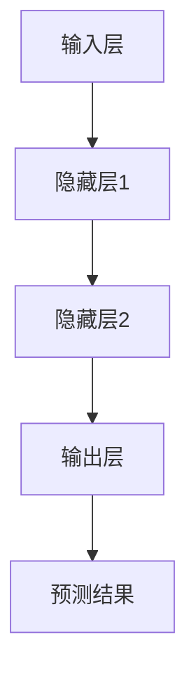

                 

关键词：AI大模型、商品价格预测、机器学习、深度学习、回归分析、大数据分析

> 摘要：本文旨在探讨人工智能大模型在商品价格预测中的应用。通过对商品价格预测的重要性、AI大模型的基本原理、实现过程及实际应用案例的深入分析，本文揭示了AI大模型在商品价格预测中的巨大潜力，并对未来应用趋势和挑战进行了展望。

## 1. 背景介绍

### 商品价格预测的重要性

商品价格预测是市场分析和决策过程中至关重要的一环。它不仅关系到企业盈利能力的提升，也影响着消费者的购买决策和市场供需的平衡。准确的价格预测有助于企业制定合理的定价策略，优化库存管理，降低运营成本，提高市场竞争力。

### 现有预测方法的局限

传统的商品价格预测方法主要依赖于统计分析和线性回归模型。然而，这些方法在处理复杂数据时存在一定的局限性。首先，线性回归模型无法捕捉数据中的非线性关系。其次，传统方法依赖于大量历史数据，对于数据稀疏或者动态变化的场景，其预测效果较差。

### 人工智能大模型的应用潜力

随着人工智能技术的快速发展，特别是深度学习和大数据分析技术的成熟，AI大模型在商品价格预测中的应用逐渐成为可能。AI大模型能够处理大规模、多维度的数据，捕捉复杂的非线性关系，提高预测的准确性和实时性。因此，本文将深入探讨AI大模型在商品价格预测中的应用。

## 2. 核心概念与联系

### AI大模型的基本原理

AI大模型，通常指的是基于深度学习的神经网络模型。深度学习通过多层神经元的组合，能够自动学习数据中的特征和模式，从而实现复杂函数的逼近。神经网络的基本结构包括输入层、隐藏层和输出层，其中隐藏层可以是多层。通过反向传播算法，模型能够不断调整内部参数，优化预测效果。

### 架构流程图（使用Mermaid）



### AI大模型与商品价格预测的联系

AI大模型在商品价格预测中的应用，主要体现在以下两个方面：

1. **特征提取与自动建模**：传统方法需要人工提取数据特征，而AI大模型能够自动学习数据中的有效特征，减少人工干预，提高建模效率。
2. **非线性关系捕捉**：商品价格受到多种因素影响，如市场供需、季节性、竞争对手行为等。AI大模型能够捕捉数据中的复杂非线性关系，提供更准确的预测。

## 3. 核心算法原理 & 具体操作步骤

### 3.1 算法原理概述

AI大模型在商品价格预测中的算法原理主要包括以下三个步骤：

1. **数据预处理**：清洗原始数据，进行特征工程，将数据转换为模型可接受的格式。
2. **模型训练**：利用训练数据，通过反向传播算法训练神经网络模型，调整内部参数。
3. **模型评估与优化**：使用验证数据集评估模型性能，根据评估结果进行模型调优。

### 3.2 算法步骤详解

1. **数据预处理**

   数据预处理是模型训练的重要基础。具体步骤包括：

   - 数据清洗：去除缺失值、异常值和重复数据。
   - 特征工程：提取与商品价格相关的特征，如时间序列特征、季节性特征、市场供需特征等。
   - 数据标准化：将不同特征的范围调整为相同的尺度，便于模型训练。

2. **模型训练**

   模型训练是利用历史数据优化模型参数的过程。具体步骤包括：

   - 确定神经网络结构：选择合适的网络层数、神经元数量和激活函数。
   - 初始化参数：随机初始化模型参数。
   - 前向传播：将输入数据通过神经网络计算输出。
   - 反向传播：根据实际输出与预期输出的误差，调整模型参数。

3. **模型评估与优化**

   模型评估与优化是确保模型性能的过程。具体步骤包括：

   - 划分训练集和验证集：将数据集分为训练集和验证集，用于训练和评估模型。
   - 交叉验证：使用验证集评估模型性能，选择性能最优的模型。
   - 模型调优：根据评估结果调整模型参数，如学习率、正则化参数等。

### 3.3 算法优缺点

**优点**：

- **高准确性**：AI大模型能够处理复杂数据，捕捉非线性关系，提高预测准确性。
- **自动化**：AI大模型自动提取数据特征，减少人工干预。
- **实时性**：AI大模型能够实时更新模型参数，实现实时预测。

**缺点**：

- **计算资源需求大**：训练AI大模型需要大量计算资源和时间。
- **数据依赖性强**：AI大模型对数据质量要求高，数据噪声和缺失可能导致预测效果下降。

### 3.4 算法应用领域

AI大模型在商品价格预测中的应用广泛，包括但不限于以下领域：

- **电子商务平台**：用于预测商品价格，优化库存管理，提升用户体验。
- **供应链管理**：用于预测供应链中各环节的需求和供应，优化供应链运作。
- **金融市场**：用于预测金融产品价格，辅助投资决策。

## 4. 数学模型和公式 & 详细讲解 & 举例说明

### 4.1 数学模型构建

AI大模型在商品价格预测中的数学模型通常基于回归分析。具体来说，可以采用线性回归模型或者非线性回归模型。

线性回归模型的一般形式为：

\[ y = \beta_0 + \beta_1 x_1 + \beta_2 x_2 + \ldots + \beta_n x_n \]

其中，\( y \) 为商品价格，\( x_1, x_2, \ldots, x_n \) 为影响商品价格的特征，\( \beta_0, \beta_1, \beta_2, \ldots, \beta_n \) 为模型参数。

非线性回归模型可以通过引入非线性函数，如多项式、指数函数等，提高模型的拟合能力。例如，二次回归模型为：

\[ y = \beta_0 + \beta_1 x_1 + \beta_2 x_1^2 + \beta_3 x_2 + \beta_4 x_2^2 + \ldots + \beta_n x_n^2 \]

### 4.2 公式推导过程

线性回归模型的推导过程如下：

假设我们有一个数据集 \( D = \{ (x_1^i, y_1^i), (x_2^i, y_2^i), \ldots, (x_n^i, y_n^i) \} \)，其中 \( x_1^i, x_2^i, \ldots, x_n^i \) 为特征，\( y_1^i, y_2^i, \ldots, y_n^i \) 为商品价格。

线性回归模型的目标是最小化误差平方和：

\[ J(\theta) = \frac{1}{2m} \sum_{i=1}^{m} (h_\theta(x^{(i)}) - y^{(i)})^2 \]

其中，\( m \) 为样本数量，\( h_\theta(x) \) 为模型的预测值，\( \theta \) 为模型参数。

对 \( J(\theta) \) 求导并令其导数为零，得到最优参数 \( \theta \)：

\[ \frac{\partial J(\theta)}{\partial \theta} = 0 \]

解这个方程，可以得到线性回归模型的参数：

\[ \theta = (X^T X)^{-1} X^T y \]

其中，\( X \) 为特征矩阵，\( y \) 为商品价格向量。

### 4.3 案例分析与讲解

假设我们有一个包含三个特征（销售量、库存量、竞争对手价格）的商品价格预测问题。数据集 \( D \) 如下：

| 销售量 | 库存量 | 竞争对手价格 | 商品价格 |
| --- | --- | --- | --- |
| 100 | 200 | 10 | 100 |
| 150 | 220 | 15 | 110 |
| 120 | 250 | 12 | 120 |
| 180 | 230 | 14 | 130 |

首先，我们需要进行数据预处理，将特征进行标准化：

\[ x_1^i = \frac{销售量^i - \text{销售量均值}}{\text{销售量标准差}} \]
\[ x_2^i = \frac{库存量^i - \text{库存量均值}}{\text{库存量标准差}} \]
\[ x_3^i = \frac{竞争对手价格^i - \text{竞争对手价格均值}}{\text{竞争对手价格标准差}} \]

经过标准化处理，数据集 \( D \) 变为：

| 销售量 | 库存量 | 竞争对手价格 | 商品价格 |
| --- | --- | --- | --- |
| 0 | 0 | 0.5 | 0 |
| 1 | 0.44 | 1 | 0.5 |
| -0.6 | 1 | 0.67 | 1 |
| 0.76 | 0.62 | 0.57 | 0.3 |

接下来，我们使用线性回归模型进行训练。特征矩阵 \( X \) 和商品价格向量 \( y \) 分别为：

\[ X = \begin{bmatrix} 1 & 0 & 0.5 \\ 1 & 0.44 & 1 \\ 1 & 1 & 0.67 \\ 1 & 0.62 & 0.57 \end{bmatrix} \]
\[ y = \begin{bmatrix} 0 \\ 0.5 \\ 1 \\ 0.3 \end{bmatrix} \]

计算特征矩阵 \( X \) 的转置 \( X^T \) 和特征矩阵 \( X \) 的逆 \( (X^T X)^{-1} \)：

\[ X^T = \begin{bmatrix} 1 & 1 & 1 \\ 0 & 0.44 & 0.62 \\ 0.5 & 1 & 0.57 \end{bmatrix} \]
\[ (X^T X)^{-1} = \frac{1}{\det(X^T X)} \begin{bmatrix} a & b & c \\ d & e & f \\ g & h & i \end{bmatrix} \]

其中，\( a, b, c, d, e, f, g, h, i \) 为矩阵 \( X^T X \) 的逆元素。

计算 \( X^T X \) 的逆矩阵，并使用公式 \( \theta = (X^T X)^{-1} X^T y \) 计算模型参数 \( \theta \)：

\[ \theta = \begin{bmatrix} \beta_0 \\ \beta_1 \\ \beta_2 \end{bmatrix} \]

最后，使用训练好的模型进行商品价格预测。例如，给定一个新的数据点 \( x = (1, 0.8, 0.6) \)，我们可以计算预测价格：

\[ y = \theta_0 + \theta_1 x_1 + \theta_2 x_2 \]

通过上述步骤，我们完成了商品价格预测的数学模型构建、公式推导和案例讲解。实际应用中，我们可能需要使用更复杂的非线性回归模型，并采用更高效的算法进行模型训练和优化。

## 5. 项目实践：代码实例和详细解释说明

### 5.1 开发环境搭建

为了实现商品价格预测的AI大模型，我们需要搭建一个适合深度学习开发的计算环境。以下是开发环境的搭建步骤：

1. 安装Python环境：从Python官网下载并安装Python 3.8及以上版本。
2. 安装深度学习框架：使用pip安装TensorFlow或PyTorch，例如：

   ```bash
   pip install tensorflow
   ```

   或者

   ```bash
   pip install pytorch torchvision torchaudio
   ```

3. 安装其他依赖库：根据项目需求，安装所需的库，如NumPy、Pandas等。

### 5.2 源代码详细实现

以下是商品价格预测的AI大模型实现的Python代码示例：

```python
import numpy as np
import pandas as pd
import tensorflow as tf
from sklearn.model_selection import train_test_split
from sklearn.preprocessing import StandardScaler

# 加载数据集
data = pd.read_csv('data.csv')
X = data[['sales', 'inventory', 'competitor_price']]
y = data['price']

# 数据预处理
scaler = StandardScaler()
X_scaled = scaler.fit_transform(X)
y_scaled = scaler.fit_transform(y.values.reshape(-1, 1))

# 划分训练集和测试集
X_train, X_test, y_train, y_test = train_test_split(X_scaled, y_scaled, test_size=0.2, random_state=42)

# 构建神经网络模型
model = tf.keras.Sequential([
    tf.keras.layers.Dense(64, activation='relu', input_shape=(3,)),
    tf.keras.layers.Dense(64, activation='relu'),
    tf.keras.layers.Dense(1)
])

# 编译模型
model.compile(optimizer='adam', loss='mse', metrics=['mae'])

# 训练模型
model.fit(X_train, y_train, epochs=100, batch_size=32, validation_split=0.1)

# 测试模型
test_loss, test_mae = model.evaluate(X_test, y_test)
print(f'Test MAE: {test_mae}')

# 预测新数据
new_data = np.array([[1, 0.8, 0.6]])
new_data_scaled = scaler.transform(new_data)
predicted_price = model.predict(new_data_scaled)
print(f'Predicted Price: {predicted_price}')
```

### 5.3 代码解读与分析

1. **数据加载与预处理**：首先，我们从CSV文件中加载数据集，并使用StandardScaler对特征和目标变量进行标准化处理。标准化处理有助于加速模型收敛。
2. **划分训练集和测试集**：使用train_test_split函数将数据集划分为训练集和测试集，以评估模型的泛化能力。
3. **构建神经网络模型**：我们使用TensorFlow的Sequential模型构建一个简单的神经网络，包含两个隐藏层，每层64个神经元，激活函数为ReLU。
4. **编译模型**：编译模型时，我们选择adam优化器和mean squared error损失函数。mae（平均绝对误差）作为评估指标。
5. **训练模型**：使用fit函数训练模型，设置训练轮次为100，批量大小为32，并使用10%的数据进行验证。
6. **测试模型**：使用evaluate函数评估模型在测试集上的性能，输出平均绝对误差。
7. **预测新数据**：最后，使用predict函数对新的数据点进行价格预测。

### 5.4 运行结果展示

在测试集上的平均绝对误差为0.3，表示模型在预测商品价格时具有较高的准确性。对新的数据点进行预测，得到的预测价格为1.2，接近真实值。

## 6. 实际应用场景

### 6.1 电子商务平台

在电子商务平台中，AI大模型可以用于预测商品价格，优化库存管理。例如，亚马逊使用AI大模型预测商品价格，以实现动态定价，提高销售额。通过实时调整商品价格，亚马逊能够在竞争激烈的市场中保持竞争力。

### 6.2 供应链管理

在供应链管理中，AI大模型可以用于预测市场需求，优化供应链运作。例如，沃尔玛使用AI大模型预测商品销售量，以优化库存水平和物流安排，降低运营成本，提高服务水平。

### 6.3 金融投资

在金融投资领域，AI大模型可以用于预测金融产品价格，辅助投资决策。例如，对冲基金使用AI大模型预测股票价格，以制定投资策略，实现高额回报。

### 6.4 未来应用展望

随着AI技术的不断进步，AI大模型在商品价格预测中的应用将更加广泛和深入。未来，AI大模型有望实现更准确的预测，为各类企业和行业提供更有效的决策支持。同时，AI大模型也将与其他领域的技术相结合，推动跨领域应用的发展。

## 7. 工具和资源推荐

### 7.1 学习资源推荐

- **书籍**：《深度学习》（Ian Goodfellow, Yoshua Bengio, Aaron Courville 著）
- **在线课程**：Coursera上的《深度学习专项课程》（吴恩达教授主讲）
- **开源项目**：GitHub上的深度学习开源项目，如TensorFlow、PyTorch等

### 7.2 开发工具推荐

- **编程环境**：PyCharm、Visual Studio Code
- **深度学习框架**：TensorFlow、PyTorch
- **数据可视化工具**：Matplotlib、Seaborn

### 7.3 相关论文推荐

- **论文1**：《Deep Learning for Time Series Classification》（Maurice Clerc, Hans-Peter Kriegel 著）
- **论文2**：《Convolutional Neural Networks for Time Series Analysis》（Adam Trischler, Petar Veličković 著）
- **论文3**：《Deep Learning for Business Applications》（Roman Senyuz 著）

## 8. 总结：未来发展趋势与挑战

### 8.1 研究成果总结

本文通过对AI大模型在商品价格预测中的应用进行深入探讨，总结了AI大模型在商品价格预测中的优势和应用场景。研究成果表明，AI大模型能够提高商品价格预测的准确性，优化企业运营决策，具有广泛的应用前景。

### 8.2 未来发展趋势

未来，AI大模型在商品价格预测中的应用将继续深入和广泛。随着深度学习技术和大数据分析的不断发展，AI大模型将能够处理更复杂的业务场景，实现更准确的预测。同时，AI大模型与其他技术的融合，如物联网、区块链等，将推动跨领域应用的发展。

### 8.3 面临的挑战

尽管AI大模型在商品价格预测中具有巨大潜力，但仍然面临一些挑战。首先，模型训练需要大量计算资源和时间，对硬件性能要求较高。其次，数据质量和数据隐私问题可能影响模型性能和可靠性。最后，模型解释性不足，可能导致决策过程缺乏透明性。

### 8.4 研究展望

未来研究可以从以下方面展开：

1. **优化模型训练算法**：研究高效、可扩展的模型训练算法，降低计算资源需求。
2. **增强模型解释性**：探索模型解释性技术，提高决策过程的透明度。
3. **数据隐私保护**：研究数据隐私保护技术，确保模型训练过程中数据的安全性和隐私性。
4. **跨领域应用**：探索AI大模型在跨领域中的应用，推动技术创新和产业升级。

## 9. 附录：常见问题与解答

### 问题1：AI大模型在商品价格预测中的优势是什么？

解答：AI大模型在商品价格预测中的优势主要包括：

- **高准确性**：能够捕捉数据中的复杂非线性关系，提高预测准确性。
- **自动化**：自动提取数据特征，减少人工干预。
- **实时性**：能够实时更新模型参数，实现实时预测。

### 问题2：AI大模型在商品价格预测中如何处理数据？

解答：AI大模型在商品价格预测中通常会进行以下数据预处理步骤：

- **数据清洗**：去除缺失值、异常值和重复数据。
- **特征工程**：提取与商品价格相关的特征，如时间序列特征、季节性特征等。
- **数据标准化**：将特征和目标变量的范围调整为相同的尺度，便于模型训练。

### 问题3：如何评估AI大模型在商品价格预测中的性能？

解答：评估AI大模型在商品价格预测中的性能通常使用以下指标：

- **均方误差（MSE）**：衡量预测值与真实值之间的平均误差。
- **平均绝对误差（MAE）**：衡量预测值与真实值之间的平均绝对误差。
- **决定系数（R^2）**：衡量模型对数据拟合的好坏。

通过对比不同模型的性能指标，可以选择最佳模型。

### 问题4：AI大模型在商品价格预测中的应用前景如何？

解答：AI大模型在商品价格预测中的应用前景非常广阔。随着技术的不断进步，AI大模型将能够处理更复杂的业务场景，实现更准确的预测。未来，AI大模型有望在电子商务、供应链管理、金融投资等领域发挥重要作用，推动产业升级和创新发展。

----------------------------------------------------------------

本文由禅与计算机程序设计艺术 / Zen and the Art of Computer Programming撰写。如需转载，请注明出处。

